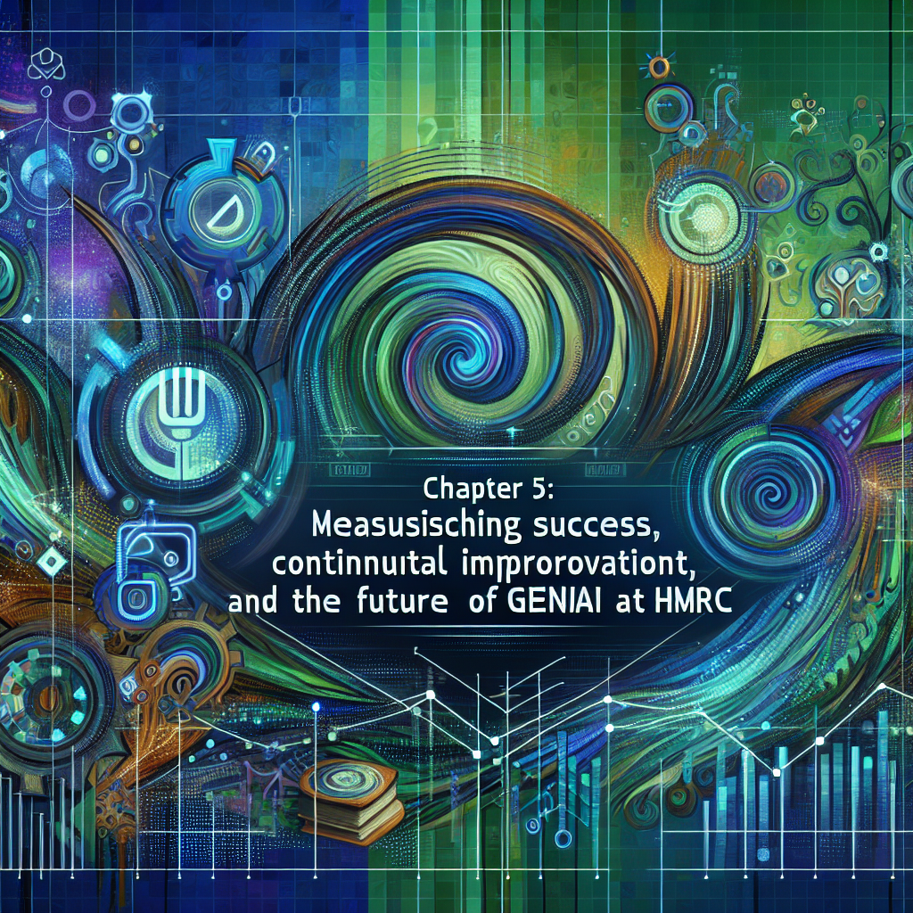

# GenAI for HMRC: A Practical Guide to Strategy, Implementation, and Ethical Governance

# Table of Contents

- [GenAI for HMRC: A Practical Guide to Strategy, Implementation, and Ethical Governance](#genai-for-hmrc-a-practical-guide-to-strategy-implementation-and-ethical-governance)
  - [Chapter 1: Understanding HMRC's GenAI Opportunity Landscape](#chapter-1-understanding-hmrcs-genai-opportunity-landscape)
    - [1.1: HMRC's Current State: Infrastructure, Goals, and Challenges](#11-hmrcs-current-state-infrastructure-goals-and-challenges)
      - [1.1.1: Overview of HMRC's Existing IT Infrastructure and Data Landscape](#111-overview-of-hmrcs-existing-it-infrastructure-and-data-landscape)
      - [1.1.2: Strategic Goals and Priorities for HMRC (Efficiency, Compliance, Customer Service)](#112-strategic-goals-and-priorities-for-hmrc-efficiency-compliance-customer-service)
      - [1.1.3: Key Pain Points and Areas for Improvement within HMRC Operations](#113-key-pain-points-and-areas-for-improvement-within-hmrc-operations)
      - [1.1.4: Identifying Opportunities for GenAI to Address HMRC's Challenges](#114-identifying-opportunities-for-genai-to-address-hmrcs-challenges)
    - [1.2: The GenAI Revolution: Potential Applications for HMRC](#12-the-genai-revolution-potential-applications-for-hmrc)
      - [1.2.1: Introduction to Generative AI: Capabilities and Limitations](#121-introduction-to-generative-ai-capabilities-and-limitations)
      - [1.2.2: GenAI Use Cases in Government and Tax Administration (Global Examples)](#122-genai-use-cases-in-government-and-tax-administration-global-examples)
      - [1.2.3: Specific GenAI Applications Relevant to HMRC: Customer Service, Compliance, Fraud Detection, Internal Processes](#123-specific-genai-applications-relevant-to-hmrc-customer-service-compliance-fraud-detection-internal-processes)
      - [1.2.4: Case Studies of Successful AI Implementations in Similar Organisations](#124-case-studies-of-successful-ai-implementations-in-similar-organisations)
    - [1.3: HMRC's Existing AI Initiatives: Building on Connect and Beyond](#13-hmrcs-existing-ai-initiatives-building-on-connect-and-beyond)
      - [1.3.1: Overview of HMRC's Current AI Systems (e.g., Connect)](#131-overview-of-hmrcs-current-ai-systems-eg-connect)
      - [1.3.2: Lessons Learned from Existing AI Implementations](#132-lessons-learned-from-existing-ai-implementations)
      - [1.3.3: Identifying Synergies and Opportunities to Integrate GenAI with Existing Systems](#133-identifying-synergies-and-opportunities-to-integrate-genai-with-existing-systems)
      - [1.3.4: Addressing Limitations of Current Systems with GenAI](#134-addressing-limitations-of-current-systems-with-genai)
  - [Chapter 2: Developing a Strategic GenAI Roadmap for HMRC](#chapter-2-developing-a-strategic-genai-roadmap-for-hmrc)
    - [2.1: Defining Clear Objectives and Key Performance Indicators (KPIs)](#21-defining-clear-objectives-and-key-performance-indicators-kpis)
      - [2.1.1: Aligning GenAI Objectives with HMRC's Strategic Goals](#211-aligning-genai-objectives-with-hmrcs-strategic-goals)
      - [2.1.2: Identifying Measurable KPIs for Each GenAI Use Case (e.g., Customer Satisfaction, Compliance Rates, Efficiency Savings)](#212-identifying-measurable-kpis-for-each-genai-use-case-eg-customer-satisfaction-compliance-rates-efficiency-savings)
      - [2.1.3: Setting Realistic Targets and Timelines for Implementation](#213-setting-realistic-targets-and-timelines-for-implementation)
      - [2.1.4: Establishing a Baseline for Measuring Improvement](#214-establishing-a-baseline-for-measuring-improvement)
    - [2.2: Prioritising Use Cases and Phased Implementation](#22-prioritising-use-cases-and-phased-implementation)
      - [2.2.1: Evaluating Potential GenAI Use Cases Based on Impact and Feasibility](#221-evaluating-potential-genai-use-cases-based-on-impact-and-feasibility)
      - [2.2.2: Developing a Phased Implementation Plan: Quick Wins vs. Long-Term Projects](#222-developing-a-phased-implementation-plan-quick-wins-vs-long-term-projects)
      - [2.2.3: Resource Allocation and Budgeting for Each Phase](#223-resource-allocation-and-budgeting-for-each-phase)
      - [2.2.4: Risk Assessment and Mitigation Strategies for Each Use Case](#224-risk-assessment-and-mitigation-strategies-for-each-use-case)
    - [2.3: Technology Stack and Infrastructure Requirements](#23-technology-stack-and-infrastructure-requirements)
      - [2.3.1: Assessing HMRC's Existing Technology Infrastructure](#231-assessing-hmrcs-existing-technology-infrastructure)
      - [2.3.2: Identifying Necessary Upgrades and Investments](#232-identifying-necessary-upgrades-and-investments)
      - [2.3.3: Evaluating Different AI Platforms and Tools (e.g., Microsoft Copilot)](#233-evaluating-different-ai-platforms-and-tools-eg-microsoft-copilot)
      - [2.3.4: Data Management and Governance Strategies for GenAI](#234-data-management-and-governance-strategies-for-genai)
  - [Chapter 3: Ethical Considerations, Risk Management, and Governance](#chapter-3-ethical-considerations-risk-management-and-governance)
    - [3.1: Addressing Data Privacy and Security Concerns](#31-addressing-data-privacy-and-security-concerns)
      - [3.1.1: Understanding Data Protection Regulations and Compliance Requirements (GDPR, UK Data Protection Act)](#311-understanding-data-protection-regulations-and-compliance-requirements-gdpr-uk-data-protection-act)
      - [3.1.2: Implementing Data Anonymization and Encryption Techniques](#312-implementing-data-anonymization-and-encryption-techniques)
      - [3.1.3: Establishing Secure Data Storage and Access Controls](#313-establishing-secure-data-storage-and-access-controls)
      - [3.1.4: Developing Incident Response Plans for Data Breaches](#314-developing-incident-response-plans-for-data-breaches)
    - [3.2: Mitigating Algorithmic Bias and Ensuring Fairness](#32-mitigating-algorithmic-bias-and-ensuring-fairness)
      - [3.2.1: Identifying Potential Sources of Bias in Training Data](#321-identifying-potential-sources-of-bias-in-training-data)
      - [3.2.2: Implementing Bias Detection and Mitigation Techniques](#322-implementing-bias-detection-and-mitigation-techniques)
      - [3.2.3: Ensuring Transparency and Explainability of AI Algorithms](#323-ensuring-transparency-and-explainability-of-ai-algorithms)
      - [3.2.4: Establishing a Framework for Auditing AI Systems for Fairness](#324-establishing-a-framework-for-auditing-ai-systems-for-fairness)
    - [3.3: Transparency, Explainability, and Accountability](#33-transparency-explainability-and-accountability)
      - [3.3.1: Designing AI Systems with Explainability in Mind](#331-designing-ai-systems-with-explainability-in-mind)
      - [3.3.2: Providing Clear Explanations of AI-Driven Decisions to Taxpayers](#332-providing-clear-explanations-of-ai-driven-decisions-to-taxpayers)
      - [3.3.3: Establishing Accountability Frameworks for AI Systems](#333-establishing-accountability-frameworks-for-ai-systems)
      - [3.3.4: Implementing Human Oversight and Intervention Mechanisms](#334-implementing-human-oversight-and-intervention-mechanisms)
    - [3.4: Legal and Regulatory Compliance](#34-legal-and-regulatory-compliance)
      - [3.4.1: Navigating the Evolving Legal Landscape of AI](#341-navigating-the-evolving-legal-landscape-of-ai)
      - [3.4.2: Ensuring Compliance with Relevant Regulations and Guidelines](#342-ensuring-compliance-with-relevant-regulations-and-guidelines)
      - [3.4.3: Establishing a Legal Review Process for AI Systems](#343-establishing-a-legal-review-process-for-ai-systems)
      - [3.4.4: Staying Up-to-Date with Changes in AI Law and Policy](#344-staying-up-to-date-with-changes-in-ai-law-and-policy)
  - [Chapter 4: Practical Implementation and Building a Skilled Workforce](#chapter-4-practical-implementation-and-building-a-skilled-workforce)
    - [4.1: Integrating GenAI with Existing HMRC Systems](#41-integrating-genai-with-existing-hmrc-systems)
      - [4.1.1: Assessing Integration Challenges and Opportunities](#411-assessing-integration-challenges-and-opportunities)
      - [4.1.2: Developing Integration Strategies and Architectures](#412-developing-integration-strategies-and-architectures)
      - [4.1.3: Ensuring Data Compatibility and Interoperability](#413-ensuring-data-compatibility-and-interoperability)
      - [4.1.4: Testing and Validation of Integrated Systems](#414-testing-and-validation-of-integrated-systems)
    - [4.2: Building a Skilled GenAI Workforce](#42-building-a-skilled-genai-workforce)
      - [4.2.1: Identifying Required Skills and Expertise](#421-identifying-required-skills-and-expertise)
      - [4.2.2: Developing Training Programs and Upskilling Initiatives](#422-developing-training-programs-and-upskilling-initiatives)
      - [4.2.3: Attracting and Retaining AI Talent](#423-attracting-and-retaining-ai-talent)
      - [4.2.4: Fostering a Culture of Innovation and Experimentation](#424-fostering-a-culture-of-innovation-and-experimentation)
    - [4.3: Change Management and Communication Strategies](#43-change-management-and-communication-strategies)
      - [4.3.1: Communicating the Benefits of GenAI to HMRC Employees](#431-communicating-the-benefits-of-genai-to-hmrc-employees)
      - [4.3.2: Addressing Concerns and Resistance to Change](#432-addressing-concerns-and-resistance-to-change)
      - [4.3.3: Providing Training and Support to Employees](#433-providing-training-and-support-to-employees)
      - [4.3.4: Engaging Stakeholders and Building Consensus](#434-engaging-stakeholders-and-building-consensus)
  - [Chapter 5: Measuring Success, Continuous Improvement, and the Future of GenAI at HMRC](#chapter-5-measuring-success-continuous-improvement-and-the-future-of-genai-at-hmrc)
    - [5.1: Establishing Key Performance Indicators (KPIs) and Measurement Frameworks](#51-establishing-key-performance-indicators-kpis-and-measurement-frameworks)
      - [5.1.1: Defining KPIs for Each GenAI Use Case](#511-defining-kpis-for-each-genai-use-case)
      - [5.1.2: Implementing Data Collection and Analysis Systems](#512-implementing-data-collection-and-analysis-systems)
      - [5.1.3: Monitoring Progress and Identifying Areas for Improvement](#513-monitoring-progress-and-identifying-areas-for-improvement)
      - [5.1.4: Reporting on the Impact of GenAI on HMRC's Performance](#514-reporting-on-the-impact-of-genai-on-hmrcs-performance)
    - [5.2: Evaluating the Impact of GenAI and Adapting the Strategy](#52-evaluating-the-impact-of-genai-and-adapting-the-strategy)
      - [5.2.1: Conducting Regular Evaluations of GenAI Implementations](#521-conducting-regular-evaluations-of-genai-implementations)
      - [5.2.2: Identifying Lessons Learned and Best Practices](#522-identifying-lessons-learned-and-best-practices)
      - [5.2.3: Adapting the GenAI Strategy Based on Evaluation Results](#523-adapting-the-genai-strategy-based-on-evaluation-results)
      - [5.2.4: Fostering a Culture of Continuous Improvement](#524-fostering-a-culture-of-continuous-improvement)
    - [5.3: The Future of GenAI at HMRC: Emerging Trends and Opportunities](#53-the-future-of-genai-at-hmrc-emerging-trends-and-opportunities)
      - [5.3.1: Exploring Emerging Trends in GenAI (e.g., Multimodal AI, Federated Learning)](#531-exploring-emerging-trends-in-genai-eg-multimodal-ai-federated-learning)
      - [5.3.2: Identifying New Opportunities for GenAI to Improve HMRC's Operations](#532-identifying-new-opportunities-for-genai-to-improve-hmrcs-operations)
      - [5.3.3: Preparing for the Future of Work in the Age of AI](#533-preparing-for-the-future-of-work-in-the-age-of-ai)
      - [5.3.4: Ensuring HMRC Remains at the Forefront of AI Innovation](#534-ensuring-hmrc-remains-at-the-forefront-of-ai-innovation)
  - [Conclusion: Realising the Potential of GenAI for a Modern HMRC](#conclusion-realising-the-potential-of-genai-for-a-modern-hmrc)
    - [Key Takeaways and Recommendations](#key-takeaways-and-recommendations)
      - [Recap of Key Strategic Considerations](#recap-of-key-strategic-considerations)
      - [Summary of Practical Implementation Steps](#summary-of-practical-implementation-steps)
      - [Emphasis on Ethical Governance and Risk Management](#emphasis-on-ethical-governance-and-risk-management)
      - [Call to Action for HMRC Leadership and Staff](#call-to-action-for-hmrc-leadership-and-staff)
    - [Looking Ahead: The Long-Term Vision for GenAI at HMRC](#looking-ahead-the-long-term-vision-for-genai-at-hmrc)
      - [Envisioning a Future Where GenAI Transforms HMRC's Operations](#envisioning-a-future-where-genai-transforms-hmrcs-operations)
      - [Highlighting the Potential Benefits for Taxpayers and Society](#highlighting-the-potential-benefits-for-taxpayers-and-society)
      - [Emphasizing the Importance of Continuous Learning and Adaptation](#emphasizing-the-importance-of-continuous-learning-and-adaptation)
      - [Inspiring Innovation and Collaboration in the Pursuit of AI Excellence](#inspiring-innovation-and-collaboration-in-the-pursuit-of-ai-excellence)
  - [Core Wardley Mapping Series](#core-wardley-mapping-series)
  - [Practical Resources](#practical-resources)
  - [Specialized Applications](#specialized-applications)

## Chapter 1: Understanding HMRC's GenAI Opportunity Landscape

### 1.1: HMRC's Current State: Infrastructure, Goals, and Challenges

#### 1.1.1: Overview of HMRC's Existing IT Infrastructure and Data Landscape

Understanding HMRC's existing IT infrastructure and data landscape is crucial before embarking on any GenAI strategy. It's akin to assessing the foundations of a building before adding a new storey. A clear picture of the current state allows us to identify potential integration points, data silos, and areas where GenAI can have the most significant impact. This section provides a high-level overview, acknowledging that a comprehensive, publicly available blueprint is not accessible, but drawing on available information to paint a representative picture.

HMRC's IT infrastructure is a complex ecosystem, evolved over decades to manage vast amounts of taxpayer data and support critical revenue collection functions. It's a mix of legacy systems and more modern, cloud-based solutions, reflecting a journey of ongoing digital transformation. This hybrid environment presents both challenges and opportunities for GenAI implementation. Understanding the nuances of this environment is paramount to ensure successful integration and avoid disruption to core services.

- **Legacy Systems:** These are often mainframe-based systems that handle core tax processing and record-keeping. They are reliable but can be difficult to integrate with modern AI technologies.
- **Modern Platforms:** HMRC is actively migrating services to cloud-based platforms to improve scalability and agility. This includes adopting a platform economy model, similar to those used by major tech companies.
- **Data Warehouses:** HMRC maintains large data warehouses for reporting, analytics, and compliance purposes. These data assets are a valuable resource for training and deploying GenAI models.
- **Customer-Facing Systems:** These include online portals, call centres, and other channels through which taxpayers interact with HMRC. GenAI can be used to enhance these interactions and provide more personalized services.
- **Security Infrastructure:** Given the sensitive nature of taxpayer data, HMRC has robust security infrastructure in place to protect against cyber threats and data breaches. Any GenAI implementation must adhere to these stringent security standards.

The data landscape within HMRC is equally complex. It encompasses a wide range of data types, including taxpayer records, transaction data, correspondence, and audit trails. This data is stored in various formats and locations, creating challenges for data access and integration. Effective data governance and management are essential for unlocking the full potential of GenAI.

- **Structured Data:** This includes data stored in relational databases, such as taxpayer identification numbers, income details, and tax liabilities.
- **Unstructured Data:** This includes free-text data such as emails, letters, and call centre transcripts. GenAI can be used to extract insights from this unstructured data.
- **Semi-structured Data:** This includes data in formats such as XML and JSON, which may require specialized processing techniques.
- **Internal Data:** Data generated and maintained within HMRC systems.
- **External Data:** Data obtained from external sources, such as credit reference agencies and other government departments.

HMRC's IT Strategy (2022-2025) highlights the importance of leveraging technology to become a modern and trusted tax and customs authority. This involves modernising the IT estate, improving services, and supporting wider government economic aims. The Technology Sourcing Programme (TSP) is a key initiative in this effort, transforming how HMRC delivers IT and utilises technology through a phased migration to a new IT vendor landscape. Initiatives such as Making Tax Digital also contribute to this evolving landscape.

As part of its digital transformation, HMRC is moving critical national infrastructure services to the cloud or hosted environments. This shift aims to improve scalability, reduce costs, and enhance security. The S4 private cloud computing service, developed by Aspire, is an example of this effort, providing standardised, automated, and cost-effective data centre services using a shared virtualised technology infrastructure. By the end of 2023 to 2024, a significant portion of critical services had been successfully migrated or remediated, demonstrating progress in modernising the infrastructure.

Several key objectives drive HMRC's IT strategy, including collecting the right tax and paying out the right financial support, making HMRC a great place to work, maintaining taxpayers' consent through fair treatment, making it easy to get tax right and hard to bend or break the rules, and supporting wider government economic aims. These objectives provide a clear framework for evaluating the potential impact of GenAI initiatives.

HMRC partners with various IT vendors to deliver its technology services. These include CGI IT UK for IT strategy and architecture services, Fujitsu Services for managed desktop services, Capgemini for platform support and maintenance, Accenture for modernisation services for the National Insurance and PAYE System, and Atos UK for application testing. Understanding the roles and responsibilities of these partners is important for successful GenAI implementation.

A senior technology leader within HMRC noted that the organisation had previously hosted hundreds of services on thousands of servers in legacy datacenters. This highlights the scale and complexity of the IT infrastructure that HMRC is working to modernise. The ongoing Technical Health Programme is designed to deliver ongoing upgrades and transformation, ensuring that HMRC's IT infrastructure remains fit for purpose.

In summary, HMRC's IT infrastructure and data landscape is a complex and evolving ecosystem. It's characterised by a mix of legacy systems, modern platforms, and vast amounts of data. Understanding this landscape is essential for developing a successful GenAI strategy that aligns with HMRC's strategic goals and addresses its key challenges. The next step is to identify specific opportunities where GenAI can be applied to improve HMRC's operations, as discussed in subsequent sections.

#### 1.1.2: Strategic Goals and Priorities for HMRC (Efficiency, Compliance, Customer Service)

Having established an understanding of HMRC's IT infrastructure and data landscape, it's crucial to examine the strategic goals and priorities that drive the organisation. These goals – primarily efficiency, compliance, and customer service – act as guiding principles for any GenAI initiative. Aligning GenAI applications with these strategic objectives is paramount to ensuring that they deliver tangible value and contribute to HMRC's overall mission. This section delves into each of these priorities, exploring how GenAI can be leveraged to achieve them.

Efficiency within HMRC encompasses a broad range of activities, from streamlining internal processes to optimising resource allocation. The pressure to achieve savings targets, as highlighted by the requirement to achieve annual cost savings, necessitates innovative approaches to improve operational effectiveness. GenAI offers several avenues for enhancing efficiency, building upon the existing digital transformation efforts.

- **Automated Data Entry and Processing:** GenAI can automate the extraction of data from various sources, reducing manual effort and errors. This is particularly relevant given the mix of structured and unstructured data within HMRC's landscape.
- **Intelligent Process Automation:** GenAI can orchestrate and optimise complex workflows, such as tax return processing and compliance checks, freeing up human agents for more complex tasks.
- **Predictive Analytics for Resource Allocation:** GenAI can analyse historical data to predict future workloads and optimise resource allocation, ensuring that staff are deployed where they are needed most.
- **Improved IT Efficiency:** GenAI can be used to automate IT tasks, such as monitoring system performance and identifying potential issues, reducing downtime and improving overall IT efficiency. This aligns with HMRC's efforts to modernise its IT estate.

Compliance is a core function of HMRC, ensuring that taxpayers meet their obligations and that the tax gap is minimised. HMRC employs a 'promote, prevent, respond' strategy to compliance, aiming to prevent non-compliance before it arises and responding strongly to deliberate non-compliance. GenAI can play a significant role in enhancing compliance efforts, building upon existing AI systems like Connect.

- **Enhanced Fraud Detection:** GenAI can analyse vast amounts of data to identify patterns and anomalies that may indicate fraudulent activity, improving the accuracy and speed of fraud detection.
- **Risk Assessment and Prioritisation:** GenAI can assess the risk of non-compliance for individual taxpayers and businesses, allowing HMRC to prioritise its compliance efforts and focus on the highest-risk cases.
- **Personalised Compliance Messaging:** GenAI can generate personalised messages to taxpayers, reminding them of their obligations and providing guidance on how to comply with tax laws.
- **Automated Compliance Checks:** GenAI can automate routine compliance checks, such as verifying income and deductions, freeing up human agents to focus on more complex cases.

Customer service is a critical aspect of HMRC's operations, ensuring that taxpayers receive the support they need to understand and comply with their tax obligations. HMRC has adopted a 'digital-first' approach to customer service, reserving its adviser-led channels for customers who need extra support or assistance with more complex queries. GenAI can enhance customer service by providing more personalised, efficient, and accessible support.

- **AI-Powered Chatbots:** GenAI-powered chatbots can provide instant answers to common taxpayer queries, reducing wait times and improving customer satisfaction.
- **Personalised Guidance and Support:** GenAI can analyse taxpayer data to provide personalised guidance and support, helping them to understand their tax obligations and avoid errors.
- **Automated Correspondence Generation:** GenAI can automate the generation of routine correspondence, such as tax assessments and payment reminders, reducing manual effort and improving efficiency.
- **Improved Call Centre Efficiency:** GenAI can assist call centre agents by providing them with real-time information and guidance, enabling them to resolve customer queries more quickly and effectively.

It's important to note that these three strategic goals are interconnected. For example, improving efficiency can lead to better customer service, as resources are freed up to provide more personalised support. Similarly, enhancing compliance can improve efficiency by reducing the need for costly enforcement actions. A successful GenAI strategy should consider these interdependencies and aim to achieve synergies across all three areas.

> The key to successful GenAI implementation is to align it with the organisation's strategic goals and priorities, says a leading expert in the field. This ensures that GenAI delivers tangible value and contributes to the overall mission.

HMRC's strategic goals are also reflected in its IT strategy, which aims to collect the right tax, make HMRC a great place to work, maintain taxpayers' consent, make it easy to get tax right, and support wider government economic aims. These objectives provide a clear framework for evaluating the potential impact of GenAI initiatives. By aligning GenAI applications with these objectives, HMRC can ensure that it is leveraging this technology to achieve its strategic goals and deliver value to taxpayers and society.

In conclusion, efficiency, compliance, and customer service are the key strategic goals and priorities for HMRC. GenAI offers significant potential to enhance performance in each of these areas. By carefully aligning GenAI applications with these strategic objectives, HMRC can unlock the full potential of this technology and transform its operations. The next step is to identify specific opportunities where GenAI can be applied to address HMRC's challenges and improve its performance, as discussed in subsequent sections.

#### 1.1.3: Key Pain Points and Areas for Improvement within HMRC Operations

Building upon the understanding of HMRC's strategic goals and existing infrastructure, it's essential to identify the key pain points and areas where improvements are most needed. These challenges represent significant opportunities for GenAI to deliver tangible value. Addressing these pain points directly aligns with HMRC's strategic objectives of efficiency, compliance, and customer service, as previously discussed. This section will explore these areas, drawing upon publicly available information and expert analysis to provide a clear picture of the challenges HMRC faces.

One of the most pressing challenges is in **customer service**. Reports indicate declining service levels, long waiting times, and issues with digital services. The external knowledge highlights that HMRC's customer service levels have been described as being at an all-time low, with callers experiencing very long waiting times. This directly impacts taxpayer satisfaction and compliance, as individuals and businesses struggle to get the support they need. The digital services, while intended to improve efficiency, are sometimes poorly implemented, lacking functionality, and inadequately tested, leading to frustration and increased demand for traditional channels.

- **Long Waiting Times:** Callers can experience very long waiting times to speak to an advisor, with a significant percentage waiting more than 10 minutes.
- **Digital Service Issues:** Digital services are not always of good quality or fully functional for taxpayers and agents.
- **Impact on Businesses:** Poor HMRC services negatively impact businesses, especially small businesses, affecting their productivity and efficiency.
- **Increase in Complaints:** There has been an increase in complaints received by HMRC, with delays in operational services and difficulty contacting them during peak periods being key drivers.

Another significant challenge lies in **resource constraints and staffing**. HMRC faces budget pressures and staffing shortages, impacting its ability to deliver effective customer service and compliance activities. The external knowledge confirms that HMRC faces financial pressures that impact its ability to deliver customer services. The reduction in staff numbers, particularly 'tax professionals', coupled with difficulties in retaining skilled staff due to pay differentials and office attendance requirements, exacerbates the problem. This creates a vicious cycle, where reduced resources lead to poorer service, which in turn increases demand and further strains resources.

- **Budget Constraints:** HMRC faces financial pressures that impact its ability to deliver customer services.
- **Staffing Shortages:** There have been reductions in staff numbers, including a notable decrease in 'tax professionals'.
- **Workload:** HMRC struggles to keep pace with its workload, especially with an increasing number of taxpayers and complex tax affairs.

The need for **modernisation and digital transformation** is also a critical area for improvement. While HMRC has made progress in this area, challenges remain, particularly with legacy IT systems and the Making Tax Digital (MTD) program. The external knowledge indicates that HMRC's IT infrastructure needs modernization to keep pace with changing technology, but upgrading digital systems has taken longer and cost more than expected. Concerns about the security of legacy systems further complicate the situation. The MTD program, intended to streamline tax processes, has faced delays and increased costs, potentially increasing burdens on some taxpayers.

- **Making Tax Digital (MTD) Challenges:** The Making Tax Digital program has faced delays and increased costs, with concerns that it is increasing burdens on some taxpayers.
- **IT Systems:** HMRC's IT infrastructure needs modernization to keep pace with changing technology, but upgrading digital systems has taken longer and cost more than expected.

Addressing the **tax gap and ensuring compliance** remains a persistent challenge. The external knowledge highlights that the difference between the amount of tax that should be collected and what is actually collected (the 'tax gap') is a significant challenge. A large portion of this gap is attributed to non-compliance by small businesses. Concerns also exist that HMRC's approach to IR35 rules is deterring legitimate economic activity. Improving compliance requires a multi-faceted approach, including enhanced fraud detection, risk assessment, and targeted interventions.

- **Tax Gap:** The difference between the amount of tax that should be collected and what is actually collected is a significant challenge.
- **Compliance Targets:** There are suggestions that HMRC's reliance on the tax gap measure may not provide a sufficiently stretching target for its compliance performance.
- **IR35 Issues:** Concerns exist that HMRC's approach to IR35 rules is deterring legitimate economic activity.

Finally, **data collection and use** present both opportunities and challenges. HMRC is exploring options for improving the range and quality of data it collects to support enforcement activities and government policy. However, concerns exist that gathering additional data could place extra administrative burdens on employers and businesses. Ensuring data quality, security, and ethical use is paramount. As previously mentioned, HMRC's data landscape is complex, requiring effective data governance and management strategies.

- **Data Quality:** HMRC is exploring options for improving the range and quality of data it collects to support enforcement activities and government policy.
- **Administrative Burdens:** There are concerns that gathering additional data could place extra administrative burdens on employers and businesses.

> Addressing these pain points requires a holistic approach that leverages technology, process improvements, and skilled personnel, says a senior government official. GenAI can be a powerful tool in this effort, but it must be implemented strategically and ethically.

These pain points are interconnected and often exacerbate each other. For example, staffing shortages can lead to longer waiting times for customer service, which in turn increases taxpayer frustration and non-compliance. Similarly, outdated IT systems can hinder efficiency and make it more difficult to detect fraud. A successful GenAI strategy must address these interdependencies and aim to create a virtuous cycle of improvement.

In conclusion, HMRC faces significant challenges in customer service, resource constraints, modernisation, compliance, and data management. These pain points represent opportunities for GenAI to deliver tangible value and contribute to HMRC's strategic goals. By carefully analysing these challenges and identifying specific use cases, HMRC can develop a GenAI strategy that addresses its most pressing needs and transforms its operations. The next step is to explore specific opportunities where GenAI can be applied to address these challenges, as discussed in the following section.

#### 1.1.4: Identifying Opportunities for GenAI to Address HMRC's Challenges

Having examined HMRC's strategic goals, infrastructure, and key pain points, the next crucial step is to pinpoint specific opportunities where GenAI can be strategically deployed to address these challenges. This involves a careful evaluation of potential use cases, considering their feasibility, impact, and alignment with HMRC's overall objectives. This section will explore these opportunities, focusing on how GenAI can be leveraged to improve customer service, enhance compliance, streamline internal processes, and drive efficiency gains. The aim is to translate identified pain points into actionable GenAI applications.

Addressing the challenges in **customer service**, GenAI offers several promising avenues. As highlighted earlier, long waiting times and digital service issues are major pain points. GenAI-powered chatbots and virtual assistants can provide instant answers to common taxpayer queries, reducing the burden on human agents and improving customer satisfaction. These chatbots can be trained on HMRC's extensive knowledge base to provide accurate and consistent information. Furthermore, GenAI can be used to personalise the customer experience by analysing taxpayer data and providing tailored guidance and support. This aligns with HMRC's strategic goal of providing accessible and efficient customer service.

- **AI-Powered Chatbots:** Providing instant answers to common queries, reducing wait times.
- **Personalised Guidance:** Analysing taxpayer data to offer tailored support and advice.
- **Automated Call Summarisation:** GenAI can produce a summary at the end of helpline calls, saving advisor time and improving record-keeping.
- **Complaint Handling:** GenAI can be trialed to help sort out backlogs of complaints.

To alleviate **resource constraints and staffing shortages**, GenAI can automate routine tasks and free up human agents to focus on more complex and value-added activities. This includes automating data entry, processing tax returns, and conducting initial compliance checks. By automating these tasks, HMRC can improve efficiency and reduce the workload on its staff. Additionally, GenAI can be used to optimise resource allocation by predicting future workloads and ensuring that staff are deployed where they are needed most. This aligns with HMRC's strategic goal of improving efficiency and making the best use of its resources.

- **Automated Data Entry:** Extracting data from various sources, reducing manual effort.
- **Intelligent Process Automation:** Orchestrating and optimising complex workflows.
- **Predictive Analytics for Resource Allocation:** Analysing historical data to predict future workloads.
- **Assisting Tax Advisors:** GenAI tools can help tax advisors with their workload.

In the realm of **modernisation and digital transformation**, GenAI can play a crucial role in integrating legacy systems with modern platforms and streamlining the Making Tax Digital (MTD) program. GenAI can be used to extract data from legacy systems and transform it into a format that is compatible with modern platforms. This can facilitate the migration of services to the cloud and improve data accessibility. Furthermore, GenAI can be used to automate the MTD process, reducing the burden on taxpayers and improving compliance. This aligns with HMRC's strategic goal of modernising its IT estate and improving digital services.

- **Legacy System Integration:** Extracting and transforming data from legacy systems.
- **MTD Automation:** Automating the MTD process, reducing burdens on taxpayers.
- **Guidance Aggregation and Quality Assurance:** GenAI can be deployed across these areas.

To address the **tax gap and ensure compliance**, GenAI can be used to enhance fraud detection, risk assessment, and targeted interventions. GenAI can analyse vast amounts of data to identify patterns and anomalies that may indicate fraudulent activity. This can improve the accuracy and speed of fraud detection, allowing HMRC to take action more quickly. Furthermore, GenAI can be used to assess the risk of non-compliance for individual taxpayers and businesses, allowing HMRC to prioritise its compliance efforts and focus on the highest-risk cases. This aligns with HMRC's strategic goal of ensuring compliance and minimising the tax gap.

- **Enhanced Fraud Detection:** Identifying patterns and anomalies indicative of fraud.
- **Risk Assessment and Prioritisation:** Assessing the risk of non-compliance.
- **Personalised Compliance Messaging:** Generating tailored messages to taxpayers.
- **Increased Revenue:** HMRC hopes to bring in around £6bn additional revenues by 2029/30 from investments in better systems and data.

Regarding **data collection and use**, GenAI can assist in improving data quality, security, and ethical use. GenAI can be used to identify and correct errors in data, ensuring that it is accurate and reliable. Furthermore, GenAI can be used to automate data anonymisation and encryption techniques, protecting taxpayer privacy and ensuring compliance with data protection regulations. It's crucial to ensure that private or sensitive data is not used to train GenAI models without consent and understanding where the data is processed. This aligns with HMRC's commitment to data security and ethical use.

- **Data Quality Improvement:** Identifying and correcting errors in data.
- **Data Anonymisation and Encryption:** Protecting taxpayer privacy.
- **Data Security:** Ensuring private or sensitive data is not used to train GenAI models without consent.
- **Compliance:** Compliance with data protection legislation is essential.

> The key to unlocking the potential of GenAI is to focus on use cases that address specific pain points and deliver tangible value, says a senior technology leader. This requires a deep understanding of the organisation's challenges and a clear vision of how GenAI can be used to overcome them.

In conclusion, GenAI offers a wide range of opportunities to address HMRC's challenges and improve its performance. By carefully evaluating potential use cases and aligning them with HMRC's strategic goals, it is possible to develop a GenAI strategy that delivers tangible value and transforms the organisation's operations. The next step is to develop a strategic GenAI roadmap that outlines the specific steps required to implement these use cases and achieve HMRC's strategic objectives, as discussed in the following chapters.

### 1.2: The GenAI Revolution: Potential Applications for HMRC

#### 1.2.1: Introduction to Generative AI: Capabilities and Limitations

Generative AI (GenAI) represents a significant leap in artificial intelligence, moving beyond simple analysis and prediction to the creation of new content. For HMRC, this shift opens up a range of potential applications, but it's crucial to understand both the capabilities and limitations of this technology to ensure its effective and responsible deployment. This section provides an overview of GenAI, exploring what it can do and, equally importantly, what it cannot.

At its core, GenAI uses algorithms to learn patterns and structures from existing data, and then uses that knowledge to generate new, similar data. This can include text, images, audio, and even code. The power of GenAI lies in its ability to automate content creation, personalise experiences, and extract insights from vast amounts of data, building upon HMRC's existing AI initiatives like Connect, as previously discussed. However, it's not a magic bullet and comes with inherent limitations that must be carefully considered.

One of the primary capabilities of GenAI is its ability to **automate content creation**. This can be particularly useful for HMRC in generating responses to taxpayer queries, drafting routine correspondence, and creating educational materials. The external knowledge confirms that Generative AI has revolutionized content creation.

- Drafting personalised emails to taxpayers based on their specific circumstances.
- Generating summaries of complex tax regulations in plain language.
- Creating training materials for HMRC staff on new tax laws.

Another key capability is **enhanced data analysis and insight extraction**. GenAI can analyse large datasets to identify patterns and anomalies that might be missed by traditional methods. This can be valuable for fraud detection, risk assessment, and compliance monitoring, building upon the opportunities identified in the previous section.

- Identifying potential cases of tax evasion by analysing transaction data.
- Predicting the likelihood of non-compliance based on taxpayer behaviour.
- Detecting errors in tax returns by comparing them to historical data.

GenAI also offers the potential for **improved customer service**. AI-powered chatbots can provide instant answers to common taxpayer queries, freeing up human agents to handle more complex cases. GenAI can also personalise the customer experience by analysing taxpayer data and providing tailored guidance and support, directly addressing the customer service pain points identified earlier.

- Answering frequently asked questions about tax returns.
- Providing guidance on how to claim tax deductions.
- Helping taxpayers to navigate the HMRC website.

However, it is critical to acknowledge the **limitations of GenAI**. While it can generate impressive results, it is not a substitute for human intelligence and judgment. The external knowledge highlights several limitations, including creativity, contextual understanding, adaptability, data quality dependence, hallucinations, ethical considerations, privacy and security, limited use cases and non-determinism.

- **Lack of Creativity and Innovation:** GenAI can generate content based on existing patterns, but it cannot come up with truly novel ideas. The external knowledge confirms that Generative AI can generate creative content, but it cannot replace human creativity. It lacks the ability to come up with novel ideas.
- **Contextual Understanding:** GenAI can struggle to understand nuanced content, leading to misinterpretations and errors. The external knowledge highlights that Generative AI has difficulty understanding nuanced content, which can lead to misinterpretation and misapplication.
- **Data Quality Dependence:** The accuracy and reliability of GenAI outputs are directly tied to the quality of the training data. Biased, incomplete, or inaccurate data can lead to flawed results and perpetuate existing biases, a critical consideration given HMRC's commitment to fairness and ethical governance.
- **Hallucinations:** GenAI models can sometimes 
- hallucinate,
- creating false information and presenting it as fact. The external knowledge confirms that Generative AI models can hallucinate, creating false data and confidently relying on it.
- **Ethical Considerations:** AI-generated content can raise ethical concerns, particularly around misinformation and deception. The external knowledge highlights that AI-generated content, like deepfakes and fabricated news, raises concerns about misinformation, deception, and manipulation.
- **Privacy and Security:** Using public GenAI tools may breach data privacy and security requirements. The external knowledge confirms that using public generative AI tools may breach data privacy and security requirements.
- **Limited Use Cases:** Generative AI applications are limited in their ability to tackle complex, multi-dimensional societal issues. They lack the general understanding needed to address broader challenges such as strategic decision-making or ethical dilemmas. The external knowledge confirms that Generative AI applications are limited in their ability to tackle complex, multi-dimensional societal issues. They lack the general understanding needed to address broader challenges such as strategic decision-making or ethical dilemmas.
- **Non-Determinism:** Generative AI can produce different outputs even when given the same input multiple times, leading to unpredictability in its results. The external knowledge confirms that Generative AI can produce different outputs even when given the same input multiple times, leading to unpredictability in its results.

Furthermore, GenAI models can be challenging to tailor to specific business needs. The external knowledge confirms that Generative AI models can be challenging to tailor to specific business needs. This means that HMRC may need to invest significant resources in training and fine-tuning GenAI models to ensure that they meet its specific requirements.

> It's crucial to remember that GenAI is a tool, not a solution, says a leading AI researcher. It can augment human capabilities, but it cannot replace them entirely. Human oversight and intervention are essential to ensure that GenAI is used responsibly and ethically.

In summary, GenAI offers significant potential for HMRC to improve its operations, enhance customer service, and drive efficiency gains. However, it's essential to understand its limitations and to implement it responsibly and ethically. By carefully considering both the capabilities and limitations of GenAI, HMRC can develop a strategic roadmap that leverages this technology to achieve its strategic goals and address its key challenges, as discussed in subsequent sections.

#### 1.2.2: GenAI Use Cases in Government and Tax Administration (Global Examples)

Building upon the introduction to GenAI's capabilities and limitations, it's crucial to examine real-world applications within government and tax administration. Learning from global examples provides valuable insights into how HMRC can effectively leverage GenAI to address its specific challenges and achieve its strategic goals, particularly in efficiency, compliance, and customer service. This section explores successful implementations in various countries, highlighting key lessons and potential adaptations for HMRC's context.

One prominent area is **improved communication with taxpayers**. Several countries have successfully implemented GenAI-powered virtual assistants to answer tax-related questions and provide guidance. These initiatives have significantly reduced call centre inquiries and improved taxpayer satisfaction. The external knowledge highlights examples from Singapore, Korea and France.

- **Singapore:** A virtual assistant answers tax questions in multiple languages, cutting call centre inquiries by half. This demonstrates the potential for GenAI to improve accessibility and reduce operational costs.
- **Korea:** An AI guide helps citizens file and pay taxes. This showcases how GenAI can simplify complex processes and improve compliance rates.
- **France:** AI analyzes incoming emails and proposes draft responses for civil servants to validate. This illustrates how GenAI can enhance efficiency and reduce workload for government employees.

These examples demonstrate the potential for HMRC to implement similar solutions, addressing the customer service pain points identified earlier. By providing instant answers to common queries and guiding taxpayers through complex processes, HMRC can improve customer satisfaction and reduce the burden on its call centres.

Another key area is **enhanced efficiency and productivity**. GenAI can automate routine tasks, clarify complex issues, and foster a more transparent and collaborative relationship between tax authorities and taxpayers. The external knowledge confirms that GenAI can automate routine tasks, clarify complex issues, and foster a more transparent and collaborative relationship between tax authorities and taxpayers.

- Automating data entry and processing, freeing up human agents for more complex tasks.
- Assisting tax and customs officials to focus on analytical and judgment-based roles, increasing their productivity.
- Reducing the knowledge gap between administrations and taxpayers, aiding in the interpretation of complex provisions, navigating laws, identifying deductions, and even auto-filling forms.

HMRC can leverage GenAI to streamline internal processes, automate routine tasks, and improve resource allocation, directly addressing the resource constraints and staffing shortages identified as key pain points. By freeing up human agents to focus on more complex and value-added activities, HMRC can improve efficiency and productivity.

Furthermore, GenAI can be used for **fraud detection and risk management**. AI can facilitate the detection of previously undetectable or hidden correlations, suspicious activity, trends, and indicators, enabling early detection and preventive action. The external knowledge highlights an example from Madagascar.

- **Madagascar:** The customs authority aims to use GenAI to improve risk management, combat fraud, and increase revenue by training its system with 10 years of data. This demonstrates the potential for GenAI to enhance compliance and minimise the tax gap.

HMRC can adapt this approach to enhance its fraud detection capabilities, improve risk assessment, and target its compliance efforts more effectively. By analysing vast amounts of data and identifying patterns that might be missed by traditional methods, HMRC can improve its ability to detect and prevent tax evasion.

GenAI also offers opportunities for **data management and analysis**. The external knowledge highlights several potential applications.

- Improvement in information management and analyzing data behavior.
- Analyzing and summarizing new data, as well as reading and reviewing tax documents.
- Extracting historic data on tax positions from internal tax and finance databases, memos, and emails.
- Cleansing, codifying, and classifying information to create a searchable database.

These capabilities can help HMRC to improve data quality, accessibility, and security, addressing the data collection and use challenges identified earlier. By leveraging GenAI to cleanse, codify, and classify information, HMRC can create a more searchable and reliable database, improving its ability to extract insights and make informed decisions.

Finally, GenAI can be used for **knowledge engineering and content generation**. The external knowledge highlights several potential applications.

- Using GenAI to source, retrieve, and make sense of tax rules from various data sources.
- Creating new content, such as tax reports and memos, based on knowledge and insights derived from existing information.
- Generating updates and briefings for the business and training materials.

These capabilities can help HMRC to improve its internal knowledge management, streamline content creation, and enhance training programs. By leveraging GenAI to source, retrieve, and make sense of tax rules, HMRC can ensure that its staff have access to the most up-to-date information, improving their ability to provide accurate and consistent advice.

> Learning from the successes and failures of other organisations is crucial for developing a successful GenAI strategy, says a senior government advisor. By adapting proven use cases to its specific context, HMRC can accelerate its GenAI journey and maximise its impact.

In conclusion, global examples demonstrate the significant potential of GenAI to transform government and tax administration. By carefully evaluating these examples and adapting them to its specific context, HMRC can develop a strategic GenAI roadmap that addresses its key challenges and achieves its strategic goals. The next step is to explore specific GenAI applications that are relevant to HMRC, as discussed in the following section.

#### 1.2.3: Specific GenAI Applications Relevant to HMRC: Customer Service, Compliance, Fraud Detection, Internal Processes

Building upon the global examples of GenAI in government and tax administration, this section focuses on specific applications directly relevant to HMRC's operations. We will explore how GenAI can be leveraged to enhance customer service, improve compliance, strengthen fraud detection, and streamline internal processes, all while addressing the pain points and aligning with the strategic goals previously identified. The aim is to provide a practical overview of how GenAI can be implemented within HMRC to deliver tangible benefits.

In **customer service**, GenAI can transform taxpayer interactions by providing personalised and efficient support. As highlighted earlier, long waiting times and digital service issues are significant challenges. GenAI-powered chatbots and virtual assistants can address these issues by providing instant answers to common queries, guiding taxpayers through complex processes, and resolving routine issues. These chatbots can be trained on HMRC's extensive knowledge base and tailored to specific taxpayer needs, ensuring accuracy and consistency. The external knowledge confirms that GenAI can provide customized responses to customer inquiries, improving the quality and efficiency of customer service. Furthermore, GenAI can be used to summarise documents and provide guidance to customers, improving access to information.

- **AI-Powered Chatbots:** Providing 24/7 support and answering frequently asked questions.
- **Personalised Guidance:** Analysing taxpayer data to offer tailored advice and support.
- **Automated Correspondence Generation:** Drafting routine letters and emails, such as payment reminders and tax assessments.
- **Call Centre Assistance:** Providing real-time information and guidance to call centre agents, enabling them to resolve queries more quickly and effectively.
- **Sentiment Analysis:** Analysing customer feedback to identify areas for improvement in HMRC's services.

Regarding **compliance**, GenAI can enhance HMRC's ability to ensure that taxpayers meet their obligations and that the tax gap is minimised. By analysing vast amounts of data and identifying patterns that might be missed by traditional methods, GenAI can improve fraud detection, risk assessment, and targeted interventions. The external knowledge confirms that GenAI can automate compliance processes, ensuring regulations are met and reducing the risk of violations and penalties. It can also automate the generation of compliance reports, ensuring accuracy and efficiency.

- **Enhanced Fraud Detection:** Identifying potential cases of tax evasion by analysing transaction data and other relevant information.
- **Risk Assessment and Prioritisation:** Assessing the risk of non-compliance for individual taxpayers and businesses, allowing HMRC to focus on the highest-risk cases.
- **Automated Compliance Checks:** Verifying income and deductions, identifying discrepancies, and flagging potential issues for further investigation.
- **Personalised Compliance Messaging:** Generating tailored messages to taxpayers, reminding them of their obligations and providing guidance on how to comply with tax laws.
- **Regulatory Reporting:** Automating the generation of compliance reports, ensuring accuracy and efficiency.

In **fraud detection**, GenAI's ability to process and analyse large volumes of data in real-time makes it a powerful tool for identifying fraudulent activities and patterns. As the external knowledge indicates, GenAI can improve pattern recognition and anomaly detection abilities, generating detailed reports on fraudulent activities and potential weaknesses. This is particularly relevant in detecting fraudulent grant applications, an area where HMRC is already developing an internal AI program.

- **Anomaly Detection:** Identifying unusual patterns in taxpayer behaviour that may indicate fraudulent activity.
- **Real-time Data Processing:** Analysing data as it is generated to detect fraud in real-time.
- **Fraudulent Grant Application Detection:** Identifying potentially fraudulent grant applications based on various factors.
- **Link Analysis:** Identifying connections between individuals and entities that may be involved in fraudulent schemes.
- **Predictive Modelling:** Predicting the likelihood of fraud based on historical data and current trends.

For **internal processes**, GenAI can streamline workflows, automate routine tasks, and improve efficiency. As highlighted earlier, resource constraints and staffing shortages are significant challenges for HMRC. GenAI can help to address these challenges by automating tasks such as data entry, document processing, and knowledge management. The external knowledge confirms that GenAI can automate routine tasks, such as data entry, freeing up employees to focus on more strategic activities. It can also streamline workflows, improve efficiency, and reduce operational costs.

- **Automated Data Entry:** Extracting data from various sources and entering it into HMRC's systems automatically.
- **Document Processing:** Automatically classifying, indexing, and routing documents.
- **Knowledge Management:** Creating and maintaining a searchable knowledge base of HMRC's policies, procedures, and best practices.
- **Meeting Summarisation:** Automatically generating summaries of meetings and discussions.
- **Risk Assessment:** Automating risk assessments for various internal processes.

> The key to successful GenAI implementation is to focus on use cases that deliver tangible value and address specific pain points, says a senior HMRC official. This requires a deep understanding of the organisation's challenges and a clear vision of how GenAI can be used to overcome them.

In conclusion, GenAI offers a wide range of specific applications that are relevant to HMRC's operations. By carefully evaluating these applications and aligning them with HMRC's strategic goals and key pain points, HMRC can develop a GenAI strategy that delivers tangible benefits and transforms the organisation's operations. The next step is to examine case studies of successful AI implementations in similar organisations, providing further insights into how GenAI can be effectively deployed within HMRC.

#### 1.2.4: Case Studies of Successful AI Implementations in Similar Organisations

To further illustrate the potential of GenAI for HMRC, it's invaluable to examine case studies of successful AI implementations in organisations with similar mandates and operational complexities. These examples provide practical insights into the challenges, opportunities, and best practices associated with deploying AI in a government or quasi-government setting. This section will explore several such cases, drawing lessons that can inform HMRC's GenAI strategy and implementation roadmap, building upon the global examples discussed previously.

One area where AI has seen considerable success is in **fraud detection and compliance**. Several tax authorities have implemented AI systems to identify potential cases of tax evasion and non-compliance. For example, the external knowledge highlights that AI is used to detect potential tax fraud and errors. Furthermore, AI is used to compare wealth based on public sources with declared VAT and tax returns to identify undeclared assets and spending. These systems analyse vast amounts of data, including transaction records, tax returns, and social media activity, to identify patterns and anomalies that may indicate fraudulent activity. The French example of using AI to discover undeclared private swimming pools, resulting in additional tax revenue, is a particularly compelling illustration of this capability.

HMRC can learn from these examples by implementing similar AI systems to enhance its own fraud detection capabilities. This could involve training AI models on historical data of fraudulent activity to identify patterns and predict future cases of fraud. It's crucial to ensure that these systems are transparent and explainable, allowing HMRC to justify its decisions and maintain public trust, aligning with the ethical considerations previously discussed.

Another area where AI has been successfully implemented is in **customer service and taxpayer support**. Several tax authorities have deployed AI-powered chatbots and virtual assistants to answer taxpayer queries and provide guidance. These systems can handle a large volume of inquiries, freeing up human agents to focus on more complex cases. The external knowledge highlights that HMRC is advancing their generative AI chatbot, GOV.UK Chat, to help users access information on business rules and support, including taxation. This is a direct application of AI to improve customer service.

HMRC can build upon this by developing more sophisticated AI-powered chatbots that can understand natural language and provide personalised guidance to taxpayers. These chatbots could be integrated with HMRC's existing online portals and call centres, providing a seamless and consistent customer experience. It's important to ensure that these systems are accessible to all taxpayers, including those with disabilities or limited digital literacy.

AI is also being used to **improve internal efficiency and automate routine tasks**. Several tax authorities have implemented AI systems to automate data entry, process tax returns, and generate compliance reports. The external knowledge highlights that Canada and Singapore are leading the way in using AI to assist the efficiency of their own compliance and administrative activities, including recruitment. This demonstrates the potential for AI to streamline internal processes and reduce operational costs.

HMRC can leverage AI to automate many of its routine tasks, freeing up its staff to focus on more strategic and value-added activities. This could involve implementing AI systems to automatically extract data from tax returns, process payments, and generate compliance reports. It's crucial to ensure that these systems are accurate and reliable, and that they are regularly audited to prevent errors.

The external knowledge also points to the use of AI in identifying falsified income tax deductions, comparing wealth based on public sources with declared VAT and tax returns, and discovering undeclared private swimming pools. These examples showcase the diverse applications of AI in tax administration and the potential for HMRC to adapt these approaches to its own context.

However, it's important to acknowledge the challenges and limitations associated with AI implementation. The external knowledge highlights the need for sufficient safeguards in place regarding access to financial and tax data, human oversight to spot mistakes made by AI, and addressing bias, privacy, and transparency concerns. These considerations are crucial for ensuring that AI is used responsibly and ethically.

Furthermore, the external knowledge emphasizes that existing tax administration frameworks may not be well-suited for AI, especially regarding discretionary decisions, and that there are recommendations for tax-specific AI legislation or an HMRC AI Charter to provide legally enforceable rights for taxpayers. These points highlight the need for careful planning and governance when implementing AI in tax administration.

> Successful AI implementation requires a holistic approach that considers not only the technology but also the people, processes, and data, says a leading expert in AI governance. It's crucial to involve all stakeholders in the process and to ensure that AI is aligned with the organisation's strategic goals and values.

In conclusion, case studies of successful AI implementations in similar organisations provide valuable insights into the potential of GenAI for HMRC. By learning from these examples and adapting them to its specific context, HMRC can develop a strategic GenAI roadmap that addresses its key challenges and achieves its strategic goals. The next step is to delve into the specifics of developing such a roadmap, as discussed in Chapter 2.

### 1.3: HMRC's Existing AI Initiatives: Building on Connect and Beyond

#### 1.3.1: Overview of HMRC's Current AI Systems (e.g., Connect)

Before exploring how Generative AI can transform HMRC, it's crucial to understand the existing AI systems already in place. These systems represent a foundation upon which GenAI can build, offering opportunities for integration and synergy. This section provides an overview of HMRC's current AI landscape, with a particular focus on 'Connect', its flagship AI system, and other notable initiatives. Understanding the capabilities and limitations of these existing systems is essential for identifying how GenAI can augment and enhance their functionality, addressing the pain points and aligning with the strategic goals previously discussed.

HMRC has been leveraging AI for several years, primarily to combat tax evasion and improve compliance. These systems are designed to analyse vast amounts of data, identify patterns, and flag potential risks. While specific details of all AI initiatives are not publicly available, 'Connect' stands out as a prime example of HMRC's commitment to using AI to enhance its operations.

Connect is a sophisticated AI system designed to detect tax evasion and avoidance. Developed over seven years at a cost of £80 million, it functions as a 'digital detective', swiftly analysing data to detect errors and inconsistencies. It's a powerful tool that has significantly enhanced HMRC's ability to identify and address non-compliance, contributing to the strategic goal of improving compliance rates.

Connect operates by collecting data from a wide range of sources to create a detailed picture of taxpayers' financial activities. These sources include bank records (including overseas accounts), savings, pensions, investments, land registry records, credit and debit card payments, online platforms (e.g., eBay, Airbnb), DVLA records, earnings and benefits information, social media, and information from tax authorities worldwide. This comprehensive data collection allows Connect to build a holistic view of taxpayer behaviour.

The system uses advanced algorithms to detect unusual patterns and anomalies, such as sudden property purchases that don't align with declared income, inconsistencies between financial records and tax submissions, and undeclared income from online trading or property rentals. Connect continuously processes new information and updates its risk assessments based on recent activities. Historical data helps predict likely areas of non-compliance, allowing HMRC to intervene proactively.

- Data Capacity: Connect holds billions of items of data relating to taxpayers.
- Cross-referencing: It cross-references taxpayer behaviour with huge datasets to identify those more likely to be non-compliant.
- Efficiency: AI enables HMRC to use its resources more efficiently, accomplishing inquiries in hours or days that previously took months.
- Focus on Investigations: Connect helps HMRC focus investigations on those with uncollected tax liabilities or undeclared income, reducing reliance on random checks.
- Landlord Identification: Connect can match Land Registry entries with rental listings to identify landlords who may be underpaying tax.

Beyond Connect, HMRC is also exploring the use of Large Language Models (LLMs) to detect patterns of VAT fraud and for compliance risk assessment across VAT and other tax revenues. HMRC is developing an LLM to provide officers with real-time, AI-generated responses to taxpayer inquiries, referencing relevant VAT guidance. This demonstrates a move towards more sophisticated AI applications, paving the way for GenAI integration.

While Connect and other AI initiatives have been successful in many areas, they also have limitations. These systems often rely on structured data and may struggle to process unstructured data, such as free-text correspondence. They may also lack the ability to understand nuanced language or generate creative solutions. Furthermore, concerns about privacy, false positives, and algorithmic bias need careful consideration.

> Existing AI systems provide a solid foundation, but GenAI offers the potential to take HMRC's capabilities to the next level, says an AI expert. The key is to identify how GenAI can augment and enhance these systems, addressing their limitations and unlocking new opportunities.

In summary, HMRC's current AI systems, exemplified by Connect, represent a significant investment in leveraging technology to improve compliance and efficiency. However, these systems have limitations that GenAI can potentially address. Understanding the capabilities and limitations of these existing systems is essential for developing a strategic GenAI roadmap that builds upon this foundation and delivers tangible value. The next step is to analyse the lessons learned from these existing AI implementations, as discussed in the following section.

#### 1.3.2: Lessons Learned from Existing AI Implementations

HMRC's journey with AI, particularly through systems like Connect, provides a rich source of lessons learned that are crucial for informing its GenAI strategy. Understanding what has worked well, what hasn't, and the challenges encountered is essential for ensuring that future GenAI implementations are successful and avoid repeating past mistakes. These lessons span technical, organisational, and ethical considerations.

One key lesson revolves around **data quality and governance**. As highlighted in previous sections, the effectiveness of any AI system, including GenAI, is heavily dependent on the quality of the data it is trained on. HMRC's experience with Connect likely underscores the importance of ensuring data accuracy, completeness, and consistency. The external knowledge emphasizes that ensuring the quality and unbiased nature of training data is crucial, and datasets used to train AI should be kept under review, even after deployment. This includes establishing robust data governance frameworks to manage data access, security, and privacy, aligning with the data protection regulations discussed earlier.

- Invest in data cleansing and validation processes.
- Establish clear data ownership and accountability.
- Implement data quality monitoring and reporting mechanisms.
- Ensure compliance with data protection regulations.

Another critical lesson relates to **explainability and transparency**. AI systems, particularly those used in sensitive areas such as tax compliance, must be transparent and explainable. Taxpayers need to understand how AI-driven decisions are made and have the opportunity to challenge them if necessary. The external knowledge highlights the importance of providing taxpayers with understandable explanations for AI-driven decisions. HMRC's experience with Connect may have revealed challenges in explaining complex AI algorithms to taxpayers. GenAI implementations should prioritise explainability by using techniques such as rule-based systems or providing clear explanations of the factors that influenced a decision.

- Design AI systems with explainability in mind.
- Provide clear explanations of AI-driven decisions to taxpayers.
- Establish accountability frameworks for AI systems.
- Implement human oversight and intervention mechanisms.

Furthermore, **managing false positives** is a crucial consideration. AI systems can sometimes produce false positives, leading to incorrect assessments or investigations. The external knowledge confirms that AI systems can produce false positives and trigger investigations into innocent individuals and businesses. HMRC's experience with Connect likely highlights the need to carefully calibrate AI systems to minimise false positives and to have robust processes in place to handle them when they occur. This includes providing taxpayers with a clear appeals process and ensuring that human agents are available to review AI-driven decisions.

- Carefully calibrate AI systems to minimise false positives.
- Establish clear processes for handling false positives.
- Provide taxpayers with a clear appeals process.
- Ensure that human agents are available to review AI-driven decisions.

Organisational readiness and **change management** are also essential for successful AI implementation. HMRC's experience with Connect may have revealed challenges in integrating AI systems with existing processes and workflows. GenAI implementations should be carefully planned and managed to minimise disruption and ensure that staff are properly trained and supported. This includes communicating the benefits of GenAI to employees, addressing concerns and resistance to change, and providing training and support to employees, as discussed in subsequent chapters.

- Develop a comprehensive change management plan.
- Communicate the benefits of GenAI to employees.
- Address concerns and resistance to change.
- Provide training and support to employees.

The external knowledge also highlights the importance of focusing on support, not automation. HMRC is primarily using AI to support human decision-making, rather than fully automating complex decisions. This approach aligns with the ethical considerations discussed earlier and helps to ensure that AI is used responsibly and ethically. HMRC's experience with Connect likely reinforces the value of this approach.

Finally, **collaboration** is key to successful AI implementation. HMRC collaborates with other government agencies and the private sector to advance AI initiatives, as noted in the external knowledge. This collaboration can help to share knowledge, best practices, and resources, accelerating the adoption of AI and improving its effectiveness. HMRC's experience with Connect likely highlights the value of this collaboration.

> The lessons learned from existing AI implementations are invaluable for informing future GenAI strategies, says a senior technology leader. By carefully analysing past successes and failures, organisations can avoid repeating mistakes and maximise the impact of their AI investments.

In conclusion, HMRC's existing AI initiatives, particularly Connect, provide a wealth of lessons learned that are crucial for informing its GenAI strategy. By carefully considering these lessons and adapting them to the specific context of GenAI, HMRC can increase its chances of success and maximise the value of its AI investments. The next step is to identify synergies and opportunities to integrate GenAI with existing systems, as discussed in the following section.

#### 1.3.3: Identifying Synergies and Opportunities to Integrate GenAI with Existing Systems

Having reviewed HMRC's existing AI initiatives, particularly Connect, and understood the potential of GenAI, the next critical step is to identify synergies and opportunities for integration. This is not about replacing existing systems wholesale but rather augmenting them with GenAI capabilities to enhance their effectiveness. A strategic approach to integration will maximise the return on investment and minimise disruption to ongoing operations. This section explores how GenAI can be woven into HMRC's current technological fabric, creating a more powerful and intelligent ecosystem.

One key area for integration is **enhancing existing AI-powered systems like Connect**. Connect already uses AI to detect fraud and identify non-compliance. GenAI can augment these capabilities by providing more nuanced analysis of data, generating more sophisticated fraud detection models, and personalising compliance interventions. For example, GenAI could be used to analyse unstructured data sources, such as emails and letters, to identify potential cases of tax evasion that might be missed by Connect's current algorithms.

Another opportunity lies in **integrating GenAI with HMRC's customer-facing systems**. As discussed earlier, AI-powered chatbots can provide instant answers to common taxpayer queries. By integrating these chatbots with HMRC's existing online portals and call centres, HMRC can provide a seamless and consistent customer experience. GenAI can also be used to personalise the customer experience by analysing taxpayer data and providing tailored guidance and support. This could involve generating personalised tax tips, providing guidance on how to claim tax deductions, and helping taxpayers to navigate the HMRC website.

Furthermore, GenAI can be integrated with **HMRC's data warehouses and analytics platforms**. This would allow HMRC to extract more insights from its vast amounts of data and make more informed decisions. For example, GenAI could be used to analyse historical data to predict future workloads, optimise resource allocation, and identify areas where compliance efforts should be focused. This aligns with HMRC's strategic goal of improving efficiency and making the best use of its resources.

A crucial consideration is **data compatibility and interoperability**. Integrating GenAI with existing systems requires ensuring that data can be easily shared and processed across different platforms. This may involve standardising data formats, implementing data integration tools, and developing APIs to connect different systems. HMRC's existing IT infrastructure, characterised by a mix of legacy systems and modern platforms, presents both challenges and opportunities in this regard. A phased approach to integration, starting with smaller, more manageable projects, can help to mitigate these challenges.

It's also important to consider the **security implications of integrating GenAI with existing systems**. GenAI models can be vulnerable to adversarial attacks, where malicious actors attempt to manipulate the model's outputs. HMRC must implement robust security measures to protect its GenAI systems from these attacks and ensure that taxpayer data is not compromised. This includes implementing access controls, monitoring system activity, and regularly auditing GenAI models for vulnerabilities.

The external knowledge highlights the potential for GenAI integration to enhance efficiency and automation, data-driven decision making, and improved customer experiences. Automating repetitive tasks, streamlining operations, and optimising resource allocation are all key benefits. Furthermore, GenAI can provide valuable insights, predictive analytics, and real-time data utilisation to improve decision-making. Personalised interactions, tailored marketing content, and enhanced customer support can also be achieved through GenAI integration.

A senior technology advisor notes that successful integration requires a deep understanding of both the existing systems and the capabilities of GenAI. It's not about simply bolting on GenAI to existing systems, but rather about carefully designing integrations that leverage the strengths of both. This requires close collaboration between IT professionals, data scientists, and business stakeholders.

> The key to successful GenAI integration is to focus on use cases that deliver tangible value and address specific pain points, says a senior HMRC official. This requires a deep understanding of the organisation's challenges and a clear vision of how GenAI can be used to overcome them.

In conclusion, identifying synergies and opportunities to integrate GenAI with existing systems is crucial for maximising the value of this technology. By carefully considering the technical, security, and ethical implications of integration, HMRC can develop a strategic roadmap that leverages GenAI to enhance its existing capabilities and achieve its strategic goals. The next step is to address the limitations of current systems with GenAI, as discussed in the following section.

#### 1.3.4: Addressing Limitations of Current Systems with GenAI

HMRC's existing AI systems, while valuable, have inherent limitations. GenAI offers the potential to overcome some of these limitations, enhancing the capabilities of systems like Connect and paving the way for more sophisticated and effective AI applications. This section explores how GenAI can address these limitations, focusing on areas such as data analysis, natural language processing, and explainability, building upon the discussion of HMRC's current AI initiatives.

One key limitation of current systems is their ability to process and analyse unstructured data. Systems like Connect primarily rely on structured data, limiting their ability to extract insights from free-text data such as emails, letters, and call centre transcripts. GenAI, with its advanced natural language processing capabilities, can overcome this limitation by analysing unstructured data and extracting relevant information. This can be particularly valuable for identifying potential cases of fraud or non-compliance, as well as for understanding taxpayer sentiment and improving customer service. The external knowledge confirms that GenAI models are trained on large datasets that may contain biases or harmful material. This means there's a risk of bias being introduced throughout the lifecycle of the model.

- Analysing taxpayer correspondence to identify potential issues or concerns.
- Extracting key information from legal documents and tax regulations.
- Summarising call centre transcripts to identify trends and patterns.

Another limitation is the lack of explainability in some AI algorithms. It can be difficult to understand how these algorithms arrive at a specific result, making it challenging to justify decisions and maintain public trust. GenAI can address this limitation by providing more transparent and explainable outputs. For example, GenAI can generate explanations of why a particular taxpayer was flagged as high-risk, allowing HMRC to justify its compliance efforts and ensure fairness. The external knowledge highlights that it's difficult to understand how GenAI arrives at a specific result. The inner workings of the model are hard to explain, which could be problematic if HMRC needs to justify decisions or guidance based on the model.

- Providing clear explanations of AI-driven decisions to taxpayers.
- Generating audit trails that document the steps taken by AI algorithms.
- Implementing human oversight and intervention mechanisms to ensure accountability.

Furthermore, current systems may struggle with tasks that require creativity and innovation. GenAI, with its ability to generate new content and ideas, can augment human capabilities and unlock new possibilities. For example, GenAI can be used to generate new strategies for combating tax evasion or to create more engaging and informative taxpayer education materials. However, it's important to remember that GenAI is not a substitute for human intelligence and judgment. Human oversight and intervention are essential to ensure that GenAI is used responsibly and ethically.

- Generating new ideas for improving customer service.
- Creating innovative approaches to fraud detection.
- Developing more effective taxpayer education materials.

The external knowledge also highlights the limitations of GenAI in strategic decision making. GenAI should not replace strategic decision-making.

Integrating GenAI with existing systems like Connect requires careful planning and execution. It's important to ensure that data is compatible and interoperable, and that the integrated systems are thoroughly tested and validated. This may involve upgrading HMRC's existing technology infrastructure and investing in new AI platforms and tools, as discussed in subsequent chapters.

> GenAI offers the potential to augment existing AI systems and unlock new possibilities, but it's essential to address its limitations and implement it responsibly, says a leading expert in AI ethics.

In conclusion, GenAI can address several limitations of HMRC's current AI systems, enhancing their capabilities and paving the way for more sophisticated and effective AI applications. By carefully considering these limitations and implementing GenAI responsibly and ethically, HMRC can unlock the full potential of this technology and transform its operations. The next step is to develop a strategic GenAI roadmap that outlines the specific steps required to implement these use cases and achieve HMRC's strategic objectives, as discussed in the following chapters.

## Chapter 2: Developing a Strategic GenAI Roadmap for HMRC

### 2.1: Defining Clear Objectives and Key Performance Indicators (KPIs)

#### 2.1.1: Aligning GenAI Objectives with HMRC's Strategic Goals

With a firm grasp of HMRC's current state, challenges, and the potential of GenAI, the next crucial step is to define clear objectives that align directly with HMRC's overarching strategic goals. This alignment is paramount to ensure that GenAI initiatives deliver tangible value and contribute to the organisation's mission of efficiency, compliance, and customer service, as discussed in Chapter 1. Without this alignment, GenAI projects risk becoming isolated experiments with limited impact.

Aligning GenAI objectives with HMRC's strategic goals involves a structured approach, starting with a clear understanding of those goals and then identifying specific ways in which GenAI can contribute to their achievement. This requires a collaborative effort involving stakeholders from across the organisation, including IT professionals, data scientists, business leaders, and policy makers.

As established in Chapter 1, HMRC's primary strategic goals centre around efficiency, compliance, and customer service. Therefore, GenAI objectives should be framed in terms of how they will enhance performance in these key areas. The external knowledge reinforces this by stating that aligning a GenAI strategy with strategic goals typically involves ensuring GenAI initiatives drive value where it is most needed and is coherent with the broader business agenda.

- **Efficiency:** GenAI objectives should focus on streamlining internal processes, automating routine tasks, and optimising resource allocation. This could involve automating data entry, processing tax returns more efficiently, or using predictive analytics to allocate staff to areas of greatest need.
- **Compliance:** GenAI objectives should aim to enhance fraud detection, improve risk assessment, and increase compliance rates. This could involve using GenAI to analyse vast amounts of data to identify potential cases of tax evasion, or to personalise compliance messaging to encourage taxpayers to meet their obligations.
- **Customer Service:** GenAI objectives should focus on providing more personalised, efficient, and accessible support to taxpayers. This could involve using AI-powered chatbots to answer common queries, providing tailored guidance on tax obligations, or automating routine correspondence.

The external knowledge also highlights the importance of identifying specific business outcomes that GenAI can influence, such as customer experience enhancements or operational efficiencies. This involves translating broad strategic goals into concrete, measurable objectives that can be directly addressed by GenAI initiatives.

For example, if HMRC's strategic goal is to improve customer satisfaction, a GenAI objective could be to reduce call waiting times by 20% by implementing an AI-powered chatbot that can handle common taxpayer queries. Similarly, if the strategic goal is to reduce the tax gap, a GenAI objective could be to increase the detection rate of fraudulent tax returns by 15% by using GenAI to analyse transaction data and identify suspicious patterns.

It's crucial to ensure that GenAI objectives are SMART: Specific, Measurable, Achievable, Relevant, and Time-bound. This provides a clear framework for planning, implementing, and evaluating GenAI initiatives. The external knowledge emphasizes the need for strategic investment, focusing AI investments on areas with the highest potential for return, considering both short-term impacts and long-term transformation.

Furthermore, aligning GenAI objectives with HMRC's strategic goals requires a clear understanding of the organisation's existing IT infrastructure and data landscape, as discussed in Chapter 1. GenAI initiatives should be designed to integrate seamlessly with existing systems and to leverage existing data assets. This may involve upgrading HMRC's IT infrastructure and implementing data governance strategies to ensure data quality and security.

The external knowledge also highlights the importance of embedding AI initiatives within the fabric of overall business strategies, ensuring that AI advancements complement and accelerate broader business goals. This requires a holistic approach that considers the impact of GenAI on all aspects of HMRC's operations.

> The key to successful GenAI implementation is to align it with the organisation's strategic goals and priorities, says a leading expert in the field. This ensures that GenAI delivers tangible value and contributes to the overall mission.

In conclusion, aligning GenAI objectives with HMRC's strategic goals is essential for ensuring that these initiatives deliver tangible value and contribute to the organisation's mission. By framing GenAI objectives in terms of efficiency, compliance, and customer service, and by ensuring that these objectives are SMART, HMRC can develop a strategic GenAI roadmap that transforms its operations and delivers benefits to taxpayers and society. The next step is to identify measurable KPIs for each GenAI use case, as discussed in the following section.

#### 2.1.2: Identifying Measurable KPIs for Each GenAI Use Case (e.g., Customer Satisfaction, Compliance Rates, Efficiency Savings)

Having aligned GenAI objectives with HMRC's strategic goals, the next critical step is to define measurable Key Performance Indicators (KPIs) for each specific GenAI use case. These KPIs will serve as tangible metrics to track progress, evaluate the effectiveness of GenAI implementations, and ensure that they are delivering the desired outcomes in terms of customer satisfaction, compliance rates, and efficiency savings, building upon the objectives defined in the previous section. Without clearly defined KPIs, it becomes impossible to objectively assess the success of GenAI initiatives and make informed decisions about future investments.

Identifying relevant KPIs requires a deep understanding of each GenAI use case and its intended impact. The KPIs should be directly linked to the objectives defined in the previous section and should be measurable using existing data sources or through the implementation of new data collection mechanisms. It's crucial to involve stakeholders from across the organisation in this process to ensure that the KPIs are relevant, achievable, and aligned with HMRC's overall strategic goals.

For **customer satisfaction**, potential KPIs could include:

- **Customer Satisfaction Score (CSAT):** Directly measures how happy customers are with HMRC's services, particularly those involving GenAI. This can be gauged through surveys and feedback mechanisms. An AI-powered sentiment analysis platform can also be used to evaluate public sentiment and feedback.
- **User Feedback Analysis:** Qualitative feedback from users interacting with GenAI systems helps identify areas for improvement.
- **First Contact Resolution Rate:** Measures how often customer issues are resolved during the first interaction, which can be improved using GenAI-powered support.
- **Time on Site (TOS):** Measures the length of time a customer spends on a website or application.
- **Reduced call times:** AI and automation could save millions of hours each year by automating and redirecting calls.

These KPIs directly address the customer service pain points identified in Chapter 1, such as long waiting times and digital service issues. By tracking these metrics, HMRC can assess the impact of GenAI on customer satisfaction and make adjustments as needed.

For **compliance rates**, potential KPIs could include:

- **Increase in Compliance Yield:** Measures the amount of money collected through HMRC's compliance activities. HMRC's compliance yield increased by 23% in 2023/24.
- **Reduction in Non-Compliance Incidents:** Indicates improved adherence to regulations, potentially achieved through AI-driven monitoring.
- **Transparent Compliance Monitoring:** Automating the analysis of regulatory frameworks to ensure consistent adherence.
- **Proactive Risk Mitigation:** Identifying and mitigating risks by gaining visibility into emerging threats.
- **Automated Reporting:** Automating the identification and reporting of regulatory breaches.

These KPIs directly address the strategic goal of improving compliance and minimising the tax gap. By tracking these metrics, HMRC can assess the effectiveness of GenAI in detecting fraud, identifying non-compliance, and encouraging taxpayers to meet their obligations.

For **efficiency savings**, potential KPIs could include:

- **Cost Savings:** Evaluating if GenAI reduces costs compared to traditional workflows, especially by automating mundane tasks.
- **Employee Productivity:** Measures how much strategic work an employee can do after being released from manually repetitive tasks.
- **Incident Response & Resolution Time:** Monitoring and reducing the time taken to respond to and resolve incidents.
- **Faster Risk Reporting:** Indicates faster operations and better resource utilization.
- **Lower Oversight Costs:** Achieved through AI-driven workflows and automation.
- **Automated Workflows:** AI automates tasks, freeing human resources.
- **Agent Productivity:** Measures the time saved by employees due to AI handling routine inquiries.
- **HMRC's Efficiency Targets:** HMRC is aiming for significant efficiency savings, with GenAI potentially playing a role. HMRC is trialing GenAI to meet efficiency targets.
- **Savings in working hours:** DWP and HMRC could save 8.12 million hours a year through AI and automation

These KPIs directly address the strategic goal of improving efficiency and optimising resource allocation. By tracking these metrics, HMRC can assess the impact of GenAI on its operational costs, employee productivity, and overall efficiency.

It's important to note that some KPIs may be relevant to multiple GenAI use cases. For example, a reduction in call waiting times could be a KPI for both a customer service chatbot and an internal knowledge management system that helps call centre agents resolve queries more quickly. In such cases, it's crucial to clearly define how the KPI will be measured and attributed to each use case.

In addition to these specific KPIs, it's also important to track general metrics related to the performance of GenAI models, such as accuracy, latency, and resource utilisation. These metrics can help to identify potential issues with the models and ensure that they are performing optimally. The external knowledge highlights the importance of collecting and analyzing metrics across all aspects of performance, including hallucinations, toxicity, fairness, and robustness.

Furthermore, the external knowledge emphasizes the importance of real-time feedback facilitated by KPIs, enabling agile decision-making based on the performance of GenAI models. This requires implementing data collection and analysis systems that provide timely and accurate information on the KPIs.

> The key to effective KPI management is to focus on metrics that are truly meaningful and actionable, says a senior government official. This requires a deep understanding of the organisation's strategic goals and a clear vision of how GenAI can contribute to their achievement.

In conclusion, identifying measurable KPIs for each GenAI use case is essential for tracking progress, evaluating effectiveness, and ensuring that these initiatives deliver the desired outcomes. By carefully selecting relevant KPIs and implementing robust data collection and analysis systems, HMRC can make informed decisions about its GenAI investments and transform its operations. The next step is to set realistic targets and timelines for implementation, as discussed in the following section.

#### 2.1.3: Setting Realistic Targets and Timelines for Implementation

Having defined clear objectives and measurable KPIs, the next crucial step is to establish realistic targets and timelines for GenAI implementation. This involves a careful assessment of the resources required, the complexity of the use cases, and the potential risks involved. Unrealistic targets and timelines can lead to project delays, cost overruns, and ultimately, failure to achieve the desired outcomes. Setting achievable goals is essential for building momentum, fostering confidence, and demonstrating the value of GenAI to stakeholders, building upon the strategic alignment discussed earlier.

Setting realistic targets and timelines requires a phased approach, starting with quick wins that can deliver tangible value in the short term. These quick wins can help to build momentum and demonstrate the potential of GenAI to stakeholders. The external knowledge suggests a 100-day plan to integrate GenAI into the workforce, focusing on understanding AI vs. GenAI, use case discovery, and detailed planning. This structured approach can help enterprises integrate GenAI effectively.

The external knowledge also emphasizes the importance of developing a phased rollout strategy to expand the GenAI solution across the business, building on the success and lessons from initial implementations. This phased approach allows HMRC to learn from its experiences and make adjustments as needed, minimising the risk of costly mistakes.

- **Phase 1: Proof of Concept (POC):** Focus on a small-scale pilot project to test the feasibility of a specific GenAI use case. This phase should involve a limited number of users and a well-defined set of objectives and KPIs.
- **Phase 2: Pilot Implementation:** Expand the POC to a larger group of users and a broader range of use cases. This phase should involve more rigorous testing and validation to ensure that the GenAI system is performing as expected.
- **Phase 3: Production Deployment:** Deploy the GenAI system to the entire organisation. This phase should involve ongoing monitoring and maintenance to ensure that the system continues to deliver value.
- **Phase 4: Continuous Improvement:** Continuously monitor the performance of the GenAI system and make adjustments as needed to improve its effectiveness. This phase should involve ongoing data analysis, user feedback, and experimentation.

When setting targets and timelines, it's crucial to consider the complexity of the use case. Some use cases, such as automating routine data entry tasks, may be relatively simple to implement and can be achieved in a short timeframe. Other use cases, such as developing sophisticated fraud detection models, may be more complex and require a longer timeframe. The external knowledge highlights the importance of prioritizing high-potential GenAI use cases and establishing accountability. Focusing on manageable use cases with a clear path to success initially is key.

Resource allocation and budgeting are also critical considerations. Implementing GenAI requires significant investments in technology, data, and skilled personnel. HMRC must carefully estimate the costs involved and allocate resources accordingly. The external knowledge emphasizes the importance of estimating the costs involved in the implementation of GenAI, including data management, system upgrades, and employee training.

Risk assessment and mitigation strategies are also essential. GenAI implementations can be subject to various risks, such as data breaches, algorithmic bias, and ethical concerns. HMRC must carefully assess these risks and develop mitigation strategies to minimise their impact. This aligns with the ethical considerations discussed in Chapter 3.

The external knowledge highlights the importance of implementing strict data security measures to protect sensitive information used within GenAI models and comply with privacy regulations. Furthermore, conducting thorough data analysis to identify and mitigate potential biases in training data is crucial.

Regular monitoring and evaluation are essential for ensuring that GenAI implementations are on track and delivering the desired outcomes. HMRC should establish a system for tracking progress against targets and timelines, and for identifying and addressing any issues that may arise. The external knowledge emphasizes the importance of closely monitoring the GenAI implementation, collecting data, and gathering user feedback to assess performance and identify areas for improvement.

> Setting realistic targets and timelines requires a balance between ambition and pragmatism, says a senior government advisor. It's important to be ambitious in your vision for GenAI, but also realistic about what can be achieved in a given timeframe.

In conclusion, setting realistic targets and timelines for GenAI implementation is crucial for ensuring that these initiatives are successful and deliver tangible value. By adopting a phased approach, considering the complexity of the use cases, allocating resources effectively, and implementing robust risk mitigation strategies, HMRC can develop a strategic GenAI roadmap that transforms its operations and delivers benefits to taxpayers and society. The next step is to establish a baseline for measuring improvement, as discussed in the following section.

#### 2.1.4: Establishing a Baseline for Measuring Improvement

Before implementing any GenAI solution, establishing a clear baseline is crucial. This baseline serves as the starting point against which all subsequent improvements will be measured, providing a tangible benchmark for evaluating the success of GenAI initiatives. Without a baseline, it's impossible to objectively determine whether GenAI is delivering the desired outcomes and justifying the investment. This section details how to establish this baseline, focusing on the KPIs defined in the previous section and ensuring that the baseline accurately reflects HMRC's current performance across key areas.

Establishing a baseline involves collecting data on the KPIs identified for each GenAI use case *before* the implementation of the GenAI solution. This data should be collected over a sufficient period to capture any seasonal variations or other fluctuations in performance. The external knowledge emphasizes the importance of governments monitoring the implementation of their action plans with a baseline and clear, consistent measures to track status and report on progress. This underscores the necessity of a well-defined baseline for effective monitoring and reporting.

The specific data collection methods will vary depending on the KPI. For example, customer satisfaction scores can be collected through surveys or feedback forms, while compliance rates can be derived from HMRC's existing data systems. Efficiency savings can be measured by tracking operational costs and employee productivity before and after GenAI implementation. It's crucial to ensure that the data collection methods are consistent and reliable to ensure the accuracy of the baseline.

- **Customer Satisfaction Score (CSAT):** Conduct surveys and collect feedback from taxpayers interacting with HMRC's services. Analyse the results to determine the current level of customer satisfaction.
- **First Contact Resolution Rate:** Track the number of customer issues resolved during the first interaction. Analyse call centre data and online support logs to determine the current resolution rate.
- **Compliance Yield:** Analyse HMRC's financial records to determine the current level of compliance yield.
- **Fraud Detection Rate:** Analyse HMRC's fraud detection data to determine the current rate of successful fraud detection.
- **Operational Costs:** Analyse HMRC's financial records to determine the current operational costs associated with specific processes.

Once the data has been collected, it should be analysed to establish a clear baseline for each KPI. This baseline should be documented and communicated to all stakeholders to ensure that everyone is aware of the starting point for measuring improvement. The external knowledge highlights the importance of establishing KPIs early, especially as projects iterate and evolve. This ensures that the baseline remains relevant and that progress is tracked effectively throughout the GenAI implementation.

It's important to note that the baseline may need to be adjusted over time to account for external factors that could affect performance. For example, changes in tax laws or economic conditions could impact compliance rates. HMRC should regularly review the baseline and make adjustments as needed to ensure that it remains an accurate reflection of the organisation's current performance. This continuous monitoring is essential for driving ongoing improvements and maximising the value of GenAI, as noted in the external knowledge.

The external knowledge also emphasizes the importance of a holistic evaluation approach across model quality, system quality, and business impact. This means that the baseline should not only focus on quantitative metrics but also on qualitative factors such as user experience and ethical considerations. This holistic approach will provide a more comprehensive understanding of the impact of GenAI and ensure that it is aligned with HMRC's overall strategic goals.

> Establishing a clear baseline is essential for measuring the success of any GenAI initiative, says a senior government official. Without a baseline, it's impossible to know whether you're making progress or simply spinning your wheels.

In conclusion, establishing a baseline for measuring improvement is a critical step in developing a strategic GenAI roadmap for HMRC. By collecting data on relevant KPIs *before* implementing GenAI solutions, HMRC can objectively assess the impact of these initiatives and make informed decisions about future investments. This baseline provides a tangible benchmark for evaluating success and ensuring that GenAI is delivering the desired outcomes in terms of customer satisfaction, compliance rates, and efficiency savings. The next step, as discussed in subsequent sections, involves prioritising use cases and developing a phased implementation plan.

### 2.2: Prioritising Use Cases and Phased Implementation

#### 2.2.1: Evaluating Potential GenAI Use Cases Based on Impact and Feasibility

Having established clear objectives, measurable KPIs, and a baseline for improvement, the next crucial step is to evaluate potential GenAI use cases based on their potential impact and feasibility. This evaluation process is essential for prioritising initiatives and ensuring that resources are allocated to the projects that are most likely to deliver significant value to HMRC. It's about making informed decisions, focusing on use cases that align with strategic goals and are realistically achievable within the organisation's constraints. This evaluation builds directly on the objectives and KPIs defined in the previous section, ensuring that all prioritised use cases contribute to HMRC's overall strategic goals.

Evaluating potential GenAI use cases involves a structured assessment of both their potential impact and their feasibility. Impact refers to the potential benefits that the use case could deliver, such as improved customer satisfaction, increased compliance rates, or efficiency savings. Feasibility refers to the practicality of implementing the use case, considering factors such as data availability, technical expertise, and regulatory constraints. A use case with high impact and high feasibility should be prioritised over a use case with low impact or low feasibility. The external knowledge confirms that to evaluate the impact and feasibility of a GenAI use case, several factors should be considered.

To assess the **impact** of a GenAI use case, consider the following:

- **Value Proposition:** What specific problem does the GenAI use case solve, and what benefits does it offer? Consider both tangible benefits (e.g., cost savings, increased revenue) and intangible benefits (e.g., improved customer satisfaction, enhanced employee experience).
- **Target Audience:** Who will benefit from this use case? Consider the size and needs of the target audience, as well as their willingness to adopt new technologies.
- **Key Performance Indicators (KPIs):** Define specific, measurable, achievable, relevant, and time-bound (SMART) KPIs to track the success of the use case. Examples include increased efficiency, reduced errors, improved customer engagement, or new revenue streams. As defined in section 2.1.2.
- **Potential Risks:** Identify potential risks associated with the use case, such as bias in the AI model, privacy concerns, security vulnerabilities, or ethical considerations. Assess the likelihood and impact of these risks and develop mitigation strategies. These risks will be discussed in more detail in Chapter 3.
- **Competitive Advantage:** How does this use case differentiate your organisation from competitors? Does it create a unique value proposition or enable you to offer better products or services?

To assess the **feasibility** of a GenAI use case, consider the following:

- **Technical Feasibility:** Do you have the necessary data, infrastructure, and expertise to develop and deploy the GenAI solution? Consider data availability, data quality, computing resources, and AI talent.
- **Data Requirements:** What type and volume of data are needed to train and operate the GenAI model? Is the data readily available, or will it need to be collected and processed?
- **Model Development:** Can you develop a GenAI model that meets the required performance and accuracy levels? Consider the complexity of the task, the availability of pre-trained models, and the need for fine-tuning or custom development.
- **Integration:** How will the GenAI solution be integrated with existing systems and workflows? Consider the technical challenges of integration, as well as the impact on existing processes. This builds on the discussion of integrating GenAI with existing systems in section 1.3.3.
- **Cost-Benefit Analysis:** Evaluate the costs associated with developing, deploying, and maintaining the GenAI solution, and compare them to the expected benefits. Consider both short-term and long-term costs and benefits.
- **Regulatory Compliance:** Does the use case comply with all applicable regulations and ethical guidelines? Consider data privacy laws, industry-specific regulations, and ethical considerations related to AI. This aligns with the ethical considerations discussed in Chapter 3.

A useful tool for evaluating potential GenAI use cases is a prioritisation matrix. This matrix plots use cases based on their impact and feasibility, allowing for a visual comparison and prioritisation. Use cases in the high-impact, high-feasibility quadrant should be prioritised, while those in the low-impact, low-feasibility quadrant should be deprioritised. Use cases in the other quadrants may require further evaluation to determine their suitability.

It's important to involve stakeholders from across the organisation in the evaluation process to ensure that all perspectives are considered. This includes IT professionals, data scientists, business leaders, and policy makers. A collaborative approach will help to ensure that the prioritised use cases are aligned with HMRC's overall strategic goals and that they are realistically achievable within the organisation's constraints.

> The key to successful GenAI implementation is to focus on use cases that deliver tangible value and address specific pain points, says a senior HMRC official. This requires a deep understanding of the organisation's challenges and a clear vision of how GenAI can be used to overcome them.

In conclusion, evaluating potential GenAI use cases based on their impact and feasibility is essential for prioritising initiatives and ensuring that resources are allocated to the projects that are most likely to deliver significant value to HMRC. By using a structured assessment process and involving stakeholders from across the organisation, HMRC can develop a strategic GenAI roadmap that transforms its operations and delivers benefits to taxpayers and society. The next step is to develop a phased implementation plan, as discussed in the following section.

#### 2.2.2: Developing a Phased Implementation Plan: Quick Wins vs. Long-Term Projects

Following the evaluation of potential GenAI use cases based on impact and feasibility, the next step is to develop a phased implementation plan. This plan should strategically balance quick wins that deliver immediate value with longer-term projects that offer more transformative potential. A phased approach allows HMRC to build internal expertise, demonstrate the value of GenAI, and manage the risks associated with implementing new technologies, building upon the prioritisation process discussed previously.

The key to a successful phased implementation plan is to identify quick wins that are relatively easy to implement and that deliver tangible benefits in a short timeframe. These quick wins can help to build momentum and demonstrate the potential of GenAI to stakeholders. They also provide an opportunity to learn valuable lessons and refine the implementation process before tackling more complex projects. The external knowledge emphasizes the importance of starting with small-scale projects to explore GenAI's potential without large-scale commitments.

Quick wins should be aligned with HMRC's strategic goals and should address specific pain points identified in Chapter 1. Examples of quick wins could include:

- Implementing an AI-powered chatbot to answer frequently asked questions about tax returns. This can reduce call centre volume and improve customer satisfaction.
- Automating data extraction from routine documents, such as invoices and receipts. This can reduce manual data entry and improve efficiency.
- Generating summaries of complex tax regulations in plain language. This can improve taxpayer understanding and compliance.
- Using GenAI to assist call centre agents by providing them with real-time information and guidance, enabling them to resolve customer queries more quickly and effectively.

While quick wins are important for building momentum, it's also crucial to identify longer-term projects that offer more transformative potential. These projects may be more complex and require more resources, but they can deliver significant benefits in the long run. The external knowledge highlights the importance of integrating GenAI with other technologies like predictive AI or Smart Data to enable new services.

Long-term projects should be aligned with HMRC's strategic goals and should address more complex challenges. Examples of long-term projects could include:

- Developing sophisticated fraud detection models that can identify complex patterns of tax evasion.
- Personalising compliance interventions based on individual taxpayer behaviour.
- Creating a virtual assistant that can guide taxpayers through the entire tax filing process.
- Using GenAI to analyse vast amounts of data to identify emerging trends and inform policy decisions.

The phased implementation plan should clearly define the scope, objectives, timelines, and resources required for each project. It should also identify potential risks and develop mitigation strategies. The external knowledge emphasizes the importance of running a series of phased experiments in a controlled way to gather data for analysis, evaluation, and iteration.

A well-defined governance structure is essential for managing the phased implementation plan. This structure should include representatives from across the organisation, including IT professionals, data scientists, business leaders, and policy makers. The governance structure should be responsible for overseeing the implementation process, monitoring progress, and making decisions about resource allocation and project prioritisation.

> The key to a successful phased implementation plan is to balance quick wins with long-term projects, says a senior government advisor. This allows you to demonstrate the value of GenAI while also building the capabilities needed to tackle more complex challenges.

In conclusion, developing a phased implementation plan is crucial for ensuring the successful adoption of GenAI within HMRC. By strategically balancing quick wins with longer-term projects, HMRC can build internal expertise, demonstrate the value of GenAI, and manage the risks associated with implementing new technologies. The next step is to allocate resources and budget for each phase, as discussed in the following section.

#### 2.2.3: Resource Allocation and Budgeting for Each Phase

Following the development of a phased implementation plan, a critical step is to allocate resources and budget effectively for each phase. This involves a detailed assessment of the costs associated with each project, including technology, personnel, data acquisition, and training. A well-defined budget ensures that each phase is adequately funded and that resources are used efficiently, supporting the phased implementation strategy discussed previously. Strategic planning is essential to know how much to spend and allocate resources for successful implementation.

Effective resource allocation and budgeting require a comprehensive understanding of the different cost components involved in GenAI implementation. These costs can be broadly categorised as follows:

- **Infrastructure:** This includes the cost of hardware, software, and cloud services required to develop, train, and deploy GenAI models. Allocate budget for high-performance computing, potentially using GPUs or cloud services, is crucial.
- **Data Acquisition and Preparation:** This includes the cost of acquiring, cleaning, and preparing data for use in GenAI models. Allocate resources for data acquisition.
- **AI Model Testing:** Allocate resources for comprehensive testing frameworks using simulated environments and real-world scenarios to ensure reliability, accuracy, and fairness of GenAI systems. This includes continuous monitoring and validation.
- **Software and Tools:** Budget for required software and tools.
- **Personnel:** This includes the cost of hiring or training skilled personnel, such as data scientists, AI engineers, and project managers. Invest in training and development to build internal expertise.
- **Training and Development:** This includes the cost of training employees on how to use and interact with GenAI systems.
- **Change Management:** This includes the cost of managing the organisational changes associated with GenAI implementation.
- **Ongoing Maintenance and Support:** This includes the cost of maintaining and supporting GenAI systems after they have been deployed.

The allocation of resources and budget should be aligned with the phased implementation plan, with more resources allocated to projects that are expected to deliver the greatest value. Quick wins may require less investment than longer-term projects, but they should still be adequately funded to ensure their success.

A key consideration is the balance between internal and external resources. HMRC may choose to build its own GenAI capabilities in-house, or it may choose to outsource some or all of the implementation to external vendors. The decision will depend on factors such as the availability of internal expertise, the complexity of the use cases, and the budget available.

When budgeting for each phase, it's important to include contingency funds to cover unexpected costs or delays. GenAI implementations can be complex and unpredictable, and it's essential to have a buffer to address any unforeseen challenges. Staying informed about future trends, regulatory changes, and technological advancements to ensure GenAI budgets remain flexible and adaptable is also important.

Furthermore, establishing a governance structure that ensures compliance and facilitates responsible deployment, including risk management, system integration, and continuous monitoring is important. Establishing well-designed feedback loops across all phases of adoption to drive ongoing improvements and maximise value while mitigating risks is also important.

The external knowledge highlights key areas for GenAI budget allocation, including AI model testing, infrastructure, software and tools, data acquisition, innovation, and human capital. These areas should be carefully considered when developing the budget for each phase.

A senior finance officer notes that strategic investment, focusing AI investments on areas with the highest potential for return, considering both short-term impacts and long-term transformation, is key. This requires a rigorous cost-benefit analysis for each phase and a clear understanding of the potential risks and rewards.

In conclusion, effective resource allocation and budgeting are essential for the successful implementation of GenAI within HMRC. By carefully assessing the costs associated with each phase, allocating resources strategically, and including contingency funds, HMRC can ensure that its GenAI initiatives are adequately funded and that they deliver the desired outcomes. The next step is to conduct a risk assessment and develop mitigation strategies for each use case, as discussed in the following section.

#### 2.2.4: Risk Assessment and Mitigation Strategies for Each Use Case

Following resource allocation and budgeting, a crucial step in the phased implementation plan is conducting a thorough risk assessment and developing mitigation strategies for each GenAI use case. This proactive approach is essential for identifying potential challenges, minimising negative impacts, and ensuring the responsible and ethical deployment of GenAI within HMRC. Risk assessment builds upon the prioritisation and phased implementation strategies discussed previously, ensuring that potential risks are considered at each stage of the process.

A comprehensive risk assessment should consider a wide range of potential risks, including technical, operational, ethical, and legal considerations. These risks can be broadly categorised as follows:

- **Data Security and Privacy:** GenAI systems often require access to sensitive taxpayer data, making them potential targets for cyberattacks and data breaches. This aligns with the data protection regulations discussed in Chapter 3.
- **Algorithmic Bias:** GenAI models can perpetuate and amplify existing biases in training data, leading to unfair or discriminatory outcomes. This is a critical ethical consideration, as discussed in previous sections.
- **Lack of Explainability:** The complexity of some GenAI algorithms can make it difficult to understand how they arrive at specific results, making it challenging to justify decisions and maintain public trust. This is a key limitation of current AI systems, as discussed in section 1.3.4.
- **Hallucinations and Inaccurate Outputs:** GenAI models can sometimes generate false or misleading information, which could lead to incorrect decisions or advice.
- **Operational Risks:** Implementing GenAI can disrupt existing workflows and processes, leading to inefficiencies and errors. This aligns with the change management considerations discussed in Chapter 4.
- **Legal and Regulatory Risks:** GenAI systems must comply with all applicable laws and regulations, including data protection laws, privacy regulations, and industry-specific guidelines. This is particularly important given the evolving legal landscape of AI, as discussed in section 3.4.

For each identified risk, a mitigation strategy should be developed to minimise its potential impact. These strategies may involve technical controls, such as data encryption and access controls; operational procedures, such as data quality checks and human oversight; and ethical guidelines, such as bias detection and mitigation techniques.

- **Data Security and Privacy:** Implement robust data encryption, access controls, and data loss prevention measures. Conduct regular security audits and penetration testing. Ensure compliance with data protection regulations.
- **Algorithmic Bias:** Use diverse and representative training data. Implement bias detection and mitigation techniques. Regularly audit AI models for fairness.
- **Lack of Explainability:** Use explainable AI techniques, such as rule-based systems or decision trees. Provide clear explanations of AI-driven decisions to taxpayers. Implement human oversight and intervention mechanisms.
- **Hallucinations and Inaccurate Outputs:** Implement data validation and verification processes. Use human reviewers to check the accuracy of GenAI outputs. Provide clear disclaimers about the limitations of GenAI.
- **Operational Risks:** Develop a comprehensive change management plan. Provide training and support to employees. Implement robust testing and validation procedures.
- **Legal and Regulatory Risks:** Establish a legal review process for AI systems. Stay up-to-date with changes in AI law and policy. Ensure compliance with all applicable regulations and guidelines.

The risk assessment and mitigation strategies should be documented for each use case and regularly reviewed and updated as needed. It's also important to establish a clear process for reporting and escalating risks, ensuring that potential issues are addressed promptly and effectively. The external knowledge emphasizes the importance of implementing strict data security measures to protect sensitive information used within GenAI models and comply with privacy regulations. Furthermore, conducting thorough data analysis to identify and mitigate potential biases in training data is crucial.

> A proactive approach to risk management is essential for ensuring the responsible and ethical deployment of GenAI, says a leading expert in AI governance. This requires a deep understanding of the potential risks and a commitment to implementing effective mitigation strategies.

In conclusion, conducting a thorough risk assessment and developing mitigation strategies for each GenAI use case is a critical step in the phased implementation plan. By proactively identifying and addressing potential risks, HMRC can minimise negative impacts and ensure the responsible and ethical deployment of GenAI. This comprehensive approach to risk management will help to build trust, foster confidence, and maximise the value of GenAI for taxpayers and society. The next step, as discussed in subsequent chapters, involves integrating GenAI with existing HMRC systems and building a skilled GenAI workforce.

### 2.3: Technology Stack and Infrastructure Requirements

#### 2.3.1: Assessing HMRC's Existing Technology Infrastructure

Before selecting specific AI platforms and tools, a thorough assessment of HMRC's existing technology infrastructure is essential. This assessment identifies strengths, weaknesses, and gaps that need to be addressed to support GenAI implementation. It builds upon the overview of HMRC's IT infrastructure and data landscape discussed in Chapter 1, providing a more detailed analysis of the specific components that will be impacted by GenAI.

This assessment should consider several key aspects of HMRC's infrastructure:

- **Compute Resources:** Evaluate the availability of compute resources, including servers, processors, and memory. Determine whether existing resources are sufficient to support the computational demands of GenAI models, or whether additional resources will be required. This includes assessing the potential need for GPUs or specialised AI hardware.
- **Storage Capacity:** Assess the capacity of HMRC's existing storage infrastructure to accommodate the large datasets required for training and deploying GenAI models. Consider both on-premise storage and cloud-based storage options. Evaluate the scalability and cost-effectiveness of different storage solutions.
- **Network Bandwidth:** Evaluate the bandwidth of HMRC's network infrastructure to ensure that it can support the data transfer requirements of GenAI applications. Consider both internal network bandwidth and external bandwidth for accessing cloud-based resources.
- **Data Management Systems:** Assess the capabilities of HMRC's existing data management systems, including databases, data warehouses, and data lakes. Determine whether these systems are compatible with GenAI technologies and whether they can provide the data quality and access control required for GenAI applications.
- **Security Infrastructure:** Evaluate the security of HMRC's existing infrastructure to ensure that it can protect sensitive taxpayer data from unauthorised access and cyber threats. Consider firewalls, intrusion detection systems, and data encryption technologies. This aligns with the data privacy and security concerns discussed in Chapter 3.
- **Integration Capabilities:** Assess the ease with which GenAI systems can be integrated with HMRC's existing systems and applications. Consider the availability of APIs, data connectors, and other integration tools. This builds upon the discussion of integrating GenAI with existing systems in section 1.3.3.
- **Cloud Readiness:** Evaluate HMRC's readiness to adopt cloud-based AI services. Consider factors such as cloud security, data sovereignty, and vendor lock-in. This aligns with HMRC's ongoing digital transformation efforts and its move towards cloud-based platforms.
- **Legacy Systems:** Identify any legacy systems that may pose challenges for GenAI implementation. Consider the cost and effort required to modernise or replace these systems. The external knowledge highlights HMRC's 'Securing our Technical Future Programme' and 'Technology Sourcing Programme' which aim to address aging infrastructure and transform IT delivery. These programmes are relevant to assessing the current state of legacy systems.
- **Skills and Expertise:** Assess the availability of internal skills and expertise in areas such as data science, AI engineering, and cloud computing. Identify any skills gaps that need to be addressed through training or recruitment. This aligns with the discussion of building a skilled GenAI workforce in Chapter 4.

The external knowledge also mentions the National Infrastructure Commission (NIC) Technology Study, which aimed to identify new technologies with the greatest potential for improving infrastructure productivity. While the study's specific findings are not detailed, it underscores the importance of assessing technology infrastructure in the context of broader government objectives.

A senior technology leader notes that a realistic assessment of the current infrastructure is crucial for setting achievable goals and avoiding costly mistakes. It's about understanding what we have, what we need, and how we can bridge the gap.

In conclusion, a thorough assessment of HMRC's existing technology infrastructure is a critical first step in developing a strategic GenAI roadmap. This assessment will inform decisions about technology investments, integration strategies, and skills development, ensuring that HMRC is well-positioned to leverage the full potential of GenAI. The next step is to identify necessary upgrades and investments, as discussed in the following section.

#### 2.3.2: Identifying Necessary Upgrades and Investments

Following the assessment of HMRC's existing technology infrastructure, the next step is to identify the necessary upgrades and investments required to support the strategic GenAI roadmap. This involves determining the specific areas where the current infrastructure falls short and outlining the investments needed to address these gaps. This process builds directly upon the infrastructure assessment discussed in the previous section, ensuring that all upgrades and investments are targeted and aligned with HMRC's GenAI objectives.

Identifying necessary upgrades and investments requires a detailed analysis of the requirements of the prioritised GenAI use cases. Each use case will have specific demands in terms of compute resources, storage capacity, network bandwidth, and data management capabilities. These demands should be carefully considered when determining the necessary upgrades and investments.

Based on the infrastructure assessment and the requirements of the prioritised use cases, HMRC should consider the following upgrades and investments:

- **Compute Resources:** Invest in high-performance computing infrastructure, such as GPUs or specialised AI hardware, to support the computational demands of GenAI models. Consider cloud-based compute resources to provide scalability and flexibility.
- **Storage Capacity:** Expand storage capacity to accommodate the large datasets required for training and deploying GenAI models. Consider both on-premise storage and cloud-based storage options. Evaluate the scalability and cost-effectiveness of different storage solutions.
- **Network Bandwidth:** Upgrade network bandwidth to ensure that it can support the data transfer requirements of GenAI applications. Consider both internal network bandwidth and external bandwidth for accessing cloud-based resources.
- **Data Management Systems:** Invest in modern data management systems that are compatible with GenAI technologies and that can provide the data quality and access control required for GenAI applications. This may involve upgrading existing databases, data warehouses, or data lakes.
- **Security Infrastructure:** Enhance security infrastructure to protect sensitive taxpayer data from unauthorised access and cyber threats. This may involve implementing new firewalls, intrusion detection systems, and data encryption technologies. This aligns with the data privacy and security concerns discussed in Chapter 3.
- **Integration Tools:** Invest in integration tools and APIs to facilitate the seamless integration of GenAI systems with HMRC's existing systems and applications. This builds upon the discussion of integrating GenAI with existing systems in section 1.3.3.
- **Cloud Infrastructure:** Invest in cloud infrastructure to support the deployment of GenAI applications in the cloud. This may involve migrating existing systems to the cloud or building new cloud-native applications. This aligns with HMRC's ongoing digital transformation efforts and its move towards cloud-based platforms.
- **AI Platforms and Tools:** Invest in AI platforms and tools that provide the necessary capabilities for developing, training, and deploying GenAI models. This may involve purchasing commercial AI platforms or developing custom AI tools in-house. The evaluation of different AI platforms and tools will be discussed in the following section.
- **Skills Development:** Invest in training and development programs to build internal skills and expertise in areas such as data science, AI engineering, and cloud computing. This aligns with the discussion of building a skilled GenAI workforce in Chapter 4.

The external knowledge highlights HMRC's ongoing technology upgrades and investments, including the Technical Health Programme and the move to cloud-based services. These initiatives provide a foundation for supporting GenAI implementation, but additional investments may be required to meet the specific demands of GenAI applications.

The external knowledge also mentions HMRC's partnerships with various IT vendors, such as CGI IT UK, Fujitsu Services, and Capgemini. These partnerships can be leveraged to access external expertise and resources for GenAI implementation.

> Strategic investments in technology and skills are essential for unlocking the full potential of GenAI, says a senior government advisor. This requires a clear understanding of the organisation's needs and a commitment to providing the resources necessary to succeed.

In conclusion, identifying necessary upgrades and investments is a critical step in developing a strategic GenAI roadmap for HMRC. By carefully assessing the requirements of the prioritised use cases and investing in the appropriate technology and skills, HMRC can ensure that it has the infrastructure in place to support successful GenAI implementation. The next step is to evaluate different AI platforms and tools, as discussed in the following section.

#### 2.3.3: Evaluating Different AI Platforms and Tools (e.g., Microsoft Copilot)

Following the assessment of HMRC's existing technology infrastructure and the identification of necessary upgrades and investments, the next crucial step is to evaluate different AI platforms and tools. This evaluation will inform decisions about which technologies are best suited to support HMRC's GenAI roadmap, building upon the infrastructure considerations discussed previously. A thorough evaluation ensures that the selected platforms and tools align with HMRC's strategic goals, technical capabilities, and budget constraints.

This evaluation should consider a wide range of AI platforms and tools, including both open-source and commercial options. The specific platforms and tools that are evaluated will depend on the prioritised GenAI use cases and the requirements of HMRC's existing infrastructure. However, some of the key platforms and tools that should be considered include:

- **Cloud-based AI Platforms:** These platforms provide a comprehensive suite of AI services, including machine learning, natural language processing, and computer vision. Examples include Microsoft Azure AI, Amazon Web Services (AWS) AI, and Google Cloud AI. These platforms offer scalability, flexibility, and ease of use, making them attractive options for HMRC.
- **Open-Source AI Frameworks:** These frameworks provide a flexible and customisable environment for developing and deploying AI models. Examples include TensorFlow, PyTorch, and scikit-learn. These frameworks are free to use and offer a wide range of features and capabilities, but they require more technical expertise to implement.
- **Specialised AI Tools:** These tools are designed for specific AI tasks, such as fraud detection, risk assessment, and customer service. Examples include fraud detection software, risk management platforms, and chatbot development tools. These tools can provide targeted solutions for specific challenges, but they may not be as flexible or customisable as cloud-based AI platforms or open-source AI frameworks.
- **Microsoft Copilot:** Given the Australian Government and The Treasury trials of Microsoft 365 Copilot, HMRC should evaluate its potential benefits and challenges. Copilot's observed benefits include improved speed and efficiency, usefulness for basic administrative tasks, and improvements in accessibility and work confidence. However, limitations such as limited value for complex tasks and potential inaccuracies must be considered. Specific controls are needed to dictate what is and is not being fed into Copilot's models to address concerns regarding the privacy and security of client data.

When evaluating different AI platforms and tools, HMRC should consider the following factors:

- **Functionality:** Does the platform or tool provide the functionality required to support the prioritised GenAI use cases? Consider the availability of features such as natural language processing, machine learning, and computer vision.
- **Scalability:** Can the platform or tool scale to meet the growing demands of HMRC's GenAI applications? Consider the ability to handle large datasets and high volumes of traffic.
- **Security:** Does the platform or tool provide adequate security to protect sensitive taxpayer data? Consider data encryption, access controls, and compliance with data protection regulations.
- **Integration:** How easily can the platform or tool be integrated with HMRC's existing systems and applications? Consider the availability of APIs, data connectors, and other integration tools.
- **Cost:** What is the total cost of ownership of the platform or tool? Consider licensing fees, infrastructure costs, and maintenance costs.
- **Ease of Use:** How easy is the platform or tool to use? Consider the availability of documentation, training materials, and support resources.
- **Vendor Support:** What level of support does the vendor provide? Consider the availability of technical support, training, and consulting services.
- **Ethical Considerations:** Does the platform or tool provide features to support ethical AI development and deployment? Consider bias detection and mitigation techniques, explainability tools, and fairness metrics.

The evaluation process should involve a combination of technical assessments, vendor demonstrations, and pilot projects. HMRC should conduct thorough testing and validation of each platform or tool to ensure that it meets the organisation's requirements. The external knowledge highlights the importance of evaluating AI use in government to understand the impact of AI systems, improve interventions, inform policy development, and ensure public accountability. The Evaluation Task Force (ETF) has published guidance on best practices for evaluating the impact of AI tools and technologies in government, emphasizing robust impact evaluation.

> The key to selecting the right AI platform and tools is to focus on your specific needs and requirements, says a senior technology advisor. Don't be swayed by hype or marketing promises. Conduct thorough testing and validation to ensure that the platform or tool is a good fit for your organisation.

In conclusion, evaluating different AI platforms and tools is a critical step in developing a strategic GenAI roadmap for HMRC. By carefully considering the factors outlined above and conducting thorough testing and validation, HMRC can select the platforms and tools that are best suited to support its GenAI objectives. The next step is to develop data management and governance strategies for GenAI, as discussed in the following section.

#### 2.3.4: Data Management and Governance Strategies for GenAI

Effective data management and governance are paramount for successful GenAI implementation within HMRC. Given the sensitive nature of taxpayer data and the potential for algorithmic bias, robust strategies are essential to ensure data quality, security, privacy, and ethical use. This section outlines the key considerations for developing and implementing data management and governance strategies for GenAI, building upon the infrastructure assessment and upgrade planning discussed previously.

A core element is establishing a comprehensive data governance framework that defines roles, responsibilities, and processes for managing data throughout its lifecycle. This framework should address data ownership, data quality, data security, data privacy, and data ethics. It should also include mechanisms for monitoring and enforcing compliance with data governance policies.

- **Data Ownership:** Clearly define who is responsible for the accuracy, completeness, and security of different data assets.
- **Data Quality:** Implement processes for ensuring data quality, including data validation, data cleansing, and data profiling. This aligns with the discussion of data quality in section 1.3.2.
- **Data Security:** Implement robust data security measures to protect sensitive taxpayer data from unauthorised access and cyber threats. This includes data encryption, access controls, and data loss prevention measures.
- **Data Privacy:** Ensure compliance with data protection regulations, such as GDPR and the UK Data Protection Act. This includes implementing data anonymisation techniques and providing taxpayers with control over their data.
- **Data Ethics:** Establish ethical guidelines for the use of data in GenAI applications. This includes addressing potential biases in training data and ensuring that AI systems are used fairly and transparently.

Data quality is particularly critical for GenAI. GenAI models are only as good as the data they are trained on. Biased, incomplete, or inaccurate data can lead to flawed results and perpetuate existing biases. Therefore, HMRC must invest in data quality initiatives to ensure that its data is fit for purpose. The external knowledge emphasizes that ensuring the quality and unbiased nature of training data is crucial, and datasets used to train AI should be kept under review, even after deployment. This includes establishing robust data governance frameworks to manage data access, security, and privacy.

- **Data Profiling:** Analysing data to identify patterns, anomalies, and inconsistencies.
- **Data Cleansing:** Correcting or removing inaccurate, incomplete, or inconsistent data.
- **Data Validation:** Implementing rules and checks to ensure that data meets predefined quality standards.
- **Data Monitoring:** Continuously monitoring data quality and identifying potential issues.

Data security and privacy are also paramount. GenAI systems often require access to sensitive taxpayer data, making them potential targets for cyberattacks and data breaches. HMRC must implement robust data security measures to protect this data from unauthorised access. This includes data encryption, access controls, and data loss prevention measures. The external knowledge confirms that using public generative AI tools may breach data privacy and security requirements.

- **Data Encryption:** Encrypting data both at rest and in transit to protect it from unauthorised access.
- **Access Controls:** Implementing strict access controls to limit access to sensitive data to authorised personnel only.
- **Data Loss Prevention (DLP):** Implementing DLP measures to prevent sensitive data from leaving HMRC's control.
- **Security Audits:** Conducting regular security audits to identify and address potential vulnerabilities.

In addition to data security, HMRC must also ensure compliance with data privacy regulations, such as GDPR and the UK Data Protection Act. This includes providing taxpayers with control over their data and ensuring that data is used ethically and transparently. The external knowledge highlights that compliance with data protection legislation is essential.

- **Data Anonymisation:** Anonymising data to protect the identity of taxpayers.
- **Data Minimisation:** Collecting only the data that is necessary for a specific purpose.
- **Transparency:** Providing taxpayers with clear information about how their data is being used.
- **Consent:** Obtaining consent from taxpayers before using their data for certain purposes.

Finally, HMRC must address the ethical considerations associated with GenAI. This includes addressing potential biases in training data and ensuring that AI systems are used fairly and transparently. The external knowledge highlights that AI-generated content, like deepfakes and fabricated news, raises concerns about misinformation, deception, and manipulation.

- **Fairness:** Ensuring that AI systems do not discriminate against any particular group of taxpayers.
- **Transparency:** Providing clear explanations of how AI systems work and how they are used.
- **Accountability:** Establishing clear lines of accountability for AI-driven decisions.
- **Human Oversight:** Implementing human oversight and intervention mechanisms to ensure that AI systems are used responsibly.

A senior data governance officer notes that effective data management and governance are not just about compliance, they are about building trust and ensuring that AI systems are used for the benefit of taxpayers and society. This requires a commitment to ethical principles and a culture of data responsibility.

> Data is the lifeblood of GenAI, and effective data management and governance are essential for ensuring that it flows smoothly and ethically, says a leading expert in AI governance.

In conclusion, robust data management and governance strategies are essential for successful GenAI implementation within HMRC. By establishing a comprehensive data governance framework, investing in data quality initiatives, implementing robust data security measures, ensuring compliance with data privacy regulations, and addressing ethical considerations, HMRC can unlock the full potential of GenAI while protecting taxpayer data and maintaining public trust. The next step, as discussed in subsequent chapters, involves the practical implementation of these strategies and the ongoing monitoring and evaluation of their effectiveness.

## Chapter 3: Ethical Considerations, Risk Management, and Governance

### 3.1: Addressing Data Privacy and Security Concerns

#### 3.1.1: Understanding Data Protection Regulations and Compliance Requirements (GDPR, UK Data Protection Act)

Addressing data privacy and security is paramount when implementing GenAI within HMRC. The organisation handles vast amounts of sensitive taxpayer data, making it a prime target for cyberattacks and data breaches. Moreover, the use of AI algorithms raises concerns about algorithmic bias and the potential for unfair or discriminatory outcomes. Therefore, a thorough understanding of data protection regulations and compliance requirements is essential for ensuring the responsible and ethical deployment of GenAI. This section focuses on the key regulations governing data privacy in the UK, namely the UK General Data Protection Regulation (UK GDPR) and the Data Protection Act 2018, providing a foundation for building a robust data protection framework.

The **UK GDPR** is the UK's version of the EU's GDPR, incorporated into UK law after Brexit. It sets out the key principles and requirements for processing personal data, ensuring that individuals have control over their information and that organisations are accountable for how they use it. The **Data Protection Act 2018** supplements the UK GDPR and includes specific provisions tailored to the UK context, such as exemptions for certain types of processing and provisions relating to law enforcement and national security.

Both the UK GDPR and the Data Protection Act 2018 define key principles that must be adhered to when processing personal data. These principles are the cornerstone of data protection compliance and should guide all GenAI initiatives within HMRC:

- **Lawfulness, Fairness, and Transparency:** Data must be processed lawfully, fairly, and transparently. Provide clear and concise information to individuals about how their data is protected and used. This aligns with the ethical considerations discussed in previous chapters, emphasising the importance of transparency and accountability.
- **Purpose Limitation:** You can only use personal data for the specific purpose you originally disclosed to the individual, and you need their consent to use it for any other purpose. This principle is particularly relevant for GenAI, where data may be used for purposes that were not originally anticipated.
- **Data Minimisation:** Collect only the personal data that is necessary for the intended purpose. This principle helps to minimise the risk of data breaches and ensures that HMRC is not collecting more data than it needs.
- **Accuracy:** Keep data accurate and up to date. Inaccurate data can lead to flawed AI models and unfair outcomes. This reinforces the importance of data quality, as discussed in the previous chapter.
- **Storage Limitation:** Don't retain personal data longer than necessary. This principle helps to minimise the risk of data breaches and ensures that HMRC is not holding onto data that it no longer needs.
- **Integrity and Confidentiality:** Process data securely to protect against unauthorised access, loss, destruction, or damage. This principle is essential for maintaining taxpayer trust and preventing data breaches.

In addition to these principles, the UK GDPR and the Data Protection Act 2018 also grant individuals a number of rights regarding their personal data. These rights must be respected when implementing GenAI within HMRC:

- **Right to be informed:** The right to know how their data is being used.
- **Right of access:** The right to access their personal data.
- **Right to rectification:** The right to correct inaccurate data.
- **Right to erasure (right to be forgotten):** The right to have their data deleted under certain conditions.
- **Right to restrict processing:** The right to limit the processing of their data.
- **Right to data portability:** The right to receive their data in a structured format to transfer it to another service.
- **Right to object:** The right to object to the processing of their data in certain circumstances.
- **Rights in relation to automated decision-making and profiling.**

To comply with these regulations, HMRC must implement a number of measures, including:

- Providing clear and informative privacy notices to individuals, detailing how their personal data will be used.
- Obtaining consent from individuals before processing their data for certain purposes.
- Implementing appropriate technical and organisational measures to ensure the security of personal data.
- Having procedures in place to detect, report, and investigate data breaches.
- Appointing a Data Protection Officer (DPO) if required.
- Conducting Data Protection Impact Assessments (DPIAs) for processing activities that are likely to result in a high risk to individuals' rights and freedoms.

The Information Commissioner's Office (ICO) is the UK's independent authority for data protection. They provide guidance and resources to help organisations comply with data protection law. HMRC should consult the ICO's guidance when implementing GenAI to ensure that it is complying with its legal obligations.

> Compliance with data protection regulations is not just a legal requirement, it's an ethical imperative, says a leading data protection expert. Organisations that prioritise data privacy and security are more likely to build trust with their customers and stakeholders.

Failure to comply with data protection regulations can result in significant penalties, including fines of up to £17.5 million or 4% of annual turnover (whichever is higher). Therefore, it is essential that HMRC takes data protection seriously and implements a robust compliance framework. This framework should be regularly reviewed and updated to ensure that it remains effective in the face of evolving threats and regulations.

In conclusion, understanding data protection regulations and compliance requirements is essential for ensuring the responsible and ethical deployment of GenAI within HMRC. By adhering to the principles of the UK GDPR and the Data Protection Act 2018, and by implementing robust data protection measures, HMRC can protect taxpayer data, maintain public trust, and avoid costly penalties. The next step is to implement data anonymization and encryption techniques, as discussed in the following section.

#### 3.1.2: Implementing Data Anonymization and Encryption Techniques

Following the understanding of data protection regulations, implementing robust data anonymization and encryption techniques is crucial for safeguarding taxpayer data when using GenAI. These techniques minimise the risk of re-identification and unauthorised access, ensuring compliance with regulations like UK GDPR and the Data Protection Act 2018, as discussed in the previous section. Anonymization and encryption are complementary strategies, each addressing different aspects of data security and privacy.

Data anonymization involves transforming personal data to prevent individuals from being identified. This process is essential when using data to train GenAI models, as it reduces the risk of the model learning and reproducing sensitive information. The external knowledge defines anonymization as the process of transforming personal data to prevent individuals from being identified, ensuring that the risk of identifying a data subject in released data is negligible.

Several anonymization techniques can be employed, each with its own strengths and weaknesses. The choice of technique will depend on the specific data being processed and the level of privacy required. The external knowledge outlines several techniques, including:

- **Data Masking:** Removing obvious personal identifiers like names to create a dataset without personal identifiers. This can involve partial data removal, such as removing some identifiers (name, address) but keeping others.
- **Aggregation:** Presenting data as totals to prevent individual identification.
- **Generalization:** Modifying detailed information into more general terms.
- **Pseudonymization:** Replacing direct identifiers with pseudonyms (fake names/codes). When consistently applied, the same pseudonym is used for an individual across different datasets.

The implementation of anonymization techniques should follow a structured approach. The external knowledge outlines key steps:

- **Identify and Assess Identifiers:** Identify direct identifiers (names, addresses) and indirect identifiers (age, sex, occupation) that could lead to identification when combined. Evaluate the risk of re-identification by considering the data and available external information.
- **Implement Anonymization Techniques:** Remove or pseudonymize direct identifiers and address indirect identifiers using techniques like aggregation or generalization.

HMRC already uses anonymization techniques to allow approved academic researchers access to data in a secure environment (the "HMRC Datalab"), as highlighted in the external knowledge. This demonstrates HMRC's existing commitment to data privacy and provides a foundation for expanding the use of anonymization techniques in GenAI implementations. The external knowledge confirms that HMRC removes direct identifiers and encrypts publicly available identifiers.

While anonymization reduces the risk of re-identification, it's not foolproof. Secure hashing or encryption of PII variables makes data linking challenging since there is no longer a relationship between similar values, as noted in the external knowledge. Match-keys can be created by combining pieces of information to create unique keys that are then hashed and used for automated matching. Therefore, it should be combined with other security measures, such as encryption.

Encryption is a method of protecting data by encoding it so that only authorised parties can access it. This is essential for protecting sensitive taxpayer data both when it is stored (at rest) and when it is being transmitted (in transit). The external knowledge defines encryption as a method of protecting data by encoding it so that only authorized parties can access it.

The external knowledge outlines general principles for encryption:

- Use adequate cryptography to preserve confidentiality and integrity of data, whether at rest or in transit.

For in-transit encryption, the following techniques are recommended:

- Transport Layer Security (TLS): The NCSC provides guidance on good TLS configurations.
- Internet Protocol Security (IPsec): The NCSC also offers guidance on IPsec configurations.

For at-rest encryption, the following techniques are recommended:

- Server-based: Local storage and file stores should be considered for at-rest encryption.
- Cloud-based: Vendor-managed at-rest encryption is generally preferred.
- End-User Devices: Laptops, tablets, and smartphones should use at-rest encryption.

Specific encryption methods include AES 256-bit encryption, recommended for encrypting learner data, and OpenPGP and S/MIME, widely-used encryption methods for email, as highlighted in the external knowledge.

HMRC has been focusing on data encryption, especially after data loss incidents, as noted in the external knowledge. This underscores the importance of encryption as a key component of HMRC's data security strategy.

Implementing data anonymization and encryption techniques requires a combination of technical expertise, robust processes, and a strong commitment to data privacy. HMRC should invest in training its staff on these techniques and should regularly review and update its data protection policies to ensure that they remain effective in the face of evolving threats and regulations.

> Data anonymization and encryption are essential tools for protecting taxpayer data in the age of AI, says a leading cybersecurity expert. Organisations that prioritise data security are more likely to build trust with their customers and stakeholders.

In conclusion, implementing robust data anonymization and encryption techniques is crucial for safeguarding taxpayer data when using GenAI within HMRC. By combining these techniques with a strong data governance framework, HMRC can minimise the risk of data breaches and ensure compliance with data protection regulations. The next step is to establish secure data storage and access controls, as discussed in the following section.

#### 3.1.3: Establishing Secure Data Storage and Access Controls

Following the implementation of data anonymization and encryption techniques, establishing secure data storage and access controls is a critical layer of defence for protecting taxpayer data within HMRC's GenAI ecosystem. These controls limit access to sensitive information, ensuring that only authorised personnel can view or modify it. This section outlines the key principles and practices for establishing secure data storage and access controls, building upon the data protection regulations and techniques discussed previously.

Secure data storage involves implementing physical and logical security measures to protect data at rest. This includes measures to prevent unauthorised access to data centres, servers, and storage devices, as well as measures to protect data from accidental loss or damage. The external knowledge emphasizes that HMRC treats data security seriously, with strict standards and regular staff training on keeping information safe. They have technical, physical, and managerial procedures to safeguard data.

- Physical Security: Implementing physical security measures to protect data centres and servers from unauthorised access.
- Logical Security: Implementing logical security measures, such as firewalls, intrusion detection systems, and access controls, to protect data from unauthorised access.
- Data Backup and Recovery: Implementing data backup and recovery procedures to protect data from accidental loss or damage.
- Data Encryption: Encrypting data at rest to protect it from unauthorised access, even if physical or logical security measures are compromised.

Access controls involve implementing policies and procedures to restrict access to sensitive data based on the principle of least privilege. This means that users should only be granted access to the data they need to perform their job duties. The external knowledge confirms that access to personal information is restricted to those with a business or legal need to know.

- Role-Based Access Control (RBAC): Assigning access rights based on user roles and responsibilities.
- Multi-Factor Authentication (MFA): Requiring users to provide multiple forms of authentication before granting access to sensitive data.
- Regular Access Reviews: Periodically reviewing user access rights to ensure that they are still appropriate.
- Audit Logging: Logging all access to sensitive data to track who is accessing what data and when.

The external knowledge also highlights the importance of securing data while it is being used, which involves restricting access based on user roles and limiting system access to only those who require it. This also includes enabling access to specific data sets and fields and obfuscating data when it is not needed. Furthermore, data security relies on the security of the underlying infrastructure which includes proper patching of servers, network hardware, operating systems and other software.

When implementing access controls for GenAI systems, it's important to consider the specific requirements of each use case. For example, data scientists may need access to a broader range of data than business users, but they should still be subject to appropriate access controls to protect sensitive information. The external knowledge emphasizes the need to monitor key risk areas and implement secure practices, including access controls, continuous monitoring, and data protection.

HMRC should also implement data loss prevention (DLP) measures to prevent sensitive data from leaving its control. This includes measures to prevent data from being copied, printed, or emailed to unauthorised recipients. The external knowledge recognizes the potential for GenAI tools to consume and store sensitive government and personal information, so proper safeguards are essential.

Regular security audits should be conducted to assess the effectiveness of data storage and access controls. These audits should identify any vulnerabilities or weaknesses in the system and recommend corrective actions. The external knowledge highlights the importance of infrastructure security, which includes proper patching of servers, network hardware, operating systems and other software.

> Secure data storage and access controls are the foundation of data protection, says a leading cybersecurity expert. Without these controls, even the most sophisticated anonymization and encryption techniques will be ineffective.

In conclusion, establishing secure data storage and access controls is a critical step in protecting taxpayer data when using GenAI within HMRC. By implementing robust physical and logical security measures, restricting access to sensitive data based on the principle of least privilege, and conducting regular security audits, HMRC can minimise the risk of data breaches and maintain public trust. The next step is to develop incident response plans for data breaches, as discussed in the following section.

#### 3.1.4: Developing Incident Response Plans for Data Breaches

Even with robust data protection measures in place, the risk of data breaches cannot be entirely eliminated. Therefore, developing comprehensive incident response plans is crucial for minimising the impact of any breach and ensuring a swift and effective response. These plans should outline the steps to be taken in the event of a data breach, from initial detection to containment, investigation, notification, and recovery. This section details the key components of an incident response plan, building upon the data security and access controls discussed previously, and ensuring compliance with data protection regulations.

A data breach response plan is a structured framework that outlines the roles, responsibilities, and steps an organisation will take in the event of a data breach. It is a crucial component of an organisation's overall cybersecurity strategy, helping to minimise the impact of a breach, reduce associated costs, and protect the organisation's reputation. A well-defined plan enables a quick and effective response to contain breaches and prevent further damage, helps comply with industry regulations and legal obligations, minimises financial losses, such as notification expenses and regulatory fines, and reduces potential reputational damage.

The plan should clearly define roles and responsibilities for the incident response team (IRT), including contact information and specific duties. This team should include representatives from IT, security, legal, communications, and relevant business units. Clear communication channels and escalation procedures should also be established.

- Identification and Prioritization of Critical Assets: Identifying and prioritizing the organization's most critical assets.
- Roles and Responsibilities: Clearly defined roles and responsibilities for the incident response team (IRT), including contact information and specific duties.
- Incident Detection: Clear guidelines for recognizing and escalating potential incidents.
- Containment: Immediate actions to isolate the threat and prevent further damage or spread of leaked data.
- Investigation: A thorough investigation to determine the root cause of the breach.
- Notification: Procedures for notifying affected parties, regulatory bodies, and other stakeholders, in accordance with legal and regulatory obligations (e.g., GDPR).
- Remediation: Steps to fix vulnerabilities and prevent future occurrences.
- Recovery: Procedures for restoring systems and data to normal operations.
- Post-Incident Activity: Evaluating the incident and the response to identify areas for improvement.

The plan should outline the steps to be taken to detect a data breach, including monitoring systems for suspicious activity, investigating potential security incidents, and reporting suspected breaches to the appropriate authorities. Clear guidelines for recognising and escalating potential incidents are essential.

Once a data breach has been detected, the plan should outline the steps to be taken to contain the breach and prevent further damage. This may involve isolating affected systems, shutting down compromised accounts, and implementing emergency security measures. Immediate actions to isolate the threat and prevent further damage or spread of leaked data are crucial.

The plan should also outline the steps to be taken to investigate the cause of the breach, assess the extent of the damage, and identify the individuals affected. A thorough investigation to determine the root cause of the breach is essential for preventing future occurrences.

The plan should include procedures for notifying affected parties, regulatory bodies (such as the ICO), and other stakeholders, in accordance with legal and regulatory obligations. This includes providing clear and accurate information about the breach, the steps being taken to address it, and the steps that individuals can take to protect themselves. Procedures for notifying affected parties, regulatory bodies, and other stakeholders, in accordance with legal and regulatory obligations (e.g., GDPR) are essential.

The plan should outline the steps to be taken to remediate the vulnerabilities that led to the breach and prevent future occurrences. This may involve patching systems, updating security software, and implementing new security controls. Steps to fix vulnerabilities and prevent future occurrences are crucial.

The plan should also outline the steps to be taken to restore systems and data to normal operations. This may involve restoring data from backups, rebuilding compromised systems, and verifying the integrity of data. Procedures for restoring systems and data to normal operations are essential.

Finally, the plan should include procedures for evaluating the incident and the response to identify areas for improvement. This may involve conducting a post-incident review, updating the incident response plan, and providing additional training to staff. Evaluating the incident and the response to identify areas for improvement is crucial for continuous improvement.

- Risk Assessment: Conduct an enterprise-wide risk assessment to identify vulnerabilities in systems, processes, and workflows.
- Identify Potential Threats: Identify potential threats and vulnerabilities that could compromise the security of critical assets.
- Develop an Incident Response Team: Establish a team with clearly defined roles and responsibilities.
- Create the Plan: Develop a comprehensive plan that outlines all the necessary steps and procedures.
- Testing and Updating: Regularly review, test, and update the plan to ensure it remains effective and up-to-date.

The incident response plan should be regularly tested and updated to ensure that it remains effective in the face of evolving threats and regulations. This includes conducting tabletop exercises, simulations, and full-scale drills to test the plan and identify any weaknesses. Regular review, testing, and updating of the plan are essential to ensure it remains effective and up-to-date.

> A well-defined incident response plan is essential for minimising the impact of data breaches and maintaining public trust, says a leading cybersecurity expert. Organisations that are prepared to respond quickly and effectively to data breaches are more likely to protect their data and their reputation.

In conclusion, developing comprehensive incident response plans is crucial for protecting taxpayer data within HMRC's GenAI ecosystem. By outlining the steps to be taken in the event of a data breach, HMRC can minimise the impact of any breach and ensure a swift and effective response. This proactive approach to incident response will help to build trust, foster confidence, and maintain the integrity of HMRC's operations. The next step, as discussed in subsequent sections, involves mitigating algorithmic bias and ensuring fairness in AI systems.

### 3.2: Mitigating Algorithmic Bias and Ensuring Fairness

#### 3.2.1: Identifying Potential Sources of Bias in Training Data

Mitigating algorithmic bias is a critical ethical consideration for HMRC when implementing GenAI, building upon the data privacy and security measures discussed previously. Algorithmic bias can lead to unfair or discriminatory outcomes, undermining public trust and potentially violating legal and regulatory requirements. The first step in mitigating algorithmic bias is to identify potential sources of bias in the training data used to develop GenAI models. Understanding these sources allows for proactive measures to be taken to minimise bias and ensure fairness.

Bias in training data can arise from various sources, reflecting societal biases, flawed data collection processes, or limitations in data representation. These biases can be amplified by GenAI models, leading to unintended and potentially harmful consequences. It's crucial to recognise that bias isn't always obvious; it can be subtle and embedded within the data in ways that are difficult to detect without careful analysis.

Several categories of bias can affect training data, each requiring specific detection and mitigation strategies:

- **Data Bias:** Systematic errors present in a dataset leading to incorrect or unfair predictions. This is similar to human biases and can lead to inaccurate predictions.
- **Historical Bias:** Data reflecting flawed historical states of the world. This can perpetuate past inequalities if not carefully addressed.
- **Representation Bias:** Training data not accurately representing the population the model will serve. This occurs when a data sample doesn't objectively represent the entire data population. For example, if a dataset disproportionately represents one demographic group, the model may perform poorly on other groups.
- **Measurement Bias:** Data accuracy varying across different groups. Measurement error occurs due to errors in recording or classifying data.
- **Sampling Bias:** The data collection process favouring certain groups or excluding others.
- **Algorithmic Bias:** The algorithm amplifying or creating bias in data processing and decision-making. It can also be caused by programming errors, such as a developer unfairly weighting factors in algorithm decision-making based on their conscious or unconscious biases.
- **Cognitive Bias:** Human experiences and preferences influencing the selection and weighting of data used in AI systems.
- **Label Choice Bias:** Arising when proxy measures are used to train algorithms, that build in bias against certain groups.
- **Input Bias:** Can be produced when inputs are non-representative, lack information, are historically biased, or are otherwise bad data.
- **Training Bias:** Can be seen when the output of an algorithm is based on certain learned correlations while a different, and potentially more accurate output, may have been produced had the algorithm considered different or additional information.
- **Programming Bias:** Occurs when the code itself introduces bias, for example, through flawed logic or unfair weighting of factors.
- **Deployment Bias:** Arising from the way the model is used in practice, even if the model itself is unbiased.

To effectively identify these potential sources of bias, HMRC should implement a rigorous data assessment process. This process should involve:

- **Examining the Data Generation Process:** Understanding how the data was generated and checking for verification processes during collection. Evaluate the efficiency and reliability of the system responsible for data collection.
- **Statistical Methods:** Using statistical methods to detect discrepancies in the distribution of data. This includes techniques like Disparate Impact (DI) and Equal Opportunity Difference (EOD).
- **Exploratory Data Analysis (EDA):** Conducting a thorough EDA to identify patterns and potential biases within the dataset. This includes computing descriptive statistics and using data visualisation techniques.
- **Checking for Unusual Data:** Looking for unusual patterns in the data using graphs or visuals. Investigate the reasons for any unusual data points and confirm their accuracy.
- **Evaluating System Efficiency:** Assessing the efficiency and reliability of the system responsible for data collection. Investigate whether there are any inherent biases in the data collection process.
- **Assessing Bias in Labeled Datasets:** Using data assessment metrics like demographic fairness, forecast consistency, and error balance.
- **Machine Learning Approaches:** Using supervised learning to identify patterns associated with biases. Anomaly detection can automate the identification of data that may indicate bias. Subgroup analysis evaluates the performance of a model across different subgroups and provides fair results.
- **Fairness Metrics:** Quantifying the degree of bias in model predictions across different groups. Measures like disparate impact, equal opportunity, and statistical parity difference can help identify and mitigate bias in machine learning models.
- **Comparing Data Quality:** Comparing the data quality of protected groups with that of the rest of the population.
- **Regular Checks:** Implementing regular checks to maintain fairness.
- **Diverse Team Input:** Seeking diverse team input to assess bias.
- **Feedback:** Collecting feedback to improve the model.
- **Qualitative Assessments:** Determining the usefulness of data by seeking answers to high-level questions about the dataset itself, including metadata, provenance, collection method, and any transformations made to raw data.

By implementing these measures, HMRC can proactively identify and address potential sources of bias in training data, laying the foundation for fairer and more ethical GenAI systems. The next step is to implement bias detection and mitigation techniques, as discussed in the following section.

> Identifying potential sources of bias is not a one-time task, but an ongoing process that requires continuous monitoring and evaluation, says a leading expert in algorithmic fairness. It's about building a culture of awareness and accountability around data ethics.

#### 3.2.2: Implementing Bias Detection and Mitigation Techniques

Following the identification of potential sources of bias in training data, the next crucial step is to implement bias detection and mitigation techniques. This involves employing a range of methods to identify and address bias in both the data and the GenAI models themselves. These techniques are essential for ensuring fairness and preventing discriminatory outcomes, building upon the ethical foundation established in previous sections.

Bias detection techniques aim to identify the presence and extent of bias in training data and GenAI models. These techniques can be applied at various stages of the model development lifecycle, from data collection to model deployment. The external knowledge highlights several techniques, including disparate impact analysis and counterfactual analysis.

- **Disparate Impact Analysis:** Compares outcomes across different demographic groups to ensure no group is disproportionately affected. This involves calculating the impact ratio, which measures the ratio of positive outcomes for a privileged group to that of an unprivileged group. A ratio significantly different from 1 indicates disparate impact.
- **Counterfactual Analysis:** Modifies protected attributes (e.g., sex, race) to verify if the AI system's decisions remain consistent and unbiased across different demographic profiles. This involves generating counterfactual examples by changing the protected attribute and observing the resulting change in the model's prediction.
- **Bias Auditing:** Techniques like disparate impact analysis (comparing outcomes for different demographic groups) and counterfactual analysis (modifying protected attributes to check for consistent decisions) are employed.
- **UA framework:** The UA framework is the primary tool to discover and analyse bias associated with the data used to train the algorithm. The UA framework is the association-guided tree construction algorithm, the design, implementation, and a thorough evaluation with FairTest.

Once bias has been detected, mitigation techniques can be applied to reduce or eliminate its impact. These techniques can be broadly categorised into pre-processing, in-processing, and post-processing methods.

- **Pre-processing Techniques:** These techniques modify the training data to remove or reduce bias before the model is trained. Examples include re-weighting data points to balance the representation of different groups, re-sampling data to create a more balanced dataset, and transforming data to remove or reduce discriminatory features.
- **In-processing Techniques:** These techniques modify the model training process to reduce bias. Examples include adding fairness constraints to the model objective function, using adversarial training to make the model more robust to bias, and regularising the model to prevent it from learning biased patterns.
- **Post-processing Techniques:** These techniques modify the model's predictions to reduce bias after the model has been trained. Examples include adjusting the model's decision threshold to balance the error rates across different groups, re-ranking the model's predictions to promote fairness, and using calibration techniques to ensure that the model's predictions are well-calibrated across different groups.

The external knowledge also highlights the importance of general mitigation strategies, including data collection and use, transparency, human-in-the-loop, fairness definitions, impact assessment, and blind testing.

- **Data Collection and Use:** Actively using data to identify and mitigate bias.
- **Transparency:** Implementing transparency measures, potentially through external-facing dashboards.
- **Human-in-the-Loop:** Maintaining a human element for oversight and decision-making.
- **Fairness Definitions:** Developing descriptions of fairness applicable to AI system outcomes within specific sectors.
- **Impact Assessment:** Performing bias impact assessments to understand complex social and historical contexts.
- **Blind Testing:** Testing AI systems on different groups (e.g., based on gender, ethnicity) to uncover unexpected outcomes.

HMRC should carefully select the appropriate bias detection and mitigation techniques based on the specific characteristics of the data and the GenAI models being used. It's important to note that there is no one-size-fits-all solution, and a combination of techniques may be required to achieve the desired level of fairness. The external knowledge confirms that AI Fairness 360 (AIF360) is a comprehensive package with fairness metrics and bias mitigation algorithms.

Furthermore, it's crucial to continuously monitor the performance of GenAI models to ensure that they remain fair over time. Bias can creep back into models as new data is added or as the underlying data distribution changes. Regular audits and evaluations are essential for detecting and mitigating any emerging biases.

> Mitigating algorithmic bias is an ongoing process that requires continuous monitoring and evaluation, says a leading expert in algorithmic fairness. It's not a one-time fix, but a commitment to building fair and equitable AI systems.

In addition to technical techniques, it's also important to address the organisational and cultural factors that can contribute to bias. This includes promoting diversity and inclusion within the AI development team, providing training on data ethics, and establishing clear accountability for fairness. This aligns with the discussion of building a skilled GenAI workforce in Chapter 4.

By implementing a comprehensive set of bias detection and mitigation techniques, HMRC can ensure that its GenAI systems are fair, equitable, and trustworthy. The next step is to ensure transparency and explainability of AI algorithms, as discussed in the following section.

#### 3.2.3: Ensuring Transparency and Explainability of AI Algorithms

Following the implementation of bias detection and mitigation techniques, ensuring transparency and explainability of AI algorithms is paramount for building trust and accountability in HMRC's GenAI systems. Transparency refers to the ability to understand how an AI system works, including the data used to train it, the algorithms used to process it, and the decisions it makes. Explainability refers to the ability to understand why an AI system made a particular decision or reached a specific outcome. These concepts are crucial for ensuring that AI systems are used fairly, ethically, and responsibly, building upon the ethical foundation established in previous sections.

The 'black box' nature of many AI algorithms, particularly deep learning models, makes it difficult to understand their inner workings. This lack of transparency can erode trust and make it challenging to identify and address potential biases or errors. Therefore, HMRC must prioritise transparency and explainability when developing and deploying GenAI systems.

Several techniques can be used to improve the transparency and explainability of AI algorithms. These techniques can be broadly categorised into model-agnostic and model-specific methods.

Model-agnostic methods can be applied to any AI model, regardless of its underlying architecture. These methods typically involve analysing the model's inputs and outputs to understand how it is making decisions. The external knowledge confirms the importance of being able to explain how AI is used to maintain public trust.

- **Feature Importance Analysis:** Identifying the features that have the greatest influence on the model's predictions.
- **Partial Dependence Plots:** Visualising the relationship between a feature and the model's predictions, holding all other features constant.
- **SHAP (SHapley Additive exPlanations) Values:** Assigning a value to each feature that represents its contribution to the model's prediction for a specific instance.

Model-specific methods are tailored to the specific architecture of the AI model. These methods typically involve analysing the model's internal parameters and activations to understand how it is processing information. The external knowledge highlights the importance of explainable AI (XAI) techniques to help build trust in AI systems by providing end-users with explanations of how they work.

- **Rule Extraction:** Extracting a set of rules from the model that describe its decision-making process.
- **Attention Mechanisms:** Visualising the parts of the input that the model is paying attention to when making a prediction.
- **Deconvolution:** Reconstructing the input that caused the model to activate a specific neuron.

The external knowledge also emphasizes the importance of AI Tax Legal Safeguards to ensure taxpayers are notified when AI is used and provide process-driven explanations of AI-driven decisions.

HMRC should carefully select the appropriate transparency and explainability techniques based on the specific characteristics of the GenAI systems being used and the needs of the stakeholders who will be interacting with them. It's important to note that there is often a trade-off between accuracy and explainability. More complex models may be more accurate, but they are also typically more difficult to explain. HMRC should strive to find a balance between these two factors.

Furthermore, it's crucial to communicate the limitations of AI systems to taxpayers and other stakeholders. Explain that AI systems are not perfect and that they can make mistakes. Provide clear channels for individuals to challenge AI-driven decisions and seek human review. The external knowledge confirms that AI systems impacting taxpayers must be explainable, human-supervised, and compliant with data protection rules, and for any use of AI that could materially affect taxpayers, HMRC has a human in the loop.

> Transparency and explainability are not just technical challenges, they are also ethical and social challenges, says a leading expert in AI ethics. It's about building AI systems that are not only accurate but also understandable and trustworthy.

By implementing a comprehensive set of transparency and explainability techniques, HMRC can build trust in its GenAI systems and ensure that they are used fairly, ethically, and responsibly. The next step is to establish accountability frameworks for AI systems, as discussed in the following section.

#### 3.2.4: Establishing a Framework for Auditing AI Systems for Fairness

Following the implementation of bias detection and mitigation techniques, and ensuring transparency and explainability, establishing a robust framework for auditing AI systems for fairness is a crucial step in ensuring ethical and responsible GenAI deployment within HMRC. This framework provides a structured approach to evaluate AI systems for bias and ensure fair outcomes across different groups, building upon the ethical considerations discussed in previous sections. Regular audits are essential for identifying and addressing any remaining biases or unintended consequences, maintaining public trust, and complying with legal and regulatory requirements.

An AI fairness audit framework is a structured approach to evaluate AI systems for bias and ensure fair outcomes across different groups. As AI becomes more prevalent in various sectors, ensuring fairness is crucial for ethical and legal reasons. The benefits of such a framework include helping to catch biases early in AI development, protecting user privacy, ensuring AI decisions are easy to understand, and building trust with users.

Several key frameworks and guidelines can inform the development of an AI fairness audit framework for HMRC. These include:

- NIST AI Risk Management Framework: Helps manage AI risks, including bias.
- EEOC AI Initiative: Ensures AI in hiring follows civil rights laws.
- Ethics Guidelines for Trustworthy AI: Focuses on AI that respects individual rights.
- ISO/IEC 23053 Guidelines for AI Auditing: An international standard for AI auditing, emphasizing fairness, transparency, and reliability.
- OECD's AI Principles and Policy Guidelines
- IEEE's Ethically Aligned Design for AI Framework
- Turing Institute's AI Assurance Framework

The audit framework should encompass several key steps:

- Set Clear Goals: Define specific, measurable goals for fairness (e.g., reduce gender bias in resume screening by 50%).
- Check the Data: Examine training data for weird patterns or skews that could introduce bias.
- Examine the AI Model: Check how the model works internally, as bias can hide in the algorithm itself.
- Measure Fairness: Use metrics to quantify fairness and identify disparities in outcomes.
- Use Bias Detection Methods: Employ software tools and techniques to spot bias.
- Check for Combined Biases: Look for the intersectional biases.
- Consider Real-World Use: Think about how the AI system will be used and what impact it will have.
- Write the Report: Document the audit process, findings, and recommendations.

AI audits can be conducted manually, automatically, or through a hybrid approach. Manual audits involve human review and analysis of AI systems, while automatic audits use specialised software tools to scan code, detect biases, and assess fairness. A hybrid approach combines manual and automatic methods to provide a more comprehensive assessment.

Implementing an AI fairness audit framework also presents several challenges:

- Immature auditing frameworks
- Ambiguous AI definitions
- Dynamic nature of AI
- Learning curve for auditors
- Bias detection and mitigation
- Explainability and transparency
- Ethical considerations

To address these challenges, HMRC should:

- Establish a dedicated AI ethics team with expertise in data science, law, and ethics.
- Develop clear and measurable fairness metrics that are aligned with HMRC's strategic goals.
- Implement a robust data governance framework to ensure data quality and prevent bias.
- Provide training to all employees involved in AI development and deployment on data ethics and fairness.
- Engage with external stakeholders, such as academics and civil society organisations, to obtain feedback and guidance on AI fairness.

The audit framework should also include mechanisms for addressing any biases or unfair outcomes that are identified. This may involve modifying the training data, adjusting the AI algorithms, or implementing human oversight and intervention mechanisms. The external knowledge highlights the importance of implementing strict data security measures to protect sensitive information used within AI models and complying with privacy regulations. Furthermore, conducting thorough data analysis to identify and mitigate potential biases in training data is crucial.

The audit process should be transparent and accountable. The results of the audits should be documented and made available to stakeholders, including taxpayers and the public. HMRC should also establish a process for responding to any concerns or complaints about AI fairness.

> Establishing a framework for auditing AI systems for fairness is not just a technical exercise, it's a commitment to building ethical and responsible AI systems that serve the public good, says a leading expert in AI governance.

In conclusion, establishing a robust framework for auditing AI systems for fairness is a crucial step in ensuring the ethical and responsible deployment of GenAI within HMRC. By implementing a structured audit process, addressing potential biases, and promoting transparency and accountability, HMRC can build trust in its AI systems and ensure that they are used fairly and equitably. The next step, as discussed in subsequent sections, involves ensuring transparency, explainability, and accountability in AI systems.

### 3.3: Transparency, Explainability, and Accountability

#### 3.3.1: Designing AI Systems with Explainability in Mind

Designing AI systems with explainability in mind is a proactive approach to ensuring transparency and accountability, building upon the ethical considerations and fairness frameworks discussed previously. It moves beyond simply auditing AI systems after they are built to embedding explainability into the design process from the outset. This approach is crucial for building trust with taxpayers, enabling effective oversight, and complying with evolving regulations. Explainability is not merely a desirable feature; it is a fundamental requirement for responsible AI deployment within HMRC.

Explainable AI (XAI) aims to create AI models and systems that provide clear and understandable explanations for their decisions and predictions. This bridges the gap between the complexity of AI models and the user's level of understanding, fostering confidence in the model's outputs, especially in sensitive applications like tax administration. Designing for explainability from the ground up, rather than relying solely on post-hoc explanations, offers several advantages.

- **User-Centricity:** Focus on the end-user's needs and expectations throughout the design process. Design should be guided by the user experience. Tailor explanations to different recipients and contexts, considering *who* needs the explanation, *when* they need it, *why* they need it, and *how* it should be delivered.
- **Clarity and Transparency:** AI systems should communicate clearly how decisions are made, building trust through transparency. Clearly communicate what the AI system does, which elements are automated, and the potential limits of the AI.
- **Communicate Confidence:** Help users understand how the system works. Visual representations of the learning loop can be helpful for non-technical users. For expert users, consider open-sourcing the code and models.
- **Fail Gracefully:** Users should be able to request a human-led review or a right of reply.
- **Interactivity:** Allow users to interact with the system. The AI might provide the ability to intervene, contribute, or provide feedback to the system.

Several approaches can be used to achieve explainability in AI systems:

- **Human-Centered Explainable AI (HCXAI):** Incorporates human-centered perspectives at conceptual, methodological, and technical levels.
- **Active Inference:** Developing human-interpretable AI systems based on active inference and the free energy principle.
- **Post-hoc Explanations:** Providing explanations for existing models after they have been created. While less ideal than designing for explainability from the outset, post-hoc explanations can still be valuable for understanding and improving existing AI systems.
- **Designing for Explainability from the Ground Up:** Creating AI systems with explainability in mind from the beginning. This involves selecting AI algorithms that are inherently more explainable, such as rule-based systems or decision trees, and designing the system architecture to facilitate transparency.

Designing AI systems with explainability in mind also requires careful consideration of the data used to train the models. As discussed previously, biased or incomplete data can lead to unfair or inaccurate results. Therefore, it's essential to ensure that the training data is representative of the population that the AI system will be serving and that it is free from bias. Furthermore, the data should be well-documented and transparent, allowing users to understand how it was collected and processed.

The choice of AI algorithm can also impact explainability. Some algorithms, such as linear regression and decision trees, are inherently more explainable than others, such as deep neural networks. When explainability is a priority, HMRC should consider using simpler, more interpretable algorithms, even if they are slightly less accurate. If more complex algorithms are necessary, techniques such as SHAP values and LIME (Local Interpretable Model-agnostic Explanations) can be used to provide explanations for individual predictions.

It's also important to involve stakeholders from across the organisation in the design process. This includes IT professionals, data scientists, business leaders, and policy makers. A collaborative approach will help to ensure that the AI system is aligned with HMRC's strategic goals and that it meets the needs of all stakeholders.

> Explainability is not a luxury, it's a necessity, says a senior government official. Taxpayers have a right to understand how AI is being used to make decisions that affect their lives, and we have a responsibility to provide them with that understanding.

In conclusion, designing AI systems with explainability in mind is a crucial step in ensuring transparency and accountability within HMRC's GenAI ecosystem. By prioritising user-centricity, clarity, and interactivity, and by carefully selecting AI algorithms and data sources, HMRC can build trust in its AI systems and ensure that they are used fairly, ethically, and responsibly. The next step is to provide clear explanations of AI-driven decisions to taxpayers, as discussed in the following section.

#### 3.3.2: Providing Clear Explanations of AI-Driven Decisions to Taxpayers

Providing clear explanations of AI-driven decisions to taxpayers is a cornerstone of building trust and ensuring fairness in HMRC's GenAI implementations. It directly addresses the ethical considerations and transparency requirements discussed previously, moving beyond simply designing explainable systems to actively communicating those explanations to the individuals affected by them. This is not just about technical explainability; it's about translating complex AI processes into understandable language that empowers taxpayers to understand and, if necessary, challenge decisions.

The level of explanation required will vary depending on the nature of the decision and the taxpayer's level of understanding. Routine decisions, such as automated payment reminders, may require only a brief explanation of the process. More complex decisions, such as fraud investigations or compliance assessments, will require a more detailed explanation of the factors that influenced the decision and the evidence that supports it.

Several key principles should guide the development of explanations for taxpayers:

- **Clarity:** Explanations should be written in plain language that is easy to understand, avoiding technical jargon and legalistic language.
- **Accuracy:** Explanations should be accurate and consistent with the underlying AI system. They should not oversimplify or misrepresent the decision-making process.
- **Completeness:** Explanations should provide sufficient information to allow taxpayers to understand the basis for the decision. This may include the data used, the algorithms applied, and the key factors that influenced the outcome.
- **Relevance:** Explanations should be tailored to the specific decision and the taxpayer's individual circumstances. They should focus on the information that is most relevant to the taxpayer's situation.
- **Accessibility:** Explanations should be accessible to all taxpayers, regardless of their level of technical expertise or their preferred communication channel. This may involve providing explanations in multiple languages, offering alternative formats for individuals with disabilities, and providing support through call centres or online chat.

HMRC should also consider using visualisations to help taxpayers understand AI-driven decisions. Visualisations can be particularly effective for communicating complex information in a clear and concise manner. Examples of visualisations that could be used include:

- **Decision Trees:** Visualising the decision-making process of an AI system using a decision tree diagram.
- **Feature Importance Plots:** Visualising the features that have the greatest influence on the model's predictions.
- **Heatmaps:** Visualising the areas of an image or document that the AI system is paying attention to.

It's crucial to provide taxpayers with a clear channel for challenging AI-driven decisions and seeking human review. This may involve establishing a dedicated appeals process or providing access to trained advisors who can explain the decision-making process and address any concerns. The external knowledge confirms that AI systems impacting taxpayers must be explainable, human-supervised, and compliant with data protection rules, and for any use of AI that could materially affect taxpayers, HMRC has a human in the loop.

Furthermore, HMRC should actively solicit feedback from taxpayers on the clarity and usefulness of its explanations. This feedback can be used to improve the explanations and ensure that they are meeting the needs of taxpayers.

> Providing clear explanations of AI-driven decisions is not just about transparency, it's about empowering taxpayers to understand their rights and responsibilities, says a leading expert in consumer protection.

In conclusion, providing clear explanations of AI-driven decisions to taxpayers is essential for building trust, ensuring fairness, and complying with regulations. By adhering to the principles of clarity, accuracy, completeness, relevance, and accessibility, HMRC can empower taxpayers to understand and, if necessary, challenge decisions made by AI systems. The next step is to establish accountability frameworks for AI systems, as discussed in the following section.

#### 3.3.3: Establishing Accountability Frameworks for AI Systems

Establishing robust accountability frameworks for AI systems is crucial for ensuring responsible and ethical deployment within HMRC, building upon the transparency and explainability measures discussed previously. Accountability goes beyond simply understanding how AI systems work; it defines who is responsible when things go wrong and establishes mechanisms for redress. A clear accountability framework fosters trust, promotes ethical behaviour, and provides a basis for continuous improvement. Without such a framework, the benefits of transparency and explainability are significantly diminished, as there is no clear pathway for addressing concerns or correcting errors.

An effective accountability framework should encompass several key elements:

- **Defined Roles and Responsibilities:** Clearly assign responsibility for different aspects of the AI system lifecycle, from data collection and model development to deployment and monitoring. This includes identifying individuals or teams responsible for ensuring fairness, transparency, and compliance with ethical guidelines.
- **Oversight Mechanisms:** Establish independent oversight bodies or committees to review AI system performance, identify potential risks, and ensure compliance with ethical standards. These bodies should have the authority to investigate concerns, recommend corrective actions, and hold individuals accountable for their actions.
- **Audit Trails and Documentation:** Maintain detailed records of all AI system activities, including data sources, model development processes, decision-making rules, and performance metrics. These audit trails should be readily accessible for review and investigation.
- **Incident Response Procedures:** Develop clear procedures for responding to incidents involving AI systems, such as data breaches, biased outcomes, or inaccurate predictions. These procedures should outline the steps to be taken to contain the incident, investigate the cause, notify affected parties, and prevent future occurrences.
- **Remediation and Redress Mechanisms:** Establish mechanisms for addressing any harms caused by AI systems, such as providing compensation to individuals who have been unfairly discriminated against or correcting inaccurate information. These mechanisms should be accessible, transparent, and effective.
- **Continuous Monitoring and Evaluation:** Continuously monitor the performance of AI systems and evaluate their impact on fairness, transparency, and accountability. This includes tracking key metrics, conducting regular audits, and soliciting feedback from stakeholders.

The external knowledge emphasizes the importance of human supervision and a human in the loop for any use of AI that could materially affect taxpayers. This reinforces the need for clear lines of accountability and mechanisms for human intervention in AI-driven processes.

Furthermore, the external knowledge highlights the need for AI Tax Legal Safeguards to ensure taxpayers are notified when AI is used and provide process-driven explanations of AI-driven decisions. This underscores the importance of transparency and accountability in AI systems that directly impact taxpayers.

When establishing accountability frameworks, it's crucial to consider the specific context of HMRC's operations and the potential impact of AI systems on taxpayers. This includes:

- The sensitivity of taxpayer data and the need to protect privacy.
- The potential for algorithmic bias to lead to unfair or discriminatory outcomes.
- The importance of maintaining public trust in HMRC's operations.
- The need to comply with legal and regulatory requirements.

The accountability framework should be regularly reviewed and updated to ensure that it remains effective in the face of evolving technologies and regulations. This includes incorporating lessons learned from past incidents and adapting the framework to address new challenges and opportunities.

> Accountability is not just about assigning blame, it's about creating a culture of responsibility and continuous improvement, says a leading expert in AI governance.

In conclusion, establishing robust accountability frameworks for AI systems is essential for ensuring responsible and ethical deployment within HMRC. By defining clear roles and responsibilities, implementing oversight mechanisms, maintaining audit trails, establishing incident response procedures, and providing remediation and redress mechanisms, HMRC can build trust in its AI systems and ensure that they are used for the benefit of taxpayers and society. The next step is to implement human oversight and intervention mechanisms, as discussed in the following section.

#### 3.3.4: Implementing Human Oversight and Intervention Mechanisms

Implementing human oversight and intervention mechanisms is a crucial safeguard for ensuring accountability and mitigating risks in HMRC's GenAI systems. This builds upon the principles of transparency and explainability, as well as the fairness frameworks discussed previously, by providing a means for human judgment to override or correct AI-driven decisions when necessary. Human oversight is not about distrusting AI, but rather about recognising its limitations and ensuring that ethical considerations and human values are always prioritised, especially in sensitive areas like tax administration.

Human oversight and intervention mechanisms provide a safety net, allowing for the correction of errors, the mitigation of biases, and the consideration of contextual factors that AI systems may not be able to fully understand. These mechanisms are particularly important in situations where AI-driven decisions could have significant consequences for taxpayers, such as compliance actions or benefit determinations.

Several approaches can be used to implement human oversight and intervention mechanisms:

- **Human-in-the-Loop (HITL):** This involves humans reviewing, correcting, and approving system output. This is crucial for critical services and ensures accuracy and alignment with societal values. This is particularly relevant for decisions that directly impact taxpayers, such as fraud investigations or benefit eligibility assessments.
- **Human-on-the-Loop:** This involves humans monitoring the AI system's performance and intervening when necessary. This approach is suitable for situations where the AI system is relatively reliable, but human oversight is still needed to catch any errors or biases.
- **Reinforcement Learning from Human Feedback (RLHF):** This uses reward-based systems to align AI with preferences and values monitored by a human operator. This is useful for training AI systems to make decisions that are consistent with human values and ethical principles.
- **Exception Handling:** Establishing clear procedures for handling cases where the AI system is unable to reach a decision or where the decision is uncertain. These cases should be referred to human agents for review and resolution.
- **Appeals Process:** Providing taxpayers with a clear and accessible appeals process for challenging AI-driven decisions. This ensures that individuals have the opportunity to have their cases reviewed by a human agent if they believe that the AI system has made an error or reached an unfair outcome.

The external knowledge emphasizes the importance of building in human oversight in automated decision-making to ensure accuracy and alignment with societal values. Human intervention is seen as vital, especially where the cost of failure may be high. This reinforces the need for robust human oversight mechanisms within HMRC's GenAI systems.

When designing human oversight and intervention mechanisms, it's important to consider the following factors:

- **Clarity of Roles and Responsibilities:** Clearly define the roles and responsibilities of human agents who are responsible for overseeing and intervening in AI-driven decisions.
- **Training and Support:** Provide adequate training and support to human agents to ensure that they are able to effectively oversee and intervene in AI-driven decisions.
- **Access to Information:** Provide human agents with access to all the information they need to make informed decisions, including the data used to train the AI system, the algorithms used to process the data, and the reasons for the AI system's decision.
- **Decision-Making Authority:** Clearly define the scope of human agents' decision-making authority. In some cases, human agents may have the authority to override the AI system's decision, while in other cases they may only have the authority to recommend a different course of action.
- **Monitoring and Evaluation:** Continuously monitor and evaluate the effectiveness of human oversight and intervention mechanisms. This includes tracking the number of cases where human agents intervene in AI-driven decisions, the reasons for the interventions, and the outcomes of the interventions.

The external knowledge also highlights the importance of multi-disciplinary teams that include business leaders, data scientists, software engineers, user researchers, and experts in legal, commercial, security, ethics, and data privacy to ensure responsible AI implementation. This collaborative approach can help to ensure that human oversight and intervention mechanisms are designed and implemented effectively.

> Human oversight and intervention are not about replacing AI, they are about augmenting it, says a leading expert in AI ethics. It's about ensuring that AI is used to enhance human capabilities, not to replace them entirely.

In conclusion, implementing human oversight and intervention mechanisms is a crucial safeguard for ensuring accountability and mitigating risks in HMRC's GenAI systems. By providing a means for human judgment to override or correct AI-driven decisions when necessary, HMRC can ensure that ethical considerations and human values are always prioritised. The next step, as discussed in subsequent sections, involves ensuring legal and regulatory compliance in AI systems.

### 3.4: Legal and Regulatory Compliance

#### 3.4.1: Navigating the Evolving Legal Landscape of AI

Navigating the evolving legal landscape of AI is a critical responsibility for HMRC, building upon the ethical considerations and governance frameworks discussed previously. The legal framework surrounding AI is rapidly developing, with new regulations and guidelines emerging at both national and international levels. HMRC must stay abreast of these developments and adapt its AI governance strategies accordingly to ensure compliance and mitigate legal risks. This proactive approach is essential for maintaining public trust and avoiding costly penalties, reinforcing the importance of data protection and ethical AI deployment.

The UK government is taking a multi-faceted approach to AI regulation, balancing innovation with ethical considerations and risk management. Rather than enacting specific AI legislation, the UK uses a principles-based framework for existing sector-specific regulators to interpret and apply to AI development and use. This framework is underpinned by five core principles: safety, security and robustness; appropriate transparency and explainability; fairness; accountability and governance; and contestability and redress. HMRC, as a sector-specific regulator, must interpret and apply these principles to its AI development and use.

The National AI Strategy, launched in September 2021, outlines the UK government's 10-year vision for AI, focusing on investment, skills, and adoption. The AI White Paper offers a roadmap for regulating AI in a way that encourages innovation while addressing potential risks, adopting a flexible, risk-based approach to AI regulation. HMRC should align its GenAI strategy with these national initiatives, ensuring that its AI implementations contribute to the broader goals of promoting AI innovation and economic growth.

Several legal and ethical considerations are particularly relevant to HMRC's use of AI. AI solutions must be lawful and responsible, with legal advice sought on development and use, including equalities implications, fairness, intellectual property, and data protection. The ability to explain how AI is used is crucial for maintaining public trust. AI should be lawful, ethical, and robust, considering potential unintentional harm. Demonstrating organisational accountability for decisions affecting the public is key to maintaining public confidence.

The potential for a lack of transparency is a fundamental issue with AI use in public sector agencies. There are recommendations for tax-specific AI legislation or an HMRC AI Charter to ensure legal, justiciable, and enforceable safeguards. AI Tax Legal Safeguards should include pre-deployment testing, post-deployment testing during a transition period, and annual audits, including impact assessments on under-represented taxpayers.

The UK government plans to introduce legislation in 2025 to address AI risks, making voluntary agreements with AI developers legally binding and granting independence to the AI Safety Institute. HMRC should monitor these legislative developments and prepare to adapt its AI governance framework accordingly.

HMRC must establish a legal review process for all AI systems to ensure compliance with relevant regulations and guidelines. This process should involve legal experts who can assess the potential legal risks associated with each AI system and provide guidance on how to mitigate those risks. This legal review process should be integrated into the AI development lifecycle, ensuring that legal considerations are addressed from the outset.

Staying up-to-date with changes in AI law and policy is an ongoing responsibility. HMRC should establish a mechanism for monitoring legal and regulatory developments and disseminating this information to relevant stakeholders. This may involve subscribing to legal newsletters, attending industry conferences, and engaging with legal experts.

> Navigating the evolving legal landscape of AI requires a proactive and adaptive approach, says a leading legal expert. Organisations must stay informed of new regulations and guidelines and be prepared to adjust their AI governance strategies accordingly.

In conclusion, navigating the evolving legal landscape of AI is a critical responsibility for HMRC. By staying informed of legal and regulatory developments, establishing a legal review process for AI systems, and promoting a culture of legal compliance, HMRC can minimise legal risks and ensure the responsible and ethical deployment of GenAI. The next step, as discussed in the following sections, involves ensuring compliance with relevant regulations and guidelines.

#### 3.4.2: Ensuring Compliance with Relevant Regulations and Guidelines

Ensuring compliance with relevant regulations and guidelines is a fundamental aspect of responsible AI implementation within HMRC. This goes beyond simply understanding the legal landscape, as discussed in the previous section; it requires a proactive and ongoing effort to ensure that all GenAI initiatives adhere to applicable laws, regulations, and ethical guidelines. This commitment to compliance builds upon the transparency, explainability, and fairness principles, ensuring that HMRC's AI systems operate within a legally sound and ethically responsible framework.

Compliance is not a static state; it's a continuous process that requires ongoing monitoring, evaluation, and adaptation. The legal and regulatory landscape surrounding AI is constantly evolving, and HMRC must stay abreast of these changes to ensure that its GenAI systems remain compliant. This requires a dedicated team or individual responsible for monitoring regulatory developments and providing guidance to the organisation on compliance matters.

Several key regulations and guidelines are relevant to HMRC's GenAI initiatives. These include:

- **UK GDPR and Data Protection Act 2018:** These regulations govern the processing of personal data and require organisations to implement appropriate technical and organisational measures to protect data privacy and security. Compliance with these regulations is essential for ensuring that HMRC's GenAI systems are used responsibly and ethically.
- **Equality Act 2010:** This Act prohibits discrimination based on protected characteristics, such as race, gender, and disability. HMRC must ensure that its GenAI systems do not perpetuate or amplify existing biases and that they are used fairly and equitably.
- **Human Rights Act 1998:** This Act incorporates the European Convention on Human Rights into UK law. HMRC must ensure that its GenAI systems do not violate individuals' human rights, such as the right to privacy and the right to a fair trial.
- **Government AI Ethics Framework:** This framework provides guidance on the ethical development and deployment of AI in the public sector. HMRC should adhere to the principles outlined in this framework, including transparency, accountability, fairness, and public benefit.
- **ICO Guidance on AI and Data Protection:** The ICO provides guidance on how to comply with data protection law when using AI. HMRC should consult the ICO's guidance when implementing GenAI to ensure that it is meeting its legal obligations.

To ensure compliance with these regulations and guidelines, HMRC should implement a number of measures, including:

- Establishing a legal review process for all GenAI systems before they are deployed.
- Conducting Data Protection Impact Assessments (DPIAs) for processing activities that are likely to result in a high risk to individuals' rights and freedoms.
- Implementing robust data governance policies and procedures to ensure data quality, security, and privacy.
- Providing training to all employees involved in AI development and deployment on data ethics and compliance.
- Establishing a clear process for reporting and investigating potential breaches of data protection law or ethical guidelines.
- Regularly reviewing and updating its AI compliance framework to ensure that it remains effective in the face of evolving threats and regulations.

The external knowledge emphasizes the importance of lawful, ethical, and responsible use of Generative AI, engaging with compliance professionals early in the process. It also highlights the need to comply with all applicable laws, regulations, and organizational policies. These points underscore the importance of integrating compliance considerations into all stages of the GenAI lifecycle, from planning to deployment and monitoring.

> Compliance is not a box-ticking exercise, it's a continuous journey, says a senior legal advisor. It requires a commitment to ethical principles and a culture of responsibility throughout the organisation.

In conclusion, ensuring compliance with relevant regulations and guidelines is essential for the responsible and ethical deployment of GenAI within HMRC. By implementing a robust compliance framework and staying abreast of evolving legal and regulatory developments, HMRC can protect taxpayer data, maintain public trust, and avoid costly penalties. The next step, as discussed in the following section, involves staying up-to-date with changes in AI law and policy.

#### 3.4.3: Establishing a Legal Review Process for AI Systems

Establishing a legal review process for AI systems is a critical step in ensuring compliance with relevant regulations and guidelines, building upon the understanding of the evolving legal landscape discussed previously. This process provides a structured mechanism for assessing the legal risks associated with AI systems and ensuring that they are used in a lawful and ethical manner. It's not merely about ticking boxes; it's about embedding legal expertise into the AI development lifecycle to proactively mitigate risks and foster responsible innovation.

A legal review process should be integrated into each stage of the AI system lifecycle, from initial design to deployment and ongoing monitoring. This ensures that legal considerations are taken into account throughout the entire process, rather than being treated as an afterthought. The external knowledge emphasizes that the use of AI tools must be lawful and responsible, and that legal advice should be sought, including engaging with compliance, legal, and data protection experts early in the AI development process.

The legal review process should involve several key steps:

- Initial Assessment: Conducting an initial assessment of the legal risks associated with the AI system. This assessment should consider the type of data being processed, the intended use of the system, and the potential impact on individuals' rights and freedoms.
- Data Protection Impact Assessment (DPIA): Conducting a DPIA for processing activities that are likely to result in a high risk to individuals' rights and freedoms. This assessment should identify potential data protection risks and outline measures to mitigate those risks.
- Algorithmic Bias Assessment: Assessing the AI system for potential algorithmic bias. This assessment should consider the training data used to develop the system and the potential for the system to perpetuate or amplify existing biases.
- Contract Review: Reviewing contracts with AI vendors to ensure that they comply with relevant regulations and guidelines. This includes ensuring that the contracts address issues such as data security, data privacy, and intellectual property rights.
- Ongoing Monitoring: Monitoring the AI system on an ongoing basis to ensure that it continues to comply with relevant regulations and guidelines. This includes monitoring the system's performance, identifying any potential biases or errors, and addressing any concerns or complaints that may arise.

The legal review process should be conducted by individuals with expertise in data protection law, AI ethics, and relevant industry regulations. This may involve establishing a dedicated legal review team or engaging external legal counsel. The external knowledge confirms that legal advice should be sought, including engaging with compliance, legal, and data protection experts early in the AI development process.

The legal review process should be documented and auditable. This ensures that there is a clear record of the legal considerations that were taken into account when developing and deploying the AI system. It also facilitates ongoing monitoring and evaluation of the system's compliance with relevant regulations and guidelines.

The external knowledge highlights the importance of a proactive approach to regulating AI use in tax administration, such as tax-specific AI legislation or an AI Charter from HMRC, to ensure legal, justiciable, and enforceable safeguards. This underscores the need for a robust legal review process that is aligned with evolving AI law and policy.

> Establishing a legal review process for AI systems is not just about avoiding legal risks, it's about building trust and ensuring that AI is used for the benefit of society, says a leading legal expert.

In conclusion, establishing a legal review process for AI systems is a crucial step in ensuring compliance with relevant regulations and guidelines. By integrating legal expertise into the AI development lifecycle and implementing a structured review process, HMRC can proactively mitigate risks and foster responsible innovation. The next step is to stay up-to-date with changes in AI law and policy, as discussed in the following section.

#### 3.4.4: Staying Up-to-Date with Changes in AI Law and Policy

The legal and regulatory landscape surrounding AI is rapidly evolving, making it crucial for HMRC to stay informed and adapt its GenAI strategy accordingly. This requires a proactive approach to monitoring changes in AI law and policy, engaging with relevant stakeholders, and updating internal policies and procedures. Failure to do so could result in non-compliance, legal challenges, and reputational damage, undermining the ethical considerations and governance frameworks discussed previously.

Staying abreast of AI law and policy is not a one-time task but an ongoing process that requires a dedicated effort and a commitment to continuous learning. HMRC should establish a system for monitoring changes in AI law and policy at both the national and international levels. This system should involve:

- Subscribing to relevant legal and regulatory updates from reputable sources.
- Monitoring the websites of government agencies, such as the Information Commissioner's Office (ICO) and the Centre for Data Ethics and Innovation (CDEI).
- Attending industry conferences and workshops on AI law and policy.
- Engaging with legal experts and consultants who specialise in AI law.
- Participating in relevant industry forums and working groups.

The external knowledge provided highlights the dynamic nature of AI law and policy, with significant developments occurring at the global, European Union, United States, and United Kingdom levels. These developments include:

- The UN Resolution promoting safe, secure, and trustworthy AI systems.
- The Council of Europe Framework Convention on AI.
- The EU AI Act, the first comprehensive legal framework on AI worldwide.
- The EU AI Pact, a series of voluntary commitments to start applying the principles of the AI Act.
- The Colorado Artificial Intelligence Act, focused on protecting individuals from algorithmic discrimination.
- Utah's Artificial Intelligence Policy Act, requiring disclosure when interacting with AI.
- The UK AI Regulation Bill.
- Japan's AI Guidelines for Business Ver1.0.

These developments underscore the importance of a proactive approach to monitoring AI law and policy. HMRC should carefully analyse these regulations and guidelines to determine their potential impact on its GenAI strategy and operations. This analysis should involve legal experts, data scientists, and business stakeholders.

Once changes in AI law and policy have been identified, HMRC must update its internal policies and procedures to ensure compliance. This may involve:

- Revising data protection policies to reflect new data privacy requirements.
- Updating ethical guidelines to address emerging ethical concerns related to AI.
- Implementing new risk management procedures to mitigate potential legal and regulatory risks.
- Providing training to employees on new AI law and policy requirements.

HMRC should also engage with relevant stakeholders to ensure that its GenAI strategy is aligned with their expectations and concerns. This may involve:

- Consulting with taxpayers and civil society organisations to obtain feedback on AI initiatives.
- Collaborating with other government agencies to share best practices and coordinate AI policy.
- Engaging with industry experts and academics to stay informed about the latest developments in AI law and policy.

> Staying up-to-date with changes in AI law and policy is not just a matter of compliance, it's a matter of building trust and ensuring that AI is used for the benefit of society, says a leading legal expert.

In conclusion, staying up-to-date with changes in AI law and policy is a critical component of a responsible and ethical GenAI strategy for HMRC. By establishing a system for monitoring changes, updating internal policies and procedures, and engaging with relevant stakeholders, HMRC can ensure that its GenAI initiatives are compliant, ethical, and aligned with the evolving legal and regulatory landscape. This proactive approach will help to build trust, foster confidence, and maximise the value of GenAI for taxpayers and society. This concludes the discussion of ethical considerations, risk management, and governance, setting the stage for the practical implementation of GenAI and the building of a skilled workforce, as discussed in the following chapters.

## Chapter 4: Practical Implementation and Building a Skilled Workforce

### 4.1: Integrating GenAI with Existing HMRC Systems

#### 4.1.1: Assessing Integration Challenges and Opportunities

Integrating GenAI with HMRC's existing systems presents both significant challenges and exciting opportunities. A thorough assessment of these factors is crucial for successful implementation, building upon the strategic roadmap developed in Chapter 2 and the ethical considerations outlined in Chapter 3. This assessment should consider the technical, organisational, and data-related aspects of integration, ensuring that GenAI is seamlessly woven into HMRC's existing technological fabric.

One of the primary challenges is the complexity of HMRC's existing IT infrastructure, as described in Chapter 1. This infrastructure is a mix of legacy systems and modern platforms, creating potential compatibility issues. Integrating GenAI with these diverse systems requires careful planning and execution to avoid disruption to core services. The external knowledge highlights that HMRC's IT infrastructure needs modernization to keep pace with changing technology, but upgrading digital systems has taken longer and cost more than expected. This underscores the need for a phased and incremental approach to integration, starting with smaller, more manageable projects.

Another challenge is ensuring data compatibility and interoperability. GenAI models require access to large amounts of data, and this data must be in a format that the models can understand. HMRC's data is stored in various formats and locations, creating challenges for data access and integration. Effective data governance and management strategies, as discussed in section 2.3.4, are essential for overcoming this challenge. The external knowledge confirms that ensuring the quality and unbiased nature of training data is crucial, and datasets used to train AI should be kept under review, even after deployment. This includes establishing robust data governance frameworks to manage data access, security, and privacy.

Organisational challenges also need to be considered. Integrating GenAI requires a skilled workforce with expertise in data science, AI engineering, and cloud computing. HMRC may need to invest in training and development programs to build internal expertise, as discussed in Chapter 4. Furthermore, integrating GenAI can disrupt existing workflows and processes, requiring effective change management strategies. The external knowledge highlights the importance of focusing on support, not automation, and maintaining a human element for oversight and decision-making.

Despite these challenges, integrating GenAI with HMRC's existing systems also presents significant opportunities. GenAI can enhance the capabilities of existing systems, improve efficiency, and provide better services to taxpayers. For example, GenAI can be used to analyse unstructured data sources, such as emails and letters, to identify potential cases of tax evasion that might be missed by existing algorithms. It can also be used to personalise the customer experience by analysing taxpayer data and providing tailored guidance and support.

Specific opportunities for integration include:

- Enhancing existing AI-powered systems like Connect by providing more nuanced analysis of data and generating more sophisticated fraud detection models.
- Integrating GenAI with HMRC's customer-facing systems to provide instant answers to common taxpayer queries and personalise the customer experience.
- Integrating GenAI with HMRC's data warehouses and analytics platforms to extract more insights from its vast amounts of data and make more informed decisions.

The external knowledge also highlights the potential for GenAI integration to enhance efficiency and automation, data-driven decision making, and improved customer experiences. Automating repetitive tasks, streamlining operations, and optimising resource allocation are all key benefits. Furthermore, GenAI can provide valuable insights, predictive analytics, and real-time data utilisation to improve decision-making. Personalised interactions, tailored marketing content, and enhanced customer support can also be achieved through GenAI integration.

> Successful integration requires a deep understanding of both the existing systems and the capabilities of GenAI. It's not about simply bolting on GenAI to existing systems, but rather about carefully designing integrations that leverage the strengths of both, says a senior technology advisor.

In conclusion, assessing the integration challenges and opportunities is a critical step in the practical implementation of GenAI within HMRC. By carefully considering the technical, organisational, and data-related aspects of integration, HMRC can develop a strategic approach that maximises the benefits of GenAI while minimising the risks. The next step is to develop integration strategies and architectures, as discussed in the following section.

#### 4.1.2: Developing Integration Strategies and Architectures

Following the assessment of integration challenges and opportunities, developing robust integration strategies and architectures is crucial for successfully weaving GenAI into HMRC's existing systems. This involves defining the specific approaches and technical blueprints for connecting GenAI components with HMRC's diverse IT landscape, building upon the assessment of existing infrastructure and the prioritised use cases from Chapter 2. A well-defined integration strategy minimises disruption, ensures data compatibility, and maximises the benefits of GenAI, addressing the challenges identified in the previous section.

Several integration strategies can be employed, each with its own advantages and disadvantages. The choice of strategy will depend on the specific use case, the characteristics of the existing systems, and the available resources. These strategies can be broadly categorised as follows:

- API-based Integration: This involves using APIs (Application Programming Interfaces) to connect GenAI components with existing systems. APIs provide a standardised way for different systems to communicate with each other, making integration easier and more flexible. This approach is particularly well-suited for integrating GenAI with modern platforms and cloud-based services.
- Data Lake Integration: This involves creating a central data lake that stores data from various sources, including existing systems and GenAI components. This allows GenAI models to access and analyse data from across the organisation, providing a more holistic view of taxpayer behaviour. This approach requires careful data governance and management to ensure data quality and security.
- Microservices Architecture: This involves breaking down existing systems into smaller, independent services that can be easily integrated with GenAI components. This approach provides greater flexibility and scalability, but it requires significant architectural changes.
- Hybrid Integration: This involves combining different integration strategies to meet the specific needs of each use case. For example, API-based integration may be used to connect GenAI with modern platforms, while data lake integration may be used to provide access to data from legacy systems.

In addition to selecting an integration strategy, it's also important to define a clear integration architecture. This architecture should specify the different components of the integrated system, the interfaces between them, and the data flows between them. A well-defined architecture helps to ensure that the integrated system is scalable, reliable, and secure.

Key architectural considerations include:

- Data Security: Implementing robust security measures to protect sensitive taxpayer data from unauthorised access and cyber threats. This includes data encryption, access controls, and data loss prevention measures, building upon the ethical considerations outlined in Chapter 3.
- Data Governance: Establishing clear data governance policies and procedures to ensure data quality, consistency, and compliance with regulations. This includes data validation, data cleansing, and data lineage tracking.
- Scalability: Designing the architecture to scale to meet the growing demands of GenAI applications. This may involve using cloud-based resources or implementing distributed computing techniques.
- Resilience: Ensuring that the architecture is resilient to failures and can continue to operate even if some components are unavailable. This may involve implementing redundancy and failover mechanisms.
- Monitoring: Implementing comprehensive monitoring and logging to track the performance of the integrated system and identify potential issues. This includes monitoring data flows, system performance, and security events.

The external knowledge highlights the potential for GenAI integration to enhance efficiency and automation, data-driven decision making, and improved customer experiences. These benefits can only be realised with a well-defined and carefully implemented integration architecture.

A senior architect notes that the key to successful integration is to think holistically about the entire system, not just the individual components. This requires a deep understanding of the business requirements, the technical constraints, and the potential risks.

In conclusion, developing robust integration strategies and architectures is crucial for successfully integrating GenAI with HMRC's existing systems. By carefully considering the technical, organisational, and data-related aspects of integration, HMRC can develop a strategic approach that maximises the benefits of GenAI while minimising the risks. The next step is to ensure data compatibility and interoperability, as discussed in the following section.

#### 4.1.3: Ensuring Data Compatibility and Interoperability

Following the development of integration strategies and architectures, ensuring data compatibility and interoperability is a critical step in successfully integrating GenAI with HMRC's existing systems. This involves ensuring that data can be seamlessly exchanged and processed between different systems, regardless of their underlying technology or data format. Data compatibility and interoperability are essential for unlocking the full potential of GenAI, enabling it to access and analyse data from across the organisation, building upon the integration strategies discussed previously.

Data compatibility refers to the ability of different systems to understand and process the same data. This requires standardising data formats, data types, and data definitions. Data interoperability refers to the ability of different systems to exchange data and use it in a meaningful way. This requires implementing data integration tools and APIs that can translate data between different formats and protocols.

Several factors can hinder data compatibility and interoperability, including:

- Legacy Systems: HMRC's existing IT infrastructure includes a mix of legacy systems and modern platforms, which may use different data formats and protocols. The external knowledge confirms that GenAI may face challenges functioning with older systems due to incompatibilities in data formats and architectures.
- Data Silos: Data may be scattered across different departments and systems, making it difficult to access and integrate. The external knowledge highlights that scattered data across departments can hinder AI systems from accessing the complete data needed for accurate performance.
- Lack of Standardisation: Data may not be standardised across different systems, making it difficult to compare and analyse.
- Data Quality Issues: Data may be inaccurate, incomplete, or inconsistent, making it difficult to use in GenAI models.

To address these challenges, HMRC should implement a comprehensive data management and governance strategy that includes the following elements:

- Data Standardisation: Defining and enforcing data standards across the organisation. This includes standardising data formats, data types, and data definitions.
- Data Integration: Implementing data integration tools and APIs to facilitate the seamless exchange of data between different systems. This may involve using ETL (Extract, Transform, Load) tools or data virtualisation technologies.
- Data Governance: Establishing clear data governance policies and procedures to ensure data quality, consistency, and compliance with regulations. This includes data validation, data cleansing, and data lineage tracking, building upon the ethical considerations outlined in Chapter 3.
- Master Data Management (MDM): Implementing MDM systems to create a single, authoritative source of truth for key data entities, such as taxpayers and businesses.
- Metadata Management: Managing metadata to provide a clear understanding of the data assets available within the organisation. This includes documenting data sources, data definitions, and data quality metrics.

The external knowledge highlights HMRC's Making Tax Digital (MTD) initiative, which requires businesses to keep digital records and submit VAT returns using "functional compatible software". This initiative underscores the importance of data compatibility and interoperability in HMRC's operations. The external knowledge also notes that MTD requires digital links between software programs used in the VAT process, and copying and pasting data is not considered a digital link. This highlights the need for automated data exchange mechanisms, such as APIs.

Furthermore, the external knowledge mentions HMRC's 'Connect' system, an AI system that analyses vast amounts of taxpayer data from various sources to identify potential tax evasion and avoidance. This system demonstrates the importance of data integration and interoperability in HMRC's AI initiatives.

A data architect notes that ensuring data compatibility and interoperability is not just a technical challenge, it's a business imperative. Without it, we can't unlock the full potential of GenAI and deliver the benefits that taxpayers expect.

In conclusion, ensuring data compatibility and interoperability is a critical step in successfully integrating GenAI with HMRC's existing systems. By implementing a comprehensive data management and governance strategy, HMRC can overcome the challenges associated with data silos, legacy systems, and a lack of standardisation, unlocking the full potential of GenAI to improve efficiency, enhance compliance, and provide better services to taxpayers. The next step is to focus on testing and validation of integrated systems, as discussed in the following section.

#### 4.1.4: Testing and Validation of Integrated Systems

Following the development of integration strategies and ensuring data compatibility, rigorous testing and validation of the integrated GenAI systems are essential. This process verifies that the integrated systems function correctly, securely, and ethically, meeting the defined objectives and KPIs while safeguarding taxpayer data. Testing and validation build upon the integration strategies and data management practices discussed previously, ensuring that the integrated systems perform as expected in a real-world environment.

The testing and validation process should encompass several key areas:

- Functional Testing: Verifying that the integrated systems perform their intended functions correctly. This includes testing all key features and workflows to ensure that they are working as expected.
- Performance Testing: Evaluating the performance of the integrated systems under different load conditions. This includes measuring response times, throughput, and resource utilisation to ensure that the systems can handle the expected workload.
- Security Testing: Assessing the security of the integrated systems to identify potential vulnerabilities and ensure that sensitive taxpayer data is protected from unauthorised access. This includes penetration testing, vulnerability scanning, and security audits, aligning with the data privacy and security concerns discussed in Chapter 3.
- Data Quality Testing: Verifying the quality of the data used by the GenAI models. This includes checking for data accuracy, completeness, consistency, and bias. Data quality testing is crucial for ensuring that the GenAI models are producing reliable and unbiased results.
- Bias Testing: Important to consider testing and minimizing bias in the data at all stages, as generative AI models are trained on large datasets, which may include biased or harmful material, as well as personal data.
- Ethical Testing: Ensuring that the integrated systems are used ethically and responsibly. This includes evaluating the potential impact of the systems on fairness, transparency, and accountability, building upon the ethical considerations outlined in Chapter 3.
- Usability Testing: Evaluating the ease of use of the integrated systems for both HMRC employees and taxpayers. This includes conducting user testing and gathering feedback to identify areas for improvement.
- Regression Testing: Ensuring that new changes or updates to the integrated systems do not introduce new defects or break existing functionality. This involves running automated tests to verify that the systems are still working as expected after each change.

The external knowledge emphasizes the importance of quality assurance processes, including review by trained and qualified personnel to validate AI outputs that feed into decision-making. It also highlights the need for safeguards and technical controls, including content filtering and validation checks to ensure accuracy and prevent data leaks.

Specific testing methods and strategies include:

- Comprehensive Testing: Establishing a robust testing process that continues throughout the GenAI solution's lifecycle.
- Data Quality Testing: Splitting testing into phases, first testing the database handling Retrieval Augmented Generation (RAG) functions to identify and remove errors, ensuring clean data, then test the output of the LLM to validate accuracy.
- Functional/Adversarial and Bias Testing: Examining edge cases and boundary values to ensure output consistency and verify correct responses to small changes, assessing the model's ability to handle guardrails and checking for undesired output, addressing bias and fairness, including gender and racial stereotypes.
- Red Teaming: Colleagues try to break the system or make it not behave as intended.
- A/B Testing and Randomized Controlled Trials (RCTs): To maximize the value derived from data insights and machine learning models.

The external knowledge also highlights the importance of human control and oversight, ensuring that strategic decision-making is not replaced by GenAI and that there is human control at the right stage of the process. This includes using algorithmic evaluation but having small sampling for human calibration.

HMRC's approach to testing and validation should also consider the need for explainable AI. The external knowledge confirms that HMRC is ensuring that where AI use could impact customers, the result is explainable, has a human in the loop, and is compliant with data protection, security, and ethical standards.

The testing and validation process should be documented and auditable. This includes documenting the test cases used, the test results obtained, and any corrective actions taken. The documentation should be readily accessible for review and audit, ensuring accountability and transparency.

A senior quality assurance manager notes that testing and validation are not just about finding bugs, they are about building confidence in the system and ensuring that it meets the needs of the business and the taxpayers. This requires a rigorous and systematic approach that covers all aspects of the system.

In conclusion, rigorous testing and validation are essential for successfully integrating GenAI with HMRC's existing systems. By implementing a comprehensive testing and validation process that covers all key areas, HMRC can ensure that the integrated systems function correctly, securely, and ethically, delivering the expected benefits while safeguarding taxpayer data. The next step, as discussed in subsequent sections, involves building a skilled GenAI workforce and implementing change management strategies.

### 4.2: Building a Skilled GenAI Workforce

#### 4.2.1: Identifying Required Skills and Expertise

Building a skilled GenAI workforce is paramount for HMRC to successfully implement and manage its GenAI initiatives. This involves identifying the specific skills and expertise needed to support the entire GenAI lifecycle, from data acquisition and model development to deployment, monitoring, and ethical governance. A clear understanding of these requirements is essential for developing effective training programs, attracting and retaining talent, and fostering a culture of innovation, building upon the integration strategies and testing protocols discussed previously.

The required skills and expertise can be broadly categorised into several key areas:

- Data Science and Machine Learning: This includes expertise in statistical modelling, machine learning algorithms, deep learning, and natural language processing. Data scientists are responsible for developing, training, and evaluating GenAI models.
- AI Engineering: This includes expertise in software engineering, cloud computing, and DevOps practices. AI engineers are responsible for deploying, scaling, and maintaining GenAI systems.
- Data Engineering: This includes expertise in data acquisition, data cleaning, data transformation, and data warehousing. Data engineers are responsible for ensuring that the data used by GenAI models is high-quality and readily accessible.
- Cybersecurity: This includes expertise in data security, network security, and application security. Cybersecurity professionals are responsible for protecting sensitive taxpayer data from unauthorised access and cyber threats, aligning with the data privacy and security concerns discussed in Chapter 3.
- Data Governance and Ethics: This includes expertise in data governance policies, data privacy regulations, and ethical AI principles. Data governance and ethics professionals are responsible for ensuring that GenAI systems are used responsibly and ethically, building upon the fairness frameworks discussed in Chapter 3.
- Domain Expertise: This includes expertise in tax law, accounting, and HMRC's operations. Domain experts are responsible for providing context and guidance to data scientists and AI engineers, ensuring that GenAI systems are aligned with HMRC's strategic goals and operational needs.
- Project Management: This includes expertise in project planning, resource allocation, and risk management. Project managers are responsible for overseeing the implementation of GenAI initiatives and ensuring that they are delivered on time and within budget.
- Change Management: This includes expertise in communication, training, and stakeholder engagement. Change management professionals are responsible for managing the organisational changes associated with GenAI implementation, as discussed in section 4.3.

The external knowledge highlights HMRC's focus on developing digital skills throughout the organisation to support its digital strategy. This includes putting Digital Service Managers in place for each key transactional digital service to lead the development and delivery of digital services. The external knowledge also mentions the government's provision of AI courses on Civil Service Learning and off-the-shelf training on Government Campus to improve civil servants' understanding of AI.

Furthermore, the external knowledge notes that HMRC is building teams with deep digital skills in areas like design, development, analytics, and strategy to champion digital channels. It is also implementing a digital literacy program to embed the appropriate level of literacy across different professions and roles involved in designing and shaping digital services.

A senior HR manager notes that identifying the required skills and expertise is just the first step. We also need to develop a plan for acquiring these skills, whether through training, recruitment, or partnerships with external organisations.

In conclusion, identifying the required skills and expertise is a critical step in building a skilled GenAI workforce within HMRC. By carefully considering the technical, ethical, and organisational aspects of GenAI implementation, HMRC can develop a comprehensive skills development plan that will enable it to successfully leverage this technology to achieve its strategic goals. The next step is to develop training programs and upskilling initiatives, as discussed in the following section.

#### 4.2.2: Developing Training Programs and Upskilling Initiatives

Following the identification of required skills and expertise, developing targeted training programs and upskilling initiatives is crucial for building a competent GenAI workforce within HMRC. These programs should address the skills gaps identified in the previous section and equip employees with the knowledge and abilities needed to effectively implement and manage GenAI systems. This investment in human capital is essential for realising the full potential of GenAI and ensuring its responsible and ethical use, building upon the skills and expertise identified previously.

The training programs and upskilling initiatives should be tailored to different roles and skill levels within HMRC. This may involve creating separate programs for data scientists, AI engineers, data engineers, cybersecurity professionals, data governance experts, and domain experts. Each program should cover the specific skills and knowledge required for that role, as well as general concepts related to GenAI and its ethical implications.

The training programs should incorporate a variety of learning methods, including:

- Classroom Training: Providing foundational knowledge and concepts through lectures, workshops, and hands-on exercises.
- Online Courses: Offering flexible and self-paced learning opportunities through online platforms and resources.
- Mentoring Programs: Pairing experienced AI professionals with employees who are new to the field to provide guidance and support.
- On-the-Job Training: Providing opportunities for employees to apply their skills and knowledge to real-world GenAI projects.
- Hackathons and Competitions: Encouraging innovation and experimentation through collaborative problem-solving events.
- Conferences and Workshops: Providing opportunities for employees to learn from industry experts and network with peers.

Specific training topics should include:

- Data Science and Machine Learning: Covering statistical modelling, machine learning algorithms, deep learning, natural language processing, and model evaluation techniques.
- AI Engineering: Covering software engineering principles, cloud computing platforms, DevOps practices, and AI deployment tools.
- Data Engineering: Covering data acquisition techniques, data cleaning methods, data transformation tools, and data warehousing concepts.
- Cybersecurity: Covering data security principles, network security protocols, application security best practices, and threat modelling techniques.
- Data Governance and Ethics: Covering data governance policies, data privacy regulations, ethical AI principles, and bias mitigation techniques.
- Tax Law and Accounting: Providing domain-specific knowledge related to tax law, accounting principles, and HMRC's operations.
- Prompt Engineering: Training staff to effectively communicate with and instruct GenAI models to achieve desired outcomes.

The external knowledge highlights HMRC's focus on GenAI training and upskilling initiatives, including the use of GenAI to improve efficiency, upskilling staff with AI tools like Microsoft Copilot, and launching new AI courses on Civil Service Learning. HMRC is also recruiting data scientists to develop GenAI tools and exploring the potential of GenAI while managing risks to public trust. These initiatives demonstrate HMRC's commitment to building a skilled GenAI workforce.

Furthermore, the external knowledge mentions the government's use of hackathons as a tool for civil servants to learn about AI and test novel solutions to problems. This approach can be incorporated into HMRC's training programs to encourage innovation and collaboration.

The effectiveness of the training programs and upskilling initiatives should be regularly evaluated. This may involve tracking employee participation rates, measuring knowledge gains through assessments, and soliciting feedback from participants. The results of the evaluations should be used to improve the programs and ensure that they are meeting the needs of HMRC's workforce.

> Investing in training and upskilling is not just about improving technical skills, it's about fostering a culture of innovation and empowering employees to embrace new technologies, says a senior HR director.

In conclusion, developing targeted training programs and upskilling initiatives is crucial for building a skilled GenAI workforce within HMRC. By providing employees with the knowledge and abilities needed to effectively implement and manage GenAI systems, HMRC can unlock the full potential of this technology and ensure its responsible and ethical use. The next step is to attract and retain AI talent, as discussed in the following section.

#### 4.2.3: Attracting and Retaining AI Talent

Attracting and retaining top AI talent is a critical challenge for HMRC, particularly given the competitive landscape and the demand for these skills across both the public and private sectors. Building upon the training programs and upskilling initiatives discussed previously, HMRC must also implement strategies to attract skilled professionals and create a supportive environment that encourages them to stay. This involves addressing factors such as compensation, career development opportunities, work-life balance, and the opportunity to contribute to meaningful projects.

One of the primary challenges is compensation. AI professionals are in high demand and can command significant salaries in the private sector. HMRC may need to offer competitive salaries and benefits packages to attract and retain top talent. The external knowledge highlights that HMRC is addressing the issue of low pay, particularly for junior grades and customer service staff, to retain skilled employees. This suggests that HMRC recognises the importance of competitive compensation for retaining talent.

In addition to compensation, career development opportunities are also important. AI professionals want to work on challenging and impactful projects and to have opportunities to learn and grow their skills. HMRC should provide opportunities for AI professionals to work on cutting-edge GenAI projects, attend conferences and workshops, and pursue advanced training and certifications. The external knowledge confirms that HMRC is identifying staff who want to develop technical skills and progress into more senior positions, even without taking on line-management responsibilities. This demonstrates a commitment to providing career pathways for technical staff.

Work-life balance is another important factor for attracting and retaining AI talent. AI professionals often work long hours and face high levels of stress. HMRC should promote a healthy work-life balance by offering flexible work arrangements, generous vacation time, and supportive management. The external knowledge highlights that HMRC is addressing the issue of low pay, particularly for junior grades and customer service staff, to retain skilled employees. While this is primarily focused on compensation, it also suggests a broader effort to improve the working conditions and overall employee experience.

The opportunity to contribute to meaningful projects is also a key motivator for AI professionals. Many AI professionals are drawn to the public sector because they want to use their skills to make a positive impact on society. HMRC should highlight the important role that AI can play in improving tax compliance, reducing fraud, and providing better services to taxpayers. The external knowledge highlights that HMRC is using GenAI to improve efficiency and services, automate tasks, and improve customer service. This provides a compelling narrative for attracting AI professionals who want to use their skills for the public good.

- Offering competitive salaries and benefits packages.
- Providing opportunities for career development and advancement.
- Promoting a healthy work-life balance.
- Highlighting the opportunity to contribute to meaningful projects.
- Creating a supportive and collaborative work environment.
- Partnering with universities and research institutions to attract top graduates.
- Establishing a strong employer brand that showcases HMRC's commitment to innovation and ethical AI.

The external knowledge also mentions the government's efforts to attract elite AI individuals to the UK, building on the success of the AI Safety Institute. HMRC can leverage these national initiatives to attract top AI talent to its organisation.

> Attracting and retaining AI talent is a long-term investment, not a short-term fix, says a senior HR executive. It requires a commitment to creating a supportive and rewarding work environment that allows AI professionals to thrive.

In conclusion, attracting and retaining AI talent is essential for HMRC to successfully implement and manage its GenAI initiatives. By addressing factors such as compensation, career development opportunities, work-life balance, and the opportunity to contribute to meaningful projects, HMRC can create a supportive environment that attracts and retains top AI professionals. The next step is to foster a culture of innovation and experimentation, as discussed in the following section.

#### 4.2.4: Fostering a Culture of Innovation and Experimentation

Fostering a culture of innovation and experimentation is essential for HMRC to fully leverage the potential of GenAI. This involves creating an environment where employees feel empowered to explore new ideas, test different approaches, and learn from both successes and failures. This culture builds upon the skilled workforce developed through training and talent acquisition, enabling them to apply their knowledge and expertise in creative ways.

A culture of innovation and experimentation encourages employees to think outside the box and challenge the status quo. It also promotes collaboration and knowledge sharing, allowing employees to learn from each other and build upon each other's ideas. This is particularly important in the rapidly evolving field of AI, where new technologies and techniques are constantly emerging.

Several key strategies can be used to foster a culture of innovation and experimentation within HMRC:

- **Encouraging Experimentation and Innovation:** Create a safe space where employees feel comfortable experimenting with GenAI tools without fear of failure. Promote cross-department collaboration to identify new ways to utilise AI effectively. Provide access to the latest GenAI models and tools. Allocate dedicated time for employees to experiment and find ways to improve their work using GenAI.
- **Developing AI Literacy and Skills:** Provide specialized training to develop a workforce proficient in using GenAI models. Emphasize the importance of creativity, critical thinking, problem-solving, and adaptability, as these skills are crucial for working alongside AI. Implement mentorship programs, workshops, and online courses to support continuous learning and development.
- **Balancing Automation with Human Expertise:** Use AI to augment employee capabilities, rather than replacing them. Align strategic goals with the needs of employees to improve job quality and help them take on more meaningful work. Recognise that GenAI outputs often require refinement and human oversight.
- **Addressing Ethical Considerations and Risks:** Establish ethical guidelines that address copyright issues, intellectual property, authenticity, and the responsible use of generated outputs. Implement clear governance principles to manage risks associated with AI, such as bias, transparency, and accountability.
- **Overcoming Resistance to Change:** Foster an inclusive culture that emphasizes AI as a tool for enhancement, not replacement. Instill confidence through a culture of trust and transparency. Emphasize how GenAI can accelerate economic value, drive business growth, and create more meaningful work.

The external knowledge confirms that fostering a culture of innovation and experimentation involves creating a safe space for experimentation, promoting cross-department collaboration, providing access to tools, and allocating dedicated time for experimentation. It also emphasizes the importance of developing AI literacy and skills, balancing automation with human expertise, addressing ethical considerations and risks, and overcoming resistance to change.

HMRC can also encourage innovation and experimentation by establishing a dedicated AI innovation lab. This lab would provide a space for employees to experiment with new AI technologies, collaborate with external experts, and develop innovative solutions to HMRC's challenges. The lab could also serve as a showcase for HMRC's AI capabilities, attracting top talent and fostering partnerships with other organisations.

Another important strategy is to celebrate successes and share lessons learned. HMRC should recognise and reward employees who develop innovative AI solutions. It should also create a culture of openness and transparency, where employees feel comfortable sharing their failures and learning from their mistakes. This can be achieved through internal newsletters, presentations, and knowledge-sharing platforms.

> Innovation is not just about technology, it's about people, says a leading innovation consultant. It's about creating an environment where people feel empowered to take risks, experiment with new ideas, and learn from their mistakes.

In conclusion, fostering a culture of innovation and experimentation is essential for HMRC to fully leverage the potential of GenAI. By creating a supportive environment, encouraging collaboration, and celebrating successes, HMRC can empower its workforce to develop innovative AI solutions that improve efficiency, enhance compliance, and provide better services to taxpayers. This culture of innovation will also help HMRC to attract and retain top AI talent, ensuring that it remains at the forefront of AI innovation. The next step, as discussed in Chapter 5, involves measuring success, continuous improvement, and exploring the future of GenAI at HMRC.

### 4.3: Change Management and Communication Strategies

#### 4.3.1: Communicating the Benefits of GenAI to HMRC Employees

Effective communication is paramount for successful change management, particularly when introducing a transformative technology like GenAI. Communicating the benefits of GenAI to HMRC employees is crucial for gaining buy-in, addressing concerns, and fostering a positive attitude towards this new technology. This communication strategy builds upon the foundation of a skilled workforce, ensuring that employees understand how GenAI will impact their roles and contribute to HMRC's overall mission.

The communication strategy should be proactive, transparent, and tailored to different audiences within HMRC. It should clearly articulate the benefits of GenAI, addressing both individual and organisational perspectives. It's important to acknowledge that some employees may be skeptical or resistant to using GenAI, as highlighted in the external knowledge. Taking the time to understand and address their concerns through open communication and training is essential.

The communication should emphasize how GenAI can augment human capabilities, not replace them. Frame GenAI as a tool to augment human capabilities, not replace them, as suggested in the external knowledge. Emphasize how it can free up employees' time for more strategic and creative work. This can alleviate fears about job displacement and encourage employees to embrace GenAI as a valuable tool.

- Improved Efficiency: GenAI can automate routine tasks, freeing up employees to focus on more complex and value-added activities.
- Enhanced Accuracy: GenAI can reduce errors and improve the quality of HMRC's work.
- Better Customer Service: GenAI can provide faster and more personalised support to taxpayers.
- Increased Compliance: GenAI can help to detect fraud and improve compliance rates.
- Reduced Workload: GenAI can reduce workload, speed up service delivery, and allow employees to focus on higher-priority tasks, as suggested in the external knowledge.
- Improved Job Satisfaction: GenAI can improve job satisfaction and provide a sense of meaningful impact, as suggested in the external knowledge.

The communication should also address the ethical considerations associated with GenAI, such as data privacy, algorithmic bias, and transparency. Emphasize the importance of using GenAI lawfully, ethically, and responsibly, addressing data protection, privacy, and intellectual property concerns, as suggested in the external knowledge. This can help to build trust and ensure that employees are aware of their responsibilities when using GenAI.

- Internal Communication Platforms: Utilize existing channels to share updates, training materials, and best practices, as suggested in the external knowledge.
- Training Programs: Offer workshops and online courses to educate employees on GenAI and its applications, as suggested in the external knowledge.
- Pilot Programs: Implement GenAI in specific areas and gather feedback from employees to refine the approach, as suggested in the external knowledge.
- Leadership Communication: Ensure leaders champion the use of GenAI and communicate its benefits to their teams, as suggested in the external knowledge.
- Town Hall Meetings: Providing a forum for employees to ask questions and express concerns about GenAI.
- Newsletters and Intranet Articles: Sharing success stories and highlighting the positive impact of GenAI on HMRC's operations.

The external knowledge highlights that HMRC is exploring the use of GenAI to direct taxpayers to relevant online advice and implementing voice recognition technology to improve customer service. These initiatives can be highlighted in internal communications, explaining how employees can contribute to and benefit from these advancements.

> The key to successful change management is to communicate early and often, says a leading expert in organisational change. Employees need to understand why the change is happening, how it will affect them, and what they need to do to adapt.

In conclusion, communicating the benefits of GenAI to HMRC employees is essential for gaining buy-in, addressing concerns, and fostering a positive attitude towards this new technology. By using a proactive, transparent, and tailored communication strategy, HMRC can ensure that its employees are well-informed and prepared to embrace the opportunities that GenAI offers. The next step is to address concerns and resistance to change, as discussed in the following section.

#### 4.3.2: Addressing Concerns and Resistance to Change

Even with effective communication highlighting the benefits of GenAI, some HMRC employees may still experience concerns and resistance to change. Addressing these concerns proactively and empathetically is crucial for successful implementation, building upon the communication strategies discussed previously. Ignoring or dismissing resistance can lead to project delays, decreased morale, and ultimately, failure to achieve the desired outcomes. A multifaceted approach is needed to acknowledge emotional, practical, and cultural factors at play.

Resistance to change can stem from various sources, including:

- Lack of trust in leadership or the company as a whole.
- Insufficient or unclear communication about the change, leading to uncertainty and anxiety.
- Emotional responses such as fear, frustration, and anxiety.
- Fear of failure and concerns about their ability to adapt to the new requirements.
- Surprises and unexpected changes that can be unsettling.
- Change fatigue due to a history of frequent changes.
- Clashes with deeply rooted company culture and norms.

To effectively address these concerns, HMRC should implement a range of strategies:

- Communicate Early and Often: Keep employees informed about the reasons for the change, the benefits, and the potential challenges.
- Listen to Employees: Value employee opinions and address their concerns. This can help identify the root causes of resistance.
- Educate Employees: Provide training and resources to help employees develop the skills needed for the change.
- Involve Teams in the Process: Actively seek input from employees during the initial phases of planning the transition.
- Get Buy-in from Key Stakeholders: Involve trusted colleagues and leaders to help bridge the gap between employees and management.
- Foster an Adaptive Culture: Cultivate an environment that values continuous improvement, innovation, and open-mindedness.
- Anticipate and Prevent Resistance: Assess change readiness and analyse past change initiatives to prepare targeted strategies.

Reactive strategies are also important for addressing resistance as it arises:

- Acknowledge Emotions: Name the emotions (fear, anxiety, frustration) that might be present to help employees work through them.
- Provide Support: Offer ongoing support and resources to help employees adapt to the changes.
- Address Concerns Directly: Seek to understand the roots of resistance and address concerns empathetically.
- Empower Managers: Equip managers with the tools, authority, and information they need to address resistance effectively.
- Be Transparent: Use clear, honest, and consistent communication. Explain the reasons and benefits of the change.
- Demonstrate Quick Wins: Showcase early successes to build momentum and confidence in the change process.

Important considerations include:

- Timing: Be mindful of the timing of the change and avoid implementing it during stressful periods.
- Leadership and Sponsorship: Engage leaders to champion the change and build coalitions of support.
- Celebrate Milestones: Recognize and celebrate successes throughout the change journey to boost morale.
- Don't Suppress Resistance: View resistance as a valuable opportunity for feedback and learning.
- Collaboration: Involve resisters in planning and implementing change.
- Avoid Coercion: Don't use threats, manipulation, or information control to force change.

It's crucial to address the specific concerns that employees may have about GenAI, such as:

- Job Security: Emphasize that GenAI is intended to augment human capabilities, not replace them. Provide training and support to help employees adapt to new roles and responsibilities.
- Loss of Control: Explain how employees will retain control over AI-driven decisions and that human oversight will be maintained. Highlight the human-in-the-loop approach, as discussed previously.
- Ethical Concerns: Address concerns about data privacy, algorithmic bias, and transparency. Emphasize HMRC's commitment to using GenAI ethically and responsibly, building upon the ethical frameworks discussed in Chapter 3.
- Lack of Training: Provide comprehensive training and support to help employees develop the skills needed to use GenAI effectively. Offer ongoing learning opportunities to keep employees up-to-date with the latest developments in AI.

> Resistance to change is a natural human response, says a leading expert in change management. The key is to acknowledge these concerns, address them proactively, and create a supportive environment that allows employees to adapt and thrive.

By implementing these strategies, HMRC can create a more supportive and collaborative environment for change, minimise resistance, and increase the likelihood of successful GenAI implementation. The next step is to provide training and support to employees, as discussed in the following section.

#### 4.3.3: Providing Training and Support to Employees

Following the communication of benefits and the addressing of concerns, providing comprehensive training and ongoing support is essential for empowering HMRC employees to effectively utilise GenAI. This builds upon the skilled workforce development discussed in section 4.2, ensuring that employees not only possess the necessary skills but also have access to the resources and assistance they need to succeed. A well-structured training and support system fosters confidence, reduces anxiety, and maximises the adoption and effective use of GenAI across the organisation.

The training programs should be practical, hands-on, and tailored to different roles and skill levels within HMRC. They should cover not only the technical aspects of using GenAI tools but also the ethical considerations and best practices for responsible AI deployment. Furthermore, the training should be ongoing, with regular updates and refresher courses to keep employees up-to-date with the latest developments in GenAI.

Specific training topics should include:

- Prompt Engineering: Teaching employees how to effectively communicate with GenAI models to achieve desired outcomes. This includes understanding different prompting techniques, crafting clear and concise prompts, and evaluating the quality of the generated outputs.
- Data Literacy: Providing employees with the skills to understand, interpret, and analyse data used by GenAI models. This includes understanding data sources, data quality metrics, and potential biases in the data.
- Ethical AI: Covering the ethical considerations associated with GenAI, such as data privacy, algorithmic bias, and transparency. This includes training on data governance policies, data privacy regulations, and ethical AI principles.
- GenAI Tools and Platforms: Providing hands-on training on the specific GenAI tools and platforms that HMRC is using. This includes training on how to access and use the tools, how to interpret the results, and how to troubleshoot common problems.
- Use Case Specific Training: Tailoring training to specific GenAI use cases within HMRC. For example, training call centre agents on how to use GenAI to assist with customer queries or training compliance officers on how to use GenAI to detect fraud.

In addition to formal training programs, HMRC should also provide ongoing support to employees. This may include:

- Help Desks and Support Teams: Establishing dedicated help desks and support teams to answer employee questions and provide technical assistance.
- Online Resources and Documentation: Creating a comprehensive library of online resources and documentation, including FAQs, tutorials, and best practices.
- Communities of Practice: Fostering communities of practice where employees can share their experiences, ask questions, and learn from each other.
- Mentoring Programs: Pairing experienced AI professionals with employees who are new to the field to provide guidance and support.
- Regular Check-ins: Encouraging managers to have regular check-ins with their team members to discuss their progress, address any challenges, and provide feedback.

The external knowledge highlights the importance of upskilling and reskilling employees to work alongside GenAI tools, as well as training new recruits on these tools. It also emphasizes the need to manage workforce transition and redesign job roles, potentially transferring employees to different jobs or reshaping roles while offering reskilling. Furthermore, the external knowledge encourages employees to participate in available Civil Service learning courses on generative AI and proactively keep track of developments in the field.

HMRC should also consider establishing a GenAI Centre of Excellence to provide expert guidance and support to employees across the organisation. This centre could serve as a central resource for all things GenAI, providing training, consulting, and best practices. It could also be responsible for developing and maintaining HMRC's GenAI ethical guidelines and ensuring compliance with data privacy regulations.

> Providing comprehensive training and ongoing support is essential for empowering employees to embrace GenAI and use it effectively, says a leading expert in workforce development. It's about creating a culture of learning and continuous improvement.

By implementing these strategies, HMRC can ensure that its employees are well-equipped to use GenAI effectively and responsibly, maximising the benefits of this technology while minimising the risks. The next step is to engage stakeholders and build consensus, as discussed in the following section.

#### 4.3.4: Engaging Stakeholders and Building Consensus

Engaging stakeholders and building consensus are critical for the successful implementation of GenAI within HMRC. This process extends beyond internal communication with employees to include external parties who have an interest in or are affected by HMRC's GenAI initiatives. Effective stakeholder engagement ensures that a range of views are considered, fostering trust, transparency, and ultimately, greater acceptance of GenAI-driven changes. This engagement builds upon the communication strategies and training initiatives discussed previously, ensuring that all stakeholders are informed and have the opportunity to contribute to the process.

Stakeholders can include taxpayers, businesses, NGOs, academic organisations, public representative organisations, and other government departments. Each stakeholder group may have different priorities and concerns, so it's important to tailor the engagement approach accordingly. The external knowledge emphasizes the need to identify groups that have an interest in HMRC's GenAI projects and to have a clear plan for engaging and communicating with them from the start.

A key tool for building consensus is the Theory of Change (ToC). The external knowledge highlights that developing a ToC with stakeholders ensures a range of views are considered and helps reach a consensus. Workshops are recommended for these conversations. A ToC provides a clear articulation of the assumptions about the change HMRC wants to achieve and how to achieve it. This can help to align stakeholders around a common vision and identify potential areas of disagreement.

Stakeholder mapping is another valuable technique. The external knowledge suggests mapping stakeholders to determine the extent to which each can add value to the program and how to communicate, interact, and manage them. This helps to prioritise engagement efforts and ensure that resources are allocated effectively.

- Identifying key stakeholders and their interests.
- Developing a communication plan that addresses the needs of each stakeholder group.
- Establishing channels for ongoing dialogue and feedback.
- Involving stakeholders in the design and evaluation of GenAI initiatives.
- Being transparent about the potential risks and benefits of GenAI.
- Addressing concerns and providing clear explanations of AI-driven decisions.

Ongoing engagement is crucial for facilitating knowledge-sharing and building trust. The external knowledge endorses ongoing stakeholder engagement to facilitate knowledge-sharing through webinars, events, guidance, and case studies. Continued engagement with students and teachers is also endorsed. This helps to ensure that stakeholders are kept informed about the latest developments in GenAI and that they have the opportunity to learn from each other's experiences.

Transparency, accountability, and co-creation are essential for building public trust. The external knowledge confirms that these are essential for building public trust and ensuring that change initiatives deliver tangible benefits. By involving stakeholders in the design and development of GenAI initiatives, HMRC can ensure that these initiatives are aligned with public values and that they deliver real benefits to taxpayers.

Effective leadership is also critical for building consensus. The external knowledge highlights that effective leaders need to articulate a clear vision for change and build consensus among stakeholders. This involves communicating the benefits of GenAI in a compelling way, addressing concerns and resistance to change, and fostering a culture of collaboration and innovation.

> Engaging stakeholders and building consensus is not just about ticking a box, it's about creating a shared understanding and a common vision for the future, says a senior government official. This requires a genuine commitment to listening, learning, and collaborating with all those who have a stake in the outcome.

In conclusion, engaging stakeholders and building consensus are essential for the successful implementation of GenAI within HMRC. By involving stakeholders in the design, development, and evaluation of GenAI initiatives, HMRC can ensure that these initiatives are aligned with public values, deliver real benefits to taxpayers, and foster trust and transparency. This collaborative approach will help to create a shared understanding and a common vision for the future of GenAI at HMRC.

## Chapter 5: Measuring Success, Continuous Improvement, and the Future of GenAI at HMRC

### 5.1: Establishing Key Performance Indicators (KPIs) and Measurement Frameworks

#### 5.1.1: Defining KPIs for Each GenAI Use Case

Having established the broader measurement frameworks, the next essential step is to define specific Key Performance Indicators (KPIs) for each individual GenAI use case. This granular approach ensures that the impact of each application is precisely tracked and evaluated, allowing for targeted improvements and informed decision-making. Defining these KPIs is not a generic exercise; it requires a deep understanding of the specific objectives, target audience, and intended outcomes of each use case, building upon the strategic alignment discussed in Chapter 2.

The KPIs should be directly linked to the objectives defined for each use case and should be measurable using existing data sources or through the implementation of new data collection mechanisms. It's crucial to involve stakeholders from across the organisation in this process to ensure that the KPIs are relevant, achievable, and aligned with HMRC's overall strategic goals. This collaborative approach ensures buy-in and promotes a shared understanding of success.

To illustrate this, consider a GenAI use case focused on improving customer service through an AI-powered chatbot. Potential KPIs for this use case could include:

- **Chatbot Usage Rate:** Measures the percentage of taxpayers who choose to interact with the chatbot compared to other support channels.
- **First Contact Resolution Rate:** Measures the percentage of taxpayer queries resolved entirely within the chatbot interaction, without requiring human intervention.
- **Customer Satisfaction Score (CSAT):** Measures taxpayer satisfaction with the chatbot interaction, typically through post-interaction surveys.
- **Average Chatbot Session Length:** Measures the average duration of chatbot interactions, providing insights into the complexity of queries being handled.
- **Cost per Interaction:** Measures the cost of resolving a taxpayer query through the chatbot compared to traditional support channels, quantifying efficiency savings.

For a GenAI use case focused on enhancing fraud detection, potential KPIs could include:

- **Fraud Detection Rate:** Measures the percentage of fraudulent tax returns successfully identified by the GenAI system.
- **False Positive Rate:** Measures the percentage of legitimate tax returns incorrectly flagged as fraudulent, highlighting the need for careful calibration.
- **Time to Detection:** Measures the time taken to detect fraudulent activity compared to traditional methods, quantifying the speed advantage.
- **Value of Recovered Funds:** Measures the amount of money recovered as a result of GenAI-driven fraud detection, demonstrating the financial impact.
- **Number of Investigations Triggered:** Measures the number of investigations initiated based on GenAI alerts, providing insights into the system's activity level.

For a GenAI use case focused on streamlining internal processes, such as automating data entry, potential KPIs could include:

- **Data Entry Time Savings:** Measures the reduction in time required to complete data entry tasks compared to manual methods.
- **Error Rate Reduction:** Measures the decrease in data entry errors, improving data quality and accuracy.
- **Employee Productivity Increase:** Measures the increase in employee output or the reallocation of time to more strategic tasks.
- **Cost per Document Processed:** Measures the cost of processing a document using the automated system compared to manual processing.
- **Throughput:** Measures the volume of information a GenAI system can handle in a specific period.

It's important to note that the specific KPIs will vary depending on the nature of the use case and the desired outcomes. The key is to select KPIs that are truly meaningful, actionable, and aligned with HMRC's strategic goals. These KPIs should also be regularly reviewed and updated to ensure that they remain relevant and effective.

> The selection of KPIs should be driven by a clear understanding of the desired impact and the specific actions that will be taken to achieve it, says a senior government official.

In conclusion, defining specific KPIs for each GenAI use case is essential for measuring success, driving continuous improvement, and ensuring that these initiatives deliver tangible value to HMRC and taxpayers. This granular approach allows for targeted monitoring and evaluation, enabling informed decision-making and maximizing the return on investment. The next step involves implementing data collection and analysis systems to effectively track these KPIs.

#### 5.1.2: Implementing Data Collection and Analysis Systems

With clearly defined KPIs established for each GenAI use case, the next critical step is to implement robust data collection and analysis systems. These systems are essential for accurately tracking progress, identifying areas for improvement, and ultimately, demonstrating the value of GenAI investments. Without reliable data, it's impossible to objectively assess the performance of GenAI applications or make informed decisions about future strategies, building upon the KPI definitions discussed previously.

Implementing effective data collection and analysis systems requires a multi-faceted approach, encompassing technology, processes, and skilled personnel. It's not simply about gathering data; it's about collecting the *right* data, ensuring its quality, and transforming it into actionable insights. This requires a strategic approach that aligns with HMRC's existing IT infrastructure and data governance policies, as discussed in Chapter 2.

The specific data collection methods will vary depending on the KPI and the nature of the GenAI use case. However, some common methods include:

- **Automated Data Extraction:** Implementing systems to automatically extract data from various sources, such as databases, logs, and APIs. This minimizes manual effort and ensures data consistency.
- **Real-time Monitoring:** Implementing dashboards and alerts to monitor key metrics in real-time, enabling proactive identification of issues and timely intervention.
- **User Surveys and Feedback Forms:** Collecting feedback from taxpayers and employees through surveys and feedback forms to gauge satisfaction and identify areas for improvement. This provides valuable qualitative data to complement quantitative metrics.
- **A/B Testing:** Conducting A/B tests to compare the performance of different GenAI models or features, allowing for data-driven optimisation.
- **System Logs and Audit Trails:** Analysing system logs and audit trails to track user activity, identify potential security breaches, and ensure compliance with data governance policies.

Once the data has been collected, it needs to be analysed to generate meaningful insights. This requires the use of appropriate analytical tools and techniques, as well as skilled data analysts who can interpret the results and identify actionable recommendations. Potential analytical techniques include:

- **Descriptive Statistics:** Calculating basic statistics, such as averages, medians, and standard deviations, to summarise the data and identify trends.
- **Regression Analysis:** Identifying the relationships between different variables and predicting future outcomes.
- **Time Series Analysis:** Analysing data over time to identify patterns and trends.
- **Sentiment Analysis:** Analysing text data to gauge sentiment and identify areas of concern.
- **Machine Learning:** Using machine learning algorithms to identify patterns and anomalies in the data, predict future outcomes, and automate decision-making.

It's crucial to ensure that the data collection and analysis systems are secure and compliant with data protection regulations. This includes implementing appropriate access controls, data encryption, and data anonymisation techniques, as discussed in Chapter 3. Furthermore, the data should be stored in a secure and reliable environment, with appropriate backup and recovery procedures in place.

The insights generated from the data analysis should be communicated to stakeholders in a clear and concise manner. This may involve creating dashboards, reports, and presentations that summarise the key findings and recommendations. It's important to tailor the communication to the specific audience and to focus on the information that is most relevant to their needs.

> Data is the new oil, but it's only valuable if you can refine it into actionable insights, says a leading data scientist.

In conclusion, implementing robust data collection and analysis systems is essential for measuring the success of GenAI initiatives and driving continuous improvement. By collecting the right data, ensuring its quality, and transforming it into actionable insights, HMRC can make informed decisions, optimise its operations, and deliver better services to taxpayers. The next step involves monitoring progress and identifying areas for improvement based on the data collected.

#### 5.1.3: Monitoring Progress and Identifying Areas for Improvement

With robust data collection and analysis systems in place, the next crucial step is to actively monitor progress against the defined KPIs and identify areas where GenAI implementations can be improved. This continuous monitoring and evaluation loop is essential for ensuring that GenAI initiatives are delivering the desired outcomes and maximizing their value, building upon the KPI definitions and data collection methods discussed previously. It's not a one-time assessment but an ongoing process of refinement and optimisation.

Effective monitoring involves regularly reviewing the data collected and comparing it against the established baselines and targets. This allows HMRC to track progress, identify trends, and detect any deviations from the expected performance. The frequency of monitoring will depend on the specific KPI and the nature of the GenAI use case, but it should be conducted at least monthly, and ideally more frequently for critical metrics.

The monitoring process should involve a cross-functional team, including data analysts, IT professionals, and business stakeholders. This ensures that the data is interpreted correctly and that any issues are addressed promptly and effectively. The team should meet regularly to review the data, discuss any concerns, and develop action plans for improvement.

Identifying areas for improvement requires a critical and analytical mindset. It's not enough to simply track the KPIs; it's important to understand *why* they are performing as they are. This may involve conducting further analysis to identify the root causes of any issues or challenges. Potential areas for improvement could include:

- Data Quality: Are there any issues with the quality or completeness of the data being used to train the GenAI models? Addressing data quality issues can significantly improve model performance.
- Model Accuracy: Is the GenAI model achieving the desired level of accuracy? If not, it may be necessary to retrain the model with more data or to adjust the model's parameters.
- User Experience: Are taxpayers and employees finding the GenAI systems easy to use and helpful? If not, it may be necessary to redesign the user interface or provide additional training and support.
- Integration: Are the GenAI systems seamlessly integrated with existing systems and workflows? If not, it may be necessary to improve the integration to reduce friction and improve efficiency.
- Ethical Considerations: Are there any ethical concerns related to the use of GenAI, such as bias or privacy violations? Addressing these concerns is essential for maintaining public trust and ensuring responsible AI deployment.
- Scalability: Can the GenAI systems scale to meet the growing demands of HMRC's operations? If not, it may be necessary to upgrade the infrastructure or optimise the models for performance.

Once areas for improvement have been identified, it's important to develop and implement action plans to address them. These action plans should be specific, measurable, achievable, relevant, and time-bound (SMART). They should also be aligned with HMRC's overall strategic goals and priorities.

The implementation of action plans should be closely monitored to ensure that they are having the desired impact. This may involve tracking key metrics, conducting user surveys, and soliciting feedback from stakeholders. If the action plans are not effective, they should be revised or replaced with alternative approaches.

It's also important to document the monitoring process, the areas for improvement identified, and the action plans implemented. This documentation provides a valuable record of the GenAI journey and can be used to inform future decisions and best practices.

> Continuous monitoring and evaluation are essential for ensuring that AI systems are delivering the desired outcomes and that they are being used responsibly and ethically, says a leading AI governance expert.

In conclusion, monitoring progress and identifying areas for improvement is a critical step in maximizing the value of GenAI at HMRC. By regularly reviewing the data, identifying challenges, and implementing targeted action plans, HMRC can ensure that its GenAI initiatives are delivering tangible benefits and contributing to its strategic goals. The next step involves reporting on the impact of GenAI on HMRC's performance, providing a comprehensive overview of the value generated.

#### 5.1.4: Reporting on the Impact of GenAI on HMRC's Performance

Following the establishment of KPIs, data collection systems, and continuous monitoring processes, the final step in the measurement framework is to report on the impact of GenAI on HMRC's performance. This reporting is crucial for communicating the value of GenAI investments to stakeholders, justifying future initiatives, and fostering a culture of data-driven decision-making. It builds upon the previous steps, providing a comprehensive overview of how GenAI is contributing to HMRC's strategic goals and operational efficiency.

Effective reporting requires a clear and concise presentation of the data, highlighting key findings, trends, and insights. The reporting should be tailored to the specific audience, whether it's senior management, IT professionals, or external stakeholders. It's not simply about presenting raw data; it's about telling a compelling story that demonstrates the impact of GenAI on HMRC's performance.

The reporting should include a summary of the KPIs tracked for each GenAI use case, comparing performance against established baselines and targets. This provides a clear picture of whether the initiatives are achieving their intended outcomes. The report should also highlight any significant deviations from the expected performance and provide explanations for these deviations.

In addition to quantitative data, the reporting should also include qualitative information, such as user feedback, case studies, and anecdotal evidence. This provides a more complete picture of the impact of GenAI and helps to illustrate the human side of the story. For example, the report could include testimonials from taxpayers who have benefited from AI-powered customer service or from employees who have seen their productivity increase as a result of automated processes.

The reporting should also address any ethical considerations related to the use of GenAI, such as bias or privacy violations. This demonstrates HMRC's commitment to responsible AI deployment and helps to build trust with stakeholders. The report should outline the steps taken to mitigate these risks and ensure that AI systems are being used fairly and ethically, aligning with the principles discussed in Chapter 3.

The reporting should be conducted on a regular basis, typically quarterly or annually. This allows for ongoing monitoring of GenAI performance and provides a basis for continuous improvement. The reporting process should be documented and transparent, allowing stakeholders to understand how the data was collected, analysed, and interpreted.

The reporting should also include recommendations for future actions, such as scaling successful GenAI initiatives, addressing areas for improvement, and exploring new opportunities for GenAI deployment. This helps to ensure that HMRC is continuously learning and adapting its GenAI strategy to maximize its impact.

The external knowledge highlights the importance of governments monitoring the implementation of their action plans with a baseline and clear, consistent measures to track status and report on progress. This underscores the necessity of a well-defined reporting framework for effective monitoring and communication of GenAI's impact.

> Effective reporting is not just about presenting data, it's about telling a story that inspires action and drives positive change, says a leading expert in performance management.

In conclusion, reporting on the impact of GenAI on HMRC's performance is a crucial step in demonstrating the value of these initiatives, justifying future investments, and fostering a culture of data-driven decision-making. By providing a clear and concise overview of the key findings, trends, and insights, HMRC can effectively communicate the benefits of GenAI to stakeholders and ensure that these technologies are used to improve its operations and deliver better services to taxpayers. The next step, as discussed in subsequent sections, involves evaluating the overall impact of GenAI and adapting the strategy based on the results.

### 5.2: Evaluating the Impact of GenAI and Adapting the Strategy

#### 5.2.1: Conducting Regular Evaluations of GenAI Implementations

Having established measurement frameworks and reported on initial impacts, the next critical step is to conduct regular, formal evaluations of GenAI implementations. These evaluations go beyond simple KPI tracking; they involve a deeper analysis of the overall impact, identifying both successes and areas for improvement. Regular evaluations are essential for ensuring that GenAI initiatives continue to deliver value, adapt to changing needs, and align with HMRC's strategic goals, building upon the reporting mechanisms discussed previously. They provide a structured opportunity to learn from experience and refine the GenAI strategy.

These evaluations should be conducted at pre-defined intervals, typically quarterly or annually, and should involve a cross-functional team including data scientists, IT professionals, business stakeholders, and representatives from the ethics and governance teams. This ensures a holistic perspective and considers all relevant aspects of the GenAI implementation.

The evaluation process should encompass several key areas:

- **KPI Performance:** A detailed analysis of KPI performance, comparing actual results against established targets and baselines. This includes identifying any significant deviations and investigating the underlying causes.
- **User Feedback:** Gathering and analysing feedback from taxpayers and employees who interact with the GenAI systems. This provides valuable insights into user satisfaction, usability, and perceived value.
- **Ethical Considerations:** Assessing the ethical implications of the GenAI implementation, including potential biases, privacy violations, and fairness concerns. This aligns with the ethical frameworks discussed in Chapter 3.
- **Technical Performance:** Evaluating the technical performance of the GenAI systems, including accuracy, reliability, scalability, and security. This ensures that the systems are functioning as intended and that they are able to meet the demands of HMRC's operations.
- **Cost-Benefit Analysis:** Conducting a cost-benefit analysis to determine whether the GenAI implementation is delivering a positive return on investment. This includes considering both direct costs (e.g., technology, personnel) and indirect costs (e.g., training, change management).
- **Compliance with Regulations:** Verifying that the GenAI implementation complies with all applicable laws and regulations, including data protection regulations and industry-specific guidelines.

The evaluation should also consider any unintended consequences of the GenAI implementation, both positive and negative. This may involve conducting qualitative research, such as interviews or focus groups, to gather insights from stakeholders who are not directly involved in the implementation process.

The external knowledge emphasizes the importance of real-time feedback facilitated by KPIs, enabling agile decision-making based on the performance of GenAI models. This underscores the need for continuous monitoring and evaluation to ensure that GenAI implementations remain effective and aligned with HMRC's strategic goals.

The results of the evaluation should be documented in a comprehensive report that includes findings, conclusions, and recommendations for future actions. This report should be shared with stakeholders across the organisation to promote transparency and accountability.

> Regular evaluations are essential for ensuring that AI systems are delivering the desired outcomes and that they are being used responsibly and ethically, says a leading AI governance expert.

In conclusion, conducting regular evaluations of GenAI implementations is a critical step in maximizing the value of these technologies and ensuring that they are aligned with HMRC's strategic goals. By systematically assessing performance, gathering feedback, and addressing ethical concerns, HMRC can continuously improve its GenAI initiatives and deliver better services to taxpayers. The next step involves identifying lessons learned and best practices from these evaluations, as discussed in the following section.

#### 5.2.2: Identifying Lessons Learned and Best Practices

Following regular evaluations of GenAI implementations, a crucial step is to systematically identify lessons learned and document best practices. This process transforms individual experiences into organisational knowledge, enabling HMRC to refine its GenAI strategy, improve future implementations, and avoid repeating past mistakes. This builds upon the evaluation framework discussed previously, ensuring that insights are captured and disseminated effectively. It's about creating a learning organisation that continuously adapts and improves its use of GenAI.

Identifying lessons learned involves a critical analysis of the evaluation findings, focusing on both successes and failures. This analysis should consider all aspects of the GenAI implementation, including data quality, model performance, user experience, ethical considerations, and technical challenges. The goal is to understand what worked well, what didn't, and why.

Best practices, on the other hand, represent the most effective and efficient approaches to implementing GenAI. These practices should be based on evidence and experience, and they should be documented in a clear and concise manner. Best practices can cover a wide range of topics, such as data governance, model development, user training, and risk management.

To effectively identify lessons learned and best practices, HMRC should:

- Establish a dedicated team or working group responsible for capturing and disseminating lessons learned.
- Develop a standardised template for documenting lessons learned and best practices.
- Conduct post-implementation reviews to gather feedback from stakeholders.
- Analyse data from monitoring systems to identify patterns and trends.
- Share lessons learned and best practices across the organisation through training programs, workshops, and online resources.
- Regularly review and update lessons learned and best practices to ensure that they remain relevant and effective.

The external knowledge emphasizes the importance of real-time feedback facilitated by KPIs, enabling agile decision-making based on the performance of GenAI models. This underscores the need for a continuous learning loop, where lessons learned are quickly incorporated into future implementations.

Documenting lessons learned and best practices is not enough; it's also important to disseminate this knowledge across the organisation. This can be achieved through a variety of channels, such as:

- Creating a central repository of lessons learned and best practices that is accessible to all employees.
- Developing training programs and workshops to share knowledge and build skills.
- Presenting lessons learned at internal conferences and meetings.
- Publishing articles and blog posts on internal communication channels.
- Incorporating lessons learned into project management methodologies and templates.

It's also important to foster a culture of learning and experimentation, where employees are encouraged to share their experiences and learn from their mistakes. This can be achieved by:

- Creating a safe space for employees to share their experiences without fear of blame or criticism.
- Recognising and rewarding employees who share their knowledge and contribute to the learning process.
- Encouraging experimentation and innovation, even if it means taking risks and making mistakes.
- Providing opportunities for employees to learn from external experts and industry peers.

> The only way to truly learn is to make mistakes, says a leading innovation consultant. The key is to learn from those mistakes and use them to improve future performance.

In conclusion, identifying lessons learned and best practices is a critical step in maximizing the value of GenAI at HMRC. By systematically capturing and disseminating knowledge, HMRC can continuously improve its GenAI implementations and deliver better services to taxpayers. The next step involves adapting the GenAI strategy based on evaluation results, ensuring that it remains aligned with HMRC's strategic goals and priorities.

#### 5.2.3: Adapting the GenAI Strategy Based on Evaluation Results

Following the identification of lessons learned and best practices, the next crucial step is to adapt the GenAI strategy based on the evaluation results. This iterative process ensures that the strategy remains relevant, effective, and aligned with HMRC's evolving needs and priorities. Adapting the strategy is not a sign of failure; it's a recognition that the landscape of AI is constantly changing and that a flexible approach is essential for success. This builds upon the continuous improvement cycle, ensuring that evaluation findings directly inform strategic adjustments.

Adapting the GenAI strategy involves making adjustments to various aspects of the implementation, including:

- Prioritisation of Use Cases: Re-evaluating the prioritisation of GenAI use cases based on their impact and feasibility, as discussed in Chapter 2. This may involve shifting resources to more promising areas or deprioritising use cases that are not delivering the desired results.
- Technology Stack: Adjusting the technology stack based on the performance of different AI platforms and tools. This may involve switching to a different platform, upgrading existing tools, or adopting new technologies.
- Data Management and Governance: Refining data management and governance strategies based on lessons learned about data quality, security, and privacy. This may involve implementing new data validation procedures, strengthening access controls, or updating data anonymisation techniques.
- Ethical Guidelines: Updating ethical guidelines based on emerging ethical concerns and best practices. This may involve adding new guidelines, clarifying existing guidelines, or providing additional training to employees.
- Training and Skills Development: Adjusting training and skills development programs based on the needs of the workforce. This may involve providing more specialised training, offering new training programs, or adjusting the delivery methods.
- Communication and Engagement: Refining communication and engagement strategies based on feedback from stakeholders. This may involve providing more frequent updates, using different communication channels, or tailoring the messaging to specific audiences.

The external knowledge highlights that HMRC is adapting its GenAI strategy based on evaluation results, taking a measured approach by running a series of phased experiments to test how GenAI can improve user experience and efficiency. They gather data, analyse it, and iterate on the system based on the results. This phased approach allows for continuous adaptation and refinement of the strategy.

Adapting the GenAI strategy should be a data-driven process, informed by the insights gathered from the evaluation process. This requires a robust system for tracking and analysing data, as well as skilled data analysts who can interpret the results and identify actionable recommendations. The external knowledge emphasizes the importance of collecting and analysing metrics across all aspects of performance, including hallucinations, toxicity, fairness, and robustness.

It's also important to involve stakeholders from across the organisation in the adaptation process. This ensures that the strategy is aligned with the needs of all stakeholders and that everyone is committed to its success. This collaborative approach can help to build consensus and promote a shared understanding of the GenAI vision.

> A successful GenAI strategy is not a static document, but a living roadmap that is continuously evolving and adapting to meet the changing needs of the organisation, says a senior government advisor.

In conclusion, adapting the GenAI strategy based on evaluation results is a critical step in maximizing the value of these technologies and ensuring that they are aligned with HMRC's strategic goals. By continuously monitoring performance, identifying lessons learned, and making adjustments as needed, HMRC can ensure that its GenAI initiatives remain relevant, effective, and ethical. The next step involves fostering a culture of continuous improvement, ensuring that learning and adaptation become ingrained in HMRC's DNA.

#### 5.2.4: Fostering a Culture of Continuous Improvement

Following the adaptation of the GenAI strategy based on evaluation results, the final and perhaps most vital step is to foster a culture of continuous improvement within HMRC. This goes beyond simply making adjustments; it's about embedding a mindset of learning, experimentation, and adaptation into the organisation's DNA. A culture of continuous improvement ensures that HMRC remains at the forefront of AI innovation, effectively leverages GenAI to achieve its strategic goals, and delivers ever-improving services to taxpayers. It builds upon all the previous steps in the measurement and evaluation framework, creating a self-sustaining cycle of learning and improvement.

Fostering such a culture requires a multi-faceted approach, encompassing leadership support, employee empowerment, knowledge sharing, and a commitment to experimentation. It's about creating an environment where employees feel comfortable challenging the status quo, proposing new ideas, and learning from both successes and failures.

Leadership support is essential for setting the tone and providing the resources needed to foster a culture of continuous improvement. Leaders should champion the use of GenAI, communicate its benefits to employees, and encourage experimentation and innovation. They should also be willing to invest in training and development programs to build the skills and expertise needed to effectively leverage GenAI.

Employee empowerment is also crucial. Employees should be given the autonomy to experiment with GenAI, propose new ideas, and challenge existing processes. This requires creating a safe space for employees to share their experiences and learn from their mistakes. It also involves providing employees with the tools and resources they need to succeed, such as access to data, training, and mentorship.

Knowledge sharing is essential for disseminating best practices and lessons learned across the organisation. This can be achieved through a variety of channels, such as internal conferences, workshops, online forums, and mentoring programs. It's important to create a culture where employees are encouraged to share their knowledge and expertise with others.

A commitment to experimentation is also key. HMRC should encourage employees to experiment with new GenAI technologies and approaches, even if it means taking risks and making mistakes. This requires creating a culture where failure is seen as an opportunity to learn and improve, rather than as a cause for blame or criticism. The external knowledge highlights the importance of ongoing adaptation, and organizations must set clear metrics to measure AI's impact and regularly review and refine their AI strategies based on these insights.

- **Encourage Feedback:** Establish feedback loops to address the impacts of GenAI and encourage employees to share their experiences.
- **Provide Resources and Training:** Support employee upskilling with GenAI.
- **Promote Innovation:** Foster a culture that embraces new technologies and continuous training.

The external knowledge also confirms that HMRC is exploring the use of Generative AI (GenAI) to improve its services and efficiency, aiming for significant savings. As part of this, fostering a culture of continuous improvement is crucial. HMRC is collaborating with other government departments on GenAI use cases, sharing knowledge and best practices.

> The only constant is change, says a leading management guru. Organisations that embrace change and foster a culture of continuous improvement are more likely to thrive in today's rapidly evolving world.

In conclusion, fostering a culture of continuous improvement is essential for ensuring that HMRC remains at the forefront of AI innovation and effectively leverages GenAI to achieve its strategic goals. By supporting leadership, empowering employees, sharing knowledge, and committing to experimentation, HMRC can create a self-sustaining cycle of learning and improvement that delivers ever-improving services to taxpayers. This proactive and adaptive approach is key to realising the long-term vision for GenAI at HMRC, as discussed in the concluding chapter.

### 5.3: The Future of GenAI at HMRC: Emerging Trends and Opportunities

#### 5.3.1: Exploring Emerging Trends in GenAI (e.g., Multimodal AI, Federated Learning)

Looking ahead, the future of GenAI at HMRC will be shaped by emerging trends that promise to unlock new capabilities and address existing limitations. Staying abreast of these trends is crucial for ensuring that HMRC remains at the forefront of AI innovation and can effectively leverage GenAI to achieve its strategic goals. This section explores two particularly promising trends: multimodal AI and federated learning, building upon the foundation of continuous improvement and adaptation discussed previously. Understanding these trends allows HMRC to proactively plan for future implementations and capitalize on emerging opportunities.

Multimodal AI represents a significant advancement in GenAI, moving beyond single data types (e.g., text) to integrate information from multiple sources, such as text, images, audio, and video. This allows AI systems to develop a richer and more nuanced understanding of the world, enabling more comprehensive and realistic outputs. A leading expert in the field notes that multimodal AI enables AI to understand and generate content that transcends traditional boundaries.

For HMRC, multimodal AI offers several potential applications. By integrating data from various sources, including taxpayer correspondence (text), scanned documents (images), and call centre recordings (audio), GenAI systems can gain a more complete picture of taxpayer interactions and identify potential issues more effectively. The external knowledge confirms that multimodal AI integrates data from various sources like text, images, audio, and video to generate richer and more nuanced outputs. This enhances their ability to understand complex requests, interpret nuanced information, and deliver personalized responses that mimic human-like interaction.

- Creating immersive advertising campaigns that combine visual and auditory elements.
- Developing interactive learning experiences that engage multiple senses.
- Analysing medical images and patient records to provide comprehensive diagnoses.

The external knowledge also highlights that multimodal AI models can process and generate content across different formats, enabling more comprehensive and realistic outputs, particularly in creative arts, where AI-generated images, music, and interactive storytelling are becoming increasingly sophisticated. However, developing models that can effectively process and synthesize multimodal data is a significant challenge.

Federated learning, on the other hand, offers a solution to the challenge of training AI models on sensitive data while preserving privacy. Federated learning enables AI models to be trained on decentralized data without compromising privacy. Instead of centralizing data, federated learning distributes model training across decentralized devices or servers, allowing data to remain locally stored. Devices share model updates with a central server, which combines these updates to improve a global model. This global model is then sent back to the devices for further refinement.

For HMRC, federated learning could be used to train GenAI models on taxpayer data without requiring the data to be transferred to a central location. This would address concerns about data security and privacy, and it would enable HMRC to leverage data from a wider range of sources. The external knowledge confirms that as concerns about data protection grow, federated learning offers a practical solution for developing advanced AI while respecting user confidentiality.

- Preserves data privacy.
- Enhances scalability.
- Accelerates learning.
- Reduces the need to transfer large amounts of data, cutting costs and minimizing security risks.

The external knowledge also notes that federated learning is particularly impactful in industries requiring sensitive data handling, such as healthcare and finance. It also supports edge computing initiatives by enabling AI model deployment directly on edge devices, enhancing real-time decision-making and responsiveness, critical for applications in IoT and autonomous systems.

A senior technology strategist notes that these emerging trends have the potential to revolutionize the way we use AI, but it's important to approach them with caution and to carefully consider the ethical implications. HMRC must carefully evaluate the potential benefits and risks of these trends before implementing them in its operations.

In conclusion, multimodal AI and federated learning represent promising trends that could significantly enhance the capabilities of GenAI at HMRC. By staying informed about these trends and carefully evaluating their potential benefits and risks, HMRC can ensure that it remains at the forefront of AI innovation and continues to deliver better services to taxpayers. The next step is to identify new opportunities for GenAI to improve HMRC's operations, as discussed in the following section.

#### 5.3.2: Identifying New Opportunities for GenAI to Improve HMRC's Operations

Building upon the exploration of emerging trends like multimodal AI and federated learning, the next crucial step is to proactively identify new opportunities for GenAI to further improve HMRC's operations. This involves a continuous scanning of the technological horizon, coupled with a deep understanding of HMRC's evolving challenges and strategic priorities. Identifying these opportunities requires a collaborative effort, bringing together IT professionals, data scientists, business leaders, and policy experts to brainstorm, experiment, and evaluate potential applications. It's about fostering a culture of innovation and proactively seeking out ways to leverage GenAI to deliver better services to taxpayers and improve internal efficiency.

One promising area for future exploration is the use of GenAI to enhance personalised taxpayer education. By analysing individual taxpayer data and identifying areas where they may be struggling to understand their obligations, GenAI systems can generate tailored educational materials and guidance. This could involve creating personalised videos, interactive tutorials, or simplified explanations of complex tax rules. This proactive approach to education could help to improve compliance rates and reduce the need for costly enforcement actions.

Another opportunity lies in leveraging GenAI to automate more complex and nuanced decision-making processes. While current AI systems are often limited to routine tasks and simple compliance checks, GenAI could be used to assist human agents in making more complex decisions, such as assessing the risk of tax evasion or determining the appropriate level of enforcement action. This would require careful consideration of ethical and legal implications, as well as robust safeguards to ensure fairness and transparency.

GenAI could also be used to improve HMRC's ability to detect and respond to emerging threats, such as new forms of tax fraud or cyberattacks. By analysing vast amounts of data and identifying patterns that might be missed by traditional methods, GenAI systems can provide early warnings of potential threats and enable HMRC to take proactive measures to mitigate them. This requires a continuous monitoring of the threat landscape and a willingness to adapt the GenAI models to address new challenges.

Furthermore, GenAI can be used to enhance internal knowledge management and collaboration. By creating a centralised repository of information that is easily searchable and accessible, GenAI systems can help employees to quickly find the information they need to do their jobs effectively. This could involve using GenAI to summarise complex documents, translate information into different languages, or connect employees with relevant expertise. This improved knowledge sharing can lead to greater efficiency and innovation.

The external knowledge highlights that HMRC is exploring and implementing GenAI to improve various aspects of its operations, including enhancing tax compliance, improving customer service, automating tasks, and supporting HMRC staff. This demonstrates HMRC's commitment to leveraging GenAI to address its key challenges and improve its performance. New recruits will have AI tools like Microsoft Copilot at their disposal.

A senior innovation officer notes that the key to identifying new opportunities is to foster a culture of experimentation and to encourage employees to think outside the box. We need to be constantly exploring new ways to leverage GenAI to improve our operations and deliver better services to taxpayers, says the officer.

In conclusion, identifying new opportunities for GenAI to improve HMRC's operations is an ongoing process that requires a proactive and innovative mindset. By staying abreast of emerging trends, fostering a culture of experimentation, and carefully considering the ethical and legal implications, HMRC can unlock the full potential of GenAI and transform its operations. The next step involves preparing for the future of work in the age of AI, as discussed in the following section.

#### 5.3.3: Preparing for the Future of Work in the Age of AI

As HMRC increasingly integrates GenAI into its operations, proactively preparing for the future of work becomes paramount. This involves anticipating the evolving skills landscape, adapting workforce strategies, and ensuring that employees are equipped to thrive in an AI-augmented environment. It's not simply about replacing human workers with AI; it's about reimagining roles, fostering collaboration between humans and AI, and creating a workforce that is adaptable, resilient, and focused on delivering value to taxpayers. This preparation builds upon the opportunities identified previously and ensures a smooth transition into an AI-driven future.

One key aspect of preparing for the future of work is identifying the skills and expertise that will be most in demand in the age of AI. While some routine tasks may be automated, new roles will emerge that require skills such as data analysis, AI ethics, and human-computer interaction. HMRC should invest in training and development programs to upskill its workforce and equip employees with these essential skills. This aligns with the discussion of building a skilled GenAI workforce in Chapter 4.

Another important consideration is the need to foster a culture of lifelong learning. The pace of technological change is accelerating, and employees will need to continuously update their skills and knowledge to remain relevant. HMRC should provide employees with access to online learning resources, mentoring programs, and opportunities for professional development. This commitment to continuous learning will ensure that HMRC's workforce remains adaptable and resilient in the face of change.

The external knowledge emphasizes that workers should know how to use and understand AI tools, and skills like creativity, critical thinking, and emotional intelligence are vital. The workforce needs to be adaptable and committed to learning. This highlights the importance of focusing on developing uniquely human skills that cannot be easily replicated by AI.

HMRC should also consider the impact of AI on job design and organisational structure. As AI systems take on more routine tasks, employees can focus on more strategic and value-added activities. This may involve redesigning jobs to incorporate new responsibilities or creating new teams that are focused on AI innovation. It's important to ensure that these changes are implemented in a way that is fair, equitable, and supportive of employees.

Furthermore, HMRC should address any concerns or anxieties that employees may have about the impact of AI on their jobs. This requires open and honest communication about the organisation's AI strategy, as well as providing reassurance that AI will be used to augment human capabilities, not to replace them entirely. It's important to emphasize the benefits of AI, such as improved efficiency, reduced workload, and opportunities for professional growth.

The external knowledge also highlights the importance of AI skills. Workers should know how to use and understand AI tools. Skills like creativity, critical thinking, and emotional intelligence are vital. The workforce needs to be adaptable and committed to learning. This underscores the need for a comprehensive approach to workforce development that encompasses both technical skills and soft skills.

A senior HR executive notes that preparing for the future of work is not just about technology, it's about people. We need to invest in our employees, empower them to learn new skills, and create a culture where they can thrive in the age of AI, says the executive.

In conclusion, preparing for the future of work in the age of AI is a critical step in ensuring that HMRC can effectively leverage these technologies to achieve its strategic goals. By anticipating the evolving skills landscape, adapting workforce strategies, and fostering a culture of continuous learning, HMRC can create a workforce that is adaptable, resilient, and focused on delivering value to taxpayers. The next step involves ensuring that HMRC remains at the forefront of AI innovation, as discussed in the following section.

#### 5.3.4: Ensuring HMRC Remains at the Forefront of AI Innovation

To fully realise the potential of GenAI and secure long-term benefits, HMRC must proactively ensure it remains at the forefront of AI innovation. This involves more than simply adopting new technologies; it requires a sustained commitment to research, development, collaboration, and talent acquisition. It builds upon the preparations for the future of work discussed previously, ensuring that HMRC not only adapts to change but actively shapes it. This proactive approach is essential for maintaining a competitive edge, attracting top talent, and delivering cutting-edge services to taxpayers.

One key strategy is to actively participate in AI research and development. This could involve partnering with universities, research institutions, and private sector companies to explore new AI techniques and applications. HMRC could also establish its own internal AI research team to focus on specific challenges and opportunities related to tax administration. This investment in R&D will enable HMRC to stay ahead of the curve and develop innovative solutions that are tailored to its unique needs.

Collaboration is also essential for driving AI innovation. HMRC should actively collaborate with other government agencies, industry partners, and international organisations to share knowledge, best practices, and resources. This collaboration can help to accelerate the adoption of AI and improve its effectiveness. The external knowledge highlights that HMRC is collaborating with other government departments on GenAI use cases, sharing knowledge and best practices, which is a great start.

Attracting and retaining top AI talent is another critical factor. HMRC needs to create a work environment that is attractive to skilled data scientists, AI engineers, and other AI professionals. This may involve offering competitive salaries and benefits, providing opportunities for professional development, and fostering a culture of innovation and creativity. It's also important to partner with universities and other educational institutions to recruit talented graduates and interns.

HMRC should also establish a clear AI innovation roadmap that outlines its strategic priorities and investment plans. This roadmap should be regularly reviewed and updated to reflect the latest technological developments and the evolving needs of the organisation. The roadmap should also include specific metrics for measuring the success of AI innovation initiatives.

The external knowledge highlights that HMRC is exploring and implementing GenAI to improve various aspects of its operations, including enhancing tax compliance, improving customer service, automating tasks, and supporting HMRC staff. This demonstrates HMRC's commitment to leveraging GenAI to address its key challenges and improve its performance. New recruits will have AI tools like Microsoft Copilot at their disposal. This is a positive step, but it's important to ensure that these tools are used effectively and ethically.

A senior policy advisor notes that staying at the forefront of AI innovation requires a long-term commitment and a willingness to take risks. We need to be constantly experimenting with new technologies and approaches, and we need to be prepared to fail fast and learn from our mistakes, says the advisor.

Finally, HMRC should actively monitor the ethical and societal implications of AI and take steps to mitigate any potential risks. This includes addressing issues such as bias, privacy, and transparency. HMRC should also engage with stakeholders, such as taxpayers and civil society organisations, to ensure that its AI systems are used responsibly and ethically. This aligns with the ethical considerations discussed in Chapter 3.

In conclusion, ensuring that HMRC remains at the forefront of AI innovation requires a sustained commitment to research, development, collaboration, and talent acquisition. By proactively exploring new technologies, fostering a culture of experimentation, and addressing ethical concerns, HMRC can unlock the full potential of AI and deliver better services to taxpayers. This commitment to innovation is essential for realizing the long-term vision for GenAI at HMRC, as discussed in the concluding chapter.

## Conclusion: Realising the Potential of GenAI for a Modern HMRC

### Key Takeaways and Recommendations

#### Recap of Key Strategic Considerations

As we conclude this exploration of GenAI's potential for HMRC, it's essential to consolidate the key strategic considerations that underpin successful implementation. These considerations, woven throughout the preceding chapters, serve as guiding principles for navigating the complexities and maximising the benefits of this transformative technology. This section provides a concise recap, reinforcing the core tenets that should inform HMRC's GenAI strategy.

- **Alignment with Strategic Goals:** GenAI initiatives must directly support HMRC's overarching objectives of efficiency, compliance, and customer service. Every project should demonstrably contribute to these goals, ensuring that GenAI investments deliver tangible value.
- **Data Governance and Security:** Robust data management and governance frameworks are paramount, safeguarding sensitive taxpayer data and ensuring compliance with regulations like UK GDPR and the Data Protection Act 2018. Data quality, security, and ethical use must be at the forefront of all GenAI activities.
- **Ethical Considerations and Fairness:** Algorithmic bias must be actively mitigated, and fairness must be a core design principle. Transparency, explainability, and accountability are essential for building trust and ensuring equitable outcomes for all taxpayers.
- **Phased Implementation and Prioritisation:** A phased approach, balancing quick wins with longer-term projects, is crucial for managing risk and building internal expertise. Prioritisation should be based on a rigorous assessment of impact and feasibility, ensuring that resources are allocated effectively.
- **Skilled Workforce and Change Management:** Investing in training and upskilling initiatives is essential for building a skilled GenAI workforce. Effective change management strategies are needed to address employee concerns and foster a culture of innovation and experimentation.
- **Continuous Monitoring and Evaluation:** Ongoing monitoring and evaluation are necessary to track progress, identify areas for improvement, and adapt the GenAI strategy as needed. Key Performance Indicators (KPIs) should be used to measure the impact of GenAI initiatives and ensure that they are delivering the desired outcomes.

These strategic considerations are not isolated elements but rather interconnected components of a holistic GenAI strategy. They must be considered in concert to ensure that HMRC's GenAI initiatives are successful, sustainable, and aligned with its mission to serve taxpayers and society.

> A successful GenAI strategy is not just about technology, it's about people, processes, and data, says a senior government advisor. It requires a holistic approach that considers all aspects of the organisation and its stakeholders.

#### Summary of Practical Implementation Steps

Building upon the recap of strategic considerations, translating these principles into actionable steps is crucial for successful GenAI deployment within HMRC. This section provides a concise summary of the practical implementation steps, offering a roadmap for turning strategic vision into reality.

- **Define Clear Objectives and KPIs:** Align GenAI objectives with HMRC's strategic goals and establish measurable KPIs for each use case. This ensures that GenAI initiatives are focused and their impact can be objectively assessed, as detailed in Chapter 2.
- **Prioritise Use Cases and Phased Implementation:** Evaluate potential GenAI use cases based on impact and feasibility, developing a phased implementation plan that balances quick wins with longer-term projects. This allows for iterative learning and risk management, as discussed in Chapter 2.
- **Assess and Upgrade Technology Infrastructure:** Conduct a thorough assessment of HMRC's existing technology infrastructure and identify necessary upgrades and investments. This ensures that the infrastructure can support the computational demands of GenAI models, as outlined in Chapter 2.
- **Select Appropriate AI Platforms and Tools:** Evaluate different AI platforms and tools based on functionality, scalability, security, integration capabilities, and cost. Choose platforms and tools that align with HMRC's specific needs and technical capabilities, as explored in Chapter 2.
- **Implement Data Management and Governance Strategies:** Establish robust data management and governance strategies to ensure data quality, security, privacy, and ethical use. This includes implementing data anonymization and encryption techniques, as discussed in Chapter 3.
- **Establish Secure Data Storage and Access Controls:** Implement physical and logical security measures to protect data at rest and in transit. Restrict access to sensitive data based on the principle of least privilege, as detailed in Chapter 3.
- **Develop Incident Response Plans:** Create comprehensive incident response plans for data breaches, outlining the steps to be taken in the event of a breach, from detection to recovery. This ensures a swift and effective response to minimise the impact of any security incidents, as outlined in Chapter 3.
- **Mitigate Algorithmic Bias and Ensure Fairness:** Identify potential sources of bias in training data and implement bias detection and mitigation techniques. This ensures that GenAI systems are fair, equitable, and trustworthy, as discussed in Chapter 3.
- **Ensure Transparency and Explainability:** Design AI systems with explainability in mind and provide clear explanations of AI-driven decisions to taxpayers. This builds trust and enables effective oversight, as explored in Chapter 3.
- **Establish Accountability Frameworks:** Define roles and responsibilities, establish oversight mechanisms, and implement audit trails to ensure accountability for AI system performance. This promotes ethical behaviour and provides a basis for continuous improvement, as detailed in Chapter 3.
- **Build a Skilled GenAI Workforce:** Invest in training and upskilling initiatives to develop internal expertise in data science, AI engineering, and related fields. This ensures that HMRC has the skills and knowledge needed to implement and manage GenAI systems effectively, as discussed in Chapter 4.
- **Implement Change Management Strategies:** Communicate the benefits of GenAI to employees, address concerns and resistance to change, and provide training and support to employees. This fosters a culture of innovation and experimentation, as outlined in Chapter 4.
- **Establish Key Performance Indicators (KPIs) and Measurement Frameworks:** Define KPIs for each GenAI use case and implement data collection and analysis systems to monitor progress and identify areas for improvement. This ensures that GenAI initiatives are delivering the desired outcomes and that their impact can be objectively assessed, as detailed in Chapter 5.
- **Evaluate the Impact of GenAI and Adapt the Strategy:** Conduct regular evaluations of GenAI implementations, identify lessons learned, and adapt the GenAI strategy based on evaluation results. This fosters a culture of continuous improvement and ensures that HMRC remains at the forefront of AI innovation, as explored in Chapter 5.

These practical steps, when implemented thoughtfully and strategically, will enable HMRC to harness the power of GenAI to transform its operations, enhance its services, and better serve taxpayers.

> Successful GenAI implementation requires a combination of technical expertise, ethical awareness, and a commitment to continuous improvement, says a senior technology leader.

#### Emphasis on Ethical Governance and Risk Management

Beyond the practical steps and strategic considerations, a robust ethical governance framework and proactive risk management are non-negotiable for HMRC's GenAI journey. These elements, discussed extensively in Chapter 3, are not merely compliance exercises but fundamental pillars for building trust, ensuring fairness, and mitigating potential harms. A strong emphasis on these aspects will not only protect taxpayers but also safeguard HMRC's reputation and long-term success.

- **Data Privacy and Security:** Implement robust data anonymization, encryption, and access controls to protect sensitive taxpayer data. Develop comprehensive incident response plans to address potential data breaches.
- **Algorithmic Fairness:** Proactively identify and mitigate algorithmic bias in training data and AI models. Ensure transparency and explainability of AI algorithms to enable effective oversight and challenge.
- **Accountability Frameworks:** Establish clear roles and responsibilities, implement oversight mechanisms, and maintain audit trails to ensure accountability for AI system performance.
- **Legal and Regulatory Compliance:** Stay up-to-date with the evolving legal landscape of AI and ensure compliance with relevant regulations and guidelines. Establish a legal review process for AI systems.
- **Continuous Monitoring and Evaluation:** Regularly monitor and evaluate AI systems for ethical concerns, fairness, and compliance with regulations. Adapt the ethical governance framework as needed to address emerging challenges.

These elements are interconnected and mutually reinforcing. For example, robust data governance practices support algorithmic fairness by ensuring data quality and preventing bias. Similarly, transparency and explainability enable effective oversight and accountability. A holistic approach to ethical governance and risk management is essential for creating a responsible and trustworthy GenAI ecosystem within HMRC.

> Ethical governance and risk management are not just about avoiding negative outcomes, they are about creating positive outcomes for taxpayers and society, says a leading expert in AI ethics. It's about using AI to build a fairer, more efficient, and more trustworthy tax system.

#### Call to Action for HMRC Leadership and Staff

The journey towards realising the potential of GenAI at HMRC requires more than just strategic planning and technological implementation; it demands a clear call to action for both leadership and staff. This call to action, rooted in the key takeaways and recommendations outlined previously, aims to inspire a proactive, collaborative, and ethically grounded approach to GenAI adoption.

For HMRC leadership, the call to action centres on championing GenAI as a strategic priority, fostering a culture of innovation, and providing the necessary resources and support for successful implementation. This involves:

- **Strategic Vision and Commitment:** Articulating a clear vision for GenAI's role in transforming HMRC's operations and communicating this vision effectively to all stakeholders. This builds upon the alignment with strategic goals discussed earlier.
- **Resource Allocation and Budgeting:** Allocating sufficient resources and budget to support GenAI initiatives, including technology infrastructure, data management, skills development, and ethical governance. This ensures that projects are adequately funded and can deliver tangible value, as detailed in Chapter 2.
- **Risk Management and Oversight:** Establishing robust risk management and oversight mechanisms to identify and mitigate potential risks associated with GenAI implementation. This includes addressing data privacy, algorithmic bias, and ethical concerns, as outlined in Chapter 3.
- **Collaboration and Partnerships:** Fostering collaboration between different departments within HMRC and building partnerships with external experts and organisations. This enables the sharing of knowledge, best practices, and resources, accelerating the adoption of GenAI.
- **Ethical Leadership:** Championing ethical principles and promoting a culture of responsibility and accountability in AI development and deployment. This ensures that GenAI is used fairly, ethically, and in accordance with HMRC's values.

For HMRC staff, the call to action focuses on embracing GenAI as a tool to enhance their capabilities, engaging in training and upskilling initiatives, and contributing to a culture of innovation and continuous improvement. This involves:

- **Embracing Innovation:** Approaching GenAI with an open mind and a willingness to experiment with new technologies and approaches. This fosters a culture of innovation and continuous improvement, as discussed in Chapter 4.
- **Engaging in Training and Upskilling:** Actively participating in training and upskilling initiatives to develop the skills and knowledge needed to work with GenAI systems. This ensures that staff are equipped to leverage the full potential of this technology, as detailed in Chapter 4.
- **Contributing to Data Quality and Governance:** Taking responsibility for ensuring the quality and accuracy of data used in GenAI systems. This includes following data governance policies and reporting any potential data quality issues.
- **Promoting Ethical Use:** Adhering to ethical guidelines and reporting any concerns about potential bias, discrimination, or misuse of AI systems. This ensures that GenAI is used responsibly and ethically, as outlined in Chapter 3.
- **Providing Feedback and Suggestions:** Actively providing feedback and suggestions for improving GenAI systems and processes. This helps to ensure that these systems are meeting the needs of users and delivering tangible value.

The external knowledge highlights the importance of integrating GenAI into the workforce, focusing on understanding AI vs. GenAI, use case discovery, and detailed planning. This underscores the need for a collaborative effort involving both leadership and staff.

A senior HMRC official emphasises that the success of GenAI depends on the collective effort of everyone within the organisation. It's about creating a shared vision and working together to achieve it.

In conclusion, the call to action for HMRC leadership and staff is a call to embrace GenAI as a strategic opportunity, to prioritise ethical governance and risk management, and to work collaboratively to transform HMRC into a modern, efficient, and taxpayer-centric organisation. This collective effort will unlock the full potential of GenAI and deliver lasting benefits to taxpayers and society.

### Looking Ahead: The Long-Term Vision for GenAI at HMRC

#### Envisioning a Future Where GenAI Transforms HMRC's Operations

Envisioning the long-term impact of GenAI on HMRC requires a shift from incremental improvements to a fundamental reimagining of its operations. This future state, building upon the strategic considerations and practical implementation steps outlined throughout this book, is characterised by proactive, personalised, and highly efficient services, all underpinned by ethical governance and robust risk management. It's a future where HMRC anticipates taxpayer needs, streamlines compliance processes, and combats fraud with unprecedented effectiveness.

This transformation extends beyond simply automating existing tasks. GenAI has the potential to unlock entirely new capabilities, enabling HMRC to provide more proactive and personalised support to taxpayers. Imagine a system that anticipates taxpayer queries based on their individual circumstances and provides tailored guidance before they even need to ask. This proactive approach, leveraging the power of GenAI to understand and respond to individual needs, will significantly enhance customer satisfaction and reduce the burden on traditional support channels.

Furthermore, GenAI can revolutionise compliance processes, moving from reactive enforcement to proactive prevention. By analysing vast amounts of data and identifying patterns of non-compliance, HMRC can target its interventions more effectively and provide taxpayers with personalised guidance to help them meet their obligations. This shift towards proactive compliance will not only reduce the tax gap but also foster a more collaborative and trusting relationship between HMRC and taxpayers.

The fight against fraud will also be transformed by GenAI. By analysing transaction data, social media activity, and other relevant information, GenAI can identify complex patterns of fraudulent activity that would be impossible for humans to detect. This will enable HMRC to take swift action to prevent fraud and protect taxpayer money, building upon the fraud detection capabilities discussed in Chapter 1.

Internally, GenAI can streamline workflows, automate routine tasks, and improve decision-making. This will free up HMRC staff to focus on more complex and value-added activities, enhancing their productivity and job satisfaction. Imagine a system that automatically processes tax returns, identifies potential errors, and generates compliance reports, freeing up tax professionals to focus on more strategic tasks.

However, realising this vision requires a continued commitment to ethical governance and risk management. As GenAI becomes more deeply integrated into HMRC's operations, it's crucial to ensure that it is used fairly, ethically, and responsibly. This includes addressing potential biases in training data, ensuring transparency and explainability of AI algorithms, and establishing robust accountability frameworks, as detailed in Chapter 3.

This long-term vision also necessitates a continued investment in skills development and change management. HMRC staff must be equipped with the skills and knowledge needed to work with GenAI systems effectively, and the organisation must foster a culture of innovation and experimentation. This builds upon the discussion of building a skilled GenAI workforce in Chapter 4.

A senior government official notes that the future of HMRC is inextricably linked to the responsible and ethical adoption of AI. It's about creating a tax system that is not only efficient and effective but also fair, transparent, and trustworthy.

In essence, the long-term vision for GenAI at HMRC is one of transformation, empowerment, and ethical responsibility. It's about leveraging the power of AI to create a tax system that is fit for the 21st century, serving the needs of taxpayers and society in a fair, efficient, and trustworthy manner. The following subsections will further explore the potential benefits for taxpayers and society, the importance of continuous learning and adaptation, and the need for inspiring innovation and collaboration.

#### Highlighting the Potential Benefits for Taxpayers and Society

The long-term vision for GenAI at HMRC extends far beyond internal efficiencies; it promises significant benefits for taxpayers and society as a whole. By transforming the way HMRC operates, GenAI can create a more accessible, equitable, and efficient tax system that better serves the needs of all stakeholders. This section explores the potential benefits, focusing on improved taxpayer experience, enhanced compliance, and broader societal gains, building upon the transformative vision outlined in the previous section.

For taxpayers, GenAI offers the potential for a dramatically improved experience. This includes more personalised and proactive support, simplified compliance processes, and faster resolution of queries. Imagine a system that anticipates taxpayer needs and provides tailored guidance, reducing the burden of navigating complex tax regulations. GenAI-powered chatbots can provide instant answers to common questions, freeing up human agents to handle more complex cases. Automated form filling and personalised tax tips can further simplify the compliance process, making it easier for taxpayers to meet their obligations. The external knowledge confirms that GenAI can act as a taxpayer assistant, automating routine tasks, clarifying complex issues, and fostering a more transparent and collaborative relationship.

Enhanced compliance is another key benefit. By analysing vast amounts of data and identifying patterns of non-compliance, GenAI can help HMRC to target its interventions more effectively and reduce the tax gap. This not only benefits compliant taxpayers, who are no longer unfairly burdened by those who evade their obligations, but also provides more resources for public services. The external knowledge highlights that by harnessing the power of AI, HMRC is better equipped to ensure fairness in the tax system, benefiting compliant taxpayers and the wider economy alike. Better identification of non-compliance risks and combating tax evasion and fraud are also key benefits.

The societal impact of GenAI at HMRC extends beyond individual taxpayers and compliance rates. By improving the efficiency and effectiveness of tax collection, GenAI can contribute to broader economic growth and societal progress. Increased tax revenues can be used to fund essential public services, such as healthcare, education, and infrastructure. Furthermore, GenAI can help to reduce inequalities by ensuring that everyone pays their fair share of taxes. The external knowledge confirms that GenAI has the potential to contribute significantly to the UK economy and drive societal progress through improving healthcare outcomes and enhancing education and learning experiences. AI may also help mitigate pervasive social problems and democratize content creation and access.

However, it's crucial to acknowledge that realising these benefits requires careful planning and execution. The ethical considerations discussed throughout this book must be at the forefront of all GenAI initiatives. Data privacy, algorithmic fairness, and transparency are essential for building trust and ensuring that GenAI is used for the benefit of all members of society. The external knowledge highlights the importance of strong leadership, ethical policy frameworks, and vigilant oversight of data quality, privacy, and accuracy. Policymakers must ensure that errors are reported and addressed promptly and that AI is used responsibly.

> The ultimate goal of GenAI at HMRC is to create a tax system that is not only efficient and effective but also fair, transparent, and beneficial to society as a whole, says a senior government official.

In conclusion, the potential benefits of GenAI for taxpayers and society are significant. By improving the taxpayer experience, enhancing compliance, and contributing to broader economic growth and societal progress, GenAI can transform HMRC into a more effective and

#### Emphasizing the Importance of Continuous Learning and Adaptation

The long-term success of GenAI at HMRC hinges not only on initial implementation but also on a commitment to continuous learning and adaptation. The field of AI is rapidly evolving, with new algorithms, techniques, and best practices emerging constantly. HMRC must embrace a culture of continuous learning to stay at the forefront of AI innovation and ensure that its GenAI systems remain effective, ethical, and aligned with its strategic goals.

This commitment to continuous learning should extend across all levels of the organisation, from leadership to frontline staff. Leadership must champion a culture of experimentation and provide the resources and support needed for ongoing training and development. Staff must be encouraged to embrace new technologies and approaches, and to actively seek out opportunities to enhance their skills and knowledge. This builds upon the discussion of building a skilled GenAI workforce in Chapter 4, emphasizing that this is not a one-time effort but an ongoing investment.

Adaptation is equally crucial. The needs of taxpayers, the regulatory landscape, and the technological environment are constantly changing. HMRC must be agile and responsive, adapting its GenAI strategy and implementations to meet these evolving needs. This requires a flexible and iterative approach to development, with regular monitoring and evaluation to identify areas for improvement. The KPIs established earlier become vital tools for measuring the effectiveness of adaptations and ensuring they contribute to HMRC's strategic objectives.

Several key strategies can support continuous learning and adaptation within HMRC:

- **Establish a Centre of Excellence for AI:** This centre can serve as a hub for knowledge sharing, best practice development, and experimentation with new AI technologies.
- **Invest in Training and Development:** Provide ongoing training and development opportunities for staff in areas such as data science, AI engineering, and data ethics.
- **Foster Collaboration and Partnerships:** Collaborate with external experts, academics, and industry partners to stay abreast of the latest developments in AI.
- **Implement Agile Development Methodologies:** Use agile development methodologies to enable rapid iteration and adaptation of GenAI systems.
- **Monitor Key Performance Indicators (KPIs):** Continuously monitor KPIs to track the performance of GenAI systems and identify areas for improvement.
- **Solicit Feedback from Stakeholders:** Actively solicit feedback from taxpayers, staff, and other stakeholders to inform the development and adaptation of GenAI systems.

The external knowledge highlights the importance of governments monitoring the implementation of their action plans with a baseline and clear, consistent measures to track status and report on progress. This underscores the necessity of continuous monitoring and evaluation to ensure that GenAI initiatives are delivering the desired outcomes and that the strategy is adapted as needed.

> The only constant in the world of AI is change, says a leading AI researcher. Organisations that embrace continuous learning and adaptation will be best positioned to succeed in this rapidly evolving landscape.

In conclusion, a commitment to continuous learning and adaptation is essential for ensuring the long-term success of GenAI at HMRC. By embracing a culture of experimentation, investing in skills development, and remaining agile and responsive to changing needs, HMRC can ensure that its GenAI systems remain effective, ethical, and aligned with its strategic goals. The next step is to inspire innovation and collaboration in the pursuit of AI excellence.

#### Inspiring Innovation and Collaboration in the Pursuit of AI Excellence

The ultimate realisation of GenAI's potential at HMRC hinges on fostering a culture of innovation and collaboration. This extends beyond continuous learning and adaptation, requiring a proactive effort to inspire creativity, encourage experimentation, and facilitate knowledge sharing across the organisation and with external partners. This section explores strategies for cultivating such a culture, ensuring that HMRC remains at the forefront of AI innovation and delivers exceptional value to taxpayers and society.

Innovation thrives in an environment where experimentation is encouraged, and failure is seen as a learning opportunity. HMRC leadership should create a safe space for staff to explore new ideas, test different approaches, and challenge conventional thinking. This involves providing resources for experimentation, celebrating successes, and sharing lessons learned from both successes and failures.

- **Hackathons and Innovation Challenges:** Organise regular hackathons and innovation challenges to encourage staff to develop new GenAI applications and solutions. These events can provide a platform for showcasing creativity and generating new ideas.
- **Pilot Projects and Experimentation:** Support pilot projects and experimentation with new GenAI technologies and approaches. This allows staff to test the feasibility and effectiveness of different solutions in a real-world setting.
- **Internal Knowledge Sharing Platforms:** Create internal knowledge sharing platforms to facilitate the exchange of information and best practices related to GenAI. This can include forums, wikis, and communities of practice.
- **Recognition and Rewards:** Recognise and reward staff who contribute to innovation and experimentation. This can include awards, promotions, and opportunities for professional development.

Collaboration is equally crucial for driving AI excellence. GenAI is a complex field that requires a diverse range of skills and expertise. HMRC must foster collaboration between different departments within the organisation, as well as with external experts, academics, and industry partners. This enables the sharing of knowledge, best practices, and resources, accelerating the adoption of GenAI and improving its effectiveness.

- **Cross-Functional Teams:** Establish cross-functional teams to work on GenAI projects. These teams should include representatives from IT, data science, business units, and legal and ethical compliance.
- **External Partnerships:** Build partnerships with universities, research institutions, and AI vendors to access external expertise and resources.
- **Open Source Contributions:** Contribute to open source AI projects to share knowledge and collaborate with the broader AI community.
- **Industry Events and Conferences:** Encourage staff to attend industry events and conferences to learn about the latest developments in AI and network with other professionals.

The external knowledge highlights the importance of collaboration across government departments regarding AI implementation. HMRC should actively participate in cross-government initiatives to share knowledge and best practices.

Furthermore, ethical considerations must be embedded within the culture of innovation. All GenAI initiatives should be guided by ethical principles and a commitment to fairness, transparency, and accountability, building upon the framework established in Chapter 3. This requires ongoing training and awareness programs to ensure that staff are aware of the ethical implications of their work and are equipped to make responsible decisions.

> Innovation is not just about technology, it's about people and culture, says a leading expert in organisational change. Creating a culture that embraces experimentation, collaboration, and ethical responsibility is essential for unlocking the full potential of GenAI.

In conclusion, inspiring innovation and collaboration is paramount for ensuring that HMRC remains at the forefront of AI excellence. By fostering a culture of experimentation, encouraging knowledge sharing, and prioritising ethical considerations, HMRC can unlock the full potential of GenAI and deliver exceptional value to taxpayers and society. This commitment to innovation and collaboration will not only transform HMRC's operations but also contribute to the broader advancement of AI in the public sector.

---

Appendix: Further Reading on Wardley Mapping

The following books, primarily authored by Mark Craddock, offer comprehensive insights into various aspects of Wardley Mapping:

## Core Wardley Mapping Series

1. **Wardley Mapping, The Knowledge: Part One, Topographical Intelligence in Business**
   - Author: Simon Wardley
   - Editor: Mark Craddock
   - Part of the Wardley Mapping series (5 books)
   - Available in Kindle Edition
   - [Amazon Link](https://www.amazon.co.uk/stores/Mark-Craddock/author/B08FT5G32H)

   This foundational text introduces readers to the Wardley Mapping approach:
   - Covers key principles, core concepts, and techniques for creating situational maps
   - Teaches how to anchor mapping in user needs and trace value chains
   - Explores anticipating disruptions and determining strategic gameplay
   - Introduces the foundational doctrine of strategic thinking
   - Provides a framework for assessing strategic plays
   - Includes concrete examples and scenarios for practical application

   The book aims to equip readers with:
   - A strategic compass for navigating rapidly shifting competitive landscapes
   - Tools for systematic situational awareness
   - Confidence in creating strategic plays and products
   - An entrepreneurial mindset for continual learning and improvement

2. **Wardley Mapping Doctrine: Universal Principles and Best Practices that Guide Strategic Decision-Making**
   - Author: Mark Craddock
   - Part of the Wardley Mapping series (5 books)
   - Available in Kindle Edition
   - [Amazon Link](https://www.amazon.co.uk/stores/Mark-Craddock/author/B08FT5G32H)

   This book explores how doctrine supports organizational learning and adaptation:
   - Standardisation: Enhances efficiency through consistent application of best practices
   - Shared Understanding: Fosters better communication and alignment within teams
   - Guidance for Decision-Making: Offers clear guidelines for navigating complexity
   - Adaptability: Encourages continuous evaluation and refinement of practices

   Key features:
   - In-depth analysis of doctrine's role in strategic thinking
   - Case studies demonstrating successful application of doctrine
   - Practical frameworks for implementing doctrine in various organizational contexts
   - Exploration of the balance between stability and flexibility in strategic planning

   Ideal for:
   - Business leaders and executives
   - Strategic planners and consultants
   - Organizational development professionals
   - Anyone interested in enhancing their strategic decision-making capabilities

3. **Wardley Mapping Gameplays: Transforming Insights into Strategic Actions**
   - Author: Mark Craddock
   - Part of the Wardley Mapping series (5 books)
   - Available in Kindle Edition
   - [Amazon Link](https://www.amazon.co.uk/stores/Mark-Craddock/author/B08FT5G32H)

   This book delves into gameplays, a crucial component of Wardley Mapping:

   - Gameplays are context-specific patterns of strategic action derived from Wardley Maps
   - Types of gameplays include:
     * User Perception plays (e.g., education, bundling)
     * Accelerator plays (e.g., open approaches, exploiting network effects)
     * De-accelerator plays (e.g., creating constraints, exploiting IPR)
     * Market plays (e.g., differentiation, pricing policy)
     * Defensive plays (e.g., raising barriers to entry, managing inertia)
     * Attacking plays (e.g., directed investment, undermining barriers to entry)
     * Ecosystem plays (e.g., alliances, sensing engines)

   Gameplays enhance strategic decision-making by:
   1. Providing contextual actions tailored to specific situations
   2. Enabling anticipation of competitors' moves
   3. Inspiring innovative approaches to challenges and opportunities
   4. Assisting in risk management
   5. Optimizing resource allocation based on strategic positioning

   The book includes:
   - Detailed explanations of each gameplay type
   - Real-world examples of successful gameplay implementation
   - Frameworks for selecting and combining gameplays
   - Strategies for adapting gameplays to different industries and contexts

4. **Navigating Inertia: Understanding Resistance to Change in Organisations**
   - Author: Mark Craddock
   - Part of the Wardley Mapping series (5 books)
   - Available in Kindle Edition
   - [Amazon Link](https://www.amazon.co.uk/stores/Mark-Craddock/author/B08FT5G32H)

   This comprehensive guide explores organizational inertia and strategies to overcome it:

   Key Features:
   - In-depth exploration of inertia in organizational contexts
   - Historical perspective on inertia's role in business evolution
   - Practical strategies for overcoming resistance to change
   - Integration of Wardley Mapping as a diagnostic tool

   The book is structured into six parts:
   1. Understanding Inertia: Foundational concepts and historical context
   2. Causes and Effects of Inertia: Internal and external factors contributing to inertia
   3. Diagnosing Inertia: Tools and techniques, including Wardley Mapping
   4. Strategies to Overcome Inertia: Interventions for cultural, behavioral, structural, and process improvements
   5. Case Studies and Practical Applications: Real-world examples and implementation frameworks
   6. The Future of Inertia Management: Emerging trends and building adaptive capabilities

   This book is invaluable for:
   - Organizational leaders and managers
   - Change management professionals
   - Business strategists and consultants
   - Researchers in organizational behavior and management

5. **Wardley Mapping Climate: Decoding Business Evolution**
   - Author: Mark Craddock
   - Part of the Wardley Mapping series (5 books)
   - Available in Kindle Edition
   - [Amazon Link](https://www.amazon.co.uk/stores/Mark-Craddock/author/B08FT5G32H)

   This comprehensive guide explores climatic patterns in business landscapes:

   Key Features:
   - In-depth exploration of 31 climatic patterns across six domains: Components, Financial, Speed, Inertia, Competitors, and Prediction
   - Real-world examples from industry leaders and disruptions
   - Practical exercises and worksheets for applying concepts
   - Strategies for navigating uncertainty and driving innovation
   - Comprehensive glossary and additional resources

   The book enables readers to:
   - Anticipate market changes with greater accuracy
   - Develop more resilient and adaptive strategies
   - Identify emerging opportunities before competitors
   - Navigate complexities of evolving business ecosystems

   It covers topics from basic Wardley Mapping to advanced concepts like the Red Queen Effect and Jevon's Paradox, offering a complete toolkit for strategic foresight.

   Perfect for:
   - Business strategists and consultants
   - C-suite executives and business leaders
   - Entrepreneurs and startup founders
   - Product managers and innovation teams
   - Anyone interested in cutting-edge strategic thinking

## Practical Resources

6. **Wardley Mapping Cheat Sheets & Notebook**
   - Author: Mark Craddock
   - 100 pages of Wardley Mapping design templates and cheat sheets
   - Available in paperback format
   - [Amazon Link](https://www.amazon.co.uk/stores/Mark-Craddock/author/B08FT5G32H)

   This practical resource includes:
   - Ready-to-use Wardley Mapping templates
   - Quick reference guides for key Wardley Mapping concepts
   - Space for notes and brainstorming
   - Visual aids for understanding mapping principles

   Ideal for:
   - Practitioners looking to quickly apply Wardley Mapping techniques
   - Workshop facilitators and educators
   - Anyone wanting to practice and refine their mapping skills

## Specialized Applications

7. **UN Global Platform Handbook on Information Technology Strategy: Wardley Mapping The Sustainable Development Goals (SDGs)**
   - Author: Mark Craddock
   - Explores the use of Wardley Mapping in the context of sustainable development
   - Available for free with Kindle Unlimited or for purchase
   - [Amazon Link](https://www.amazon.co.uk/stores/Mark-Craddock/author/B08FT5G32H)

   This specialized guide:
   - Applies Wardley Mapping to the UN's Sustainable Development Goals
   - Provides strategies for technology-driven sustainable development
   - Offers case studies of successful SDG implementations
   - Includes practical frameworks for policy makers and development professionals

8. **AIconomics: The Business Value of Artificial Intelligence**
   - Author: Mark Craddock
   - Applies Wardley Mapping concepts to the field of artificial intelligence in business
   - [Amazon Link](https://www.amazon.co.uk/stores/Mark-Craddock/author/B08FT5G32H)

   This book explores:
   - The impact of AI on business landscapes
   - Strategies for integrating AI into business models
   - Wardley Mapping techniques for AI implementation
   - Future trends in AI and their potential business implications

   Suitable for:
   - Business leaders considering AI adoption
   - AI strategists and consultants
   - Technology managers and CIOs
   - Researchers in AI and business strategy

These resources offer a range of perspectives and applications of Wardley Mapping, from foundational principles to specific use cases. Readers are encouraged to explore these works to enhance their understanding and application of Wardley Mapping techniques.

Note: Amazon links are subject to change. If a link doesn't work, try searching for the book title on Amazon directly.