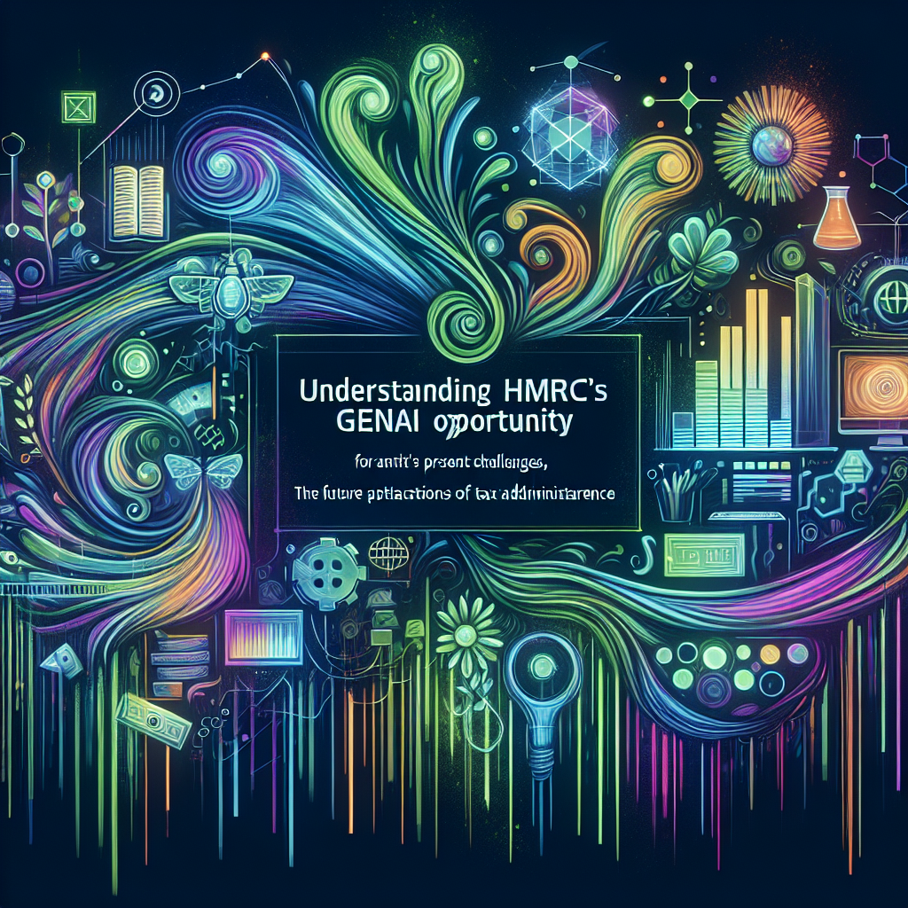
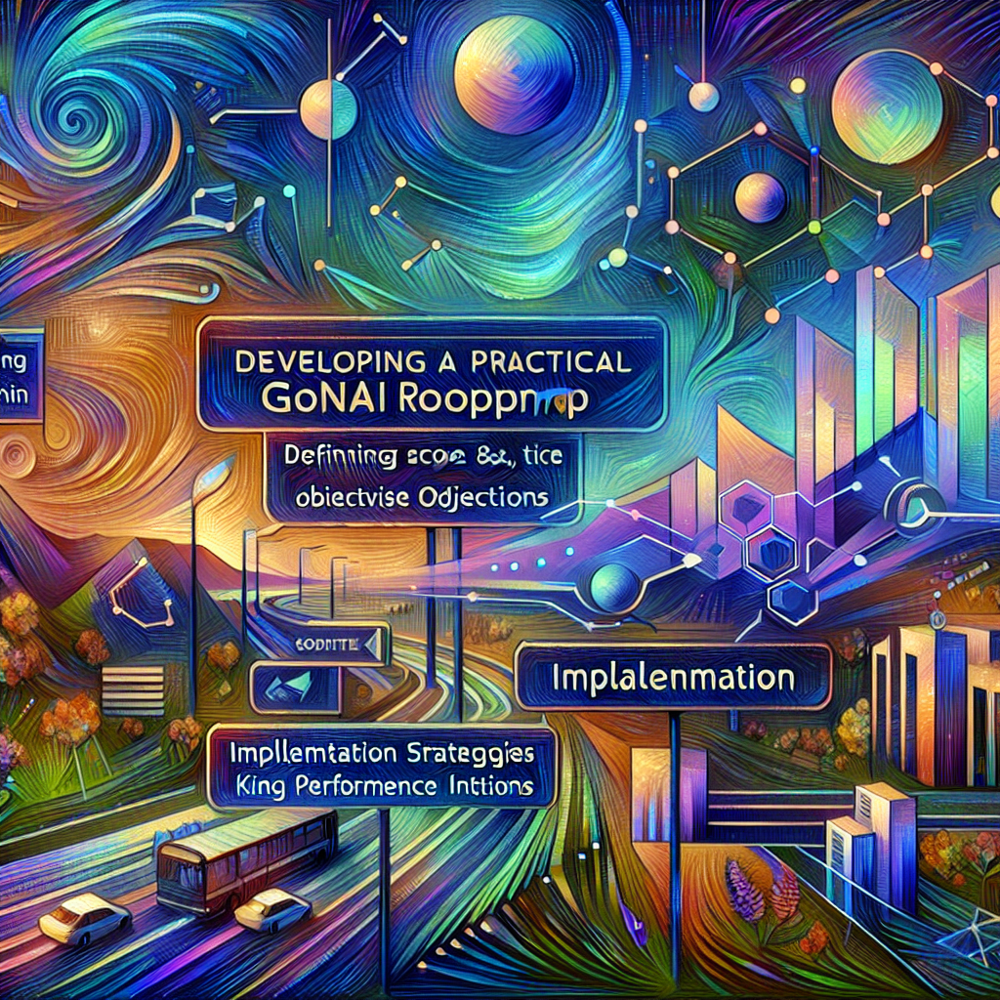
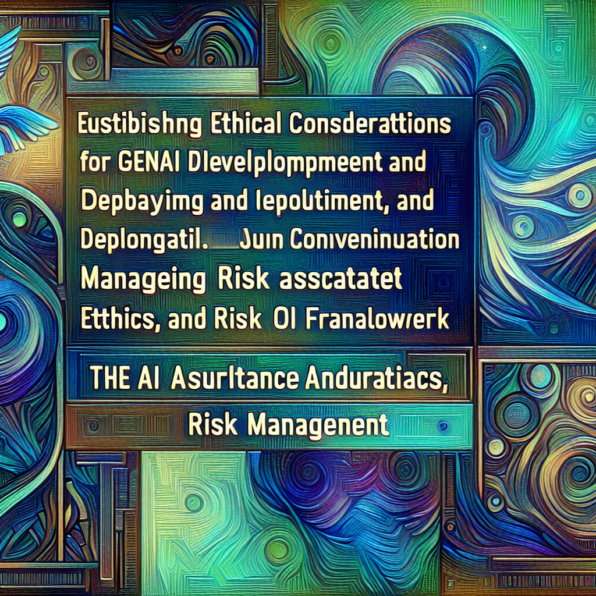

# GenAI for HMRC: A Practical Guide to Transforming Tax Administration

# Table of Contents

- [GenAI for HMRC: A Practical Guide to Transforming Tax Administration](#genai-for-hmrc-a-practical-guide-to-transforming-tax-administration)
  - [Understanding HMRC's GenAI Opportunity](#understanding-hmrcs-genai-opportunity)
    - [HMRC's Current Landscape: Challenges and Technological Infrastructure](#hmrcs-current-landscape-challenges-and-technological-infrastructure)
      - [Analyzing Existing Inefficiencies in HMRC Operations](#analyzing-existing-inefficiencies-in-hmrc-operations)
      - [Customer Service Bottlenecks and Improvement Opportunities](#customer-service-bottlenecks-and-improvement-opportunities)
      - [Overview of HMRC's Current Technological Infrastructure](#overview-of-hmrcs-current-technological-infrastructure)
      - [Identifying Areas Ripe for GenAI Intervention](#identifying-areas-ripe-for-genai-intervention)
    - [The Potential of GenAI in Tax Administration: A Vision for the Future](#the-potential-of-genai-in-tax-administration-a-vision-for-the-future)
      - [Defining Clear Goals and Objectives for GenAI Implementation](#defining-clear-goals-and-objectives-for-genai-implementation)
      - [Aligning GenAI with HMRC's Strategic Priorities (e.g., Making Tax Digital)](#aligning-genai-with-hmrcs-strategic-priorities-eg-making-tax-digital)
      - [Exploring Potential Applications: From Customer Service to Compliance](#exploring-potential-applications-from-customer-service-to-compliance)
      - [Quantifying the Potential Benefits: Efficiency Savings and Improved Outcomes](#quantifying-the-potential-benefits-efficiency-savings-and-improved-outcomes)
    - [GenAI Use Cases within HMRC: Early Adoptions and Future Possibilities](#genai-use-cases-within-hmrc-early-adoptions-and-future-possibilities)
      - [Review of HMRC's Current AI Initiatives (Connect System, Chatbots, etc.)](#review-of-hmrcs-current-ai-initiatives-connect-system-chatbots-etc)
      - [Case Studies: Early GenAI Implementations and Lessons Learned](#case-studies-early-genai-implementations-and-lessons-learned)
      - [Future Applications: Exploring Novel Uses of GenAI in Tax](#future-applications-exploring-novel-uses-of-genai-in-tax)
      - [Addressing Concerns: Accuracy, Hallucinations, and Data Quality](#addressing-concerns-accuracy-hallucinations-and-data-quality)
  - [Developing a Practical GenAI Roadmap for HMRC](#developing-a-practical-genai-roadmap-for-hmrc)
    - [Strategic Planning: Defining Scope, Objectives, and Key Performance Indicators](#strategic-planning-defining-scope-objectives-and-key-performance-indicators)
      - [Setting Realistic Timelines and Milestones for GenAI Implementation](#setting-realistic-timelines-and-milestones-for-genai-implementation)
      - [Defining Key Performance Indicators (KPIs) for Measuring Success](#defining-key-performance-indicators-kpis-for-measuring-success)
      - [Resource Allocation: Budgeting and Staffing Considerations](#resource-allocation-budgeting-and-staffing-considerations)
      - [Prioritizing GenAI Projects Based on Impact and Feasibility](#prioritizing-genai-projects-based-on-impact-and-feasibility)
    - [Implementation Strategies: Building and Deploying GenAI Solutions](#implementation-strategies-building-and-deploying-genai-solutions)
      - [Data Acquisition and Preparation: Ensuring Data Quality and Availability](#data-acquisition-and-preparation-ensuring-data-quality-and-availability)
      - [Selecting the Right GenAI Technologies and Platforms](#selecting-the-right-genai-technologies-and-platforms)
      - [Developing and Training GenAI Models for Specific HMRC Use Cases](#developing-and-training-genai-models-for-specific-hmrc-use-cases)
      - [Integrating GenAI Solutions with Existing HMRC Systems](#integrating-genai-solutions-with-existing-hmrc-systems)
    - [Change Management: Preparing HMRC for GenAI Adoption](#change-management-preparing-hmrc-for-genai-adoption)
      - [Addressing Employee Concerns and Resistance to Change](#addressing-employee-concerns-and-resistance-to-change)
      - [Upskilling and Training HMRC Staff on GenAI Technologies](#upskilling-and-training-hmrc-staff-on-genai-technologies)
      - [Communicating the Benefits of GenAI to Stakeholders](#communicating-the-benefits-of-genai-to-stakeholders)
      - [Establishing a Centre of Excellence for GenAI within HMRC](#establishing-a-centre-of-excellence-for-genai-within-hmrc)
  - [Ethical Considerations and Risk Management](#ethical-considerations-and-risk-management)
    - [Establishing Ethical Guidelines for GenAI Development and Deployment](#establishing-ethical-guidelines-for-genai-development-and-deployment)
      - [Data Privacy and Security: Protecting Taxpayer Information](#data-privacy-and-security-protecting-taxpayer-information)
      - [Bias Mitigation: Ensuring Fairness and Equity in GenAI Applications](#bias-mitigation-ensuring-fairness-and-equity-in-genai-applications)
      - [Transparency and Explainability: Understanding How GenAI Systems Work](#transparency-and-explainability-understanding-how-genai-systems-work)
      - [Human Oversight: Maintaining Control and Accountability](#human-oversight-maintaining-control-and-accountability)
    - [Managing Risks Associated with GenAI in Tax Administration](#managing-risks-associated-with-genai-in-tax-administration)
      - [Addressing the Risk of AI 'Hallucinations' and Inaccurate Outputs](#addressing-the-risk-of-ai-hallucinations-and-inaccurate-outputs)
      - [Preventing the Misuse of GenAI for Tax Evasion or Fraud](#preventing-the-misuse-of-genai-for-tax-evasion-or-fraud)
      - [Ensuring Compliance with Data Protection Regulations (e.g., GDPR)](#ensuring-compliance-with-data-protection-regulations-eg-gdpr)
      - [Developing Contingency Plans for GenAI Failures or Disruptions](#developing-contingency-plans-for-genai-failures-or-disruptions)
    - [The AI Assurance, Ethics, and Risk Management Framework](#the-ai-assurance-ethics-and-risk-management-framework)
      - [Reviewing HMRC's Existing Framework and Identifying Areas for Improvement](#reviewing-hmrcs-existing-framework-and-identifying-areas-for-improvement)
      - [Incorporating External Ethics Experts and Stakeholder Feedback](#incorporating-external-ethics-experts-and-stakeholder-feedback)
      - [Establishing an AI Steering Group for Cross-Departmental Collaboration](#establishing-an-ai-steering-group-for-cross-departmental-collaboration)
      - [Implementing Robust Data Governance and Security Measures](#implementing-robust-data-governance-and-security-measures)
  - [Measuring Success and Continuous Improvement](#measuring-success-and-continuous-improvement)
    - [Defining Key Performance Indicators (KPIs) for GenAI Initiatives](#defining-key-performance-indicators-kpis-for-genai-initiatives)
      - [Measuring Efficiency Savings and Cost Reductions](#measuring-efficiency-savings-and-cost-reductions)
      - [Evaluating Improvements in Tax Compliance and Revenue Collection](#evaluating-improvements-in-tax-compliance-and-revenue-collection)
      - [Assessing Enhancements in Customer Service and Taxpayer Engagement](#assessing-enhancements-in-customer-service-and-taxpayer-engagement)
      - [Tracking the Impact of GenAI on Employee Productivity and Job Satisfaction](#tracking-the-impact-of-genai-on-employee-productivity-and-job-satisfaction)
    - [Establishing a Framework for Monitoring and Evaluating GenAI Performance](#establishing-a-framework-for-monitoring-and-evaluating-genai-performance)
      - [Collecting and Analyzing Data on GenAI Usage and Outcomes](#collecting-and-analyzing-data-on-genai-usage-and-outcomes)
      - [Conducting Regular Audits of GenAI Systems and Processes](#conducting-regular-audits-of-genai-systems-and-processes)
      - [Seeking Feedback from Stakeholders on GenAI Implementation](#seeking-feedback-from-stakeholders-on-genai-implementation)
      - [Identifying Areas for Improvement and Optimization](#identifying-areas-for-improvement-and-optimization)
    - [Iterative Development and Refinement of the GenAI Strategy](#iterative-development-and-refinement-of-the-genai-strategy)
      - [Adapting the GenAI Strategy to Changing Business Needs and Technological Advancements](#adapting-the-genai-strategy-to-changing-business-needs-and-technological-advancements)
      - [Incorporating Lessons Learned from Past Implementations](#incorporating-lessons-learned-from-past-implementations)
      - [Staying Abreast of Emerging Trends and Best Practices in GenAI](#staying-abreast-of-emerging-trends-and-best-practices-in-genai)
      - [Fostering a Culture of Innovation and Experimentation within HMRC](#fostering-a-culture-of-innovation-and-experimentation-within-hmrc)
  - [The Future of GenAI at HMRC: Opportunities and Challenges Ahead](#the-future-of-genai-at-hmrc-opportunities-and-challenges-ahead)
    - [Emerging Trends in GenAI and Their Potential Impact on HMRC](#emerging-trends-in-genai-and-their-potential-impact-on-hmrc)
      - [The Evolution of GenAI Models and Algorithms](#the-evolution-of-genai-models-and-algorithms)
      - [The Rise of Low-Code/No-Code GenAI Platforms](#the-rise-of-low-codeno-code-genai-platforms)
      - [The Integration of GenAI with Other Emerging Technologies (e.g., Blockchain, IoT)](#the-integration-of-genai-with-other-emerging-technologies-eg-blockchain-iot)
      - [The Growing Importance of Data Privacy and Security in the GenAI Era](#the-growing-importance-of-data-privacy-and-security-in-the-genai-era)
    - [Addressing the Long-Term Challenges of GenAI Implementation](#addressing-the-long-term-challenges-of-genai-implementation)
      - [Maintaining Data Quality and Combating Bias in GenAI Systems](#maintaining-data-quality-and-combating-bias-in-genai-systems)
      - [Ensuring the Ethical and Responsible Use of GenAI](#ensuring-the-ethical-and-responsible-use-of-genai)
      - [Bridging the Skills Gap in GenAI Expertise](#bridging-the-skills-gap-in-genai-expertise)
      - [Adapting to the Evolving Regulatory Landscape for AI](#adapting-to-the-evolving-regulatory-landscape-for-ai)
    - [HMRC's Role in Shaping the Future of GenAI in Tax Administration](#hmrcs-role-in-shaping-the-future-of-genai-in-tax-administration)
      - [Collaborating with Other Tax Authorities and Research Institutions](#collaborating-with-other-tax-authorities-and-research-institutions)
      - [Developing Open-Source GenAI Tools and Resources](#developing-open-source-genai-tools-and-resources)
      - [Promoting Ethical and Responsible AI Practices](#promoting-ethical-and-responsible-ai-practices)
      - [Leading the Way in Transforming Tax Administration with GenAI](#leading-the-way-in-transforming-tax-administration-with-genai)
  - [Core Wardley Mapping Series](#core-wardley-mapping-series)
  - [Practical Resources](#practical-resources)
  - [Specialized Applications](#specialized-applications)

## Understanding HMRC's GenAI Opportunity

### HMRC's Current Landscape: Challenges and Technological Infrastructure

#### Analyzing Existing Inefficiencies in HMRC Operations

HMRC, like any large governmental organisation, faces inherent operational inefficiencies stemming from legacy systems, complex processes, and the sheer volume of data it handles. Understanding these inefficiencies is the crucial first step in identifying where GenAI can be most effectively deployed to streamline operations, reduce costs, and improve service delivery. This analysis requires a multi-faceted approach, examining processes from end to end and considering both internal operations and taxpayer interactions.

One key area of inefficiency lies in manual data processing. Tax returns, supporting documents, and other taxpayer submissions often require significant manual review and data entry. This is not only time-consuming but also prone to errors, leading to delays in processing and potential inaccuracies in tax assessments. GenAI's ability to automate data extraction and validation can significantly reduce the burden of manual data processing, freeing up staff to focus on more complex tasks.

- Processing paper-based tax returns and supporting documents
- Verifying taxpayer information against internal databases and external sources
- Identifying and resolving discrepancies in tax returns
- Responding to taxpayer inquiries regarding the status of their returns

Another significant source of inefficiency is the handling of taxpayer inquiries. HMRC receives millions of calls, emails, and letters each year from taxpayers seeking assistance with a wide range of issues. Many of these inquiries are routine and could be easily addressed through automated channels. However, the current reliance on human agents to handle all inquiries leads to long wait times, high call volumes, and increased operational costs. As noted in external sources, HMRC is already trialling GenAI to produce wrap-ups at the end of helpline calls, which is a step in the right direction.

- Long wait times for taxpayers to speak to an agent
- High call abandonment rates
- Increased workload for HMRC agents
- Inconsistent responses to taxpayer inquiries
- Difficulty in tracking and resolving complex cases

Furthermore, internal processes within HMRC, such as compliance checks and fraud detection, can be inefficient due to reliance on manual analysis and rule-based systems. These systems often struggle to identify complex patterns and anomalies that may indicate tax evasion or fraud. GenAI's ability to analyse large datasets and identify subtle patterns can significantly improve the effectiveness of compliance checks and fraud detection efforts.

- Difficulty in identifying complex tax evasion schemes
- High false positive rates in fraud detection systems
- Time-consuming manual review of potential fraud cases
- Limited ability to proactively identify emerging fraud trends

Legacy IT systems also contribute significantly to operational inefficiencies. Many of HMRC's systems are outdated and difficult to integrate, leading to data silos and manual workarounds. This lack of integration hinders the flow of information and makes it difficult to gain a holistic view of taxpayer activity. Modernising these systems and integrating them with GenAI solutions is essential for unlocking the full potential of GenAI in tax administration.

As HMRC Chief Executive Jim Harra has expressed, meeting efficiency targets relies on better technology, including GenAI. This highlights the critical need to address these inefficiencies strategically. By carefully analysing existing processes and identifying areas where GenAI can have the greatest impact, HMRC can develop a targeted implementation plan that delivers tangible results.

Finally, it's important to acknowledge that inefficiencies can also arise from organisational structures and processes. Siloed departments, lack of clear accountability, and cumbersome approval processes can all hinder the adoption of new technologies and slow down decision-making. Addressing these organisational challenges is crucial for creating an environment that is conducive to innovation and the successful implementation of GenAI.

> A successful GenAI implementation requires a clear understanding of the current state and a willingness to challenge existing processes, says a senior government official.

#### Customer Service Bottlenecks and Improvement Opportunities

HMRC's customer service operations are currently facing significant challenges, resulting in substantial bottlenecks and taxpayer dissatisfaction. Addressing these issues is paramount for improving public trust and ensuring the effective functioning of the tax system. As highlighted previously, inefficiencies in handling taxpayer inquiries contribute significantly to operational burdens. This section delves deeper into the specific bottlenecks within HMRC's customer service and explores opportunities for GenAI to drive meaningful improvements.

One of the most prominent bottlenecks is the excessive call waiting times experienced by taxpayers. As external sources confirm, average wait times have increased dramatically in recent years, leading to frustration and wasted time for individuals attempting to contact HMRC. This issue is exacerbated by the high volume of calls related to 'failure demand' – inquiries stemming from HMRC's own errors or delays. Reducing call volumes and improving call routing are critical for addressing this bottleneck. GenAI-powered chatbots and virtual assistants can play a key role in resolving routine inquiries and directing taxpayers to the appropriate resources, thereby freeing up human agents to handle more complex cases.

- Long call waiting times and high call abandonment rates
- Inadequate self-service options for taxpayers
- Inefficient call routing and handling processes
- Lack of personalised support for taxpayers with complex needs
- Difficulty in tracking and resolving taxpayer issues across multiple channels

Another significant challenge is the limited availability and effectiveness of self-service options. Many taxpayers struggle to find the information they need on HMRC's website or through automated phone systems, leading them to contact human agents for assistance. Improving the accessibility and usability of self-service resources is crucial for reducing call volumes and empowering taxpayers to resolve their issues independently. GenAI can be used to create intelligent search engines, personalised help guides, and interactive tutorials that provide taxpayers with the information they need, when they need it.

Inefficient call routing and handling processes also contribute to customer service bottlenecks. Taxpayers are often transferred between multiple agents before reaching someone who can assist them, leading to frustration and wasted time. Improving call routing accuracy and providing agents with access to comprehensive taxpayer information are essential for streamlining the call handling process. GenAI can be used to analyse call transcripts and identify the taxpayer's needs, routing them to the appropriate agent or providing them with relevant information in real-time.

Furthermore, the lack of personalised support for taxpayers with complex needs can lead to delays and dissatisfaction. Taxpayers with intricate tax situations often require specialised assistance from experienced agents. Identifying these taxpayers and providing them with access to dedicated support channels is crucial for ensuring their needs are met. GenAI can be used to analyse taxpayer data and identify individuals who may require specialised assistance, routing them to the appropriate support channels or providing agents with relevant background information.

Finally, the difficulty in tracking and resolving taxpayer issues across multiple channels can lead to inconsistencies and delays. Taxpayers may contact HMRC through phone, email, or online chat, and their issues may be handled by different agents in different departments. Integrating these channels and providing agents with a unified view of taxpayer interactions is essential for ensuring consistent and efficient service. GenAI can be used to consolidate taxpayer data from multiple sources and provide agents with a comprehensive view of their interactions, enabling them to resolve issues more quickly and effectively.

Addressing these customer service bottlenecks requires a multi-faceted approach that combines technological innovation with process improvements and organisational changes. By leveraging the power of GenAI, HMRC can transform its customer service operations and provide taxpayers with a more efficient, personalised, and satisfying experience. As HMRC explores and trials AI, including GenAI, to improve customer service and efficiency, it is vital to focus on contact handling, using AI to direct people to information and minimise the need for human guidance. For example, the chatbot trial on their website is a step in the right direction, but it needs to be carefully monitored for accuracy and 'hallucinations'.

> Improving customer service is not just about technology; it's about creating a culture of empathy and empowerment, says a leading expert in the field.

In summary, HMRC faces significant customer service bottlenecks that require urgent attention. By strategically implementing GenAI solutions, HMRC can streamline processes, reduce wait times, improve self-service options, and provide taxpayers with a more personalised and efficient experience. This will not only improve public trust but also free up resources to focus on more complex and strategic tasks. The key is to ensure that GenAI is implemented ethically and responsibly, with appropriate human oversight and data protection measures in place, as highlighted by HMRC's AI assurance, ethics, and risk management framework.

#### Overview of HMRC's Current Technological Infrastructure

Understanding HMRC's existing technological infrastructure is essential for developing a realistic and effective GenAI strategy. As highlighted in previous sections, legacy systems and data silos contribute to operational inefficiencies and customer service bottlenecks. This section provides an overview of HMRC's current IT landscape, highlighting key components, ongoing modernisation efforts, and areas that require attention to facilitate successful GenAI implementation. This understanding forms the bedrock upon which GenAI solutions can be strategically built and deployed.

HMRC's technological infrastructure is a complex ecosystem comprised of both modern and legacy systems. A significant portion of HMRC's IT estate is undergoing modernization, with a focus on cloud migration and addressing technical debt accumulated over years of operation. This modernisation is not merely about upgrading technology; it's about creating a more agile, resilient, and data-driven organisation capable of leveraging the power of GenAI.

One of the key initiatives is the ongoing cloud migration project. HMRC is in the process of migrating applications and workloads to the public cloud to increase agility, flexibility, and reduce costs. As of August 2024, a substantial number of critical services have already been migrated, demonstrating HMRC's commitment to embracing cloud technologies. This move to the cloud is crucial for GenAI adoption, as it provides the scalable computing resources and data storage needed to train and deploy GenAI models effectively. The cloud environment also facilitates easier integration with third-party GenAI platforms and services.

HMRC also utilises an Infrastructure-as-a-Service (IaaS) model and has developed a private cloud computing service called S4 to deliver data centre services. This hybrid approach, combining public and private cloud infrastructure, allows HMRC to balance the benefits of cloud computing with the need for data security and control. The S4 private cloud provides a secure environment for sensitive data and applications, while the public cloud offers scalability and flexibility for less sensitive workloads.

However, HMRC still relies on mainframe systems for core operations. Kyndryl is assisting HMRC with mainframe services management and cloud migration, focusing on modernising options for powering HMRC's operations in the coming decades. These mainframe systems often contain valuable historical data that can be used to train GenAI models. Integrating GenAI with these systems requires careful planning and execution to ensure data security and integrity.

Addressing legacy IT is a major priority for HMRC. The Technical Health Programme, a substantial initiative, was created to tackle legacy tech and improve cyber resilience by remediating high-priority IT issues and replacing legacy IT infrastructure. This programme aims to reduce vulnerabilities in critical IT systems and mitigate risks associated with outdated hardware and software. Modernising these legacy systems is essential for creating a more secure and efficient IT environment that can support GenAI adoption.

Data management is another critical aspect of HMRC's technological infrastructure. HMRC holds vast amounts of taxpayer data, which is subject to strict data protection regulations. Ensuring data quality, security, and availability is paramount for successful GenAI implementation. HMRC needs to establish robust data governance policies and procedures to ensure that GenAI models are trained on accurate and reliable data and that taxpayer information is protected from unauthorised access.

- Data quality: Ensuring data accuracy, completeness, and consistency.
- Data security: Protecting taxpayer information from unauthorised access and breaches.
- Data governance: Establishing policies and procedures for data management and usage.
- Data integration: Breaking down data silos and enabling data sharing across different systems.
- Data lineage: Tracking the origin and movement of data to ensure transparency and accountability.

Furthermore, HMRC's IT infrastructure includes various applications and systems that support different aspects of tax administration, such as tax return processing, compliance checks, and customer service. These systems often operate in silos, making it difficult to gain a holistic view of taxpayer activity. Integrating these systems and providing agents with a unified view of taxpayer information is crucial for improving efficiency and customer service. GenAI can play a key role in integrating these systems and providing agents with real-time access to relevant information.

In summary, HMRC's technological infrastructure is a complex and evolving landscape. While significant progress has been made in modernising systems and migrating to the cloud, challenges remain in addressing legacy IT, managing data effectively, and integrating disparate systems. Understanding these challenges and opportunities is crucial for developing a GenAI strategy that is both realistic and impactful. By carefully assessing its current IT capabilities and addressing key gaps, HMRC can lay the foundation for successful GenAI implementation and unlock the full potential of this transformative technology.

> A successful GenAI implementation requires a solid foundation of modern and integrated IT systems, says a senior technology leader.

#### Identifying Areas Ripe for GenAI Intervention

Building upon the understanding of HMRC's challenges, technological infrastructure, and customer service bottlenecks, the next crucial step is to pinpoint specific areas where GenAI can deliver the most significant and immediate impact. This requires a strategic assessment of various HMRC functions, considering factors such as the volume of data processed, the complexity of tasks, and the potential for automation. Identifying these 'ripe' areas ensures that GenAI initiatives are focused, efficient, and aligned with HMRC's strategic priorities.

One prime area for GenAI intervention is in automating routine data processing tasks. As mentioned previously, HMRC handles vast amounts of data from various sources, including tax returns, supporting documents, and taxpayer communications. GenAI can be used to automate data extraction, validation, and classification, significantly reducing the manual effort required and improving data accuracy. This includes automating the processing of paper-based documents through Optical Character Recognition (OCR) and Natural Language Processing (NLP) techniques, as well as identifying and resolving discrepancies in tax returns. This aligns with HMRC's Making Tax Digital initiative by streamlining data flow and reducing errors.

- Automated data extraction from tax returns and supporting documents
- Validation of taxpayer information against internal databases and external sources
- Classification of taxpayer communications based on content and intent
- Automated reconciliation of tax payments and refunds
- Generation of automated reports and summaries

Another promising area is enhancing customer service through AI-powered virtual assistants and chatbots. As discussed earlier, HMRC's customer service operations are facing significant bottlenecks due to high call volumes and long wait times. GenAI can be used to create intelligent chatbots that can answer routine inquiries, provide personalised support, and guide taxpayers to the appropriate resources. These chatbots can be integrated with HMRC's website, mobile app, and phone system, providing taxpayers with seamless access to assistance 24/7. This also includes proactively addressing taxpayer concerns by analysing submission patterns and common queries, and offering personalized responses through AI-driven virtual assistants, as suggested by external sources.

- Answering routine taxpayer inquiries regarding tax codes, payments, and refunds
- Providing personalised support based on taxpayer's individual circumstances
- Guiding taxpayers through complex tax processes
- Scheduling appointments with HMRC agents
- Providing real-time updates on the status of tax returns and refunds

GenAI can also be effectively deployed to improve compliance checks and fraud detection. As noted, HMRC's current systems often struggle to identify complex patterns and anomalies that may indicate tax evasion or fraud. GenAI can be used to analyse large datasets and identify subtle patterns that would be difficult for humans to detect, improving the effectiveness of compliance checks and fraud detection efforts. This includes identifying fraudulent applications for input tax credits and detecting falsified income tax deductions, as highlighted in external sources. Furthermore, GenAI can be used to proactively identify emerging fraud trends and develop targeted intervention measures.

- Identifying potential tax evasion schemes by analysing taxpayer data
- Detecting fraudulent activity by monitoring transaction patterns
- Prioritising compliance checks based on risk assessment
- Generating automated alerts for suspicious activity
- Providing investigators with insights and leads

Internal knowledge management is another area ripe for GenAI intervention. HMRC possesses a wealth of internal documentation, including tax laws, regulations, guidance notes, and training materials. However, accessing and navigating this information can be challenging for HMRC staff. GenAI can be used to create intelligent knowledge management systems that allow staff to quickly and easily find the information they need, improving efficiency and reducing errors. This includes creating a centralised repository of all internal documentation, as well as providing staff with personalised recommendations based on their role and responsibilities.

- Creating a centralised repository of all internal documentation
- Providing staff with intelligent search capabilities
- Generating automated summaries of complex documents
- Providing staff with personalised recommendations based on their role
- Facilitating knowledge sharing and collaboration among staff

Finally, GenAI can be used to improve decision-making across various HMRC functions. By analysing large datasets and identifying key trends, GenAI can provide decision-makers with valuable insights that can inform strategic planning and resource allocation. This includes using GenAI to forecast tax revenues, identify emerging risks, and optimise resource allocation. As external sources suggest, this also includes leveraging data analytics to guide compliance work and improve risk management.

- Forecasting tax revenues based on economic indicators and taxpayer behaviour
- Identifying emerging risks and opportunities
- Optimising resource allocation based on workload and priorities
- Evaluating the effectiveness of different tax policies
- Supporting evidence-based decision-making

Identifying these areas ripe for GenAI intervention is not a one-time exercise. It requires ongoing monitoring and evaluation to ensure that GenAI initiatives remain aligned with HMRC's strategic priorities and that they are delivering the expected benefits. By carefully assessing its current challenges and opportunities, HMRC can develop a targeted GenAI implementation plan that delivers tangible results and transforms tax administration.

> The key to successful GenAI implementation is to focus on areas where it can deliver the greatest value and to ensure that it is aligned with the organisation's strategic priorities, says a leading expert in the field.

### The Potential of GenAI in Tax Administration: A Vision for the Future

#### Defining Clear Goals and Objectives for GenAI Implementation

Defining clear goals and objectives is paramount for any successful GenAI implementation within HMRC. Without a well-defined roadmap, efforts can become fragmented, resources misallocated, and the potential benefits unrealised. These goals and objectives should be specific, measurable, achievable, relevant, and time-bound (SMART), ensuring that GenAI initiatives are aligned with HMRC's overall strategic priorities and deliver tangible value. This section focuses on establishing a robust framework for defining these goals, considering both short-term wins and long-term transformative potential.

The initial step involves identifying the specific challenges and opportunities that GenAI can address within HMRC. Building upon the analysis of existing inefficiencies and customer service bottlenecks, as previously discussed, it's crucial to translate these issues into concrete objectives. For example, if long call waiting times are a major concern, a corresponding objective might be to reduce average call waiting times by a specific percentage within a defined timeframe. Similarly, if data processing is inefficient, the objective could be to automate a certain percentage of manual data entry tasks. The key is to move beyond general aspirations and define measurable targets that can be tracked and evaluated.

- Reduce average call waiting times by 30% within the next 12 months by deploying a GenAI-powered chatbot.
- Automate 50% of manual data entry tasks related to tax return processing within the next 18 months using GenAI-based data extraction tools.
- Improve the accuracy of fraud detection by 15% within the next 24 months by implementing a GenAI-based fraud detection system.
- Increase taxpayer satisfaction scores by 10% within the next year by providing personalised support through a GenAI-powered virtual assistant.
- Reduce the time required to resolve complex tax inquiries by 20% within the next 6 months by providing agents with real-time access to relevant information through a GenAI-based knowledge management system.

Furthermore, it's essential to consider the broader strategic context when defining GenAI goals. HMRC's strategic priorities, such as Making Tax Digital and improving taxpayer compliance, should inform the selection of GenAI initiatives. For example, if Making Tax Digital is a key priority, GenAI could be used to automate the processing of digital tax returns and provide taxpayers with real-time feedback on their submissions. Similarly, if improving taxpayer compliance is a major goal, GenAI could be used to identify potential tax evasion schemes and prioritise compliance checks. Aligning GenAI goals with HMRC's overall strategic priorities ensures that these initiatives contribute to the organisation's long-term success.

Another important consideration is the potential impact of GenAI on HMRC's workforce. While GenAI can automate many routine tasks, it's crucial to ensure that employees are equipped with the skills and knowledge they need to adapt to the changing work environment. This may involve upskilling and training programs to help employees develop new skills, such as data analysis, AI model development, and human-AI collaboration. The goals for GenAI implementation should also include objectives related to workforce development and employee satisfaction, ensuring that the benefits of GenAI are shared across the organisation.

Moreover, ethical considerations and risk management should be integrated into the goal-setting process. As discussed in later chapters, it's crucial to address issues such as data privacy, bias mitigation, and transparency when deploying GenAI solutions. The goals for GenAI implementation should include objectives related to ethical AI development and deployment, ensuring that these initiatives are aligned with HMRC's values and principles. This may involve establishing ethical guidelines for GenAI development, implementing robust data governance policies, and conducting regular audits of GenAI systems.

Finally, it's important to recognise that the goals and objectives for GenAI implementation may evolve over time as the technology matures and HMRC gains more experience. The initial goals may focus on achieving quick wins and demonstrating the potential of GenAI, while later goals may focus on more ambitious and transformative initiatives. Establishing a framework for monitoring and evaluating GenAI performance is crucial for adapting the goals and objectives to changing business needs and technological advancements. This framework should include key performance indicators (KPIs) for measuring the success of GenAI initiatives, as well as mechanisms for gathering feedback from stakeholders and identifying areas for improvement.

> Defining clear goals is not just about setting targets; it's about creating a shared vision and inspiring action, says a senior government official.

In summary, defining clear goals and objectives is essential for successful GenAI implementation at HMRC. These goals should be SMART, aligned with HMRC's strategic priorities, and integrated with ethical considerations and risk management. By establishing a robust framework for goal-setting, HMRC can ensure that GenAI initiatives deliver tangible value and contribute to the organisation's long-term success. As HMRC aims to save £500 million by the end of 2025 using better technology, including GenAI, these well-defined goals will be critical in achieving that target.

#### Aligning GenAI with HMRC's Strategic Priorities (e.g., Making Tax Digital)

Aligning GenAI initiatives with HMRC's overarching strategic priorities is crucial for ensuring that these technological advancements contribute directly to the organisation's core mission and objectives. This alignment ensures that GenAI investments are not isolated experiments but rather integral components of a broader strategy to modernise tax administration, improve efficiency, and enhance taxpayer experience. A prime example of this alignment is the integration of GenAI with HMRC's Making Tax Digital (MTD) program, but the principle extends to all strategic goals.

Making Tax Digital (MTD) represents a fundamental shift towards a fully digital tax system, requiring businesses and individuals to maintain digital records and submit tax returns electronically. GenAI can play a pivotal role in facilitating this transition and maximising the benefits of MTD. As external sources confirm, MTD has three primary requirements: keeping digital VAT records, showing evidence of a 'digital journey' from source systems to the VAT return, and using authorised software to submit VAT returns to HMRC. GenAI can streamline each of these requirements.

- Automating data extraction from digital records: GenAI can automatically extract relevant data from invoices, receipts, and other digital records, reducing the need for manual data entry and minimising errors. This directly supports the requirement of keeping digital VAT records.
- Generating audit trails and demonstrating the 'digital journey': GenAI can automatically generate audit trails that document the flow of data from source systems to the VAT return, providing evidence of the 'digital journey' and ensuring compliance with MTD requirements. This can also help identify and correct errors in the data.
- Providing real-time feedback and guidance to taxpayers: GenAI-powered virtual assistants can provide taxpayers with real-time feedback on their digital records and tax returns, helping them to identify and correct errors before submission. This can improve the accuracy of tax returns and reduce the need for HMRC intervention.

Beyond MTD, GenAI can be aligned with other HMRC strategic priorities, such as improving taxpayer compliance and combating tax evasion. As previously discussed, GenAI can be used to analyse large datasets and identify subtle patterns that may indicate tax evasion or fraud. By aligning GenAI initiatives with these strategic priorities, HMRC can ensure that these technological advancements contribute directly to the organisation's core mission and objectives.

- Identifying high-risk taxpayers and transactions: GenAI can analyse taxpayer data and identify individuals and businesses that are at high risk of tax evasion or fraud, allowing HMRC to focus its resources on the most pressing cases. This aligns with the strategic priority of improving taxpayer compliance.
- Detecting fraudulent activity by monitoring transaction patterns: GenAI can monitor transaction patterns and identify suspicious activity that may indicate tax evasion or fraud. This aligns with the strategic priority of combating tax evasion.
- Prioritising compliance checks based on risk assessment: GenAI can assess the risk profile of taxpayers and prioritise compliance checks based on the level of risk. This ensures that HMRC's resources are used effectively and that the most high-risk cases are addressed promptly.

Furthermore, aligning GenAI with HMRC's strategic priorities requires a holistic approach that considers the impact on all stakeholders, including taxpayers, employees, and partners. This involves communicating the benefits of GenAI to stakeholders, addressing their concerns, and ensuring that GenAI initiatives are implemented in a fair and transparent manner. It also involves providing employees with the skills and knowledge they need to adapt to the changing work environment and ensuring that they are involved in the design and implementation of GenAI solutions.

A critical aspect of alignment is ensuring that GenAI projects are prioritised based on their potential impact and feasibility, as mentioned in previous sections. This involves conducting a thorough cost-benefit analysis of each project and selecting those that offer the greatest return on investment. It also involves considering the technical feasibility of each project and ensuring that HMRC has the necessary resources and expertise to implement it successfully. This prioritisation should be dynamic, adapting to evolving needs and technological advancements.

In conclusion, aligning GenAI with HMRC's strategic priorities is essential for ensuring that these technological advancements contribute directly to the organisation's core mission and objectives. By integrating GenAI with initiatives such as Making Tax Digital and prioritising projects based on their potential impact and feasibility, HMRC can maximise the benefits of GenAI and transform tax administration for the better. This alignment requires a holistic approach that considers the impact on all stakeholders and ensures that GenAI initiatives are implemented in a fair, transparent, and ethical manner. As HMRC modernises its systems with GenAI, projecting savings of around £35 million in the next tax year, this strategic alignment will be crucial in realising those benefits.

> Strategic alignment is the compass that guides GenAI implementation, ensuring that it stays true to the organisation's north star, says a leading expert in the field.

#### Exploring Potential Applications: From Customer Service to Compliance

GenAI's transformative potential extends across a wide spectrum of HMRC's operations, from revolutionising customer service interactions to bolstering compliance efforts and streamlining internal processes. This section delves into specific applications of GenAI, showcasing its versatility and highlighting the tangible benefits it can bring to various facets of tax administration. Building upon the defined goals and strategic alignment discussed previously, we will explore how GenAI can be practically applied to address key challenges and unlock new opportunities within HMRC.

In customer service, GenAI can move beyond simple chatbots to provide truly personalised and proactive support. Imagine a system that anticipates taxpayer needs based on their past interactions and current circumstances, offering tailored guidance and resolving issues before they escalate. This could involve:

- Predictive support: Analysing taxpayer data to identify potential issues and proactively offer assistance.
- Personalised guidance: Providing tailored advice based on individual tax situations and needs.
- Intelligent routing: Directing taxpayers to the most appropriate agent or resource based on the complexity of their inquiry.
- Multilingual support: Offering assistance in multiple languages to cater to a diverse taxpayer base.

For example, a GenAI-powered system could detect that a taxpayer is about to miss a filing deadline and automatically send a reminder with helpful resources and instructions. Or, it could analyse a taxpayer's self-assessment return and identify potential errors or omissions, providing personalised guidance on how to correct them. This proactive and personalised approach can significantly improve taxpayer satisfaction and reduce the burden on HMRC's customer service agents. As HMRC is already trialling GenAI for call summarization, expanding this to other areas of customer interaction is a logical next step.

In compliance, GenAI can enhance HMRC's ability to detect and prevent tax evasion and fraud. By analysing vast datasets and identifying subtle patterns, GenAI can uncover sophisticated tax evasion schemes that would be difficult for humans to detect. This could involve:

- Anomaly detection: Identifying unusual transactions or patterns that may indicate tax evasion or fraud.
- Risk scoring: Assessing the risk profile of taxpayers and prioritising compliance checks based on the level of risk.
- Predictive modelling: Forecasting future tax evasion trends and developing targeted intervention measures.
- Network analysis: Identifying connections between individuals and businesses that may be involved in tax evasion schemes.

For instance, a GenAI-powered system could analyse transaction data and identify individuals who are consistently underreporting their income or claiming excessive deductions. Or, it could analyse social media data and identify individuals who are living a lifestyle that is inconsistent with their reported income. This proactive and data-driven approach can significantly improve HMRC's ability to combat tax evasion and protect public revenues. As external sources indicate, AI can transform and consolidate data to improve the quality of queries from source systems, which is crucial for effective compliance checks.

Beyond customer service and compliance, GenAI can also be applied to streamline internal processes and improve efficiency. This could involve:

- Automated document processing: Extracting data from paper-based documents and automating data entry tasks.
- Intelligent knowledge management: Providing staff with quick and easy access to relevant information and guidance.
- Automated report generation: Generating reports and summaries based on taxpayer data and compliance activities.
- Process optimisation: Identifying bottlenecks and inefficiencies in internal processes and recommending improvements.

For example, a GenAI-powered system could automatically extract data from paper-based tax returns and populate the relevant fields in HMRC's database. Or, it could provide staff with intelligent search capabilities that allow them to quickly find the information they need to resolve taxpayer inquiries. This automation and streamlining of internal processes can free up staff to focus on more complex and strategic tasks, improving efficiency and reducing operational costs. As HMRC aims to meet ambitious efficiency savings targets, GenAI can be a key enabler.

However, it's important to acknowledge that the successful implementation of these applications requires careful planning and execution. As highlighted in external sources, accuracy, data quality, and ethical considerations are paramount. HMRC must ensure that GenAI systems are trained on accurate and reliable data, that they are used in a fair and transparent manner, and that they are subject to appropriate human oversight. Addressing concerns about accuracy, hallucinations, and data quality is crucial for building trust and ensuring the responsible use of GenAI in tax administration.

> The potential of GenAI is immense, but it must be harnessed responsibly and ethically, says a senior government official.

#### Quantifying the Potential Benefits: Efficiency Savings and Improved Outcomes

Quantifying the potential benefits of GenAI is crucial for justifying investment, prioritising projects, and demonstrating the value of these technologies to stakeholders. This involves identifying specific metrics that can be used to measure efficiency savings, improved outcomes, and enhanced taxpayer experience. By establishing a clear baseline and tracking progress against these metrics, HMRC can demonstrate the tangible benefits of GenAI and ensure that these initiatives are delivering the expected return on investment. This section focuses on defining these metrics and exploring the potential benefits across various areas of HMRC's operations, building upon the potential applications discussed in the previous section.

One of the primary benefits of GenAI is the potential for significant efficiency savings. By automating routine tasks, streamlining processes, and improving decision-making, GenAI can free up staff to focus on more complex and strategic tasks, reducing operational costs and improving productivity. These efficiency savings can be quantified by measuring:

- Reduction in manual processing time: Measuring the time saved by automating data entry, document processing, and other manual tasks.
- Reduction in call volumes: Measuring the decrease in call volumes resulting from the deployment of GenAI-powered chatbots and virtual assistants.
- Reduction in processing errors: Measuring the decrease in errors resulting from the use of GenAI-based data validation and quality control tools.
- Improved staff productivity: Measuring the increase in staff productivity resulting from the automation of routine tasks and the provision of better tools and resources.
- Cost savings: Calculating the overall cost savings resulting from the implementation of GenAI initiatives, including reduced labour costs, reduced error rates, and improved resource utilisation.

For example, if GenAI is used to automate the processing of tax returns, the efficiency savings could be quantified by measuring the reduction in the time required to process each return, the reduction in the number of errors made during processing, and the resulting cost savings. Similarly, if GenAI is used to provide personalised support to taxpayers, the efficiency savings could be quantified by measuring the reduction in call volumes, the reduction in call waiting times, and the improvement in taxpayer satisfaction scores. As HMRC aims to save £500 million by 2025, quantifying these savings is essential.

In addition to efficiency savings, GenAI can also lead to improved outcomes in various areas of HMRC's operations. This includes:

- Improved tax compliance: Measuring the increase in tax revenues resulting from the use of GenAI-based fraud detection and compliance tools.
- Reduced tax evasion: Measuring the decrease in tax evasion resulting from the deployment of GenAI-based risk assessment and intervention measures.
- Enhanced taxpayer experience: Measuring the improvement in taxpayer satisfaction scores resulting from the provision of personalised support and proactive assistance.
- Faster resolution of tax disputes: Measuring the reduction in the time required to resolve tax disputes resulting from the use of GenAI-based knowledge management and decision support tools.
- Better informed decision-making: Measuring the improvement in the quality of decisions made by HMRC staff resulting from the provision of better data and insights.

For example, if GenAI is used to detect tax evasion, the improved outcomes could be quantified by measuring the increase in tax revenues recovered as a result of the detection efforts. Similarly, if GenAI is used to provide personalised support to taxpayers, the improved outcomes could be quantified by measuring the increase in taxpayer satisfaction scores and the reduction in the number of complaints received. As external sources suggest, better data ensures reliable AI outcomes, which in turn leads to better understanding of customer preferences and behaviours.

Furthermore, it's important to consider the intangible benefits of GenAI, such as improved employee morale, enhanced innovation, and increased agility. While these benefits may be difficult to quantify directly, they can have a significant impact on HMRC's overall performance and competitiveness. These intangible benefits can be assessed through employee surveys, focus groups, and other qualitative methods.

To effectively quantify the potential benefits of GenAI, HMRC needs to establish a robust framework for monitoring and evaluating GenAI performance. This framework should include:

- Defining clear key performance indicators (KPIs) for each GenAI initiative.
- Collecting and analysing data on GenAI usage and outcomes.
- Conducting regular audits of GenAI systems and processes.
- Seeking feedback from stakeholders on GenAI implementation.
- Identifying areas for improvement and optimisation.

This framework should be integrated with HMRC's existing performance management system and should be used to track progress against the defined goals and objectives. This iterative process allows for continuous improvement and adaptation of the GenAI strategy.

In conclusion, quantifying the potential benefits of GenAI is essential for justifying investment, prioritising projects, and demonstrating the value of these technologies to stakeholders. By establishing a clear baseline, tracking progress against defined metrics, and considering both tangible and intangible benefits, HMRC can ensure that GenAI initiatives are delivering the expected return on investment and contributing to the organisation's long-term success. As HMRC explores and trials AI, including GenAI, to improve customer service and efficiency, it is vital to focus on contact handling, using AI to direct people to information and minimise the need for human guidance.

> What gets measured gets managed, says a leading expert in performance management.

### GenAI Use Cases within HMRC: Early Adoptions and Future Possibilities

#### Review of HMRC's Current AI Initiatives (Connect System, Chatbots, etc.)

HMRC has already embarked on several AI initiatives, providing a foundation upon which to build a comprehensive GenAI strategy. Understanding the successes and limitations of these existing systems is crucial for informing future GenAI deployments. This review focuses on key AI initiatives currently in use, such as the Connect system and chatbot trials, highlighting their functionalities and lessons learned. These initiatives offer valuable insights into the practical application of AI within HMRC's specific context.

The Connect system, in operation for over a decade, represents a significant early investment in AI-driven data analytics. Connect aggregates vast amounts of data from diverse sources, including land registries, estate agents, and online rental advertisements, to identify discrepancies in tax returns and potential cases of tax evasion and avoidance. As external sources confirm, it holds an impressive 55 billion items of taxpayer data.

- Data Aggregation: Connect gathers data from a wide range of internal and external sources, creating a comprehensive view of taxpayer activity.
- Anomaly Detection: The system uses AI algorithms to identify unusual patterns and anomalies that may indicate tax evasion or fraud.
- Risk Scoring: Connect assigns risk scores to taxpayers based on their data profile, allowing HMRC to prioritise compliance checks.
- Case Selection: The system supports case selection for compliance investigations by identifying high-risk taxpayers and transactions.

While Connect has proven effective in identifying tax evasion, it also presents some limitations. The system's reliance on historical data may make it less effective at detecting new and emerging fraud schemes. Additionally, the system's algorithms may be prone to bias, leading to unfair or inaccurate risk assessments. Addressing these limitations is crucial for ensuring the responsible and effective use of AI in compliance checks.

HMRC is also experimenting with generative AI chatbots to enhance customer service. The GOV.UK Chat chatbot, currently undergoing testing with a larger group of users, aims to provide taxpayers with quick and easy access to information on business rules, VAT, and other tax-related questions. This initiative represents a significant step towards leveraging GenAI to improve taxpayer experience and reduce the burden on HMRC's customer service agents.

- Automated Responses: The chatbot uses natural language processing (NLP) to understand taxpayer inquiries and provide automated responses.
- Information Retrieval: The chatbot can access and retrieve information from HMRC's knowledge base, providing taxpayers with relevant guidance and resources.
- Personalised Support: The chatbot can provide personalised support based on taxpayer's individual circumstances.
- 24/7 Availability: The chatbot is available 24/7, providing taxpayers with access to assistance at any time.

The chatbot trials have yielded valuable insights into the potential of GenAI to improve customer service. However, they have also highlighted the challenges of ensuring accuracy and avoiding 'hallucinations'. It is crucial to carefully monitor the chatbot's performance and provide appropriate human oversight to ensure that taxpayers receive accurate and reliable information. As external sources emphasize, human supervision is a must.

Beyond Connect and chatbots, HMRC is exploring other AI applications, including using Large Language Models (LLMs) to detect patterns of VAT fraud and predicting when customers will contact HMRC with queries. These initiatives demonstrate HMRC's commitment to exploring the full potential of AI in tax administration. HMRC is also trialing GenAI tools across operations to deal with complaints and meet efficiency targets.

The lessons learned from these early AI initiatives are invaluable for informing HMRC's GenAI strategy. These lessons include the importance of data quality, the need for robust data governance policies, the ethical considerations surrounding AI deployment, and the importance of human oversight. By building upon these lessons, HMRC can ensure that its GenAI initiatives are successful, responsible, and aligned with its strategic priorities. As HMRC develops its AI assurance, ethics, and risk management framework, these lessons will be critical.

> Learning from past experiences is essential for building a successful future, says a senior government official.

#### Case Studies: Early GenAI Implementations and Lessons Learned

While comprehensive, publicly available case studies detailing HMRC's specific GenAI implementations are limited, we can extrapolate lessons learned from analogous deployments in similar governmental and financial institutions, and from HMRC's existing AI initiatives, as reviewed previously. These examples, combined with general best practices, provide valuable insights into the potential benefits and challenges of GenAI adoption within HMRC.

One area where GenAI is showing promise is in automating customer service interactions. Consider a hypothetical scenario where HMRC implemented a GenAI-powered virtual assistant to handle routine taxpayer inquiries. This assistant could be trained on a vast dataset of tax laws, regulations, and guidance notes, enabling it to answer a wide range of questions accurately and efficiently. The key lessons learned from such an implementation would likely include:

- Data Quality is Paramount: The accuracy and reliability of the virtual assistant's responses would depend heavily on the quality of the data it was trained on. Inaccurate or incomplete data could lead to incorrect advice and taxpayer dissatisfaction.
- Continuous Monitoring and Improvement are Essential: The virtual assistant's performance would need to be continuously monitored and improved to ensure that it is meeting taxpayer needs and providing accurate information. This would involve tracking key metrics such as call deflection rates, customer satisfaction scores, and error rates.
- Human Oversight is Crucial: While the virtual assistant could handle many routine inquiries, it would be important to provide human agents to handle more complex or sensitive cases. This would ensure that taxpayers receive the appropriate level of support and that their issues are resolved effectively.
- Transparency and Explainability are Important: Taxpayers need to understand how the virtual assistant works and how it is using their data. This would involve providing clear and concise explanations of the system's capabilities and limitations, as well as ensuring that taxpayer data is protected in accordance with data protection regulations.

Another potential application of GenAI is in enhancing compliance checks and fraud detection. Imagine a system that uses GenAI to analyse tax returns and identify potential cases of tax evasion or fraud. This system could be trained on a vast dataset of historical tax returns and fraud cases, enabling it to identify subtle patterns and anomalies that may indicate fraudulent activity. The key lessons learned from such an implementation would likely include:

- Bias Mitigation is Critical: The system's algorithms must be carefully designed to avoid bias, ensuring that all taxpayers are treated fairly and equitably. This would involve carefully selecting the data used to train the system and implementing robust bias detection and mitigation techniques.
- Explainability is Essential: It is important to understand how the system is making its decisions and to be able to explain these decisions to taxpayers. This would involve developing explainable AI (XAI) techniques that can provide insights into the system's reasoning process.
- Data Privacy and Security are Paramount: Taxpayer data must be protected in accordance with data protection regulations. This would involve implementing robust data security measures and ensuring that the system is used in a transparent and accountable manner.
- Human Expertise Remains Vital: GenAI should augment, not replace, human expertise. Complex cases and those with significant implications should always be reviewed by experienced tax professionals.

Drawing from the external knowledge provided, we can also consider lessons from the financial sector's use of GenAI for KYC (Know Your Customer) processes. The rapid processing of documentation and extraction of KYC information offers a model for HMRC to adapt for verifying taxpayer identities and information. However, the emphasis on manual checks and quality control highlights the need for robust validation processes within HMRC's GenAI implementations.

Furthermore, the education sector's exploration of GenAI for content drafting and lesson planning provides a cautionary tale. While GenAI can assist in generating content, alignment with curriculum and addressing concerns about over-reliance and potential risks are crucial. This translates to HMRC needing to ensure that GenAI-generated guidance and information are accurate, up-to-date, and aligned with current tax laws and regulations.

In summary, while specific HMRC GenAI case studies may be limited, the lessons learned from analogous deployments and existing AI initiatives provide valuable guidance for future implementations. These lessons emphasize the importance of data quality, continuous monitoring, human oversight, transparency, bias mitigation, data privacy, and ethical considerations. By carefully addressing these challenges, HMRC can unlock the full potential of GenAI and transform tax administration for the better.

> The key to successful GenAI implementation is not just about technology; it's about people, processes, and ethics, says a leading expert in AI.

#### Future Applications: Exploring Novel Uses of GenAI in Tax

Building upon the review of HMRC's current AI initiatives and the lessons learned from early implementations, this section explores novel applications of GenAI that could transform tax administration in the future. These applications go beyond incremental improvements and envision a future where GenAI is deeply integrated into all aspects of HMRC's operations, creating a more efficient, effective, and taxpayer-centric tax system. These are not merely theoretical possibilities; they represent concrete opportunities for HMRC to leverage the power of GenAI to address key challenges and unlock new value.

One promising area is the use of GenAI to create personalised tax advice and guidance for taxpayers. Instead of relying on generic information and FAQs, taxpayers could receive tailored advice based on their individual circumstances and needs. This could involve:

- Generating personalised tax plans based on taxpayer's income, expenses, and deductions
- Providing proactive advice on tax-saving opportunities
- Answering complex tax questions in plain language
- Guiding taxpayers through complex tax processes, such as filing self-assessment returns or claiming tax credits
- Offering support in multiple languages

This personalised approach could significantly improve taxpayer compliance and reduce the burden on HMRC's customer service agents. It aligns with the strategic goal of improving taxpayer experience and making the tax system more accessible and user-friendly. As HMRC modernizes its systems, this level of personalization will become increasingly feasible.

Another novel application is the use of GenAI to automate the creation of tax laws and regulations. Instead of relying on human drafters, GenAI could be used to generate draft legislation based on policy objectives and legal precedents. This could significantly speed up the legislative process and ensure that tax laws are clear, consistent, and up-to-date. This could involve:

- Generating draft legislation based on policy objectives
- Identifying potential loopholes and unintended consequences
- Ensuring consistency with existing tax laws and regulations
- Translating complex legal language into plain language
- Automating the process of updating tax laws and regulations

While this application may seem far-fetched, it has the potential to revolutionise the way tax laws are created and administered. It could also improve transparency and accountability by making tax laws more accessible and understandable to the public. However, this would require careful oversight and validation by legal experts to ensure accuracy and compliance with legal principles.

GenAI can also be used to create intelligent audit systems that automatically identify and investigate potential cases of tax evasion and fraud. These systems could analyse vast datasets and identify subtle patterns that would be difficult for humans to detect. This could involve:

- Identifying high-risk taxpayers and transactions
- Detecting fraudulent activity by monitoring transaction patterns
- Prioritising compliance checks based on risk assessment
- Generating automated alerts for suspicious activity
- Providing investigators with insights and leads

These intelligent audit systems could significantly improve HMRC's ability to combat tax evasion and protect public revenues. They could also reduce the burden on HMRC's compliance officers by automating many of the routine tasks involved in auditing tax returns. As HMRC already uses AI for fraud detection, expanding this to a more comprehensive, GenAI-driven audit system is a logical progression.

Furthermore, GenAI can be used to create virtual HMRC agents that can interact with taxpayers in a more natural and human-like way. These virtual agents could be used to answer taxpayer inquiries, provide personalised support, and guide taxpayers through complex tax processes. This could involve:

- Using natural language processing (NLP) to understand taxpayer inquiries
- Generating human-like responses that are tailored to the taxpayer's individual circumstances
- Providing emotional support and empathy
- Escalating complex issues to human agents
- Learning from past interactions to improve performance

These virtual agents could significantly improve taxpayer satisfaction and reduce the burden on HMRC's customer service agents. They could also provide taxpayers with access to assistance at any time, regardless of their location or language. However, it's crucial to ensure that these virtual agents are designed and implemented in a responsible and ethical manner, with appropriate safeguards to protect taxpayer privacy and prevent bias.

Finally, GenAI can be used to create dynamic and adaptive tax systems that automatically adjust to changing economic conditions and taxpayer behaviour. These systems could analyse real-time data and make adjustments to tax rates, deductions, and credits to optimise tax revenues and promote economic growth. This could involve:

- Forecasting tax revenues based on economic indicators and taxpayer behaviour
- Identifying emerging risks and opportunities
- Optimising tax rates and deductions to promote economic growth
- Automatically adjusting tax laws and regulations to reflect changing economic conditions
- Providing policymakers with real-time insights into the impact of tax policies

This dynamic and adaptive approach could significantly improve the efficiency and effectiveness of the tax system. It could also make the tax system more responsive to the needs of taxpayers and the economy. However, this would require careful monitoring and evaluation to ensure that the system is operating fairly and effectively.

These novel applications of GenAI represent just a glimpse of the transformative potential of this technology. By embracing innovation and exploring new possibilities, HMRC can create a tax system that is more efficient, effective, and taxpayer-centric. However, it's crucial to proceed with caution and to address the ethical and practical challenges associated with GenAI deployment. As HMRC moves forward, a commitment to responsible innovation and continuous improvement will be essential for realising the full potential of GenAI in tax administration.

> The future of tax administration is intelligent, adaptive, and taxpayer-centric, says a leading expert in the field.

#### Addressing Concerns: Accuracy, Hallucinations, and Data Quality

A critical aspect of any GenAI strategy, particularly within a sensitive domain like tax administration, is addressing concerns surrounding accuracy, the phenomenon of 'hallucinations' (where the AI generates factually incorrect or nonsensical information), and the overall quality of the data used to train and operate these systems. These concerns are not merely technical challenges; they are fundamental to maintaining public trust, ensuring fairness, and upholding the integrity of the tax system. Failure to adequately address these issues could lead to inaccurate tax assessments, unfair treatment of taxpayers, and a loss of confidence in HMRC's ability to manage its responsibilities effectively. As external sources highlight, GenAI can produce convincing but factually incorrect answers, and may 'hallucinate' answers by combining similar historical examples that have no basis in fact.

Accuracy in GenAI systems hinges on several factors, including the quality of the training data, the design of the AI models, and the robustness of the validation processes. HMRC must ensure that its GenAI systems are trained on accurate, complete, and unbiased data. This requires a rigorous data governance framework that includes data quality checks, data cleansing procedures, and mechanisms for identifying and correcting errors. Furthermore, the AI models themselves must be carefully designed to minimise the risk of errors and to ensure that they are capable of handling the complexities of tax administration. This may involve using a combination of different AI techniques, such as machine learning, natural language processing, and knowledge representation, to create more robust and accurate systems.

The phenomenon of 'hallucinations' is a particularly concerning issue in GenAI systems. Because GenAI models are trained to generate text or other outputs based on patterns in the training data, they can sometimes produce outputs that are factually incorrect or nonsensical. This can be especially problematic in tax administration, where accuracy is paramount. To mitigate the risk of hallucinations, HMRC must implement robust validation processes that involve human oversight. This may involve having human experts review the outputs of GenAI systems to ensure that they are accurate and consistent with tax laws and regulations. Additionally, HMRC can use techniques such as reinforcement learning to train GenAI models to avoid generating hallucinations.

Data quality is another critical factor in ensuring the accuracy and reliability of GenAI systems. As discussed previously, HMRC holds vast amounts of taxpayer data, which is subject to strict data protection regulations. Ensuring data quality, security, and availability is paramount for successful GenAI implementation. HMRC needs to establish robust data governance policies and procedures to ensure that GenAI models are trained on accurate and reliable data and that taxpayer information is protected from unauthorised access. This includes implementing data quality checks, data cleansing procedures, and mechanisms for identifying and correcting errors. Furthermore, HMRC needs to ensure that its data is stored securely and that access to data is restricted to authorised personnel.

- Implement a robust data governance framework that includes data quality checks, data cleansing procedures, and mechanisms for identifying and correcting errors.
- Design AI models that are robust, accurate, and capable of handling the complexities of tax administration.
- Implement robust validation processes that involve human oversight to ensure that the outputs of GenAI systems are accurate and consistent with tax laws and regulations.
- Use techniques such as reinforcement learning to train GenAI models to avoid generating hallucinations.
- Ensure that data is stored securely and that access to data is restricted to authorised personnel.
- Provide training to HMRC staff on how to use GenAI systems effectively and responsibly.
- Establish ethical guidelines for GenAI development and deployment that address issues such as data privacy, bias mitigation, and transparency.
- Monitor the performance of GenAI systems regularly and make adjustments as needed to improve accuracy and reliability.

The Data Ethics Framework outlines responsible data use in government, and the Technology Code of Practice helps understand technology deployment lifecycles. HMRC should adhere to these frameworks to ensure responsible and ethical GenAI implementation. Furthermore, HMRC needs to ensure its data is held securely and that private or sensitive data sources are not used to train GenAI models without consent, as highlighted by external sources.

> Trust is the foundation of any successful AI implementation, and trust is earned through transparency, accuracy, and ethical behaviour, says a leading expert in AI ethics.

## Developing a Practical GenAI Roadmap for HMRC

### Strategic Planning: Defining Scope, Objectives, and Key Performance Indicators

#### Setting Realistic Timelines and Milestones for GenAI Implementation

Establishing realistic timelines and milestones is crucial for a successful GenAI implementation within HMRC. Overly ambitious timelines can lead to rushed deployments, inadequate testing, and ultimately, failure to achieve desired outcomes. Conversely, excessively conservative timelines can stifle innovation and delay the realisation of potential benefits. A balanced approach, grounded in a thorough understanding of HMRC's existing capabilities, technological infrastructure, and strategic priorities, is essential. This section outlines a practical framework for setting realistic timelines and milestones, considering both short-term wins and long-term transformative goals, while acknowledging the need for flexibility and adaptation along the way.

Drawing from the analysis of HMRC's current landscape, as discussed in previous chapters, the roadmap should be phased, starting with pilot projects and gradually expanding to more complex applications. This phased approach allows HMRC to learn from its experiences, refine its strategies, and build internal expertise. The timelines should also be aligned with HMRC's strategic priorities, such as Making Tax Digital, ensuring that GenAI initiatives contribute directly to the organisation's core mission and objectives. As HMRC aims to save £500 million by the end of 2025 using better technology, including GenAI, realistic timelines are critical for achieving that target.

A key consideration is the availability of resources, including funding, staffing, and technological infrastructure. The timelines should be realistic given the resources that HMRC can realistically allocate to GenAI initiatives. This may involve prioritising projects based on their potential impact and feasibility, as well as seeking external funding or partnerships to supplement internal resources. As HMRC Chief Executive Jim Harra has expressed, meeting efficiency targets relies on better technology, including GenAI, which highlights the need for strategic resource allocation.

The timelines should also be flexible enough to accommodate unforeseen challenges and opportunities. GenAI is a rapidly evolving field, and new technologies and best practices are constantly emerging. HMRC needs to be able to adapt its timelines and strategies to take advantage of these developments. This may involve incorporating contingency plans into the timelines and establishing mechanisms for monitoring and evaluating GenAI performance.

Based on the external knowledge provided, a general framework for GenAI implementation can be divided into short-term (6-12 months), medium-term (1-3 years), and long-term (3-5 years) milestones. These milestones should be specific, measurable, achievable, relevant, and time-bound (SMART), ensuring that progress can be tracked and evaluated effectively.

- **Short Term (6-12 Months):**
-    *   Launch small-scale GenAI pilot projects in areas like summarizing complex tax documents or drafting responses to common customer inquiries.
-    *   Assess the quality, availability, and suitability of data for GenAI models. Address data privacy and security concerns.
-    *   Ensure the necessary infrastructure (hardware, software, cloud resources) is in place to support GenAI development and deployment.
-    *   Train HMRC staff in AI and data science skills.
-    *   Define clear, measurable goals for GenAI implementation, aligning with HMRC's strategic objectives.
-    *   Establish ethical guidelines and safeguards for GenAI use, addressing potential biases and ensuring fairness.
- **Medium Term (1-3 Years):**
-    *   Expand GenAI applications to more complex tasks, such as personalized tax advice and guidance or automated fraud detection.
-    *   Integrate GenAI solutions with HMRC's existing IT systems and databases.
-    *   Continuously monitor the performance of GenAI models and make adjustments as needed.
-    *   Implement feedback loops to improve GenAI models and ensure they meet user needs.
-    *   Promote regional efforts to develop common principles and align national efforts with the work of AI governance.
- **Long Term (3-5 Years):**
-    *   Develop more advanced GenAI capabilities, such as AI-powered chatbots for customer support or automated tax audits.
-    *   Continuously improve GenAI models and algorithms through ongoing research and development.
-    *   Collaborate with other government agencies and industry partners to share best practices and accelerate GenAI adoption.
-    *   Upskill civil servants to help them apply AI in their own areas of policy or operational delivery.
-    *   Improve data sharing and AI infrastructure for use across government.

Within each of these time horizons, specific milestones should be defined for key areas such as data acquisition and preparation, model development and training, system integration, and user training. These milestones should be aligned with the overall goals and objectives for GenAI implementation and should be used to track progress and identify potential roadblocks. For example, a short-term milestone might be to complete a data quality assessment for a specific dataset, while a medium-term milestone might be to deploy a GenAI-powered chatbot for a specific customer service function.

In summary, setting realistic timelines and milestones is crucial for successful GenAI implementation within HMRC. These timelines should be phased, aligned with strategic priorities, realistic given available resources, and flexible enough to accommodate unforeseen challenges and opportunities. By establishing a clear roadmap with specific, measurable, achievable, relevant, and time-bound milestones, HMRC can ensure that its GenAI initiatives deliver tangible value and contribute to the organisation's long-term success. As HMRC explores and trials AI, including GenAI, to improve customer service and efficiency, it is vital to focus on contact handling, using AI to direct people to information and minimise the need for human guidance. This phased approach, with realistic timelines, will be critical in achieving that goal.

> A well-defined timeline is the backbone of any successful project, providing structure, accountability, and a clear path to achieving desired outcomes, says a senior project manager.

#### Defining Key Performance Indicators (KPIs) for Measuring Success

Defining Key Performance Indicators (KPIs) is essential for measuring the success of GenAI initiatives within HMRC. KPIs provide a quantifiable way to track progress towards defined objectives, evaluate the effectiveness of implemented solutions, and demonstrate the value of GenAI investments to stakeholders. These KPIs should be carefully selected to align with HMRC's strategic priorities, such as Making Tax Digital, and should be specific, measurable, achievable, relevant, and time-bound (SMART). This section outlines a framework for defining KPIs that encompass efficiency savings, improved outcomes, enhanced taxpayer experience, and workforce impact, building upon the goals and timelines established previously.

The selection of KPIs should directly reflect the goals and objectives defined for each GenAI project. For example, if the objective is to reduce call waiting times, a relevant KPI would be the average call waiting time before and after GenAI implementation. Similarly, if the objective is to improve fraud detection, a relevant KPI would be the number of fraudulent cases identified and the amount of tax revenue recovered. It's crucial to select a balanced set of KPIs that cover different aspects of GenAI performance, including efficiency, effectiveness, and taxpayer satisfaction. As external sources confirm, KPIs are quantifiable measurements used to evaluate the success of an organization, project, or initiative in relation to its objectives.

A key aspect of defining KPIs is ensuring they adhere to the SMART principle. This ensures that the indicators are clearly defined, quantifiable, realistic, aligned with strategic goals, and have a defined timeframe for achievement. This principle helps to avoid vague or poorly defined KPIs, which can be difficult to track and interpret. As external sources highlight, the SMART principle ensures that indicators are Specific, Measurable, Achievable, Relevant, and Time-bound.

Here are some examples of KPIs that could be used to measure the success of GenAI initiatives within HMRC, categorized by area:

- **Efficiency Savings:**
- Reduction in manual processing time for tax returns
- Reduction in call volumes to HMRC helplines
- Reduction in processing errors in tax assessments
- Cost savings from automating routine tasks
- **Improved Outcomes:**
- Increase in tax revenues collected due to improved fraud detection
- Reduction in tax evasion rates
- Increase in taxpayer compliance rates
- Faster resolution of tax disputes
- **Enhanced Taxpayer Experience:**
- Increase in taxpayer satisfaction scores
- Reduction in taxpayer complaints
- Improved accessibility of tax information and services
- Faster response times to taxpayer inquiries
- **Workforce Impact:**
- Increase in employee productivity
- Improved employee morale and job satisfaction
- Upskilling and reskilling of HMRC staff in AI-related skills

It's important to establish a baseline for each KPI before implementing GenAI solutions. This baseline provides a benchmark against which to measure progress and demonstrate the impact of GenAI. The baseline should be based on historical data and should be adjusted to account for any external factors that may affect performance. Regular monitoring and reporting of KPIs are essential for tracking progress and identifying areas for improvement. This involves collecting and analysing data on GenAI usage and outcomes, conducting regular audits of GenAI systems and processes, and seeking feedback from stakeholders on GenAI implementation. As external sources suggest, regular monitoring and reporting are crucial for communicating KPI status to stakeholders.

Assigning ownership for each KPI to a specific individual or team is crucial for ensuring accountability and driving progress. The owner is responsible for monitoring the KPI, analysing the data, and taking corrective action if needed. This ensures that someone is actively responsible for tracking the performance of each GenAI initiative and that any issues are addressed promptly. As external sources confirm, assigning responsibility for each KPI to a specific individual or team is a key step in defining KPIs.

Furthermore, it's important to avoid tracking too many KPIs. Focusing on a select few that are most critical to the success of GenAI initiatives ensures that resources are focused on the most important areas. This also makes it easier to track progress and communicate results to stakeholders. As external sources highlight, focusing on a select few KPIs that are most critical is important to avoid overwhelming the team and diluting the focus.

Finally, it's important to remember that KPIs are not static. They should be reviewed and adjusted regularly to ensure that they remain relevant and aligned with HMRC's strategic priorities. This may involve adding new KPIs, modifying existing KPIs, or removing KPIs that are no longer relevant. This iterative process ensures that the KPIs continue to provide valuable insights into the performance of GenAI initiatives and that they are driving continuous improvement.

> Measuring success is not just about numbers; it's about understanding the impact of our actions and using that knowledge to improve our performance, says a leading expert in performance measurement.

#### Resource Allocation: Budgeting and Staffing Considerations

Effective resource allocation, encompassing both budgeting and staffing, is a cornerstone of successful GenAI implementation within HMRC. As highlighted previously, setting realistic timelines and defining KPIs are crucial, but these are contingent on having the necessary resources in place. This section delves into the practical considerations for budgeting and staffing GenAI initiatives, ensuring that HMRC has the financial and human capital required to achieve its strategic objectives. This requires a strategic approach that balances investment in new technologies with the need to maintain existing operations, while also addressing the skills gap and fostering a culture of innovation.

Budgeting for GenAI initiatives requires a comprehensive assessment of costs and benefits. This includes not only the direct costs of acquiring and deploying GenAI technologies but also the indirect costs of data preparation, training, and ongoing maintenance. It's crucial to develop a detailed budget that outlines all anticipated expenses, as well as the expected return on investment. This budget should be aligned with HMRC's overall financial plan and should be reviewed and updated regularly to reflect changing circumstances. As external sources confirm, HMRC is set to publish a new roadmap and digitize more of the UK taxation system, which highlights the importance of strategic budgeting.

- Software and hardware costs: This includes the cost of acquiring GenAI platforms, tools, and infrastructure.
- Data acquisition and preparation costs: This includes the cost of acquiring, cleaning, and preparing data for GenAI models.
- Training and development costs: This includes the cost of training HMRC staff on GenAI technologies.
- Ongoing maintenance and support costs: This includes the cost of maintaining and supporting GenAI systems over their lifecycle.
- Contingency costs: This includes a buffer for unforeseen expenses and challenges.

HMRC's 2025-26 settlement includes a £700m capital budget and £6bn in operational funding, which provides a significant opportunity to invest in GenAI initiatives. Specific allocations, such as £154m for modernizing the debt-management IT system and £52m to digitalize inheritance tax from 2027-28, demonstrate HMRC's commitment to digital transformation. However, it's crucial to ensure that these investments are aligned with the overall GenAI strategy and that they deliver tangible benefits. As external sources suggest, using open-source models and fine-tuning them for specific needs can make GenAI more affordable than proprietary models.

Staffing considerations are equally important for successful GenAI implementation. HMRC needs to have the right people with the right skills in place to develop, deploy, and maintain GenAI systems. This may involve hiring new staff with expertise in AI, data science, and machine learning, as well as upskilling existing staff to adapt to the changing work environment. As external sources confirm, HMRC is recruiting data scientists to develop GenAI tools that assist tax advisors, which highlights the importance of building internal expertise.

- Hiring new AI specialists: This includes hiring data scientists, machine learning engineers, and AI architects.
- Upskilling existing staff: This includes providing training and development opportunities for HMRC staff to learn AI-related skills.
- Creating cross-functional teams: This involves forming teams that bring together staff from different departments and with different skill sets to work on GenAI projects.
- Establishing a centre of excellence for GenAI: This involves creating a dedicated team of experts who can provide guidance and support to other parts of the organisation.
- Addressing employee concerns and resistance to change: This involves communicating the benefits of GenAI to employees and addressing any concerns they may have about job security or the impact on their work.

The government has promised £1.6bn over five years to recruit 5,000 additional compliance officers and 1,800 debt management officers, which provides an opportunity to integrate AI skills into the workforce. New recruits will have AI tools like Microsoft Copilot at their disposal, which highlights the importance of training staff to use these tools effectively. Furthermore, GenAI can reduce staff workload by suggesting drafts for routine email responses or computer code, freeing up staff to focus on more complex tasks. As external sources confirm, HMRC is focused on training existing staff to use AI tools effectively.

In conclusion, effective resource allocation, encompassing both budgeting and staffing, is essential for successful GenAI implementation within HMRC. By developing a detailed budget, allocating resources strategically, and building a skilled workforce, HMRC can ensure that it has the financial and human capital required to achieve its strategic objectives. As HMRC aims to save £500 million by the end of 2025 using better technology, including GenAI, strategic resource allocation will be critical in achieving that target. As HMRC explores and trials AI, including GenAI, to improve customer service and efficiency, it is vital to focus on contact handling, using AI to direct people to information and minimise the need for human guidance. This requires a strategic approach to budgeting and staffing that prioritises the areas where GenAI can have the greatest impact.

> Investing in people and technology is not an expense; it's an investment in the future, says a senior government official.

#### Prioritizing GenAI Projects Based on Impact and Feasibility

Prioritising GenAI projects within HMRC is a critical step in ensuring that resources are allocated effectively and that the most impactful initiatives are pursued first. This involves a careful assessment of both the potential impact of each project and its feasibility, considering factors such as data availability, technical complexity, and ethical considerations. As highlighted previously, HMRC's strategic priorities, such as Making Tax Digital, should inform the prioritisation process, ensuring that GenAI initiatives contribute directly to the organisation's core mission and objectives. This section outlines a framework for prioritising GenAI projects based on impact and feasibility, building upon the goals, timelines, and resource allocation strategies established previously.

The impact assessment should consider the potential benefits of each project in terms of efficiency savings, improved outcomes, enhanced taxpayer experience, and workforce impact. As discussed, these benefits can be quantified using KPIs such as reduction in manual processing time, increase in tax revenues collected, and improvement in taxpayer satisfaction scores. The impact assessment should also consider the potential risks associated with each project, such as data privacy breaches, bias in AI algorithms, and ethical concerns. These risks should be carefully evaluated and mitigated to ensure that GenAI initiatives are implemented responsibly and ethically.

The feasibility assessment should consider the technical, organisational, and ethical aspects of each project. This includes assessing the availability and quality of data, the technical complexity of developing and deploying GenAI models, the organisational readiness for change, and the ethical implications of using AI in tax administration. The feasibility assessment should also consider the resources required to implement each project, including funding, staffing, and technological infrastructure. As discussed, HMRC needs to have the right people with the right skills in place to develop, deploy, and maintain GenAI systems.

- Data Availability: Is the necessary data available, accessible, and of sufficient quality to train and operate the GenAI model?
- Technical Complexity: How complex is it to develop and deploy the GenAI model, considering factors such as algorithm selection, model training, and system integration?
- Organisational Readiness: Is HMRC ready to adopt the GenAI solution, considering factors such as employee skills, process changes, and cultural acceptance?
- Ethical Implications: What are the ethical implications of using GenAI in this context, considering factors such as data privacy, bias mitigation, and transparency?
- Resource Requirements: What resources are required to implement the GenAI project, including funding, staffing, and technological infrastructure?

A scoring matrix can be used to evaluate and prioritise GenAI projects based on their impact and feasibility. This matrix should include criteria for assessing both impact and feasibility, with each criterion assigned a weight based on its relative importance. The projects can then be scored against each criterion, and the scores can be combined to generate an overall score for each project. This scoring matrix provides a transparent and objective way to compare and prioritise GenAI projects.

- Define the criteria for assessing impact and feasibility.
- Assign weights to each criterion based on its relative importance.
- Score each project against each criterion.
- Combine the scores to generate an overall score for each project.
- Rank the projects based on their overall scores.
- Prioritise the projects with the highest scores.

It's important to involve stakeholders from different departments and with different skill sets in the prioritisation process. This ensures that all perspectives are considered and that the prioritisation decisions are aligned with the needs of the organisation. This may involve forming a cross-functional team to evaluate and prioritise GenAI projects, or conducting stakeholder surveys and interviews to gather feedback on potential initiatives.

The prioritisation of GenAI projects should be a dynamic process that is reviewed and updated regularly. This allows HMRC to adapt to changing circumstances and to take advantage of new opportunities. This may involve conducting regular reviews of the GenAI portfolio, adjusting the prioritisation criteria as needed, and re-evaluating the projects based on their current impact and feasibility. As external sources confirm, HMRC is set to publish a new roadmap and digitize more of the UK taxation system, which highlights the importance of strategic planning and prioritization.

In conclusion, prioritising GenAI projects based on impact and feasibility is essential for ensuring that resources are allocated effectively and that the most impactful initiatives are pursued first. By developing a scoring matrix, involving stakeholders, and reviewing the prioritisation regularly, HMRC can ensure that its GenAI initiatives are aligned with its strategic priorities and that they deliver tangible value. As HMRC explores and trials AI, including GenAI, to improve customer service and efficiency, it is vital to focus on contact handling, using AI to direct people to information and minimise the need for human guidance. This requires a strategic approach to prioritisation that focuses on the areas where GenAI can have the greatest impact and that aligns with HMRC's overall goals and objectives.

> Prioritisation is not about saying yes to everything; it's about saying no to the good so that you can say yes to the great, says a senior government official.

### Implementation Strategies: Building and Deploying GenAI Solutions

#### Data Acquisition and Preparation: Ensuring Data Quality and Availability

Data acquisition and preparation are foundational to successful GenAI implementation within HMRC. As highlighted in previous sections, the accuracy and reliability of GenAI models depend heavily on the quality and availability of the data used to train them. This section delves into the practical strategies for acquiring and preparing data for GenAI, focusing on ensuring data quality, availability, and compliance with data protection regulations. This is not merely a technical exercise; it's a strategic imperative that underpins the entire GenAI roadmap.

Data acquisition involves identifying and accessing relevant data sources, both internal and external to HMRC. Internal data sources may include tax returns, taxpayer communications, transaction data, and internal knowledge bases. External data sources may include economic indicators, social media data, and publicly available datasets. The key is to identify the data sources that are most relevant to the specific GenAI application being developed. As external sources confirm, data acquisition involves identifying and accessing relevant data sources.

- Data Relevance: Ensuring that the data is relevant to the specific GenAI application.
- Data Accessibility: Ensuring that the data is accessible and can be easily integrated with GenAI systems.
- Data Security: Ensuring that the data is stored securely and that access to data is restricted to authorised personnel.
- Data Compliance: Ensuring that the data is used in compliance with data protection regulations, such as GDPR.

Once the data has been acquired, it needs to be prepared for use in GenAI models. This involves cleaning, transforming, and enriching the data to ensure that it is accurate, complete, and consistent. Data preparation is a time-consuming and labour-intensive process, but it is essential for ensuring the quality and reliability of GenAI models. As external sources confirm, data preparation involves cleaning, transforming, and enriching the data.

- Data Cleaning: Removing errors, inconsistencies, and duplicates from the data.
- Data Transformation: Converting the data into a format that is suitable for GenAI models.
- Data Enrichment: Adding additional information to the data to improve its accuracy and completeness.
- Data Integration: Combining data from different sources into a unified dataset.
- Data Validation: Verifying the accuracy and completeness of the data.

Data quality is a critical factor in ensuring the accuracy and reliability of GenAI models. Poor data quality can lead to inaccurate predictions, biased results, and ultimately, a loss of trust in GenAI systems. HMRC needs to establish robust data quality controls to ensure that its data is accurate, complete, and consistent. This may involve implementing data quality checks, data cleansing procedures, and mechanisms for identifying and correcting errors. As external sources highlight, data quality is a critical factor in ensuring the accuracy and reliability of AI models.

- Accuracy: The extent to which the data is free from errors.
- Completeness: The extent to which all required data is present.
- Consistency: The extent to which the data is consistent across different sources.
- Timeliness: The extent to which the data is up-to-date.
- Validity: The extent to which the data conforms to defined rules and constraints.

Data availability is also a critical factor in ensuring the success of GenAI initiatives. GenAI models require large amounts of data to train effectively, so it is essential that the data is readily available and accessible. HMRC needs to establish robust data management policies and procedures to ensure that its data is available to authorised personnel when and where it is needed. This may involve implementing data storage solutions, data access controls, and data sharing agreements. As external sources confirm, data availability is a critical factor in ensuring the success of AI initiatives.

- Data Storage: Ensuring that the data is stored in a secure and accessible location.
- Data Access: Ensuring that authorised personnel have access to the data when and where they need it.
- Data Sharing: Establishing data sharing agreements with external partners, where appropriate.
- Data Backup and Recovery: Implementing data backup and recovery procedures to protect against data loss.

GenAI can also be used to automate some aspects of data acquisition and preparation. For example, GenAI can be used to automatically extract data from unstructured documents, such as tax returns and taxpayer communications. GenAI can also be used to automatically clean and transform data, identifying and correcting errors and inconsistencies. This can significantly reduce the time and effort required for data acquisition and preparation, freeing up staff to focus on more complex tasks. As external sources suggest, GenAI can help with data preparation.

In conclusion, data acquisition and preparation are essential for successful GenAI implementation within HMRC. By focusing on data quality, availability, and compliance, HMRC can ensure that its GenAI models are accurate, reliable, and trustworthy. As HMRC explores and trials AI, including GenAI, to improve customer service and efficiency, it is vital to focus on contact handling, using AI to direct people to information and minimise the need for human guidance. This requires a strategic approach to data acquisition and preparation that prioritises the data sources that are most relevant to this goal and that ensures the data is of the highest quality.

> Data is the fuel that powers GenAI, and data quality is the engine that drives its performance, says a leading expert in data science.

#### Selecting the Right GenAI Technologies and Platforms

Selecting the appropriate GenAI technologies and platforms is a pivotal decision in HMRC's implementation strategy. This choice dictates the capabilities, scalability, and ultimately, the success of GenAI initiatives. It's not a one-size-fits-all scenario; the optimal selection depends on a nuanced understanding of HMRC's specific needs, existing infrastructure, data landscape, and strategic objectives, building upon the data acquisition and preparation strategies discussed previously. This section provides a framework for evaluating and selecting GenAI technologies and platforms, considering factors such as functionality, cost, security, and integration capabilities.

A primary consideration is the functionality offered by different GenAI platforms. Some platforms are better suited for specific tasks, such as natural language processing (NLP), while others excel at image recognition or data analysis. HMRC needs to identify the GenAI capabilities that are most relevant to its strategic priorities and select platforms that offer those capabilities. This requires a thorough understanding of the different types of GenAI models and algorithms, as well as their strengths and weaknesses. As external sources confirm, the choice of a generative AI framework depends on your specific project requirements.

- Natural Language Processing (NLP): Platforms that excel at understanding and generating human language, suitable for chatbots, document summarization, and sentiment analysis.
- Computer Vision: Platforms that excel at image recognition and analysis, suitable for fraud detection and document verification.
- Data Analysis: Platforms that excel at analysing large datasets and identifying patterns, suitable for risk assessment and compliance checks.
- Code Generation: Platforms that can generate code, useful for automating software development tasks and integrating GenAI with existing systems.

Cost is another important consideration. GenAI platforms can range in price from free, open-source options to expensive, proprietary solutions. HMRC needs to carefully evaluate the total cost of ownership for each platform, including licensing fees, infrastructure costs, and training expenses. It's also important to consider the scalability of the platform and whether it can handle the growing demands of HMRC's operations. As external sources suggest, closely monitor the cost of running your generative AI solutions.

Security is paramount, given the sensitive nature of taxpayer data. HMRC must ensure that any GenAI platform it selects meets the highest security standards and complies with all relevant data protection regulations, such as GDPR. This includes implementing robust data encryption, access controls, and audit trails. It's also important to consider the security risks associated with using third-party GenAI platforms and to implement appropriate safeguards to protect taxpayer data. As external sources emphasize, data security is the top priority.

Integration capabilities are crucial for ensuring that GenAI solutions can be seamlessly integrated with HMRC's existing IT systems and databases, building upon the existing technological infrastructure. This requires selecting platforms that support open standards and APIs, as well as having the internal expertise to manage the integration process. It's also important to consider the compatibility of the platform with HMRC's cloud infrastructure and data storage solutions. As external sources suggest, using container technology from the start can help you to move your solution between platforms with minimal overhead.

The decision between cloud-based and on-premise GenAI solutions is also significant. Cloud-based solutions offer scalability and flexibility but may raise concerns about data security and control. On-premise solutions offer greater control over data but may be more expensive and less scalable. HMRC needs to carefully weigh the pros and cons of each approach and select the option that best meets its needs. As external sources note, be aware of the UK government's Cloud First policy, but consider local development for experimentation.

- Cloud-based Solutions: Offer scalability, flexibility, and ease of deployment, but may raise concerns about data security and control.
- On-premise Solutions: Offer greater control over data and security, but may be more expensive and less scalable.
- Hybrid Solutions: Combine the benefits of both cloud-based and on-premise solutions, allowing HMRC to balance scalability with security.

Furthermore, HMRC should consider the team's familiarity with the framework and programming language. Leveraging existing skills can accelerate development and reduce training costs. The size and engagement of the community support around the framework is also important, as it can provide valuable resources and assistance. As external sources confirm, consider your team's familiarity with the framework and programming language, and the size and level of engagement of the community support around the framework.

Finally, HMRC should adopt a modular architecture to avoid vendor lock-in. This involves breaking down GenAI solutions into smaller, independent components that can be easily replaced or upgraded. This approach provides greater flexibility and control over the GenAI ecosystem and reduces the risk of being locked into a single vendor's technology. As external sources suggest, a modular architecture is recommended to avoid vendor lock-in.

In summary, selecting the right GenAI technologies and platforms requires a careful evaluation of functionality, cost, security, integration capabilities, and architectural considerations. By adopting a strategic and data-driven approach, HMRC can ensure that its GenAI initiatives are built on a solid foundation and that they deliver tangible value. As HMRC explores and trials AI, including GenAI, to improve customer service and efficiency, it is vital to focus on contact handling, using AI to direct people to information and minimise the need for human guidance. This requires selecting GenAI platforms that are well-suited for this task and that can be seamlessly integrated with HMRC's existing systems.

> Choosing the right technology is not just about features; it's about finding a partner that understands your needs and can help you achieve your goals, says a senior technology leader.

#### Developing and Training GenAI Models for Specific HMRC Use Cases

Developing and training GenAI models tailored to HMRC's specific use cases is a critical step in realising the technology's potential. This process goes beyond simply selecting a platform; it involves customising models to address unique challenges and opportunities within tax administration, building upon the data acquisition and preparation strategies and technology selection discussed previously. This section outlines a practical approach to developing and training GenAI models, focusing on defining use case requirements, selecting appropriate model architectures, training and evaluating models, and ensuring ongoing maintenance and refinement. This requires a deep understanding of HMRC's operational context, as well as expertise in AI and machine learning.

The first step is to clearly define the requirements for each specific use case. This involves identifying the tasks that the GenAI model will perform, the data that it will use, and the desired level of accuracy and performance. For example, if the use case is to automate the processing of tax returns, the requirements might include the ability to accurately extract data from different types of tax forms, to identify and resolve errors, and to generate automated reports. These requirements should be specific, measurable, achievable, relevant, and time-bound (SMART), ensuring that the GenAI model is designed to meet the specific needs of HMRC.

Once the requirements have been defined, the next step is to select an appropriate model architecture. There are many different types of GenAI models available, each with its own strengths and weaknesses. The choice of model architecture will depend on the specific requirements of the use case, as well as the availability of data and computing resources. For example, if the use case involves natural language processing, a transformer-based model such as BERT or GPT might be appropriate. If the use case involves image recognition, a convolutional neural network (CNN) might be more suitable. HMRC is already exploring the use of Large Language Models (LLMs) to detect patterns of VAT fraud, which demonstrates the potential of these models for specific use cases.

- Transformer-based models (e.g., BERT, GPT): Suitable for natural language processing tasks, such as text summarization, question answering, and sentiment analysis.
- Convolutional Neural Networks (CNNs): Suitable for image recognition and analysis tasks, such as fraud detection and document verification.
- Recurrent Neural Networks (RNNs): Suitable for sequential data processing tasks, such as time series forecasting and anomaly detection.
- Generative Adversarial Networks (GANs): Suitable for generating synthetic data, which can be used to augment training datasets and improve model performance.

After selecting the model architecture, the next step is to train the model using a large dataset of relevant data. This involves feeding the data into the model and adjusting the model's parameters until it achieves the desired level of accuracy and performance. The training process can be computationally intensive and may require significant computing resources. HMRC needs to ensure that it has access to sufficient computing power to train its GenAI models effectively. As external sources suggest, using open-source models and fine-tuning them for specific needs can make GenAI more affordable than proprietary models.

Once the model has been trained, it needs to be evaluated to ensure that it is performing as expected. This involves testing the model on a separate dataset of data that was not used during training. The evaluation process should measure the model's accuracy, precision, recall, and other relevant metrics. If the model is not performing well, it may need to be retrained or adjusted. It is also important to assess the model for bias and fairness, ensuring that it is not discriminating against any particular group of taxpayers. Human oversight is crucial during this evaluation phase to identify and address any potential issues.

Finally, it is important to ensure that the GenAI model is continuously maintained and refined over time. This involves monitoring the model's performance, collecting feedback from users, and retraining the model as needed to improve its accuracy and performance. The model may also need to be updated to reflect changes in tax laws and regulations. This ongoing maintenance and refinement is essential for ensuring that the GenAI model remains accurate, reliable, and relevant over time. HMRC is focused on training existing staff to use AI tools effectively, which highlights the importance of ongoing training and support.

In addition to the technical aspects of developing and training GenAI models, it is also important to consider the ethical implications. As discussed, GenAI models can be prone to bias, and it is important to ensure that they are used in a fair and transparent manner. HMRC needs to establish ethical guidelines for GenAI development and deployment that address issues such as data privacy, bias mitigation, and transparency. These guidelines should be integrated into the entire GenAI lifecycle, from data acquisition to model deployment and maintenance.

> The success of GenAI depends not only on the technology itself, but also on the people who develop, deploy, and use it, says a senior government official.

#### Integrating GenAI Solutions with Existing HMRC Systems

Seamless integration of GenAI solutions with HMRC's existing IT infrastructure is paramount for realising the full potential of these technologies. This integration is not merely a technical exercise; it's a strategic imperative that ensures GenAI solutions can access the necessary data, interact with existing systems, and deliver value across the organisation. As highlighted previously, HMRC's technological infrastructure is a complex ecosystem comprised of both modern and legacy systems, which necessitates a carefully planned and executed integration strategy. This section outlines a practical approach to integrating GenAI solutions with existing HMRC systems, focusing on identifying integration points, selecting appropriate integration technologies, ensuring data compatibility, and addressing security concerns.

The first step is to identify the specific integration points between the GenAI solution and the existing HMRC systems. This involves understanding the data flows, system dependencies, and business processes that the GenAI solution will interact with. For example, if the GenAI solution is designed to automate the processing of tax returns, the integration points might include the tax return processing system, the taxpayer database, and the payment processing system. Identifying these integration points is crucial for ensuring that the GenAI solution can access the necessary data and interact with the relevant systems.

Once the integration points have been identified, the next step is to select appropriate integration technologies. There are many different integration technologies available, each with its own strengths and weaknesses. The choice of integration technology will depend on the specific requirements of the integration, as well as the existing IT infrastructure. For example, if the integration involves exchanging data between two different systems, an API (Application Programming Interface) might be appropriate. If the integration involves transforming data from one format to another, an ETL (Extract, Transform, Load) tool might be more suitable.

- APIs (Application Programming Interfaces): Allow different systems to communicate with each other and exchange data.
- ETL (Extract, Transform, Load) Tools: Allow data to be extracted from different sources, transformed into a consistent format, and loaded into a target system.
- Message Queues: Allow systems to communicate asynchronously, ensuring that messages are delivered even if the target system is temporarily unavailable.
- Enterprise Service Buses (ESBs): Provide a centralised platform for integrating different systems and managing data flows.
- Cloud Integration Platforms: Offer a range of integration services, such as API management, data integration, and process automation.

Ensuring data compatibility is another critical aspect of integrating GenAI solutions with existing HMRC systems. This involves ensuring that the data formats, data types, and data structures used by the GenAI solution are compatible with those used by the existing systems. This may require transforming the data from one format to another, mapping data fields between different systems, and implementing data validation rules. As highlighted previously, data quality is paramount, and ensuring data compatibility is essential for maintaining data quality during the integration process.

Addressing security concerns is also crucial for integrating GenAI solutions with existing HMRC systems. This involves implementing robust security measures to protect taxpayer data from unauthorised access and breaches. This may include implementing data encryption, access controls, and audit trails. It's also important to consider the security risks associated with using third-party GenAI platforms and to implement appropriate safeguards to protect taxpayer data. As external sources emphasize, data security is the top priority.

A phased approach to integration is recommended, starting with pilot projects and gradually expanding to more complex integrations. This allows HMRC to learn from its experiences, refine its integration strategies, and build internal expertise. The integration process should also be closely monitored and evaluated to ensure that it is meeting the needs of the organisation and that it is delivering the expected benefits. This may involve tracking key metrics such as integration time, data quality, and system performance.

Furthermore, HMRC should adopt a modular architecture to facilitate integration and avoid vendor lock-in. This involves breaking down GenAI solutions into smaller, independent components that can be easily integrated with existing systems. This approach provides greater flexibility and control over the integration process and reduces the risk of being locked into a single vendor's technology. As external sources suggest, a modular architecture is recommended to avoid vendor lock-in.

In summary, integrating GenAI solutions with existing HMRC systems requires a carefully planned and executed integration strategy. By identifying integration points, selecting appropriate integration technologies, ensuring data compatibility, addressing security concerns, and adopting a phased approach, HMRC can ensure that its GenAI initiatives are seamlessly integrated with its existing IT infrastructure and that they deliver tangible value. As HMRC explores and trials AI, including GenAI, to improve customer service and efficiency, it is vital to focus on contact handling, using AI to direct people to information and minimise the need for human guidance. This requires a strategic approach to integration that prioritises the integration points that are most relevant to this goal and that ensures the integration is secure, reliable, and scalable.

> Integration is the key to unlocking the full potential of GenAI, allowing it to seamlessly interact with existing systems and deliver value across the organisation, says a senior technology leader.

### Change Management: Preparing HMRC for GenAI Adoption

#### Addressing Employee Concerns and Resistance to Change

Introducing GenAI into HMRC's operations represents a significant shift, and as with any major change, it's crucial to proactively address employee concerns and resistance. Ignoring these concerns can lead to decreased productivity, disengagement, and ultimately, hinder the successful adoption of GenAI. This section outlines a comprehensive approach to managing change, focusing on communication, training, addressing fears, and fostering a culture of collaboration and innovation. It builds upon the strategic planning and implementation strategies discussed previously, ensuring that change management is an integral part of the GenAI roadmap.

Resistance to change often stems from a variety of factors, including fear of job displacement, lack of understanding about GenAI, concerns about data security and ethical implications, and discomfort with new technologies. As highlighted in the external knowledge, a significant concern is that AI will replace human workers, with a substantial percentage of employees fearing AI will make their jobs obsolete. Addressing these fears requires open and honest communication, transparency about the intentions behind GenAI implementation, and a clear articulation of how GenAI will augment, rather than replace, human capabilities.

- Fear of job displacement: Employees may worry that GenAI will automate their jobs, leading to job losses.
- Lack of understanding: Employees may not understand how GenAI works or how it will affect their roles.
- Concerns about data security: Employees may worry about the security and privacy of taxpayer data.
- Ethical concerns: Employees may have concerns about the ethical implications of using GenAI in tax administration.
- Discomfort with new technologies: Employees may be resistant to learning new technologies or changing their work habits.

Effective communication is paramount for addressing these concerns. HMRC needs to develop a comprehensive communication plan that keeps employees informed about the progress of GenAI initiatives, the benefits of GenAI, and the opportunities for upskilling and reskilling. This communication plan should use a variety of channels, such as town hall meetings, newsletters, intranet articles, and training sessions. It's also important to provide employees with opportunities to ask questions and voice their concerns. As the external knowledge suggests, keeping employees informed about the intentions behind AI implementation, assuring them the changes are positive, and updating them on progress is crucial.

Upskilling and training are essential for preparing HMRC staff for GenAI adoption. This involves providing employees with the skills and knowledge they need to use GenAI tools effectively and to adapt to the changing work environment. This may include training on AI concepts, data analysis, machine learning, and human-AI collaboration. It's also important to provide employees with opportunities to experiment with GenAI tools and to develop their own GenAI solutions. As the external knowledge confirms, many employees lack the necessary AI literacy and skills to effectively use and leverage GenAI capabilities, highlighting the need for formal education to boost AI literacy and address concerns.

Addressing employee concerns requires a proactive and empathetic approach. HMRC needs to acknowledge and address employee fears about job displacement, data security, and ethical implications. This may involve providing job security guarantees, offering retraining opportunities, and establishing ethical guidelines for GenAI development and deployment. It's also important to involve employees in the design and implementation of GenAI solutions, giving them a sense of ownership and control over the process. As the external knowledge suggests, acknowledging and addressing employee concerns about job displacement and other issues is crucial.

Fostering a culture of collaboration and innovation is crucial for successful GenAI adoption. This involves creating an environment where employees feel comfortable experimenting with new technologies, sharing ideas, and collaborating on GenAI projects. This may involve establishing a centre of excellence for GenAI, organising hackathons and innovation challenges, and providing employees with access to mentors and experts. As the external knowledge confirms, incentivizing experimentation, rewarding successes, and valuing failures as learning opportunities is essential for fostering a culture of experimentation.

Engaging middle managers is particularly important. These leaders play a crucial role in guiding their teams through the change process and addressing individual concerns. Providing them with the necessary support and resources is essential for ensuring a smooth transition. As the external knowledge highlights, engaging middle managers in the change management strategy and providing them with the necessary support to guide their teams is crucial.

In summary, addressing employee concerns and resistance to change is a critical step in preparing HMRC for GenAI adoption. By communicating effectively, providing upskilling and training, addressing employee fears, and fostering a culture of collaboration and innovation, HMRC can ensure that its employees are ready to embrace GenAI and contribute to the organisation's success. As HMRC explores and trials AI, including GenAI, to improve customer service and efficiency, it is vital to focus on contact handling, using AI to direct people to information and minimise the need for human guidance. This requires a change management strategy that empowers employees to use GenAI tools effectively and responsibly.

> Change is inevitable, but resistance is optional, says a leading expert in change management.

#### Upskilling and Training HMRC Staff on GenAI Technologies

A successful GenAI implementation hinges not only on technology but also on the skills and knowledge of HMRC staff. Upskilling and training are essential for empowering employees to effectively use, manage, and oversee GenAI systems, building upon the change management strategies discussed previously. This section outlines a comprehensive approach to upskilling and training, focusing on identifying skill gaps, developing targeted training programs, providing ongoing support, and fostering a culture of continuous learning. This requires a strategic investment in human capital and a commitment to ensuring that HMRC staff are equipped with the skills they need to thrive in the age of AI.

The first step is to identify the specific skill gaps that need to be addressed. This involves assessing the current skills and knowledge of HMRC staff and comparing them to the skills and knowledge required to effectively use, manage, and oversee GenAI systems. This assessment should consider the different roles and responsibilities within HMRC, as well as the different types of GenAI applications that will be deployed. For example, data scientists will need expertise in AI model development and training, while customer service agents will need to be trained on how to use GenAI-powered chatbots and virtual assistants. As highlighted in the external knowledge, there are AI e-learning courses available on Civil Service Learning, designed to enhance AI skills and knowledge, covering topics like AI fundamentals, ethics, business value, GenAI tools, and more.

- AI Fundamentals: A basic understanding of AI concepts and terminology.
- GenAI Tools and Applications: Training on how to use specific GenAI tools relevant to HMRC's operations.
- Large Language Models (LLMs): Understanding how LLMs work and how to use them effectively.
- AI Ethics: Training on the ethical considerations surrounding AI, including bias, fairness, and transparency.
- Data Protection and Security: Ensuring the safe and responsible use of data in AI systems.
- Prompt Engineering: Learning how to write effective prompts for GenAI models to get the desired results.
- AI-driven Automation: Upskilling employees to manage AI-driven automation of routine tasks and casework.
- AI in Decision-Making: Training to improve decision-making processes using AI insights.

Once the skill gaps have been identified, the next step is to develop targeted training programs to address those gaps. These training programs should be tailored to the specific needs of different roles and responsibilities within HMRC. For example, data scientists might benefit from advanced training in machine learning and deep learning, while customer service agents might benefit from training in how to interact with GenAI-powered chatbots and virtual assistants. The training programs should also be designed to be engaging and interactive, using a variety of teaching methods such as lectures, workshops, and hands-on exercises.

Providing ongoing support is also crucial for ensuring that HMRC staff are able to effectively use, manage, and oversee GenAI systems. This may involve creating a help desk or support team that can answer questions and provide assistance, as well as developing online resources and documentation. It's also important to foster a culture of collaboration and knowledge sharing, where staff can learn from each other and share best practices. As external sources suggest, training emphasizes the ethical and responsible use of AI, ensuring civil servants understand how to use these tools effectively while adhering to government frameworks, mitigating biases, and ensuring accuracy and inclusivity.

Furthermore, HMRC should establish a Centre of Excellence for GenAI, as mentioned previously, to provide expert guidance and support to other parts of the organisation. This Centre of Excellence can also play a key role in developing and delivering training programs, as well as in promoting a culture of innovation and experimentation. This dedicated team of experts can provide guidance and support to other parts of the organisation, ensuring that GenAI initiatives are aligned with best practices and that they are delivering tangible value.

Finally, it's important to foster a culture of continuous learning within HMRC. GenAI is a rapidly evolving field, and new technologies and best practices are constantly emerging. HMRC staff need to be encouraged to stay up-to-date on the latest developments and to continuously improve their skills and knowledge. This may involve providing opportunities for staff to attend conferences, workshops, and online courses, as well as encouraging them to participate in research and development projects. As HMRC explores and trials AI, including GenAI, to improve customer service and efficiency, it is vital to focus on contact handling, using AI to direct people to information and minimise the need for human guidance. This requires a workforce that is continuously learning and adapting to the changing landscape of AI.

> The only constant is change, and the ability to learn and adapt is the key to success in the age of AI, says a leading expert in workforce development.

#### Communicating the Benefits of GenAI to Stakeholders

Communicating the benefits of GenAI to all stakeholders – employees, taxpayers, policymakers, and partners – is crucial for fostering buy-in, building trust, and ensuring the successful adoption of these technologies within HMRC. This communication strategy needs to be tailored to each stakeholder group, addressing their specific concerns and highlighting the benefits that are most relevant to them. It builds upon the change management strategies discussed previously, ensuring that stakeholders are informed, engaged, and supportive of GenAI initiatives.

For employees, the communication should focus on how GenAI can enhance their roles, improve their productivity, and provide them with new opportunities for learning and development. As highlighted in the external knowledge, it's important to alleviate fears about job security by demonstrating how GenAI can augment roles rather than replace them. This may involve showcasing examples of how GenAI can automate routine tasks, freeing up employees to focus on more complex and strategic work. It also involves providing employees with training and support to help them develop the skills they need to work effectively with GenAI technologies.

- Highlighting how GenAI can automate routine tasks, freeing up employees to focus on more complex and strategic work.
- Providing employees with training and support to help them develop the skills they need to work effectively with GenAI technologies.
- Showcasing examples of how GenAI can improve employee productivity and job satisfaction.
- Addressing employee concerns about job security and the impact on their work.

For taxpayers, the communication should focus on how GenAI can improve the taxpayer experience, make the tax system more accessible and user-friendly, and enhance the fairness and transparency of tax administration. This may involve showcasing examples of how GenAI can provide personalised support, answer taxpayer inquiries quickly and accurately, and detect and prevent tax evasion and fraud. It also involves ensuring that taxpayers understand how their data is being used and that their privacy is protected. As highlighted in the external knowledge, enhanced customer experience is a key benefit, enabling personalized and efficient service and improving the quality and accessibility of public services.

- Showcasing examples of how GenAI can provide personalised support and answer taxpayer inquiries quickly and accurately.
- Highlighting how GenAI can detect and prevent tax evasion and fraud, ensuring a fairer tax system for all.
- Ensuring that taxpayers understand how their data is being used and that their privacy is protected.
- Making the tax system more accessible and user-friendly through GenAI-powered tools and services.

For policymakers, the communication should focus on how GenAI can help HMRC achieve its strategic objectives, such as improving tax compliance, reducing tax evasion, and enhancing the efficiency of tax administration. This may involve providing policymakers with data and insights on the impact of GenAI initiatives, as well as demonstrating the potential for GenAI to transform tax administration in the future. It also involves addressing any concerns that policymakers may have about the ethical and societal implications of using GenAI in tax administration. As highlighted in the external knowledge, better decision-making is a key benefit, enhancing data-driven decision-making with valuable insights and providing predictive analytics to anticipate future trends.

- Providing policymakers with data and insights on the impact of GenAI initiatives.
- Demonstrating the potential for GenAI to transform tax administration in the future.
- Addressing any concerns that policymakers may have about the ethical and societal implications of using GenAI in tax administration.
- Highlighting how GenAI can help HMRC achieve its strategic objectives, such as improving tax compliance and reducing tax evasion.

For partners, the communication should focus on how GenAI can create new opportunities for collaboration and innovation. This may involve sharing best practices, developing open-source GenAI tools and resources, and collaborating on research and development projects. It also involves ensuring that partners understand HMRC's ethical guidelines for GenAI development and deployment and that they are committed to using GenAI in a responsible and ethical manner.

- Sharing best practices and collaborating on research and development projects.
- Developing open-source GenAI tools and resources.
- Ensuring that partners understand HMRC's ethical guidelines for GenAI development and deployment.
- Creating new opportunities for collaboration and innovation.

The communication strategy should be proactive, transparent, and tailored to each stakeholder group. It should also be ongoing, providing regular updates on GenAI initiatives and seeking feedback from stakeholders. By effectively communicating the benefits of GenAI, HMRC can foster buy-in, build trust, and ensure the successful adoption of these technologies across the organisation. As highlighted in the external knowledge, clearly communicating the benefits and potential of GenAI, tailored to various roles within the organization, is crucial.

> Effective communication is the bridge that connects innovation with adoption, says a leading expert in change management.

#### Establishing a Centre of Excellence for GenAI within HMRC

Introducing GenAI into HMRC's operations represents a significant shift, and as with any major change, it's crucial to proactively address employee concerns and resistance. Ignoring these concerns can lead to decreased productivity, disengagement, and ultimately, hinder the successful adoption of GenAI. This section outlines a comprehensive approach to managing change, focusing on communication, training, addressing fears, and fostering a culture of collaboration and innovation. It builds upon the strategic planning and implementation strategies discussed previously, ensuring that change management is an integral part of the GenAI roadmap.

Resistance to change often stems from a variety of factors, including fear of job displacement, lack of understanding about GenAI, concerns about data security and ethical implications, and discomfort with new technologies. As highlighted in the external knowledge, a significant concern is that AI will replace human workers, with a substantial percentage of employees fearing AI will make their jobs obsolete. Addressing these fears requires open and honest communication, transparency about the intentions behind GenAI implementation, and a clear articulation of how GenAI will augment, rather than replace, human capabilities.

- Fear of job displacement: Employees may worry that GenAI will automate their jobs, leading to job losses.
- Lack of understanding: Employees may not understand how GenAI works or how it will affect their roles.
- Concerns about data security: Employees may worry about the security and privacy of taxpayer data.
- Ethical concerns: Employees may have concerns about the ethical implications of using GenAI in tax administration.
- Discomfort with new technologies: Employees may be resistant to learning new technologies or changing their work processes.

Effective communication is paramount. HMRC should develop a comprehensive communication plan that clearly articulates the benefits of GenAI, how it will be implemented, and how it will impact employees. This plan should involve multiple channels, including town hall meetings, newsletters, intranet updates, and one-on-one conversations. The communication should be tailored to different audiences, addressing their specific concerns and providing them with the information they need to understand and embrace the change. Transparency is key; HMRC should be open about the challenges and risks associated with GenAI, as well as the potential benefits. As external sources suggest, HMRC has expanded customer communication to digital channels as part of its change, which demonstrates the importance of effective communication.

Training and upskilling are essential for preparing HMRC staff for GenAI adoption. Employees need to be equipped with the skills and knowledge they need to use GenAI tools effectively and to adapt to the changing work environment. This may involve providing training on AI concepts, data analysis, and new software applications. It's also important to provide opportunities for employees to experiment with GenAI tools and to learn from each other. The training should be tailored to different roles and skill levels, ensuring that all employees have the opportunity to develop the skills they need to succeed. As external sources confirm, HMRC is focused on training existing staff to use AI tools effectively, which highlights the importance of investing in employee development.

Addressing fears and misconceptions is crucial for overcoming resistance to change. HMRC should actively solicit feedback from employees and address their concerns in a timely and transparent manner. This may involve holding focus groups, conducting surveys, and providing opportunities for employees to ask questions and share their thoughts. It's also important to dispel any misconceptions about GenAI, such as the belief that it will replace all human workers. HMRC should emphasise that GenAI is a tool that can augment human capabilities and that it will create new opportunities for employees to focus on more complex and strategic tasks. As external sources suggest, HMRC is working to give its workforce greater discretion in handling customer requests and simplifying processes, which demonstrates a commitment to empowering employees.

Fostering a culture of collaboration and innovation is essential for creating a positive environment for GenAI adoption. HMRC should encourage employees to experiment with GenAI tools and to share their ideas and experiences. This may involve creating innovation labs, hosting hackathons, and providing incentives for employees to develop new GenAI applications. It's also important to recognise and reward employees who are embracing GenAI and contributing to its success. By fostering a culture of collaboration and innovation, HMRC can create a more engaged and motivated workforce that is excited about the potential of GenAI.

Change management should be an ongoing process, not a one-time event. HMRC should continuously monitor employee attitudes and perceptions about GenAI and adjust its change management strategies as needed. This may involve conducting regular surveys, holding feedback sessions, and tracking key metrics such as employee satisfaction and productivity. By continuously monitoring and adapting its change management strategies, HMRC can ensure that it is effectively addressing employee concerns and that it is creating a positive environment for GenAI adoption. As external sources confirm, HMRC has experience in managing large-scale change, including IT service transformations, which demonstrates the importance of continuous improvement.

> Change is inevitable, but resistance is optional, says a leading expert in change management.

## Ethical Considerations and Risk Management

### Establishing Ethical Guidelines for GenAI Development and Deployment

#### Data Privacy and Security: Protecting Taxpayer Information

Protecting taxpayer information is of paramount importance when developing and deploying GenAI solutions within HMRC. As highlighted in previous sections, HMRC handles vast amounts of sensitive data, making data privacy and security a non-negotiable ethical consideration. Establishing robust guidelines is crucial for ensuring compliance with data protection regulations, maintaining public trust, and preventing the misuse of taxpayer information. These guidelines must be integrated into every stage of the GenAI lifecycle, from data acquisition and preparation to model deployment and ongoing maintenance. The framework should be proactive, anticipating potential risks and implementing safeguards to mitigate them, rather than reactively addressing issues after they arise.

A foundational principle is adherence to data protection legislation, such as the UK GDPR and the Data Protection Act 2018. This requires HMRC to be transparent about how it collects, uses, and shares taxpayer data, and to obtain explicit consent from taxpayers for any uses of their data that are not strictly necessary for tax administration purposes. As external sources confirm, any use of AI must comply with data protection legislation. This transparency extends to explaining how GenAI systems work and how they are using taxpayer data, as well as providing taxpayers with the ability to access, correct, and delete their data.

Data minimisation is another key principle. HMRC should only collect and retain the data that is strictly necessary for the specific GenAI application being developed. This reduces the risk of data breaches and minimises the potential impact on taxpayer privacy. Data should also be anonymised or pseudonymised whenever possible, to further protect taxpayer identities. As external sources confirm, sensitive data should not be used to train AI models without consent.

Robust security measures are essential for protecting taxpayer data from unauthorised access and breaches. This includes implementing data encryption, access controls, and audit trails. Data should be stored securely, and access to data should be restricted to authorised personnel. HMRC should also conduct regular security audits to identify and address any vulnerabilities in its systems. As external sources confirm, HMRC must ensure its data is held securely and that GenAI tools can only access the data needed for a specific task.

Data governance policies should be established to ensure that data is used responsibly and ethically. These policies should address issues such as data quality, data bias, and data transparency. HMRC should also establish a data ethics committee to provide guidance on ethical issues related to data use. This committee should include representatives from different departments within HMRC, as well as external experts in data ethics. As external sources confirm, transparency is considered key to maintaining public trust in AI.

Specific guidelines should be established for the use of taxpayer data in GenAI model development and training. This includes ensuring that the data is used in a fair and unbiased manner, that taxpayer privacy is protected, and that the models are not used to discriminate against any particular group of taxpayers. HMRC should also establish a process for reviewing and approving the use of taxpayer data in GenAI model development and training. As external sources confirm, civil servants are advised to never put sensitive or personal data into generative AI tools due to a lack of governmental oversight on how the data is used.

Regular audits of GenAI systems and processes should be conducted to ensure that they are complying with data protection regulations and ethical guidelines. These audits should be conducted by independent auditors and should include a review of data security measures, data governance policies, and the use of taxpayer data in GenAI model development and training. The results of these audits should be reported to senior management and should be used to improve data privacy and security practices.

- Compliance with data protection legislation (UK GDPR, Data Protection Act 2018).
- Transparency about data collection, use, and sharing.
- Explicit consent for data uses beyond core tax administration.
- Data minimisation: collecting only necessary data.
- Anonymisation or pseudonymisation of data where possible.
- Robust security measures: encryption, access controls, audit trails.
- Data governance policies addressing data quality, bias, and transparency.
- Ethical guidelines for GenAI model development and training.
- Regular audits of GenAI systems and processes.
- A process for reviewing and approving the use of taxpayer data.

> Data privacy is not just a legal requirement; it's a moral imperative, says a leading expert in data ethics.

#### Bias Mitigation: Ensuring Fairness and Equity in GenAI Applications

Mitigating bias in GenAI applications is a critical ethical imperative for HMRC, ensuring fairness and equity in tax administration. As highlighted previously, GenAI models can perpetuate and amplify existing biases present in the data they are trained on, leading to discriminatory outcomes for taxpayers. Establishing robust guidelines and implementing proactive measures are essential for preventing bias and promoting fairness in all GenAI applications. This requires a multi-faceted approach that addresses bias at every stage of the GenAI lifecycle, from data acquisition and preparation to model development and deployment.

A foundational principle is to recognise that bias can manifest in various forms, including historical bias, representation bias, measurement bias, and aggregation bias. Historical bias arises from societal inequalities that are reflected in historical data. Representation bias occurs when certain groups are underrepresented in the training data. Measurement bias results from inaccurate or inappropriate measurements of data. Aggregation bias occurs when data is aggregated in a way that obscures differences between groups.

To mitigate these biases, HMRC should implement a comprehensive bias mitigation framework that includes the following steps:

- Data Auditing: Conduct thorough audits of training data to identify and address potential sources of bias. This includes examining the demographic composition of the data, the distribution of key variables, and the presence of any discriminatory patterns.
- Data Augmentation: Augment the training data with additional data from underrepresented groups to improve the representation of these groups in the model. This can involve collecting new data, synthesising data, or using techniques such as oversampling and undersampling.
- Bias Detection Algorithms: Employ bias detection algorithms to identify and measure bias in GenAI models. These algorithms can help to identify whether the model is performing differently for different groups of taxpayers.
- Fairness-Aware Model Training: Use fairness-aware model training techniques to train GenAI models that are explicitly designed to be fair. These techniques can involve modifying the model's objective function or adding constraints to the model's training process.
- Explainable AI (XAI): Develop explainable AI (XAI) techniques to understand how GenAI models are making their decisions. This can help to identify potential sources of bias and to ensure that the models are being used in a transparent and accountable manner.
- Human Oversight: Implement human oversight mechanisms to review the outputs of GenAI models and to ensure that they are fair and equitable. This may involve having human experts review the model's decisions in high-stakes situations, such as tax audits and fraud investigations.
- Regular Monitoring and Evaluation: Continuously monitor and evaluate the performance of GenAI models to identify and address any emerging biases. This involves tracking key metrics such as accuracy, precision, recall, and fairness across different groups of taxpayers.

HMRC should also establish clear ethical guidelines for GenAI development and deployment that address the issue of bias. These guidelines should specify the steps that must be taken to mitigate bias and to ensure that GenAI models are used in a fair and equitable manner. The guidelines should also include a process for reporting and addressing any concerns about bias that may arise.

Furthermore, HMRC should promote diversity and inclusion within its AI development teams. Diverse teams are more likely to identify and address potential sources of bias in GenAI models. This involves recruiting and retaining individuals from different backgrounds, with different perspectives, and with different experiences. It also involves creating a culture of inclusivity where all team members feel valued and respected.

As highlighted in the external knowledge, public GenAI systems are often trained on data that can reinforce existing biases, discrimination, and inequalities. This means there's a risk that using AI could repeat these biases, leading to unfair, harmful, and unequal results. Therefore, continuous evaluation and bias mitigation techniques are essential.

By implementing a comprehensive bias mitigation framework, establishing clear ethical guidelines, and promoting diversity and inclusion, HMRC can ensure that its GenAI applications are fair, equitable, and trustworthy. This is essential for maintaining public trust and for ensuring that the tax system is administered in a just and impartial manner.

> Fairness is not just a technical problem; it's a societal imperative, says a leading expert in AI ethics.

#### Transparency and Explainability: Understanding How GenAI Systems Work

Transparency and explainability are crucial ethical considerations in the development and deployment of GenAI systems within HMRC. As previously discussed, these systems can be complex and opaque, making it difficult to understand how they arrive at their decisions. This lack of transparency can erode public trust and make it challenging to identify and address potential biases or errors. Establishing clear ethical guidelines that prioritise transparency and explainability is essential for ensuring that GenAI systems are used responsibly and accountably.

Transparency refers to the degree to which the inner workings of a GenAI model are open and understandable. A transparent model allows users to see the data it was trained on, its architecture, and how it makes decisions. Explainability, closely related to transparency, focuses on *why* a GenAI model made a particular decision. Can you understand the factors that led the model to a specific output? This is especially crucial in sensitive areas like tax administration, where decisions can have significant consequences for taxpayers.

To promote transparency and explainability, HMRC should implement the following guidelines:

- **Document Model Development:** Maintain comprehensive documentation of the entire GenAI model development process, including data sources, model architecture, training methods, and evaluation metrics. This documentation should be accessible to relevant stakeholders, including auditors and regulators.
- **Use Explainable AI (XAI) Techniques:** Employ XAI techniques to understand and explain the decisions made by GenAI models. Several methods exist to make AI more explainable, including LIME (Local Interpretable Model-agnostic Explanations), SHAP (SHapley Additive exPlanations), Layer-wise Relevance Propagation (LRP), Counterfactual Methods, and Partial Dependence Plots. These techniques can provide insights into the factors that influenced the model's output and help to identify potential biases or errors.
- **Provide Justifications for Decisions:** Develop mechanisms for providing taxpayers with clear and concise justifications for decisions made by GenAI systems. This may involve explaining the factors that led to a particular tax assessment or compliance check. The justifications should be easy to understand and should be tailored to the individual taxpayer's circumstances.
- **Implement Human Oversight:** Maintain human oversight of GenAI systems, particularly in high-stakes situations. This involves having human experts review the model's decisions and provide a final check to ensure that they are accurate, fair, and consistent with tax laws and regulations. As external sources emphasize, human supervision is a must.
- **Establish Audit Trails:** Create audit trails that track all interactions with GenAI systems, including data inputs, model outputs, and human interventions. These audit trails can be used to investigate potential errors or biases and to ensure that the systems are being used responsibly.
- **Regularly Evaluate Model Performance:** Continuously monitor and evaluate the performance of GenAI models to identify any degradation in accuracy or explainability. This involves tracking key metrics such as accuracy, precision, recall, and fairness, as well as conducting regular audits of the model's outputs.
- **Ensure Data Lineage:** Implement systems to track the origin and movement of data used in GenAI models. This helps ensure accountability and allows for easier identification of potential data quality issues or biases.

Furthermore, HMRC should consider the trade-offs between transparency, explainability, and performance. In some cases, increasing transparency or explainability may come at the cost of reduced accuracy or efficiency. HMRC needs to carefully weigh these trade-offs and select the approach that best balances these competing objectives.

As highlighted in the external knowledge, the 'black box' nature of many GenAI models makes it difficult to understand how they work. This lack of transparency can erode public trust and make it challenging to identify and address potential biases or errors. By implementing these guidelines, HMRC can promote transparency and explainability and ensure that its GenAI systems are used responsibly and accountably.

> Transparency is the cornerstone of trust, and explainability is the key to accountability, says a leading expert in AI ethics.

#### Human Oversight: Maintaining Control and Accountability

Human oversight is a critical ethical safeguard in the development and deployment of GenAI systems within HMRC. While GenAI offers significant potential for improving efficiency and effectiveness, it's essential to maintain human control and accountability to prevent errors, biases, and unintended consequences. This oversight ensures that GenAI systems are used responsibly, ethically, and in accordance with tax laws and regulations. It builds upon the principles of data privacy, bias mitigation, transparency, and explainability discussed previously, providing a final check to ensure that these principles are upheld.

Human oversight should not be viewed as a barrier to innovation but rather as an essential component of responsible AI development. It provides a mechanism for identifying and correcting errors, mitigating biases, and ensuring that GenAI systems are aligned with HMRC's values and ethical principles. It also helps to build public trust by demonstrating that HMRC is committed to using AI in a fair and accountable manner. As external sources confirm, a human element is always required for maintaining oversight, as AI can miss complexities and return incorrect information.

To ensure effective human oversight, HMRC should implement the following guidelines:

- Establish clear roles and responsibilities for human oversight, defining who is responsible for reviewing the outputs of GenAI systems and for making final decisions.
- Implement a "human-in-the-loop" process for high-stakes decisions, requiring human review and approval before any action is taken based on the output of a GenAI system. This is particularly important in areas such as tax audits, fraud investigations, and decisions that could have a significant impact on taxpayers.
- Provide human reviewers with the necessary training and tools to effectively evaluate the outputs of GenAI systems. This includes training on AI concepts, data analysis, and ethical considerations.
- Develop clear escalation procedures for situations where human reviewers identify potential errors, biases, or ethical concerns. These procedures should ensure that these issues are promptly addressed and resolved.
- Establish audit trails to track all interactions with GenAI systems, including data inputs, model outputs, and human interventions. These audit trails can be used to investigate potential errors or biases and to ensure that the systems are being used responsibly.
- Regularly evaluate the effectiveness of human oversight mechanisms, identifying areas for improvement and making adjustments as needed. This may involve conducting surveys, holding focus groups, and tracking key metrics such as error rates and taxpayer satisfaction.

HMRC should also consider the potential for "automation bias," which is the tendency for humans to over-rely on automated systems, even when those systems are known to be imperfect. To mitigate this risk, HMRC should provide training to human reviewers on how to critically evaluate the outputs of GenAI systems and to avoid blindly accepting their recommendations. As external sources note, HMRC acknowledges the dangers of blindly relying on computers, referencing the Post Office Horizon scandal as a cautionary tale.

Furthermore, HMRC should ensure that human reviewers have the authority and resources they need to effectively oversee GenAI systems. This may involve providing them with access to data, tools, and expertise, as well as empowering them to challenge the outputs of GenAI systems when they believe it is necessary. As external sources confirm, a human element is always required for maintaining oversight, as AI can miss complexities and return incorrect information.

By implementing these guidelines, HMRC can ensure that human oversight is an integral part of its GenAI strategy and that GenAI systems are used responsibly, ethically, and in accordance with tax laws and regulations. This is essential for maintaining public trust and for ensuring that the tax system is administered in a just and impartial manner. As external sources emphasize, meaningful human review processes should be incorporated at design, documentation, and assessment stages.

> Technology should empower humans, not replace them, says a leading expert in AI ethics.

### Managing Risks Associated with GenAI in Tax Administration

#### Addressing the Risk of AI 'Hallucinations' and Inaccurate Outputs

A significant risk associated with GenAI, particularly in a domain as sensitive as tax administration, is the potential for 'hallucinations' – instances where the AI generates outputs that are factually incorrect, nonsensical, or fabricated. This is not merely a technical glitch; it's a critical ethical and operational concern that can lead to inaccurate tax assessments, unfair treatment of taxpayers, and a loss of public trust. As highlighted previously, accuracy is paramount, and addressing the risk of hallucinations is essential for ensuring the responsible and effective use of GenAI within HMRC. This requires a multi-faceted approach that encompasses data quality, model design, validation processes, and human oversight.

The root cause of AI hallucinations often lies in the training data. If the data is incomplete, biased, or contains errors, the GenAI model may learn to generate outputs that reflect these inaccuracies. Therefore, ensuring data quality is the first line of defense against hallucinations. This involves implementing robust data governance policies, data quality checks, and data cleansing procedures, as discussed in previous sections. It also involves carefully selecting the data sources used to train GenAI models and ensuring that those sources are reliable and trustworthy.

The design of the GenAI model itself can also contribute to hallucinations. Some model architectures are more prone to generating inaccurate outputs than others. Therefore, it's important to carefully select the model architecture that is most appropriate for the specific use case and to implement techniques that can help to mitigate the risk of hallucinations. This may involve using techniques such as reinforcement learning to train GenAI models to avoid generating inaccurate outputs, as well as implementing constraints on the model's output to ensure that it is consistent with tax laws and regulations.

However, even with high-quality data and a well-designed model, hallucinations can still occur. Therefore, it's essential to implement robust validation processes to detect and correct inaccurate outputs. This involves having human experts review the outputs of GenAI models to ensure that they are accurate and consistent with tax laws and regulations. It also involves implementing automated validation checks to identify potential errors and inconsistencies. As external sources confirm, expert input is essential to ensure any AI-generated content is factual, relevant, and ready for HMRC's scrutiny.

Human oversight is a critical component of this validation process. As discussed, human reviewers can identify subtle errors and inconsistencies that automated systems may miss. They can also provide a final check to ensure that the outputs of GenAI models are aligned with HMRC's values and ethical principles. This human oversight should be integrated into the entire GenAI lifecycle, from model development to deployment and maintenance.

Furthermore, it's important to provide taxpayers with clear and concise explanations of how GenAI systems are being used and to give them the opportunity to challenge the outputs of those systems. This transparency can help to build trust and to ensure that taxpayers are treated fairly. It also provides a mechanism for identifying and correcting errors that may have been missed by automated validation checks and human reviewers.

As external sources confirm, companies using AI to prepare R&D tax claims risk rejection by HMRC if there is a lack of human oversight, and HMRC's own use of AI for fact-checking has encountered the problem of AI hallucinations. This underscores the importance of a robust risk management strategy that includes both technical safeguards and human oversight.

- Implement robust data governance policies and data quality checks.
- Carefully select GenAI model architectures and implement techniques to mitigate hallucinations.
- Implement robust validation processes that involve both automated checks and human review.
- Provide taxpayers with clear explanations of how GenAI systems are being used and give them the opportunity to challenge the outputs.
- Establish clear escalation procedures for situations where errors or inconsistencies are identified.
- Continuously monitor and evaluate the performance of GenAI systems to identify and address any emerging issues.

By implementing these measures, HMRC can minimise the risk of AI hallucinations and inaccurate outputs and ensure that GenAI systems are used responsibly and ethically. This is essential for maintaining public trust and for ensuring that the tax system is administered in a just and impartial manner.

> Accuracy is not just a goal; it's a responsibility, says a leading expert in AI risk management.

#### Preventing the Misuse of GenAI for Tax Evasion or Fraud

While GenAI offers powerful tools for HMRC to combat tax evasion and fraud, it also presents new avenues for malicious actors to exploit the technology for illicit purposes. Preventing the misuse of GenAI for tax evasion or fraud is a critical risk management consideration that requires proactive measures and robust safeguards. This builds upon the principles of data privacy, bias mitigation, transparency, and human oversight discussed previously, ensuring that GenAI is used responsibly and ethically, and that its benefits are not undermined by malicious actors.

One key risk is the use of GenAI to generate sophisticated and realistic-looking fraudulent documents, such as fake invoices, receipts, and tax returns. These documents can be difficult to detect using traditional methods, making it easier for fraudsters to evade taxes or claim fraudulent refunds. As external sources confirm, AI algorithms can pinpoint questionable money flows, such as large, unexplained transfers, helping to target potential evasion schemes. However, this also means that fraudsters can use AI to better conceal these transactions.

Another risk is the use of GenAI to create sophisticated phishing scams that target taxpayers. These scams can be used to steal taxpayer data or to trick taxpayers into making fraudulent payments. GenAI can be used to generate highly personalized and convincing phishing emails that are difficult to distinguish from legitimate communications from HMRC. Therefore, robust security measures are essential for protecting taxpayer data from unauthorised access and breaches.

Furthermore, GenAI can be used to automate and scale up existing tax evasion schemes. For example, GenAI can be used to automatically generate and submit fraudulent tax returns on behalf of multiple individuals or businesses. This can make it more difficult for HMRC to detect and prosecute tax evaders. As external sources suggest, AI's real-time capabilities enable tax authorities to detect suspicious transactions as they occur, crucial for identifying tax evasion attempts. However, this also means that fraudsters can use AI to conduct these transactions more quickly and efficiently.

To mitigate these risks, HMRC should implement the following measures:

- Develop AI-powered fraud detection systems that can identify and flag suspicious activity, building upon existing systems like the Connect system.
- Implement robust authentication and verification procedures to prevent fraudsters from accessing taxpayer accounts or submitting fraudulent documents.
- Educate taxpayers about the risks of phishing scams and provide them with tips on how to protect themselves.
- Collaborate with other government agencies and industry partners to share information about emerging fraud trends and to develop coordinated responses.
- Establish clear legal and ethical guidelines for the use of GenAI in tax administration, ensuring that the technology is used responsibly and ethically.
- Continuously monitor and evaluate the performance of GenAI systems to identify and address any emerging vulnerabilities.
- Implement robust data governance policies and data quality checks to ensure that the data used to train GenAI models is accurate and reliable.
- Develop explainable AI (XAI) techniques to understand how GenAI models are making their decisions, allowing for the identification of potential biases or vulnerabilities.

HMRC should also consider using GenAI to proactively identify and disrupt potential tax evasion schemes. This may involve using GenAI to analyse taxpayer data and identify individuals or businesses that are at high risk of engaging in tax evasion or fraud. It may also involve using GenAI to monitor online marketplaces and social media platforms for evidence of tax evasion or fraud. As external sources confirm, HMRC is planning to run AI discovery projects to identify new ways to detect fraud, including using AI to identify entities registering and bankrupting successive companies to avoid paying debts (phoenixing).

Furthermore, HMRC should work with technology providers to develop GenAI tools that are resistant to misuse. This may involve implementing safeguards to prevent GenAI models from generating fraudulent documents or phishing emails. It may also involve developing techniques for detecting and flagging AI-generated content. As external sources suggest, HMRC requires the supply of header information for VAT API to prevent fraud.

By implementing these measures, HMRC can minimise the risk of GenAI being misused for tax evasion or fraud and ensure that the technology is used to protect public revenues and to promote a fairer tax system. This requires a proactive and collaborative approach that involves all stakeholders, including employees, taxpayers, policymakers, and technology providers.

> The best defense is a good offense, and that applies to cybersecurity as well as tax administration, says a leading expert in cybersecurity.

#### Ensuring Compliance with Data Protection Regulations (e.g., GDPR)

Compliance with data protection regulations, such as the UK GDPR and the Data Protection Act 2018, is a fundamental requirement for HMRC when developing and deploying GenAI solutions. As highlighted previously, HMRC handles vast amounts of sensitive taxpayer data, making data protection compliance a non-negotiable legal and ethical obligation. Failure to comply with these regulations can result in significant fines, reputational damage, and a loss of public trust. This section outlines the key steps that HMRC must take to ensure compliance with data protection regulations, building upon the principles of data privacy, bias mitigation, transparency, and human oversight discussed previously.

A foundational principle is the lawful basis for processing personal data. Under the UK GDPR, HMRC must have a lawful basis for processing taxpayer data, such as consent, contract, legal obligation, vital interests, public task, or legitimate interests. For many GenAI applications, the most likely lawful basis will be 'public task,' which allows HMRC to process data for the performance of its official functions. However, it's crucial to document the specific lawful basis for each GenAI application and to ensure that the processing is necessary and proportionate.

Transparency is also essential. HMRC must be transparent with taxpayers about how their data is being used in GenAI systems. This includes providing clear and concise information about the purposes of the processing, the types of data being used, the recipients of the data, and the safeguards that are in place to protect their privacy. This information should be provided in a way that is easy to understand and accessible to all taxpayers.

Data minimisation is another key principle. HMRC should only collect and process the data that is strictly necessary for the specific GenAI application being developed. This reduces the risk of data breaches and minimises the potential impact on taxpayer privacy. Data should also be anonymised or pseudonymised whenever possible, to further protect taxpayer identities. As external sources confirm, sensitive data should not be used to train AI models without consent.

Data security is paramount. HMRC must implement appropriate technical and organisational measures to protect taxpayer data from unauthorised access, loss, or destruction. This includes implementing data encryption, access controls, and audit trails. Data should be stored securely, and access to data should be restricted to authorised personnel. HMRC should also conduct regular security audits to identify and address any vulnerabilities in its systems.

Data subject rights must be respected. Taxpayers have a number of rights under the UK GDPR, including the right to access their data, the right to correct inaccurate data, the right to erase their data, the right to restrict processing, and the right to object to processing. HMRC must have procedures in place to respond to these requests in a timely and effective manner.

Data Protection Impact Assessments (DPIAs) are required for GenAI applications that are likely to result in a high risk to the rights and freedoms of natural persons. A DPIA is a systematic assessment of the potential privacy risks associated with a project and the measures that are in place to mitigate those risks. HMRC should conduct DPIAs for all high-risk GenAI applications and should document the results of those assessments.

International data transfers must be carefully managed. If HMRC is transferring taxpayer data to countries outside the UK, it must ensure that those transfers are compliant with the UK GDPR. This may involve relying on adequacy decisions, standard contractual clauses, or other appropriate safeguards.

Data retention policies should be established to ensure that taxpayer data is not retained for longer than is necessary. HMRC should establish clear retention periods for different types of data and should implement procedures for securely deleting data when it is no longer needed.

HMRC should also appoint a Data Protection Officer (DPO) who is responsible for overseeing data protection compliance within the organisation. The DPO should be independent and should have the necessary expertise and resources to carry out their responsibilities effectively. As external sources confirm, the European Data Protection Supervisor (EDPS) has released guidelines for EU institutions on using GenAI in compliance with data protection laws, emphasizing data protection principles like consent, data minimization, and accuracy. HMRC should consider these guidelines as best practices.

- Establish a lawful basis for processing personal data.
- Provide transparency about data processing activities.
- Minimise the amount of data collected and processed.
- Implement appropriate data security measures.
- Respect data subject rights.
- Conduct Data Protection Impact Assessments (DPIAs) for high-risk applications.
- Manage international data transfers carefully.
- Establish data retention policies.
- Appoint a Data Protection Officer (DPO).

By implementing these measures, HMRC can ensure that its GenAI initiatives are compliant with data protection regulations and that taxpayer data is protected. This is essential for maintaining public trust and for ensuring that the tax system is administered in a just and impartial manner. As external sources emphasize, data minimization, user consent, and the right to be forgotten are key considerations for data protection compliance.

> Data protection is not just a legal obligation; it's a fundamental right, says a leading expert in data privacy.

#### Developing Contingency Plans for GenAI Failures or Disruptions

Developing robust contingency plans is a crucial aspect of managing the risks associated with GenAI in tax administration. While GenAI offers significant potential benefits, it's essential to acknowledge that these systems are not infallible and can be subject to failures or disruptions. These failures can range from minor inaccuracies to complete system outages, and it's vital to have plans in place to mitigate their impact and ensure business continuity. This builds upon the principles of data privacy, bias mitigation, transparency, human oversight, and compliance discussed previously, providing a safety net to protect taxpayers and maintain the integrity of the tax system.

Contingency planning should begin with a thorough risk assessment to identify potential failure points and their potential impact. This assessment should consider factors such as data quality, model accuracy, system reliability, and cybersecurity threats. The risk assessment should also identify the critical business processes that rely on GenAI and the potential consequences of a disruption to those processes. As external sources confirm, financial institutions are strengthening technical controls and initiating risk management programs specifically tailored to address the unique risks presented by GenAI, as existing risk management frameworks may not be adequate to cover emerging AI technologies.

Based on the risk assessment, HMRC should develop a range of contingency plans to address different types of failures or disruptions. These plans should include:

- Data Backup and Recovery: Implementing robust data backup and recovery procedures to protect against data loss or corruption. This includes regularly backing up data to a secure location and testing the recovery process to ensure that it is effective.
- System Redundancy: Implementing redundant systems and infrastructure to ensure that critical services remain available in the event of a failure. This may involve having backup servers, network connections, and power supplies.
- Fallback Procedures: Developing manual or semi-automated procedures that can be used to perform critical tasks in the event that the GenAI system is unavailable. This may involve training staff to perform tasks manually or using alternative systems.
- Incident Response Plan: Developing a detailed incident response plan that outlines the steps to be taken in the event of a GenAI failure or disruption. This plan should include procedures for identifying the cause of the failure, containing the damage, restoring services, and communicating with stakeholders.
- Communication Plan: Developing a communication plan to keep stakeholders informed about the status of the GenAI system and the steps being taken to restore services. This plan should identify the key stakeholders who need to be informed, the communication channels that will be used, and the frequency of communication.
- Regular Testing and Drills: Conducting regular testing and drills to ensure that the contingency plans are effective and that staff are familiar with the procedures. This may involve simulating different types of failures or disruptions and testing the response of the contingency plans.

It's also important to establish clear lines of communication and responsibility for managing GenAI failures or disruptions. This involves designating a team or individual who is responsible for overseeing the contingency plans and for coordinating the response to any incidents. This team or individual should have the authority and resources they need to effectively manage the situation.

As external sources confirm, organizations should create and maintain an inventory of third-party GenAI, mapped to appropriate tags and service categories. This inventory management is crucial for understanding the dependencies and potential vulnerabilities of the GenAI ecosystem. Furthermore, robust testing and monitoring processes are needed to catch problems like drift, bias, and hallucinations in GenAI. Faculty provides a graduated response scheduling depending on the severity of the incident, which highlights the need for a structured incident response plan.

HMRC is putting safeguards in place to prevent users from submitting personal data in their queries and is removing GOV.UK pages with personal data from the system so they cannot be sent to the LLM. This proactive measure demonstrates a commitment to data security and risk mitigation.

In summary, developing robust contingency plans is essential for managing the risks associated with GenAI in tax administration. By conducting a thorough risk assessment, developing a range of contingency plans, establishing clear lines of communication and responsibility, and regularly testing and updating the plans, HMRC can minimise the impact of GenAI failures or disruptions and ensure business continuity. This proactive approach is crucial for maintaining public trust and for ensuring that the tax system is administered in a just and impartial manner.

> Hope for the best, plan for the worst, says a senior risk management consultant.

### The AI Assurance, Ethics, and Risk Management Framework

#### Reviewing HMRC's Existing Framework and Identifying Areas for Improvement

HMRC's commitment to responsible AI development is evident in its existing AI assurance, ethics, and risk management framework. However, the rapid evolution of GenAI necessitates a critical review of this framework to identify areas for improvement and ensure it remains fit for purpose. This review should consider the unique challenges and opportunities presented by GenAI, building upon the principles of data privacy, bias mitigation, transparency, human oversight, and compliance discussed previously. The goal is to create a robust and adaptable framework that fosters innovation while safeguarding taxpayer rights and maintaining public trust.

A key area for improvement is the integration of GenAI-specific considerations into the existing framework. While the current framework provides a solid foundation for managing AI risks, it may not fully address the unique challenges posed by GenAI, such as the risk of hallucinations, the potential for misuse, and the need for explainability. The framework should be updated to include specific guidance on how to mitigate these risks and to ensure that GenAI systems are used responsibly and ethically.

One specific area that requires attention is the definition of clear and measurable metrics for assessing the ethical performance of GenAI systems. While the framework may include general principles for ethical AI development, it may lack concrete metrics for measuring compliance with those principles. The framework should be updated to include specific KPIs for measuring fairness, transparency, and accountability, as well as mechanisms for monitoring and reporting on those KPIs.

Another area for improvement is the strengthening of human oversight mechanisms. While the current framework may require human review of certain AI decisions, it may not specify the level of expertise and training required for those reviewers. The framework should be updated to ensure that human reviewers have the necessary skills and knowledge to effectively evaluate the outputs of GenAI systems and to identify potential errors or biases. As external sources confirm, HMRC stresses that AI systems impacting customers must have a human in the loop.

Furthermore, the framework should be updated to reflect the latest developments in AI ethics and best practices. This may involve incorporating guidance from international organisations, such as the OECD and the EU, as well as drawing on the expertise of external ethics experts. The framework should also be regularly reviewed and updated to ensure that it remains aligned with the evolving landscape of AI ethics.

The framework should also address the need for ongoing monitoring and evaluation of GenAI systems. This involves tracking key metrics such as accuracy, precision, recall, and fairness, as well as conducting regular audits of the model's outputs. The results of these audits should be used to improve the performance of the GenAI systems and to identify any emerging ethical concerns. As external sources confirm, AI assurance is considered a crucial component of wider organizational risk management for developing, procuring, and deploying AI systems, as well as demonstrating compliance with regulations.

In addition to these specific areas for improvement, HMRC should also consider the overall structure and accessibility of the framework. The framework should be clear, concise, and easy to understand, and it should be readily accessible to all employees who are involved in the development or deployment of GenAI systems. This may involve creating a user-friendly website or intranet page that provides access to the framework and related resources.

By conducting a thorough review of its existing AI assurance, ethics, and risk management framework and identifying areas for improvement, HMRC can ensure that it is well-positioned to harness the benefits of GenAI while mitigating the associated risks. This proactive approach is essential for maintaining public trust and for ensuring that the tax system is administered in a just and impartial manner. As external sources suggest, independent advice has suggested forming an AI steering group to collaborate across departments and avoid a siloed approach.

#### Incorporating External Ethics Experts and Stakeholder Feedback

Building upon the review of HMRC's existing framework, a crucial step in strengthening AI governance is the active incorporation of external ethics experts and stakeholder feedback. This ensures that ethical considerations are not solely an internal matter but are informed by diverse perspectives and reflect societal values. This external input enhances the robustness and legitimacy of the AI assurance, ethics, and risk management framework, fostering greater public trust and accountability. It also helps to identify potential blind spots and biases that may not be apparent to internal teams.

Engaging external ethics experts provides access to specialised knowledge and experience in AI ethics, data privacy, and human rights. These experts can provide independent assessments of HMRC's GenAI initiatives, identify potential ethical risks, and recommend mitigation strategies. They can also help to develop ethical guidelines and training programs for HMRC staff. As external sources confirm, independent advice has suggested forming an AI steering group to collaborate across departments and avoid a siloed approach, and this steering group should include external ethics experts.

- Appointing an external ethics advisory board: This board should be composed of experts in AI ethics, data privacy, human rights, and other relevant fields. The board should be responsible for providing independent advice and guidance on ethical issues related to GenAI.
- Conducting independent ethical audits: These audits should be conducted by external auditors who are independent of HMRC. The audits should assess the ethical performance of GenAI systems and identify any areas for improvement.
- Seeking expert advice on specific projects: HMRC should seek expert advice on specific GenAI projects that raise significant ethical concerns. This may involve consulting with ethicists, legal scholars, or other experts.

Stakeholder feedback is equally important for ensuring that GenAI initiatives are aligned with public values and expectations. This involves engaging with a wide range of stakeholders, including taxpayers, civil society organisations, and industry partners, to gather their input on the ethical and societal implications of GenAI. This feedback can be used to inform the development of ethical guidelines, to identify potential risks, and to improve the transparency and accountability of GenAI systems. As external sources confirm, stakeholders generally adopt a critical friend approach, offering support and constructive feedback.

- Conducting public consultations: These consultations should provide opportunities for the public to provide feedback on HMRC's GenAI initiatives. The consultations should be widely publicised and should be accessible to all members of the public.
- Establishing a stakeholder advisory group: This group should be composed of representatives from different stakeholder groups, such as taxpayers, civil society organisations, and industry partners. The group should be responsible for providing ongoing feedback and guidance on ethical issues related to GenAI.
- Soliciting feedback through online channels: HMRC should use online channels, such as websites and social media, to solicit feedback from stakeholders on its GenAI initiatives. This may involve creating online forums, conducting surveys, or hosting online discussions.

The feedback gathered from external ethics experts and stakeholders should be carefully considered and incorporated into the AI assurance, ethics, and risk management framework. This may involve revising ethical guidelines, implementing new safeguards, or modifying the design of GenAI systems. It's crucial to demonstrate that stakeholder feedback is taken seriously and that it is having a tangible impact on HMRC's GenAI initiatives. As external sources suggest, HMRC has been tasked with understanding public and stakeholder attitudes and developing ideas to address any concerns.

Furthermore, HMRC should establish a process for regularly reviewing and updating its AI assurance, ethics, and risk management framework based on feedback from external ethics experts and stakeholders. This ensures that the framework remains aligned with evolving ethical standards and societal expectations. This iterative process allows for continuous improvement and adaptation of the framework to address emerging challenges and opportunities.

In conclusion, incorporating external ethics experts and stakeholder feedback is essential for strengthening HMRC's AI assurance, ethics, and risk management framework. By engaging with diverse perspectives and reflecting societal values, HMRC can ensure that its GenAI initiatives are used responsibly, ethically, and in a way that benefits all stakeholders. This proactive approach is crucial for maintaining public trust and for ensuring that the tax system is administered in a just and impartial manner. As external sources confirm, transparency involves communicating appropriate information about the AI system to relevant people.

> Ethical AI is not just about technology; it's about people, values, and accountability, says a leading expert in AI governance.

#### Establishing an AI Steering Group for Cross-Departmental Collaboration

Establishing an AI Steering Group is a crucial step in ensuring the responsible and effective implementation of GenAI across HMRC. This group facilitates cross-departmental collaboration, promotes knowledge sharing, and provides strategic guidance on AI initiatives. As highlighted previously, independent advice has suggested forming such a group to collaborate across departments and avoid a siloed approach. This steering group should be composed of representatives from different departments within HMRC, as well as external experts in AI ethics, data privacy, and other relevant fields. The goal is to create a forum for discussing ethical considerations, managing risks, and ensuring that GenAI initiatives are aligned with HMRC's strategic priorities and ethical principles.

The AI Steering Group should have a clear mandate and defined responsibilities. These responsibilities may include:

- Developing and maintaining the AI assurance, ethics, and risk management framework.
- Providing strategic guidance on GenAI initiatives.
- Reviewing and approving GenAI projects.
- Monitoring the performance of GenAI systems.
- Identifying and addressing ethical concerns.
- Promoting knowledge sharing and collaboration.
- Ensuring compliance with data protection regulations.
- Engaging with external stakeholders.

The membership of the AI Steering Group should be carefully selected to ensure that it includes individuals with the necessary expertise and authority. This may include representatives from the following departments:

- IT
- Legal
- Compliance
- Data Protection
- Customer Service
- Policy
- Department Heads

The AI Steering Group should meet regularly to discuss key issues and to make decisions about GenAI initiatives. The meetings should be well-documented, and the decisions should be communicated to all relevant stakeholders. The group should also establish clear procedures for resolving disagreements and for escalating issues to senior management when necessary.

Furthermore, the AI Steering Group should be empowered to make decisions and to hold individuals accountable for their actions. This requires providing the group with the necessary authority and resources to carry out its responsibilities effectively. The group should also be given the freedom to operate independently and to challenge existing practices when necessary. As highlighted in the external knowledge, an AI Steering Group is a strategic group or committee that guides the direction, governance, and implementation of AI within an organization. It may also be called an AI advisory board or AI ethics committee.

The AI Steering Group should also play a key role in promoting cross-departmental collaboration. This involves fostering a culture of communication and knowledge sharing, as well as creating opportunities for staff from different departments to work together on GenAI projects. This collaboration is essential for ensuring that GenAI initiatives are aligned with the needs of the organisation and that they are implemented effectively. As highlighted in the external knowledge, cross-departmental collaboration involves bringing together experts from different areas of an organization to collaborate toward a shared goal, enhanced by the use of AI.

In conclusion, establishing an AI Steering Group is a crucial step in ensuring the responsible and effective implementation of GenAI across HMRC. By providing strategic guidance, promoting cross-departmental collaboration, and fostering a culture of ethical AI development, the AI Steering Group can help HMRC to harness the benefits of GenAI while mitigating the associated risks. This proactive approach is essential for maintaining public trust and for ensuring that the tax system is administered in a just and impartial manner. As external sources confirm, the AI Steering Group's purpose is to discuss and clarify regulations and policies related to AI, enhance and develop knowledge relating to embedding AI in various environments, explore and evaluate AI solutions, and make informed decisions about how to implement and operationalize AI.

> Collaboration is the key to unlocking the full potential of AI, says a senior government official.

The next subsection will discuss implementing robust data governance and security measures.

#### Implementing Robust Data Governance and Security Measures

Implementing robust data governance and security measures is a cornerstone of HMRC's AI assurance, ethics, and risk management framework. As highlighted previously, HMRC handles vast amounts of sensitive taxpayer data, making data governance and security paramount for maintaining public trust, ensuring compliance with regulations, and preventing data breaches. This section outlines the key elements of a robust data governance and security framework, building upon the principles of data privacy, bias mitigation, transparency, human oversight, and compliance discussed previously. The framework should be comprehensive, covering all aspects of the data lifecycle, from data acquisition and storage to data processing and disposal.

A foundational element is establishing clear data governance policies and procedures. These policies should define roles and responsibilities for data management, data quality, data security, and data privacy. They should also establish standards for data collection, storage, processing, and disposal. The policies should be documented, communicated to all relevant employees, and regularly reviewed and updated to reflect changing circumstances.

Data quality is essential for ensuring the accuracy and reliability of GenAI systems. HMRC should implement data quality checks at every stage of the data lifecycle, from data acquisition to data processing. This includes verifying the accuracy, completeness, consistency, and timeliness of the data. Data quality issues should be promptly identified and corrected. As external sources confirm, better data ensures reliable AI outcomes, which in turn leads to better understanding of customer preferences and behaviours.

Data security is paramount for protecting taxpayer data from unauthorised access, loss, or destruction. HMRC should implement robust security measures, including data encryption, access controls, and audit trails. Data should be stored securely, and access to data should be restricted to authorised personnel. HMRC should also conduct regular security audits to identify and address any vulnerabilities in its systems. As external sources confirm, data security is the top priority.

Data privacy is a fundamental right, and HMRC must ensure that taxpayer data is used in accordance with data protection regulations, such as the UK GDPR and the Data Protection Act 2018. This includes providing transparency about data processing activities, obtaining consent where required, and respecting data subject rights. HMRC should also implement data minimisation techniques to reduce the amount of data collected and processed.

Data lineage is crucial for understanding the origin and movement of data used in GenAI systems. This helps ensure accountability and allows for easier identification of potential data quality issues or biases. HMRC should implement systems to track the data lineage for all GenAI applications.

Regular audits of data governance and security measures are essential for ensuring that they are effective and that they are being followed. These audits should be conducted by independent auditors and should include a review of data governance policies, data security controls, and data privacy practices. The results of these audits should be reported to senior management and should be used to improve data governance and security practices.

Furthermore, HMRC should invest in training and awareness programs to educate employees about data governance and security best practices. This training should cover topics such as data privacy, data security, and ethical data use. Employees should be aware of their responsibilities for protecting taxpayer data and should be trained on how to identify and report potential security breaches.

As external sources confirm, a robust data strategy and governance framework are essential. There will be an increased emphasis on data and information governance to manage AI-related risks. Applying data ethics framework principles and checklists is crucial. Compliance with data protection legislation (like UK GDPR) is a must. Ensuring private or sensitive data isn't used to train GenAI models without proper consent is critical. HMRC needs to understand where the data given to a GenAI tool is processed and stored, ensuring it's not accessible by unauthorized parties.

By implementing these robust data governance and security measures, HMRC can ensure that its GenAI initiatives are built on a solid foundation of trust and that taxpayer data is protected. This is essential for maintaining public confidence in the tax system and for ensuring that GenAI is used responsibly and ethically.

> Data governance is not just about compliance; it's about building trust and creating value, says a leading expert in data governance.

## Measuring Success and Continuous Improvement

### Defining Key Performance Indicators (KPIs) for GenAI Initiatives

#### Measuring Efficiency Savings and Cost Reductions

Measuring efficiency savings and cost reductions is a primary driver for GenAI implementation within HMRC. As previously discussed, defining clear goals and objectives is paramount, and these goals often centre around streamlining operations and reducing expenditure. This section focuses on identifying specific Key Performance Indicators (KPIs) that can be used to quantify these savings, providing a tangible measure of GenAI's impact on HMRC's bottom line. These KPIs should be aligned with HMRC's strategic priorities and should be specific, measurable, achievable, relevant, and time-bound (SMART).

The KPIs selected should reflect the specific areas where GenAI is expected to generate efficiency savings. This may include automating routine tasks, improving data processing speed, reducing errors, and optimising resource allocation. The key is to identify metrics that can be tracked and compared before and after GenAI implementation, demonstrating the tangible impact of these technologies.

- Reduction in manual processing time for tax returns: Measuring the time saved by automating data entry, document processing, and other manual tasks.
- Reduction in call volumes to HMRC helplines: Measuring the decrease in call volumes resulting from the deployment of GenAI-powered chatbots and virtual assistants.
- Reduction in processing errors in tax assessments: Measuring the decrease in errors resulting from the use of GenAI-based data validation and quality control tools.
- Cost savings from automating routine tasks: Calculating the overall cost savings resulting from the automation of routine tasks, including reduced labour costs and improved productivity.
- Reduction in IT infrastructure costs: Measuring the savings achieved through cloud migration and optimisation of IT resources using GenAI.

For example, if GenAI is used to automate the processing of tax returns, the efficiency savings could be quantified by measuring the reduction in the time required to process each return, the reduction in the number of errors made during processing, and the resulting cost savings. Similarly, if GenAI is used to provide personalised support to taxpayers, the efficiency savings could be quantified by measuring the reduction in call volumes, the reduction in call waiting times, and the improvement in taxpayer satisfaction scores. As HMRC aims to save £500 million by 2025, quantifying these savings is essential.

It's also important to consider the indirect cost reductions that may result from GenAI implementation. This may include reduced training costs, improved employee morale, and enhanced innovation. While these benefits may be difficult to quantify directly, they can have a significant impact on HMRC's overall performance and competitiveness.

To effectively measure efficiency savings and cost reductions, HMRC needs to establish a robust framework for monitoring and evaluating GenAI performance. This framework should include:

- Defining clear KPIs for each GenAI initiative.
- Establishing a baseline for each KPI before implementing GenAI solutions.
- Collecting and analysing data on GenAI usage and outcomes.
- Conducting regular audits of GenAI systems and processes.
- Seeking feedback from stakeholders on GenAI implementation.
- Identifying areas for improvement and optimisation.

This framework should be integrated with HMRC's existing performance management system and should be used to track progress against the defined goals and objectives. This iterative process allows for continuous improvement and adaptation of the GenAI strategy. As external sources confirm, to effectively leverage GenAI for efficiency savings and cost reduction within an organization like HMRC, it's crucial to define clear goals, establish relevant KPIs, track usage and business value metrics, and continuously refine processes based on data and feedback.

> Efficiency is not just about doing things faster; it's about doing things smarter, says a senior government official.

#### Evaluating Improvements in Tax Compliance and Revenue Collection

Beyond efficiency savings, a crucial measure of GenAI's success within HMRC lies in its ability to improve tax compliance and revenue collection. As previously established, defining clear goals is essential, and these goals often include reducing the tax gap and increasing revenue. This section focuses on identifying specific Key Performance Indicators (KPIs) that can be used to quantify these improvements, providing a tangible measure of GenAI's impact on HMRC's core mission. These KPIs should be aligned with HMRC's strategic priorities, such as combating tax evasion, and should adhere to the SMART principle.

The KPIs selected should reflect the specific areas where GenAI is expected to enhance tax compliance and revenue collection. This may include improving fraud detection, identifying tax evasion schemes, and optimising compliance checks. The key is to identify metrics that can be tracked and compared before and after GenAI implementation, demonstrating the tangible impact of these technologies on HMRC's ability to collect revenue and enforce tax laws.

- Increase in tax revenues collected due to improved fraud detection: Measuring the additional tax revenue recovered as a result of GenAI-powered fraud detection systems.
- Reduction in the tax gap: Measuring the decrease in the difference between taxes owed and taxes collected, attributable to GenAI initiatives.
- Increase in the number of tax evasion schemes identified: Measuring the number of previously undetected tax evasion schemes that are identified by GenAI systems.
- Improvement in the accuracy of risk assessments for compliance checks: Measuring the increase in the effectiveness of compliance checks due to GenAI-powered risk assessment tools.
- Increase in the number of successful prosecutions for tax evasion: Measuring the increase in the number of successful prosecutions for tax evasion as a result of GenAI-driven investigations.

For example, if GenAI is used to detect tax evasion, the improved outcomes could be quantified by measuring the increase in tax revenues recovered as a result of the detection efforts. Similarly, if GenAI is used to improve the accuracy of risk assessments, the improved outcomes could be quantified by measuring the increase in the number of high-risk taxpayers who are successfully audited and the resulting increase in tax revenues collected.

It's also important to consider the indirect benefits that may result from improved tax compliance and revenue collection. This may include increased public trust in the tax system, reduced administrative costs, and a more level playing field for businesses. While these benefits may be difficult to quantify directly, they can have a significant impact on HMRC's overall effectiveness and legitimacy.

To effectively measure improvements in tax compliance and revenue collection, HMRC needs to establish a robust framework for monitoring and evaluating GenAI performance. This framework should build upon the existing performance management system and should be used to track progress against the defined goals and objectives. This iterative process allows for continuous improvement and adaptation of the GenAI strategy.

- Defining clear KPIs for each GenAI initiative.
- Establishing a baseline for each KPI before implementing GenAI solutions.
- Collecting and analysing data on GenAI usage and outcomes.
- Conducting regular audits of GenAI systems and processes.
- Seeking feedback from stakeholders on GenAI implementation.
- Identifying areas for improvement and optimisation.

> Revenue is the lifeblood of government, and effective tax compliance is the key to a healthy economy, says a senior government official.

#### Assessing Enhancements in Customer Service and Taxpayer Engagement

A critical measure of GenAI's success within HMRC lies in its ability to enhance customer service and taxpayer engagement. As previously established, defining clear goals is essential, and these goals often include improving taxpayer satisfaction, reducing wait times, and increasing the accessibility of tax information. This section focuses on identifying specific Key Performance Indicators (KPIs) that can be used to quantify these enhancements, providing a tangible measure of GenAI's impact on taxpayer experience and engagement. These KPIs should be aligned with HMRC's strategic priorities, such as Making Tax Digital, and should adhere to the SMART principle.

The KPIs selected should reflect the specific areas where GenAI is expected to improve customer service and taxpayer engagement. This may include reducing call waiting times, improving the accuracy of chatbot responses, and increasing the usage of self-service tools. The key is to identify metrics that can be tracked and compared before and after GenAI implementation, demonstrating the tangible impact of these technologies on taxpayer satisfaction and engagement.

- Reduction in average call waiting times: Measuring the decrease in the average time taxpayers spend waiting to speak to an agent.
- Increase in taxpayer satisfaction scores: Measuring the improvement in taxpayer satisfaction with HMRC's services, as measured through surveys and feedback forms.
- Reduction in the number of taxpayer complaints: Measuring the decrease in the number of complaints received from taxpayers.
- Increase in the usage of self-service tools: Measuring the increase in the number of taxpayers using online tax accounts, chatbots, and other self-service tools.
- Improvement in the accuracy of chatbot responses: Measuring the accuracy of chatbot responses to taxpayer inquiries, as determined through testing and user feedback.
- Increase in awareness of the HMRC app: Measuring the increase in awareness and usage of the HMRC app among taxpayers.
- Reduction in customer correspondence cleared within 15 days: Measuring the improvement in the timeliness of HMRC's response to taxpayer correspondence.

For example, if GenAI is used to provide personalised support to taxpayers through a chatbot, the enhanced outcomes could be quantified by measuring the reduction in call waiting times, the improvement in chatbot response accuracy, and the increase in taxpayer satisfaction scores. Similarly, if GenAI is used to improve the accessibility of tax information, the enhanced outcomes could be quantified by measuring the increase in the usage of self-service tools and the reduction in the number of taxpayer inquiries.

It's also important to consider the indirect benefits that may result from enhanced customer service and taxpayer engagement. This may include increased trust in HMRC, improved taxpayer compliance, and reduced administrative costs. While these benefits may be difficult to quantify directly, they can have a significant impact on HMRC's overall effectiveness and legitimacy.

To effectively measure enhancements in customer service and taxpayer engagement, HMRC needs to establish a robust framework for monitoring and evaluating GenAI performance. This framework should build upon the existing performance management system and should be used to track progress against the defined goals and objectives. This iterative process allows for continuous improvement and adaptation of the GenAI strategy.

- Defining clear KPIs for each GenAI initiative.
- Establishing a baseline for each KPI before implementing GenAI solutions.
- Collecting and analysing data on GenAI usage and outcomes.
- Conducting regular audits of GenAI systems and processes.
- Seeking feedback from stakeholders on GenAI implementation.
- Identifying areas for improvement and optimisation.

> A satisfied taxpayer is a compliant taxpayer, says a senior government official.

#### Tracking the Impact of GenAI on Employee Productivity and Job Satisfaction

A vital measure of GenAI's success within HMRC, alongside efficiency gains, improved compliance, and enhanced customer service, lies in its impact on employee productivity and job satisfaction. As previously established, defining clear goals is essential, and these goals should also encompass the well-being and effectiveness of HMRC's workforce. This section focuses on identifying specific Key Performance Indicators (KPIs) that can be used to quantify these impacts, providing a tangible measure of GenAI's influence on the employee experience. These KPIs should be aligned with HMRC's strategic priorities, such as creating a positive and productive work environment, and should adhere to the SMART principle.

The KPIs selected should reflect the specific areas where GenAI is expected to improve employee productivity and job satisfaction. This may include automating mundane tasks, providing better access to information, and reducing workload. The key is to identify metrics that can be tracked and compared before and after GenAI implementation, demonstrating the tangible impact of these technologies on the employee experience.

- Time saved with AI tools: Measuring the reduction in time spent on specific tasks due to GenAI automation.
- Average call handling times: Measuring the impact of GenAI on call centre agent efficiency.
- Document processing times: Measuring the speed at which documents are processed with GenAI assistance.
- Reduction in manual data entry: Quantifying the decrease in manual effort required for data input.
- Employee satisfaction scores: Assessing employee satisfaction with their jobs and the tools they use, through surveys and feedback forms.
- Retention rates: Measuring the impact of GenAI on employee retention, indicating job satisfaction and perceived value.
- Employee feedback on AI tools: Gathering qualitative feedback on the usability and effectiveness of GenAI tools.
- Training completion rates: Measuring the engagement of employees with GenAI training programs.
- Human agent efficiency: Impact on employee workload
- First contact resolution rate

For example, if GenAI is used to automate the processing of tax returns, the improved outcomes could be quantified by measuring the reduction in processing time, the increase in employee satisfaction scores, and the reduction in employee burnout. Similarly, if GenAI is used to provide better access to information, the improved outcomes could be quantified by measuring the time saved searching for information and the increase in employee confidence in their ability to answer taxpayer inquiries. As external sources suggest, workers anticipate that GenAI will benefit their autonomy and sense of purpose.

It's also important to consider the indirect benefits that may result from improved employee productivity and job satisfaction. This may include reduced absenteeism, improved teamwork, and enhanced innovation. While these benefits may be difficult to quantify directly, they can have a significant impact on HMRC's overall performance and competitiveness.

To effectively measure the impact of GenAI on employee productivity and job satisfaction, HMRC needs to establish a robust framework for monitoring and evaluating GenAI performance. This framework should build upon the existing performance management system and should be used to track progress against the defined goals and objectives. This iterative process allows for continuous improvement and adaptation of the GenAI strategy.

- Defining clear KPIs for each GenAI initiative.
- Establishing a baseline for each KPI before implementing GenAI solutions.
- Collecting and analysing data on GenAI usage and outcomes.
- Conducting regular audits of GenAI systems and processes.
- Seeking feedback from stakeholders on GenAI implementation.
- Identifying areas for improvement and optimisation.

> A happy workforce is a productive workforce, says a senior government official.

### Establishing a Framework for Monitoring and Evaluating GenAI Performance

#### Collecting and Analyzing Data on GenAI Usage and Outcomes

Establishing a comprehensive framework for monitoring and evaluating GenAI performance is crucial for ensuring that these initiatives are delivering the expected benefits and that they are aligned with HMRC's strategic priorities. This framework should encompass data collection, analysis, regular audits, and stakeholder feedback, building upon the KPIs defined previously for measuring efficiency savings, improved compliance, enhanced customer service, and workforce impact. The goal is to create a system that provides actionable insights, enabling continuous improvement and adaptation of the GenAI strategy.

Data collection is the foundation of this framework. HMRC needs to establish systems for collecting data on GenAI usage and outcomes, ensuring that the data is accurate, complete, and timely. This may involve implementing automated data collection tools, as well as establishing manual processes for collecting data that cannot be easily automated. The data collected should be relevant to the KPIs defined for each GenAI initiative and should be stored in a secure and accessible location.

- GenAI system usage metrics (e.g., number of transactions processed, response times)
- Data quality metrics (e.g., accuracy, completeness, consistency)
- User feedback (e.g., satisfaction scores, comments)
- Performance metrics (e.g., efficiency savings, revenue collection)
- Ethical considerations (e.g., bias detection, fairness metrics)

Data analysis is the next step in the framework. HMRC needs to analyse the data collected to identify trends, patterns, and anomalies. This may involve using statistical analysis techniques, as well as data visualisation tools. The analysis should focus on understanding the impact of GenAI on the KPIs defined for each initiative and on identifying areas for improvement. The insights gained from the data analysis should be communicated to relevant stakeholders in a clear and concise manner.

Regular audits of GenAI systems and processes are essential for ensuring that they are operating effectively and ethically. These audits should be conducted by independent auditors and should include a review of data security measures, data governance policies, and the use of taxpayer data in GenAI model development and training. The results of these audits should be reported to senior management and should be used to improve GenAI practices.

Seeking feedback from stakeholders is crucial for understanding the impact of GenAI on their experiences. This may involve conducting surveys, holding focus groups, and establishing feedback channels. The feedback should be used to improve the design and implementation of GenAI initiatives and to ensure that they are meeting the needs of stakeholders. As highlighted previously, stakeholder feedback is essential for ensuring that GenAI initiatives are aligned with public values and expectations.

The framework should also include a mechanism for identifying areas for improvement and optimisation. This may involve conducting root cause analysis to identify the underlying causes of any problems or issues that are identified. The framework should also include a process for implementing changes and for tracking the impact of those changes. This iterative process allows for continuous improvement and adaptation of the GenAI strategy.

This monitoring and evaluation framework should be integrated with HMRC's existing performance management system, ensuring that GenAI initiatives are aligned with the organisation's overall strategic objectives. It should also be flexible and adaptable, allowing for adjustments to be made as new technologies and best practices emerge. This proactive approach is essential for maximising the benefits of GenAI and for ensuring that it is used responsibly and ethically.

> If you can't measure it, you can't improve it, says a senior performance analyst.

#### Conducting Regular Audits of GenAI Systems and Processes

Conducting regular audits of GenAI systems and processes is a critical component of a robust monitoring and evaluation framework within HMRC. As previously discussed, data collection and analysis provide valuable insights into GenAI performance, but audits offer a more in-depth and independent assessment of these systems, ensuring they operate effectively, ethically, and in compliance with regulations. These audits should not be viewed as fault-finding exercises but rather as opportunities for continuous improvement and risk mitigation.

The scope of these audits should be comprehensive, covering all aspects of the GenAI lifecycle, from data acquisition and preparation to model deployment and ongoing maintenance. The audits should also assess the effectiveness of data security measures, data governance policies, and ethical guidelines. The goal is to provide a holistic view of the GenAI ecosystem and to identify any potential vulnerabilities or areas for improvement.

The audits should be conducted by independent auditors who have expertise in AI, data governance, and risk management. These auditors should be independent of the teams that are responsible for developing and deploying GenAI systems, ensuring objectivity and impartiality. The auditors should also have the authority to access all relevant data and systems and to interview relevant personnel.

The audit process should involve a combination of quantitative and qualitative methods. Quantitative methods may include analysing data on GenAI usage and outcomes, as well as conducting statistical tests to assess the accuracy and fairness of GenAI models. Qualitative methods may include interviewing stakeholders, reviewing documentation, and observing GenAI systems in operation.

The audit findings should be documented in a clear and concise report that outlines the key findings, recommendations, and action items. The report should be shared with senior management and with the teams that are responsible for developing and deploying GenAI systems. The report should also include a timeline for implementing the recommendations and a mechanism for tracking progress.

- Review of data governance policies and procedures
- Assessment of data quality and accuracy
- Evaluation of data security measures
- Analysis of GenAI model performance and accuracy
- Identification of potential biases in GenAI models
- Assessment of compliance with ethical guidelines
- Review of human oversight mechanisms
- Evaluation of data privacy practices
- Assessment of compliance with data protection regulations

The audit findings should be used to improve GenAI practices and to mitigate risks. This may involve implementing new data quality controls, revising ethical guidelines, or retraining GenAI models. It's also important to establish a process for tracking the implementation of audit recommendations and for verifying that they are effective.

Regular audits are not a one-time event; they should be conducted on a regular basis to ensure that GenAI systems continue to operate effectively and ethically. The frequency of the audits should depend on the risk profile of the GenAI system, with higher-risk systems being audited more frequently. As external sources confirm, AI assurance is considered a crucial component of wider organizational risk management for developing, procuring, and deploying AI systems, as well as demonstrating compliance with regulations.

By conducting regular audits of GenAI systems and processes, HMRC can demonstrate its commitment to responsible AI development and can ensure that these technologies are used in a way that benefits taxpayers and the organisation as a whole. This proactive approach is essential for maintaining public trust and for ensuring that the tax system is administered in a just and impartial manner.

> Trust but verify, says a senior government official.

#### Seeking Feedback from Stakeholders on GenAI Implementation

Seeking feedback from stakeholders is an indispensable element of a robust monitoring and evaluation framework for GenAI initiatives within HMRC. Building upon the data collection, analysis, and regular audits discussed previously, stakeholder feedback provides invaluable qualitative insights into the real-world impact of these technologies, ensuring they are aligned with user needs, ethical principles, and public expectations. This feedback loop is crucial for continuous improvement and for fostering trust and transparency in HMRC's use of GenAI.

Stakeholders encompass a broad spectrum of individuals and groups, including taxpayers, employees, policymakers, civil society organisations, and industry partners. Each stakeholder group brings unique perspectives and concerns, and it's essential to engage with them in a meaningful and inclusive manner. The goal is to create a two-way dialogue where stakeholders can voice their opinions, share their experiences, and contribute to the ongoing development and refinement of GenAI initiatives.

To effectively solicit and incorporate stakeholder feedback, HMRC should implement a multi-faceted approach that includes a variety of channels and methods:

- Surveys: Conducting regular surveys to gather quantitative data on stakeholder satisfaction and perceptions of GenAI systems. These surveys should be tailored to different stakeholder groups and should cover a range of topics, such as ease of use, accuracy, fairness, and transparency.
- Focus Groups: Holding focus groups to gather qualitative data on stakeholder experiences and concerns. These focus groups should be facilitated by trained moderators and should provide a safe and confidential environment for stakeholders to share their thoughts.
- Online Forums: Creating online forums or discussion boards where stakeholders can share their feedback and ask questions about GenAI initiatives. These forums should be actively monitored by HMRC staff and should provide timely and informative responses to stakeholder inquiries.
- Public Consultations: Conducting public consultations to gather feedback on major GenAI initiatives or policy changes. These consultations should be widely publicised and should provide opportunities for all members of the public to participate.
- Stakeholder Advisory Groups: Establishing stakeholder advisory groups composed of representatives from different stakeholder groups. These groups should provide ongoing feedback and guidance on ethical and practical issues related to GenAI.
- Feedback Forms: Implementing feedback forms on websites and applications where stakeholders can provide immediate feedback on their experiences with GenAI systems.
- Social Media Monitoring: Actively monitoring social media channels for mentions of HMRC and GenAI, identifying and responding to stakeholder concerns and questions.

The feedback gathered from stakeholders should be carefully analysed and used to inform the design, development, and deployment of GenAI initiatives. This may involve making changes to the user interface, improving the accuracy of GenAI models, or implementing new safeguards to protect taxpayer privacy. It's crucial to demonstrate to stakeholders that their feedback is being taken seriously and that it is having a tangible impact on HMRC's GenAI initiatives.

Furthermore, HMRC should establish a process for regularly reporting back to stakeholders on the actions taken in response to their feedback. This transparency can help to build trust and to demonstrate that HMRC is committed to using GenAI in a responsible and ethical manner. This reporting should be clear, concise, and accessible to all stakeholders, regardless of their technical expertise.

By actively seeking and incorporating stakeholder feedback, HMRC can ensure that its GenAI initiatives are aligned with the needs and expectations of the people they are intended to serve. This collaborative approach is essential for building trust, promoting transparency, and ensuring that GenAI is used to create a fairer and more efficient tax system.

> The best ideas come from listening to the people who are most affected by our decisions, says a senior government official.

#### Identifying Areas for Improvement and Optimization

Identifying areas for improvement and optimisation is the final, crucial step in establishing a robust framework for monitoring and evaluating GenAI performance within HMRC. Building upon the data collection, analysis, regular audits, and stakeholder feedback mechanisms discussed previously, this step focuses on translating insights into actionable strategies for enhancing the effectiveness, efficiency, and ethical soundness of GenAI initiatives. This is not a one-time activity but an ongoing, iterative process that ensures GenAI remains aligned with HMRC's strategic priorities and continues to deliver value over time.

The process begins with a thorough review of the data collected, audit findings, and stakeholder feedback. This review should identify any recurring patterns, trends, or anomalies that suggest areas where GenAI performance is not meeting expectations. For example, if data analysis reveals that a particular GenAI model is generating inaccurate outputs for a specific group of taxpayers, this would indicate a need for further investigation and potential model retraining. Similarly, if stakeholder feedback reveals that a particular GenAI system is difficult to use or lacks transparency, this would indicate a need for design improvements or enhanced communication.

Once the areas for improvement have been identified, the next step is to conduct a root cause analysis to understand the underlying causes of the problems. This may involve gathering additional data, interviewing stakeholders, and consulting with experts in AI and tax administration. The goal is to identify the specific factors that are contributing to the problems and to develop targeted solutions that address those factors. As external sources confirm, root cause analysis is a systematic approach to identifying the underlying causes of problems or events.

The solutions developed should be practical, feasible, and aligned with HMRC's strategic priorities. This may involve making changes to the data used to train GenAI models, revising the model architecture, implementing new validation checks, or providing additional training to employees. It's also important to consider the potential impact of the solutions on other parts of the organisation and to ensure that they are implemented in a coordinated and collaborative manner.

After implementing the solutions, it's essential to track their impact and to verify that they are effective. This involves collecting data on the relevant KPIs and comparing the results to the baseline data. If the solutions are not achieving the desired results, it may be necessary to revise them or to develop alternative solutions. This iterative process ensures that GenAI initiatives are continuously improving and that they are delivering the expected benefits.

Furthermore, HMRC should establish a mechanism for sharing lessons learned from the improvement process with other parts of the organisation. This can help to prevent similar problems from occurring in the future and to promote a culture of continuous learning and improvement. This may involve creating a knowledge base of best practices, conducting training sessions, or establishing a community of practice for GenAI developers and users.

It's also important to consider the ethical implications of any proposed improvements. For example, if a proposed solution involves collecting additional data from taxpayers, it's essential to ensure that this data is collected in a transparent and ethical manner and that taxpayer privacy is protected. Similarly, if a proposed solution involves modifying a GenAI model, it's essential to ensure that the model remains fair and unbiased.

The process of identifying areas for improvement and optimisation should be integrated with HMRC's overall performance management system. This ensures that GenAI initiatives are continuously monitored and evaluated and that resources are allocated effectively to address any identified problems. This proactive approach is essential for maximising the benefits of GenAI and for ensuring that it is used responsibly and ethically.

In summary, identifying areas for improvement and optimisation is a continuous, iterative process that is essential for ensuring the long-term success of GenAI initiatives within HMRC. By thoroughly reviewing data, audit findings, and stakeholder feedback, conducting root cause analysis, implementing targeted solutions, and tracking their impact, HMRC can ensure that GenAI remains aligned with its strategic priorities and continues to deliver value over time. This proactive approach is crucial for maintaining public trust and for ensuring that the tax system is administered in a just and impartial manner.

> Continuous improvement is not a destination; it's a journey, says a senior government official.

### Iterative Development and Refinement of the GenAI Strategy

#### Adapting the GenAI Strategy to Changing Business Needs and Technological Advancements

The GenAI landscape is characterised by rapid innovation and evolving business needs. Therefore, a static GenAI strategy quickly becomes obsolete. Iterative development and refinement are essential for ensuring that HMRC's GenAI strategy remains relevant, effective, and aligned with its strategic priorities, building upon the monitoring and evaluation framework established previously. This section outlines a practical approach to iterative development, focusing on adapting to changing business needs, incorporating lessons learned, staying abreast of emerging trends, and fostering a culture of innovation.

Adapting the GenAI strategy to changing business needs requires a flexible and responsive approach. This involves continuously monitoring the internal and external environment, identifying emerging challenges and opportunities, and adjusting the strategy accordingly. For example, if HMRC introduces a new tax policy, the GenAI strategy may need to be updated to reflect the changes in the policy. Similarly, if a new GenAI technology emerges, the strategy may need to be revised to take advantage of its capabilities. As external sources confirm, adapting a GenAI strategy to meet business needs while leveraging technological advancements involves several key considerations, including aligning GenAI with business goals, understanding technological advancements, and prioritising data quality.

- Regularly review business objectives and strategic priorities.
- Monitor the external environment for emerging challenges and opportunities.
- Assess the impact of changes on the GenAI strategy.
- Adjust the strategy as needed to ensure alignment with business needs.

Incorporating lessons learned from past implementations is crucial for improving the effectiveness of the GenAI strategy. This involves documenting the successes and failures of each GenAI project, analysing the root causes of any problems, and sharing those lessons with other parts of the organisation. This may involve creating a knowledge base of best practices, conducting post-implementation reviews, or establishing a community of practice for GenAI developers and users. As external sources suggest, maintaining a dynamic learning environment that encourages continuous professional development related to AI is essential.

- Document the successes and failures of each GenAI project.
- Analyse the root causes of any problems.
- Share those lessons with other parts of the organisation.
- Update the GenAI strategy to reflect the lessons learned.

Staying abreast of emerging trends and best practices in GenAI is essential for maintaining a competitive edge. This involves continuously monitoring the AI landscape, attending conferences and workshops, and reading industry publications. It also involves experimenting with new technologies and techniques to see how they can be applied to HMRC's specific use cases. As external sources confirm, continuously researching and exploring emerging AI trends is essential to remain competitive.

- Monitor the AI landscape for new technologies and best practices.
- Attend conferences and workshops.
- Read industry publications.
- Experiment with new technologies and techniques.

Fostering a culture of innovation and experimentation within HMRC is crucial for driving the iterative development of the GenAI strategy. This involves creating an environment where employees feel comfortable experimenting with new technologies, sharing ideas, and collaborating on GenAI projects. This may involve establishing innovation labs, hosting hackathons and innovation challenges, and providing employees with access to mentors and experts. As external sources suggest, encouraging experimentation and innovation is essential.

- Encourage experimentation with new technologies.
- Provide opportunities for employees to share ideas.
- Support collaboration on GenAI projects.
- Recognise and reward innovation.

In summary, iterative development and refinement are essential for ensuring that HMRC's GenAI strategy remains relevant, effective, and aligned with its strategic priorities. By adapting to changing business needs, incorporating lessons learned, staying abreast of emerging trends, and fostering a culture of innovation, HMRC can maximise the benefits of GenAI and transform tax administration for the better. This requires a commitment to continuous learning, experimentation, and collaboration, as well as a willingness to adapt to the ever-changing landscape of AI.

> The only constant is change, and the ability to adapt is the key to success, says a leading expert in strategic planning.

#### Incorporating Lessons Learned from Past Implementations

Incorporating lessons learned from past implementations is a cornerstone of iterative development, ensuring that HMRC's GenAI strategy evolves based on practical experience and avoids repeating past mistakes. This process, building upon the established monitoring and evaluation framework, transforms each GenAI project into a valuable learning opportunity, contributing to a more robust and effective long-term strategy. It requires a structured approach to capture, analyse, and disseminate these lessons, fostering a culture of continuous improvement within HMRC.

The process begins with a comprehensive post-implementation review (PIR) for each GenAI project. This review should be conducted shortly after the project has been deployed and has had sufficient time to generate meaningful results. The PIR should involve all key stakeholders, including project managers, developers, users, and business owners. The goal is to gather a holistic view of the project's successes, challenges, and areas for improvement.

- Project objectives: Were the objectives clearly defined and achieved?
- Data quality: Was the data used to train the GenAI model accurate, complete, and relevant?
- Model performance: Did the GenAI model perform as expected, and were there any unexpected biases or errors?
- User experience: Was the GenAI system easy to use and did it meet the needs of its users?
- Ethical considerations: Were ethical guidelines followed, and were there any unintended consequences?
- Risk management: Were risks effectively identified and mitigated?
- Integration: How well did the GenAI solution integrate with existing HMRC systems?
- Resource allocation: Were resources allocated effectively, and were there any budget overruns or delays?

The findings from the PIR should be documented in a clear and concise report that outlines the key lessons learned. This report should be readily accessible to all relevant stakeholders and should be used to inform future GenAI projects. The report should also include specific recommendations for improving the GenAI strategy and for preventing similar problems from occurring in the future.

To facilitate the sharing of lessons learned, HMRC should establish a central repository for all PIR reports and other relevant documentation. This repository should be easily searchable and should provide a comprehensive overview of HMRC's GenAI experience. This repository could be integrated with the Centre of Excellence for GenAI, discussed previously, to ensure that expertise and knowledge are readily available.

In addition to documenting lessons learned, it's also important to actively disseminate those lessons to other parts of the organisation. This may involve conducting training sessions, hosting workshops, or establishing a community of practice for GenAI developers and users. The goal is to create a culture of knowledge sharing and to ensure that all employees are aware of the best practices for developing and deploying GenAI systems.

Furthermore, the lessons learned should be formally incorporated into the GenAI strategy. This may involve revising ethical guidelines, updating data governance policies, or modifying the model development process. The GenAI strategy should be a living document that is continuously updated to reflect the latest lessons learned and best practices.

For example, if a PIR reveals that a particular GenAI model is prone to hallucinations, the GenAI strategy should be updated to include more stringent validation checks and human oversight mechanisms. Similarly, if a PIR reveals that a particular data source is unreliable, the GenAI strategy should be updated to exclude that data source or to implement more robust data quality controls.

By systematically incorporating lessons learned from past implementations, HMRC can ensure that its GenAI strategy becomes more effective, efficient, and ethical over time. This iterative approach is essential for maximising the benefits of GenAI and for transforming tax administration for the better. This also aligns with HMRC's aim to save £500 million by 2025, as efficient and effective GenAI implementations are key to achieving this target.

> Experience is the best teacher, but only if you learn from it, says a senior government official.

#### Staying Abreast of Emerging Trends and Best Practices in GenAI

Staying abreast of emerging trends and best practices in GenAI is a continuous imperative for HMRC, ensuring its strategy remains cutting-edge and aligned with the latest advancements. This proactive approach, complementing the incorporation of lessons learned from past implementations, allows HMRC to leverage new opportunities, mitigate emerging risks, and optimise its GenAI initiatives for maximum impact. It requires a dedicated effort to monitor the rapidly evolving AI landscape, engage with industry experts, and experiment with novel technologies.

A key element is establishing a system for continuously monitoring the GenAI landscape. This involves tracking developments in model architectures, training techniques, deployment strategies, and ethical considerations. HMRC should leverage a variety of resources to stay informed, including:

- Industry publications and research reports
- AI conferences and workshops
- Online forums and communities
- Academic journals and research papers
- Government reports and policy documents

Engaging with industry experts is also crucial for staying ahead of the curve. This may involve partnering with AI research institutions, consulting with technology vendors, or participating in industry consortia. These collaborations can provide valuable insights into emerging trends and best practices, as well as access to cutting-edge technologies and expertise. As external sources confirm, collaboration with other tax authorities and research institutions is beneficial.

Experimentation is essential for translating knowledge into practical application. HMRC should allocate resources for experimenting with new GenAI technologies and techniques, assessing their potential for improving tax administration. This may involve conducting pilot projects, running proof-of-concept studies, or participating in innovation challenges. The goal is to identify promising technologies that can be scaled up and deployed across the organisation. As external sources suggest, HMRC is exploring a range of possible ways to use GenAI, while carefully managing the risks to public trust.

Furthermore, HMRC should actively participate in the AI community, sharing its experiences and contributing to the development of best practices. This may involve publishing research papers, presenting at conferences, or contributing to open-source projects. By sharing its knowledge and expertise, HMRC can help to shape the future of GenAI and to promote responsible and ethical AI development.

Staying abreast of emerging trends also includes monitoring the evolving regulatory landscape for AI. New regulations and guidelines are constantly being developed to address the ethical and societal implications of AI, and HMRC needs to ensure that its GenAI strategy is compliant with all relevant regulations. This may involve consulting with legal experts, participating in regulatory consultations, or implementing new data governance policies. As external sources confirm, adapting to the evolving regulatory landscape for AI is crucial.

In summary, staying abreast of emerging trends and best practices in GenAI is a continuous and proactive effort that requires a dedicated commitment to learning, experimentation, and collaboration. By continuously monitoring the AI landscape, engaging with industry experts, experimenting with novel technologies, and participating in the AI community, HMRC can ensure that its GenAI strategy remains cutting-edge and aligned with the latest advancements. This proactive approach is essential for maximising the benefits of GenAI and for transforming tax administration for the better.

> The future belongs to those who learn more skills and combine them in creative ways, says a leading expert in technology innovation.

#### Fostering a Culture of Innovation and Experimentation within HMRC

Fostering a culture of innovation and experimentation is the linchpin of a successful, iteratively developed GenAI strategy within HMRC. It's not enough to simply stay abreast of emerging trends; HMRC must actively cultivate an environment where employees are empowered to explore new possibilities, challenge existing paradigms, and contribute to the evolution of GenAI applications. This culture, building upon the established monitoring and evaluation framework and the commitment to continuous learning, will drive the long-term success and sustainability of HMRC's GenAI initiatives. It requires a deliberate and multifaceted approach that addresses organisational structures, incentives, and attitudes towards risk.

One key element is creating dedicated spaces and resources for experimentation. This may involve establishing innovation labs, providing access to cloud computing resources, or creating sandboxes where employees can test new GenAI technologies without disrupting existing systems. As external sources confirm, HMRC has a digital experimentation 'centre of excellence'.

- Access to diverse datasets for training and testing GenAI models.
- Cutting-edge hardware and software for AI development.
- Expert support from AI specialists and data scientists.
- A clear mandate to experiment with new technologies and techniques.

Another critical aspect is empowering employees to take risks and to learn from failures. This requires creating a culture where failure is seen as a learning opportunity, rather than a cause for blame. HMRC should encourage employees to experiment with new ideas, even if those ideas are not guaranteed to succeed. It's also important to provide employees with the support and resources they need to learn from their failures and to apply those lessons to future projects. As external sources confirm, HMRC uses experimentation to make services more cost-effective and enjoyable, following approaches used by tech companies like Google and Netflix.

- Providing safe spaces for experimentation without fear of repercussions.
- Celebrating learning from failures as valuable insights.
- Encouraging open communication about challenges and setbacks.
- Recognising and rewarding innovative thinking, regardless of immediate success.

Furthermore, HMRC should foster cross-functional collaboration and knowledge sharing. This involves breaking down silos between departments and creating opportunities for employees from different backgrounds to work together on GenAI projects. This collaboration can lead to new insights and innovative solutions that would not have been possible otherwise. As external sources confirm, HMRC believes A/B testing is a team sport and designs hypotheses collaboratively.

- Establishing cross-functional teams with diverse skill sets.
- Organising regular workshops and hackathons to promote knowledge sharing.
- Creating online forums and communities for employees to connect and collaborate.
- Providing incentives for employees to share their expertise and mentor others.

Incentivising innovation is also crucial. HMRC should recognise and reward employees who are contributing to the development of new GenAI solutions. This may involve providing financial incentives, offering promotions, or publicly recognising their achievements. The goal is to create a system that encourages employees to go above and beyond in their pursuit of innovation. As external sources confirm, the UK government has placed innovation at the heart of its commitments to the British people.

- Financial rewards for successful GenAI implementations.
- Public recognition for innovative contributions.
- Opportunities for career advancement based on GenAI expertise.
- Dedicated time and resources for pursuing innovative projects.

Finally, HMRC should establish clear governance structures for managing innovation and experimentation. This involves defining roles and responsibilities for overseeing GenAI projects, setting priorities, and allocating resources. It's also important to establish ethical guidelines for innovation and experimentation, ensuring that all GenAI initiatives are aligned with HMRC's values and ethical principles. As external sources confirm, experimentation allows HMRC to test changes on a small percentage of users before rolling them out to everyone, minimising potential negative impacts.

- Define clear roles and responsibilities for overseeing GenAI projects.
- Establish a process for setting priorities and allocating resources.
- Implement ethical guidelines for innovation and experimentation.
- Ensure that all GenAI initiatives are aligned with HMRC's strategic objectives.

> Innovation is not just about technology; it's about mindset, says a leading expert in organisational culture.

## The Future of GenAI at HMRC: Opportunities and Challenges Ahead

### Emerging Trends in GenAI and Their Potential Impact on HMRC

#### The Evolution of GenAI Models and Algorithms

Measuring efficiency savings and cost reductions is a primary driver for GenAI implementation within HMRC. As previously discussed, defining clear goals and objectives is paramount, and these goals often centre around streamlining operations and reducing expenditure. This section focuses on identifying specific Key Performance Indicators (KPIs) that can be used to quantify these savings, providing a tangible measure of GenAI's impact on HMRC's bottom line. These KPIs should be aligned with HMRC's strategic priorities and should be specific, measurable, achievable, relevant, and time-bound (SMART).

The KPIs selected should reflect the specific areas where GenAI is expected to generate efficiency savings. This may include automating routine tasks, improving data processing speed, reducing errors, and optimising resource allocation. The key is to identify metrics that can be tracked and compared before and after GenAI implementation, demonstrating the tangible impact of these technologies.

- Reduction in manual processing time for tax returns: Measuring the time saved by automating data entry, document processing, and other manual tasks.
- Reduction in call volumes to HMRC helplines: Measuring the decrease in call volumes resulting from the deployment of GenAI-powered chatbots and virtual assistants.
- Reduction in processing errors in tax assessments: Measuring the decrease in errors resulting from the use of GenAI-based data validation and quality control tools.
- Cost savings from automating routine tasks: Calculating the overall cost savings resulting from the automation of routine tasks, including reduced labour costs and improved productivity.
- Reduction in IT infrastructure costs: Measuring the savings achieved through cloud migration and optimisation of IT resources using GenAI.

For example, if GenAI is used to automate the processing of tax returns, the efficiency savings could be quantified by measuring the reduction in the time required to process each return, the reduction in the number of errors made during processing, and the resulting cost savings. Similarly, if GenAI is used to provide personalised support to taxpayers, the efficiency savings could be quantified by measuring the reduction in call volumes, the reduction in call waiting times, and the improvement in taxpayer satisfaction scores. As HMRC aims to save £500 million by 2025, quantifying these savings is essential.

It's also important to consider the indirect cost reductions that may result from GenAI implementation. This may include reduced training costs, improved employee morale, and enhanced innovation. While these benefits may be difficult to quantify directly, they can have a significant impact on HMRC's overall performance and competitiveness.

To effectively measure efficiency savings and cost reductions, HMRC needs to establish a robust framework for data collection and analysis. This framework should include:

- Defining clear baselines for each KPI before GenAI implementation.
- Tracking and reporting on KPIs regularly.
- Assigning ownership for each KPI to a specific individual or team.
- Using data analytics tools to identify trends and patterns.
- Conducting regular audits to ensure data accuracy and reliability.

This framework should be integrated with HMRC's existing performance management system and should be used to track progress against the defined goals and objectives. This iterative process allows for continuous improvement and adaptation of the GenAI strategy.

Furthermore, it's important to consider the long-term sustainability of efficiency savings. GenAI systems require ongoing maintenance and support, and it's essential to factor these costs into the overall cost-benefit analysis. HMRC should also consider the potential for future cost reductions as GenAI technologies continue to evolve and improve.

> Efficiency is doing things right; effectiveness is doing the right things, says a leading expert in business management.

#### The Rise of Low-Code/No-Code GenAI Platforms

The emergence of low-code/no-code (LCNC) GenAI platforms represents a significant trend with the potential to democratise AI development and deployment within HMRC. These platforms empower non-technical users to build and deploy GenAI applications without extensive coding knowledge, building upon the skills and training initiatives discussed previously. This can accelerate GenAI adoption, reduce development costs, and foster innovation across the organisation. However, it also introduces new challenges related to governance, security, and ethical considerations that HMRC must address proactively.

LCNC platforms provide a visual interface and pre-built components that simplify the process of building GenAI applications. Users can drag and drop components, configure settings, and connect to data sources without writing code. This makes it easier for business users, analysts, and other non-technical staff to create GenAI solutions that address their specific needs. As external sources confirm, Generative AI and low-code/no-code platforms can work together, with GenAI generating code snippets for developers using low-code/no-code platforms and enhancing content creation within these platforms.

The potential benefits of LCNC GenAI platforms for HMRC are numerous. They can accelerate the development and deployment of GenAI solutions, reduce development costs, empower non-technical users to innovate, and improve agility and responsiveness. For example, LCNC platforms could be used to build chatbots for customer service, automate data extraction from documents, or generate personalised reports. As external sources highlight, HMRC is building platforms iteratively, including low/no-code platforms to enable non-IT colleagues to create business applications.

- Faster development cycles: LCNC platforms can significantly reduce the time required to build and deploy GenAI applications.
- Reduced development costs: LCNC platforms can lower development costs by reducing the need for skilled developers.
- Increased innovation: LCNC platforms empower non-technical users to experiment with GenAI and develop innovative solutions.
- Improved agility: LCNC platforms enable HMRC to respond quickly to changing business needs and to adapt its GenAI solutions accordingly.
- Democratisation of AI: LCNC platforms make AI accessible to a wider range of users within HMRC.

However, the rise of LCNC GenAI platforms also presents new challenges that HMRC must address. One key challenge is ensuring governance and control. As more users are empowered to build and deploy GenAI applications, it's important to establish clear guidelines and policies to ensure that these applications are aligned with HMRC's strategic priorities and ethical principles. This may involve implementing approval workflows, establishing data governance standards, and providing training on responsible AI development. As external sources emphasize, proper governance strategies are crucial when using GenAI and low-code development to avoid issues like app sprawl and data risks.

Another challenge is ensuring security. LCNC platforms can introduce new security vulnerabilities if they are not properly secured. HMRC needs to ensure that its LCNC platforms are protected from unauthorised access and that taxpayer data is handled securely. This may involve implementing robust authentication and authorisation mechanisms, as well as conducting regular security audits. As external sources confirm, LLM-generated code should be reviewed carefully for security vulnerabilities.

Ethical considerations are also paramount. LCNC platforms can make it easier to deploy GenAI applications that are biased or that violate data privacy regulations. HMRC needs to ensure that its LCNC platforms are used in a responsible and ethical manner. This may involve implementing bias detection and mitigation techniques, as well as providing training on ethical AI development. As external sources highlight, data protection, legal, and ethical considerations can influence the choice of technology.

To effectively leverage LCNC GenAI platforms, HMRC needs to develop a comprehensive strategy that addresses these challenges. This strategy should include:

- Establishing clear governance policies and procedures.
- Implementing robust security measures.
- Providing training on responsible AI development.
- Monitoring the performance of LCNC GenAI applications.
- Engaging with stakeholders to gather feedback and address concerns.

By addressing these challenges and implementing a comprehensive strategy, HMRC can unlock the full potential of LCNC GenAI platforms and accelerate its journey towards becoming a more efficient, effective, and taxpayer-centric organisation.

#### The Integration of GenAI with Other Emerging Technologies (e.g., Blockchain, IoT)

The convergence of GenAI with other emerging technologies, such as blockchain and the Internet of Things (IoT), presents a wealth of opportunities for HMRC to transform its operations and enhance its capabilities. This integration can lead to more efficient, secure, and data-driven strategies across various sectors, including potential improvements in HMRC's operations and tax management. However, it also introduces new complexities and challenges that HMRC must address proactively. Building upon the discussions of data governance, security, and ethical considerations, this section explores the potential impact of this integration on HMRC, focusing on specific use cases and the steps that HMRC must take to realise these benefits responsibly.

One promising area is the integration of GenAI with blockchain technology. Blockchain can be used to ensure data integrity and compliance, providing a secure and transparent platform for managing taxpayer data. GenAI can then be used to analyse this data and identify patterns that would be difficult for humans to detect. For example, blockchain could be used to track the flow of funds in complex transactions, while GenAI could be used to identify suspicious patterns that may indicate tax evasion or money laundering. As external sources confirm, blockchain can be used to ensure data integrity and compliance.

Another potential application is the integration of GenAI with IoT devices. IoT devices can be used to collect real-time data from diverse sources, such as businesses and individuals. This data can then be used to improve tax compliance and to detect fraud. For example, IoT sensors could be used to monitor the energy consumption of businesses, while GenAI could be used to identify businesses that are underreporting their energy usage. As external sources confirm, IoT enables real-time data collection from diverse sources.

The synergistic integration of IoT, blockchain, and AI can enhance business insights, security, and scalability. Blockchain ensures the integrity, transparency, and security of data transactions, while AI enhances predictive analytics and decision-making. Applications span various sectors, including supply chain management, financial services, healthcare, and retail, where IoT sensors, blockchain protocols, and AI algorithms collaboratively optimise processes and mitigate risks. This convergence offers innovative pathways for data-driven decision-making and operational efficiency.

However, the integration of GenAI with other emerging technologies also introduces new challenges. One key challenge is ensuring data security and privacy. As more data is collected and shared, it's important to implement robust security measures to protect taxpayer information from unauthorised access and breaches. This may involve using encryption, access controls, and other security technologies. It's also important to ensure that data is used in compliance with data protection regulations, such as the UK GDPR.

Another challenge is ensuring interoperability between different systems and technologies. GenAI systems need to be able to seamlessly integrate with blockchain platforms, IoT devices, and other systems. This requires the use of open standards and APIs, as well as careful planning and coordination. HMRC needs to work with technology providers to ensure that its systems are interoperable and that data can be easily shared between them.

Ethical considerations are also paramount. As GenAI systems become more integrated with other technologies, it's important to ensure that they are used in a responsible and ethical manner. This may involve implementing bias detection and mitigation techniques, as well as providing training on ethical AI development. HMRC needs to establish clear ethical guidelines for the use of GenAI in conjunction with other emerging technologies.

To effectively leverage the integration of GenAI with other emerging technologies, HMRC needs to develop a comprehensive strategy that addresses these challenges. This strategy should include:

- Establishing clear data governance policies and procedures.
- Implementing robust security measures.
- Ensuring interoperability between different systems and technologies.
- Addressing ethical considerations.
- Providing training on responsible AI development.
- Monitoring the performance of GenAI systems.
- Engaging with stakeholders to gather feedback and address concerns.

By addressing these challenges and implementing a comprehensive strategy, HMRC can unlock the full potential of the integration of GenAI with other emerging technologies and transform tax administration for the better. This requires a proactive and collaborative approach that involves all stakeholders, including employees, taxpayers, policymakers, and technology providers.

> The future of technology is not about individual technologies; it's about the convergence of technologies, says a leading expert in technology innovation.

#### The Growing Importance of Data Privacy and Security in the GenAI Era

In the GenAI era, the importance of data privacy and security cannot be overstated. As HMRC increasingly relies on GenAI systems to process and analyse vast amounts of taxpayer data, the potential risks to data privacy and security become more acute. This requires a proactive and comprehensive approach to data protection, building upon the ethical guidelines and risk management strategies discussed previously. The focus must be on safeguarding taxpayer information, maintaining public trust, and ensuring compliance with data protection regulations, such as the UK GDPR and the Data Protection Act 2018. The evolving nature of GenAI necessitates a continuous reassessment and strengthening of data privacy and security measures.

One key challenge is the increasing sophistication of cyberattacks. As GenAI systems become more prevalent, they become more attractive targets for malicious actors. Cybercriminals may attempt to steal taxpayer data, disrupt HMRC's operations, or manipulate GenAI systems to generate fraudulent outputs. Therefore, HMRC needs to invest in robust cybersecurity measures to protect its GenAI systems from attack. This includes implementing firewalls, intrusion detection systems, and other security technologies, as well as providing training to employees on how to identify and respond to cyber threats.

Another challenge is the increasing complexity of data privacy regulations. Data protection laws are constantly evolving, and HMRC needs to stay up-to-date on the latest requirements. This may involve seeking legal advice, attending industry conferences, and participating in regulatory consultations. HMRC also needs to ensure that its GenAI systems are designed to comply with data protection regulations, such as the principles of data minimisation, purpose limitation, and storage limitation.

Furthermore, the use of third-party GenAI platforms introduces additional data privacy and security risks. HMRC needs to carefully vet its GenAI vendors to ensure that they have adequate security measures in place and that they are compliant with data protection regulations. This may involve conducting due diligence reviews, reviewing vendor contracts, and implementing data transfer agreements. HMRC also needs to ensure that it has the right to audit its vendors and to monitor their compliance with data privacy and security requirements.

To address these challenges, HMRC should implement the following measures:

- Develop a comprehensive data privacy and security framework that addresses the unique risks associated with GenAI.
- Implement robust cybersecurity measures to protect GenAI systems from attack.
- Stay up-to-date on the latest data privacy regulations and ensure that GenAI systems are compliant.
- Carefully vet GenAI vendors and implement appropriate safeguards to protect taxpayer data.
- Provide training to employees on data privacy and security best practices.
- Establish clear incident response procedures for data breaches and other security incidents.
- Regularly audit data privacy and security measures to ensure that they are effective.

As external sources confirm, data security is the top priority. Data privacy and security are not just technical issues; they are ethical and legal obligations. HMRC needs to demonstrate its commitment to protecting taxpayer data by implementing robust data governance and security measures. This is essential for maintaining public trust and for ensuring that the tax system is administered in a just and impartial manner.

> Data privacy is not negotiable; it's a fundamental right, says a leading expert in data security.

### Addressing the Long-Term Challenges of GenAI Implementation

#### Maintaining Data Quality and Combating Bias in GenAI Systems

Maintaining data quality and combating bias are not one-time tasks but ongoing, long-term challenges that are critical for the sustained success and ethical deployment of GenAI systems within HMRC. As previously discussed, data quality directly impacts the accuracy and reliability of GenAI outputs, while bias can lead to unfair or discriminatory outcomes. Addressing these challenges requires a proactive, iterative, and multi-faceted approach that encompasses data governance, model development, validation processes, and human oversight. This section focuses on the long-term strategies and practices that HMRC must implement to ensure the continued quality and fairness of its GenAI systems, building upon the foundational principles established earlier.

One key long-term strategy is establishing a robust data governance framework that includes ongoing data quality monitoring and improvement. This involves regularly assessing the accuracy, completeness, consistency, and timeliness of the data used to train and operate GenAI models. It also involves implementing data cleansing procedures to correct errors and inconsistencies, as well as establishing mechanisms for identifying and addressing the root causes of data quality issues. This framework should be dynamic, adapting to new data sources, changing business needs, and evolving data quality standards.

Another crucial strategy is implementing continuous bias detection and mitigation techniques. As previously discussed, bias can manifest in various forms, and it's essential to regularly monitor GenAI models for any signs of bias. This involves using bias detection algorithms to identify whether the model is performing differently for different groups of taxpayers, as well as conducting regular audits of the model's outputs. If bias is detected, it's important to take corrective action, such as retraining the model with more balanced data or adjusting the model's parameters to reduce bias. This requires a commitment to fairness and equity and a willingness to continuously improve the performance of GenAI models.

Furthermore, HMRC should invest in research and development to develop new techniques for maintaining data quality and combating bias in GenAI systems. This may involve exploring new data augmentation techniques, developing more robust bias detection algorithms, or creating new model architectures that are less prone to bias. This investment in research and development is essential for staying ahead of the curve and for ensuring that HMRC's GenAI systems are at the forefront of ethical AI development.

Human oversight remains a critical long-term safeguard. As previously emphasized, human reviewers can identify subtle errors and inconsistencies that automated systems may miss, and they can provide a final check to ensure that the outputs of GenAI models are aligned with HMRC's values and ethical principles. This human oversight should be integrated into the entire GenAI lifecycle, from model development to deployment and maintenance. It's also important to provide human reviewers with ongoing training and support to ensure that they have the skills and knowledge they need to effectively oversee GenAI systems.

In addition to these technical and operational strategies, it's also important to foster a culture of data quality and ethical AI development within HMRC. This involves educating employees about the importance of data quality and the potential risks of bias, as well as encouraging them to report any concerns they may have. It also involves creating a culture of accountability, where individuals are held responsible for the quality and fairness of the GenAI systems they develop and deploy.

Finally, HMRC should actively participate in industry and government forums to share best practices and to collaborate on solutions to the challenges of maintaining data quality and combating bias in GenAI systems. This collaboration is essential for ensuring that the entire AI ecosystem is aligned with ethical principles and that GenAI is used for the benefit of society.

> Maintaining data quality and combating bias is not a destination; it's a journey, says a leading expert in AI ethics.

#### Ensuring the Ethical and Responsible Use of GenAI

Ensuring the ethical and responsible use of GenAI is not a one-time implementation task, but a continuous, evolving commitment. As GenAI capabilities advance and become more deeply integrated into HMRC's operations, the ethical considerations become more complex and nuanced. This requires a proactive and adaptive approach that goes beyond simply complying with regulations and focuses on embedding ethical principles into the very fabric of HMRC's GenAI strategy. This section outlines the long-term challenges and strategies for ensuring the ethical and responsible use of GenAI, building upon the foundations of data privacy, bias mitigation, transparency, human oversight, and compliance discussed previously. It emphasizes the importance of fostering a culture of ethical awareness, promoting accountability, and engaging with stakeholders to ensure that GenAI is used for the benefit of all taxpayers.

One key long-term challenge is adapting to the evolving regulatory landscape. Data protection laws, AI ethics guidelines, and other regulations are constantly being updated to reflect the latest technological developments and societal concerns. HMRC needs to stay abreast of these changes and ensure that its GenAI systems are compliant with all relevant regulations. This may involve seeking legal advice, participating in regulatory consultations, and updating its internal policies and procedures. As external sources confirm, HMRC must ensure that any use of AI complies with data protection legislation.

Another challenge is addressing the potential for unintended consequences. GenAI systems can sometimes produce unexpected or undesirable results, even when they are designed and trained carefully. This may involve identifying and mitigating potential risks, such as the risk of algorithmic discrimination or the risk of data breaches. It also involves establishing clear escalation procedures for situations where unintended consequences are identified.

Furthermore, HMRC needs to address the potential for misuse of GenAI by malicious actors. As previously discussed, GenAI can be used to generate sophisticated and realistic-looking fraudulent documents or to create phishing scams that target taxpayers. Therefore, HMRC needs to implement robust security measures to protect its GenAI systems from attack and to prevent them from being used for illicit purposes. This may involve using AI-powered fraud detection systems, implementing robust authentication and verification procedures, and educating taxpayers about the risks of phishing scams.

To address these long-term challenges, HMRC should implement the following measures:

- Establish a dedicated AI ethics team or committee to provide guidance and oversight on ethical issues related to GenAI.
- Develop a comprehensive AI ethics training program for all employees who are involved in the development or deployment of GenAI systems.
- Implement a robust process for reviewing and approving GenAI projects, ensuring that ethical considerations are taken into account at every stage.
- Establish clear lines of accountability for ethical decision-making, ensuring that individuals are held responsible for the ethical performance of the GenAI systems they develop and deploy.
- Engage with external stakeholders, such as taxpayers, civil society organisations, and industry partners, to gather feedback on ethical issues related to GenAI.
- Regularly review and update its AI ethics guidelines to reflect the latest developments in the field.
- Monitor the performance of GenAI systems to identify and address any emerging ethical concerns.
- Promote transparency and explainability in GenAI systems, making it easier for taxpayers to understand how these systems work and how they are used.

By implementing these measures, HMRC can ensure that its GenAI initiatives are used responsibly, ethically, and in a way that benefits all stakeholders. This requires a long-term commitment to ethical AI development and a willingness to continuously improve its practices.

> Ethical AI is not a destination; it's a journey, and it requires a continuous commitment to learning, adaptation, and improvement, says a leading expert in AI ethics.

#### Bridging the Skills Gap in GenAI Expertise

A significant long-term challenge for HMRC in leveraging GenAI is bridging the skills gap in GenAI expertise. As GenAI technologies become more sophisticated and widespread, the demand for skilled professionals who can develop, deploy, and maintain these systems will continue to grow. Addressing this skills gap is crucial for ensuring that HMRC has the internal capacity to effectively utilise GenAI and to avoid becoming overly reliant on external vendors. This builds upon the previous discussions of ethical considerations and responsible use, as a skilled workforce is better equipped to identify and mitigate potential risks.

The skills gap in GenAI expertise encompasses a wide range of areas, including data science, machine learning, natural language processing, software engineering, and AI ethics. HMRC needs to develop a comprehensive strategy for addressing this skills gap, which includes both hiring new talent and upskilling existing staff. As external sources confirm, a general AI skills gap exists in the UK, hindering businesses' ability to build a future workforce, and a large majority of companies are prioritizing upskilling in Generative AI.

Hiring new talent can be challenging, as the demand for skilled AI professionals is high and the supply is limited. HMRC needs to offer competitive salaries and benefits to attract top talent, as well as create a positive and supportive work environment. It's also important to actively recruit from diverse backgrounds to ensure that HMRC's AI teams reflect the diversity of the taxpayer population.

Upskilling existing staff is equally important. HMRC should provide employees with opportunities to develop the skills and knowledge they need to work effectively with GenAI technologies. This may involve providing training courses, workshops, and online resources, as well as creating mentorship programs and providing opportunities for employees to work on GenAI projects. As external sources confirm, the Central Digital and Data Office (CDDO) has launched online courses on generative AI for civil servants, and there's an urgent need for increased digital skills training.

- Develop a comprehensive skills assessment to identify the specific skills gaps within the organisation.
- Create targeted training programs to address those skills gaps, using a variety of teaching methods.
- Offer competitive salaries and benefits to attract top AI talent.
- Actively recruit from diverse backgrounds to promote diversity and inclusion.
- Establish mentorship programs to support the development of AI skills.
- Provide opportunities for employees to work on GenAI projects and to gain hands-on experience.
- Foster a culture of continuous learning, encouraging employees to stay up-to-date on the latest developments in AI.
- Partner with universities and other educational institutions to develop AI training programs.
- Create a clear career path for AI professionals within HMRC.

Furthermore, HMRC should consider establishing a Centre of Excellence for GenAI, as discussed previously, to provide expert guidance and support to other parts of the organisation. This Centre of Excellence can also play a key role in developing and delivering training programs, as well as in promoting a culture of innovation and experimentation. As external sources suggest, skills tracking is becoming a key tactic for identifying in-demand internal expertise.

By addressing the skills gap in GenAI expertise, HMRC can ensure that it has the internal capacity to effectively utilise these technologies and to avoid becoming overly reliant on external vendors. This is essential for achieving its strategic objectives and for maintaining its position as a leader in tax administration. As HMRC explores and trials AI, including GenAI, to improve customer service and efficiency, it is vital to focus on contact handling, using AI to direct people to information and minimise the need for human guidance. This requires a workforce that is skilled and knowledgeable in GenAI technologies.

> The future belongs to those who can learn, adapt, and innovate, says a leading expert in workforce development.

#### Adapting to the Evolving Regulatory Landscape for AI

The regulatory landscape surrounding AI, and specifically GenAI, is in constant flux. This presents a significant long-term challenge for HMRC, requiring a proactive and adaptive approach to ensure compliance and maintain ethical standards. As previously discussed, data privacy and security are paramount, and these considerations are heavily influenced by evolving regulations. HMRC must establish mechanisms for monitoring regulatory changes, interpreting their implications, and adapting its GenAI systems and processes accordingly. This is not a static task but an ongoing commitment to responsible innovation.

One key aspect of adapting to the evolving regulatory landscape is establishing a dedicated regulatory monitoring function. This function should be responsible for tracking new and proposed regulations related to AI, data privacy, and other relevant areas. It should also be responsible for analysing the potential impact of these regulations on HMRC's GenAI initiatives and for developing recommendations for compliance. This function could be integrated into the AI Steering Group or managed by the Data Protection Officer, ensuring a coordinated approach.

Another crucial element is engaging with regulatory bodies and industry partners. HMRC should actively participate in regulatory consultations and industry forums to stay informed about the latest developments and to contribute to the development of best practices. This engagement can also help HMRC to anticipate future regulatory changes and to prepare for their implementation. As external sources confirm, it's important to engage with regulatory bodies to stay informed about the latest developments.

Furthermore, HMRC needs to build flexibility into its GenAI systems and processes. This involves designing systems that can be easily adapted to comply with new regulations, as well as establishing procedures for updating policies and guidelines quickly and efficiently. This may involve using modular architectures, implementing automated compliance checks, and providing training to employees on how to adapt to regulatory changes. As external sources suggest, a modular architecture is recommended to avoid vendor lock-in, which can also facilitate easier adaptation to regulatory changes.

HMRC should also consider the potential for international variations in AI regulations. As GenAI systems become more global, it's important to be aware of the different regulations that may apply in different jurisdictions. This may involve implementing different versions of its GenAI systems for different countries or regions, or it may involve adopting a more harmonised approach to data privacy and security. As external sources confirm, it's important to be aware of the different regulations that may apply in different jurisdictions.

To effectively adapt to the evolving regulatory landscape, HMRC should implement the following measures:

- Establish a dedicated regulatory monitoring function.
- Engage with regulatory bodies and industry partners.
- Build flexibility into its GenAI systems and processes.
- Consider the potential for international variations in AI regulations.
- Provide ongoing training to employees on regulatory changes.
- Regularly review and update its AI assurance, ethics, and risk management framework.

By implementing these measures, HMRC can ensure that its GenAI initiatives are compliant with all relevant regulations and that it is well-positioned to adapt to future regulatory changes. This proactive approach is essential for maintaining public trust and for ensuring that the tax system is administered in a just and impartial manner. As a senior government official has noted, staying ahead of the regulatory curve is not just about compliance; it's about building a sustainable and ethical AI ecosystem.

### HMRC's Role in Shaping the Future of GenAI in Tax Administration

#### Collaborating with Other Tax Authorities and Research Institutions

HMRC has a unique opportunity to play a leading role in shaping the future of GenAI in tax administration, not just within the UK, but globally. This leadership requires active collaboration with other tax authorities and research institutions to share knowledge, develop best practices, and address common challenges. As previously discussed, adapting to the evolving regulatory landscape and ensuring ethical and responsible use are ongoing challenges that benefit from collective expertise. By fostering these collaborations, HMRC can accelerate the adoption of GenAI, mitigate risks, and ensure that these technologies are used for the benefit of all taxpayers.

One key area for collaboration is sharing knowledge and best practices. Tax authorities around the world are experimenting with GenAI in different ways, and there is much to be learned from each other's experiences. HMRC can share its own successes and failures, as well as learn from the experiences of other tax authorities. This may involve participating in international conferences, hosting workshops, and publishing research papers. It also involves establishing formal partnerships with other tax authorities to share data, code, and expertise.

Another important area for collaboration is developing open-source GenAI tools and resources. This can help to reduce the cost of GenAI implementation and to promote innovation. HMRC can contribute to the development of open-source tools by sharing its own code and expertise, as well as by supporting open-source projects financially. This can also help to ensure that GenAI tools are accessible to smaller tax authorities that may not have the resources to develop their own solutions. As external sources confirm, the OECD's Tax Administration 2024 highlights that progress continues with the use of AI, with increasing numbers of tax administrations using virtual assistants, AI, and application programming interfaces. HMRC can contribute to this progress by sharing its own experiences and developing open-source tools.

Addressing common challenges is also a crucial area for collaboration. Tax authorities around the world face similar challenges in implementing GenAI, such as ensuring data quality, mitigating bias, and protecting data privacy. By working together, tax authorities can develop common solutions to these challenges and avoid duplicating effort. This may involve establishing joint research projects, developing common ethical guidelines, and sharing best practices for data governance and security.

Furthermore, HMRC can collaborate with research institutions to advance the state of the art in GenAI. This may involve funding research projects, providing access to data, and participating in research conferences. This collaboration can help to develop new techniques for improving the accuracy, reliability, and fairness of GenAI systems. It can also help to address the ethical and societal implications of GenAI.

- Establish formal partnerships with other tax authorities.
- Contribute to the development of open-source GenAI tools and resources.
- Participate in international conferences and workshops.
- Fund research projects and provide access to data.
- Develop common ethical guidelines and best practices.
- Share knowledge and expertise through publications and presentations.

By actively collaborating with other tax authorities and research institutions, HMRC can play a leading role in shaping the future of GenAI in tax administration and ensure that these technologies are used for the benefit of all taxpayers. This collaborative approach is essential for accelerating innovation, mitigating risks, and promoting ethical and responsible AI development. As a senior government official has stated, the future of tax administration is collaborative, and by working together, we can create a more efficient, effective, and taxpayer-centric tax system.

#### Developing Open-Source GenAI Tools and Resources

In addition to collaborating with other tax authorities and research institutions, HMRC can further shape the future of GenAI in tax administration by actively developing and contributing to open-source GenAI tools and resources. This approach promotes transparency, fosters innovation, and reduces reliance on proprietary solutions, aligning with the ethical principles and risk management strategies discussed earlier. By embracing open source, HMRC can empower other tax authorities, researchers, and developers to build upon its work and contribute to a shared ecosystem of GenAI expertise.

One key benefit of developing open-source tools is increased transparency. Open-source code is publicly available, allowing anyone to inspect and verify its functionality. This can help to build trust in GenAI systems and to ensure that they are used in a fair and accountable manner. It also allows for greater scrutiny of the algorithms and data used to train these systems, helping to identify and mitigate potential biases.

Another advantage of open source is that it fosters innovation. By sharing its code and expertise, HMRC can encourage other developers to build upon its work and to create new and innovative GenAI solutions. This can lead to faster progress and to the development of more effective and efficient tax administration tools. It also allows for greater collaboration and knowledge sharing, as developers from different organisations can work together to improve the open-source codebase.

Furthermore, open-source tools can reduce reliance on proprietary solutions. Proprietary GenAI platforms can be expensive and may lock HMRC into a single vendor's technology. By developing its own open-source tools, HMRC can gain greater control over its GenAI ecosystem and reduce its dependence on external vendors. This can also lead to cost savings, as open-source tools are typically free to use.

To effectively develop open-source GenAI tools and resources, HMRC should implement the following measures:

- Establish a dedicated team to develop and maintain open-source GenAI projects.
- Release its code under open-source licenses, such as the Apache License or the MIT License.
- Contribute to existing open-source GenAI projects.
- Create a repository for open-source GenAI tools and resources.
- Promote the use of open-source GenAI tools within HMRC.
- Provide training and support to users of open-source GenAI tools.
- Engage with the open-source community to gather feedback and to improve its tools.

HMRC should also consider contributing to existing open-source projects rather than always creating new ones. This can help to leverage the expertise of the existing open-source community and to avoid duplicating effort. It can also help to ensure that HMRC's contributions are aligned with industry standards and best practices.

By actively developing and contributing to open-source GenAI tools and resources, HMRC can play a leading role in shaping the future of GenAI in tax administration and ensure that these technologies are used for the benefit of all taxpayers. This requires a long-term commitment to open source and a willingness to share its expertise with the wider community. As a leading expert in open source has stated, open source is not just about code; it's about community, collaboration, and innovation.

#### Promoting Ethical and Responsible AI Practices

Beyond developing open-source tools and collaborating with other authorities, HMRC can significantly influence the future of GenAI in tax administration by actively promoting ethical and responsible AI practices. This involves establishing clear ethical guidelines, promoting transparency and explainability, ensuring human oversight, and fostering a culture of ethical awareness within the organisation and across the broader AI ecosystem. As previously discussed, maintaining public trust is paramount, and this trust hinges on demonstrating a commitment to ethical and responsible AI development and deployment.

One key area is developing and disseminating ethical guidelines for GenAI. These guidelines should address issues such as data privacy, bias mitigation, transparency, accountability, and human oversight. They should be clear, concise, and easy to understand, and they should be readily accessible to all employees who are involved in the development or deployment of GenAI systems. These guidelines should also be regularly reviewed and updated to reflect the latest developments in AI ethics and best practices.

Promoting transparency and explainability is also crucial. As previously discussed, GenAI systems can be complex and opaque, making it difficult to understand how they arrive at their decisions. HMRC should actively promote the use of explainable AI (XAI) techniques to make GenAI systems more transparent and understandable. This may involve developing new XAI techniques or adopting existing techniques from other fields. It also involves providing taxpayers with clear and concise explanations of how GenAI systems are being used and giving them the opportunity to challenge the outputs of those systems.

Ensuring human oversight is another essential element of promoting ethical and responsible AI practices. As previously emphasized, human reviewers can identify subtle errors and inconsistencies that automated systems may miss, and they can provide a final check to ensure that the outputs of GenAI systems are aligned with HMRC's values and ethical principles. HMRC should actively promote the use of human oversight mechanisms in all GenAI applications, particularly in high-stakes situations.

Furthermore, HMRC can foster a culture of ethical awareness by providing training to employees on ethical AI development and deployment. This training should cover topics such as data privacy, bias mitigation, transparency, accountability, and human oversight. It should also encourage employees to report any ethical concerns they may have and to challenge unethical practices. This cultural shift is essential for ensuring that ethical considerations are integrated into every aspect of HMRC's GenAI strategy.

HMRC can also promote ethical and responsible AI practices by engaging with industry partners and other stakeholders. This may involve participating in industry forums, developing ethical standards, and sharing best practices. It also involves working with technology providers to develop GenAI tools that are designed to be ethical and responsible. This collaborative approach is essential for ensuring that the entire AI ecosystem is aligned with ethical principles.

By actively promoting ethical and responsible AI practices, HMRC can shape the future of GenAI in tax administration and ensure that these technologies are used for the benefit of all taxpayers. This requires a long-term commitment to ethical AI development and a willingness to lead by example. As a leading expert in AI ethics has stated, ethical AI is not just a technical problem; it's a societal responsibility.

#### Leading the Way in Transforming Tax Administration with GenAI

HMRC stands at the forefront of a technological revolution in tax administration, poised to lead the way in transforming its operations with GenAI. This leadership role extends beyond simply adopting new technologies; it encompasses actively shaping the future of GenAI in the field, ensuring its ethical and responsible implementation, and sharing its expertise with the global community. This requires a holistic approach that integrates technical innovation with ethical considerations, strategic planning, and a commitment to continuous improvement. By embracing this leadership role, HMRC can not only enhance its own effectiveness but also contribute to a more efficient, fair, and transparent tax system for all.

Building upon the collaborative efforts and open-source contributions discussed previously, HMRC can further solidify its position as a leader by actively promoting the adoption of GenAI across the tax administration landscape. This involves demonstrating the tangible benefits of GenAI through concrete examples and case studies, as well as providing guidance and support to other tax authorities that are just beginning their GenAI journey. It also involves advocating for policies and regulations that promote innovation while safeguarding taxpayer rights and maintaining public trust.

One crucial aspect of this leadership role is fostering a culture of innovation within HMRC. This involves encouraging employees to experiment with new GenAI technologies, to share their ideas and experiences, and to challenge existing practices. It also involves providing them with the resources and support they need to succeed. By creating an environment that is conducive to innovation, HMRC can attract and retain top talent and ensure that it remains at the forefront of GenAI development.

Another important element is advocating for ethical AI practices. As GenAI becomes more prevalent, it's essential to ensure that these technologies are used in a responsible and ethical manner. HMRC can play a leading role in this effort by developing and promoting ethical guidelines, by supporting research on AI ethics, and by engaging with stakeholders to gather feedback and address concerns. This commitment to ethical AI is essential for maintaining public trust and for ensuring that GenAI is used for the benefit of all taxpayers.

Furthermore, HMRC can leverage its expertise to influence the development of international standards and regulations for AI in tax administration. This involves actively participating in international forums, sharing its experiences and best practices, and advocating for policies that promote innovation while safeguarding taxpayer rights. By shaping the global regulatory landscape, HMRC can help to ensure that GenAI is used responsibly and ethically around the world.

Finally, HMRC should continuously monitor and evaluate the impact of GenAI on its operations and on the tax system as a whole. This involves tracking key metrics such as efficiency savings, improved outcomes, and enhanced taxpayer experience. It also involves conducting regular audits to ensure that GenAI systems are performing as expected and that they are not having any unintended consequences. By continuously monitoring and evaluating its GenAI initiatives, HMRC can ensure that it is maximizing the benefits of these technologies and that it is mitigating any potential risks.

In conclusion, HMRC has a unique opportunity to lead the way in transforming tax administration with GenAI. By fostering collaboration, promoting ethical practices, and advocating for responsible innovation, HMRC can ensure that these technologies are used for the benefit of all taxpayers and that the tax system is more efficient, fair, and transparent. This leadership role requires a long-term commitment to innovation, ethical development, and continuous improvement. As a senior government official has stated, the future of tax administration is intelligent, adaptive, and taxpayer-centric, and HMRC is well-positioned to lead the way.

---

Appendix: Further Reading on Wardley Mapping

The following books, primarily authored by Mark Craddock, offer comprehensive insights into various aspects of Wardley Mapping:

## Core Wardley Mapping Series

1. **Wardley Mapping, The Knowledge: Part One, Topographical Intelligence in Business**
   - Author: Simon Wardley
   - Editor: Mark Craddock
   - Part of the Wardley Mapping series (5 books)
   - Available in Kindle Edition
   - [Amazon Link](https://www.amazon.com/dp/B0BVSXB5W5)

   This foundational text introduces readers to the Wardley Mapping approach:
   - Covers key principles, core concepts, and techniques for creating situational maps
   - Teaches how to anchor mapping in user needs and trace value chains
   - Explores anticipating disruptions and determining strategic gameplay
   - Introduces the foundational doctrine of strategic thinking
   - Provides a framework for assessing strategic plays
   - Includes concrete examples and scenarios for practical application

   The book aims to equip readers with:
   - A strategic compass for navigating rapidly shifting competitive landscapes
   - Tools for systematic situational awareness
   - Confidence in creating strategic plays and products
   - An entrepreneurial mindset for continual learning and improvement

2. **Wardley Mapping Doctrine: Universal Principles and Best Practices that Guide Strategic Decision-Making**
   - Author: Mark Craddock
   - Part of the Wardley Mapping series (5 books)
   - Available in Kindle Edition
   - [Amazon Link](https://www.amazon.com/dp/B0C2SFTR7Z)

   This book explores how doctrine supports organizational learning and adaptation:
   - Standardisation: Enhances efficiency through consistent application of best practices
   - Shared Understanding: Fosters better communication and alignment within teams
   - Guidance for Decision-Making: Offers clear guidelines for navigating complexity
   - Adaptability: Encourages continuous evaluation and refinement of practices

   Key features:
   - In-depth analysis of doctrine's role in strategic thinking
   - Case studies demonstrating successful application of doctrine
   - Practical frameworks for implementing doctrine in various organizational contexts
   - Exploration of the balance between stability and flexibility in strategic planning

   Ideal for:
   - Business leaders and executives
   - Strategic planners and consultants
   - Organizational development professionals
   - Anyone interested in enhancing their strategic decision-making capabilities

3. **Wardley Mapping Gameplays: Transforming Insights into Strategic Actions**
   - Author: Mark Craddock
   - Part of the Wardley Mapping series (5 books)
   - Available in Kindle Edition
   - [Amazon Link](https://www.amazon.com/dp/B0C7CR9R9Q)

   This book delves into gameplays, a crucial component of Wardley Mapping:

   - Gameplays are context-specific patterns of strategic action derived from Wardley Maps
   - Types of gameplays include:
     * User Perception plays (e.g., education, bundling)
     * Accelerator plays (e.g., open approaches, exploiting network effects)
     * De-accelerator plays (e.g., creating constraints, exploiting IPR)
     * Market plays (e.g., differentiation, pricing policy)
     * Defensive plays (e.g., raising barriers to entry, managing inertia)
     * Attacking plays (e.g., directed investment, undermining barriers to entry)
     * Ecosystem plays (e.g., alliances, sensing engines)

   Gameplays enhance strategic decision-making by:
   1. Providing contextual actions tailored to specific situations
   2. Enabling anticipation of competitors' moves
   3. Inspiring innovative approaches to challenges and opportunities
   4. Assisting in risk management
   5. Optimizing resource allocation based on strategic positioning

   The book includes:
   - Detailed explanations of each gameplay type
   - Real-world examples of successful gameplay implementation
   - Frameworks for selecting and combining gameplays
   - Strategies for adapting gameplays to different industries and contexts

4. **Navigating Inertia: Understanding Resistance to Change in Organisations**
   - Author: Mark Craddock
   - Part of the Wardley Mapping series (5 books)
   - Available in Kindle Edition
   - [Amazon Link](https://www.amazon.com/dp/B0C34FX8XC)

   This comprehensive guide explores organizational inertia and strategies to overcome it:

   Key Features:
   - In-depth exploration of inertia in organizational contexts
   - Historical perspective on inertia's role in business evolution
   - Practical strategies for overcoming resistance to change
   - Integration of Wardley Mapping as a diagnostic tool

   The book is structured into six parts:
   1. Understanding Inertia: Foundational concepts and historical context
   2. Causes and Effects of Inertia: Internal and external factors contributing to inertia
   3. Diagnosing Inertia: Tools and techniques, including Wardley Mapping
   4. Strategies to Overcome Inertia: Interventions for cultural, behavioral, structural, and process improvements
   5. Case Studies and Practical Applications: Real-world examples and implementation frameworks
   6. The Future of Inertia Management: Emerging trends and building adaptive capabilities

   This book is invaluable for:
   - Organizational leaders and managers
   - Change management professionals
   - Business strategists and consultants
   - Researchers in organizational behavior and management

5. **Wardley Mapping Climate: Decoding Business Evolution**
   - Author: Mark Craddock
   - Part of the Wardley Mapping series (5 books)
   - Available in Kindle Edition
   - [Amazon Link](https://www.amazon.com/dp/B0BVHF2MBH)

   This comprehensive guide explores climatic patterns in business landscapes:

   Key Features:
   - In-depth exploration of 31 climatic patterns across six domains: Components, Financial, Speed, Inertia, Competitors, and Prediction
   - Real-world examples from industry leaders and disruptions
   - Practical exercises and worksheets for applying concepts
   - Strategies for navigating uncertainty and driving innovation
   - Comprehensive glossary and additional resources

   The book enables readers to:
   - Anticipate market changes with greater accuracy
   - Develop more resilient and adaptive strategies
   - Identify emerging opportunities before competitors
   - Navigate complexities of evolving business ecosystems

   It covers topics from basic Wardley Mapping to advanced concepts like the Red Queen Effect and Jevon's Paradox, offering a complete toolkit for strategic foresight.

   Perfect for:
   - Business strategists and consultants
   - C-suite executives and business leaders
   - Entrepreneurs and startup founders
   - Product managers and innovation teams
   - Anyone interested in cutting-edge strategic thinking

## Practical Resources

6. **Wardley Mapping Cheat Sheets & Notebook**
   - Author: Mark Craddock
   - 100 pages of Wardley Mapping design templates and cheat sheets
   - Available in paperback format
   - [Amazon Link](https://www.amazon.com/dp/B09TPDM9PP)

   This practical resource includes:
   - Ready-to-use Wardley Mapping templates
   - Quick reference guides for key Wardley Mapping concepts
   - Space for notes and brainstorming
   - Visual aids for understanding mapping principles

   Ideal for:
   - Practitioners looking to quickly apply Wardley Mapping techniques
   - Workshop facilitators and educators
   - Anyone wanting to practice and refine their mapping skills

## Specialized Applications

7. **UN Global Platform Handbook on Information Technology Strategy: Wardley Mapping The Sustainable Development Goals (SDGs)**
   - Author: Mark Craddock
   - Explores the use of Wardley Mapping in the context of sustainable development
   - Available for free with Kindle Unlimited or for purchase
   - [Amazon Link](https://www.amazon.com/dp/B09PNKFHG4)

   This specialized guide:
   - Applies Wardley Mapping to the UN's Sustainable Development Goals
   - Provides strategies for technology-driven sustainable development
   - Offers case studies of successful SDG implementations
   - Includes practical frameworks for policy makers and development professionals

8. **AIconomics: The Business Value of Artificial Intelligence**
   - Author: Mark Craddock
   - Applies Wardley Mapping concepts to the field of artificial intelligence in business
   - [Amazon Link](https://www.amazon.com/dp/B0C6V9VZ9B)

   This book explores:
   - The impact of AI on business landscapes
   - Strategies for integrating AI into business models
   - Wardley Mapping techniques for AI implementation
   - Future trends in AI and their potential business implications

   Suitable for:
   - Business leaders considering AI adoption
   - AI strategists and consultants
   - Technology managers and CIOs
   - Researchers in AI and business strategy

These resources offer a range of perspectives and applications of Wardley Mapping, from foundational principles to specific use cases. Readers are encouraged to explore these works to enhance their understanding and application of Wardley Mapping techniques.

Note: Amazon links are subject to change. If a link doesn't work, try searching for the book title on Amazon directly.