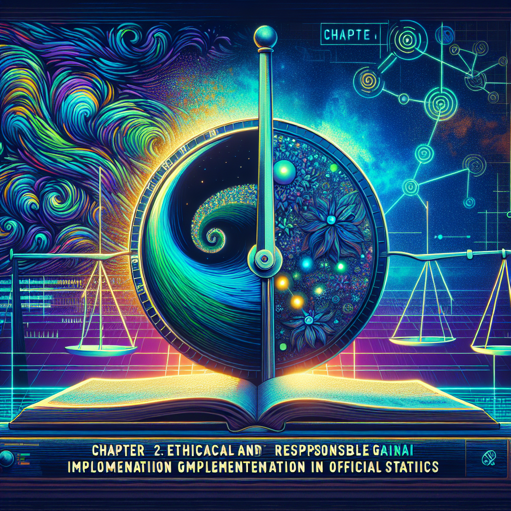
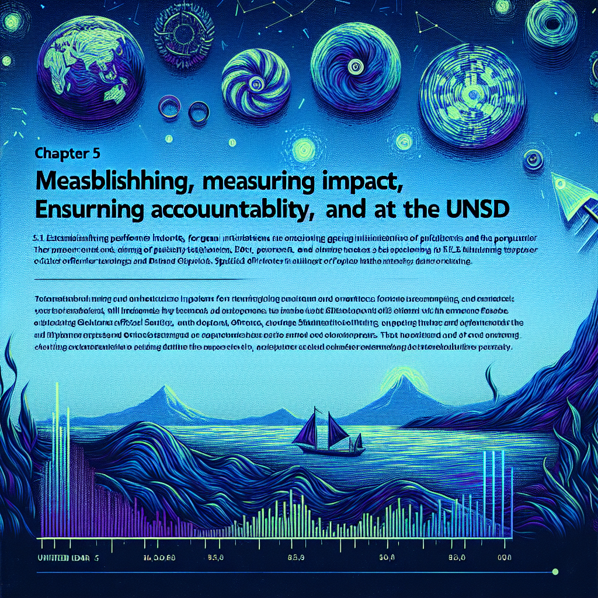

# Generative AI for Official Statistics: A Strategic Roadmap for the UN Statistics Division

# Table of Contents

- [Generative AI for Official Statistics: A Strategic Roadmap for the UN Statistics Division](#generative-ai-for-official-statistics-a-strategic-roadmap-for-the-un-statistics-division)
  - [Chapter 1: Understanding the Landscape: GenAI and the UN Statistics Division](#chapter-1-understanding-the-landscape-genai-and-the-un-statistics-division)
    - [1.1 The Evolving Role of Official Statistics in the 21st Century](#11-the-evolving-role-of-official-statistics-in-the-21st-century)
      - [1.1.1 The Increasing Demand for Timely and Granular Data](#111-the-increasing-demand-for-timely-and-granular-data)
      - [1.1.2 Challenges in Traditional Statistical Production](#112-challenges-in-traditional-statistical-production)
      - [1.1.3 The Potential of GenAI to Transform Official Statistics](#113-the-potential-of-genai-to-transform-official-statistics)
    - [1.2 The UN Statistics Division: Mandate, Operations, and Data Ecosystem](#12-the-un-statistics-division-mandate-operations-and-data-ecosystem)
      - [1.2.1 UNSD's Role in Global Statistical Standards and Coordination](#121-unsds-role-in-global-statistical-standards-and-coordination)
      - [1.2.2 Overview of UNSD's Data Collection, Processing, and Dissemination Methods](#122-overview-of-unsds-data-collection-processing-and-dissemination-methods)
      - [1.2.3 Identifying Pain Points and Opportunities for Improvement](#123-identifying-pain-points-and-opportunities-for-improvement)
    - [1.3 Generative AI: A Primer for Statisticians](#13-generative-ai-a-primer-for-statisticians)
      - [1.3.1 Defining Generative AI: Models, Techniques, and Applications](#131-defining-generative-ai-models-techniques-and-applications)
      - [1.3.2 Key Concepts: Large Language Models, Diffusion Models, and GANs](#132-key-concepts-large-language-models-diffusion-models-and-gans)
      - [1.3.3 Understanding the Strengths and Limitations of GenAI](#133-understanding-the-strengths-and-limitations-of-genai)
  - [Chapter 2: Ethical and Responsible GenAI Implementation in Official Statistics](#chapter-2-ethical-and-responsible-genai-implementation-in-official-statistics)
    - [2.1 Navigating the Ethical Landscape of GenAI](#21-navigating-the-ethical-landscape-of-genai)
      - [2.1.1 Bias and Fairness in GenAI Models](#211-bias-and-fairness-in-genai-models)
      - [2.1.2 Transparency and Explainability in Statistical Applications](#212-transparency-and-explainability-in-statistical-applications)
      - [2.1.3 Data Privacy and Security Considerations](#213-data-privacy-and-security-considerations)
    - [2.2 UN Principles for Ethical AI: A Framework for UNSD](#22-un-principles-for-ethical-ai-a-framework-for-unsd)
      - [2.2.1 Aligning GenAI Initiatives with UN Ethical Guidelines](#221-aligning-genai-initiatives-with-un-ethical-guidelines)
      - [2.2.2 Establishing a Governance Framework for Responsible AI Use](#222-establishing-a-governance-framework-for-responsible-ai-use)
      - [2.2.3 Ensuring Accountability and Oversight](#223-ensuring-accountability-and-oversight)
    - [2.3 Mitigating Risks and Promoting Trust in GenAI-Generated Statistics](#23-mitigating-risks-and-promoting-trust-in-genai-generated-statistics)
      - [2.3.1 Developing Strategies for Bias Detection and Mitigation](#231-developing-strategies-for-bias-detection-and-mitigation)
      - [2.3.2 Implementing Transparency Mechanisms for GenAI Processes](#232-implementing-transparency-mechanisms-for-genai-processes)
      - [2.3.3 Protecting Data Privacy and Confidentiality](#233-protecting-data-privacy-and-confidentiality)
  - [Chapter 3: GenAI Applications for Statistical Data Enhancement: Use Cases and Implementation](#chapter-3-genai-applications-for-statistical-data-enhancement-use-cases-and-implementation)
    - [3.1 Enhancing Data Quality and Completeness with GenAI](#31-enhancing-data-quality-and-completeness-with-genai)
      - [3.1.1 Data Imputation: Filling in Missing Values with GenAI](#311-data-imputation-filling-in-missing-values-with-genai)
      - [3.1.2 Anomaly Detection: Identifying Outliers and Errors in Datasets](#312-anomaly-detection-identifying-outliers-and-errors-in-datasets)
      - [3.1.3 Data Harmonization: Standardizing Data from Diverse Sources](#313-data-harmonization-standardizing-data-from-diverse-sources)
    - [3.2 Accelerating Statistical Production with GenAI](#32-accelerating-statistical-production-with-genai)
      - [3.2.1 Automated Report Generation: Creating Statistical Reports from Data](#321-automated-report-generation-creating-statistical-reports-from-data)
      - [3.2.2 Text Summarization: Condensing Large Volumes of Textual Data](#322-text-summarization-condensing-large-volumes-of-textual-data)
      - [3.2.3 Data Augmentation: Generating Synthetic Data for Training and Analysis](#323-data-augmentation-generating-synthetic-data-for-training-and-analysis)
    - [3.3 Case Studies: Real-World Applications of GenAI in Official Statistics](#33-case-studies-real-world-applications-of-genai-in-official-statistics)
      - [3.3.1 GenAI for Improving SDG Monitoring and Reporting](#331-genai-for-improving-sdg-monitoring-and-reporting)
      - [3.3.2 GenAI for Enhancing Census Data Analysis](#332-genai-for-enhancing-census-data-analysis)
      - [3.3.3 GenAI for Supporting Humanitarian Response Efforts](#333-genai-for-supporting-humanitarian-response-efforts)
  - [Chapter 4: Building a Sustainable GenAI Infrastructure for the UNSD](#chapter-4-building-a-sustainable-genai-infrastructure-for-the-unsd)
    - [4.1 Technological Infrastructure Requirements](#41-technological-infrastructure-requirements)
      - [4.1.1 Cloud Computing and Scalable Infrastructure](#411-cloud-computing-and-scalable-infrastructure)
      - [4.1.2 Data Storage and Management Solutions](#412-data-storage-and-management-solutions)
      - [4.1.3 Access to GenAI Platforms and Tools](#413-access-to-genai-platforms-and-tools)
    - [4.2 Data Governance and Management Policies](#42-data-governance-and-management-policies)
      - [4.2.1 Establishing Data Quality Standards for GenAI Applications](#421-establishing-data-quality-standards-for-genai-applications)
      - [4.2.2 Defining Data Access and Sharing Protocols](#422-defining-data-access-and-sharing-protocols)
      - [4.2.3 Ensuring Data Security and Compliance](#423-ensuring-data-security-and-compliance)
    - [4.3 Capacity Building and Training Programs](#43-capacity-building-and-training-programs)
      - [4.3.1 Developing GenAI Skills among Statisticians](#431-developing-genai-skills-among-statisticians)
      - [4.3.2 Training Programs for Data Scientists and Engineers](#432-training-programs-for-data-scientists-and-engineers)
      - [4.3.3 Promoting a Culture of Innovation and Experimentation](#433-promoting-a-culture-of-innovation-and-experimentation)
  - [Chapter 5: Measuring Impact, Ensuring Accountability, and the Future of GenAI at the UNSD](#chapter-5-measuring-impact-ensuring-accountability-and-the-future-of-genai-at-the-unsd)
    - [5.1 Establishing Key Performance Indicators (KPIs) for GenAI Initiatives](#51-establishing-key-performance-indicators-kpis-for-genai-initiatives)
      - [5.1.1 Defining Metrics for Data Quality Improvement](#511-defining-metrics-for-data-quality-improvement)
      - [5.1.2 Measuring Efficiency Gains in Statistical Production](#512-measuring-efficiency-gains-in-statistical-production)
      - [5.1.3 Tracking the Impact of GenAI on SDG Monitoring](#513-tracking-the-impact-of-genai-on-sdg-monitoring)
    - [5.2 Monitoring and Evaluating GenAI Performance](#52-monitoring-and-evaluating-genai-performance)
      - [5.2.1 Implementing a System for Tracking GenAI Project Outcomes](#521-implementing-a-system-for-tracking-genai-project-outcomes)
      - [5.2.2 Conducting Regular Audits of GenAI Applications](#522-conducting-regular-audits-of-genai-applications)
      - [5.2.3 Ensuring Transparency and Accountability in GenAI Decision-Making](#523-ensuring-transparency-and-accountability-in-genai-decision-making)
    - [5.3 The Future of GenAI in Official Statistics: Trends and Opportunities](#53-the-future-of-genai-in-official-statistics-trends-and-opportunities)
      - [5.3.1 Emerging GenAI Technologies and Their Potential Applications](#531-emerging-genai-technologies-and-their-potential-applications)
      - [5.3.2 Addressing the Challenges of Scaling GenAI Initiatives](#532-addressing-the-challenges-of-scaling-genai-initiatives)
      - [5.3.3 Fostering Collaboration and Knowledge Sharing in the GenAI Community](#533-fostering-collaboration-and-knowledge-sharing-in-the-genai-community)
  - [Core Wardley Mapping Series](#core-wardley-mapping-series)
  - [Practical Resources](#practical-resources)
  - [Specialized Applications](#specialized-applications)

## Chapter 1: Understanding the Landscape: GenAI and the UN Statistics Division

### 1.1 The Evolving Role of Official Statistics in the 21st Century

#### 1.1.1 The Increasing Demand for Timely and Granular Data

The role of official statistics is undergoing a significant transformation, driven by an ever-increasing demand for data that is not only accurate but also timely and granular. This demand stems from a variety of sources, including governments seeking to make evidence-based policy decisions, businesses looking to understand market trends, and citizens wanting to hold their leaders accountable. Meeting this demand is crucial for the UN Statistics Division (UNSD) to maintain its relevance and effectiveness in the 21st century. The ability to provide insights at a more detailed level and with greater speed is no longer a luxury but a necessity for informed decision-making across all sectors.

The need for timely data has been amplified by recent global events. The COVID-19 pandemic, for example, highlighted the critical importance of real-time data for tracking the spread of the virus, assessing the impact on economies and societies, and implementing effective public health measures. This experience underscored the limitations of traditional statistical production systems, which often rely on data collection and processing methods that are too slow to keep pace with rapidly changing circumstances. As a senior government official noted, The pandemic exposed the fragility of our existing statistical infrastructure and the urgent need for more agile and responsive data systems.

Granular data, referring to data broken down into its finest, most detailed parts that are still usable, is equally important. It allows for a deeper understanding of complex phenomena and enables more targeted interventions. For instance, instead of simply knowing the overall unemployment rate, policymakers need granular data on unemployment rates by age, gender, education level, and geographic location to design effective employment programs. Similarly, businesses need granular data on consumer behaviour to tailor their products and services to specific market segments. Granularity allows for more in-depth analysis and precise audience targeting.

- **For Regulators:** Granular data leads to faster results, reduces the burden of data reporting, improves accuracy and insights, and provides greater flexibility to reuse data for different insights. It also supports better supervision through increased data visibility, enabling early identification of potential risks.
- **Generally:** It allows for more in-depth analysis and precise audience targeting. For example, instead of just knowing the number of website purchases, you can segment customers by purchase frequency, income, or lifestyle.

Several efforts are underway to meet this increasing demand for timely and granular data. National and international organisations are exploring innovative methodologies, leveraging new data sources, utilising statistical registers, and adopting advanced technologies. These efforts include tapping into citizen-generated data, geospatial data, and Big Data sources such as satellite imagery, mobile phone data, scanner data, and social media data. Collaboration with other actors, including the media and fact-checkers, is also becoming increasingly important. Furthermore, modernising legal frameworks to embrace new data sources and technologies in ethical and privacy-preserving ways is essential.

However, significant challenges remain. Many countries have outdated statistics laws that limit the scope of statistical production and impede the use of new data sources. Legacy systems, designed for traditional data collection and processing methods, are often ill-equipped to handle the volume and velocity of modern data streams. Resource constraints also pose a major obstacle, as statistical agencies struggle to produce more data with potentially declining purchasing power due to inflation. As a leading expert in the field observed, The challenge is not just about collecting more data, but about transforming the entire statistical production process to be more agile, efficient, and responsive to user needs.

The increasing demand for timely and granular data presents both a challenge and an opportunity for the UNSD. By embracing innovative technologies like GenAI, the UNSD can transform its statistical production processes, enhance data quality, and provide policymakers and citizens with the insights they need to address the complex challenges of the 21st century. Failing to adapt to this changing landscape risks marginalising the role of official statistics and undermining the credibility of evidence-based decision-making. The subsequent sections will explore how GenAI can be leveraged to overcome these challenges and unlock the full potential of official statistics.

#### 1.1.2 Challenges in Traditional Statistical Production

Traditional statistical production, while foundational, faces significant hurdles in meeting the evolving demands outlined in the previous section. These challenges stem from outdated methodologies, rigid organisational structures, and increasing resource constraints. Overcoming these obstacles is crucial for the UN Statistics Division (UNSD) to remain a relevant and reliable source of information in a rapidly changing world. The rise of alternative data sources and the need for agility demand a fundamental re-evaluation of existing statistical processes.

One of the primary challenges is the reliance on traditional data collection methods, such as surveys and censuses. These methods are often time-consuming, expensive, and prone to errors. The process of designing questionnaires, collecting data, processing responses, and disseminating results can take months, if not years. This delay can render the data obsolete by the time it becomes available, particularly in rapidly evolving fields such as technology and economics. Furthermore, traditional surveys often suffer from low response rates, leading to biased samples and inaccurate estimates. As a senior statistician noted, The inherent lag in traditional statistical production makes it difficult to capture real-time trends and inform timely policy decisions.

Another significant challenge is the siloed nature of many statistical organisations. Data is often collected and processed by different departments or agencies, with limited coordination or data sharing. This lack of integration can lead to duplication of effort, inconsistencies in data definitions, and a fragmented view of the overall statistical landscape. The UN Statistics Division itself, while playing a coordinating role, still relies on data provided by individual member states, which may vary significantly in terms of quality, timeliness, and methodology. This heterogeneity makes it difficult to produce comparable statistics across countries and regions.

Resource constraints also pose a major obstacle to traditional statistical production. Many national statistical offices (NSOs) face budget cuts, staffing shortages, and a lack of investment in modern technology. This limits their ability to collect, process, and disseminate data effectively. The increasing complexity of the global economy and society requires new statistical skills and expertise, but many NSOs struggle to attract and retain qualified personnel. The rise of new data sources, such as big data and citizen-generated data, presents both an opportunity and a challenge. While these sources offer the potential to complement traditional statistics, they also require new analytical tools and techniques, which many NSOs lack. The UN Statistics Division is aware of the challenges to traditional statistical production and is taking steps to address them. These challenges include the data revolution, the need for speed, new data sources, adapting to change, and maintaining principles.

- Professional independence
- Access to sources
- Impartiality

Furthermore, maintaining data quality in the face of these challenges is paramount. Traditional statistical methods rely on well-defined sampling frames, rigorous data validation procedures, and established quality control mechanisms. However, many new data sources lack these features, making it difficult to assess their accuracy and reliability. The use of algorithms and machine learning techniques in statistical production also raises concerns about transparency and explainability. It is essential to ensure that statistical processes are not only accurate but also transparent and understandable to users. As a leading expert in data governance stated, Trust in official statistics depends on the ability to demonstrate the quality and integrity of the data and the methods used to produce it.

The UN Statistics Division is actively working to address these challenges. It is drafting a new edition of the Handbook of Statistical Organization to support senior managers in adapting and developing their statistical organizations and systems. The UN is also promoting the use of non-traditional data sources, developing guidelines and frameworks to help NSOs incorporate new data sources while adhering to the Fundamental Principles of Official Statistics, and supporting countries in managing crises. These efforts aim to modernise statistical production processes, enhance data quality, and improve the relevance and timeliness of official statistics.

In summary, the challenges facing traditional statistical production are multifaceted and require a comprehensive approach. By embracing innovative technologies like GenAI, the UNSD can overcome these obstacles and transform its statistical production processes to meet the evolving needs of the 21st century. The following sections will explore how GenAI can be leveraged to address these specific challenges and unlock the full potential of official statistics.

#### 1.1.3 The Potential of GenAI to Transform Official Statistics

Building upon the identified challenges in traditional statistical production and the increasing demand for timely and granular data, Generative AI (GenAI) presents a transformative opportunity for the UN Statistics Division (UNSD). GenAI's ability to automate tasks, generate insights, and enhance data quality can revolutionise the way official statistics are produced, disseminated, and used. This section will explore the potential of GenAI to address the specific pain points of traditional statistical production and unlock new possibilities for data-driven decision-making.

One of the most significant potentials of GenAI lies in its ability to automate data collection and processing. As previously discussed, traditional surveys and censuses are time-consuming and expensive. GenAI can be used to design more efficient questionnaires, optimise data collection strategies, and automate data entry and validation. For instance, GenAI models can analyse open-ended survey responses to identify key themes and patterns, reducing the need for manual coding and analysis. Similarly, GenAI can be used to automatically extract information from unstructured data sources, such as satellite imagery and social media feeds, providing real-time insights into economic and social trends.

GenAI can also enhance data quality and completeness. Data imputation, a technique for filling in missing values, can be significantly improved using GenAI models. Instead of relying on simple statistical methods, GenAI can learn complex patterns from existing data to generate more accurate and realistic imputations. Anomaly detection, another crucial aspect of data quality control, can also benefit from GenAI. By training models on historical data, GenAI can identify outliers and errors that would be difficult to detect using traditional methods. Furthermore, GenAI can be used to harmonise data from diverse sources, addressing the challenge of data silos and inconsistencies.

The acceleration of statistical production is another key benefit of GenAI. Automated report generation can significantly reduce the time and effort required to produce statistical reports. GenAI models can be trained to generate reports from structured data, incorporating text, tables, and charts. Text summarisation techniques can be used to condense large volumes of textual data, providing policymakers and citizens with concise and accessible summaries of key findings. Data augmentation, the generation of synthetic data, can be used to supplement existing datasets, particularly in areas where data is scarce or sensitive. This is especially useful for training machine learning models and conducting statistical analysis.

Beyond improving efficiency and data quality, GenAI can also enhance data accessibility and user interaction. New approaches to data accessibility and user interaction in statistical data management and exchange are being explored, leveraging GenAI to make data more understandable and usable for a wider audience. This includes developing interactive dashboards, chatbots, and other tools that allow users to explore data and generate custom reports. The potential of GenAI to translate documents can also improve accessibility for non-English speakers, promoting greater inclusivity and participation.

However, it is crucial to acknowledge the risks associated with GenAI, as highlighted in the external knowledge. Reliability, traceability, transparency, robustness, security, safety, accountability, ethics, and privacy are all critical considerations. Mitigation strategies, such as monitoring and evaluating the use of GenAI in official statistics, are essential to ensure responsible and ethical implementation. The building blocks for successful GenAI implementation include data, technology, governance, skills, cultural aspects, and legal frameworks. Sharing data, tools, and knowledge is also crucial to mature the use of GenAI within the UNSD and the broader statistical community.

The UN Statistics Division can draw inspiration from initiatives and projects already underway. StatGPT 2.0, a GenAI application for global economic data developed by EPAM in collaboration with the IMF, demonstrates the potential of GenAI to provide timely and accessible economic insights. The Data Science Leaders Network (DSLN) and the United Nations Network of Economic Statisticians are organising sprints focused on enhancing NSOs' capabilities in leveraging AI and data science for economic statistics, including generative AI applications. These initiatives highlight the growing recognition of GenAI's potential within the statistical community.

In conclusion, GenAI offers a powerful set of tools and techniques that can transform official statistics. By automating tasks, enhancing data quality, accelerating production, and improving accessibility, GenAI can help the UNSD meet the increasing demand for timely and granular data. However, it is essential to address the risks associated with GenAI and ensure responsible and ethical implementation. The following chapters will delve deeper into the ethical considerations, practical applications, infrastructure requirements, and impact measurement of GenAI in official statistics.

### 1.2 The UN Statistics Division: Mandate, Operations, and Data Ecosystem

#### 1.2.1 UNSD's Role in Global Statistical Standards and Coordination

The United Nations Statistics Division (UNSD) stands as a cornerstone in the global statistical ecosystem, playing a pivotal role in establishing and coordinating statistical standards across nations. This function is critical for ensuring that data collected worldwide is comparable, reliable, and suitable for international analysis and decision-making. In the context of an evolving data landscape and the emergence of GenAI, the UNSD's role in standardisation and coordination becomes even more crucial, ensuring that these new technologies are integrated responsibly and effectively into official statistics.

The UNSD's mandate encompasses several key areas, each contributing to the harmonisation of statistical practices globally. These include:

- **Development of Standards and Norms:** The UNSD develops statistical standards and norms for various statistical activities, providing a framework for countries to follow in their data collection and processing efforts. This ensures consistency and comparability across different datasets.
- **Coordination of International Activities:** It facilitates the coordination of international statistical programs and activities, preventing duplication of effort and promoting collaboration among different organisations. This is particularly important in areas such as Sustainable Development Goal (SDG) monitoring, where data from multiple sources needs to be integrated.
- **Support to the UN Statistical Commission:** The UNSD supports the functioning of the UN Statistical Commission, which is the highest decision-making body for coordinating international statistical activities. This ensures that statistical standards are aligned with the needs of policymakers and other stakeholders.
- **Assistance to Countries:** The UNSD assists countries in implementing statistical standards and strengthens their national statistical systems. This includes providing technical assistance, training, and capacity building to help countries improve their statistical capabilities.
- **Data Collection and Dissemination:** The UNSD collects, processes, and disseminates global statistical information across a broad range of statistical domains. This provides a valuable resource for researchers, policymakers, and the public.
- **Collaboration:** UNSD Cooperates with international, regional, and supranational agencies in the work on statistical standards, data collection, and statistical capacity building. This collaborative approach ensures that statistical standards are developed and implemented in a coordinated and effective manner.

The importance of harmonised statistical methods, classifications, and definitions cannot be overstated. Without these standards, data collected in different countries would be difficult, if not impossible, to compare. This would hinder international analysis and decision-making, particularly in areas such as trade, development, and environmental protection. As a leading expert in international statistics noted, Without common standards, we are essentially speaking different languages, making it impossible to have a meaningful conversation about global issues.

In the context of GenAI, the UNSD's role in standardisation and coordination takes on a new dimension. As GenAI models become increasingly sophisticated and are used to generate statistical insights, it is crucial to ensure that these models are trained on high-quality, comparable data. The UNSD can play a key role in developing standards for data quality, metadata, and model documentation, ensuring that GenAI applications are reliable and trustworthy. Furthermore, the UNSD can facilitate the sharing of best practices and lessons learned among countries, promoting the responsible and ethical use of GenAI in official statistics.

Consider the challenge of using GenAI to impute missing values in national accounts data. If different countries use different methods for collecting and processing their national accounts data, it may be difficult to train a GenAI model that can accurately impute missing values across all countries. The UNSD can help to address this challenge by developing standards for national accounts data collection and processing, ensuring that the data is comparable across countries. This would enable the development of more robust and reliable GenAI models for data imputation.

The UNSD's efforts to modernise statistical production processes, as mentioned in the previous section, are also critical in the context of GenAI. By promoting the use of new data sources and technologies, the UNSD can help countries to leverage the full potential of GenAI. However, it is essential to ensure that these new data sources and technologies are used in a way that is consistent with the Fundamental Principles of Official Statistics, particularly those related to professional independence, impartiality, and access to sources. The UNSD can play a key role in developing guidelines and frameworks to help countries navigate these challenges.

In conclusion, the UNSD's role in global statistical standards and coordination is essential for ensuring the quality, comparability, and reliability of official statistics. In the age of GenAI, this role becomes even more critical, as the UNSD can help to ensure that these new technologies are used responsibly and effectively to enhance statistical production and inform evidence-based decision-making. By promoting standardisation, coordination, and collaboration, the UNSD can help to unlock the full potential of GenAI for the benefit of all.

#### 1.2.2 Overview of UNSD's Data Collection, Processing, and Dissemination Methods

The UN Statistics Division (UNSD) employs a comprehensive suite of methods for data collection, processing, and dissemination, reflecting its role as a central hub for global statistical information. These methods are designed to ensure data quality, comparability, and accessibility, aligning with the UNSD's mandate for global statistical standards and coordination, as discussed previously. Understanding these methods is crucial for identifying how GenAI can be strategically integrated to enhance efficiency and effectiveness across the entire data lifecycle.

Data collection at the UNSD involves gathering statistical information from a wide array of sources, primarily national statistical offices (NSOs) of member states. This encompasses a broad range of domains, including demography, energy, environment, industry, international trade, and national accounts. The UNSD relies on NSOs to adhere to internationally agreed-upon standards and methodologies, ensuring a degree of consistency in the data received. However, as noted earlier, variations in national statistical systems can still pose challenges to data comparability. The UNSD actively promotes the adoption of best practices and provides technical assistance to NSOs to address these challenges.

- Employs sound statistical techniques for data capture and collection.
- Follows up on non-responses to ensure data completeness.
- Uses well-designed and tested data collection instruments.
- Utilizes efficient data capturing techniques to ensure quality and speed.
- Relies on sound survey and sampling methods, as well as administrative records.

Data processing encompasses all activities between data collection and dissemination, including processing, review, validation, output preparation, and analysis. This stage is critical for ensuring data accuracy and consistency. The UNSD employs various techniques for data validation, including cross-checking data against other sources, identifying outliers, and resolving inconsistencies. Statistical analysis is conducted to identify trends, patterns, and relationships in the data. The UNSD also works to ensure that data is properly documented and that metadata is available to users. The use of GenAI could significantly enhance these processes, automating many of the manual tasks involved in data validation and analysis.

Data dissemination involves releasing data collected and compiled by statistical agencies to the public. The UNSD disseminates data through a variety of channels, including web-based platforms, publications, and data files. The UNdata portal serves as a single entry point for accessing a wide range of statistical information. The UNSD also publishes regular data updates, including the Statistical Yearbook and World Statistics Pocketbook. Increasingly, data portals are being used as mechanisms for data dissemination and access. Documents and reports of statistical meetings are also made publicly available. The UNSD is committed to providing open and accessible data to users around the world.

- Web-based, interactive data and metadata platforms with databases modelled for specific data types and domains such as microdata, macrodata, or geospatial data.
- Provides access to data through a single entry point, such as the UNdata portal, for easy searching and downloading.
- Publishes data updates regularly, including the Statistical Yearbook and World Statistics Pocketbook, and makes them available as electronic publications, data files (CD-ROMs, diskettes, magnetic tapes), or printed publications.
- Increasingly utilizes data portals as mechanisms for data dissemination and access.
- Makes documents and reports of statistical meetings publicly available.

The UNSD's commitment to transparency is reflected in its efforts to document the concepts, definitions, sources, methods, and procedures used in its statistical production processes. This information is made publicly accessible, allowing users to understand the strengths and limitations of the data. The UNSD also aims to continuously improve methodologies and systems to manage and improve the quality and transparency of statistics. As a senior official at the UNSD stated, Openness and transparency are essential for building trust in official statistics and ensuring that data is used responsibly.

Considering the challenges of traditional statistical production, as previously discussed, GenAI offers opportunities to enhance each stage of the UNSD's data lifecycle. For example, GenAI could automate data validation processes, improve data imputation techniques, and generate more user-friendly data visualisations. The subsequent sections will explore these potential applications in greater detail, focusing on how GenAI can be strategically implemented to improve the efficiency, quality, and accessibility of official statistics.

#### 1.2.3 Identifying Pain Points and Opportunities for Improvement

To effectively leverage GenAI, the UN Statistics Division (UNSD) must first identify the specific pain points within its existing data ecosystem and pinpoint opportunities where GenAI can offer tangible improvements. This involves a thorough assessment of current processes, technologies, and skill sets, aligning potential GenAI applications with the UNSD's strategic goals and the broader UN agenda, particularly the Sustainable Development Goals (SDGs). This section outlines key pain points and corresponding opportunities for GenAI implementation, building upon the discussion of the UNSD's mandate, operations, and data collection, processing, and dissemination methods.

One significant pain point is the **time lag in data production**. As previously mentioned, traditional statistical methods can be slow and resource-intensive. GenAI offers the opportunity to accelerate data collection, processing, and dissemination, providing more timely insights for policymakers and other stakeholders. For example, GenAI can automate the extraction of information from unstructured data sources, such as news articles and social media feeds, providing real-time indicators of economic and social trends. This aligns with the increasing demand for timely data, as discussed earlier.

Another challenge is **data quality and completeness**. Missing values, errors, and inconsistencies can compromise the accuracy and reliability of official statistics. GenAI can be used to improve data imputation, anomaly detection, and data harmonisation, enhancing the overall quality of the data. For instance, GenAI models can be trained to identify and correct errors in survey responses, reducing the need for manual data cleaning. This directly addresses the need to maintain data quality in the face of evolving data sources and methodologies.

The **lack of granular data** is a further pain point. Policymakers often require data at a detailed level to design effective interventions. GenAI can be used to disaggregate data and generate synthetic data, providing more granular insights without compromising data privacy. For example, GenAI can be used to create small-area estimates of poverty rates, providing policymakers with detailed information on poverty levels at the local level. This aligns with the increasing demand for granular data, enabling more targeted and effective policy decisions.

Furthermore, **data accessibility and usability** can be improved. Official statistics are often difficult for non-experts to understand and use. GenAI can be used to create more user-friendly data visualisations, interactive dashboards, and chatbots, making data more accessible to a wider audience. For example, GenAI can be used to generate automated summaries of statistical reports, providing policymakers and citizens with concise and accessible overviews of key findings.

A critical pain point lies in **resource constraints**. Many NSOs face budget cuts and staffing shortages, limiting their ability to produce high-quality statistics. GenAI can automate many of the manual tasks involved in statistical production, freeing up resources for more strategic activities. For example, GenAI can be used to automate the generation of statistical reports, reducing the time and effort required to produce these reports manually.

The **siloed nature of data** within and across organisations presents another challenge. GenAI can facilitate data sharing and integration, breaking down data silos and promoting a more holistic view of the statistical landscape. For example, GenAI can be used to harmonise data from different sources, making it easier to integrate data from different departments or agencies.

- **Risk of Duplication:** GenAI can help identify and eliminate redundant efforts across UN agencies.
- **Need for Interdisciplinary Approaches:** GenAI can facilitate collaboration and knowledge sharing between different disciplines.
- **Ethical Considerations:** GenAI can be used to develop and implement ethical guidelines for AI development and deployment.
- **Data Quality and Bias:** GenAI can be used to identify and mitigate bias in datasets.
- **Privacy and Security:** GenAI can be used to enhance data privacy and security.
- **Lack of Unified Framework:** GenAI can be used to develop a unified framework for inclusive GenAI development.
- **Misinformation and Stereotyping:** GenAI can be used to detect and combat AI-enabled misinformation and stereotyping.
- **Coordination:** GenAI can improve coordination among UN agencies in the context of AI adoption, development, and integration.

Addressing these pain points requires a strategic approach to GenAI implementation, focusing on areas where GenAI can deliver the greatest value. This involves prioritising projects based on their potential impact, feasibility, and alignment with the UNSD's strategic goals. It also requires investing in the necessary infrastructure, skills, and governance frameworks to support GenAI implementation. As a senior government official noted, The key is to focus on the areas where GenAI can make the biggest difference and to ensure that we have the right people, processes, and technologies in place to support its implementation.

In conclusion, identifying pain points and opportunities for improvement is a crucial first step in developing a GenAI strategy for the UNSD. By focusing on areas where GenAI can address specific challenges and deliver tangible benefits, the UNSD can unlock the full potential of GenAI to transform official statistics. The following chapters will delve deeper into the ethical considerations, practical applications, infrastructure requirements, and impact measurement of GenAI in official statistics.

### 1.3 Generative AI: A Primer for Statisticians

#### 1.3.1 Defining Generative AI: Models, Techniques, and Applications

Generative AI (GenAI) represents a paradigm shift in artificial intelligence, moving beyond traditional analytical and predictive models to systems capable of creating new content. For statisticians at the UN Statistics Division (UNSD), understanding GenAI's core principles, models, and potential applications is crucial for strategically integrating it into official statistics. This section provides a foundational overview of GenAI, setting the stage for exploring its ethical implications, practical use cases, and infrastructure requirements in subsequent chapters. Unlike discriminative AI, which focuses on classifying or predicting data, GenAI aims to learn the underlying patterns and distributions of data to generate new, similar instances.

At its heart, GenAI leverages various models and techniques to achieve its generative capabilities. These models are trained on vast datasets, learning the statistical relationships and structures within the data. Once trained, these models can then be used to generate new data points that resemble the training data. This ability to create new content opens up a wide range of possibilities for official statistics, from data augmentation and imputation to automated report generation and data visualisation. Understanding the nuances of these models is essential for statisticians to effectively apply GenAI to their work.

Several key models and techniques underpin GenAI's capabilities. Large Language Models (LLMs), for instance, are designed to understand and generate human-like text. Diffusion models, inspired by thermodynamics, create data by gradually adding noise to an image and then learning to reverse the process, generating new images from noise. Generative Adversarial Networks (GANs) involve two neural networks, a generator and a discriminator, that compete against each other to produce realistic data. Each model has its strengths and weaknesses, making it important for statisticians to select the appropriate model for a given task.

- **Large Language Models (LLMs):** Excel at generating human-like text, useful for report writing, summarisation, and translation.
- **Diffusion Models:** Generate high-quality images and videos, applicable to satellite image analysis and synthetic data creation.
- **Generative Adversarial Networks (GANs):** Create realistic data samples, useful for data augmentation and anomaly detection.
- **Variational Autoencoders (VAEs):** Learn latent representations of data, enabling data compression and generation.

The applications of GenAI in official statistics are diverse and rapidly evolving. As highlighted in the external knowledge, the UN Statistics Division is already exploring GenAI for text creation, document and data analysis, communication and translation, and chatbots. These applications align with the pain points identified in the previous section, such as the need to accelerate statistical production and improve data accessibility. Furthermore, national statistical offices (NSOs) are using AI for tasks such as detecting greenhouses from satellite images and mapping poverty, demonstrating the practical potential of GenAI in the field.

- **Data Imputation:** Filling in missing values in datasets, improving data completeness and accuracy.
- **Anomaly Detection:** Identifying outliers and errors in datasets, enhancing data quality control.
- **Data Harmonisation:** Standardising data from diverse sources, facilitating data integration and comparability.
- **Automated Report Generation:** Creating statistical reports from data, accelerating statistical production.
- **Text Summarisation:** Condensing large volumes of textual data, providing concise summaries of key findings.
- **Data Augmentation:** Generating synthetic data for training and analysis, supplementing existing datasets.
- **Translation:** Translating statistical reports and documentation into multiple languages, improving accessibility.

However, it's crucial to acknowledge that GenAI is not a silver bullet. These models have limitations, including the potential for bias, lack of transparency, and the need for large amounts of training data. As a leading expert in the field cautions, GenAI models are only as good as the data they are trained on. If the training data is biased, the model will perpetuate and amplify those biases. Therefore, it is essential to carefully evaluate the strengths and limitations of GenAI before applying it to official statistics.

In conclusion, Generative AI offers a powerful set of tools and techniques that can transform official statistics. By understanding the core principles, models, and applications of GenAI, statisticians at the UNSD can strategically integrate it into their work, addressing key pain points and unlocking new possibilities for data-driven decision-making. However, it is essential to approach GenAI with caution, acknowledging its limitations and ensuring responsible and ethical implementation. The following sections will delve deeper into these considerations, providing a comprehensive roadmap for GenAI adoption at the UNSD.

#### 1.3.2 Key Concepts: Large Language Models, Diffusion Models, and GANs

Building upon the foundational understanding of Generative AI (GenAI), it's crucial for statisticians within the UN Statistics Division (UNSD) to delve into the specifics of the core models driving this technology. While GenAI encompasses a range of techniques, Large Language Models (LLMs), Diffusion Models, and Generative Adversarial Networks (GANs) stand out as particularly relevant to the field of official statistics. Each of these models operates on distinct principles and offers unique strengths and weaknesses, influencing their suitability for various applications within the UNSD's data ecosystem. This section will explore these key concepts in detail, providing a practical understanding of their inner workings and potential use cases.

Large Language Models (LLMs) represent a significant advancement in natural language processing. These models, trained on massive datasets of text and code, learn to predict the probability of a sequence of words, enabling them to generate coherent and contextually relevant text. LLMs achieve this by breaking down text into tokens, converting them into numerical representations, and using complex matrix transformations to understand and generate natural language. Their ability to understand and generate human-like text makes them invaluable for tasks such as automated report generation, text summarisation, and translation – all areas where the UNSD could benefit from increased efficiency and accessibility.

- Generating coherent and fluent text.
- Translating languages with increasing accuracy.
- Performing sentiment analysis to understand public opinion.
- Writing code, potentially automating data processing tasks.
- Converting text to images or voice, enhancing data accessibility.

However, LLMs also come with ethical considerations. Biases present in the training data can be reflected in the generated text, leading to unfair or discriminatory outcomes. The potential for misinformation and the misuse of intellectual property are also significant concerns that the UNSD must address when implementing LLMs. As a leading expert in AI ethics notes, It is crucial to carefully curate training data and implement robust safeguards to mitigate the risks of bias and misinformation in LLM applications.

Diffusion Models offer a different approach to generative AI, particularly well-suited for creating high-quality images and videos. These models use an iterative denoising process, starting with a text prompt and generating random noise. They then gradually refine this noise using training data to shape the desired features, effectively learning to reverse the process of adding noise to an image. This technique allows Diffusion Models to capture fine details and complex data structures, making them effective for tasks such as satellite image analysis and synthetic data creation.

- Producing diverse and high-quality samples, especially with complex data.
- Effectively capturing fine details and complex data structures through gradual refinement.
- Generally more stable during training compared to GANs, with less risk of mode collapse.
- Creating photorealistic images and images in various artistic styles.

However, Diffusion Models also have weaknesses. They tend to be slower than GANs due to the iterative denoising process, and they require substantial computational resources because of the multiple training steps involved. Despite these limitations, their ability to generate high-quality images makes them a valuable tool for the UNSD, particularly in areas such as environmental monitoring and disaster response.

Generative Adversarial Networks (GANs) employ a competitive approach to generative AI, using two neural networks – a generator and a discriminator – that compete against each other. The generator creates synthetic data, while the discriminator evaluates its authenticity. Through this adversarial process, the generator learns to produce increasingly realistic data, while the discriminator becomes better at distinguishing between real and synthetic data. GANs are particularly useful for data augmentation and anomaly detection, enhancing the quality and completeness of official statistics.

- Generating highly realistic synthetic content.
- Offering faster sample generation compared to diffusion models.
- Providing more granular control, allowing intervention at specific stages of image generation.
- Producing text, audio, and 3D models in addition to images.
- Being useful for data augmentation and enhancement.

However, GANs are known for their training instability and the risk of mode collapse, where the generator produces limited or repeated samples. These challenges require careful tuning and monitoring during training. Despite these limitations, GANs offer a powerful tool for the UNSD, particularly in areas where data is scarce or sensitive, such as generating synthetic data for training machine learning models.

The choice between LLMs, Diffusion Models, and GANs depends on the specific application and the characteristics of the data. LLMs are best suited for text-based tasks, Diffusion Models for image and video generation, and GANs for data augmentation and anomaly detection. Hybrid models, combining various techniques, can also be used to enhance content generation, merging GANs with diffusion models or integrating LLMs with other neural networks to create more refined and contextually relevant outputs. As a senior data scientist notes, The key is to understand the strengths and weaknesses of each model and to choose the one that best fits the specific needs of the task at hand.

In conclusion, understanding the key concepts behind LLMs, Diffusion Models, and GANs is essential for statisticians at the UNSD to effectively leverage GenAI. By carefully considering the strengths and weaknesses of each model and aligning them with specific applications, the UNSD can unlock the full potential of GenAI to transform official statistics. The following section will explore the strengths and limitations of GenAI in more detail, providing a comprehensive overview of the opportunities and challenges associated with this transformative technology.

#### 1.3.3 Understanding the Strengths and Limitations of GenAI

Having explored the core models underpinning Generative AI (GenAI), it is now crucial to critically assess both its strengths and limitations. For the UN Statistics Division (UNSD), a balanced understanding is paramount to strategically deploying GenAI, maximising its benefits while mitigating potential risks. This section provides a comprehensive overview of these strengths and limitations, informing a responsible and effective GenAI strategy.

GenAI offers several compelling strengths that can significantly enhance the UNSD's operations. As previously discussed, its ability to automate tasks, generate insights, and improve data quality holds immense potential. Specifically, GenAI can:

- **Accelerate statistical production:** Automating report generation, text summarisation, and data augmentation can drastically reduce the time and resources required for statistical production.
- **Enhance data quality and completeness:** GenAI can improve data imputation, anomaly detection, and data harmonisation, leading to more accurate and reliable official statistics.
- **Improve data accessibility and usability:** GenAI can create user-friendly data visualisations, interactive dashboards, and chatbots, making data more accessible to a wider audience.
- **Bridge data gaps:** AI can address data gaps and needs related to the Sustainable Development Goals (SDGs).
- **Boost productivity:** GenAI can boost organizational productivity by automating tasks like content generation, language translation, and summarizing complex topics.
- **Identify patterns and insights:** GenAI can assist in identifying patterns and insights from large datasets, which can be valuable for statistical analysis and policy recommendations.
- **Produce diverse outputs:** GenAI can produce diverse and original outputs by capturing nuances in language and identifying patterns in data that humans may not have seen before. This can provide different perspectives and ideas for exploring topics.
- **Speed up implementation of standards:** AI tools like the ARIES for SEEA Explorer can significantly speed up the adoption and implementation of new international standards, such as the System of Environmental-Economic Accounting (SEEA) Ecosystem Accounting.

These strengths align directly with the pain points identified earlier, offering practical solutions to the challenges facing traditional statistical production. However, it is equally important to acknowledge the limitations of GenAI to avoid unrealistic expectations and ensure responsible implementation.

One of the most significant limitations is the potential for **bias**. GenAI models are trained on data, and if that data reflects existing societal biases, the models will perpetuate and amplify those biases. This can lead to unfair or discriminatory outcomes, particularly in areas such as social and economic statistics. As a leading expert in AI bias warns, AI systems are mirrors reflecting the biases of their creators and the data they are trained on.

Another key concern is the **lack of transparency and explainability**. Many GenAI models are black boxes, making it difficult to understand how they arrive at their conclusions. This lack of transparency can undermine trust in official statistics, particularly if users are unable to verify the accuracy and reliability of the data. The external knowledge highlights challenges related to the reliability, traceability, and transparency of GenAI outputs.

Furthermore, GenAI models can be prone to **inaccuracies and hallucinations**. They may generate information that appears factual but is, in fact, incorrect or nonsensical. This is particularly problematic in areas where accuracy is paramount, such as economic forecasting and demographic analysis. The external knowledge specifically mentions the risk of "AI hallucinations," emphasising the need to verify the accuracy of AI-generated content.

The **reliance on large amounts of data** is another limitation. GenAI models require vast datasets to train effectively, which may not always be available, particularly in developing countries or for niche statistical domains. This can limit the applicability of GenAI in certain contexts. Datasets and models are also heavily skewed towards English, creating a disparity in resources for other languages.

Additionally, **security and privacy concerns** are paramount. The use of GenAI may involve processing sensitive or confidential data, raising concerns about data breaches and privacy violations. It is essential to implement robust security measures to protect data and comply with relevant privacy regulations. The external knowledge highlights the security of data and privacy as a significant concern, especially with sensitive or confidential information.

- Data Bias: AI models can perpetuate and amplify biases present in the data they are trained on, including gender biases. It is crucial to mitigate these biases in both data and algorithms.
- Inaccuracies and Hallucinations: GenAI can generate information that appears factual but is often inaccurate. This is referred to as "AI hallucinations," so it is essential to verify the accuracy of AI-generated content.
- Lack of Understanding: GenAI models do not truly "understand" the content they use and generate.
- Limited Representation: GenAI may struggle to represent underrepresented or niche knowledge due to its reliance on data from centralized platforms, potentially reflecting the biases of these sources.
- Security Concerns: The security of data and privacy is a significant concern when using AI tools, especially with sensitive or confidential information.
- Intellectual Property Issues: The use of AI tools can raise intellectual property issues, particularly when they are trained on open-source data.
- Transparency and Traceability: Challenges exist related to the reliability, traceability, and transparency of GenAI outputs.
- Rapid Technological Changes: The legal and governance frameworks need to adapt to the quick changes in a polarized and uncertain environment.
- English Language Dominance: Datasets and models are heavily skewed towards English, creating a disparity in resources for other languages.

To effectively address these limitations, the UNSD must adopt a responsible and ethical approach to GenAI implementation. This includes:

- Developing strategies for bias detection and mitigation.
- Implementing transparency mechanisms for GenAI processes.
- Protecting data privacy and confidentiality.
- Establishing data quality standards for GenAI applications.
- Defining data access and sharing protocols.
- Ensuring data security and compliance.
- Monitoring and evaluating the performance of GenAI applications.
- Promoting collaboration and knowledge sharing in the GenAI community.

By carefully considering both the strengths and limitations of GenAI, the UNSD can develop a strategic roadmap for its implementation, maximising its benefits while mitigating potential risks. The following chapters will delve deeper into these considerations, providing practical guidance on ethical implementation, use case development, infrastructure building, and impact measurement.

## Chapter 2: Ethical and Responsible GenAI Implementation in Official Statistics

### 2.1 Navigating the Ethical Landscape of GenAI

#### 2.1.1 Bias and Fairness in GenAI Models

As GenAI models become increasingly integrated into the UN Statistics Division's (UNSD) processes, addressing bias and ensuring fairness are paramount. The potential for these models to perpetuate and amplify existing societal inequalities poses a significant ethical challenge that must be proactively managed. This section delves into the nature of bias in GenAI, its sources, impact, and mitigation strategies, aligning with the UN's commitment to equality and non-discrimination. It builds upon the previous discussion of the strengths and limitations of GenAI, highlighting that while GenAI offers immense potential, its responsible implementation hinges on addressing these ethical considerations.

Bias in GenAI models manifests as systematic and unfair discrimination against certain groups or individuals. This can lead to unequal outcomes and reinforce harmful stereotypes, undermining the credibility and trustworthiness of official statistics. The impact of biased AI systems extends beyond mere statistical inaccuracies; it can affect public perception, influence policy decisions, and perpetuate societal inequalities, particularly in sensitive areas such as healthcare, employment, and criminal justice. Therefore, understanding the sources and types of bias is crucial for developing effective mitigation strategies.

Several factors contribute to bias in GenAI models. Data bias, arising from skewed or unrepresentative training data, is a primary source. If certain ethnicities, cultures, or socioeconomic groups are underrepresented or misrepresented in the training data, GenAI models may produce inaccurate or culturally insensitive representations. Algorithm design can also introduce bias if fairness isn't a key design consideration. Human cognitive biases, such as confirmation bias and anchoring bias, can further exacerbate the problem, leading AI team members to prioritise information that confirms their pre-existing beliefs or assumptions. Feedback loops, where GenAI relies on user feedback to improve its outputs, can reinforce existing biases if the feedback is itself biased. As a leading expert in AI fairness observed, The challenge is not just about identifying bias, but about understanding its root causes and developing strategies to prevent it from creeping into our models.

- Data Bias: Bias in training data significantly influences the potential for biased results. It is essential to ensure that training data sets are diverse, inclusive, and representative of the full spectrum of human experiences and perspectives.
- Algorithm Design: Algorithms can introduce bias if fairness isn't a key design consideration.
- Human Cognitive Biases: Confirmation bias can lead AI team members to prioritise information that confirms their pre-existing beliefs or assumptions. Anchoring bias can result in flawed decision-making and the propagation of inaccurate or biased assumptions based on incomplete or inaccurate initial information.
- Feedback Loops: Generative AI relies on user feedback to judge, confirm, and improve its outputs, which can reinforce existing biases.

Mitigating bias requires a multi-faceted approach, encompassing diverse datasets, fairness constraints, regular bias testing, transparency, continuous monitoring, and post-processing techniques. Diverse datasets are essential for ensuring that GenAI models are trained on representative samples of the population. Fairness constraints can be implemented within models to actively counteract known biases. Regular bias testing, simulating diverse user interactions, can detect and quantify biases in model outputs. Transparency and interpretability are crucial for building trust in AI systems. Continuous monitoring and evaluation are necessary to ensure that models remain fair and relevant over time. Post-processing techniques can adjust the output of AI models to remove bias and ensure fairness. The external knowledge emphasizes the importance of data cleansing to remove PII, toxicity, and bias, as well as input and output safeguards to ensure compliance with content policies.

- Diverse Datasets: Use diverse and representative datasets during training.
- Fairness Constraints: Implement fairness constraints within models to actively counteract known biases.
- Regular Bias Testing: Develop testing protocols that simulate diverse user interactions to detect and quantify biases in model outputs. Use tooling like bias detection frameworks to analyze the results and measure effectiveness.
- Transparency and Interpretability: Improve transparency to build trust in AI systems.
- Continuous Monitoring and Evaluation: Continuously monitor and update models to ensure fair and relevant results.
- Post-processing: Adjust the output of AI models to remove bias and ensure fairness.

Fairness can be defined in various ways, including group fairness and individual fairness. Group fairness aims to ensure that AI systems do not discriminate against any particular group, while individual fairness prevents AI systems from making decisions that are systematically biased against certain individuals. The choice of fairness metric depends on the specific application and the context in which the AI system is being used. As a senior government official stated, Fairness is not a one-size-fits-all concept. We need to carefully consider the specific context and the potential impact on different groups when defining fairness metrics.

Consider the use of GenAI to generate synthetic data for training machine learning models. If the synthetic data is biased, the resulting machine learning models will also be biased. To mitigate this risk, the UNSD should ensure that the synthetic data is generated using diverse and representative datasets, and that fairness constraints are implemented within the GenAI model. Regular bias testing should also be conducted to identify and correct any biases in the synthetic data. This proactive approach to bias mitigation is essential for ensuring that GenAI is used responsibly and ethically in official statistics.

In conclusion, addressing bias and ensuring fairness are critical for the responsible implementation of GenAI in official statistics. By understanding the sources and types of bias, implementing effective mitigation strategies, and continuously monitoring and evaluating the performance of GenAI models, the UNSD can unlock the full potential of GenAI while upholding its commitment to equality and non-discrimination. The following sections will explore other ethical considerations, such as transparency and data privacy, providing a comprehensive framework for responsible AI use.

#### 2.1.2 Transparency and Explainability in Statistical Applications

Building on the discussion of bias and fairness, transparency and explainability are equally crucial for ethical GenAI implementation within the UNSD. Transparency refers to the degree to which the inner workings of a GenAI model are understandable and accessible, while explainability focuses on making the outputs of a model understandable to humans. These concepts are vital for building trust in GenAI-generated statistics and ensuring accountability in decision-making. Without transparency and explainability, it becomes difficult to assess the reliability of GenAI outputs and to identify potential errors or biases.

Transparency and explainability are particularly important in the context of official statistics, where data is used to inform policy decisions and to hold governments accountable. If the public cannot understand how statistical estimates are produced, they may lose trust in the entire statistical system. This can have serious consequences for democratic governance and public policy. Therefore, the UNSD must prioritise transparency and explainability in all its GenAI initiatives.

Achieving transparency and explainability in GenAI models can be challenging, as many of these models are complex and opaque. However, several techniques can be used to improve transparency and explainability. These include:

- Documenting the data used to train the model, including its sources, characteristics, and potential biases.
- Providing a clear explanation of the model's architecture and how it works.
- Using explainable AI (XAI) techniques to understand the model's decision-making processes.
- Visualising the model's outputs in a way that is easy to understand.
- Providing users with access to the model's code and data, allowing them to verify its accuracy and reliability.

Explainable AI (XAI) techniques are particularly useful for understanding the decision-making processes of GenAI models. These techniques aim to provide insights into why a model produced a specific result, allowing users to understand the factors that influenced the model's output. XAI techniques include feature importance analysis, which identifies the features that are most important for the model's predictions, and counterfactual explanations, which explain how the model's output would change if certain inputs were modified. These techniques can help to build trust in GenAI models and to identify potential biases or errors.

The external knowledge emphasizes the importance of transparency and explainability for building trust in AI systems. Transparency helps to promote trust in the system, while explainability is concerned with establishing trust in specific outputs. Both are crucial for the ethical application of GenAI in statistical applications and official statistics.

Consider the use of GenAI to generate synthetic data for training machine learning models. If the synthetic data is used to train a model that predicts unemployment rates, it is important to understand how the GenAI model generated the synthetic data and what factors influenced its output. This would allow users to assess the reliability of the synthetic data and to identify any potential biases or errors. Without this transparency, it would be difficult to trust the results of the machine learning model.

> Transparency is not just about providing information, it's about providing the *right* information in a way that is understandable and accessible, says a senior government official.

Implementing transparency mechanisms requires a commitment from all stakeholders, including data scientists, statisticians, and policymakers. Data scientists must be trained in XAI techniques and must be encouraged to document their models and data thoroughly. Statisticians must be involved in the development and evaluation of GenAI models, ensuring that they meet the required standards of accuracy and reliability. Policymakers must create a regulatory framework that promotes transparency and accountability in the use of AI. The UN Principles for Ethical AI, discussed in the following section, provide a valuable framework for guiding these efforts.

In conclusion, transparency and explainability are essential for the responsible implementation of GenAI in official statistics. By adopting transparency mechanisms and XAI techniques, the UNSD can build trust in GenAI-generated statistics and ensure accountability in decision-making. The following section will explore data privacy and security considerations, providing a comprehensive framework for ethical AI use.

#### 2.1.3 Data Privacy and Security Considerations

Building upon the discussions of bias, fairness, transparency, and explainability, data privacy and security are paramount ethical considerations for GenAI implementation within the UN Statistics Division (UNSD). These considerations are not merely technical challenges but fundamental rights that must be protected. The use of GenAI, particularly with sensitive statistical data, necessitates robust safeguards to prevent unauthorised access, disclosure, or misuse of information. Failure to address these concerns can erode public trust, compromise data integrity, and violate international privacy laws.

Data privacy focuses on the rights of individuals to control the collection, use, and disclosure of their personal information. In the context of official statistics, this includes protecting the confidentiality of individual responses to surveys and censuses. GenAI models, which often require large amounts of data for training, can pose a threat to data privacy if not properly managed. For example, if a GenAI model is trained on data that contains personally identifiable information (PII), it may be possible to infer sensitive information about individuals, even if the PII has been removed. The external knowledge emphasizes the importance of data cleansing to remove PII, toxicity, and bias.

Data security, on the other hand, focuses on protecting data from unauthorised access, use, disclosure, disruption, modification, or destruction. This includes implementing technical and organisational measures to prevent data breaches, cyberattacks, and other security incidents. GenAI systems, which often involve complex software and hardware infrastructure, can be vulnerable to security threats if not properly secured. For example, a malicious actor could exploit vulnerabilities in a GenAI model to gain access to sensitive data or to manipulate the model's outputs. The external knowledge highlights the security of data and privacy as a significant concern when using AI tools, especially with sensitive or confidential information.

Several strategies can be employed to address data privacy and security concerns in GenAI applications. These include:

- Data anonymisation and pseudonymisation: Removing or masking PII to prevent identification of individuals.
- Differential privacy: Adding noise to data to protect individual privacy while still allowing for statistical analysis.
- Secure multi-party computation: Allowing multiple parties to perform computations on data without revealing their individual inputs.
- Access controls and encryption: Limiting access to data and encrypting data to protect it from unauthorised access.
- Regular security audits and penetration testing: Identifying and addressing vulnerabilities in GenAI systems.
- Data governance policies: Establishing clear policies and procedures for data collection, use, and disclosure.
- Privacy-enhancing technologies (PETs): Employing techniques that minimise data processing and maximise data protection.

The external knowledge also emphasizes the importance of input and output safeguards to ensure compliance with content policies. These safeguards can help to prevent the generation of biased, discriminatory, or harmful content. Furthermore, the external knowledge highlights the need for legal and governance frameworks to adapt to the quick changes in a polarised and uncertain environment.

Consider the use of GenAI to generate synthetic data for training machine learning models. If the synthetic data is used to train a model that predicts poverty rates, it is crucial to ensure that the synthetic data does not reveal any sensitive information about individuals or households. This can be achieved by using data anonymisation techniques and differential privacy to protect individual privacy. Furthermore, access controls and encryption should be implemented to protect the synthetic data from unauthorised access.

> Data privacy and security are not just technical issues, they are fundamental human rights that must be protected, says a leading expert in data governance.

Implementing robust data privacy and security measures requires a collaborative effort from all stakeholders, including data scientists, statisticians, policymakers, and legal experts. Data scientists must be trained in privacy-enhancing technologies and must be encouraged to design GenAI systems that prioritise data privacy and security. Statisticians must be involved in the development and evaluation of GenAI systems, ensuring that they meet the required standards of accuracy and reliability. Policymakers must create a regulatory framework that promotes data privacy and security in the use of AI. The UN Principles for Ethical AI, discussed in the following section, provide a valuable framework for guiding these efforts.

In conclusion, data privacy and security are essential for the responsible implementation of GenAI in official statistics. By adopting robust data privacy and security measures, the UNSD can protect individual rights, maintain public trust, and ensure the integrity of official statistics. The following sections will explore the UN Principles for Ethical AI, providing a comprehensive framework for ethical AI use.

### 2.2 UN Principles for Ethical AI: A Framework for UNSD

#### 2.2.1 Aligning GenAI Initiatives with UN Ethical Guidelines

The UN System Chief Executives Board for Coordination endorsed a set of principles in September 2022, designed to guide the ethical use of AI across the UN system. These principles are grounded in ethics and human rights, providing a crucial framework for the UNSD as it integrates GenAI into its operations. Aligning GenAI initiatives with these guidelines is not merely a matter of compliance but a fundamental commitment to responsible innovation and the upholding of UN values. This alignment ensures that GenAI serves the global community equitably and ethically, building upon the earlier discussions of bias, transparency, and data privacy.

The UN's ethical guidelines for AI emphasise several key considerations that are directly relevant to the UNSD's GenAI strategy. These include 'do no harm,' safety and security, fairness, sustainability, privacy, human autonomy, transparency, and accountability. Each of these principles must be carefully considered when designing, developing, and deploying GenAI applications within the UNSD. Failure to do so could undermine the credibility of official statistics and erode public trust.

- **Do No Harm:** Ensuring that GenAI applications do not cause harm to individuals or groups, either directly or indirectly. This requires careful consideration of potential biases and unintended consequences.
- **Safety and Security:** Protecting GenAI systems from cyberattacks and other security threats, ensuring the integrity and confidentiality of data.
- **Fairness:** Promoting equitable outcomes and avoiding discrimination against any particular group or individual. This requires careful attention to data bias and algorithm design.
- **Sustainability:** Ensuring that GenAI initiatives are environmentally sustainable and contribute to the achievement of the Sustainable Development Goals (SDGs).
- **Privacy:** Protecting the privacy of individuals by implementing robust data anonymisation and security measures.
- **Human Autonomy:** Respecting human autonomy and ensuring that GenAI systems are used to augment, rather than replace, human decision-making.
- **Transparency:** Making the inner workings of GenAI models understandable and accessible, allowing users to verify their accuracy and reliability.
- **Accountability:** Establishing clear lines of accountability for the development and deployment of GenAI systems, ensuring that those responsible are held accountable for their actions.

To effectively align GenAI initiatives with these principles, the UNSD should establish a clear governance framework for responsible AI use. This framework should include policies and procedures for data collection, model development, deployment, and monitoring. It should also include mechanisms for addressing ethical concerns and resolving disputes. The framework should be developed in consultation with a wide range of stakeholders, including data scientists, statisticians, policymakers, and civil society representatives.

Consider the use of GenAI to generate synthetic data for training machine learning models. To align this initiative with the UN's ethical guidelines, the UNSD should ensure that the synthetic data is generated using diverse and representative datasets, that fairness constraints are implemented within the GenAI model, and that data privacy is protected through anonymisation and security measures. Furthermore, the UNSD should be transparent about the methods used to generate the synthetic data and should establish clear lines of accountability for its use.

> Ethical AI is not just about avoiding harm, it's about creating a future where AI benefits all of humanity, says a leading expert in AI ethics.

The UNFPA is using GenAI in evaluation practices, adhering to ethical and responsible use clauses. The UNU is developing internal policies on GenAI use, balancing innovation with responsibility. These examples demonstrate the UN system's commitment to ethical AI implementation, providing valuable lessons for the UNSD.

In conclusion, aligning GenAI initiatives with the UN's ethical guidelines is essential for ensuring that these technologies are used responsibly and ethically. By adopting a clear governance framework, implementing robust safeguards, and engaging with stakeholders, the UNSD can unlock the full potential of GenAI while upholding its commitment to UN values. The following sections will explore the establishment of a governance framework and ensuring accountability and oversight, providing a comprehensive roadmap for responsible AI use.

#### 2.2.2 Establishing a Governance Framework for Responsible AI Use

Building upon the alignment of GenAI initiatives with UN ethical guidelines, establishing a robust governance framework is crucial for ensuring responsible AI use within the UNSD. This framework provides the structure, policies, and processes necessary to guide the development, deployment, and monitoring of GenAI applications, mitigating risks and promoting ethical outcomes. A well-defined governance framework ensures that GenAI initiatives are aligned with the UNSD's strategic goals, the UN's broader mission, and the ethical principles previously discussed.

The governance framework should encompass several key elements, each contributing to the responsible and ethical use of GenAI. These elements include:

- **Clear Roles and Responsibilities:** Defining the roles and responsibilities of individuals and teams involved in GenAI initiatives, including data scientists, statisticians, policymakers, and legal experts. This ensures accountability and prevents ambiguity in decision-making.
- **Ethical Guidelines and Policies:** Establishing clear ethical guidelines and policies for GenAI development and deployment, based on the UN's ethical principles and best practices in the field. These guidelines should address issues such as bias, fairness, transparency, data privacy, and security.
- **Risk Assessment and Mitigation:** Implementing a process for identifying and assessing the potential risks associated with GenAI initiatives, and developing strategies to mitigate those risks. This includes conducting regular bias audits, security assessments, and privacy impact assessments.
- **Data Governance and Management:** Establishing clear data governance and management policies, including data quality standards, data access and sharing protocols, and data security measures. This ensures that data is used responsibly and ethically in GenAI applications.
- **Monitoring and Evaluation:** Implementing a system for monitoring and evaluating the performance of GenAI applications, tracking their impact on data quality, efficiency, and ethical outcomes. This allows for continuous improvement and ensures that GenAI initiatives are achieving their intended goals.
- **Stakeholder Engagement:** Engaging with a wide range of stakeholders, including data scientists, statisticians, policymakers, civil society representatives, and the public, to ensure that GenAI initiatives are aligned with their needs and concerns. This promotes transparency and builds trust in official statistics.
- **Training and Capacity Building:** Providing training and capacity building programs to equip staff with the skills and knowledge necessary to develop, deploy, and monitor GenAI applications responsibly and ethically. This ensures that staff are aware of the ethical considerations and are able to address them effectively.

The governance framework should be adaptable and iterative, evolving as GenAI technology advances and as new ethical challenges emerge. Regular reviews and updates are essential to ensure that the framework remains relevant and effective. The framework should also be aligned with international best practices and standards, promoting consistency and comparability across different organisations.

Consider the implementation of GenAI for automated report generation. The governance framework should specify clear guidelines for ensuring the accuracy and reliability of the generated reports, including procedures for data validation, bias detection, and quality control. It should also define the roles and responsibilities of individuals involved in the report generation process, ensuring accountability for the accuracy and completeness of the reports.

> A strong governance framework is the foundation for responsible AI use. It provides the structure and guidance necessary to ensure that AI is used ethically and effectively, says a senior government official.

In conclusion, establishing a robust governance framework is essential for responsible AI use within the UNSD. By encompassing clear roles and responsibilities, ethical guidelines, risk assessment, data governance, monitoring and evaluation, stakeholder engagement, and training, the framework ensures that GenAI initiatives are aligned with ethical principles and strategic goals. The following section will explore ensuring accountability and oversight, providing a comprehensive roadmap for responsible AI use.

#### 2.2.3 Ensuring Accountability and Oversight

Building upon the establishment of a robust governance framework and the alignment of GenAI initiatives with UN ethical guidelines, ensuring accountability and oversight is the final critical component for responsible AI implementation within the UNSD. Accountability refers to the obligation to answer for the consequences of decisions and actions, while oversight involves the mechanisms and processes for monitoring and evaluating those decisions and actions. Without clear accountability and effective oversight, the ethical principles and governance framework risk becoming mere aspirations, failing to translate into tangible outcomes.

Accountability and oversight are essential for building trust in GenAI-generated statistics and ensuring that these technologies are used in a way that benefits society. They provide a mechanism for identifying and addressing potential problems, preventing unintended consequences, and promoting continuous improvement. Furthermore, they demonstrate a commitment to transparency and ethical conduct, enhancing the credibility of the UNSD and its work.

Several key mechanisms can be implemented to ensure accountability and oversight in GenAI initiatives. These include:

- **Independent Audits:** Conducting regular independent audits of GenAI applications to assess their performance, identify potential biases, and ensure compliance with ethical guidelines and data governance policies.
- **Ethics Review Boards:** Establishing ethics review boards to evaluate the ethical implications of GenAI initiatives and provide guidance on responsible AI use. These boards should include representatives from diverse backgrounds and perspectives.
- **Whistleblower Protection:** Implementing whistleblower protection policies to encourage staff to report ethical concerns without fear of retaliation. This creates a culture of transparency and accountability.
- **Impact Assessments:** Conducting impact assessments to evaluate the potential social, economic, and environmental impacts of GenAI initiatives. This helps to identify and mitigate potential risks and unintended consequences.
- **Public Consultation:** Engaging with the public to gather feedback on GenAI initiatives and address their concerns. This promotes transparency and builds trust in official statistics.
- **Algorithmic Accountability Standards:** Adhering to algorithmic accountability standards to ensure that GenAI models are transparent, explainable, and fair. This includes documenting the data used to train the models, the algorithms used to process the data, and the methods used to evaluate the models' performance.
- **Clear Lines of Responsibility:** Establishing clear lines of responsibility for the development, deployment, and monitoring of GenAI systems, ensuring that individuals and teams are held accountable for their actions.

The external knowledge provides several key areas of focus for oversight, including the reasons for using GenAI, algorithmic accountability, data training, bias monitoring, third- and fourth-party risk management, benefits and risks, governance framework, risk management, workforce impact, financial planning, and compliance. Structuring board oversight, ensuring human oversight, and addressing risks and challenges are also crucial aspects of ensuring accountability and oversight.

Consider the use of GenAI for data imputation. To ensure accountability and oversight, the UNSD should conduct regular audits of the GenAI model to assess its accuracy and reliability. An ethics review board should evaluate the ethical implications of using GenAI for data imputation, considering potential biases and unintended consequences. Whistleblower protection policies should be in place to encourage staff to report any concerns about the use of GenAI for data imputation. An impact assessment should be conducted to evaluate the potential impact of using GenAI for data imputation on the accuracy and reliability of official statistics.

> Accountability is not just about assigning blame, it's about creating a culture of responsibility and continuous improvement, says a senior government official.

In addition to these mechanisms, the UNSD should also establish a clear process for addressing complaints and resolving disputes related to GenAI initiatives. This process should be transparent, accessible, and fair, ensuring that all stakeholders have an opportunity to voice their concerns and have them addressed in a timely manner. The OECD principles, including inclusive growth, human rights, transparency, robustness, and accountability, should guide the development and implementation of this process.

In conclusion, ensuring accountability and oversight is essential for responsible AI use within the UNSD. By implementing robust mechanisms for monitoring, evaluating, and addressing ethical concerns, the UNSD can build trust in GenAI-generated statistics and ensure that these technologies are used in a way that benefits society. This completes the framework for ethical and responsible GenAI implementation, setting the stage for exploring practical applications and infrastructure requirements in subsequent chapters.

### 2.3 Mitigating Risks and Promoting Trust in GenAI-Generated Statistics

#### 2.3.1 Developing Strategies for Bias Detection and Mitigation

Having established the ethical framework and governance structures for responsible GenAI implementation, the next crucial step is developing concrete strategies for bias detection and mitigation. As highlighted previously, bias in GenAI models can perpetuate and amplify existing societal inequalities, undermining the credibility and trustworthiness of official statistics. Therefore, proactive and systematic approaches to identifying and addressing bias are essential for promoting trust in GenAI-generated outputs. This section outlines practical strategies for bias detection and mitigation, building upon the earlier discussions of data bias, algorithmic fairness, and transparency.

Bias detection involves identifying and quantifying the presence of bias in GenAI models and their outputs. This requires a combination of technical tools, statistical methods, and human expertise. Several techniques can be used for bias detection, including:

- **Fairness Metrics:** Assessing model performance across different demographic groups using metrics such as equal opportunity, demographic parity, and predictive equality. These metrics can help to identify disparities in outcomes for different groups.
- **Data Audits:** Regularly auditing training data for biases, identifying underrepresented groups, skewed distributions, and harmful stereotypes. This involves examining the data sources, collection methods, and data processing techniques.
- **Bias Detection Tools:** Implementing automated bias detection tools to monitor model outputs and identify potential biases in real-time. These tools can analyse text, images, and other data types to detect biased language, stereotypes, and other forms of discrimination.
- **Red-teaming and Risk Simulation:** Using multi-disciplinary teams to review and test GenAI models for potential biases and unintended consequences. This involves simulating diverse user interactions and scenarios to identify vulnerabilities and weaknesses.
- **Explainability Techniques:** Employing explainable AI (XAI) techniques to understand how the model makes decisions and identify the factors that contribute to biased outputs. This can involve feature importance analysis, counterfactual explanations, and other methods for understanding model behaviour.
- **Data Visualisation:** Using data visualisation tools to identify patterns, outliers, and noise in data that could lead to bias.

The external knowledge emphasises the importance of fairness metrics, bias detection tools, data audits, ethical reviews, red-teaming, and data visualisation for bias detection. These strategies should be integrated into the UNSD's GenAI development lifecycle, ensuring that bias is detected and addressed at every stage.

Bias mitigation involves implementing strategies to reduce or eliminate bias in GenAI models and their outputs. This requires a combination of technical interventions, data adjustments, and human oversight. Several techniques can be used for bias mitigation, including:

- **Diverse and Representative Data:** Using high-quality data from multiple trusted sources, collecting data from different demographics, cultures, and backgrounds, analysing data to pinpoint and correct imbalances, removing or anonymising sensitive information, and employing techniques like data augmentation to introduce variations.
- **Fairness-Aware Training:** Training models with fairness in mind, using adversarial training, applying fairness constraints in optimisation processes, and re-weighting data to balance representation of underrepresented groups.
- **Algorithmic Techniques:** Implementing algorithmic fairness techniques and using prompt engineering to guide models to generate desired outputs.
- **Human Oversight and Governance:** Implementing human review of AI-assisted decisions and establishing a committee to govern the ethical and responsible use of GenAI, prioritising inclusive leadership and psychological safety.
- **Continuous Monitoring and Improvement:** Continuously monitoring model performance and fine-tuning as needed, gathering and acting on user feedback, and regularly updating datasets to reflect societal changes.
- **Transparency and Documentation:** Documenting data curation and labelling processes and clearly explaining the decision-making process behind AI algorithms.

The external knowledge highlights the importance of diverse data, fairness-aware training, human oversight, continuous monitoring, transparency, and algorithmic techniques for bias mitigation. These strategies should be tailored to the specific context of each GenAI application, considering the potential impact on different groups and the ethical implications of different mitigation techniques.

Consider the use of GenAI to generate synthetic data for training machine learning models. To mitigate bias in this application, the UNSD should ensure that the synthetic data is generated using diverse and representative datasets, that fairness constraints are implemented within the GenAI model, and that human oversight is provided to review and validate the synthetic data. Regular bias audits should be conducted to identify and correct any biases in the synthetic data.

> Mitigating bias is an ongoing process, not a one-time fix. It requires continuous monitoring, evaluation, and adaptation, says a leading expert in AI fairness.

In addition to these technical and data-driven strategies, it is also important to foster a culture of awareness and sensitivity to bias within the UNSD. This involves providing training to staff on the ethical implications of AI, encouraging open discussions about bias, and promoting diverse perspectives in the development and deployment of GenAI applications. By creating a culture of ethical awareness, the UNSD can ensure that bias is actively addressed and mitigated at all levels of the organisation.

In conclusion, developing effective strategies for bias detection and mitigation is essential for promoting trust in GenAI-generated statistics. By implementing a combination of technical tools, data adjustments, human oversight, and cultural awareness, the UNSD can minimise the risk of bias and ensure that GenAI is used responsibly and ethically. The following sections will explore other mechanisms for promoting trust in GenAI processes, including transparency and data privacy.

#### 2.3.2 Implementing Transparency Mechanisms for GenAI Processes

Building upon the strategies for bias detection and mitigation, implementing robust transparency mechanisms is crucial for fostering trust in GenAI-generated statistics. Transparency, as previously discussed, involves making the inner workings of GenAI models understandable and accessible, allowing users to assess their reliability and identify potential limitations. This section outlines practical mechanisms for enhancing transparency in GenAI processes, ensuring that the UNSD's use of these technologies is open, accountable, and trustworthy.

Transparency mechanisms should be implemented throughout the GenAI lifecycle, from data collection and model development to deployment and monitoring. These mechanisms should provide users with clear and comprehensive information about the data, algorithms, and processes used to generate statistical outputs. Several key mechanisms can be implemented to enhance transparency, including:

- **Model Transparency:** Providing detailed information about the architecture, training data, and performance metrics of GenAI models. This includes documenting the data sources, characteristics, biases, and limitations of the models.
- **Process Transparency:** Being transparent about the processes used to develop, test, and deploy GenAI systems. This covers the teams involved, ethical guidelines, and steps taken to ensure responsible and unbiased use.
- **Output Transparency:** Providing clear explanations for how GenAI systems generate content or make decisions. This can involve techniques like attention visualisation or natural language explanations.
- **Data Transparency:** Providing visibility into the data used to train AI systems, including sources, selection criteria, preprocessing steps, and ethical considerations.
- **Explainable AI (XAI) Techniques:** Investing in XAI to make GenAI systems more interpretable by providing insights into how models arrive at their outputs. Examples include Layer-wise Relevance Propagation, attention mechanisms, and feature visualisation.
- **Watermarking:** Embedding watermarks in GenAI models or training data to identify machine-generated content.
- **Fingerprinting:** Generating and storing a unique identifier (fingerprint or hash) for generated content in an external database.
- **Metadata:** Incorporating metadata into content to allow easier tracking and authentication of machine-generated digital content.
- **AI Utility Functions:** Creating a transparent framework explaining the rationale behind the insights generated by GenAI tools, detailing the variables and weights influencing the model's recommendations.
- **Datasheets and Model Cards:** Creating datasheets for datasets and model cards for models to document information.
- **Auditing Mechanisms:** Implementing rigorous auditing mechanisms to assess decisions across development and implementation.
- **Human Oversight:** Maintaining human oversight in GenAI-driven processes, especially in areas involving ethical or sensitive implications.
- **Ethical Guidelines and Standards:** Developing and following clear ethical guidelines for GenAI development and use.
- **Regular Audits and Assessments:** Conducting regular audits to identify potential biases, errors, or unintended consequences.
- **Transparency Reporting:** Implementing transparency reporting requirements.
- **Documentation:** Providing a clear account of datasets used and AI algorithms employed, including data collection methods, preprocessing techniques, and model architecture.
- **Open Dialogue:** Engaging with stakeholders and openly sharing details of AI model development and deployment.

The external knowledge underscores the multifaceted nature of transparency in GenAI processes, highlighting its importance for building trust, ensuring accountability, mitigating biases, and enabling informed decision-making. By implementing these mechanisms, the UNSD can foster greater transparency in its GenAI initiatives, leading to more trustworthy, reliable, and ethical AI systems.

Consider the use of GenAI for automated report generation. To enhance transparency in this application, the UNSD should provide users with access to the model's code and data, allowing them to verify its accuracy and reliability. The UNSD should also document the data used to train the model, including its sources, characteristics, and potential biases. Furthermore, the UNSD should use XAI techniques to explain how the model generates the reports, allowing users to understand the factors that influence the model's output.

> Transparency is not just about providing information, it's about providing the *right* information in a way that is understandable and accessible, says a leading expert in the field.

Implementing these transparency mechanisms requires a commitment from all stakeholders, including data scientists, statisticians, policymakers, and the public. Data scientists must be trained in XAI techniques and must be encouraged to document their models and data thoroughly. Statisticians must be involved in the development and evaluation of GenAI models, ensuring that they meet the required standards of accuracy and reliability. Policymakers must create a regulatory framework that promotes transparency and accountability in the use of AI. The UN Principles for Ethical AI, previously discussed, provide a valuable framework for guiding these efforts.

In conclusion, implementing robust transparency mechanisms is essential for promoting trust in GenAI-generated statistics. By providing users with clear and comprehensive information about the data, algorithms, and processes used to generate statistical outputs, the UNSD can ensure that its use of GenAI is open, accountable, and trustworthy. The following section will explore strategies for protecting data privacy and confidentiality, providing a comprehensive framework for ethical AI use.

#### 2.3.3 Protecting Data Privacy and Confidentiality

Building upon the strategies for bias detection, mitigation, and transparency, protecting data privacy and confidentiality is paramount for maintaining trust in GenAI-generated statistics. As previously discussed, the use of sensitive statistical data necessitates robust safeguards to prevent unauthorised access, disclosure, or misuse of information. This section outlines practical strategies for protecting data privacy and confidentiality in GenAI processes, ensuring that the UNSD's use of these technologies complies with ethical principles and legal requirements.

Data privacy and confidentiality are not merely technical concerns but fundamental rights that must be actively protected. The UNSD handles vast amounts of sensitive data, including individual responses to surveys and censuses, economic data, and demographic information. The use of GenAI, particularly with large language models (LLMs), can increase the risk of data breaches and privacy violations if appropriate safeguards are not in place. Therefore, it is essential to implement a comprehensive set of measures to protect data privacy and confidentiality throughout the GenAI lifecycle.

Several key strategies can be employed to protect data privacy and confidentiality in GenAI applications. These strategies should be implemented in a layered approach, combining technical controls, organisational policies, and legal frameworks.

- **Data Anonymisation and Pseudonymisation:** Removing or masking personally identifiable information (PII) to prevent the identification of individuals. This can involve techniques such as data suppression, generalisation, and perturbation.
- **Differential Privacy:** Adding noise to data to protect individual privacy while still allowing for statistical analysis. This ensures that the presence or absence of any individual's data does not significantly affect the results of the analysis.
- **Secure Multi-Party Computation (SMPC):** Allowing multiple parties to perform computations on data without revealing their individual inputs. This is particularly useful for collaborative statistical analysis where data cannot be shared directly.
- **Federated Learning:** Training GenAI models on decentralised data sources without transferring the data to a central location. This protects data privacy by keeping the data on the individual devices or servers.
- **Access Controls and Encryption:** Limiting access to data and encrypting data to protect it from unauthorised access. This includes implementing strong authentication mechanisms and regularly reviewing access privileges.
- **Data Minimisation:** Collecting only the data that is necessary for the specific purpose and retaining it only for as long as it is needed. This reduces the risk of data breaches and privacy violations.
- **Privacy-Enhancing Technologies (PETs):** Employing techniques that minimise data processing and maximise data protection. This includes homomorphic encryption, zero-knowledge proofs, and other advanced cryptographic techniques.
- **Data Governance Policies:** Establishing clear policies and procedures for data collection, use, disclosure, and retention. These policies should be based on international privacy standards and best practices.
- **Regular Security Audits and Penetration Testing:** Identifying and addressing vulnerabilities in GenAI systems. This includes conducting regular security audits and penetration testing to ensure that the systems are secure from cyberattacks.
- **Data Protection Impact Assessments (DPIAs):** Assessing the risks associated with using GenAI tools and implementing appropriate safeguards, as highlighted in the external knowledge.

The external knowledge emphasises the importance of data cleansing to remove PII, toxicity, and bias, as well as input and output safeguards to ensure compliance with content policies. These measures are essential for protecting data privacy and confidentiality in GenAI applications.

Consider the use of GenAI for data imputation. To protect data privacy and confidentiality in this application, the UNSD should ensure that the data is anonymised before being used to train the GenAI model. Differential privacy techniques should be used to add noise to the data, protecting individual privacy while still allowing for accurate data imputation. Access controls and encryption should be implemented to protect the data from unauthorised access.

> Data privacy is not an obstacle to innovation, it is a prerequisite for trust, says a leading expert in data privacy.

Implementing these data privacy and confidentiality measures requires a collaborative effort from all stakeholders, including data scientists, statisticians, policymakers, and legal experts. Data scientists must be trained in privacy-enhancing technologies and must be encouraged to design GenAI systems that prioritise data privacy and security. Statisticians must be involved in the development and evaluation of GenAI systems, ensuring that they meet the required standards of accuracy and reliability. Policymakers must create a regulatory framework that promotes data privacy and security in the use of AI. The UN Principles for Ethical AI, previously discussed, provide a valuable framework for guiding these efforts.

In conclusion, protecting data privacy and confidentiality is essential for responsible AI use within the UNSD. By implementing robust data privacy and security measures, the UNSD can maintain public trust, comply with legal requirements, and ensure the integrity of official statistics. This completes the framework for ethical and responsible GenAI implementation, setting the stage for exploring practical applications and infrastructure requirements in subsequent chapters. The next chapter will focus on GenAI applications for statistical data enhancement, exploring specific use cases and implementation strategies.

## Chapter 3: GenAI Applications for Statistical Data Enhancement: Use Cases and Implementation

### 3.1 Enhancing Data Quality and Completeness with GenAI

#### 3.1.1 Data Imputation: Filling in Missing Values with GenAI

Data imputation, the process of filling in missing values in datasets, is a critical step in enhancing data quality and completeness. As highlighted in earlier chapters, missing data can significantly compromise the accuracy and reliability of official statistics, leading to biased analyses and flawed policy decisions. Traditional imputation methods, such as mean imputation or regression imputation, often fall short in capturing the complex relationships within data, potentially introducing further errors. Generative AI (GenAI) offers a powerful alternative, leveraging its ability to learn intricate patterns and generate realistic data to fill in missing values with greater accuracy and efficiency.

GenAI models can learn the underlying data distribution and relationships between variables by training on complete datasets. This allows them to infer missing values with a high degree of accuracy, even when data is not missing completely at random. Unlike traditional methods, GenAI can capture non-linear relationships and complex dependencies, leading to more realistic and reliable imputations. This is particularly valuable in official statistics, where datasets often contain intricate patterns and interdependencies.

Several GenAI models are particularly well-suited for data imputation. Variational Autoencoders (VAEs), a type of neural network, can model the data distribution and generate plausible data points to fill in the gaps. They are especially useful when data is not missing completely at random, as they can capture the latent structure of the data and generate realistic imputations. Generative Adversarial Networks (GANs) consist of two neural networks, a generator and a discriminator, working together to produce realistic data samples. The generator creates synthetic data points, while the discriminator evaluates their authenticity. This process continues until the generator produces data indistinguishable from the real dataset. GANs are effective because they can capture intricate data distributions and dependencies. The external knowledge confirms the suitability of VAEs and GANs for data imputation.

- **Variational Autoencoders (VAEs):** Model the data distribution and generate plausible data points to fill in the gaps.
- **Generative Adversarial Networks (GANs):** Consist of a generator and a discriminator, working together to produce realistic data samples.

The application of GenAI for data imputation extends across various domains within official statistics. In healthcare, where patient records often contain missing values due to privacy concerns or incomplete data collection, GAN-based models can be trained on complete datasets of patient records to learn the complex interactions between various health indicators and impute missing values. In time series data, where gaps may arise from sensor malfunctions or data collection inconsistencies, generative AI can be combined with image processing methods to fill in missing values. The time series data is converted into images, and cGANs (conditional Generative Adversarial Networks) are trained to fill in missing pixels in images created from incomplete time series data. These examples demonstrate the versatility of GenAI in addressing data imputation challenges across different statistical domains.

However, it is crucial to acknowledge the challenges and considerations associated with GenAI-based data imputation. Determining appropriate parameters, addressing missing data mechanisms, and assessing imputation accuracy are all critical steps in the implementation process. As highlighted in earlier chapters, bias in training data can significantly impact the accuracy and fairness of GenAI models. Therefore, it is essential to carefully evaluate the training data for biases and implement mitigation strategies to ensure that the imputed values are not skewed or discriminatory. Furthermore, transparency and explainability are crucial for building trust in GenAI-generated imputations. Users should be able to understand how the GenAI model arrived at its imputations and to assess the reliability of the imputed values.

To ensure responsible and ethical implementation of GenAI for data imputation, the UNSD should adhere to the ethical guidelines and governance framework outlined in Chapter 2. This includes establishing clear data governance policies, implementing robust security measures, and ensuring transparency and accountability in the imputation process. Furthermore, the UNSD should engage with stakeholders, including data scientists, statisticians, and policymakers, to ensure that the GenAI-based data imputation methods are aligned with their needs and concerns.

In conclusion, GenAI offers a significant advancement in handling missing data within data engineering. By using advanced generative models like VAEs and GANs, data engineers can overcome the limitations of traditional imputation methods, significantly improving data quality. However, responsible and ethical implementation is crucial, requiring careful consideration of data bias, transparency, and accountability. By adhering to the ethical guidelines and governance framework outlined in Chapter 2, the UNSD can unlock the full potential of GenAI for data imputation while upholding its commitment to responsible innovation and the integrity of official statistics.

#### 3.1.2 Anomaly Detection: Identifying Outliers and Errors in Datasets

Anomaly detection, the process of identifying data points that deviate significantly from the norm, is crucial for enhancing data quality and completeness. As discussed in earlier chapters, outliers and errors can distort statistical analyses and lead to inaccurate conclusions. Traditional anomaly detection methods, such as statistical rules or simple machine learning algorithms, often struggle to identify subtle or complex anomalies, particularly in high-dimensional datasets. Generative AI (GenAI) offers a powerful alternative, leveraging its ability to learn the underlying data distribution and identify deviations from that distribution with greater accuracy and sophistication.

GenAI models can learn the normal patterns and relationships within data by training on datasets that primarily contain normal data points. Once trained, these models can then identify data points that deviate significantly from the learned patterns, flagging them as anomalies. This approach is particularly effective for identifying anomalies that are difficult to detect using traditional methods, such as contextual anomalies or collective anomalies. Furthermore, GenAI can automate the anomaly detection process, reducing the need for manual inspection and improving efficiency.

Several GenAI models are particularly well-suited for anomaly detection. Autoencoders, a type of neural network, can learn a compressed representation of the data and then reconstruct the original data from this representation. Anomalies are identified as data points that are poorly reconstructed, indicating that they deviate significantly from the learned patterns. Generative Adversarial Networks (GANs) can also be used for anomaly detection. The generator creates synthetic data points, while the discriminator evaluates their authenticity. Anomalies are identified as data points that are easily distinguished from the synthetic data, indicating that they deviate significantly from the learned data distribution. The external knowledge confirms the suitability of autoencoders and GANs for anomaly detection.

- Autoencoders: Learn a compressed representation of the data and identify anomalies as data points that are poorly reconstructed.
- Generative Adversarial Networks (GANs): Identify anomalies as data points that are easily distinguished from synthetic data.

The application of GenAI for anomaly detection spans various domains within official statistics. In fraud detection, GenAI models can be trained on historical transaction data to identify fraudulent transactions that deviate from normal spending patterns. In manufacturing, GenAI models can be trained on sensor data from equipment to detect anomalies that indicate potential equipment failures. In cybersecurity, GenAI models can be trained on network traffic data to identify anomalous network activity that may indicate a cyberattack. These examples demonstrate the versatility of GenAI in addressing anomaly detection challenges across different statistical domains.

However, it is crucial to acknowledge the challenges and considerations associated with GenAI-based anomaly detection. The choice of the appropriate GenAI model, the selection of training data, and the setting of anomaly thresholds are all critical steps in the implementation process. As highlighted in earlier chapters, bias in training data can significantly impact the accuracy and fairness of GenAI models. Therefore, it is essential to carefully evaluate the training data for biases and implement mitigation strategies to ensure that the anomaly detection process is not skewed or discriminatory. Furthermore, transparency and explainability are crucial for building trust in GenAI-generated anomaly detections. Users should be able to understand why a data point was flagged as an anomaly and to assess the reliability of the anomaly detection process.

The external knowledge provides a breakdown of anomaly detection, outliers, errors, and datasets. Anomaly detection is the process of identifying data points that deviate from the norm. Outliers are data points that differ significantly from other observations in a dataset. Errors can include typing errors, NULL values, and inconsistencies. Datasets are available for anomaly detection research and development.

To ensure responsible and ethical implementation of GenAI for anomaly detection, the UNSD should adhere to the ethical guidelines and governance framework outlined in Chapter 2. This includes establishing clear data governance policies, implementing robust security measures, and ensuring transparency and accountability in the anomaly detection process. Furthermore, the UNSD should engage with stakeholders, including data scientists, statisticians, and policymakers, to ensure that the GenAI-based anomaly detection methods are aligned with their needs and concerns.

In the context of error detection, anomaly detection techniques can be used to identify errors in datasets. By establishing a normal profile of the data, anomalies that represent errors can be flagged. This is particularly useful for identifying errors that are difficult to detect using traditional methods, such as inconsistencies or outliers.

In conclusion, GenAI offers a significant advancement in anomaly detection, enabling the identification of subtle and complex anomalies with greater accuracy and efficiency. By using advanced generative models like autoencoders and GANs, data engineers can overcome the limitations of traditional anomaly detection methods, significantly improving data quality. However, responsible and ethical implementation is crucial, requiring careful consideration of data bias, transparency, and accountability. By adhering to the ethical guidelines and governance framework outlined in Chapter 2, the UNSD can unlock the full potential of GenAI for anomaly detection while upholding its commitment to responsible innovation and the integrity of official statistics.

#### 3.1.3 Data Harmonization: Standardizing Data from Diverse Sources

Data harmonization, the process of standardizing data from diverse sources into a consistent and usable format, is a critical step in enhancing data quality and completeness. As highlighted in earlier chapters, the UN Statistics Division (UNSD) often deals with data from various countries and organisations, each using different standards, formats, and definitions. This heterogeneity can hinder data integration, analysis, and comparability, leading to inaccurate or misleading conclusions. Traditional data harmonization methods, such as manual mapping and rule-based transformations, are often time-consuming, error-prone, and difficult to scale. Generative AI (GenAI) offers a powerful alternative, leveraging its ability to learn complex data patterns and automatically transform data into a standardized format.

GenAI models can learn the underlying relationships between different data sources and automatically map them to a common schema. This eliminates the need for manual mapping and reduces the risk of errors. Furthermore, GenAI can handle complex data transformations, such as unit conversions, currency conversions, and date format conversions, with greater accuracy and efficiency than traditional methods. This is particularly valuable in official statistics, where datasets often contain a wide range of data types and formats.

Data harmonization brings together data from different sources and reorganizes it into a single schema. It aims to make data comparable, consistent, and coherent. Data standardization converts data into a standard, uniform format, making it consistent across different datasets and easier for computer systems to understand. Both are crucial for ensuring data quality and consistency, especially when dealing with diverse data sources. They enable better analysis, decision-making, and overall business intelligence.

Several GenAI models are particularly well-suited for data harmonization. Large Language Models (LLMs), previously discussed in Chapter 1, can be trained on large datasets of metadata and data dictionaries to learn the relationships between different data elements. These models can then be used to automatically map data elements from different sources to a common schema. Furthermore, LLMs can be used to generate data transformation rules, automating the process of converting data from one format to another.

Another approach involves using sequence-to-sequence models, a type of neural network, to learn the mapping between different data formats. These models can be trained on pairs of data records from different sources, learning to transform data from one format to another. This approach is particularly effective for handling complex data transformations, such as address standardization and name matching.

- Converting units (e.g., miles to kilometers).
- Normalizing formats (e.g., date formats, currencies).
- Ensuring consistency in data type (e.g., capitalization, naming conventions).

The application of GenAI for data harmonization extends across various domains within official statistics. In international trade statistics, GenAI models can be used to harmonize data from different countries, accounting for differences in trade classifications, reporting methods, and currency exchange rates. In environmental statistics, GenAI models can be used to harmonize data from different monitoring stations, accounting for differences in measurement units, sampling methods, and data quality. In social statistics, GenAI models can be used to harmonize data from different surveys, accounting for differences in questionnaire design, sampling frames, and data collection methods. These examples demonstrate the versatility of GenAI in addressing data harmonization challenges across different statistical domains.

However, it is crucial to acknowledge the challenges and considerations associated with GenAI-based data harmonization. The selection of the appropriate GenAI model, the availability of training data, and the validation of the harmonized data are all critical steps in the implementation process. As highlighted in earlier chapters, bias in training data can significantly impact the accuracy and fairness of GenAI models. Therefore, it is essential to carefully evaluate the training data for biases and implement mitigation strategies to ensure that the harmonized data is not skewed or discriminatory. Furthermore, transparency and explainability are crucial for building trust in GenAI-generated harmonizations. Users should be able to understand how the GenAI model transformed the data and to assess the reliability of the harmonized data.

> The challenge is not just about standardizing data, but about ensuring that the harmonized data is accurate, reliable, and fit for purpose, says a leading expert in data governance.

To ensure responsible and ethical implementation of GenAI for data harmonization, the UNSD should adhere to the ethical guidelines and governance framework outlined in Chapter 2. This includes establishing clear data governance policies, implementing robust security measures, and ensuring transparency and accountability in the harmonization process. Furthermore, the UNSD should engage with stakeholders, including data scientists, statisticians, and policymakers, to ensure that the GenAI-based data harmonization methods are aligned with their needs and concerns.

In conclusion, GenAI offers a significant advancement in data harmonization, enabling the standardization of data from diverse sources with greater accuracy and efficiency. By using advanced generative models like LLMs and sequence-to-sequence models, data engineers can overcome the limitations of traditional data harmonization methods, significantly improving data quality and comparability. However, responsible and ethical implementation is crucial, requiring careful consideration of data bias, transparency, and accountability. By adhering to the ethical guidelines and governance framework outlined in Chapter 2, the UNSD can unlock the full potential of GenAI for data harmonization while upholding its commitment to responsible innovation and the integrity of official statistics.

### 3.2 Accelerating Statistical Production with GenAI

#### 3.2.1 Automated Report Generation: Creating Statistical Reports from Data

Automated report generation, the process of creating statistical reports from data using software and tools, represents a significant opportunity to accelerate statistical production. As highlighted in earlier chapters, traditional report generation methods are often time-consuming, labour-intensive, and prone to errors. Generative AI (GenAI) offers a powerful alternative, leveraging its ability to understand data patterns, generate coherent text, and create visually appealing charts and tables to automate the report generation process with greater efficiency and accuracy.

GenAI can automate various aspects of report generation, from data collection and analysis to text writing and visualisation. This frees up statisticians to focus on higher-level tasks, such as interpreting the results, identifying insights, and communicating findings to policymakers and the public. Furthermore, automated report generation can ensure consistency and accuracy across reports, reducing the risk of errors and improving the overall quality of official statistics.

The process typically involves several key steps. First, data is collected from various sources, such as databases, spreadsheets, and APIs. Second, the data is processed and analysed using statistical methods and machine learning algorithms. Third, GenAI models are used to generate text, tables, and charts that summarise the key findings. Finally, the report is formatted and disseminated through various channels, such as web-based platforms, publications, and data files. The external knowledge confirms this process, highlighting the use of APIs for data collection, data processing for analysis, AI-powered analysis for trend identification, and automated report generation with customisation options.

- Data Collection and Integration: Gathering data from various sources, ensuring accuracy and up-to-date information.
- Data Processing: Preparing the collected data for analysis.
- Data Analysis: Identifying trends, patterns, and anomalies using automated tools and AI agents.
- Report Generation: Automatically creating reports based on the analysed data, with customisable formats and visualisations.
- Report Delivery and Sharing: Delivering reports on time and sharing them with relevant stakeholders.

Several GenAI models are particularly well-suited for automated report generation. Large Language Models (LLMs), previously discussed in Chapter 1, can be trained on large datasets of statistical reports to learn the structure and style of these reports. These models can then be used to automatically generate text that summarises the key findings, explains the methodology, and provides context for the results. Furthermore, LLMs can be used to translate reports into multiple languages, improving accessibility for non-English speakers.

Tools like Power BI, Domo, and Alteryx, mentioned in the external knowledge, offer automated reporting capabilities. These tools provide features for data integration, visualisation, and analysis, streamlining the report generation process.

The application of GenAI for automated report generation extends across various domains within official statistics. In economic statistics, GenAI models can be used to generate reports on GDP growth, inflation, and unemployment. In social statistics, GenAI models can be used to generate reports on poverty, inequality, and education. In environmental statistics, GenAI models can be used to generate reports on climate change, air quality, and water resources. These examples demonstrate the versatility of GenAI in addressing automated report generation challenges across different statistical domains.

However, it is crucial to acknowledge the challenges and considerations associated with GenAI-based automated report generation. The selection of the appropriate GenAI model, the availability of training data, and the validation of the generated reports are all critical steps in the implementation process. As highlighted in earlier chapters, bias in training data can significantly impact the accuracy and fairness of GenAI models. Therefore, it is essential to carefully evaluate the training data for biases and implement mitigation strategies to ensure that the generated reports are not skewed or discriminatory. Furthermore, transparency and explainability are crucial for building trust in GenAI-generated reports. Users should be able to understand how the GenAI model generated the report and to assess the reliability of the information presented.

> The key is not just about automating report generation, but about ensuring that the generated reports are accurate, reliable, and understandable, says a leading expert in data visualisation.

To ensure responsible and ethical implementation of GenAI for automated report generation, the UNSD should adhere to the ethical guidelines and governance framework outlined in Chapter 2. This includes establishing clear data governance policies, implementing robust security measures, and ensuring transparency and accountability in the report generation process. Furthermore, the UNSD should engage with stakeholders, including data scientists, statisticians, and policymakers, to ensure that the GenAI-based automated report generation methods are aligned with their needs and concerns.

In conclusion, GenAI offers a significant advancement in automated report generation, enabling the creation of statistical reports from data with greater efficiency and accuracy. By using advanced generative models like LLMs, data engineers can overcome the limitations of traditional report generation methods, significantly accelerating statistical production. However, responsible and ethical implementation is crucial, requiring careful consideration of data bias, transparency, and accountability. By adhering to the ethical guidelines and governance framework outlined in Chapter 2, the UNSD can unlock the full potential of GenAI for automated report generation while upholding its commitment to responsible innovation and the integrity of official statistics.

#### 3.2.2 Text Summarization: Condensing Large Volumes of Textual Data

Text summarization, the process of condensing large volumes of textual data into shorter, more concise summaries, is another key application of GenAI for accelerating statistical production. As previously discussed, statisticians often face the challenge of sifting through vast amounts of textual data, such as survey responses, government reports, and academic publications, to extract relevant information and insights. Traditional methods of manual summarization are time-consuming, labour-intensive, and prone to subjective interpretations. GenAI offers a powerful alternative, leveraging its ability to understand natural language, identify key themes, and generate coherent summaries with greater efficiency and objectivity.

GenAI can automate various aspects of text summarization, from identifying the most important sentences and paragraphs to generating abstractive summaries that capture the essence of the original text. This allows statisticians to quickly grasp the key findings and insights from large volumes of textual data, freeing up their time for more strategic tasks. Furthermore, automated text summarization can ensure consistency and objectivity across summaries, reducing the risk of subjective interpretations and improving the overall quality of statistical analysis.

The process typically involves several key steps. First, the textual data is pre-processed to remove noise and irrelevant information. Second, GenAI models are used to identify the most important sentences and paragraphs, using techniques such as keyword extraction, sentence scoring, and topic modelling. Third, the selected sentences and paragraphs are combined to generate a summary, using either extractive or abstractive summarization methods. Finally, the summary is evaluated and refined to ensure accuracy, coherence, and readability. The external knowledge confirms the suitability of GenAI for text summarization, highlighting its ability to extract key information and generate concise summaries.

Several GenAI models are particularly well-suited for text summarization. Large Language Models (LLMs), previously discussed, can be trained on large datasets of text and code to learn the structure and style of different types of documents. These models can then be used to automatically generate summaries that capture the key findings and insights from the original text. Furthermore, LLMs can be used to generate both extractive and abstractive summaries, providing flexibility in tailoring the summary to the specific needs of the user.

- **Extractive Summarization:** Selects and combines key sentences from the original text to create a summary.
- **Abstractive Summarization:** Generates new sentences that capture the essence of the original text, often using paraphrasing and rephrasing.

The application of GenAI for text summarization extends across various domains within official statistics. In survey analysis, GenAI models can be used to summarize open-ended survey responses, identifying key themes and patterns in the data. In policy analysis, GenAI models can be used to summarize government reports and academic publications, providing policymakers with concise overviews of the available evidence. In media monitoring, GenAI models can be used to summarize news articles and social media posts, tracking public opinion and identifying emerging trends. These examples demonstrate the versatility of GenAI in addressing text summarization challenges across different statistical domains.

However, it is crucial to acknowledge the challenges and considerations associated with GenAI-based text summarization. The selection of the appropriate GenAI model, the availability of training data, and the validation of the generated summaries are all critical steps in the implementation process. As highlighted in earlier chapters, bias in training data can significantly impact the accuracy and fairness of GenAI models. Therefore, it is essential to carefully evaluate the training data for biases and implement mitigation strategies to ensure that the generated summaries are not skewed or discriminatory. Furthermore, transparency and explainability are crucial for building trust in GenAI-generated summaries. Users should be able to understand how the GenAI model generated the summary and to assess the reliability of the information presented.

> The key is not just about automating text summarization, but about ensuring that the generated summaries are accurate, reliable, and informative, says a leading expert in natural language processing.

To ensure responsible and ethical implementation of GenAI for text summarization, the UNSD should adhere to the ethical guidelines and governance framework outlined in Chapter 2. This includes establishing clear data governance policies, implementing robust security measures, and ensuring transparency and accountability in the summarization process. Furthermore, the UNSD should engage with stakeholders, including data scientists, statisticians, and policymakers, to ensure that the GenAI-based text summarization methods are aligned with their needs and concerns.

In conclusion, GenAI offers a significant advancement in text summarization, enabling the condensation of large volumes of textual data with greater efficiency and accuracy. By using advanced generative models like LLMs, data engineers can overcome the limitations of traditional summarization methods, significantly accelerating statistical production. However, responsible and ethical implementation is crucial, requiring careful consideration of data bias, transparency, and accountability. By adhering to the ethical guidelines and governance framework outlined in Chapter 2, the UNSD can unlock the full potential of GenAI for text summarization while upholding its commitment to responsible innovation and the integrity of official statistics.

#### 3.2.3 Data Augmentation: Generating Synthetic Data for Training and Analysis

Data augmentation, the process of generating synthetic data to supplement existing datasets, presents a significant opportunity to accelerate statistical production and enhance the robustness of analyses. As highlighted in earlier chapters, data scarcity, privacy concerns, and bias in existing datasets can limit the effectiveness of traditional statistical methods and machine learning algorithms. GenAI offers a powerful solution, leveraging its ability to learn the underlying data distribution and generate realistic synthetic data that addresses these limitations.

GenAI can generate synthetic data that mimics the statistical properties of real-world datasets without revealing any real personal or sensitive information. This is particularly valuable in situations where data is limited due to privacy regulations or confidentiality concerns. Furthermore, GenAI can be used to generate synthetic data that corrects for biases in existing datasets, ensuring that statistical analyses are fair and representative. This is particularly important in official statistics, where data is used to inform policy decisions that affect diverse populations.

The process typically involves several key steps. First, a GenAI model is trained on an existing dataset to learn the underlying data distribution. Second, the trained model is used to generate new data points that resemble the original dataset but do not contain any real personal or sensitive information. Third, the synthetic data is evaluated to ensure that it accurately reflects the statistical properties of the original dataset. Finally, the synthetic data is combined with the original dataset to create an augmented dataset that is used for training machine learning models or conducting statistical analysis. The external knowledge confirms this process, highlighting the use of GenAI algorithms to learn structures and patterns from existing data to create synthetic data.

Several GenAI models are particularly well-suited for data augmentation. Generative Adversarial Networks (GANs), previously discussed, can be trained to generate realistic synthetic data that is indistinguishable from real data. Variational Autoencoders (VAEs) can also be used to generate synthetic data, particularly when data is not missing completely at random. Diffusion models, inspired by thermodynamics, can create data by gradually adding noise to an image and then learning to reverse the process, generating new images from noise. The external knowledge confirms the suitability of GANs and VAEs for synthetic data generation.

- GANs (Generative Adversarial Networks): Effective for generating realistic synthetic data.
- VAEs (Variational Autoencoders): Useful when data is not missing completely at random.
- Diffusion Models: Generate high-quality images and videos, applicable to synthetic data creation.

The application of GenAI for data augmentation extends across various domains within official statistics. In census data analysis, GenAI models can be used to generate synthetic census data that protects the privacy of individuals while still allowing for accurate statistical analysis. In economic forecasting, GenAI models can be used to generate synthetic economic data that supplements limited historical data, improving the accuracy of forecasts. In healthcare, GenAI models can be used to generate synthetic patient data that allows researchers to study rare diseases without compromising patient privacy. These examples demonstrate the versatility of GenAI in addressing data augmentation challenges across different statistical domains.

However, it is crucial to acknowledge the challenges and considerations associated with GenAI-based data augmentation. The selection of the appropriate GenAI model, the validation of the synthetic data, and the potential for bias in the synthetic data are all critical steps in the implementation process. As highlighted in earlier chapters, bias in training data can significantly impact the accuracy and fairness of GenAI models. Therefore, it is essential to carefully evaluate the training data for biases and implement mitigation strategies to ensure that the synthetic data is not skewed or discriminatory. Furthermore, transparency and explainability are crucial for building trust in GenAI-generated synthetic data. Users should be able to understand how the GenAI model generated the synthetic data and to assess the reliability of the synthetic data.

> The key is not just about generating more data, but about generating *high-quality* synthetic data that accurately reflects the statistical properties of the real world, says a leading expert in synthetic data generation.

To ensure responsible and ethical implementation of GenAI for data augmentation, the UNSD should adhere to the ethical guidelines and governance framework outlined in Chapter 2. This includes establishing clear data governance policies, implementing robust security measures, and ensuring transparency and accountability in the data augmentation process. Furthermore, the UNSD should engage with stakeholders, including data scientists, statisticians, and policymakers, to ensure that the GenAI-based data augmentation methods are aligned with their needs and concerns.

In conclusion, GenAI offers a significant advancement in data augmentation, enabling the generation of realistic synthetic data that addresses data scarcity, privacy concerns, and bias in existing datasets. By using advanced generative models like GANs, VAEs, and diffusion models, data engineers can overcome the limitations of traditional data augmentation methods, significantly accelerating statistical production and enhancing the robustness of analyses. However, responsible and ethical implementation is crucial, requiring careful consideration of data bias, transparency, and accountability. By adhering to the ethical guidelines and governance framework outlined in Chapter 2, the UNSD can unlock the full potential of GenAI for data augmentation while upholding its commitment to responsible innovation and the integrity of official statistics.

### 3.3 Case Studies: Real-World Applications of GenAI in Official Statistics

#### 3.3.1 GenAI for Improving SDG Monitoring and Reporting

The Sustainable Development Goals (SDGs), a set of 17 interconnected global goals designed to be a blueprint to achieve a better and more sustainable future for all, require robust monitoring and reporting mechanisms. Traditional methods of data collection, analysis, and dissemination often struggle to keep pace with the demands of SDG monitoring, leading to data gaps, delays, and inconsistencies. As highlighted in earlier chapters, Generative AI (GenAI) offers a transformative opportunity to improve SDG monitoring and reporting by automating tasks, enhancing data quality, and accelerating the production of statistical insights. This section explores how GenAI can be applied to address the specific challenges of SDG monitoring and reporting, providing real-world examples and implementation strategies.

One of the key challenges in SDG monitoring is the sheer volume and complexity of data required to track progress across the 17 goals and their associated targets. GenAI can be used to automate the extraction of data from diverse sources, such as government reports, academic publications, and news articles, reducing the manual effort required to collect and compile SDG indicators. Furthermore, GenAI can be used to harmonize data from different sources, accounting for differences in definitions, methodologies, and reporting periods. This ensures that SDG indicators are comparable across countries and over time, facilitating accurate and reliable monitoring.

Another challenge is the need for timely and granular data to inform policy decisions and track progress towards the SDGs. GenAI can be used to generate synthetic data that supplements existing datasets, providing more granular insights without compromising data privacy. For example, GenAI can be used to generate small-area estimates of poverty rates, providing policymakers with detailed information on poverty levels at the local level. Furthermore, GenAI can be used to forecast future trends in SDG indicators, allowing policymakers to anticipate challenges and take proactive measures.

GenAI can also enhance the quality and accessibility of SDG reports. Large Language Models (LLMs), previously discussed, can be used to generate automated summaries of SDG reports, providing policymakers and the public with concise overviews of key findings. Furthermore, LLMs can be used to translate SDG reports into multiple languages, improving accessibility for non-English speakers. GenAI can also be used to create interactive dashboards and data visualisations that allow users to explore SDG data and track progress towards the goals.

Consider the use of GenAI to monitor progress towards SDG 6 (Clean Water and Sanitation). GenAI can be used to analyse satellite imagery to track changes in water quality and availability, identifying areas where water resources are under stress. Furthermore, GenAI can be used to analyse social media data to monitor public perceptions of water quality and sanitation services. This information can be used to inform policy decisions and track progress towards SDG 6.

The external knowledge confirms the potential of GenAI for improving SDG monitoring and reporting, highlighting its ability to analyse environmental datasets, optimise waste management, and strengthen data analysis. For instance, GenAI can analyse satellite imagery to detect patterns and changes in ecosystems, biodiversity, and land use, providing valuable insights for monitoring SDG 15 (Life on Land). Similarly, GenAI can analyse data on waste generation, collection routes, and recycling rates to optimise waste collection schedules and strategies for waste separation, contributing to SDG 12 (Responsible Consumption and Production).

However, it is crucial to acknowledge the challenges and considerations associated with GenAI-based SDG monitoring and reporting. The selection of the appropriate GenAI model, the availability of training data, and the validation of the generated insights are all critical steps in the implementation process. As highlighted in earlier chapters, bias in training data can significantly impact the accuracy and fairness of GenAI models. Therefore, it is essential to carefully evaluate the training data for biases and implement mitigation strategies to ensure that the generated insights are not skewed or discriminatory. Furthermore, transparency and explainability are crucial for building trust in GenAI-generated SDG reports. Users should be able to understand how the GenAI model generated the report and to assess the reliability of the information presented.

> The key is not just about collecting more data, but about transforming the entire SDG monitoring and reporting process to be more agile, efficient, and responsive to user needs, says a leading expert in sustainable development.

To ensure responsible and ethical implementation of GenAI for SDG monitoring and reporting, the UNSD should adhere to the ethical guidelines and governance framework outlined in Chapter 2. This includes establishing clear data governance policies, implementing robust security measures, and ensuring transparency and accountability in the monitoring and reporting process. Furthermore, the UNSD should engage with stakeholders, including data scientists, statisticians, policymakers, and civil society representatives, to ensure that the GenAI-based SDG monitoring and reporting methods are aligned with their needs and concerns.

In conclusion, GenAI offers a significant advancement in SDG monitoring and reporting, enabling the automation of tasks, the enhancement of data quality, and the acceleration of statistical insights. By using advanced generative models like LLMs, data engineers can overcome the limitations of traditional monitoring and reporting methods, significantly improving the effectiveness of SDG tracking and implementation. However, responsible and ethical implementation is crucial, requiring careful consideration of data bias, transparency, and accountability. By adhering to the ethical guidelines and governance framework outlined in Chapter 2, the UNSD can unlock the full potential of GenAI for SDG monitoring and reporting while upholding its commitment to responsible innovation and the integrity of official statistics.

#### 3.3.2 GenAI for Enhancing Census Data Analysis

Census data analysis is a cornerstone of official statistics, providing critical insights into population demographics, social trends, and economic conditions. However, traditional census data analysis methods can be time-consuming, resource-intensive, and limited in their ability to uncover complex patterns and relationships. As highlighted in earlier chapters, Generative AI (GenAI) offers a transformative opportunity to enhance census data analysis by automating tasks, improving data quality, and accelerating the production of actionable insights. This section explores how GenAI can be applied to address the specific challenges of census data analysis, providing real-world examples and implementation strategies, building upon the ethical framework and governance structures discussed previously.

One of the primary challenges in census data analysis is the sheer volume of data generated by modern censuses. GenAI can be used to automate the extraction of information from census questionnaires, reducing the manual effort required to process and analyse the data. For instance, GenAI models can analyse open-ended survey responses to identify key themes and patterns, reducing the need for manual coding and analysis. This aligns with the discussion in Section 3.2.2 on text summarization, demonstrating how GenAI can condense large volumes of textual data into actionable insights.

Another challenge is the need to protect the privacy of census respondents while still allowing for accurate statistical analysis. GenAI can be used to generate synthetic census data that mimics the statistical properties of the real data without revealing any personal or sensitive information. This aligns with the discussion in Section 3.2.3 on data augmentation, demonstrating how GenAI can address data scarcity and privacy concerns. The external knowledge confirms the use of synthetic data generation by the Office for National Statistics Data Science Campus in the United States, using U.S. Census Bureau income data to test the 2021 Census model.

GenAI can also be used to improve the accuracy and completeness of census data. Data imputation techniques, as discussed in Section 3.1.1, can be enhanced using GenAI models to fill in missing values with greater accuracy and realism. Anomaly detection techniques, as discussed in Section 3.1.2, can be used to identify outliers and errors in census data, improving data quality and reliability.

Furthermore, GenAI can be used to enhance the accessibility and usability of census data. Large Language Models (LLMs) can be used to generate automated summaries of census reports, providing policymakers and the public with concise overviews of key findings. GenAI can also be used to create interactive dashboards and data visualisations that allow users to explore census data and track demographic trends. The external knowledge highlights the development of tools like Sidekick and Bayaan, which use AI chatbots and generative AI to answer queries about public issues and provide data analytics, visualizations, and information to decision-makers.

The external knowledge also confirms the UNSD's recognition of the opportunities presented by new technologies, including GenAI, to modernise census operations. This includes strengthening the capacity of national statistical systems to collect, analyse, and disseminate high-quality census data.

However, it is crucial to acknowledge the challenges and considerations associated with GenAI-based census data analysis. As highlighted in earlier chapters, bias in training data can significantly impact the accuracy and fairness of GenAI models. Therefore, it is essential to carefully evaluate the training data for biases and implement mitigation strategies to ensure that the generated insights are not skewed or discriminatory. Furthermore, transparency and explainability are crucial for building trust in GenAI-generated census reports. Users should be able to understand how the GenAI model generated the report and to assess the reliability of the information presented.

> The key is not just about collecting more census data, but about extracting more meaningful insights from that data using innovative technologies like GenAI, says a leading expert in demographic analysis.

To ensure responsible and ethical implementation of GenAI for census data analysis, the UNSD should adhere to the ethical guidelines and governance framework outlined in Chapter 2. This includes establishing clear data governance policies, implementing robust security measures, and ensuring transparency and accountability in the analysis process. Furthermore, the UNSD should engage with stakeholders, including data scientists, statisticians, policymakers, and civil society representatives, to ensure that the GenAI-based census data analysis methods are aligned with their needs and concerns.

In conclusion, GenAI offers a significant advancement in census data analysis, enabling the automation of tasks, the enhancement of data quality, and the acceleration of statistical insights. By using advanced generative models like LLMs, data engineers can overcome the limitations of traditional analysis methods, significantly improving the effectiveness of census data utilization. However, responsible and ethical implementation is crucial, requiring careful consideration of data bias, transparency, and accountability. By adhering to the ethical guidelines and governance framework outlined in Chapter 2, the UNSD can unlock the full potential of GenAI for census data analysis while upholding its commitment to responsible innovation and the integrity of official statistics. The following section will explore GenAI for supporting humanitarian response efforts, further illustrating the diverse applications of this transformative technology.

#### 3.3.3 GenAI for Supporting Humanitarian Response Efforts

Humanitarian response efforts, characterised by urgent needs and complex logistical challenges, can be significantly enhanced through the strategic application of Generative AI (GenAI). As highlighted in earlier chapters, the ability of GenAI to process vast amounts of data, generate insights, and automate tasks offers a transformative opportunity to improve the efficiency, effectiveness, and timeliness of humanitarian aid. This section explores how GenAI can be applied to address the specific challenges of humanitarian response, providing real-world examples and implementation strategies, building upon the ethical framework and governance structures discussed previously. This aligns with the broader theme of leveraging GenAI for social good, demonstrating its potential to address critical global challenges.

One of the key challenges in humanitarian response is the rapid assessment of damage and needs following a disaster. GenAI can be used to analyse satellite imagery, social media data, and news reports to quickly assess the extent of the damage and identify the most urgent needs. For example, GenAI models can be trained to identify damaged buildings, flooded areas, and displaced populations from satellite images, providing valuable information to aid organisations on the ground. This aligns with the discussion in Section 3.1.2 on anomaly detection, demonstrating how GenAI can identify deviations from the norm to detect critical events.

Another challenge is the efficient allocation of resources to those in need. GenAI can be used to optimise logistics, mission planning, and the deployment of personnel, ensuring that aid reaches the most vulnerable populations as quickly as possible. For example, GenAI models can be used to predict the demand for different types of aid based on the characteristics of the affected population and the nature of the disaster. This allows aid organisations to pre-position resources and deploy personnel more effectively. The external knowledge confirms this, highlighting the use of AI to optimise logistics, mission planning, and personnel deployment in crisis situations. UNDP, for instance, uses an AI-powered deployment platform to match skilled personnel with needs on the ground.

GenAI can also be used to improve communication and coordination among different humanitarian actors. Large Language Models (LLMs) can be used to translate messages and reports into multiple languages, facilitating communication between aid workers, local communities, and government officials. Furthermore, LLMs can be used to generate automated summaries of situation reports, providing stakeholders with concise overviews of the evolving crisis. The external knowledge highlights the use of GenAI for knowledge management, providing relevant and precise answers to queries related to various UN programs and initiatives.

The external knowledge provides several examples of UN initiatives leveraging AI for humanitarian response. UNDP's Crisis Bureau develops GIS tools and the RAPIDA tool, powered by AI, to provide real-time insights after a crisis. UN Global Pulse leads the Data Insights for Social and Humanitarian Action (DISHA) coalition, which collaborates with organisations like Google Research and UNOSAT to build AI-enabled solutions for damage assessment. The World Food Programme (WFP) is testing various AI solutions, including those for cash-based assistance anomaly detection, evidence mining, and country strategic planning. These initiatives demonstrate the growing recognition of GenAI's potential within the humanitarian community.

However, it is crucial to acknowledge the challenges and considerations associated with GenAI-based humanitarian response. As highlighted in earlier chapters, bias in training data can significantly impact the accuracy and fairness of GenAI models. Therefore, it is essential to carefully evaluate the training data for biases and implement mitigation strategies to ensure that the generated insights are not skewed or discriminatory. Furthermore, transparency and explainability are crucial for building trust in GenAI-generated recommendations. Users should be able to understand how the GenAI model arrived at its conclusions and to assess the reliability of the information presented. The external knowledge emphasizes the ethical considerations, including data privacy, bias, and the potential for misuse, highlighting the need to align AI use with humanitarian values and the principle of do no harm.

> The key is not just about deploying more technology, but about ensuring that technology is used in a way that is ethical, responsible, and aligned with humanitarian principles, says a leading expert in humanitarian innovation.

To ensure responsible and ethical implementation of GenAI for humanitarian response, the UNSD should adhere to the ethical guidelines and governance framework outlined in Chapter 2. This includes establishing clear data governance policies, implementing robust security measures, and ensuring transparency and accountability in the response process. Furthermore, the UNSD should engage with stakeholders, including aid organisations, government officials, and local communities, to ensure that the GenAI-based humanitarian response methods are aligned with their needs and concerns.

In conclusion, GenAI offers a significant advancement in supporting humanitarian response efforts, enabling the automation of tasks, the enhancement of data quality, and the acceleration of statistical insights. By using advanced generative models like LLMs, data engineers can overcome the limitations of traditional response methods, significantly improving the effectiveness of humanitarian aid. However, responsible and ethical implementation is crucial, requiring careful consideration of data bias, transparency, and accountability. By adhering to the ethical guidelines and governance framework outlined in Chapter 2, the UNSD can unlock the full potential of GenAI for humanitarian response while upholding its commitment to responsible innovation and the integrity of official statistics. The following chapters will explore the infrastructure requirements and impact measurement strategies for GenAI implementation, providing a comprehensive roadmap for responsible and effective AI adoption.

## Chapter 4: Building a Sustainable GenAI Infrastructure for the UNSD

### 4.1 Technological Infrastructure Requirements

#### 4.1.1 Cloud Computing and Scalable Infrastructure

The foundation of any successful GenAI strategy, particularly within an organisation as large and complex as the UN Statistics Division (UNSD), rests upon a robust and scalable technological infrastructure. Cloud computing provides the essential building blocks for this infrastructure, offering the on-demand resources, flexibility, and cost-effectiveness required to support the demanding computational needs of GenAI models. This section will explore the critical role of cloud computing in enabling a sustainable GenAI infrastructure for the UNSD, building upon the ethical and governance frameworks established in earlier chapters.

Cloud computing, in its essence, provides access to computing resources – servers, storage, databases, networking, software, analytics, and intelligence – over the Internet (the cloud). Instead of owning and maintaining physical data centres, organisations can lease these resources from cloud providers, scaling them up or down as needed. This elasticity is particularly crucial for GenAI, where training and deploying models can require significant bursts of computational power. The ability to dynamically provision resources ensures that the UNSD can meet the demands of its GenAI initiatives without incurring the high costs of maintaining underutilised infrastructure.

Several key characteristics of cloud computing make it ideally suited for GenAI applications within the UNSD:

- **Scalability:** Cloud platforms offer virtually unlimited scalability, allowing the UNSD to easily increase or decrease computing resources as needed. This is essential for handling the fluctuating demands of GenAI model training and inference.
- **Cost-Effectiveness:** Cloud computing eliminates the need for large upfront investments in hardware and infrastructure. The UNSD only pays for the resources it consumes, reducing capital expenditure and operational costs.
- **Flexibility:** Cloud platforms offer a wide range of services and tools that can be tailored to the specific needs of GenAI initiatives. This includes access to specialised hardware, such as GPUs and TPUs, which are essential for training deep learning models.
- **Accessibility:** Cloud computing provides access to computing resources from anywhere in the world, enabling collaboration and knowledge sharing among UNSD staff and partner organisations.
- **Security:** Cloud providers invest heavily in security measures to protect data and infrastructure from cyber threats. This provides the UNSD with a more secure environment than it could typically achieve on its own.

The external knowledge highlights the convergence of GenAI and cloud computing, emphasizing the opportunities for innovation, efficiency, and scalability. Cloud computing provides scalable, on-demand resources that allow businesses to be agile and responsive. GenAI streamlines cloud management through intelligent monitoring, automated incident response, and performance optimisation. AI models can forecast workloads based on historical data, enabling dynamic resource provisioning and predictive scaling. Cloud infrastructure offers scalable storage solutions, allowing easy expansion of storage capacity as data volumes grow, meeting the increasing demands of GenAI models.

However, migrating to the cloud and building a scalable infrastructure is not without its challenges. The UNSD must carefully consider several factors, including:

- **Data Security and Privacy:** Ensuring that sensitive statistical data is protected in the cloud, complying with relevant data privacy regulations and ethical guidelines. This requires implementing robust security measures, such as encryption, access controls, and data loss prevention.
- **Data Governance:** Establishing clear data governance policies to ensure data quality, consistency, and integrity in the cloud. This includes defining data ownership, access rights, and data retention policies.
- **Vendor Lock-in:** Avoiding dependence on a single cloud provider by adopting a multi-cloud or hybrid cloud strategy. This provides greater flexibility and reduces the risk of vendor lock-in.
- **Skills Gap:** Addressing the shortage of skilled cloud professionals by providing training and capacity building programs for UNSD staff. This ensures that the UNSD has the expertise to manage and maintain its cloud infrastructure.
- **Cost Management:** Optimising cloud spending by carefully monitoring resource utilisation and implementing cost-saving measures. This includes using reserved instances, spot instances, and auto-scaling to reduce costs.

To address these challenges, the UNSD should develop a comprehensive cloud strategy that aligns with its GenAI objectives and ethical principles. This strategy should include:

- **A clear roadmap for cloud migration:** Outlining the steps required to migrate existing data and applications to the cloud.
- **A detailed security plan:** Describing the security measures that will be implemented to protect data and infrastructure in the cloud.
- **A data governance framework:** Defining the policies and procedures for managing data in the cloud.
- **A training and capacity building program:** Providing staff with the skills and knowledge required to manage and maintain the cloud infrastructure.
- **A cost management plan:** Outlining the measures that will be implemented to optimise cloud spending.

The external knowledge also highlights the benefits of automation and efficiency. GenAI automates complex tasks, optimises resource management, enhances security, and improves overall efficiency in cloud operations. AI-driven cloud management involves intelligent monitoring using AI to analyse logs and performance metrics, identifying issues before they become critical. Automated incident response uses AI to classify and route incidents efficiently, often resolving common issues without human intervention. GenAI can help automate the deployment, scaling, and maintenance of cloud resources by generating infrastructure configurations based on specific requirements. AI models can generate infrastructure as code scripts for cloud environments, making it easier for DevOps teams to implement infrastructure changes without manual intervention.

In conclusion, cloud computing provides the essential foundation for a sustainable GenAI infrastructure within the UNSD. By leveraging the scalability, cost-effectiveness, and flexibility of cloud platforms, the UNSD can meet the demanding computational needs of its GenAI initiatives while adhering to ethical principles and data governance policies. However, careful planning, robust security measures, and ongoing monitoring are essential to ensure the success of cloud migration and the responsible use of GenAI. The following sections will explore other critical aspects of building a sustainable GenAI infrastructure, including data storage and management solutions and access to GenAI platforms and tools.

#### 4.1.2 Data Storage and Management Solutions

Complementary to a robust cloud computing infrastructure, effective data storage and management solutions are critical for building a sustainable GenAI ecosystem within the UNSD. As GenAI models require vast amounts of data for training and inference, the ability to store, access, and manage this data efficiently and securely is paramount. This section will explore the key considerations for data storage and management, building upon the cloud computing infrastructure discussed previously and aligning with the ethical and governance frameworks established earlier.

The UNSD's data storage and management strategy must address several key requirements. Firstly, it must be scalable to accommodate the ever-increasing volume of data generated by official statistics. Secondly, it must be cost-effective, minimising storage costs without compromising data quality or accessibility. Thirdly, it must be secure, protecting sensitive statistical data from unauthorised access and cyber threats. Fourthly, it must be compliant with relevant data privacy regulations and ethical guidelines. Finally, it must be interoperable with the cloud computing infrastructure and GenAI platforms used by the UNSD.

Several data storage and management solutions are available, each with its own strengths and weaknesses. These include:

- **Object Storage:** A scalable and cost-effective solution for storing large amounts of unstructured data, such as images, videos, and documents. Object storage is well-suited for storing the raw data used to train GenAI models.
- **Data Lakes:** Centralised repositories for storing structured, semi-structured, and unstructured data in its native format. Data lakes provide a flexible and scalable platform for data discovery, exploration, and analysis.
- **Data Warehouses:** Structured repositories for storing processed and transformed data for reporting and analysis. Data warehouses provide a consistent and reliable source of data for generating statistical insights.
- **Databases:** Relational and NoSQL databases for storing structured and semi-structured data. Databases provide a robust and scalable platform for managing transactional data and supporting real-time applications.
- **Unified Data Storage:** Combines access to file, block, and object-based storage from a single operating system across different environments (data centres, cloud, etc.). This streamlines data access, enhances data management, and provides consistent data governance, crucial for data preparation, model training, and other GenAI-related tasks.

The choice of data storage and management solution depends on the specific needs of the GenAI initiative. For example, if the UNSD is using GenAI to analyse satellite imagery, object storage may be the most appropriate solution. If the UNSD is using GenAI to generate statistical reports, a data warehouse may be more suitable. A unified data storage approach, as highlighted in the external knowledge, can be particularly beneficial for streamlining data access and management across diverse data types and environments.

In addition to selecting the appropriate data storage solution, the UNSD must also implement robust data management practices. These practices should include:

- **Data Governance:** Establishing clear data governance policies to ensure data quality, consistency, and integrity. This includes defining data ownership, access rights, and data retention policies.
- **Data Cataloguing:** Creating a data catalogue to document the metadata for all data assets, making it easier for users to discover and understand the data.
- **Data Lineage:** Tracking the lineage of data from its source to its destination, ensuring that users can understand the transformations that have been applied to the data.
- **Data Quality Monitoring:** Implementing data quality monitoring tools to detect and correct data errors and inconsistencies.
- **Data Security:** Implementing robust security measures to protect data from unauthorised access and cyber threats. This includes encryption, access controls, and data loss prevention.

The external knowledge emphasizes the importance of data governance policies for responsible AI, including data versioning, privacy, and security. Implementing robust data governance is crucial for ensuring that GenAI models are trained on high-quality, reliable data and that sensitive data is protected from unauthorised access.

Furthermore, GenAI itself can enhance data management processes. GenAI can automate and optimise data cleansing and enrichment processes in Master Data Management (MDM) systems. It can identify and merge duplicate records intelligently, improving the efficiency and scalability of MDM. GenAI can dynamically identify and correct data inconsistencies, going beyond the limitations of traditional rule-based systems. It can also assist data stewards by providing intelligent recommendations, reducing their workload and ensuring cleaner, more reliable master data.

To ensure responsible and ethical data storage and management, the UNSD should adhere to the ethical guidelines and governance framework outlined in Chapter 2. This includes establishing clear data governance policies, implementing robust security measures, and ensuring transparency and accountability in the data storage and management process. Furthermore, the UNSD should engage with stakeholders, including data scientists, statisticians, and policymakers, to ensure that the data storage and management solutions are aligned with their needs and concerns.

> Effective data storage and management are not just about storing data, they are about enabling data-driven decision-making, says a leading expert in data management.

In conclusion, effective data storage and management solutions are critical for building a sustainable GenAI infrastructure within the UNSD. By selecting the appropriate data storage solutions, implementing robust data management practices, and adhering to ethical guidelines, the UNSD can ensure that its GenAI initiatives are supported by a reliable, secure, and scalable data foundation. The following sections will explore other critical aspects of building a sustainable GenAI infrastructure, including access to GenAI platforms and tools and capacity building and training programs.

#### 4.1.3 Access to GenAI Platforms and Tools

Building upon the robust cloud computing infrastructure and effective data storage and management solutions discussed in the preceding sections, providing access to appropriate GenAI platforms and tools is the next crucial step in establishing a sustainable GenAI ecosystem for the UNSD. These platforms and tools empower statisticians, data scientists, and other users to develop, deploy, and utilise GenAI models effectively. This section will explore the key considerations for providing access to GenAI platforms and tools, aligning with the ethical and governance frameworks established earlier and building upon the technological foundation already described.

The UNSD's strategy for providing access to GenAI platforms and tools must address several key requirements. Firstly, it must offer a diverse range of platforms and tools to cater to the varying needs and skill levels of users. Secondly, it must be cost-effective, minimising licensing and subscription costs without compromising functionality or performance. Thirdly, it must be secure, protecting sensitive statistical data from unauthorised access and cyber threats. Fourthly, it must be compliant with relevant data privacy regulations and ethical guidelines. Finally, it must be interoperable with the cloud computing infrastructure and data storage and management solutions used by the UNSD.

Several GenAI platforms and tools are available, each with its own strengths and weaknesses. These include:

- **Cloud-based AI Platforms:** These platforms, such as those offered by Amazon Web Services (AWS), Google Cloud Platform (GCP), and Microsoft Azure, provide a comprehensive suite of services for developing, deploying, and managing GenAI models. They offer access to pre-trained models, development tools, and scalable infrastructure.
- **Open-Source Frameworks:** These frameworks, such as TensorFlow, PyTorch, and scikit-learn, provide a flexible and customisable environment for developing GenAI models. They are often preferred by experienced data scientists who require greater control over the modelling process.
- **Low-Code/No-Code AI Platforms:** These platforms provide a user-friendly interface for developing and deploying GenAI models without requiring extensive coding skills. They are well-suited for statisticians and other users who have limited programming experience.
- **Specialised GenAI Tools:** These tools provide specific functionalities for GenAI tasks, such as data augmentation, text summarisation, and image generation. They can be integrated with other platforms and tools to enhance their capabilities.

The external knowledge highlights the UN Global Platform, a cloud-service ecosystem designed to support international collaboration in developing official statistics using new data sources and innovative methods. It provides access to tools, data, and methods, offers cloud-based workspaces and notebooks, and supports various programming languages. The UN is also exploring the feasibility of developing a UN Generative AI platform. This aligns with the UNSD's need for a centralised and collaborative environment for GenAI development and deployment.

In addition to selecting the appropriate GenAI platforms and tools, the UNSD must also implement robust access control and security measures. These measures should include:

- **Role-Based Access Control (RBAC):** Limiting access to GenAI platforms and tools based on user roles and responsibilities.
- **Multi-Factor Authentication (MFA):** Requiring users to authenticate using multiple factors, such as passwords and one-time codes.
- **Data Encryption:** Encrypting data at rest and in transit to protect it from unauthorised access.
- **Security Auditing:** Regularly auditing access logs and security configurations to identify and address vulnerabilities.

The external knowledge emphasizes the influence of the open-source movement in AI development, promoting access to tools and knowledge sharing. The UNSD should consider leveraging open-source GenAI platforms and tools to reduce costs and promote collaboration within the statistical community.

Furthermore, the UNSD should establish a clear process for evaluating and selecting GenAI platforms and tools. This process should consider factors such as functionality, performance, security, cost, and ease of use. The UNSD should also engage with stakeholders, including data scientists, statisticians, and policymakers, to ensure that the selected platforms and tools are aligned with their needs and concerns.

> Providing access to the right GenAI platforms and tools is essential for empowering our staff to innovate and create value, says a senior IT leader.

To ensure responsible and ethical access to GenAI platforms and tools, the UNSD should adhere to the ethical guidelines and governance framework outlined in Chapter 2. This includes establishing clear data governance policies, implementing robust security measures, and ensuring transparency and accountability in the access control process. Furthermore, the UNSD should provide training and support to users on the responsible and ethical use of GenAI platforms and tools.

In conclusion, providing access to appropriate GenAI platforms and tools is critical for building a sustainable GenAI infrastructure within the UNSD. By offering a diverse range of platforms and tools, implementing robust access control and security measures, and adhering to ethical guidelines, the UNSD can empower its staff to develop, deploy, and utilise GenAI models effectively. The following sections will explore other critical aspects of building a sustainable GenAI infrastructure, including capacity building and training programs and data governance and management policies.

### 4.2 Data Governance and Management Policies

#### 4.2.1 Establishing Data Quality Standards for GenAI Applications

Building upon the technological infrastructure and access to GenAI platforms, establishing robust data quality standards is paramount for ensuring the reliability and trustworthiness of GenAI applications within the UNSD. As previously discussed, GenAI models are only as good as the data they are trained on. Poor data quality can lead to biased results, inaccurate predictions, and flawed decision-making. Therefore, defining and enforcing data quality standards is essential for mitigating risks and promoting trust in GenAI-generated statistics. This section will explore the key considerations for establishing data quality standards, aligning with the ethical and governance frameworks established earlier and building upon the data storage and management solutions already described.

Data quality standards provide a framework for assessing and improving the quality of data used in GenAI applications. These standards should encompass several key dimensions, including accuracy, completeness, consistency, relevance, and timeliness. Each of these dimensions contributes to the overall quality and usability of the data.

- **Accuracy:** Ensuring that the data is free from errors and reflects the true values.
- **Completeness:** Avoiding missing information and ensuring that all required data elements are present.
- **Consistency:** Standardizing data across systems to avoid confusion and unreliable AI outputs.
- **Relevance:** Ensuring that the data is pertinent and applicable to the intended use.
- **Timeliness:** Ensuring that the data is up-to-date and reflects the current situation.
- **Accessibility:** Ease with which users can obtain the data
- **Methodological soundness:** Application of international standards, guidelines, and practices.
- **Coherence:** Statistics are consistent internally, over time and comparable between regions and countries.

Establishing data quality standards requires a collaborative effort from all stakeholders, including data scientists, statisticians, policymakers, and data stewards. Data scientists must be trained in data quality assessment techniques and must be encouraged to document the data quality characteristics of their datasets. Statisticians must be involved in the development and evaluation of GenAI models, ensuring that they meet the required standards of accuracy and reliability. Policymakers must create a regulatory framework that promotes data quality and accountability in the use of AI.

The external knowledge highlights the importance of data cleansing to remove PII, toxicity, and bias, as well as input and output safeguards to ensure compliance with content policies. These measures are essential for ensuring data quality in GenAI applications.

To ensure responsible and ethical data quality management, the UNSD should adhere to the ethical guidelines and governance framework outlined in Chapter 2. This includes establishing clear data governance policies, implementing robust security measures, and ensuring transparency and accountability in the data quality management process. Furthermore, the UNSD should engage with stakeholders, including data scientists, statisticians, and policymakers, to ensure that the data quality standards are aligned with their needs and concerns.

GenAI itself can also contribute to improving data quality. GenAI can be used to automatically generate metadata for unstructured data, improving organisation and accessibility. GenAI can be used to identify and correct errors, inconsistencies, and duplicates. GenAI can categorise and label data accurately.

> Data quality is not just a technical issue, it is a business imperative, says a leading expert in data governance.

Consider the use of GenAI to generate synthetic data for training machine learning models. To ensure the quality of the synthetic data, the UNSD should establish clear data quality standards for the training data, including accuracy, completeness, consistency, relevance, and timeliness. The UNSD should also implement data quality monitoring tools to detect and correct any errors or inconsistencies in the training data. Furthermore, the UNSD should validate the synthetic data to ensure that it accurately reflects the statistical properties of the real data.

In conclusion, establishing robust data quality standards is essential for ensuring the reliability and trustworthiness of GenAI applications within the UNSD. By defining and enforcing data quality standards, implementing data quality monitoring tools, and adhering to ethical guidelines, the UNSD can mitigate risks and promote trust in GenAI-generated statistics. The following sections will explore other critical aspects of data governance and management policies, including defining data access and sharing protocols and ensuring data security and compliance.

#### 4.2.2 Defining Data Access and Sharing Protocols

Building upon the establishment of robust data quality standards, defining clear data access and sharing protocols is crucial for enabling responsible and efficient use of data within the UNSD's GenAI ecosystem. These protocols govern how data is accessed, shared, and used by different users and applications, ensuring data security, privacy, and compliance with ethical guidelines. Without well-defined protocols, the risk of unauthorised access, data breaches, and misuse of sensitive information increases significantly, undermining trust in GenAI-generated statistics and potentially violating legal requirements. This section will explore the key considerations for defining data access and sharing protocols, aligning with the ethical and governance frameworks established earlier and building upon the data storage and management solutions and data quality standards already described.

Data access and sharing protocols should address several key aspects of data management. Firstly, they should define the different levels of access that are granted to different users and applications, based on their roles and responsibilities. Secondly, they should specify the procedures for requesting and granting access to data, ensuring that all access requests are properly authorised and documented. Thirdly, they should outline the conditions under which data can be shared with external organisations, such as partner agencies and research institutions. Fourthly, they should establish mechanisms for monitoring and auditing data access and sharing activities, detecting and preventing unauthorised access or misuse of data. Finally, they should be aligned with relevant data privacy regulations and ethical guidelines, protecting the rights of individuals and ensuring responsible data handling.

Several key principles should guide the development of data access and sharing protocols within the UNSD:

- **Least Privilege:** Granting users only the minimum level of access necessary to perform their job duties.
- **Need-to-Know:** Sharing data only with those who have a legitimate need to know the information.
- **Data Minimisation:** Collecting and storing only the data that is necessary for the specific purpose.
- **Purpose Limitation:** Using data only for the purpose for which it was collected.
- **Transparency:** Providing users with clear information about how their data is being accessed and used.
- **Accountability:** Establishing clear lines of accountability for data access and sharing activities.

The external knowledge highlights the importance of standardized exchange protocols (SEPs) for data access and sharing. SEPs define how data should be exchanged between different systems and technologies, reducing costs, improving data quality, and reducing the risk of data duplication and errors. Examples include SDMX, JSON, and CSV. The UNSD should adopt and promote the use of SEPs to facilitate data sharing and interoperability within its GenAI ecosystem.

Furthermore, the external knowledge emphasizes the principle of open data, stating that data should be freely available for use and reuse, unless there are explicit restrictions for protecting personal data, confidentiality, or property rights. The UNSD should strive to make its data as open as possible, while adhering to data privacy regulations and ethical guidelines. This requires carefully balancing the benefits of open data with the need to protect sensitive information.

To ensure responsible and ethical data access and sharing, the UNSD should adhere to the ethical guidelines and governance framework outlined in Chapter 2. This includes establishing clear data governance policies, implementing robust security measures, and ensuring transparency and accountability in the data access and sharing process. Furthermore, the UNSD should engage with stakeholders, including data scientists, statisticians, policymakers, and legal experts, to ensure that the data access and sharing protocols are aligned with their needs and concerns.

> Data access and sharing are not just about providing access to data, they are about enabling collaboration and innovation while protecting data privacy and security, says a leading expert in data governance.

Consider the use of GenAI to analyse census data. To protect the privacy of census respondents, the UNSD should implement data access and sharing protocols that restrict access to individual-level data to authorised users only. Furthermore, the UNSD should use data anonymisation techniques to remove personally identifiable information from the data before it is shared with external organisations. The UNSD should also implement data use agreements that specify the conditions under which the data can be used and shared.

In conclusion, defining clear data access and sharing protocols is essential for enabling responsible and efficient use of data within the UNSD's GenAI ecosystem. By adhering to key principles, adopting standardized exchange protocols, and implementing robust security measures, the UNSD can balance the benefits of data sharing with the need to protect data privacy and security. The following sections will explore other critical aspects of data governance and management policies, including ensuring data security and compliance.

#### 4.2.3 Ensuring Data Security and Compliance

Building upon the established data quality standards and well-defined data access and sharing protocols, ensuring robust data security and compliance is the final, critical layer in the UNSD's data governance and management policies for GenAI. Data security encompasses the technical and organisational measures implemented to protect data from unauthorised access, use, disclosure, disruption, modification, or destruction. Compliance refers to adherence to relevant laws, regulations, and ethical guidelines governing data handling. A failure in either area can have severe consequences, including data breaches, legal penalties, reputational damage, and erosion of public trust. Therefore, a comprehensive and proactive approach to data security and compliance is essential for the responsible and sustainable implementation of GenAI within the UNSD.

The UNSD's data security and compliance strategy must address several key areas. Firstly, it must identify and assess the potential risks to data security and privacy, considering both internal and external threats. Secondly, it must implement appropriate security controls to mitigate those risks, including technical measures such as encryption, access controls, and intrusion detection systems, as well as organisational measures such as security awareness training and incident response plans. Thirdly, it must ensure compliance with relevant data privacy regulations, such as GDPR and other international standards, as well as the UN's own ethical guidelines for AI. Fourthly, it must establish mechanisms for monitoring and auditing data security and compliance activities, detecting and responding to security incidents, and continuously improving the security posture of the organisation. Finally, it must foster a culture of security awareness and responsibility among all staff members, ensuring that everyone understands their role in protecting data and complying with regulations.

Several key principles should guide the development and implementation of data security and compliance measures within the UNSD:

- Confidentiality: Ensuring that data is accessible only to authorised individuals.
- Integrity: Maintaining the accuracy and completeness of data.
- Availability: Ensuring that data is accessible to authorised users when needed.
- Accountability: Establishing clear lines of responsibility for data security and compliance.
- Privacy: Protecting the privacy of individuals by implementing appropriate data anonymisation and security measures.
- Compliance: Adhering to relevant laws, regulations, and ethical guidelines.

The external knowledge emphasizes the importance of data cleansing to remove PII, toxicity, and bias, as well as input and output safeguards to ensure compliance with content policies. These measures are essential for ensuring data security and compliance in GenAI applications, particularly when dealing with sensitive statistical data. The external knowledge also highlights the need for legal and governance frameworks to adapt to the quick changes in a polarised and uncertain environment, underscoring the importance of staying up-to-date with evolving regulations and best practices.

To ensure responsible and ethical data security and compliance, the UNSD should adhere to the ethical guidelines and governance framework outlined in Chapter 2. This includes establishing clear data governance policies, implementing robust security measures, and ensuring transparency and accountability in the security and compliance process. Furthermore, the UNSD should engage with stakeholders, including data scientists, statisticians, policymakers, legal experts, and security professionals, to ensure that the data security and compliance measures are aligned with their needs and concerns.

> Data security and compliance are not just about protecting data, they are about protecting trust, says a leading expert in cybersecurity.

Consider the use of GenAI to analyse survey data. To protect the privacy of survey respondents, the UNSD should implement data security measures such as encryption and access controls to prevent unauthorised access to the data. The UNSD should also ensure that the data is processed in compliance with relevant data privacy regulations, such as GDPR. Furthermore, the UNSD should conduct regular security audits to identify and address any vulnerabilities in the system.

In addition to technical and organisational measures, the UNSD should also foster a culture of security awareness among its staff. This includes providing regular security awareness training, promoting best practices for data handling, and encouraging staff to report any suspected security incidents. By creating a culture of security awareness, the UNSD can empower its staff to be active participants in protecting data and complying with regulations.

In conclusion, ensuring robust data security and compliance is essential for the responsible and sustainable implementation of GenAI within the UNSD. By adhering to key principles, implementing comprehensive security measures, and fostering a culture of security awareness, the UNSD can protect data, maintain trust, and comply with regulations. The following sections will explore other critical aspects of building a sustainable GenAI infrastructure, including capacity building and training programs and measuring impact and ensuring accountability.

### 4.3 Capacity Building and Training Programs

#### 4.3.1 Developing GenAI Skills among Statisticians

The successful integration of GenAI into the UNSD hinges not only on technological infrastructure and robust data governance but also, crucially, on the skills and capabilities of its statisticians. Equipping statisticians with the necessary GenAI skills is paramount for unlocking the full potential of these technologies and ensuring their responsible and effective application. This section will explore the key considerations for developing GenAI skills among statisticians, aligning with the ethical and governance frameworks established earlier and building upon the technological foundation already described.

Developing GenAI skills among statisticians requires a multi-faceted approach that encompasses training programs, mentorship opportunities, and a culture of continuous learning. The training programs should cover a range of topics, from the fundamentals of GenAI to the practical application of these technologies in official statistics. The content should be tailored to the specific needs and skill levels of the statisticians, providing both introductory and advanced training options.

The training programs should include both theoretical and practical components, providing statisticians with hands-on experience in using GenAI tools and techniques. This could involve working on real-world case studies, participating in hackathons, and collaborating with data scientists on GenAI projects. The training should also emphasise the ethical considerations associated with GenAI, ensuring that statisticians are aware of the potential risks and biases and are equipped to mitigate them.

Several key areas should be covered in GenAI skills development programs for statisticians:

- **Fundamentals of GenAI:** Introduction to GenAI concepts, models, and techniques, including Large Language Models (LLMs), Generative Adversarial Networks (GANs), and diffusion models. This builds upon the primer provided in Chapter 1.
- **Data Science Fundamentals:** Basic programming skills (e.g., Python, R), data manipulation and analysis techniques, and statistical modelling concepts. This provides a foundation for working with GenAI tools and techniques.
- **Data Quality and Governance:** Principles of data quality, data governance, and data ethics, ensuring that statisticians understand the importance of using high-quality, reliable data in GenAI applications. This reinforces the principles outlined in Section 4.2.
- **GenAI Tools and Platforms:** Hands-on training in using GenAI tools and platforms, such as cloud-based AI services, open-source frameworks, and specialised GenAI tools. This provides statisticians with the practical skills they need to develop and deploy GenAI models.
- **Statistical Applications of GenAI:** Application of GenAI to specific statistical tasks, such as data imputation, anomaly detection, text summarization, and data augmentation. This builds upon the use cases explored in Chapter 3.
- **Ethical Considerations in GenAI:** Ethical implications of using GenAI in official statistics, including bias, fairness, transparency, and data privacy. This reinforces the ethical framework established in Chapter 2.

The external knowledge indicates that the UNSD conducts workshops and training programs to build capacity in statistical offices of member states, covering topics like statistical classifications and e-learning courses on small area estimation, data visualisation, reproducible analytical pipelines, and using administrative data. While a specific 'GenAI skills for statisticians' training from UNSD isn't explicitly mentioned, there's a clear movement towards incorporating AI and data science into statistical practices. The UNSD should leverage these existing training programs to integrate GenAI skills development, ensuring that statisticians are equipped with the latest knowledge and tools.

In addition to formal training programs, mentorship opportunities can also play a valuable role in developing GenAI skills among statisticians. Pairing statisticians with experienced data scientists can provide them with guidance, support, and practical experience in using GenAI tools and techniques. Mentorship can also help to foster a culture of collaboration and knowledge sharing between statisticians and data scientists.

Furthermore, the UNSD should foster a culture of continuous learning, encouraging statisticians to stay up-to-date with the latest developments in GenAI. This could involve providing access to online courses, conferences, and workshops, as well as encouraging statisticians to participate in research projects and publish their findings. The external knowledge highlights the Data Science Leaders Network (DSLN) and the United Nations Network of Economic Statisticians organising sprints focused on enhancing NSOs' capabilities in leveraging AI and data science for economic statistics, including generative AI applications. The UNSD should actively participate in and promote these initiatives to foster collaboration and knowledge sharing.

> The key is not just about providing training, but about creating a culture of continuous learning and innovation, says a senior government official.

To ensure the effectiveness of GenAI skills development programs, the UNSD should establish clear metrics for measuring progress and evaluating outcomes. These metrics could include the number of statisticians trained, the number of GenAI projects completed, and the impact of GenAI on data quality and efficiency. The UNSD should also solicit feedback from statisticians on the training programs and use this feedback to continuously improve the programs.

In conclusion, developing GenAI skills among statisticians is essential for building a sustainable GenAI infrastructure within the UNSD. By providing comprehensive training programs, mentorship opportunities, and fostering a culture of continuous learning, the UNSD can empower its statisticians to effectively leverage GenAI technologies and contribute to the advancement of official statistics. The following sections will explore other critical aspects of capacity building and training programs, including training programs for data scientists and engineers and promoting a culture of innovation and experimentation.

#### 4.3.2 Training Programs for Data Scientists and Engineers

While equipping statisticians with GenAI skills is crucial, a sustainable GenAI infrastructure within the UNSD also necessitates comprehensive training programs for data scientists and engineers. These professionals are responsible for developing, deploying, and maintaining the GenAI models and infrastructure that underpin the UNSD's statistical production processes. Their training must go beyond the foundational knowledge provided to statisticians, delving into the technical intricacies of GenAI and its application within the specific context of official statistics. This section will explore the key considerations for designing and implementing effective training programs for data scientists and engineers, building upon the ethical and governance frameworks and the technological foundation already described.

The training programs for data scientists and engineers should cover a range of topics, from advanced GenAI modelling techniques to cloud infrastructure management and data security best practices. The content should be tailored to the specific roles and responsibilities of these professionals, providing both theoretical knowledge and hands-on experience. The training should also emphasise the ethical considerations associated with GenAI, ensuring that data scientists and engineers are aware of the potential risks and biases and are equipped to mitigate them. This reinforces the ethical framework established in Chapter 2, ensuring that technical expertise is coupled with a strong ethical compass.

Several key areas should be covered in GenAI skills development programs for data scientists and engineers:

- Advanced GenAI Modelling: In-depth training in various GenAI models, including Large Language Models (LLMs), Generative Adversarial Networks (GANs), diffusion models, and transformers. This should include both theoretical understanding and practical implementation using open-source frameworks and cloud-based AI platforms.
- Cloud Infrastructure Management: Training in managing and maintaining cloud infrastructure for GenAI applications, including provisioning resources, configuring networks, and monitoring performance. This should cover cloud-specific tools and services offered by providers like AWS, GCP, and Azure, building upon the cloud infrastructure discussed in Section 4.1.1.
- Data Engineering and Management: Advanced data engineering skills, including data extraction, transformation, and loading (ETL), data warehousing, and data lake management. This should cover techniques for handling large datasets, ensuring data quality, and implementing data governance policies, reinforcing the principles outlined in Section 4.2.
- Data Security and Privacy: Training in data security and privacy best practices, including encryption, access controls, data anonymisation, and differential privacy. This should cover relevant data privacy regulations, such as GDPR, and ethical guidelines for AI, ensuring compliance and responsible data handling.
- DevOps and MLOps: Training in DevOps and MLOps principles and practices, including continuous integration, continuous delivery, and automated model deployment. This should cover tools and techniques for streamlining the GenAI development lifecycle and ensuring the reliability and scalability of GenAI applications.
- Ethical AI Development: In-depth training on ethical considerations in AI development, including bias detection and mitigation, fairness metrics, transparency techniques, and accountability mechanisms. This reinforces the ethical framework established in Chapter 2, ensuring that data scientists and engineers are equipped to build ethical and responsible GenAI systems.

The external knowledge indicates that the UNSD collaborates with other organizations and the private sector to promote data science in statistics. The UNSD should leverage these collaborations to access expertise and resources for developing and delivering high-quality training programs for data scientists and engineers. This could involve partnering with universities, research institutions, and technology companies to provide access to cutting-edge research, industry best practices, and specialised training courses.

In addition to formal training programs, the UNSD should also provide opportunities for data scientists and engineers to participate in conferences, workshops, and hackathons. These events provide a valuable platform for learning about the latest developments in GenAI, networking with other professionals, and showcasing their skills and expertise. The UNSD should also encourage data scientists and engineers to contribute to open-source projects and publish their research findings, promoting knowledge sharing and collaboration within the broader GenAI community.

> Investing in the skills and capabilities of our data scientists and engineers is an investment in the future of official statistics, says a senior technology leader.

To ensure the effectiveness of GenAI skills development programs, the UNSD should establish clear metrics for measuring progress and evaluating outcomes. These metrics could include the number of data scientists and engineers trained, the number of GenAI projects completed, the performance of GenAI models, and the impact of GenAI on statistical production processes. The UNSD should also solicit feedback from data scientists and engineers on the training programs and use this feedback to continuously improve the programs.

In conclusion, comprehensive training programs for data scientists and engineers are essential for building a sustainable GenAI infrastructure within the UNSD. By providing advanced training in GenAI modelling, cloud infrastructure management, data engineering, data security, and ethical AI development, the UNSD can empower its data scientists and engineers to effectively leverage GenAI technologies and contribute to the advancement of official statistics. The following section will explore promoting a culture of innovation and experimentation, further enhancing the UNSD's capacity to harness the power of GenAI.

#### 4.3.3 Promoting a Culture of Innovation and Experimentation

Building upon the foundation of skilled statisticians, data scientists, and engineers, fostering a culture of innovation and experimentation is the final, crucial element in establishing a sustainable GenAI infrastructure for the UNSD. This culture encourages staff to explore new ideas, test innovative approaches, and learn from both successes and failures. Without such a culture, the UNSD risks stifling creativity, limiting the potential of GenAI, and falling behind in a rapidly evolving technological landscape. This section will explore the key considerations for promoting a culture of innovation and experimentation, aligning with the ethical and governance frameworks and the technological foundation already described.

A culture of innovation and experimentation is characterised by several key elements. Firstly, it embraces risk-taking, encouraging staff to try new things without fear of failure. Secondly, it values learning, recognising that failures can provide valuable insights and opportunities for improvement. Thirdly, it promotes collaboration, fostering a spirit of teamwork and knowledge sharing. Fourthly, it empowers staff, giving them the autonomy and resources to pursue their ideas. Finally, it celebrates success, recognising and rewarding innovative contributions.

To foster such a culture, the UNSD should implement several key strategies:

- Establish Innovation Labs: Create dedicated spaces where staff can experiment with GenAI tools and techniques, free from the constraints of their day-to-day responsibilities.
- Provide Seed Funding: Offer small grants to support innovative GenAI projects, allowing staff to test their ideas without having to go through a lengthy approval process.
- Organise Hackathons and Competitions: Host regular hackathons and competitions to encourage staff to develop innovative GenAI solutions to real-world problems.
- Promote Knowledge Sharing: Create platforms for sharing knowledge and best practices related to GenAI, such as internal blogs, forums, and workshops.
- Recognise and Reward Innovation: Implement a system for recognising and rewarding innovative contributions, such as awards, promotions, and opportunities for professional development.
- Encourage Collaboration: Foster collaboration between statisticians, data scientists, engineers, and other stakeholders, promoting cross-disciplinary teamwork and knowledge sharing.
- Provide Access to Data and Resources: Ensure that staff have access to the data, tools, and resources they need to experiment with GenAI, including cloud computing infrastructure, GenAI platforms, and training materials.
- Embrace Agile Methodologies: Adopt agile methodologies for GenAI projects, allowing for iterative development, rapid prototyping, and continuous feedback.

The external knowledge emphasizes the importance of flexibility, experimentation, and learning from both successes and failures when integrating GenAI. Teams should balance freedom with responsibility, be aware of other efforts, and share learnings. This aligns with the UNSD's need to create an environment where staff are empowered to experiment with GenAI while adhering to ethical guidelines and data governance policies.

Furthermore, the external knowledge highlights the importance of balancing experimentation with strategic consolidation to nurture innovation while efficiently progressing towards scalable solutions. The UNSD should encourage experimentation with GenAI while also ensuring that successful projects are scaled up and integrated into the organisation's core statistical production processes.

> Innovation is not just about generating new ideas, it's about creating a culture where those ideas can be tested, refined, and implemented, says a leading expert in organisational change.

To ensure that innovation and experimentation are aligned with the UNSD's strategic goals and ethical principles, it is essential to establish clear guidelines and oversight mechanisms. This includes:

- Defining clear objectives for GenAI innovation, aligning them with the UNSD's strategic priorities and the UN's Sustainable Development Goals.
- Establishing ethical guidelines for GenAI experimentation, ensuring that all projects adhere to the principles of fairness, transparency, and data privacy.
- Implementing a risk management framework for GenAI innovation, identifying and mitigating potential risks associated with new technologies and approaches.
- Creating a process for evaluating the impact of GenAI experiments, measuring their effectiveness in improving data quality, efficiency, and statistical insights.
- Establishing clear lines of accountability for GenAI innovation, ensuring that individuals and teams are responsible for the ethical and responsible use of these technologies.

By implementing these strategies, the UNSD can foster a culture of innovation and experimentation that empowers its staff to explore the full potential of GenAI. This will enable the UNSD to develop innovative solutions to the challenges facing official statistics, improve the quality and efficiency of its statistical production processes, and contribute to the advancement of knowledge and understanding in the global community. This completes the framework for building a sustainable GenAI infrastructure, setting the stage for exploring impact measurement and ensuring accountability in the following chapter.

## Chapter 5: Measuring Impact, Ensuring Accountability, and the Future of GenAI at the UNSD

### 5.1 Establishing Key Performance Indicators (KPIs) for GenAI Initiatives

#### 5.1.1 Defining Metrics for Data Quality Improvement

Establishing clear and measurable Key Performance Indicators (KPIs) is crucial for evaluating the success of GenAI initiatives aimed at improving data quality within the UNSD. These metrics provide a tangible way to track progress, identify areas for improvement, and demonstrate the value of GenAI investments. Building upon the discussion of data quality standards in Section 4.2.1, these KPIs should align with those standards and provide a quantifiable assessment of their achievement.

Defining appropriate KPIs requires a thorough understanding of the specific data quality challenges that GenAI is intended to address. As highlighted in Chapter 3, GenAI can be used for various data quality improvement tasks, including data imputation, anomaly detection, and data harmonization. The KPIs should be tailored to the specific task and should reflect the desired outcomes.

Several key metrics can be used to assess the impact of GenAI on data quality. These metrics should be measurable, achievable, relevant, and time-bound (SMART). They should also be aligned with the UNSD's strategic goals and the broader UN agenda, particularly the Sustainable Development Goals (SDGs).

- **Accuracy:** Measured as the percentage of data points that are correctly imputed or classified by the GenAI model. This can be assessed by comparing the GenAI-generated data with a gold standard dataset or by conducting manual validation.
- **Completeness:** Measured as the reduction in the number of missing values in the dataset after applying GenAI-based data imputation techniques. This can be expressed as a percentage or as an absolute number.
- **Consistency:** Measured as the reduction in the number of data inconsistencies after applying GenAI-based data harmonization techniques. This can be assessed by comparing the data before and after harmonization and identifying any remaining inconsistencies.
- **Timeliness:** Measured as the time taken to process and improve data quality using GenAI compared to traditional methods. This can be expressed as a percentage reduction in processing time or as an absolute time saving.
- **Reduction in Bias:** Measured as the change in fairness metrics (e.g., equal opportunity, demographic parity) after applying GenAI-based bias mitigation techniques. This assesses the effectiveness of GenAI in reducing bias in the data.
- **Error Rate Reduction:** Measured as the decrease in the number of errors or outliers detected in a dataset after applying GenAI-based anomaly detection techniques. This can be expressed as a percentage or as an absolute number.

It's important to establish baseline measurements for each KPI before implementing GenAI initiatives. This allows for a clear comparison of data quality before and after the implementation of GenAI, providing a quantifiable assessment of the impact. Regular monitoring of these KPIs is also essential to track progress and identify any areas where adjustments are needed.

The external knowledge emphasizes the importance of data quality metrics such as accuracy, completeness, timeliness, uniqueness, privacy and security, relevance, reliability, usability, and consistency. The UNSD should consider incorporating these metrics into its KPI framework for data quality improvement.

Consider the use of GenAI for data imputation in census data. A relevant KPI could be the percentage reduction in missing values for key demographic variables, such as income and education level. Another KPI could be the accuracy of the imputed values, measured by comparing the GenAI-generated imputations with a sample of manually validated data points.

> Defining clear and measurable KPIs is essential for demonstrating the value of GenAI and ensuring that it is used effectively to improve data quality, says a senior statistician.

In addition to these quantitative metrics, it is also important to consider qualitative factors, such as user satisfaction and stakeholder feedback. Gathering feedback from users on the usability and reliability of GenAI-generated data can provide valuable insights into the effectiveness of the data quality improvement efforts.

In conclusion, defining clear and measurable KPIs is essential for tracking the impact of GenAI on data quality improvement. By aligning these KPIs with data quality standards, monitoring progress regularly, and considering both quantitative and qualitative factors, the UNSD can ensure that GenAI is used effectively to enhance the reliability and trustworthiness of official statistics. The following sections will explore KPIs for measuring efficiency gains and the impact of GenAI on SDG monitoring.

#### 5.1.2 Measuring Efficiency Gains in Statistical Production

Beyond data quality, a critical aspect of evaluating GenAI's impact within the UNSD lies in measuring efficiency gains in statistical production. These gains translate to reduced costs, faster turnaround times, and increased capacity to address emerging data needs. Establishing clear Key Performance Indicators (KPIs) for efficiency is essential for quantifying these benefits and justifying investments in GenAI technologies. These KPIs should build upon the discussion of traditional statistical production challenges in Section 1.1.2, demonstrating how GenAI overcomes those hurdles.

Measuring efficiency gains requires a holistic approach that considers various stages of the statistical production process, from data collection and processing to analysis and dissemination. The KPIs should be tailored to the specific tasks that GenAI is intended to automate or enhance, reflecting the desired improvements in efficiency.

Several key metrics can be used to assess the impact of GenAI on efficiency gains. These metrics should be measurable, achievable, relevant, and time-bound (SMART). They should also be aligned with the UNSD's strategic goals and the broader UN agenda, particularly the Sustainable Development Goals (SDGs).

- **Reduction in Processing Time:** Measured as the decrease in the time taken to complete specific statistical tasks after implementing GenAI. This could include tasks such as data cleaning, data imputation, report generation, and text summarization. The reduction can be expressed as a percentage or as an absolute time saving.
- **Increase in Throughput:** Measured as the increase in the volume of statistical outputs produced within a given timeframe after implementing GenAI. This could include the number of reports generated, the number of data points processed, or the number of analyses completed. The increase can be expressed as a percentage or as an absolute number.
- **Cost Savings:** Measured as the reduction in the cost of statistical production after implementing GenAI. This could include savings in labour costs, infrastructure costs, and other operational expenses. The savings can be expressed as a percentage or as an absolute amount.
- **Improved Resource Utilisation:** Measured as the increase in the efficiency with which resources are used in statistical production after implementing GenAI. This could include the percentage of time that staff spend on strategic tasks versus routine tasks, or the utilisation rate of computing infrastructure.
- **Faster Time-to-Market:** Track how GenAI accelerates product development. Measure the time it takes to develop and launch new products or features.
- **Code output:** The number of lines of code produced can be a measure of productivity in coding tasks. Track how much strategic work an employee can do after being released from manually repetitive tasks.
- **Reduction in bugs:** A decrease in the number of bugs found in production.

The external knowledge provides relevant KPIs for measuring GenAI's impact, including adoption rate, frequency of use, session length, queries per session, query length, abandonment rate, and user satisfaction. These metrics can provide valuable insights into how effectively GenAI is being used by statisticians and other users.

It's crucial to establish baseline measurements for each KPI before implementing GenAI initiatives. This allows for a clear comparison of efficiency before and after the implementation of GenAI, providing a quantifiable assessment of the impact. Regular monitoring of these KPIs is also essential to track progress and identify any areas where adjustments are needed. Controlled experiments (e.g., A/B tests) can be run to prove that GenAI materially impacts KPIs.

Consider the use of GenAI for automated report generation. A relevant KPI could be the reduction in the time taken to generate a standard statistical report, measured in hours or days. Another KPI could be the increase in the number of reports generated per month, demonstrating the increased throughput achieved through automation.

> Measuring efficiency gains is not just about saving time and money, it's about freeing up resources to address emerging data needs and improve the overall quality of official statistics, says a senior government official.

In addition to these quantitative metrics, it is also important to consider qualitative factors, such as user satisfaction and stakeholder feedback. Gathering feedback from statisticians on the usability and effectiveness of GenAI tools can provide valuable insights into the impact on their work.

Isolating GenAI's contribution from other factors can be difficult. The biggest challenge might be defining what value means for your organization in the context of GenAI. Measuring GenAI ROI faces challenges regarding data management and ethical considerations.

In conclusion, defining clear and measurable KPIs is essential for tracking the impact of GenAI on efficiency gains in statistical production. By aligning these KPIs with the UNSD's strategic goals, monitoring progress regularly, and considering both quantitative and qualitative factors, the UNSD can ensure that GenAI is used effectively to improve the efficiency and responsiveness of official statistics. The following sections will explore KPIs for tracking the impact of GenAI on SDG monitoring and ensuring accountability in GenAI decision-making.

#### 5.1.3 Tracking the Impact of GenAI on SDG Monitoring

Beyond data quality and efficiency gains, a critical measure of GenAI's success within the UNSD is its impact on Sustainable Development Goal (SDG) monitoring. As highlighted in Chapter 3, GenAI offers significant potential for improving the timeliness, accuracy, and granularity of SDG indicators. Establishing clear Key Performance Indicators (KPIs) is essential for quantifying these benefits and demonstrating the value of GenAI in supporting the UN's broader mission. These KPIs should build upon the discussion of SDG monitoring challenges in Section 3.3.1, demonstrating how GenAI addresses those specific hurdles.

Measuring the impact on SDG monitoring requires a focus on the specific indicators that GenAI is intended to improve. The KPIs should be tailored to the individual goals and targets, reflecting the desired improvements in data availability, quality, and timeliness. This requires a collaborative approach, involving statisticians, data scientists, and SDG experts to identify the most relevant and meaningful metrics.

Several key metrics can be used to assess the impact of GenAI on SDG monitoring. These metrics should be measurable, achievable, relevant, and time-bound (SMART). They should also be aligned with the UNSD's strategic goals and the broader UN agenda, ensuring that GenAI is contributing to the achievement of the SDGs.

- Increase in Data Availability: Measured as the percentage increase in the number of SDG indicators for which data is available after implementing GenAI. This could be due to GenAI's ability to extract data from diverse sources or generate synthetic data to fill gaps.
- Improved Data Timeliness: Measured as the reduction in the time lag between data collection and dissemination for SDG indicators after implementing GenAI. This reflects GenAI's ability to automate data processing and analysis.
- Enhanced Data Granularity: Measured as the increase in the level of disaggregation for SDG indicators after implementing GenAI. This could include disaggregation by geographic location, demographic group, or other relevant factors.
- Improved Data Accuracy: Measured as the reduction in the error rate for SDG indicators after implementing GenAI. This reflects GenAI's ability to improve data quality and consistency.
- Increased Use of SDG Data: Measured as the number of users accessing and utilizing SDG data after implementing GenAI-powered tools and platforms. This reflects GenAI's ability to improve data accessibility and usability.
- Number of SDG Reports Generated: Measured as the increase in the number of SDG reports generated using GenAI, demonstrating increased throughput and efficiency in reporting.
- Reduction in Manual Effort: Measured as the decrease in manual effort required for SDG monitoring and reporting after implementing GenAI. This can be expressed in terms of staff hours saved or resources reallocated.

The external knowledge emphasizes the potential of GenAI for SDG monitoring, highlighting its ability to analyse environmental datasets, optimise waste management, and strengthen data analysis. The UNSD should consider incorporating these specific applications into its KPI framework, tracking the impact of GenAI on relevant SDG indicators, such as those related to climate change, biodiversity, and resource management.

It's crucial to establish baseline measurements for each KPI before implementing GenAI initiatives. This allows for a clear comparison of SDG monitoring before and after the implementation of GenAI, providing a quantifiable assessment of the impact. Regular monitoring of these KPIs is also essential to track progress and identify any areas where adjustments are needed.

Consider the use of GenAI for monitoring progress towards SDG 6 (Clean Water and Sanitation). A relevant KPI could be the increase in the availability of data on water quality and access to sanitation services, measured as the percentage of countries with complete and up-to-date data. Another KPI could be the reduction in the time taken to generate reports on SDG 6, demonstrating the increased efficiency achieved through automation.

> Measuring the impact of GenAI on SDG monitoring is not just about collecting more data, it's about providing policymakers and citizens with the information they need to make informed decisions and track progress towards a sustainable future, says a leading expert in sustainable development.

In addition to these quantitative metrics, it is also important to consider qualitative factors, such as user satisfaction and stakeholder feedback. Gathering feedback from policymakers, aid organisations, and other stakeholders on the usability and relevance of GenAI-generated SDG data can provide valuable insights into the effectiveness of the monitoring efforts.

In conclusion, defining clear and measurable KPIs is essential for tracking the impact of GenAI on SDG monitoring. By aligning these KPIs with the SDG targets, monitoring progress regularly, and considering both quantitative and qualitative factors, the UNSD can ensure that GenAI is used effectively to support the achievement of the Sustainable Development Goals. The following sections will explore ensuring accountability in GenAI decision-making and the future trends and opportunities for GenAI in official statistics.

### 5.2 Monitoring and Evaluating GenAI Performance

#### 5.2.1 Implementing a System for Tracking GenAI Project Outcomes

Implementing a robust system for tracking GenAI project outcomes is essential for monitoring and evaluating the performance of these initiatives within the UNSD. This system provides a structured approach to collecting, analysing, and reporting data on the impact of GenAI projects, enabling the UNSD to assess their effectiveness, identify areas for improvement, and ensure accountability. Building upon the KPIs established in Section 5.1, this tracking system provides the data needed to measure progress against those metrics and demonstrate the value of GenAI investments. It also allows for a more nuanced understanding of GenAI's impact beyond simple quantitative measures, capturing qualitative benefits and unintended consequences.

The tracking system should encompass all stages of the GenAI project lifecycle, from project initiation and planning to implementation and evaluation. It should also be integrated with existing data management systems and reporting mechanisms within the UNSD, ensuring consistency and comparability of data. A phased approach to implementation is advisable, starting with pilot projects and gradually expanding the system to cover all GenAI initiatives.

Several key components should be included in the GenAI project outcome tracking system:

- **Project Definition:** A clear and concise description of the project's objectives, scope, and expected outcomes. This should include a statement of the problem that the project is intended to address and the specific goals that it is intended to achieve.
- **KPIs and Metrics:** A list of the Key Performance Indicators (KPIs) and metrics that will be used to measure the project's success. These should align with the KPIs established in Section 5.1 and should be measurable, achievable, relevant, and time-bound (SMART).
- **Data Collection Plan:** A detailed plan for collecting the data needed to track the project's outcomes. This should include the data sources, collection methods, and data quality assurance procedures.
- **Data Analysis Plan:** A description of the statistical methods and analytical techniques that will be used to analyse the data and assess the project's impact. This should include a plan for addressing potential biases and confounding factors.
- **Reporting and Dissemination Plan:** A plan for reporting the project's outcomes to stakeholders. This should include the frequency of reporting, the format of the reports, and the channels that will be used to disseminate the findings.
- **Risk Management Plan:** A plan for identifying and mitigating potential risks to the project's success. This should include risks related to data quality, model performance, ethical considerations, and security.

The external knowledge indicates that the High-Level Committee on Management (HLCM) Task Force on the use of Artificial Intelligence in the UN system is working on a reporting mechanism to track the outcomes of AI projects. This mechanism aims to provide insights into the value and effectiveness of the prioritisation process for AI projects. The UNSD should align its GenAI project outcome tracking system with this broader UN initiative, ensuring consistency and comparability of data across the UN system.

Furthermore, the external knowledge highlights the potential of GenAI for project management, including providing data-driven insights, automating repetitive tasks, improving team communication, and optimising resource allocation. The tracking system should capture data on these aspects of project management, allowing the UNSD to assess the impact of GenAI on project efficiency and effectiveness.

The system should also incorporate mechanisms for capturing qualitative data, such as user feedback and stakeholder interviews. This can provide valuable insights into the perceived benefits and challenges of GenAI projects, complementing the quantitative data and providing a more holistic understanding of their impact.

> Tracking project outcomes is not just about measuring success, it's about learning from our experiences and continuously improving our approach to GenAI, says a senior project manager.

In conclusion, implementing a comprehensive system for tracking GenAI project outcomes is essential for monitoring and evaluating the performance of these initiatives within the UNSD. By encompassing all stages of the project lifecycle, integrating with existing systems, and capturing both quantitative and qualitative data, this tracking system provides the information needed to assess effectiveness, identify areas for improvement, and ensure accountability. The following sections will explore conducting regular audits of GenAI applications and ensuring transparency and accountability in GenAI decision-making, further strengthening the framework for responsible AI implementation.

#### 5.2.2 Conducting Regular Audits of GenAI Applications

Building upon the system for tracking GenAI project outcomes, conducting regular audits of GenAI applications is a critical step in ensuring their ongoing performance, reliability, and ethical compliance. These audits provide a systematic and independent assessment of GenAI systems, identifying potential risks, biases, and unintended consequences. They also verify that the systems are operating as intended, adhering to established data governance policies, and delivering the expected benefits. Regular audits are not a one-time activity but an ongoing process that should be integrated into the GenAI lifecycle, ensuring continuous monitoring and improvement.

The audits should encompass several key areas, including data quality, model performance, ethical considerations, security, and compliance. The scope and frequency of the audits should be tailored to the specific characteristics of the GenAI application, considering its complexity, sensitivity, and potential impact. High-risk applications, such as those used for making decisions that affect individuals' rights or access to services, should be audited more frequently and thoroughly than low-risk applications.

Several key steps should be included in the audit process:

- Planning and Preparation: Defining the scope, objectives, and methodology of the audit. This includes identifying the key stakeholders, gathering relevant documentation, and establishing a timeline for the audit.
- Data Quality Assessment: Evaluating the quality of the data used to train and operate the GenAI model. This includes assessing the accuracy, completeness, consistency, relevance, and timeliness of the data, as discussed in Section 4.2.1.
- Model Performance Evaluation: Assessing the performance of the GenAI model using appropriate metrics and benchmarks. This includes evaluating the model's accuracy, precision, recall, and fairness, as well as its ability to generalize to new data.
- Ethical Review: Evaluating the ethical implications of the GenAI application, considering potential biases, fairness issues, and privacy concerns. This includes assessing the model's compliance with ethical guidelines and data privacy regulations, as outlined in Chapter 2.
- Security Assessment: Assessing the security of the GenAI system, identifying potential vulnerabilities and implementing appropriate security controls. This includes evaluating the system's access controls, encryption mechanisms, and intrusion detection systems.
- Compliance Review: Verifying that the GenAI application complies with relevant laws, regulations, and ethical guidelines. This includes reviewing the system's data handling practices, consent mechanisms, and transparency disclosures.
- Reporting and Recommendations: Documenting the findings of the audit and providing recommendations for improvement. This includes identifying areas where the GenAI system can be improved in terms of data quality, model performance, ethical compliance, security, and overall effectiveness.
- Follow-up and Remediation: Implementing the recommendations from the audit and monitoring their effectiveness. This includes tracking the progress of remediation efforts and verifying that the identified issues have been resolved.

The external knowledge emphasizes the importance of institutional auditing of GenAI algorithms, data, and outputs, as well as regular monitoring and assessments. The audits should encompass regular assessments and protection of user data, aligning with the UN's ethical guidelines and data privacy regulations.

The audits should be conducted by independent auditors who have the necessary expertise in GenAI, statistics, ethics, and security. The auditors should be free from any conflicts of interest and should be able to provide an objective assessment of the GenAI application. The audit findings should be reported to senior management and should be used to inform decisions about the future development and deployment of GenAI within the UNSD.

The external knowledge also provides examples of GenAI applications in internal audit, such as learning about potential audit subjects and issues, brainstorming and ideation for audit work, building frameworks and questionnaires, and visualization and monitoring of KPIs. The UNSD should consider leveraging GenAI to enhance its own audit processes, improving efficiency and effectiveness.

> Regular audits are essential for building trust in GenAI and ensuring that these technologies are used responsibly and ethically, says a leading expert in AI governance.

In conclusion, conducting regular audits of GenAI applications is a critical step in ensuring their ongoing performance, reliability, and ethical compliance. By encompassing all key areas, using independent auditors, and implementing a robust follow-up process, the UNSD can mitigate risks, promote trust, and ensure that GenAI is used effectively to support its mission. The following section will explore ensuring transparency and accountability in GenAI decision-making, further strengthening the framework for responsible AI implementation.

#### 5.2.3 Ensuring Transparency and Accountability in GenAI Decision-Making

Building upon the regular audits of GenAI applications, ensuring transparency and accountability in GenAI decision-making is paramount for fostering trust and ethical implementation within the UNSD. Transparency, as previously discussed, involves making the inner workings of GenAI models understandable and accessible, while accountability focuses on establishing clear lines of responsibility for the outcomes of GenAI-driven decisions. This section outlines practical mechanisms for enhancing transparency and accountability in GenAI decision-making, ensuring that the UNSD's use of these technologies is open, responsible, and aligned with its mission and values.

Transparency and accountability are not merely abstract principles but concrete requirements for building trust in GenAI-generated statistics. When decisions are made using opaque algorithms, it can be difficult for users to understand why a particular outcome was reached or to challenge the decision if they believe it is unfair or inaccurate. This can erode trust in official statistics and undermine the credibility of the UNSD. Therefore, it is essential to implement mechanisms that promote transparency and accountability in all GenAI decision-making processes.

Several key mechanisms can be implemented to enhance transparency and accountability in GenAI decision-making. These mechanisms should be integrated throughout the GenAI lifecycle, from data collection and model development to deployment and monitoring. They should also be tailored to the specific characteristics of the GenAI application, considering its complexity, sensitivity, and potential impact.

- Documenting the decision-making process: Providing a clear and comprehensive record of the steps involved in making a decision using GenAI, including the data used, the algorithms applied, and the rationale for the decision.
- Explaining the rationale for decisions: Providing users with clear and understandable explanations for why a particular decision was reached by the GenAI model. This can involve using explainable AI (XAI) techniques to identify the factors that influenced the model's output.
- Establishing clear lines of responsibility: Defining the roles and responsibilities of individuals and teams involved in GenAI decision-making, ensuring that someone is accountable for the outcomes of the decisions.
- Implementing oversight mechanisms: Establishing independent oversight bodies to review GenAI decision-making processes and ensure that they are fair, ethical, and compliant with relevant regulations.
- Providing avenues for appeal and redress: Establishing mechanisms for users to challenge GenAI-driven decisions and seek redress if they believe they have been unfairly treated.
- Monitoring and auditing decision outcomes: Regularly monitoring and auditing the outcomes of GenAI-driven decisions to identify potential biases, errors, or unintended consequences.

The external knowledge emphasizes the importance of algorithmic accountability, highlighting the need to understand how AI systems make decisions and to ensure that they are used responsibly and ethically. The UNSD should adopt algorithmic accountability standards to promote transparency and fairness in its GenAI decision-making processes.

Consider the use of GenAI for allocating humanitarian aid. To ensure transparency and accountability in this application, the UNSD should document the decision-making process, explaining how the GenAI model determines which populations are most in need of assistance. The UNSD should also establish clear lines of responsibility for the allocation of aid, ensuring that someone is accountable for the outcomes of the decisions. Furthermore, the UNSD should provide avenues for appeal and redress, allowing affected populations to challenge the allocation decisions if they believe they have been unfairly treated.

> Transparency and accountability are not just about complying with regulations, they are about building trust and ensuring that GenAI is used to benefit society, says a leading expert in AI ethics.

In addition to these mechanisms, the UNSD should also foster a culture of ethical awareness among its staff, encouraging them to question and challenge GenAI-driven decisions that they believe are unfair or inaccurate. This requires providing staff with training on ethical considerations in AI and creating a safe and supportive environment for raising concerns.

In conclusion, ensuring transparency and accountability in GenAI decision-making is essential for building trust and promoting ethical implementation within the UNSD. By implementing robust mechanisms for documenting decisions, explaining rationales, establishing clear lines of responsibility, and providing avenues for appeal, the UNSD can ensure that GenAI is used responsibly and ethically to support its mission. The following section will explore the future of GenAI in official statistics, examining emerging trends and opportunities for further innovation.

### 5.3 The Future of GenAI in Official Statistics: Trends and Opportunities

#### 5.3.1 Emerging GenAI Technologies and Their Potential Applications

The landscape of Generative AI (GenAI) is rapidly evolving, with new technologies and applications emerging at an accelerating pace. For the UN Statistics Division (UNSD), staying abreast of these developments is crucial for identifying opportunities to further enhance official statistics and address emerging data needs. This section will explore some of the most promising emerging GenAI technologies and their potential applications within the UNSD, building upon the foundational knowledge and ethical framework established in earlier chapters.

One key trend is the development of more powerful and efficient GenAI models. Researchers are constantly working to improve the performance of existing models, such as Large Language Models (LLMs) and Generative Adversarial Networks (GANs), as well as developing entirely new architectures. These advancements are leading to models that can generate more realistic and coherent data, require less training data, and operate with greater energy efficiency. This has significant implications for the UNSD, as it can enable the use of GenAI in resource-constrained environments and for tasks that require high levels of accuracy and reliability.

Another important trend is the increasing focus on multimodal GenAI. Traditional GenAI models typically focus on generating data of a single type, such as text or images. However, emerging multimodal models can generate data across multiple modalities, such as text, images, audio, and video. This opens up new possibilities for official statistics, such as generating multimedia reports that combine text, charts, and images to communicate statistical findings more effectively. It also allows for the integration of diverse data sources, such as satellite imagery, social media feeds, and sensor data, to create a more comprehensive picture of the phenomena being studied.

The external knowledge highlights the potential of GenAI for various applications, including environmental monitoring, waste management, and data analysis. Emerging GenAI technologies are likely to further enhance these capabilities, enabling more sophisticated and automated solutions for these tasks. For example, GenAI could be used to develop more accurate and detailed models of climate change, allowing for better predictions of future impacts and more effective mitigation strategies. It could also be used to optimise waste management systems, reducing waste generation and improving recycling rates.

Furthermore, the development of more explainable and trustworthy GenAI models is a critical area of research. As discussed in Chapter 2, transparency and accountability are essential for building trust in GenAI-generated statistics. Emerging techniques for explainable AI (XAI) are making it easier to understand how GenAI models make decisions, allowing users to identify potential biases and errors. This is particularly important in high-stakes applications, such as those used for informing policy decisions or allocating resources.

The rise of federated learning, as touched upon in Section 4.2, presents another significant opportunity. This approach allows GenAI models to be trained on decentralised data sources without transferring the data to a central location, protecting data privacy and security. This is particularly valuable for the UNSD, as it allows for the use of GenAI in situations where data is sensitive or subject to strict privacy regulations.

Quantum computing, while still in its early stages of development, has the potential to revolutionise GenAI. Quantum computers can perform certain calculations much faster than classical computers, potentially enabling the training of much larger and more complex GenAI models. This could lead to breakthroughs in areas such as natural language processing, image recognition, and data analysis. However, quantum computing also poses new challenges for data security, as it could potentially break existing encryption algorithms. Therefore, the UNSD must carefully consider the security implications of quantum computing as it explores its potential applications in GenAI.

The external knowledge also emphasizes the importance of addressing challenges related to reliability, traceability, transparency, robustness, security, safety, accountability, ethics, and privacy. Emerging GenAI technologies should be developed and deployed in a way that addresses these challenges, ensuring responsible and ethical use. This requires a multi-disciplinary approach, involving data scientists, statisticians, ethicists, and policymakers.

In conclusion, the future of GenAI in official statistics is bright, with numerous emerging technologies and applications offering the potential to further enhance data quality, efficiency, and accessibility. By staying abreast of these developments, addressing the associated challenges, and adhering to ethical guidelines, the UNSD can unlock the full potential of GenAI to support its mission and contribute to the achievement of the Sustainable Development Goals.

#### 5.3.2 Addressing the Challenges of Scaling GenAI Initiatives

While the potential of GenAI in official statistics is undeniable, successfully scaling GenAI initiatives from pilot projects to widespread adoption presents a unique set of challenges. These challenges, if not addressed proactively, can limit the impact of GenAI and hinder its sustainable integration within the UNSD. This section will explore the key challenges of scaling GenAI initiatives and outline strategies for overcoming them, building upon the technological infrastructure, data governance policies, and capacity building programs discussed in earlier chapters.

One of the primary challenges is ensuring data quality and availability at scale. As GenAI models require vast amounts of high-quality data for training and inference, scaling GenAI initiatives requires a robust data infrastructure that can handle the increasing volume, velocity, and variety of data. This includes implementing effective data governance policies, establishing data quality standards, and providing access to appropriate data storage and management solutions, as discussed in Section 4.2. Furthermore, it requires addressing data silos and promoting data sharing across different departments and agencies, ensuring that GenAI models have access to the full range of relevant data.

Another significant challenge is managing the risks associated with GenAI at scale. As GenAI models become more widely used, the potential for bias, errors, and unintended consequences increases. This requires implementing robust monitoring and evaluation mechanisms, conducting regular audits of GenAI applications, and ensuring transparency and accountability in GenAI decision-making, as discussed in Section 5.2. It also requires establishing clear ethical guidelines and policies for GenAI development and deployment, ensuring that these technologies are used responsibly and ethically.

A key challenge is the lack of a clear governance model which can hinder successful GenAI deployment. Managing risks related to GenAI, such as regulatory compliance, model bias, privacy concerns, and new attack surfaces, is a significant challenge. A lack of a clear governance model can hinder successful GenAI deployment. Many organisations struggle to define and measure the exact impacts of their GenAI efforts, making it difficult to demonstrate value and maintain investment. Scaling GenAI can lead to spiralling costs, requiring careful management of cost drivers and optimisation strategies. Effective change management and deep organisational integration are critical for overcoming barriers and unlocking the value of GenAI. Avoiding the proliferation of multiple infrastructures, models, and tools is crucial for streamlining operations and ensuring consistent AI implementation. Data lifecycle management is a foundation for GenAI deployments.

Building and maintaining a skilled workforce is also a critical challenge. Scaling GenAI initiatives requires a team of data scientists, statisticians, and other professionals who have the necessary expertise in GenAI technologies, data science, and statistical analysis. This requires investing in capacity building and training programs, as discussed in Section 4.3, to equip staff with the skills and knowledge they need to develop, deploy, and maintain GenAI models effectively. It also requires attracting and retaining top talent, offering competitive salaries and benefits, and creating a stimulating and rewarding work environment.

Furthermore, integrating GenAI into existing statistical production processes can be a complex and time-consuming task. This requires carefully evaluating the existing processes, identifying areas where GenAI can add value, and developing a roadmap for integrating GenAI into those processes. It also requires addressing potential resistance to change and ensuring that staff are comfortable using GenAI tools and techniques. This highlights the importance of change management strategies and effective communication to ensure smooth adoption.

Standardisation is also key. Technological consistency, avoiding the proliferation of multiple infrastructures, models, and tools, is crucial for streamlining operations and ensuring consistent AI implementation.

To address these challenges, the UNSD should adopt a strategic and phased approach to scaling GenAI initiatives. This approach should include:

- Prioritising projects based on their potential impact and feasibility.
- Developing a clear roadmap for scaling GenAI initiatives, outlining the steps required to integrate GenAI into existing statistical production processes.
- Establishing a centre of excellence for GenAI, providing expertise, guidance, and support to GenAI projects across the UNSD.
- Fostering collaboration and knowledge sharing among different teams and departments involved in GenAI initiatives.
- Continuously monitoring and evaluating the performance of GenAI initiatives, using the KPIs established in Section 5.1, and making adjustments as needed.

A senior government official noted, Scaling GenAI is not just about deploying more technology, it's about transforming the way we work and creating a data-driven culture.

In conclusion, addressing the challenges of scaling GenAI initiatives is essential for unlocking the full potential of these technologies within the UNSD. By focusing on data quality, risk management, skills development, process integration, and ethical considerations, the UNSD can ensure that GenAI is used effectively to enhance official statistics and support its mission. The following section will explore fostering collaboration and knowledge sharing in the GenAI community, further strengthening the framework for responsible AI implementation.

#### 5.3.3 Fostering Collaboration and Knowledge Sharing in the GenAI Community

The long-term success of GenAI within the UNSD, and across the broader statistical community, hinges on fostering a vibrant ecosystem of collaboration and knowledge sharing. As highlighted in previous sections, GenAI is a rapidly evolving field, and no single organisation possesses all the expertise and resources needed to fully unlock its potential. Creating a culture of open communication, shared learning, and joint development is essential for accelerating innovation, mitigating risks, and ensuring that GenAI benefits all stakeholders. This section will explore strategies for fostering collaboration and knowledge sharing, building upon the technological infrastructure, data governance policies, capacity building programs, and ethical frameworks established earlier.

Collaboration and knowledge sharing can take many forms, from informal communication and networking to formal partnerships and joint projects. The key is to create opportunities for statisticians, data scientists, policymakers, and other stakeholders to connect, share their experiences, and learn from each other. This requires a conscious effort to break down silos, promote interdisciplinary collaboration, and create a supportive environment for experimentation and innovation.

Several key strategies can be implemented to foster collaboration and knowledge sharing in the GenAI community:

- Establishing Communities of Practice: Creating online and offline forums for statisticians and data scientists to share their experiences, ask questions, and collaborate on projects. These communities can provide a valuable source of peer support and knowledge sharing.
- Organising Workshops and Conferences: Hosting regular workshops and conferences to bring together experts from different fields to discuss the latest developments in GenAI and its applications in official statistics. These events can provide opportunities for networking, learning, and collaboration.
- Developing Open-Source Resources: Contributing to open-source projects and developing open-source tools and resources that can be used by the broader statistical community. This promotes transparency, collaboration, and innovation.
- Sharing Data and Code: Making data and code publicly available, where possible, to facilitate research and development in GenAI. This requires careful consideration of data privacy and security, as discussed in Section 4.2, but can significantly accelerate progress in the field.
- Establishing Partnerships: Forming partnerships with other organisations, such as universities, research institutions, and private sector companies, to leverage their expertise and resources in GenAI. These partnerships can provide access to cutting-edge technologies, skilled personnel, and valuable data.
- Promoting Interdisciplinary Collaboration: Encouraging statisticians and data scientists to work together on GenAI projects, combining their expertise to develop innovative solutions. This requires fostering a culture of mutual respect and understanding between different disciplines.

The external knowledge highlights the importance of international collaboration and knowledge sharing as the official statistics community navigates this rapidly evolving landscape. The UNSD should actively participate in international initiatives, such as the High-Level Group for the Modernisation of Official Statistics (HLG-MOS) projects, to share its experiences and learn from others. The external knowledge also mentions the UN Global Platform for e-learning and knowledge sharing in statistics, which the UNSD should leverage to disseminate information and training materials on GenAI.

Furthermore, the external knowledge emphasizes the influence of the open-source movement in AI development, promoting access to tools and knowledge sharing. The UNSD should actively support and contribute to open-source GenAI projects, fostering a collaborative and transparent environment for innovation.

The UN Statistics Division (UNSD) plays a central role in the global statistical system, focusing on the collection, processing, and dissemination of statistical information across various domains. It also develops standards and norms for statistical activities and assists countries in strengthening their national statistical systems. The SDMX (Statistical Data and Metadata eXchange) initiative is exploring how GenAI can improve access to official statistics disseminated via SDMX services. The goal is to make data more accessible through natural language techniques, potentially through an AI-enabled universal data concierge. The IMF, in collaboration with EPAM, has launched StatGPT, a GenAI application for global economic data, to SDMX sponsor organizations. StatGPT 2.0 introduces a new approach to data accessibility and user interaction, allowing users to access and engage with economic and financial data using natural language. These are examples of how the UNSD can collaborate with other organizations to foster knowledge sharing.

To facilitate collaboration and knowledge sharing, the UNSD should establish a central repository for GenAI resources, including data, code, models, and documentation. This repository should be easily accessible to all staff members and should be regularly updated with new information. The UNSD should also create a platform for showcasing successful GenAI projects, highlighting the benefits of these technologies and encouraging others to adopt them.

> The key to success in GenAI is not just about having the best technology, it's about having the best people and the best culture of collaboration and knowledge sharing, says a senior government official.

In conclusion, fostering collaboration and knowledge sharing is essential for the long-term success of GenAI in official statistics. By creating opportunities for statisticians, data scientists, policymakers, and other stakeholders to connect, share their experiences, and learn from each other, the UNSD can accelerate innovation, mitigate risks, and ensure that GenAI benefits all stakeholders. This collaborative approach, combined with the technological infrastructure, data governance policies, and capacity building programs discussed earlier, will pave the way for a future where GenAI is used effectively to enhance official statistics and support the achievement of the Sustainable Development Goals. This marks the culmination of our strategic roadmap, providing a comprehensive framework for the UNSD to navigate the evolving landscape of GenAI and harness its transformative potential for the benefit of the global community.

---

Appendix: Further Reading on Wardley Mapping

The following books, primarily authored by Mark Craddock, offer comprehensive insights into various aspects of Wardley Mapping:

## Core Wardley Mapping Series

1. **Wardley Mapping, The Knowledge: Part One, Topographical Intelligence in Business**
   - Author: Simon Wardley
   - Editor: Mark Craddock
   - Part of the Wardley Mapping series (5 books)
   - Available in Kindle Edition
   - [Amazon Link](https://www.amazon.com/dp/B0BVSXB5W5)

   This foundational text introduces readers to the Wardley Mapping approach:
   - Covers key principles, core concepts, and techniques for creating situational maps
   - Teaches how to anchor mapping in user needs and trace value chains
   - Explores anticipating disruptions and determining strategic gameplay
   - Introduces the foundational doctrine of strategic thinking
   - Provides a framework for assessing strategic plays
   - Includes concrete examples and scenarios for practical application

   The book aims to equip readers with:
   - A strategic compass for navigating rapidly shifting competitive landscapes
   - Tools for systematic situational awareness
   - Confidence in creating strategic plays and products
   - An entrepreneurial mindset for continual learning and improvement

2. **Wardley Mapping Doctrine: Universal Principles and Best Practices that Guide Strategic Decision-Making**
   - Author: Mark Craddock
   - Part of the Wardley Mapping series (5 books)
   - Available in Kindle Edition
   - [Amazon Link](https://www.amazon.com/dp/B0C2SFTR7Z)

   This book explores how doctrine supports organizational learning and adaptation:
   - Standardisation: Enhances efficiency through consistent application of best practices
   - Shared Understanding: Fosters better communication and alignment within teams
   - Guidance for Decision-Making: Offers clear guidelines for navigating complexity
   - Adaptability: Encourages continuous evaluation and refinement of practices

   Key features:
   - In-depth analysis of doctrine's role in strategic thinking
   - Case studies demonstrating successful application of doctrine
   - Practical frameworks for implementing doctrine in various organizational contexts
   - Exploration of the balance between stability and flexibility in strategic planning

   Ideal for:
   - Business leaders and executives
   - Strategic planners and consultants
   - Organizational development professionals
   - Anyone interested in enhancing their strategic decision-making capabilities

3. **Wardley Mapping Gameplays: Transforming Insights into Strategic Actions**
   - Author: Mark Craddock
   - Part of the Wardley Mapping series (5 books)
   - Available in Kindle Edition
   - [Amazon Link](https://www.amazon.com/dp/B0C7CR9R9Q)

   This book delves into gameplays, a crucial component of Wardley Mapping:

   - Gameplays are context-specific patterns of strategic action derived from Wardley Maps
   - Types of gameplays include:
     * User Perception plays (e.g., education, bundling)
     * Accelerator plays (e.g., open approaches, exploiting network effects)
     * De-accelerator plays (e.g., creating constraints, exploiting IPR)
     * Market plays (e.g., differentiation, pricing policy)
     * Defensive plays (e.g., raising barriers to entry, managing inertia)
     * Attacking plays (e.g., directed investment, undermining barriers to entry)
     * Ecosystem plays (e.g., alliances, sensing engines)

   Gameplays enhance strategic decision-making by:
   1. Providing contextual actions tailored to specific situations
   2. Enabling anticipation of competitors' moves
   3. Inspiring innovative approaches to challenges and opportunities
   4. Assisting in risk management
   5. Optimizing resource allocation based on strategic positioning

   The book includes:
   - Detailed explanations of each gameplay type
   - Real-world examples of successful gameplay implementation
   - Frameworks for selecting and combining gameplays
   - Strategies for adapting gameplays to different industries and contexts

4. **Navigating Inertia: Understanding Resistance to Change in Organisations**
   - Author: Mark Craddock
   - Part of the Wardley Mapping series (5 books)
   - Available in Kindle Edition
   - [Amazon Link](https://www.amazon.com/dp/B0C34FX8XC)

   This comprehensive guide explores organizational inertia and strategies to overcome it:

   Key Features:
   - In-depth exploration of inertia in organizational contexts
   - Historical perspective on inertia's role in business evolution
   - Practical strategies for overcoming resistance to change
   - Integration of Wardley Mapping as a diagnostic tool

   The book is structured into six parts:
   1. Understanding Inertia: Foundational concepts and historical context
   2. Causes and Effects of Inertia: Internal and external factors contributing to inertia
   3. Diagnosing Inertia: Tools and techniques, including Wardley Mapping
   4. Strategies to Overcome Inertia: Interventions for cultural, behavioral, structural, and process improvements
   5. Case Studies and Practical Applications: Real-world examples and implementation frameworks
   6. The Future of Inertia Management: Emerging trends and building adaptive capabilities

   This book is invaluable for:
   - Organizational leaders and managers
   - Change management professionals
   - Business strategists and consultants
   - Researchers in organizational behavior and management

5. **Wardley Mapping Climate: Decoding Business Evolution**
   - Author: Mark Craddock
   - Part of the Wardley Mapping series (5 books)
   - Available in Kindle Edition
   - [Amazon Link](https://www.amazon.com/dp/B0BVHF2MBH)

   This comprehensive guide explores climatic patterns in business landscapes:

   Key Features:
   - In-depth exploration of 31 climatic patterns across six domains: Components, Financial, Speed, Inertia, Competitors, and Prediction
   - Real-world examples from industry leaders and disruptions
   - Practical exercises and worksheets for applying concepts
   - Strategies for navigating uncertainty and driving innovation
   - Comprehensive glossary and additional resources

   The book enables readers to:
   - Anticipate market changes with greater accuracy
   - Develop more resilient and adaptive strategies
   - Identify emerging opportunities before competitors
   - Navigate complexities of evolving business ecosystems

   It covers topics from basic Wardley Mapping to advanced concepts like the Red Queen Effect and Jevon's Paradox, offering a complete toolkit for strategic foresight.

   Perfect for:
   - Business strategists and consultants
   - C-suite executives and business leaders
   - Entrepreneurs and startup founders
   - Product managers and innovation teams
   - Anyone interested in cutting-edge strategic thinking

## Practical Resources

6. **Wardley Mapping Cheat Sheets & Notebook**
   - Author: Mark Craddock
   - 100 pages of Wardley Mapping design templates and cheat sheets
   - Available in paperback format
   - [Amazon Link](https://www.amazon.com/dp/B09TPDM9PP)

   This practical resource includes:
   - Ready-to-use Wardley Mapping templates
   - Quick reference guides for key Wardley Mapping concepts
   - Space for notes and brainstorming
   - Visual aids for understanding mapping principles

   Ideal for:
   - Practitioners looking to quickly apply Wardley Mapping techniques
   - Workshop facilitators and educators
   - Anyone wanting to practice and refine their mapping skills

## Specialized Applications

7. **UN Global Platform Handbook on Information Technology Strategy: Wardley Mapping The Sustainable Development Goals (SDGs)**
   - Author: Mark Craddock
   - Explores the use of Wardley Mapping in the context of sustainable development
   - Available for free with Kindle Unlimited or for purchase
   - [Amazon Link](https://www.amazon.com/dp/B09PNKFHG4)

   This specialized guide:
   - Applies Wardley Mapping to the UN's Sustainable Development Goals
   - Provides strategies for technology-driven sustainable development
   - Offers case studies of successful SDG implementations
   - Includes practical frameworks for policy makers and development professionals

8. **AIconomics: The Business Value of Artificial Intelligence**
   - Author: Mark Craddock
   - Applies Wardley Mapping concepts to the field of artificial intelligence in business
   - [Amazon Link](https://www.amazon.com/dp/B0C6V9VZ9B)

   This book explores:
   - The impact of AI on business landscapes
   - Strategies for integrating AI into business models
   - Wardley Mapping techniques for AI implementation
   - Future trends in AI and their potential business implications

   Suitable for:
   - Business leaders considering AI adoption
   - AI strategists and consultants
   - Technology managers and CIOs
   - Researchers in AI and business strategy

These resources offer a range of perspectives and applications of Wardley Mapping, from foundational principles to specific use cases. Readers are encouraged to explore these works to enhance their understanding and application of Wardley Mapping techniques.

Note: Amazon links are subject to change. If a link doesn't work, try searching for the book title on Amazon directly.