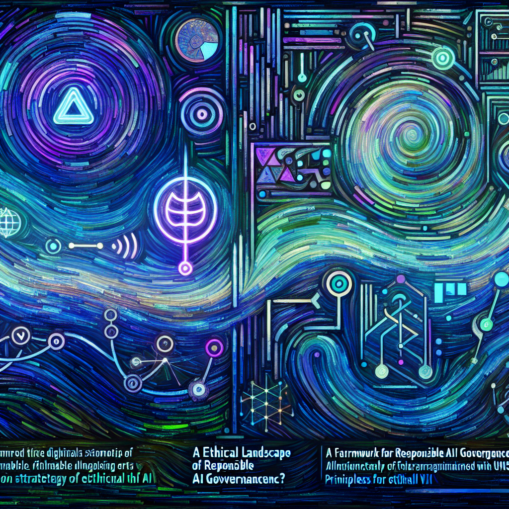

# Unlocking the Power of Generative AI for Sustainable Development: A Practical Guide for the UNSD

## Chapter 1: Understanding the UN System, UNSD, and the Sustainable Development Goals

### 1.1 The United Nations System: An Overview

#### 1.1.1 Structure and Key Bodies of the UN

Understanding the structure and key bodies of the United Nations is fundamental to grasping how the UNSD operates within the broader international landscape. The UN's complex architecture, designed to address a multitude of global challenges, directly influences the UNSD's mandate, its collaborative efforts, and its ability to leverage resources for achieving the Sustainable Development Goals (SDGs). This section provides a foundational overview, essential for contextualising the subsequent discussions on GenAI strategy within the UNSD.

The UN system is not a monolithic entity but a collection of interconnected organisations, each with specific roles and responsibilities. At its core are several key bodies, each contributing to the UN's overall mission of maintaining international peace and security, promoting sustainable development, and upholding human rights. These bodies interact in complex ways, influencing policy, allocating resources, and driving global initiatives. Understanding their individual mandates and their relationships with each other is crucial for navigating the UN system effectively.

- **The General Assembly (GA):** As the primary deliberative, policymaking, and representative organ, the GA provides a forum for all 193 member states to discuss and vote on a wide range of issues. Its resolutions and decisions, while not legally binding in the same way as Security Council resolutions, carry significant political weight and influence global norms.
- **The Security Council (SC):** Charged with maintaining international peace and security, the SC has the power to authorise peacekeeping operations, impose sanctions, and even authorise the use of force. Its 15 members, including five permanent members with veto power (China, France, Russia, the United Kingdom, and the United States), make it a powerful but often contentious body.
- **The Economic and Social Council (ECOSOC):** ECOSOC serves as the central platform for coordinating economic, social, and environmental activities within the UN system. It plays a crucial role in promoting sustainable development, coordinating the work of UN agencies, and engaging with civil society organisations.
- **The International Court of Justice (ICJ):** Located in The Hague, the ICJ is the principal judicial organ of the UN. It settles legal disputes between states and provides advisory opinions on legal questions referred to it by authorised UN organs and specialised agencies.
- **The UN Secretariat:** Headed by the Secretary-General, the Secretariat carries out the day-to-day work of the UN. It provides administrative and logistical support to the other UN bodies, conducts research, and implements UN programmes and policies. The Secretary-General also plays a key role in mediating disputes and promoting peace.

The UNSD, while not one of the principal organs, operates within this complex structure, reporting to ECOSOC and the General Assembly. Its influence stems from its expertise in statistics and data, which are essential for monitoring progress towards the SDGs and informing policy decisions across the UN system. Understanding the reporting lines and relationships between the UNSD and other UN bodies is crucial for identifying opportunities for collaboration and leveraging resources for GenAI initiatives.

The interplay between these bodies is not always seamless. Differing priorities, political considerations, and bureaucratic hurdles can create challenges for effective coordination and implementation. However, the UN system also provides a unique platform for multilateral cooperation, bringing together diverse perspectives and resources to address global challenges. A successful GenAI strategy for the UNSD must navigate this complex landscape, building partnerships and leveraging the strengths of different UN bodies to achieve its goals.

Consider, for example, the role of the UN Development Programme (UNDP) in supporting countries to achieve the SDGs. The UNSD can collaborate with UNDP to leverage GenAI for analysing development data, identifying trends, and tailoring interventions to specific country contexts. Similarly, the UN Environment Programme (UNEP) can benefit from GenAI-powered tools for monitoring environmental indicators and assessing the impact of climate change. These collaborations require a clear understanding of each agency's mandate and priorities, as well as effective communication and coordination mechanisms.

Furthermore, the UN's commitment to multilateralism and inclusivity requires that GenAI initiatives are developed and implemented in a way that benefits all member states, particularly developing countries. This means addressing issues such as data access, technical capacity, and ethical considerations to ensure that GenAI does not exacerbate existing inequalities. The UNSD has a crucial role to play in promoting responsible AI governance and ensuring that GenAI is used to advance the SDGs in a fair and equitable manner.

> The UN system is a complex ecosystem, but it is also a powerful force for good in the world. By understanding its structure and key bodies, we can better leverage its resources and expertise to address the challenges of sustainable development, says a senior UN official.

In conclusion, a thorough understanding of the UN system's structure and the mandates of its key bodies is paramount for developing and implementing a successful GenAI strategy for the UNSD. This knowledge enables strategic alignment, facilitates effective collaboration, and ensures that GenAI initiatives contribute to the broader goals of the UN in promoting sustainable development and global well-being. The subsequent sections will delve deeper into the specific role of the UNSD and its contributions to achieving the SDGs, building upon this foundational understanding of the UN system.

#### 1.1.2 The UN's Mandate and Global Impact

Building upon the understanding of the UN's structure, it's crucial to examine its overarching mandate and the profound global impact it wields. The UN's mandate, rooted in its Charter, encompasses maintaining international peace and security, promoting sustainable development, protecting human rights, and providing humanitarian assistance. These broad objectives translate into a wide array of activities and initiatives that touch upon virtually every aspect of global affairs. Understanding the scope of this mandate is essential for positioning the UNSD's GenAI strategy within the larger context of the UN's work and identifying areas where GenAI can contribute most effectively.

The UN's global impact is multifaceted, extending from peacekeeping operations in conflict zones to coordinating international efforts to combat climate change. Its influence is felt through the setting of global norms and standards, the provision of technical assistance to developing countries, and the mobilisation of resources to address humanitarian crises. The UN's convening power brings together governments, civil society organisations, and the private sector to tackle shared challenges, fostering collaboration and promoting collective action. The UNSD, as a key component of the UN system, plays a vital role in supporting these efforts by providing the data and statistics needed to monitor progress, inform policy decisions, and ensure accountability.

- **Maintaining International Peace and Security:** The UN deploys peacekeeping forces, mediates conflicts, and imposes sanctions to prevent and resolve disputes.
- **Promoting Sustainable Development:** The UN leads the global effort to achieve the Sustainable Development Goals (SDGs), addressing poverty, inequality, and environmental degradation.
- **Protecting Human Rights:** The UN promotes and protects human rights through international treaties, monitoring mechanisms, and advocacy efforts.
- **Providing Humanitarian Assistance:** The UN provides emergency relief to victims of natural disasters and armed conflicts, coordinating humanitarian aid and supporting long-term recovery.

The UN's impact is particularly evident in its work on the Sustainable Development Goals (SDGs). As highlighted in the previous section, the SDGs provide a comprehensive framework for addressing the world's most pressing challenges, from poverty and hunger to climate change and inequality. The UN plays a central role in coordinating the global effort to achieve the SDGs, setting targets, monitoring progress, and providing support to countries in their implementation efforts. The UNSD's contribution to SDG monitoring is critical, providing the data and statistics needed to track progress and identify areas where more effort is needed. According to the UN, the UNSD plays a key role in developing statistical standards and norms for SDG monitoring and facilitates access to data and metadata through the SDGs global database.

The UNSD's role extends to specific areas such as climate change statistics, gender statistics, and the System of National Accounts (SNA). The UNSD was mandated to develop a Global Set of Climate Change Statistics and Indicators, working closely with the UNFCCC. In gender statistics, the UNSD implements the Global Gender Statistics Programme and contributes to strengthening the knowledge base on violence against women. Furthermore, the UNSD is involved in the development of the 2025 SNA, which broadens the national accounts framework to better account for elements affecting wellbeing and sustainability. These initiatives demonstrate the UNSD's commitment to providing high-quality data and statistics to support evidence-based policymaking and monitor progress on key global challenges.

However, the UN's global impact is not without its challenges. The organisation faces constraints related to funding, political divisions, and bureaucratic inefficiencies. The effectiveness of UN initiatives often depends on the cooperation of member states, which can be difficult to secure in a world of competing interests and priorities. Moreover, the UN's complex structure and decision-making processes can sometimes hinder its ability to respond quickly and effectively to emerging crises. A successful GenAI strategy for the UNSD must take these challenges into account, identifying opportunities to leverage GenAI to improve the efficiency and effectiveness of UN operations and enhance its ability to achieve its mandate.

For instance, GenAI could be used to improve the efficiency of peacekeeping operations by analysing data on conflict dynamics and identifying potential threats. It could also be used to enhance the effectiveness of humanitarian assistance by predicting the needs of affected populations and optimising the delivery of aid. In the area of sustainable development, GenAI could be used to analyse large datasets to identify patterns and trends that can inform policy decisions and accelerate progress towards the SDGs. However, these applications require careful consideration of ethical issues, such as data privacy and security, as well as the potential for bias in AI algorithms.

The UN's commitment to inclusivity and universality requires that its initiatives benefit all member states, particularly developing countries. This means addressing issues such as the digital divide, ensuring that developing countries have access to the technology and expertise needed to participate in the digital economy. The UNSD has a crucial role to play in promoting digital inclusion and ensuring that GenAI is used to bridge the gap between developed and developing countries, rather than exacerbating existing inequalities. This includes capacity building initiatives, technology transfer programmes, and the development of open-source AI tools that can be used by all countries, regardless of their level of development.

> The UN's mandate is ambitious, but its impact is undeniable. By working together, we can leverage the power of technology to build a more peaceful, sustainable, and equitable world, says a leading expert in the field.

In conclusion, understanding the UN's mandate and global impact is essential for developing a GenAI strategy for the UNSD that is aligned with the organisation's overall goals and priorities. By leveraging GenAI to improve the efficiency and effectiveness of UN operations, enhance its ability to achieve the SDGs, and promote digital inclusion, the UNSD can make a significant contribution to building a better future for all. The subsequent sections will delve deeper into the specific role of the UNSD and its contributions to achieving the SDGs, building upon this foundational understanding of the UN system.

#### 1.1.3 UN Initiatives in Technology and Innovation

Following the overview of the UN's structure and mandate, it's crucial to examine specific UN initiatives focused on technology and innovation. These initiatives demonstrate the UN's commitment to leveraging technological advancements to address global challenges and achieve the Sustainable Development Goals (SDGs), building upon the foundational understanding established in the previous sections. Understanding these initiatives provides context for how the UNSD can strategically integrate GenAI into its operations and contribute to broader UN goals. These initiatives span various sectors and involve different UN agencies, reflecting the multifaceted nature of technology's role in sustainable development.

The UN recognises that technology and innovation are critical enablers for achieving the SDGs. Several initiatives have been launched to harness the potential of technology to address challenges such as poverty, inequality, climate change, and health crises. These initiatives often involve partnerships with governments, the private sector, academia, and civil society organisations, reflecting the UN's commitment to multilateralism and collaboration. The UNSD can play a key role in supporting these initiatives by providing data and statistical expertise, as well as by developing GenAI-powered tools for data analysis and monitoring.

- **UN Office for Digital and Emerging Technologies (ODET):** Established to address the opportunities and challenges of the evolving technological landscape, supporting the implementation of the Global Digital Compact, including AI governance. This office signifies the UN's dedication to staying at the forefront of technological advancements and ensuring their responsible use.
- **UN Development Programme (UNDP):** UNDP integrates innovation as a driver for development, harnessing data, technologies, and innovative finance to solve issues like air pollution and gender inequality. Their work includes strategic innovation design, digital development (exploring technologies like blockchain, AI, VR/AR/XR), and data innovation and governance. The Accelerator Labs network identifies and scales innovative solutions for development challenges.
- **UN Women:** Focuses on integrating gender issues within innovation, promoting women as innovators and entrepreneurs, and investing in innovations and technologies that meet the needs of women and girls. This highlights the importance of ensuring that technological advancements benefit all members of society and address gender-specific challenges.
- **International Telecommunication Union (ITU):** Leads the 'Digital Skills for Decent Jobs Campaign' to equip young people with digital skills. Initiatives like the Giga Initiative (with UNICEF) promote connectivity in schools, and the EQUALS global network addresses the digital gender divide. This underscores the UN's commitment to bridging the digital divide and ensuring that everyone has access to the benefits of technology.
- **Food and Agriculture Organization (FAO):** Supports farmers in adopting digital innovations through the Global Network of Digital Agriculture Innovation Hubs. This demonstrates the UN's recognition of the importance of technology in transforming the agricultural sector and improving food security.
- **World Food Programme (WFP):** Their Information & Technology Strategy maps WFP's vision for technology, evidence, and innovation to improve performance and efficiency. This highlights the UN's focus on using technology to enhance the effectiveness of humanitarian operations and address food insecurity.
- **UN 2.0 Initiatives:** A portfolio of projects across the UN system focusing on areas like culture, data, digital technology, and innovation. These initiatives reflect the UN's commitment to modernising its operations and leveraging technology to improve its effectiveness.
- **Technology Facilitation Mechanism:** A UN inter-agency effort to improve coordination and collaboration on technology-related initiatives. This mechanism aims to streamline the UN's approach to technology and ensure that its efforts are aligned and coordinated.

These initiatives, as a senior technology advisor at the UN notes, represent a concerted effort to leverage technology for the betterment of humanity. They also present opportunities for the UNSD to contribute its expertise in data and statistics, particularly in the context of GenAI. For example, the UNSD could collaborate with UNDP to develop GenAI-powered tools for analysing development data and identifying trends, or with UN Women to assess the impact of technology on gender equality. These collaborations require a clear understanding of each agency's mandate and priorities, as well as effective communication and coordination mechanisms.

Furthermore, the UN's commitment to inclusivity and universality requires that technology initiatives benefit all member states, particularly developing countries. This means addressing issues such as data access, technical capacity, and ethical considerations to ensure that technology does not exacerbate existing inequalities. The UNSD has a crucial role to play in promoting responsible AI governance and ensuring that GenAI is used to advance the SDGs in a fair and equitable manner. This includes capacity building initiatives, technology transfer programmes, and the development of open-source AI tools that can be used by all countries, regardless of their level of development.

The UN's focus on digital skills, connectivity, and gender equality in technology underscores the importance of a holistic approach to technology and innovation. It's not just about developing new technologies, but also about ensuring that everyone has the skills and access needed to benefit from them. The UNSD can contribute to this effort by developing GenAI-powered tools for education and training, as well as by promoting digital literacy among its staff and stakeholders. This includes initiatives to train statisticians and data analysts in the use of GenAI, as well as to raise awareness among policymakers about the potential benefits and risks of AI.

> The UN's initiatives in technology and innovation are a testament to its commitment to addressing global challenges in a creative and effective manner, says a senior government official. By leveraging the power of technology, we can accelerate progress towards the SDGs and build a better future for all.

In conclusion, understanding the UN's initiatives in technology and innovation is essential for developing a GenAI strategy for the UNSD that is aligned with the organisation's overall goals and priorities. By leveraging GenAI to support these initiatives, promote digital inclusion, and address ethical considerations, the UNSD can make a significant contribution to building a more sustainable and equitable world. The subsequent sections will delve deeper into the specific role of the UNSD and its contributions to achieving the SDGs, building upon this foundational understanding of the UN system.

### 1.2 The United Nations Statistics Division (UNSD): Mandate and Operations

#### 1.2.1 UNSD's Role in Global Statistics

The United Nations Statistics Division (UNSD) stands as a cornerstone of the global statistical system. Its role is pivotal in ensuring the availability of reliable, consistent, and comparable data across countries and regions. This data is essential for informed decision-making, policy formulation, and monitoring progress towards global goals, particularly the Sustainable Development Goals (SDGs), as discussed in the previous sections. Understanding the UNSD's specific functions within this system is crucial for identifying how GenAI can be strategically applied to enhance its capabilities and impact.

The UNSD's influence extends across various aspects of global statistics, from setting standards and methodologies to collecting and disseminating data. It acts as a central coordinating body, working with national statistical offices (NSOs) and other international organisations to improve the quality and availability of statistics worldwide. This coordination is vital for ensuring that data is comparable across countries and that it meets the needs of policymakers and researchers.

- **Standard Setting:** Developing and promoting international statistical standards, classifications, and definitions to ensure data comparability.
- **Data Collection and Dissemination:** Compiling and disseminating a wide range of global statistical information, covering areas such as demography, trade, energy, and the environment. Platforms like UNdata provide access to these databases.
- **Capacity Building:** Assisting countries in strengthening their national statistical systems through training, technical assistance, and the sharing of best practices.
- **Coordination:** Facilitating the coordination of international statistical programmes and activities, ensuring that efforts are aligned and resources are used efficiently.
- **Support to the UN Statistical Commission:** Providing support to the UN Statistical Commission, the main body for coordinating international statistical activities. The UNSD functions as the secretariat for the Commission.
- **Methodological Development:** Researching and developing new statistical methodologies to address emerging challenges and improve the accuracy and relevance of data.

The UNSD's role in setting statistical standards is particularly important. These standards provide a common framework for data collection and compilation, ensuring that statistics are comparable across countries and over time. This comparability is essential for monitoring progress towards the SDGs and for making informed policy decisions. The UNSD works closely with NSOs and other international organisations to develop and update these standards, taking into account the latest developments in statistical methodology and technology.

Data collection and dissemination are also core functions of the UNSD. The division compiles data from a variety of sources, including NSOs, international organisations, and UN agencies. This data is then disseminated through various channels, including online databases, publications, and reports. The UNSD's data dissemination efforts are aimed at making data accessible to a wide range of users, including policymakers, researchers, and the general public.

Capacity building is another critical aspect of the UNSD's role. Many developing countries lack the resources and expertise needed to produce high-quality statistics. The UNSD provides technical assistance and training to these countries, helping them to strengthen their national statistical systems. This assistance includes training in statistical methodology, data collection techniques, and data management practices.

The UNSD's coordination role is essential for ensuring that international statistical activities are aligned and that resources are used efficiently. The division works closely with other international organisations, such as the World Bank, the International Monetary Fund (IMF), and the Organisation for Economic Co-operation and Development (OECD), to coordinate statistical programmes and avoid duplication of effort. This coordination is particularly important in the context of the SDGs, where many different organisations are involved in data collection and monitoring.

The UNSD's support to the UN Statistical Commission is also crucial. The Commission is the main body for coordinating international statistical activities, and the UNSD serves as its secretariat. In this role, the UNSD provides technical and administrative support to the Commission, helping it to develop and implement its work programme. The UNSD also plays a key role in preparing the Commission's reports and recommendations.

The development of new statistical methodologies is an ongoing process at the UNSD. As new challenges emerge and as technology advances, the division is constantly researching and developing new ways to measure and analyse data. This includes developing new indicators for the SDGs, as well as exploring the use of new data sources, such as satellite imagery and social media data. The UNSD's methodological work is essential for ensuring that statistics remain relevant and accurate in a rapidly changing world.

Given the increasing volume and complexity of data, GenAI offers significant potential to enhance the UNSD's role in global statistics. GenAI can be used to automate data collection and processing, improve data quality, and generate new insights from existing data. For example, GenAI could be used to automatically extract data from unstructured sources, such as reports and documents, or to identify and correct errors in data. It could also be used to generate predictive models to forecast future trends and inform policy decisions.

However, the use of GenAI in global statistics also raises ethical and methodological challenges. It is important to ensure that AI algorithms are transparent and explainable, and that they do not perpetuate biases or discriminate against certain groups. The UNSD has a crucial role to play in developing ethical guidelines and standards for the use of AI in statistics, as well as in promoting capacity building and knowledge sharing in this area. This aligns with the UN's broader efforts in ethical AI governance, as discussed in previous sections.

> The UNSD's role in global statistics is more important than ever in a world that is increasingly reliant on data, says a leading expert in the field. By embracing new technologies and promoting ethical standards, the UNSD can continue to play a vital role in supporting sustainable development and global well-being.

#### 1.2.2 Key Functions and Responsibilities of UNSD

Building upon the understanding of the UNSD's overarching role in global statistics, it is essential to delve into its specific functions and responsibilities. These functions directly influence how the UNSD can leverage GenAI to enhance its operations and contribute to the Sustainable Development Goals (SDGs). The UNSD's mandate, derived from the UN Charter and resolutions of the General Assembly and ECOSOC, translates into a diverse set of activities aimed at improving the quality, availability, and use of statistics worldwide. These activities encompass data collection, methodological development, capacity building, and coordination, each playing a crucial role in supporting evidence-based policymaking and monitoring progress towards global goals.

- **Data Collection and Compilation:** Gathering statistical data from national and international sources across various domains, including economic, social, and environmental statistics. This involves establishing data collection frameworks, ensuring data quality, and harmonising data definitions.
- **Methodological Development and Standard Setting:** Developing and promoting international statistical standards, classifications, and guidelines to ensure data comparability and consistency across countries. This includes researching and developing new statistical methodologies to address emerging challenges and improve the accuracy and relevance of data.
- **Data Dissemination and Analysis:** Providing access to global statistical information through online databases, publications, and reports. This involves analysing data to identify trends, patterns, and insights that can inform policy decisions and support evidence-based advocacy.
- **Capacity Building and Technical Assistance:** Assisting member states in strengthening their national statistical systems through training, technical assistance, and the sharing of best practices. This includes providing support for data collection, processing, analysis, and dissemination.
- **Coordination and Collaboration:** Coordinating international statistical programmes and activities to ensure coherence and avoid duplication of effort. This involves working closely with other UN agencies, international organisations, and national statistical offices.
- **Support to the UN Statistical Commission:** Serving as the secretariat for the UN Statistical Commission, providing technical and administrative support for its work. This includes preparing reports, organising meetings, and implementing the Commission's decisions.

The UNSD's data collection and compilation efforts are extensive, covering a wide range of topics relevant to the SDGs. This includes data on poverty, inequality, health, education, climate change, and environmental sustainability. The UNSD works closely with national statistical offices (NSOs) to ensure that data is collected according to international standards and that it is comparable across countries. The division also compiles data from international organisations, such as the World Bank and the International Monetary Fund (IMF), to create a comprehensive picture of global trends. As previously mentioned, platforms like UNdata play a crucial role in disseminating this information.

Methodological development and standard setting are crucial for ensuring the quality and comparability of statistics. The UNSD plays a leading role in developing international statistical standards, classifications, and guidelines. These standards provide a common framework for data collection and compilation, ensuring that statistics are comparable across countries and over time. The UNSD also conducts research to develop new statistical methodologies to address emerging challenges, such as measuring progress towards the SDGs or assessing the impact of climate change. This includes the development of new indicators and the exploration of new data sources, such as satellite imagery and social media data.

Data dissemination and analysis are essential for making data accessible and useful to policymakers, researchers, and the general public. The UNSD provides access to global statistical information through online databases, publications, and reports. The division also analyses data to identify trends, patterns, and insights that can inform policy decisions and support evidence-based advocacy. This includes producing reports on progress towards the SDGs, as well as conducting research on specific topics, such as poverty reduction or climate change mitigation.

Capacity building and technical assistance are critical for strengthening national statistical systems, particularly in developing countries. The UNSD provides training, technical assistance, and the sharing of best practices to help countries improve their data collection, processing, analysis, and dissemination capabilities. This includes providing support for the implementation of international statistical standards, as well as for the development of national statistical strategies. The UNSD also works to promote the use of data for evidence-based policymaking and to raise awareness of the importance of statistics for sustainable development.

Coordination and collaboration are essential for ensuring that international statistical programmes are coherent and that resources are used efficiently. The UNSD works closely with other UN agencies, international organisations, and national statistical offices to coordinate statistical activities and avoid duplication of effort. This includes participating in inter-agency working groups, organising joint training programmes, and sharing data and expertise. The UNSD also plays a key role in promoting the use of common statistical standards and methodologies across different organisations.

The UNSD's role as the secretariat for the UN Statistical Commission is crucial for supporting the Commission's work. The Commission is the main body for coordinating international statistical activities, and the UNSD provides technical and administrative support for its work. This includes preparing reports, organising meetings, and implementing the Commission's decisions. The UNSD also plays a key role in promoting the use of statistics for evidence-based policymaking and in raising awareness of the importance of statistics for sustainable development.

Given these key functions, GenAI presents numerous opportunities to enhance the UNSD's effectiveness. For example, GenAI can automate data collection and processing, improve data quality, and generate new insights from existing data. It can also be used to develop new statistical methodologies and to improve the dissemination of statistical information. However, the use of GenAI also raises ethical and methodological challenges, which must be addressed to ensure that AI is used responsibly and effectively. The UNSD has a crucial role to play in promoting responsible AI governance and in ensuring that GenAI is used to advance the SDGs in a fair and equitable manner.

> The UNSD's functions are vital for ensuring that the world has the data it needs to address its most pressing challenges, says a senior statistician at the UN. By embracing new technologies and promoting ethical standards, the UNSD can continue to play a leading role in the global statistical system.

#### 1.2.3 Data Governance and Standards at UNSD

Building on the understanding of UNSD's role and functions, a critical aspect of its operations is its commitment to robust data governance and adherence to stringent data standards. These elements are paramount for ensuring the quality, reliability, and ethical use of data, which underpins the credibility of global statistics and informs evidence-based policymaking for the Sustainable Development Goals (SDGs). Data governance at UNSD encompasses the policies, procedures, and institutional arrangements that guide the management of data assets, while data standards provide a common framework for data collection, processing, and dissemination. These two components work in tandem to ensure that data is fit for purpose and that it is used responsibly.

Data governance at UNSD is guided by several key principles, including transparency, accountability, privacy, and security. These principles are reflected in the division's policies and procedures, which are designed to ensure that data is collected, stored, and used in a manner that is ethical and consistent with international norms. The UNSD also works to promote data governance best practices among national statistical offices (NSOs) and other international organisations, helping them to strengthen their own data governance frameworks.

- **Data Quality Assurance:** Implementing procedures to ensure the accuracy, completeness, and consistency of data.
- **Data Security:** Protecting data from unauthorised access, use, disclosure, disruption, modification, or destruction.
- **Data Privacy:** Safeguarding the privacy of individuals and organisations whose data is collected.
- **Data Access and Sharing:** Establishing clear guidelines for data access and sharing, balancing the need for data availability with the need to protect privacy and confidentiality.
- **Data Documentation and Metadata Management:** Ensuring that data is properly documented and that metadata is readily available to users.
- **Data Retention and Disposal:** Establishing policies for data retention and disposal, ensuring that data is retained for as long as it is needed and that it is disposed of securely when it is no longer required.

The UNSD's commitment to data standards is reflected in its active participation in the development and promotion of international statistical standards, classifications, and guidelines. These standards provide a common framework for data collection and compilation, ensuring that statistics are comparable across countries and over time. The UNSD works closely with NSOs and other international organisations to develop and update these standards, taking into account the latest developments in statistical methodology and technology. The Data Governance Framework for Statistical Interoperability (DAFI) is a model and set of guidelines to establish conditions for information governance, focusing on facilitating decisions to align efforts for statistical interoperability. It emphasizes that organizations can achieve interoperability only if they control their information through data governance, defining data governance as the exercise of authority and control over the management of data assets.

- **International Standard Industrial Classification of All Economic Activities (ISIC):** A standard classification for economic activities, used to ensure comparability of economic statistics across countries.
- **System of National Accounts (SNA):** A comprehensive framework for measuring the economic activity of a country, used to compile national accounts statistics.
- **International Classification of Diseases (ICD):** A standard classification for diseases and health problems, used to compile health statistics.
- **SDG Indicator Metadata:** Standardised metadata definitions for SDG indicators, ensuring consistent interpretation and reporting.

The Fundamental Principles of Official Statistics, endorsed by the UN General Assembly, serve as a cornerstone for UNSD's data governance. Principle #6 emphasizes that individual data collected by statistical agencies must be strictly confidential and used exclusively for statistical purposes. This principle underscores the importance of safeguarding privacy and confidentiality when collecting data for statistical purposes.

The UN Legal Identity Agenda, a collaborative effort between UNSD, UNICEF, and UNDP, promotes universal registration of vital events to produce reliable vital statistics and ensure legal identity for all, with interoperability of health information systems. This initiative highlights the importance of data governance in ensuring that data is used to promote human rights and sustainable development.

The integration of GenAI into UNSD's operations presents both opportunities and challenges for data governance and standards. GenAI can be used to automate data quality checks, improve data security, and enhance data dissemination. However, it also raises concerns about bias, transparency, and accountability. It is essential that UNSD develops and implements appropriate data governance frameworks and standards to ensure that GenAI is used responsibly and ethically. This includes addressing issues such as data privacy, algorithmic bias, and the explainability of AI models.

To ensure responsible AI governance, UNSD must prioritise transparency and explainability in AI systems, as well as implement AI risk assessment and mitigation strategies. Fostering a culture of ethical AI development and use is also crucial for aligning with UN principles for ethical AI.

The UNDP's eight Data Principles provide a valuable framework for managing data responsibly, emphasizing human rights and privacy. These principles include managing data responsibly, safeguarding personal data, upholding the highest ethical standards, making data open by default, planning for reusability and interoperability, empowering people to work with data, expanding frontiers of data, and being aware of data limitations. Adopting these principles can help UNSD ensure that its data governance practices are aligned with international best practices.

The UN System Chief Executives Board for Coordination (CEB) has endorsed a vision for data governance at the international level, aiming to strengthen the policy coherence of international data governance to protect privacy and human rights while leveraging data for the global public good. This vision provides a high-level framework for UNSD's data governance efforts, ensuring that they are aligned with the broader goals of the UN system.

> Data governance and standards are the foundation of credible statistics, says a senior data governance expert. By investing in these areas, UNSD can ensure that its data is reliable, relevant, and used responsibly to support sustainable development.

### 1.3 The Sustainable Development Goals (SDGs): A Framework for Global Progress

#### 1.3.1 Introduction to the 2030 Agenda and the SDGs

The 2030 Agenda for Sustainable Development, adopted by all United Nations Member States in 2015, represents a paradigm shift in global development efforts. It provides a shared blueprint for peace and prosperity for people and the planet, now and into the future. Unlike its predecessor, the Millennium Development Goals (MDGs), the 2030 Agenda is universally applicable, encompassing all countries, not just developing ones. It recognises that development challenges are interconnected and require integrated solutions, building upon the understanding of the UN's mandate and global impact as discussed earlier.

At the heart of the 2030 Agenda are the 17 Sustainable Development Goals (SDGs), which address a wide range of social, economic, and environmental objectives. These goals are ambitious and interconnected, reflecting the complex challenges facing humanity. Achieving them requires a concerted effort from governments, civil society, the private sector, and individuals, aligning with the UN's emphasis on multilateralism and collaboration.

- **SDG 1: No Poverty:** End poverty in all its forms everywhere.
- **SDG 2: Zero Hunger:** End hunger, achieve food security and improved nutrition and promote sustainable agriculture.
- **SDG 3: Good Health and Well-being:** Ensure healthy lives and promote well-being for all at all ages.
- **SDG 4: Quality Education:** Ensure inclusive and equitable quality education and promote lifelong learning opportunities for all.
- **SDG 5: Gender Equality:** Achieve gender equality and empower all women and girls.
- **SDG 6: Clean Water and Sanitation:** Ensure availability and sustainable management of water and sanitation for all.
- **SDG 7: Affordable and Clean Energy:** Ensure access to affordable, reliable, sustainable and modern energy for all.
- **SDG 8: Decent Work and Economic Growth:** Promote sustained, inclusive and sustainable economic growth, full and productive employment and decent work for all.
- **SDG 9: Industry, Innovation and Infrastructure:** Build resilient infrastructure, promote inclusive and sustainable industrialisation and foster innovation.
- **SDG 10: Reduced Inequalities:** Reduce inequality within and among countries.
- **SDG 11: Sustainable Cities and Communities:** Make cities and human settlements inclusive, safe, resilient and sustainable.
- **SDG 12: Responsible Consumption and Production:** Ensure sustainable consumption and production patterns.
- **SDG 13: Climate Action:** Take urgent action to combat climate change and its impacts.
- **SDG 14: Life Below Water:** Conserve and sustainably use the oceans, seas and marine resources for sustainable development.
- **SDG 15: Life on Land:** Protect, restore and promote sustainable use of terrestrial ecosystems, sustainably manage forests, combat desertification, and halt and reverse land degradation and halt biodiversity loss.
- **SDG 16: Peace, Justice and Strong Institutions:** Promote peaceful and inclusive societies for sustainable development, provide access to justice for all and build effective, accountable and inclusive institutions at all levels.
- **SDG 17: Partnerships for the Goals:** Strengthen the means of implementation and revitalise the global partnership for sustainable development.

The SDGs are not merely aspirational goals; they are underpinned by specific targets and indicators that allow for monitoring progress and ensuring accountability. The UNSD plays a crucial role in this process, as highlighted in the discussion of its mandate and operations, by developing statistical standards, collecting and disseminating data, and providing technical assistance to countries. The UNSD's work is essential for tracking progress towards the SDGs and for identifying areas where more effort is needed.

A core principle of the 2030 Agenda is to 'Leave No One Behind,' ensuring that the agenda benefits all people, with a special emphasis on reaching the furthest behind first, including marginalised groups. This principle requires a disaggregated approach to data collection and analysis, ensuring that the needs of all groups are taken into account. GenAI can play a valuable role in this regard, by enabling the analysis of large datasets to identify patterns and trends that may be missed using traditional statistical methods. However, it is crucial to address ethical considerations, such as bias in AI algorithms, to ensure that GenAI is used to promote inclusivity and equity.

The 2030 Agenda also recognises the importance of a global partnership for sustainable development, bringing together governments, the private sector, civil society, and the United Nations system. This partnership requires effective communication and coordination, as well as a shared understanding of the challenges and opportunities facing humanity. GenAI can facilitate this partnership by enabling the sharing of data and knowledge, as well as by providing tools for collaboration and communication.

However, achieving the SDGs is a challenging path, further complicated by rising inequalities, climate change, biodiversity loss, and events such as the COVID-19 pandemic. These challenges require innovative solutions and a renewed commitment to multilateralism and collaboration. GenAI offers significant potential to accelerate progress towards the SDGs, but it must be used responsibly and ethically, in line with the UN's principles for ethical AI.

> The 2030 Agenda is a transformative vision for a better world, says a senior UN official. Achieving the SDGs requires a concerted effort from all stakeholders, and technology can play a crucial role in accelerating progress.

#### 1.3.2 The Importance of Data and Statistics for SDG Monitoring

Following the introduction to the 2030 Agenda and the SDGs, it's crucial to emphasise the indispensable role of data and statistics in monitoring progress towards these ambitious goals. As highlighted in the previous section, the SDGs are underpinned by specific targets and indicators, making data and statistics the lifeblood of the entire framework. Without reliable and timely data, it is impossible to assess whether the world is on track to achieve the SDGs, identify areas where progress is lagging, and make informed decisions about resource allocation and policy interventions. This section will explore the multifaceted importance of data and statistics for effective SDG monitoring, building upon the understanding of the UNSD's mandate and operations.

Data and statistics provide the evidence base for understanding the current state of affairs, tracking progress over time, and identifying emerging challenges. They enable policymakers to make informed decisions about which interventions to prioritise and how to allocate resources effectively. Furthermore, data and statistics promote transparency and accountability, allowing citizens to hold their governments accountable for their commitments to the SDGs. As a senior government official notes, well-presented data strengthens decision-making, allows for progress measurement, and promotes transparency and accountability within the SDG framework.

- **Measuring Progress:** High-quality data and statistics enable governments, organisations, and the public to measure progress towards achieving the SDGs. They provide an evidence base to understand where we are succeeding and where we are falling short.
- **Informed Decision-Making:** By analysing data, policymakers can identify areas that need attention, track progress, and make informed decisions about which interventions to prioritise. Data-driven decision-making helps ensure that resources are used effectively and efficiently.
- **Transparency and Accountability:** Well-presented data strengthens decision-making, allows for progress measurement, and promotes transparency and accountability within the SDG framework.
- **Identifying Challenges and Solutions:** Data helps in identifying challenges, formulating solutions, monitoring implementation, and making necessary adjustments.
- **Comprehensive Overview:** Data provides a comprehensive overview of the world's progress towards the 2030 Agenda.
- **Citizen Engagement:** Engaging citizens in SDG monitoring democratizes data and ensures diverse perspectives are included, which is essential for informing effective policies.
- **International Collaboration:** Transparent and cooperative data-sharing practices can build trust and foster international collaboration, enabling countries to align their efforts and share best practices.
- **Addressing Data Gaps:** Integrating citizen-generated data with official statistics helps bridge data gaps and facilitates more nuanced decision-making for issues that matter most to communities.
- **Adaptability:** Statistics and data help to adapt and respond in times of crisis.

The UNSD plays a central role in SDG monitoring, as discussed in previous sections, by developing statistical standards, collecting and disseminating data, and providing technical assistance to countries. Its work is essential for ensuring that data is comparable across countries and that it meets the needs of policymakers and researchers. The UNSD also works to promote the use of data for evidence-based policymaking and to raise awareness of the importance of statistics for sustainable development. As a leading expert in the field states, the UNSD's role in global statistics is more important than ever in a world that is increasingly reliant on data.

However, effective SDG monitoring requires more than just the availability of data; it also requires that data be of high quality, timely, and accessible. Data quality refers to the accuracy, completeness, and consistency of data. Timeliness refers to the speed with which data is collected, processed, and disseminated. Accessibility refers to the ease with which data can be accessed and used by policymakers, researchers, and the general public. Addressing these challenges is crucial for ensuring that data and statistics can effectively inform policy decisions and accelerate progress towards the SDGs.

GenAI offers significant potential to enhance SDG monitoring by improving data quality, timeliness, and accessibility. For example, GenAI can be used to automate data collection and processing, identify and correct errors in data, and generate new insights from existing data. It can also be used to develop new indicators for the SDGs and to improve the dissemination of statistical information. However, the use of GenAI also raises ethical and methodological challenges, which must be addressed to ensure that AI is used responsibly and effectively. These challenges will be discussed in detail in subsequent chapters.

Moreover, engaging citizens in SDG monitoring is crucial for democratising data and ensuring that diverse perspectives are included. Citizen-generated data can complement official statistics and provide valuable insights into the lived experiences of communities. Integrating citizen-generated data with official statistics can help bridge data gaps and facilitate more nuanced decision-making for issues that matter most to communities. As a senior government official notes, engaging citizens in SDG monitoring democratizes data and ensures diverse perspectives are included, which is essential for informing effective policies.

In conclusion, data and statistics are essential for effective SDG monitoring. They provide the evidence base for understanding progress, informing policy decisions, and promoting transparency and accountability. The UNSD plays a crucial role in this process, and GenAI offers significant potential to enhance its capabilities. However, it is crucial to address ethical and methodological challenges to ensure that AI is used responsibly and effectively. The subsequent sections will delve deeper into the challenges of achieving the SDGs and the role of GenAI in overcoming these challenges.

#### 1.3.3 Challenges in Achieving the SDGs

While the Sustainable Development Goals (SDGs) provide a comprehensive framework for global progress, achieving them by 2030 presents a multitude of complex and interconnected challenges. These challenges, as highlighted in the introduction to the 2030 Agenda, require innovative solutions and a renewed commitment to multilateralism. Understanding these obstacles is crucial for developing effective strategies and for identifying how the UNSD, with its expertise in data and statistics, can contribute to overcoming them. These challenges span financial constraints, inequalities, environmental degradation, governance issues, geopolitical instability, and data limitations, each requiring targeted interventions and collaborative efforts.

- **Financial Constraints:** Insufficient funding and limited investment in critical areas such as education, healthcare, and infrastructure pose significant barriers. The SDG investment gap in developing countries is substantial and continues to widen. High levels of external debt in low-income countries further divert financial resources away from sustainable development programmes.
- **Inequality and Social Disparities:** Persistent economic disparities, unequal access to education and healthcare, and discrimination based on gender, race, and socioeconomic status impede progress across many SDGs. Poverty and marginalisation undermine efforts to achieve inclusive and sustainable development, particularly for vulnerable populations.
- **Environmental Degradation and Climate Change:** Deforestation, land degradation, water scarcity, and pollution pose significant challenges to achieving SDGs related to environmental sustainability and climate action. Climate change impacts, such as extreme weather events, sea-level rise, and loss of biodiversity, disproportionately affect vulnerable regions.
- **Governance and Institutional Weaknesses:** Corruption, lack of transparency, and political instability undermine efforts to promote accountability, rule of law, and effective governance. Overemphasis on the social and private sectors in social innovation discussions has marginalized the role of government intervention.
- **Geopolitical Instability and Conflict:** Countries affected by conflict, violence, and political instability face significant challenges in implementing the SDGs. Escalating conflicts and geopolitical tensions have severely hindered progress on the SDGs.
- **Data and Monitoring Challenges:** Many regions, particularly in low-income countries, face challenges in collecting, analysing, and reporting data on SDG indicators. Data gaps, inconsistencies, and lack of disaggregated data limit the ability to track progress, identify disparities, and target interventions effectively.
- **Other Challenges:** Unsustainable consumption and production practices place a strain on the environment, leading to resource exhaustion. An excessive focus on fiscal austerity can constrain governments, aggravating inequalities and fueling social tensions. The interdependence of the SDGs means that shortcomings in one area can impact progress across the entire agenda.

The UNSD, with its mandate to improve global statistics, can play a crucial role in addressing several of these challenges. By strengthening data collection and analysis capabilities in developing countries, the UNSD can help to fill data gaps and improve the accuracy of SDG monitoring. The UNSD can also promote the use of disaggregated data to identify and address inequalities, ensuring that no one is left behind. Furthermore, the UNSD can contribute to the development of new statistical methodologies to measure progress on emerging challenges, such as climate change and environmental degradation. The use of GenAI, as discussed in subsequent chapters, can significantly enhance the UNSD's ability to address these challenges.

For example, GenAI can be used to improve the efficiency of data collection and processing, allowing the UNSD to gather and analyse data more quickly and accurately. It can also be used to identify patterns and trends in data that would be difficult or impossible to detect using traditional statistical methods. This can help policymakers to make more informed decisions about which interventions to prioritise and how to allocate resources effectively. However, it is crucial to address ethical considerations, such as bias in AI algorithms, to ensure that GenAI is used to promote inclusivity and equity.

Addressing these challenges requires a multifaceted approach that includes increased financial resources, strengthened governance, innovative solutions, and collaborative partnerships. It is also essential to address the underlying drivers of inequality and environmental degradation to ensure that progress towards the SDGs is sustainable and inclusive. The UNSD, as a key component of the UN system, has a vital role to play in supporting these efforts by providing the data and statistics needed to monitor progress, inform policy decisions, and ensure accountability.

> Achieving the SDGs is a monumental task, but it is not impossible, says a leading expert in sustainable development. By working together and embracing innovative solutions, we can overcome these challenges and build a better future for all.

## Chapter 2: Generative AI: Fundamentals, Applications, and Implications for the UNSD

### 2.1 Demystifying Generative AI: Core Concepts and Technologies

#### 2.1.1 What is Generative AI? A Comprehensive Definition

Generative AI represents a significant leap in artificial intelligence, moving beyond mere analysis and prediction to the creation of entirely new content. Unlike traditional AI, which excels at tasks like classification or regression based on existing data, GenAI possesses the capacity to generate novel outputs that resemble the data it was trained on. This capability opens up a vast array of potential applications, particularly within the context of the UNSD and its mission to support sustainable development.

At its core, Generative AI is a subset of artificial intelligence focused on creating new and original content, rather than just analysing or predicting from existing data. It uses machine learning models to understand patterns and structures in its training data and then generates new data that has similar characteristics. This distinguishes it from discriminative AI, which focuses on distinguishing between different categories or classes of data.

A leading expert in the field describes Generative AI as a system that learns the underlying patterns and structures within a dataset and then uses that knowledge to create new, similar data. This ability to generate novel content makes it a powerful tool for a wide range of applications, from creating realistic images and videos to composing music and writing text.

- **Content Creation:** Generative AI models can produce new content such as text, images, videos, audio, or code.
- **Pattern Learning:** It learns the underlying patterns of its training data to generate new, similar data.
- **Neural Networks:** Generative AI models use neural networks to identify the patterns and structures within existing data to generate new content.

The process typically involves training a model on a large dataset, allowing it to learn the underlying patterns and relationships within the data. Once trained, the model can then be prompted to generate new content that adheres to those learned patterns. This is achieved through various techniques, including deep learning models like Generative Adversarial Networks (GANs), Transformers, and Diffusion Models, which will be explored in more detail in subsequent sections.

It encodes existing information into a vector space, mapping data points based on their correlations. When prompted, it generates (decodes) new content by finding the correct context within the existing dependencies in the vector space. The generated output is then assessed and retuned to improve quality and accuracy.

However, it's crucial to acknowledge the limitations of GenAI. The quality and relevance of the generated content are heavily dependent on the quality and representativeness of the training data. If the training data is biased or incomplete, the generated content may reflect those biases or lack crucial information. Furthermore, GenAI models can sometimes produce outputs that are nonsensical or factually incorrect, requiring careful evaluation and validation.

In the context of the UNSD, Generative AI could be leveraged to enhance various aspects of its work. For example, it could be used to generate synthetic data to augment existing datasets, create compelling visualizations to communicate statistical findings, or automate the generation of reports and summaries. However, it is essential to carefully consider the ethical implications of using GenAI, particularly in relation to data privacy, bias, and transparency, aligning with the data governance and standards at UNSD, as discussed in Chapter 1.

A senior data scientist emphasises that while Generative AI offers tremendous potential, it is not a magic bullet. It requires careful planning, responsible implementation, and a thorough understanding of its capabilities and limitations. The UNSD must adopt a strategic and ethical approach to GenAI to ensure that it is used to advance its mission and contribute to the Sustainable Development Goals.

Furthermore, Generative AI can inherit and amplify biases present in the training data. It can also be used to generate fake news, deepfakes, and other deceptive content. Models can potentially plagiarise or generate content that infringes on existing copyrights, and there are concerns about the potential for mass replacement of human jobs.

In conclusion, Generative AI is a powerful technology with the potential to transform various aspects of the UNSD's work. However, it is essential to approach GenAI with a clear understanding of its capabilities, limitations, and ethical implications. By adopting a strategic and responsible approach, the UNSD can leverage GenAI to enhance its operations, contribute to the SDGs, and build a more sustainable and equitable future.

#### 2.1.2 Key GenAI Models: GANs, Transformers, and Diffusion Models

Having established a comprehensive definition of Generative AI, it's crucial to delve into the specific models that power this technology. GANs (Generative Adversarial Networks), Transformers, and Diffusion Models represent three prominent architectures, each with unique strengths and weaknesses that make them suitable for different applications within the UNSD's context. Understanding these models is essential for making informed decisions about which technologies to adopt and how to leverage them effectively.

These models, while all falling under the umbrella of Generative AI, operate on fundamentally different principles. GANs employ a competitive learning process, Transformers leverage self-attention mechanisms, and Diffusion Models rely on iterative noise reduction. This diversity allows for a wide range of applications, but also necessitates a careful evaluation of each model's suitability for specific tasks.

It's important to note that the choice of model depends heavily on the specific application and the characteristics of the data. There is no one-size-fits-all solution, and a thorough understanding of each model's strengths and weaknesses is crucial for success.

- GANs (Generative Adversarial Networks): Employ a dual neural network architecture, pitting a generator against a discriminator. The generator creates realistic content, while the discriminator identifies fake content. GANs are often used for image generation, data augmentation, and style transfer.
- Transformers: Analyse large datasets to create large language models (LLMs). They use self-attention mechanisms to weigh the importance of different parts of the input, making them effective for machine translation, text summarisation, and image creation.
- Diffusion Models: Work by adding and then removing noise to generate high-quality, detailed images. They are particularly strong in image and video synthesis, creating near-realistic images of natural scenes.

GANs, with their adversarial training process, are particularly well-suited for generating realistic images and videos. They have been successfully applied in areas such as image synthesis, data augmentation, and style transfer. However, GANs can be challenging to train and may suffer from issues such as mode collapse, where the generator produces a limited variety of outputs.

Transformers, on the other hand, excel at processing sequential data, such as text and audio. Their self-attention mechanism allows them to capture long-range dependencies in the data, making them ideal for tasks such as machine translation, text summarisation, and natural language generation. Large Language Models (LLMs) are based on the Transformer architecture.

Diffusion Models offer a different approach to generative modelling, relying on a process of iteratively adding noise to the data and then learning to reverse that process. This allows them to generate high-quality, detailed images and videos, often surpassing the performance of GANs in terms of image fidelity. They are particularly strong in image and video synthesis, creating near-realistic images of natural scenes.

In the context of the UNSD, these models could be applied to a variety of tasks. GANs could be used to generate synthetic data to augment existing datasets, addressing issues of data scarcity and bias, as mentioned in the previous section. Transformers could be used to automate the generation of reports and summaries, freeing up valuable time for statisticians and data analysts. Diffusion Models could be used to create compelling visualizations to communicate statistical findings to a wider audience.

For example, consider the challenge of monitoring SDG indicator 5.5.1, which measures the proportion of seats held by women in national parliaments and local governments. GANs could be used to generate synthetic data to augment existing datasets, addressing issues of data scarcity and bias. Transformers could be used to automate the generation of reports and summaries, freeing up valuable time for statisticians and data analysts. Diffusion Models could be used to create compelling visualizations to communicate statistical findings to a wider audience.

However, it is crucial to carefully consider the ethical implications of using these models, particularly in relation to data privacy, bias, and transparency. As discussed in Chapter 3, the UNSD must adopt a responsible AI governance framework to ensure that these technologies are used in a way that is aligned with its mission and values.

> Each model has its strengths: diffusion models excel in image and video synthesis, transformers are strong in text-based tasks, and GANs are useful for augmenting small datasets, says a leading AI researcher.

In conclusion, GANs, Transformers, and Diffusion Models represent three key architectures in the field of Generative AI, each with unique strengths and weaknesses. Understanding these models is essential for making informed decisions about which technologies to adopt and how to leverage them effectively within the UNSD's context. The subsequent sections will explore the applications of GenAI in data analysis and statistical reporting, building upon this foundational understanding of the underlying models.

#### 2.1.3 Understanding the Capabilities and Limitations of GenAI

Having explored the core concepts and key models of Generative AI (GenAI), it is crucial to understand both its capabilities and limitations. A balanced perspective is essential for the UNSD to strategically leverage GenAI, mitigating potential risks and maximising its benefits in supporting the Sustainable Development Goals (SDGs). Overstating GenAI's potential or overlooking its limitations could lead to unrealistic expectations and ineffective implementation. This section provides a realistic assessment, informing the development of a practical and ethical GenAI strategy for the UNSD.

GenAI offers a range of powerful capabilities that can enhance various aspects of the UNSD's work. These capabilities, as a leading expert in the field notes, extend beyond simple automation to include the creation of novel content, the augmentation of human capabilities, and the identification of hidden patterns in complex datasets. Understanding these capabilities is essential for identifying opportunities to leverage GenAI to improve the efficiency and effectiveness of the UNSD's operations.

- **Content Creation:** GenAI can generate novel content such as text, images, video, music, software code, and product designs. It can draft and edit text, images, and other media.
- **Worker Augmentation:** GenAI can augment human capabilities by summarising, simplifying, and classifying content. It can also generate, translate, and verify software code and improve chatbot performance.
- **Automation:** Foundation models can be used to automate and augment humans or machines and autonomously execute business and IT processes.
- **Data Analysis and Risk Mitigation:** GenAI can analyse data to provide broader and deeper visibility, enhancing pattern recognition and identifying potential risks.
- **Efficiency and Productivity:** It can lead to faster product development, enhanced customer experience, and improved employee productivity.
- **Extraction and Reformatting:** GenAI can automate information extraction from unstructured data (documents, images, videos) and reformat it into structured formats.
- **Enhanced Search:** It enables intelligent analysis and understanding of different types of media and textual content, improving search and retrieval.
- **Planning and Scheduling:** GenAI can assist in optimising resource allocation, time management, and decision-making for planning and scheduling tasks.
- **Personalisation:** It can customise offers, translate content, suggest relevant upsell opportunities, and distill relevant information for customers.
- **Risk Identification and Management:** GenAI can distill relevant information from various systems to identify, mitigate, and resolve risks.

However, it is equally important to acknowledge the limitations of GenAI. These limitations, if not properly addressed, can undermine the effectiveness of GenAI initiatives and even lead to unintended consequences. A senior government official cautions that GenAI is not a panacea and that its limitations must be carefully considered when developing a GenAI strategy.

- **Data Dependency:** GenAI models rely on the quality and diversity of training data. Biased, incomplete, or inaccurate data can lead to flawed results.
- **Lack of Creativity and Real-World Understanding:** GenAI lacks true creativity and struggles with complex contexts. It cannot generate new ideas or solutions and has difficulty understanding context when presented with new information outside its training.
- **Inability to Learn Independently:** Generative models are trained on a fixed dataset and do not learn new information independently.
- **Inability to Replace Human Traits:** GenAI cannot replace human traits like emotional intelligence or proactive learning.
- **Difficulty Citing Sources:** These models don't store information in a way that allows citation, requiring extra work to document data sources.
- **Lack of Certainty:** GenAI cannot reassess or be certain about its responses, even if it seems confident. It operates based on wording probabilities, leading to potential inaccuracies.
- **Limited Use Cases:** GenAI may be limited in tackling complex, multi-dimensional societal issues and lack the general understanding needed for strategic decision-making or ethical dilemmas.
- **Non-Determinism:** GenAI can produce different outputs even with the same input, leading to unpredictability.
- **Hallucinations:** Large GenAI models can hallucinate, presenting false information convincingly.
- **Complexity and Resource Intensity:** Developing and training GenAI models requires significant computational resources and energy.
- **Security Threats:** GenAI tools can identify vulnerabilities and craft better attacks on infrastructure and security systems. They can also be used for social engineering attacks.
- **Lack of Understanding Context:** GenAI may not fully understand the context or nuance of a conversation, leading to irrelevant or nonsensical responses.
- **Limited World Knowledge:** Knowledge is based on the text it has been trained on, up to its knowledge cut-off date.
- **Inability to Reason:** GenAI does not have the ability to think or reason like humans do.
- **Tendency to Generate Unreliable Information:** Can generate responses that are factually incorrect or misleading, especially if the input contains incorrect information.
- **Lack of Emotional Understanding:** It does not have emotions or empathy.
- **Potential for Biased Responses:** May exhibit biases present in the data, including cultural biases or stereotypes.
- **No Long-Term Memory:** It cannot remember past interactions or retain information from one session to the next.

One critical limitation is the potential for 'hallucinations,' where GenAI models generate outputs that are factually incorrect or nonsensical, but presented with a high degree of confidence. This can be particularly problematic in the context of statistical reporting, where accuracy and reliability are paramount. The UNSD must implement robust validation mechanisms to detect and correct such errors.

Another significant challenge is the potential for bias in GenAI models. As previously mentioned, GenAI models learn from training data, and if that data is biased, the models will likely perpetuate those biases in their outputs. This can have serious implications for the SDGs, particularly in relation to issues such as gender equality and social inclusion. The UNSD must take steps to identify and mitigate bias in GenAI models, ensuring that they are used to promote equity and fairness.

Furthermore, GenAI models can be computationally expensive to train and deploy, requiring significant resources and expertise. This can be a barrier to adoption for many developing countries, potentially exacerbating existing inequalities. The UNSD must work to promote access to GenAI technologies and expertise for all countries, regardless of their level of development. This could include developing open-source AI tools, providing training and technical assistance, and fostering collaboration and knowledge sharing.

In conclusion, a thorough understanding of both the capabilities and limitations of GenAI is essential for developing a successful GenAI strategy for the UNSD. By carefully considering these factors, the UNSD can leverage GenAI to enhance its operations, contribute to the SDGs, and build a more sustainable and equitable future. The subsequent sections will explore the specific applications of GenAI in data analysis and statistical reporting, building upon this balanced understanding of its potential and challenges.

### 2.2 Applications of GenAI in Data Analysis and Statistical Reporting

#### 2.2.1 Enhancing Data Collection and Processing with GenAI

Generative AI (GenAI) offers transformative potential for enhancing data collection and processing, addressing longstanding challenges in statistical reporting. Traditional methods often involve manual data entry, complex validation processes, and time-consuming data cleaning, as highlighted in previous sections. GenAI can automate and streamline these processes, improving efficiency, accuracy, and timeliness, which are crucial for effective SDG monitoring and reporting. This section explores the specific applications of GenAI in this domain, focusing on how it can address data scarcity, improve data quality, and accelerate data processing workflows, building upon the understanding of GenAI's capabilities and limitations.

One of the most significant applications of GenAI is in addressing data scarcity. Many SDG indicators suffer from limited data availability, particularly in developing countries, as discussed in Chapter 1. GenAI can generate synthetic data to augment existing datasets, providing a more complete picture of the situation and enabling more robust analysis. This synthetic data can be created by training GenAI models on existing data and then prompting them to generate new data points that are statistically similar. However, it is crucial to ensure that the synthetic data is representative of the real-world population and that it does not introduce biases or distortions. As a senior data scientist notes, synthetic data can be a valuable tool for addressing data scarcity, but it must be used with caution and validated rigorously.

- Generating synthetic data to augment existing datasets, particularly for SDG indicators with limited data availability.
- Creating realistic simulations to model complex systems and predict future trends.
- Filling in missing data points using imputation techniques based on GenAI models.

GenAI can also be used to improve data quality by automating data cleaning and validation processes. Traditional data cleaning methods often involve manual inspection and correction of errors, which can be time-consuming and prone to human error. GenAI can automate these processes by identifying and correcting errors in data, such as outliers, inconsistencies, and missing values. For example, GenAI models can be trained to identify and correct errors in survey responses, or to detect and remove duplicate records from databases. This can significantly improve the accuracy and reliability of data, which is essential for effective SDG monitoring and reporting. A leading expert in data quality emphasizes that GenAI can automate many of the tedious and error-prone tasks associated with data cleaning, freeing up valuable time for data analysts to focus on more strategic activities.

- Automating data cleaning and validation processes to identify and correct errors in data.
- Detecting and removing duplicate records from databases.
- Standardising data formats and ensuring consistency across different data sources.

Furthermore, GenAI can accelerate data processing workflows by automating tasks such as data extraction, transformation, and loading (ETL). Traditional ETL processes often involve complex scripting and manual configuration, which can be time-consuming and error-prone. GenAI can automate these processes by learning the patterns and relationships in data and then generating code to perform the necessary transformations. For example, GenAI models can be trained to extract data from unstructured sources, such as reports and documents, and then transform it into a structured format that can be easily analysed. This can significantly reduce the time and effort required to process data, allowing statisticians and data analysts to focus on more strategic activities. A senior government official notes that GenAI can automate many of the routine tasks associated with data processing, freeing up valuable time for data analysts to focus on more strategic activities.

- Automating data extraction from unstructured sources, such as reports and documents.
- Generating code to perform data transformations and loading.
- Streamlining data integration processes by automatically mapping data fields across different data sources.

However, it is crucial to address the ethical and methodological challenges associated with using GenAI for data collection and processing. As discussed in Chapter 3, the UNSD must adopt a responsible AI governance framework to ensure that these technologies are used in a way that is aligned with its mission and values. This includes addressing issues such as data privacy, bias, and transparency. For example, when generating synthetic data, it is important to ensure that the synthetic data does not reveal sensitive information about individuals or organisations. Similarly, when automating data cleaning processes, it is important to ensure that the AI algorithms do not perpetuate biases or discriminate against certain groups. The UNSD must also ensure that its staff are properly trained in the use of GenAI and that they understand the limitations of these technologies.

In conclusion, GenAI offers significant potential for enhancing data collection and processing, addressing longstanding challenges in statistical reporting. By automating and streamlining these processes, GenAI can improve efficiency, accuracy, and timeliness, which are crucial for effective SDG monitoring and reporting. However, it is essential to address the ethical and methodological challenges associated with using GenAI and to adopt a responsible AI governance framework. The subsequent sections will explore the applications of GenAI in automating report generation and visualisation, building upon this understanding of its potential and challenges in data collection and processing.

#### 2.2.2 Automating Report Generation and Visualisation

Building upon the enhancements in data collection and processing discussed in the previous section, Generative AI (GenAI) offers significant potential for automating report generation and visualisation. This automation can address the time-consuming and resource-intensive nature of traditional statistical reporting, enabling the UNSD to disseminate information more efficiently and effectively. By leveraging GenAI, complex datasets can be transformed into easily understandable reports and compelling visuals, making statistical insights accessible to a broader audience, including policymakers and the general public.

GenAI can automate the creation of comprehensive, accurate reports from large datasets with minimal human intervention. This includes generating narrative summaries that accompany data visualisations, providing context and interpretation for non-technical users. The ability to tailor reports to specific needs and audiences further enhances the value of this automation. As a senior data analyst notes, GenAI can significantly reduce the time spent on mundane and repetitive tasks in report generation, freeing up valuable resources for more strategic analysis.

- Automating the generation of performance reports, compliance documents, and market analyses.
- Creating narrative summaries that accompany data visualisations, providing context and interpretation.
- Tailoring reports to specific needs and audiences, ensuring relevance and accessibility.

Beyond report generation, GenAI can also enhance data visualisation by creating visually stunning charts, graphs, and infographics. It enables the building of dynamic, user-friendly interfaces for data exploration, making it easier for users to interact with and understand complex datasets. Modern Business Intelligence (BI) platforms are increasingly incorporating GenAI capabilities to allow users to create and enhance data visualisations through natural language interactions. This lowers the barrier to entry for non-technical users, allowing them to create personalised visualisations without requiring extensive training. A leading expert in data visualisation states that GenAI can balance data analysis by making modern data visualisation tools understandable to non-technical users, and create personalized visualizations without the need for human touch.

- Creating visually stunning charts, graphs, and infographics to bring data to life.
- Building dynamic, user-friendly interfaces for data exploration.
- Enabling natural language interaction with BI platforms to create and enhance data visualisations.

Several tools and platforms are emerging that leverage GenAI for report generation and visualisation. Microsoft Power BI's Copilot, for example, offers AI-driven features to generate visualisations, create DAX expressions, and produce narrative summaries through natural language commands. Tableau Pulse, powered by Tableau GPT, enables automated analytics through natural language queries and intuitive visualisations. Databricks AI/BI leverages the lakehouse architecture to enable natural language querying, automated visualisations, and AI-assisted analytics. These tools demonstrate the growing trend of integrating GenAI into data analysis workflows, making it easier for users to extract insights and communicate findings.

For the UNSD, these capabilities can be particularly valuable in automating the production of detailed reports on SDG progress, civil registration, migration statistics, and population census. GenAI can analyse large datasets to identify patterns and trends, supporting decision-making in sustainable development goals. Furthermore, it can generate reports in natural language, making complex statistical data accessible to a broader audience, including policymakers and the general public. This can help to improve communication and engagement with stakeholders, promoting greater awareness of the SDGs and fostering collective action.

However, it is crucial to address the challenges associated with using GenAI for report generation and visualisation. Ensuring the accuracy and reliability of AI-generated content is paramount, as is implementing responsible AI governance and emphasising human oversight. Data security and privacy must also be ensured when using GenAI, particularly when dealing with sensitive statistical data. As discussed in Chapter 3, the UNSD must adopt a comprehensive ethical framework to guide the development and deployment of GenAI-powered reporting and visualisation tools.

In conclusion, GenAI offers significant potential for automating report generation and visualisation, enabling the UNSD to disseminate information more efficiently and effectively. By leveraging GenAI, complex datasets can be transformed into easily understandable reports and compelling visuals, making statistical insights accessible to a broader audience. However, it is essential to address the challenges associated with using GenAI and to adopt a responsible AI governance framework. The subsequent sections will explore the applications of GenAI in predictive analytics and forecasting, building upon this understanding of its potential and challenges in report generation and visualisation.

#### 2.2.3 Predictive Analytics and Forecasting using GenAI

Building upon the enhancements in data collection, processing, report generation, and visualisation, Generative AI (GenAI) offers powerful capabilities for predictive analytics and forecasting. This is particularly relevant for the UNSD, where accurate predictions are crucial for monitoring progress towards the Sustainable Development Goals (SDGs) and informing policy decisions. Traditional predictive analytics relies on statistical models and machine learning algorithms trained on historical data. GenAI can augment these approaches by generating synthetic data, identifying complex patterns, and creating more robust and adaptable forecasting models. This section explores the specific applications of GenAI in predictive analytics and forecasting, focusing on how it can improve accuracy, handle complex data, and generate scenarios for decision-making.

One of the key advantages of GenAI in predictive analytics is its ability to handle complex and unstructured data. Traditional statistical models often struggle with data that is not neatly organised or that contains missing values. GenAI models, particularly transformers, can process large amounts of unstructured data, such as text, images, and audio, and extract relevant information for predictive modelling. This is particularly useful for the UNSD, which often deals with data from diverse sources and in various formats. For example, GenAI can analyse news articles, social media posts, and satellite imagery to identify emerging trends and predict potential crises. A senior data scientist notes that GenAI's ability to handle unstructured data opens up new possibilities for predictive analytics, allowing us to leverage data sources that were previously inaccessible.

- Analysing unstructured data sources, such as text, images, and audio, to extract relevant information for predictive modelling.
- Identifying complex patterns and relationships in data that are difficult to detect using traditional statistical methods.
- Improving the accuracy of predictive models by incorporating diverse data sources and perspectives.

GenAI can also enhance predictive analytics by generating synthetic data to augment existing datasets. As discussed in previous sections, data scarcity is a significant challenge for SDG monitoring, particularly in developing countries. GenAI can create synthetic data that is statistically similar to real-world data, providing a more complete picture of the situation and enabling more robust predictions. This is particularly useful for forecasting future trends, where historical data may be limited or outdated. For example, GenAI can generate synthetic data to simulate the impact of climate change on food security, or to predict the spread of infectious diseases. However, it is crucial to ensure that the synthetic data is representative of the real-world population and that it does not introduce biases or distortions. A leading expert in predictive modelling emphasises that synthetic data can be a valuable tool for forecasting, but it must be used with caution and validated rigorously.

- Generating synthetic data to augment existing datasets and improve the accuracy of predictive models.
- Creating realistic simulations to model complex systems and predict future trends.
- Filling in missing data points using imputation techniques based on GenAI models.

Furthermore, GenAI can be used to generate scenarios for decision-making. By training GenAI models on historical data and then prompting them to generate different scenarios based on various assumptions, policymakers can explore the potential consequences of different policy choices. This can help them to make more informed decisions and to develop more effective strategies for achieving the SDGs. For example, GenAI can generate scenarios to simulate the impact of different policy interventions on poverty reduction, or to predict the effects of different climate change mitigation strategies. A senior government official notes that GenAI can provide valuable insights for decision-making by generating scenarios that would be difficult or impossible to create using traditional methods.

- Generating scenarios to simulate the impact of different policy interventions.
- Predicting the effects of different climate change mitigation strategies.
- Exploring the potential consequences of different policy choices.

According to search results, GenAI helps in creating varied scenarios, which prepares businesses for multiple potential outcomes. It enhances prediction accuracy by filling in missing data points using data mining and historical assumptions and adapts to new data in real-time, allowing for more responsive forecasting. It can also create synthetic data, which helps predictive analytics simulate a wider range of future outcomes, especially when historical data is limited or outdated. This helps mitigate the cold start problem where there isn't enough data to make accurate predictions.

However, it is crucial to address the ethical and methodological challenges associated with using GenAI for predictive analytics and forecasting. As discussed in Chapter 3, the UNSD must adopt a responsible AI governance framework to ensure that these technologies are used in a way that is aligned with its mission and values. This includes addressing issues such as data privacy, bias, and transparency. For example, when generating synthetic data, it is important to ensure that the synthetic data does not reveal sensitive information about individuals or organisations. Similarly, when generating scenarios, it is important to ensure that the scenarios are realistic and that they do not perpetuate biases or discriminate against certain groups. The UNSD must also ensure that its staff are properly trained in the use of GenAI and that they understand the limitations of these technologies.

> Enterprises can use both Generative AI and Predictive AI strategically. For example, use GenAI to uncover patterns and anomalies to make precise forecasting and predictions.

In conclusion, GenAI offers significant potential for enhancing predictive analytics and forecasting, improving accuracy, handling complex data, and generating scenarios for decision-making. By leveraging GenAI, the UNSD can make more informed decisions and develop more effective strategies for achieving the SDGs. However, it is essential to address the ethical and methodological challenges associated with using GenAI and to adopt a responsible AI governance framework. The subsequent sections will explore the applications of GenAI in content creation and advocacy, building upon this understanding of its potential and challenges in predictive analytics and forecasting.

### 2.3 GenAI for Content Creation and Advocacy in the Context of the SDGs

#### 2.3.1 Generating Compelling Narratives and Communication Materials

In the context of the Sustainable Development Goals (SDGs), effective communication is paramount. It's not enough to collect and analyse data; the insights derived must be translated into compelling narratives and communication materials that resonate with diverse audiences, as highlighted in previous discussions about data dissemination and citizen engagement. Generative AI (GenAI) offers powerful tools to achieve this, enabling the creation of engaging content that raises awareness, inspires action, and drives progress towards the SDGs. This section explores how GenAI can be leveraged to generate impactful narratives and communication materials, addressing the challenges of reaching diverse audiences and conveying complex information in an accessible manner.

One of the key applications of GenAI is in crafting narratives that connect statistical data to real-world experiences. Raw data, while informative, can often be difficult for non-technical audiences to grasp. GenAI can transform this data into stories that illustrate the human impact of the SDGs, making the issues more relatable and compelling. For example, instead of simply presenting statistics on poverty rates, GenAI can generate narratives about individuals and communities struggling with poverty, highlighting their challenges and aspirations. This can help to create a deeper understanding of the issue and inspire action to address it.

GenAI can also be used to create a variety of communication materials, including articles, blog posts, social media content, and video scripts. These materials can be tailored to different audiences and channels, ensuring that the message is delivered in the most effective way possible. For example, a social media campaign promoting gender equality could use GenAI to generate engaging content that challenges stereotypes and highlights the achievements of women and girls. A report on climate change could use GenAI to create compelling visuals and infographics that illustrate the impact of climate change on different regions of the world.

- Generating stories that connect statistical data to real-world experiences.
- Creating articles, blog posts, and social media content tailored to different audiences.
- Developing video scripts and presentations that communicate complex information in an accessible manner.
- Producing infographics and visualisations that illustrate key trends and insights.

The ability to tailor content to specific audiences is a key advantage of GenAI. Different audiences have different needs and preferences, and a one-size-fits-all approach to communication is unlikely to be effective. GenAI can analyse audience data to identify their interests, values, and communication styles, and then generate content that is tailored to those specific characteristics. For example, a communication campaign targeting young people could use GenAI to create content that is visually appealing, interactive, and relevant to their interests. A communication campaign targeting policymakers could use GenAI to create content that is data-driven, evidence-based, and aligned with their policy priorities.

However, it is crucial to address the ethical and methodological challenges associated with using GenAI for content creation and advocacy. As discussed in Chapter 3, the UNSD must adopt a responsible AI governance framework to ensure that these technologies are used in a way that is aligned with its mission and values. This includes addressing issues such as bias, transparency, and authenticity. For example, it is important to ensure that GenAI-generated content is accurate and unbiased, and that it does not perpetuate stereotypes or misinformation. It is also important to be transparent about the use of GenAI in content creation, so that audiences are aware that the content was generated by an AI model.

> GenAI can be a powerful tool for communication, but it is essential to use it responsibly and ethically, says a leading expert in AI ethics. We must ensure that AI-generated content is accurate, unbiased, and transparent, and that it is used to promote understanding and collaboration.

Furthermore, the UNSD should focus on augmenting human creativity rather than replacing it entirely. GenAI can assist in brainstorming ideas, drafting initial versions of content, and generating different variations, but human oversight and editorial judgment remain crucial for ensuring quality, accuracy, and ethical considerations. The human element is essential for ensuring that the narratives are authentic, nuanced, and culturally sensitive.

In conclusion, GenAI offers significant potential for generating compelling narratives and communication materials that promote the SDGs. By crafting engaging stories, tailoring content to different audiences, and leveraging a variety of communication channels, the UNSD can raise awareness, inspire action, and drive progress towards a more sustainable and equitable future. However, it is essential to address the ethical and methodological challenges associated with using GenAI and to adopt a responsible AI governance framework. The subsequent sections will explore the applications of GenAI in tailoring communication strategies and enhancing public awareness, building upon this understanding of its potential and challenges in content creation.

#### 2.3.2 Creating Targeted Content for Different Stakeholders

Building upon the ability to generate compelling narratives, the next crucial step is tailoring that content to resonate with specific stakeholders. Effective communication hinges on understanding the unique needs, interests, and perspectives of each audience segment. Generative AI (GenAI) offers sophisticated tools to analyse stakeholder data and create bespoke communication materials that maximise engagement and impact, furthering the UNSD's advocacy efforts for the SDGs. This section explores how GenAI can be used to create targeted content, addressing the challenges of reaching diverse groups and fostering meaningful dialogue.

Stakeholder analysis is paramount. GenAI can assist in segmenting audiences based on demographics, interests, prior engagement, and other relevant factors. This allows for the creation of distinct communication strategies for each group. For instance, content aimed at policymakers might emphasise data-driven evidence and policy recommendations, while content for the general public might focus on relatable stories and actionable steps. A senior communications officer notes that understanding your audience is the foundation of effective communication, and GenAI can provide valuable insights to inform our targeting efforts.

- Segmenting audiences based on demographics, interests, and prior engagement.
- Analysing stakeholder data to identify their communication preferences and information needs.
- Developing distinct communication strategies for each audience segment.

GenAI can then be used to adapt the tone, style, and format of content to suit each stakeholder group. For example, content for social media might be short, visually appealing, and interactive, while content for academic publications might be more detailed, technical, and formal. GenAI can also translate content into different languages, ensuring that it is accessible to a global audience. This level of customisation is essential for maximising engagement and ensuring that the message resonates with each individual stakeholder. A leading expert in communication strategies states that tailoring your message to your audience is crucial for cutting through the noise and capturing their attention.

- Adapting the tone, style, and format of content to suit each stakeholder group.
- Translating content into different languages to reach a global audience.
- Creating personalised communication experiences based on individual preferences.

Furthermore, GenAI can facilitate two-way communication by enabling chatbots and virtual assistants to respond to stakeholder inquiries in a personalised and informative manner. These AI-powered tools can provide instant answers to common questions, guide users to relevant resources, and collect feedback to improve communication strategies. This interactive approach can foster a sense of engagement and build stronger relationships with stakeholders. As previously discussed, citizen engagement is crucial for the SDGs.

Consider the challenge of promoting SDG 4 (Quality Education). GenAI could be used to create targeted content for different stakeholder groups. For policymakers, it could generate data-driven reports on the impact of education on economic growth and social development. For teachers, it could provide access to innovative teaching resources and best practices. For students, it could create engaging learning materials and interactive quizzes. For parents, it could offer guidance on how to support their children's education. By tailoring the message to each stakeholder group, the UNSD can maximise the impact of its communication efforts and drive progress towards SDG 4.

However, it is crucial to address the ethical considerations associated with using GenAI for targeted communication. As discussed in Chapter 3 and in the previous section, the UNSD must ensure that these technologies are used responsibly and ethically, avoiding manipulative or deceptive practices. Transparency is paramount, and stakeholders should be informed when they are interacting with an AI-powered communication tool. Data privacy must also be protected, and stakeholder data should be used only for legitimate communication purposes. A senior government official cautions that we must use these tools responsibly and ethically, ensuring that we are not manipulating or deceiving our stakeholders.

In conclusion, GenAI offers significant potential for creating targeted content that resonates with different stakeholders, maximising engagement and impact. By understanding the unique needs and preferences of each audience segment, the UNSD can tailor its communication strategies to promote the SDGs more effectively. However, it is essential to address the ethical considerations associated with using GenAI and to adopt a responsible AI governance framework. The subsequent sections will explore the applications of GenAI in enhancing public awareness and engagement, building upon this understanding of its potential and challenges in targeted content creation.

#### 2.3.3 Using GenAI to Enhance Public Awareness and Engagement

Building upon the strategies for generating compelling narratives and creating targeted content, the ultimate goal is to enhance public awareness and engagement with the Sustainable Development Goals (SDGs). Generative AI (GenAI) offers innovative approaches to reach broader audiences, foster deeper understanding, and inspire active participation in achieving the 2030 Agenda. This section explores how GenAI can be leveraged to amplify public awareness and engagement, addressing the challenges of information overload, apathy, and misinformation, while building upon the ethical considerations discussed previously.

GenAI can play a crucial role in simplifying complex information about the SDGs, making it more accessible and engaging for the general public. As previously discussed, raw statistical data can be difficult for non-technical audiences to understand. GenAI can translate this data into plain language summaries, interactive infographics, and compelling visualisations that highlight the key messages and inspire action. This simplification process is essential for overcoming information overload and capturing the attention of busy individuals.

Moreover, GenAI can personalize the SDG message for individual users, increasing the likelihood of engagement. By analysing user data, such as their interests, demographics, and online behaviour, GenAI can tailor content to their specific needs and preferences. For example, a user interested in environmental issues might receive information about SDG 13 (Climate Action) and SDG 15 (Life on Land), while a user interested in social justice might receive information about SDG 10 (Reduced Inequalities) and SDG 16 (Peace, Justice and Strong Institutions). This personalization can make the SDGs more relevant and meaningful to individual users, increasing their motivation to take action.

- Generating plain language summaries of complex SDG reports and data.
- Creating interactive infographics and visualisations that highlight key messages.
- Personalising SDG content based on user interests and demographics.
- Developing educational games and simulations that teach users about the SDGs in an engaging way.

GenAI can also be used to combat misinformation about the SDGs, ensuring that the public has access to accurate and reliable information. In an era of fake news and online echo chambers, it is essential to counter misinformation and promote critical thinking. GenAI can identify and flag false or misleading information about the SDGs, providing users with access to credible sources and fact-checking resources. It can also generate counter-narratives that debunk common myths and misconceptions about the SDGs.

Furthermore, GenAI can facilitate dialogue and collaboration among different stakeholders, fostering a sense of collective ownership and responsibility for achieving the SDGs. Online forums, discussion platforms, and social media campaigns can be powered by GenAI to encourage users to share ideas, ask questions, and collaborate on solutions. This participatory approach can empower citizens to become active agents of change and contribute to the SDG agenda.

According to search results, GenAI can create engaging and accessible content about the SDGs for various audiences, generate summaries, visualizations, and translations of complex data and reports, tailor information about the SDGs to individual interests and needs, increasing the likelihood of engagement, help identify and counter misinformation about the SDGs, ensuring that the public has access to accurate information, and power interactive games and simulations that educate the public about the SDGs in an engaging way.

However, it is crucial to address the ethical considerations associated with using GenAI for public awareness and engagement. As discussed in Chapter 3 and in previous sections, the UNSD must ensure that these technologies are used responsibly and ethically, avoiding manipulative or deceptive practices. Transparency is paramount, and users should be informed when they are interacting with an AI-powered communication tool. Data privacy must also be protected, and user data should be used only for legitimate communication purposes. A senior government official cautions that we must use these tools responsibly and ethically, ensuring that we are not manipulating or deceiving our stakeholders.

> GenAI offers unprecedented opportunities to engage the public in the SDG agenda, but it is essential to use these tools responsibly and ethically, ensuring that we are empowering citizens with accurate information and fostering meaningful dialogue, says a leading expert in public engagement.

In conclusion, GenAI offers significant potential for enhancing public awareness and engagement with the SDGs. By simplifying complex information, personalising the message, combating misinformation, and facilitating dialogue, the UNSD can reach broader audiences, foster deeper understanding, and inspire active participation in achieving the 2030 Agenda. However, it is essential to address the ethical considerations associated with using GenAI and to adopt a responsible AI governance framework. The subsequent chapters will explore the ethical considerations and practical implementation strategies for leveraging GenAI within the UNSD, building upon this understanding of its potential and challenges in content creation and advocacy.

## Chapter 3: Ethical Considerations and Responsible AI Governance within the UNSD

### 3.1 Navigating the Ethical Landscape of Generative AI

#### 3.1.1 Identifying and Mitigating Bias in GenAI Models

As Generative AI (GenAI) becomes increasingly integrated into the UNSD's operations, particularly in data analysis, statistical reporting, and content creation as discussed in Chapter 2, addressing bias in these models is paramount. Bias can lead to unfair, discriminatory, or inaccurate outputs, undermining the credibility of the UNSD's work and potentially exacerbating existing inequalities. Identifying and mitigating bias requires a multi-faceted approach, encompassing data quality assessment, model evaluation, and ongoing monitoring.

Bias in GenAI models refers to the generation of unfair or stereotypical content, often stemming from biased training data that reflects existing prejudices or societal inequalities. This can manifest in various forms, including stereotypes, racial bias, cultural bias, and other forms of discrimination. The consequences of bias can be severe, leading to discriminatory outcomes, eroding trust in AI systems, and even resulting in legal repercussions. For instance, biased AI used in generating content about SDG progress could misrepresent the achievements of certain regions or communities, leading to skewed perceptions and misallocation of resources.

Identifying bias requires a proactive and systematic approach. Several techniques can be employed to detect bias in GenAI models:

- **Fairness Metrics:** Assess the model's performance across different demographic groups to identify disparities in accuracy or outcomes.
- **Bias Detection Tools:** Utilise automated tools that constantly monitor the model's outputs for biased content.
- **Data Audits:** Conduct thorough audits of the training data to uncover inherent biases and imbalances.
- **Ethical Reviews:** Seek feedback from ethicists, sociologists, and data scientists to gain diverse perspectives on potential biases.
- **Step-Around Prompt Engineering:** Intentionally bypass AI safeguards to uncover hidden biases by using non-standard inputs to circumvent established protocols and safety measures.
- **Red Teaming:** Exploit system weaknesses to enhance security measures, similar to cybersecurity practices.
- **Data Quality Assessment:** Analyse training data to uncover inherent biases.
- **Interdisciplinary Collaboration:** Involve ethicists, sociologists, and data scientists to understand biases.
- **Compare prompts:** Compare the output for various social identities to see if stereotypes are occurring.

Mitigating bias in GenAI models is an ongoing process that requires a combination of technical and ethical considerations. Several strategies can be employed to reduce bias and promote fairness:

- **Diverse Training Data:** Use data from a wide range of sources to represent the diversity of the general population. Analyse the data to correct any imbalances.
- **Data Augmentation:** Intentionally introduce variations in the training data (e.g., different hairstyles or clothing in images) to give the model a broader range of possibilities.
- **Fine-tuning:** Adjust the parameters of the pre-trained model using proprietary data to suit your specific use case. Fine-tune AI models on specific datasets that aim to reduce biases. For instance, fine-tuning could involve training an image generation model to be more gender-neutral.
- **Transparency:** Prioritise transparency and clearly explain the decision-making process behind AI algorithms.
- **Constant Monitoring:** Continuously monitor and update the model to ensure fair and relevant results.
- **Data Anonymization:** Obscure or remove personally identifiable information (PII) from datasets.
- **Debiasing tools:** Build debiasing tools into the model. Debiasing is the intentional effort to reduce bias in AI-generated content regarding how humans are represented and portrayed.
- **Input/output validation:** Validate the input and output data.

For example, if a GenAI model is used to generate content about SDG 5 (Gender Equality), it is crucial to ensure that the model does not perpetuate gender stereotypes or biases. This can be achieved by training the model on a diverse dataset that includes positive representations of women and girls, and by implementing debiasing techniques to mitigate any remaining biases. Similarly, if a GenAI model is used to generate content about SDG 10 (Reduced Inequalities), it is important to ensure that the model does not discriminate against certain groups or communities. This can be achieved by carefully selecting the training data and by monitoring the model's outputs for any signs of bias.

The UNSD must also establish clear guidelines and policies for the use of GenAI, ensuring that these technologies are used in a responsible and ethical manner. This includes developing a comprehensive AI ethics framework, as discussed in section 3.2, that addresses issues such as data privacy, bias, and transparency. The UNSD must also provide training and education to its staff on the ethical implications of AI, ensuring that they are equipped to identify and mitigate bias in GenAI models. A senior government official states that addressing bias in AI is not just a technical challenge; it is an ethical imperative. We must ensure that these technologies are used to promote fairness and equity, not to perpetuate discrimination and inequality.

In conclusion, identifying and mitigating bias in GenAI models is essential for ensuring that these technologies are used responsibly and ethically within the UNSD. By adopting a multi-faceted approach that encompasses data quality assessment, model evaluation, and ongoing monitoring, the UNSD can minimise the risk of bias and promote fairness in its use of GenAI. The subsequent sections will explore other ethical considerations, such as data privacy and security, building upon this understanding of the importance of addressing bias.

> Bias can lead to discriminatory outcomes, erode trust in AI systems, and even have legal consequences, says a leading expert in the field.

#### 3.1.2 Ensuring Data Privacy and Security

Building upon the critical need to mitigate bias in GenAI models, as previously discussed, ensuring data privacy and security is another paramount ethical consideration for the UNSD. The use of GenAI often involves processing large volumes of sensitive data, including personal information, statistical data, and confidential reports. A breach of data privacy or security could have severe consequences, undermining trust in the UNSD, violating international regulations, and potentially jeopardising the safety and well-being of individuals and communities. Therefore, robust data privacy and security measures are essential for the responsible and ethical use of GenAI within the UNSD.

Data privacy refers to the right of individuals and organisations to control the collection, use, and disclosure of their personal information. Security, on the other hand, refers to the measures taken to protect data from unauthorised access, use, disclosure, disruption, modification, or destruction. Both privacy and security are essential for maintaining trust and ensuring that data is used in a responsible and ethical manner. The UN System recognises both the potential benefits and risks of generative AI, particularly concerning data privacy and security.

Several strategic issues and considerations must be addressed to ensure data privacy. The UN emphasizes safeguarding data privacy as a critical consideration when harnessing AI. Ensuring that training data does not contain sensitive information is crucial, as generative AI generates new data contextually similar to it. Explicit user consent should be obtained before using their data for generative AI purposes, providing data subjects the right to opt-out. Data minimization, obtaining and retaining only the minimum data necessary for AI training purposes, is also essential. Anonymization techniques should be applied to protect personal data, and secure data storage and access controls should be implemented.

To ensure data privacy and security, the UNSD must implement a comprehensive framework that encompasses the following elements:

- **Data Minimisation:** Collect and retain only the minimum amount of data necessary for the specific purpose.
- **Data Anonymisation and Pseudonymisation:** Apply techniques to remove or obscure personally identifiable information (PII) from datasets.
- **Access Controls:** Implement strict access controls to limit access to sensitive data to authorised personnel only.
- **Encryption:** Encrypt data both in transit and at rest to protect it from unauthorised access.
- **Data Security Policies and Procedures:** Develop and implement comprehensive data security policies and procedures that address all aspects of data management, from collection to disposal.
- **Regular Security Audits:** Conduct regular security audits to identify and address vulnerabilities in the system.
- **Incident Response Plan:** Develop and implement an incident response plan to address data breaches and other security incidents.
- **Compliance with International Regulations:** Ensure compliance with relevant international regulations, such as the General Data Protection Regulation (GDPR) and other data privacy laws.

The UN system is committed to a proactive, ethical, human rights-based approach to adopting AI internally and is working to address the potential downsides of AI, including safeguarding data privacy, mitigating biases, and ensuring transparent decision-making processes.

Organizations using Generative AI must navigate a complex legal landscape, ensuring compliance with both general data protection regulations and AI-specific laws. The UNSD must also establish clear guidelines and policies for the use of GenAI, ensuring that these technologies are used in a responsible and ethical manner. This includes developing a comprehensive AI ethics framework, as discussed in section 3.2, that addresses issues such as data privacy, bias, and transparency. The UNSD must also provide training and education to its staff on the ethical implications of AI, ensuring that they are equipped to protect data privacy and security.

> Data privacy and security are not just technical issues; they are fundamental human rights, says a leading expert in data governance. We must ensure that these technologies are used to protect privacy and security, not to undermine them.

In conclusion, ensuring data privacy and security is a critical ethical consideration for the UNSD. By implementing a comprehensive framework that encompasses data minimisation, anonymisation, access controls, encryption, and compliance with international regulations, the UNSD can minimise the risk of data breaches and protect the privacy of individuals and organisations. The subsequent sections will explore other ethical considerations, such as promoting transparency and explainability in AI systems, building upon this understanding of the importance of data privacy and security.

#### 3.1.3 Promoting Transparency and Explainability in AI Systems

Building upon the discussions of bias mitigation and data privacy, promoting transparency and explainability in AI systems is another crucial ethical imperative for the UNSD. Transparency refers to the degree to which the inner workings of an AI system are understandable and accessible to stakeholders, while explainability refers to the ability to provide clear and concise explanations for the decisions and predictions made by the system. As GenAI models become more complex, ensuring transparency and explainability becomes increasingly challenging, but also increasingly important for building trust and ensuring accountability.

A lack of transparency and explainability can lead to several problems. First, it can make it difficult to identify and correct errors or biases in the system. If stakeholders cannot understand how the system is making decisions, they cannot effectively evaluate its performance or identify potential problems. Second, it can erode trust in the system. If stakeholders do not understand how the system works, they may be reluctant to rely on its outputs or to accept its recommendations. Third, it can make it difficult to hold the system accountable. If stakeholders cannot understand why the system made a particular decision, they cannot effectively challenge that decision or seek redress for any harm that it may have caused.

To promote transparency and explainability, the UNSD must adopt a multi-faceted approach that encompasses the following elements:

- **Model Documentation:** Provide detailed documentation of the AI model's architecture, training data, and decision-making process.
- **Explainable AI (XAI) Techniques:** Employ XAI techniques to generate explanations for individual predictions or decisions made by the system.
- **Visualisations:** Create visualisations that illustrate how the AI model is processing data and making decisions.
- **Auditing and Monitoring:** Conduct regular audits and monitoring of the AI system to identify and address any issues related to transparency or explainability.
- **Stakeholder Engagement:** Engage with stakeholders to gather feedback on the transparency and explainability of the AI system and to identify areas for improvement.

Key elements of transparency include sharing information about the system's design and development, disclosing the data and inputs used, identifying governance and accountability structures, and acknowledging limitations and biases. Explainability involves providing clarity on why an AI system made a specific decision, tailored to users, developers, and stakeholders who need to understand the reasoning behind the AI's behaviour.

The UNSD should also prioritize transparency and explainability in AI systems, as well as implement AI risk assessment and mitigation strategies. Fostering a culture of ethical AI development and use is also crucial for aligning with UN principles for ethical AI.

For example, if a GenAI model is used to generate reports on SDG progress, it is important to provide clear explanations of how the model arrived at its conclusions. This could involve providing access to the underlying data, explaining the algorithms used to analyse the data, and highlighting any assumptions or limitations that may have affected the results. Similarly, if a GenAI model is used to make predictions about future trends, it is important to explain the factors that the model considered and the uncertainties associated with the predictions.

The UN Office for Digital and Emerging Technologies (ODET) supports the implementation of the Global Digital Compact, including AI governance, which underscores the UN's dedication to staying at the forefront of technological advancements and ensuring their responsible use.

The UNSD must also establish clear guidelines and policies for the use of GenAI, ensuring that these technologies are used in a responsible and ethical manner. This includes developing a comprehensive AI ethics framework, as discussed in section 3.2, that addresses issues such as data privacy, bias, and transparency. The UNSD must also provide training and education to its staff on the ethical implications of AI, ensuring that they are equipped to promote transparency and explainability in AI systems.

> Transparency and explainability are essential for building trust in AI systems and ensuring that they are used in a responsible and ethical manner, says a senior government official. We must strive to make AI systems more understandable and accessible to all stakeholders.

In conclusion, promoting transparency and explainability in AI systems is a critical ethical consideration for the UNSD. By adopting a multi-faceted approach that encompasses model documentation, XAI techniques, visualisations, auditing, and stakeholder engagement, the UNSD can increase trust in its AI systems and ensure that they are used in a responsible and ethical manner. The subsequent sections will explore the establishment of a framework for responsible AI governance at UNSD, building upon this understanding of the importance of transparency and explainability.

### 3.2 Establishing a Framework for Responsible AI Governance at UNSD

#### 3.2.1 Developing AI Ethics Guidelines and Policies

Establishing a robust framework for responsible AI governance at UNSD begins with the development of clear and comprehensive AI ethics guidelines and policies. These guidelines and policies serve as the foundation for ethical AI development, deployment, and use, ensuring that GenAI technologies are aligned with the UN's values and principles, as well as the SDGs. They provide a practical roadmap for navigating the ethical complexities of AI, building upon the discussions of bias mitigation, data privacy, and transparency from the previous section. Without such guidelines, the UNSD risks unintended consequences, reputational damage, and a failure to fully realise the potential benefits of GenAI.

The process of developing AI ethics guidelines and policies should be inclusive and participatory, involving a wide range of stakeholders, including data scientists, statisticians, ethicists, legal experts, and representatives from different UN agencies and member states. This ensures that the guidelines and policies reflect diverse perspectives and address the specific needs and challenges of the UNSD. It also fosters a sense of ownership and commitment among stakeholders, increasing the likelihood of successful implementation.

The guidelines and policies should cover a range of ethical considerations, including:

- Fairness and non-discrimination: Ensuring that AI systems do not perpetuate biases or discriminate against certain groups or individuals.
- Transparency and explainability: Promoting transparency in AI decision-making processes and providing clear explanations for AI outputs.
- Data privacy and security: Protecting the privacy of individuals and organisations whose data is used by AI systems and ensuring the security of data against unauthorised access or misuse.
- Accountability and responsibility: Establishing clear lines of accountability for the development, deployment, and use of AI systems, and ensuring that individuals and organisations are held responsible for any harm caused by AI.
- Human oversight and control: Maintaining human oversight and control over AI systems, ensuring that humans retain the ability to intervene and override AI decisions when necessary.
- Sustainability: Considering the environmental impact of AI systems and promoting sustainable AI practices.
- Beneficence: Ensuring that AI systems are used to promote human well-being and contribute to the achievement of the SDGs.
- Respect for human rights: Ensuring that AI systems are developed and used in a manner that respects human rights and fundamental freedoms.

The UN System Chief Executives Board for Coordination endorsed the Principles for the Ethical Use of Artificial Intelligence in the United Nations System in September 2022. These principles are grounded in ethics and human rights and aim to guide the use of AI across all stages of an AI system's lifecycle within the UN system. These principles include:

- Do no harm
- Defined purpose, necessity, and proportionality
- Safety and security
- Fairness and non-discrimination
- Sustainability
- Right to privacy, data protection, and data governance
- Human autonomy and oversight
- Transparency and explainability
- Responsibility and accountability
- Inclusion and participation

These principles are based on the UNESCO Recommendation on the Ethics of Artificial Intelligence, which was adopted by UNESCO's General Conference in November 2021. The UNSD should align its AI ethics guidelines and policies with these UN principles to ensure consistency and coherence across the UN system.

The guidelines and policies should also include practical guidance on how to implement these ethical principles in practice. This could include checklists, templates, and case studies that illustrate how to address common ethical challenges. The guidelines and policies should be regularly reviewed and updated to reflect new developments in AI technology and ethical thinking.

For example, the guidelines could provide specific guidance on how to select training data that is representative of the population and does not perpetuate biases. They could also provide guidance on how to evaluate the fairness of AI models and how to mitigate any biases that are identified. The guidelines could also provide guidance on how to protect data privacy and security when using AI systems, including how to anonymise data and how to implement access controls.

A senior government official emphasises that AI ethics guidelines and policies are not just a set of rules; they are a framework for fostering a culture of ethical AI development and use. The UNSD must create an environment where ethical considerations are integrated into every stage of the AI lifecycle, from design to deployment.

In conclusion, developing AI ethics guidelines and policies is a critical step in establishing a framework for responsible AI governance at UNSD. By adopting a comprehensive and participatory approach, the UNSD can ensure that its AI systems are aligned with its values and principles, and that they are used to promote sustainable development and global well-being. The subsequent sections will explore the implementation of AI risk assessment and mitigation strategies, building upon this understanding of the importance of ethical guidelines and policies.

#### 3.2.2 Implementing AI Risk Assessment and Mitigation Strategies

Following the development of AI ethics guidelines and policies, as discussed in the previous section, the next crucial step in establishing a responsible AI governance framework at UNSD is the implementation of robust AI risk assessment and mitigation strategies. These strategies are essential for identifying, evaluating, and addressing potential risks associated with the development, deployment, and use of GenAI technologies. Without a proactive approach to risk management, the UNSD could face significant challenges, including ethical breaches, reputational damage, and operational disruptions. These strategies build upon the ethical foundation laid by the guidelines and policies, providing a practical framework for managing the inherent risks of AI.

AI risk assessment involves a systematic process of identifying potential risks, analysing their likelihood and impact, and prioritising them based on their severity. This process should be conducted throughout the AI lifecycle, from the initial design phase to ongoing monitoring and maintenance. The risk assessment should consider a wide range of potential risks, including:

- Bias and discrimination: AI systems may perpetuate or amplify existing biases, leading to unfair or discriminatory outcomes.
- Data privacy and security: AI systems may compromise the privacy of individuals or organisations whose data is used, or may be vulnerable to cyberattacks.
- Lack of transparency and explainability: AI systems may be opaque and difficult to understand, making it difficult to identify and correct errors or biases.
- Accountability and responsibility: It may be difficult to assign accountability for the decisions and actions of AI systems, particularly in cases where the system is autonomous or semi-autonomous.
- Unintended consequences: AI systems may have unintended consequences that are difficult to predict or control.
- Misinformation and disinformation: Generative AI can be used to create fake content (text, images, videos), contributing to the spread of misinformation, including on climate and environmental topics.
- Environmental Impact: AI has a significant environmental footprint, from the extraction of raw materials for hardware to the energy consumption of data centres.
- Ethical Concerns: AI raises ethical dilemmas, particularly in sensitive sectors.

Once the risks have been identified and assessed, the next step is to develop and implement mitigation strategies to reduce their likelihood and impact. These strategies may include:

- Data quality assurance: Ensuring that the data used to train and operate AI systems is accurate, complete, and unbiased.
- Algorithmic fairness techniques: Employing techniques to mitigate bias in AI algorithms and promote fairness in their outputs.
- Data privacy and security measures: Implementing robust data privacy and security measures to protect data from unauthorised access or misuse.
- Transparency and explainability techniques: Using techniques to make AI systems more transparent and explainable, such as model documentation, XAI techniques, and visualisations.
- Human oversight and control: Maintaining human oversight and control over AI systems, ensuring that humans retain the ability to intervene and override AI decisions when necessary.
- Robust Security Practices: Implement data encryption, access controls, and regular audits to protect AI systems and data.
- Diverse AI Teams: Foster diversity in AI development teams to reduce bias.
- Ongoing Monitoring: Continuously track the performance and impact of AI systems to detect anomalies and bias.
- Ethical Guidelines: Develop ethical guidelines for AI development and deployment.
- Collaboration and Governance: Establish clear governance frameworks with defined roles and responsibilities for AI development and deployment. This may involve creating AI ethics committees or advisory boards.
- Risk Assessments: Conduct thorough and ongoing risk assessments to identify potential vulnerabilities and weaknesses in AI systems.
- Data Quality: Ensure the quality and integrity of the data used to train AI models, making sure it is representative, unbiased, and properly labeled.
- Adversarial ML Training: Enhance machine learning models' robustness by simulating adversarial scenarios and training them to withstand attacks.
- Investment in Training: Educate teams about AI-specific threats and best practices.

The NIST AI Risk Management Framework (AI RMF) provides a structured approach to managing AI risks and helps organisations design, develop, deploy, and use AI systems in a way that effectively manages risks and promotes trustworthy, responsible AI practices. It emphasizes governance (establishing accountability) and risk mapping (identifying and categorizing risks).

The UN System-wide Strategic Approach and Roadmap for AI Capacity Development, adopted in May 2019 by the UN System Chief Executives Board for Coordination (CEB), and the Secretary-General's Roadmap for Digital Cooperation, which presents actions and recommendations on how the international community can work together to optimize the use of digital technologies and mitigate risks, provide valuable guidance for the UNSD in developing and implementing its AI risk assessment and mitigation strategies. Recommendation 3C of the latter is specifically devoted to AI.

The implementation of AI risk assessment and mitigation strategies should be an ongoing process, with regular monitoring and evaluation to ensure that the strategies are effective and that they are adapted to address new and emerging risks. This requires a commitment to continuous learning and improvement, as well as a willingness to adapt the strategies as needed. A senior risk management expert notes that AI risk assessment is not a one-time exercise; it is an ongoing process that requires constant vigilance and adaptation. We must be prepared to adapt our strategies as the technology evolves and as new risks emerge.

In conclusion, implementing AI risk assessment and mitigation strategies is a critical step in establishing a framework for responsible AI governance at UNSD. By proactively identifying, evaluating, and addressing potential risks, the UNSD can minimise the negative impacts of AI and maximise its potential benefits for sustainable development and global well-being. The subsequent sections will explore the fostering of a culture of ethical AI development and use, building upon this understanding of the importance of risk assessment and mitigation.

#### 3.2.3 Fostering a Culture of Ethical AI Development and Use

Building upon the establishment of AI ethics guidelines and policies, and the implementation of risk assessment and mitigation strategies, the final crucial step in creating a responsible AI governance framework at UNSD is fostering a culture of ethical AI development and use. This involves embedding ethical considerations into every stage of the AI lifecycle, from design and development to deployment and monitoring. It requires a shift in mindset, where ethical considerations are not seen as an afterthought but as an integral part of the AI development process. Without such a culture, even the most robust guidelines and risk mitigation strategies can be undermined by individual actions and decisions.

Fostering a culture of ethical AI requires a multi-pronged approach that encompasses education and training, communication and engagement, and incentives and accountability. It is not enough to simply tell people what to do; they must understand why it is important and be empowered to make ethical decisions.

- Education and Training: Provide comprehensive training to all staff involved in AI development and use, covering ethical principles, data privacy, bias mitigation, and responsible AI practices. This training should be ongoing and tailored to the specific roles and responsibilities of each individual.
- Communication and Engagement: Promote open communication and dialogue about ethical issues related to AI. Create forums for staff to share their concerns, ask questions, and learn from each other. Engage with external stakeholders, such as civil society organisations and academic experts, to gather diverse perspectives and insights.
- Incentives and Accountability: Recognise and reward ethical AI practices. Incorporate ethical considerations into performance evaluations and promotion criteria. Establish clear lines of accountability for ethical breaches and implement appropriate disciplinary measures.
- Ethical Leadership: Promote ethical leadership at all levels of the organisation. Leaders should champion ethical values, set a positive example, and create a culture where ethical concerns are taken seriously.
- Cross-functional Collaboration: Encourage collaboration between data scientists, ethicists, legal experts, and other stakeholders to ensure that ethical considerations are integrated into every stage of the AI lifecycle.
- Continuous Monitoring and Improvement: Continuously monitor and evaluate the effectiveness of ethical AI practices. Regularly review and update guidelines, policies, and training materials to reflect new developments in AI technology and ethical thinking.
- Accessibility and Inclusivity: Ensure that AI systems are accessible to all users, regardless of their abilities or backgrounds. Promote inclusivity in AI development teams and ensure that diverse perspectives are considered.
- Transparency and Openness: Be transparent about the use of AI systems and provide clear explanations of how they work. Share data and code openly whenever possible to promote collaboration and innovation.

The UN Inter-Agency Working Group on AI (IAWG-AI), co-led by UNESCO and ITU, coordinates the UN system's expertise on AI. The UNSD should actively participate in this working group to share its experiences and learn from other UN agencies.

For example, the UNSD could establish an AI ethics committee, composed of representatives from different departments and external experts, to provide guidance on ethical issues and to review AI projects before they are deployed. The committee could also be responsible for developing and delivering training on ethical AI practices. The UNSD could also create a code of conduct for AI developers and users, outlining the ethical principles and standards that they are expected to adhere to.

> Fostering a culture of ethical AI is not a one-time effort; it is an ongoing journey, says a leading expert in organisational culture. It requires a sustained commitment from leadership, a willingness to learn and adapt, and a genuine desire to do what is right.

In conclusion, fostering a culture of ethical AI development and use is essential for ensuring that these technologies are used responsibly and ethically within the UNSD. By investing in education and training, promoting open communication, and establishing clear lines of accountability, the UNSD can create an environment where ethical considerations are integrated into every stage of the AI lifecycle. The subsequent sections will explore the alignment with UN principles for ethical AI, building upon this understanding of the importance of a strong ethical culture.

### 3.3 Aligning with UN Principles for Ethical AI

#### 3.3.1 The UN's Ethical AI Framework: A Detailed Examination

Having established the importance of ethical guidelines, risk mitigation, and a supportive culture within the UNSD, it is now crucial to examine the specific ethical AI frameworks developed at the UN level. These frameworks provide a comprehensive set of principles and guidelines that can inform and strengthen the UNSD's own AI governance efforts, ensuring alignment with broader UN values and objectives. This section delves into the key components of the UN's ethical AI framework, providing a detailed examination of its principles, objectives, and practical implications for the UNSD.

The UN system has been actively working on ethical AI frameworks, with several key documents and initiatives. These frameworks aim to guide the responsible development and deployment of AI technologies across the UN system and beyond, addressing the ethical challenges and opportunities presented by AI.

UNESCO's Recommendation on the Ethics of Artificial Intelligence (2021) is the first-ever global standard on AI ethics, applicable to all 194 UNESCO member states. It emphasizes the protection of human rights and dignity, based on principles like transparency, fairness, and human oversight of AI systems. It also highlights core values like respect for human rights and dignity, living in peaceful, just, and interconnected societies, ensuring diversity and inclusiveness, and environment and ecosystem flourishing.

The Principles for the Ethical Use of Artificial Intelligence in the United Nations System (2022), endorsed by the UN System Chief Executives Board for Coordination (CEB), were developed by a workstream co-led by UNESCO and the UN Secretariat's Office of Information and Communications Technology (OICT). Based on UNESCO's 2021 Recommendation, they aim to guide the use of AI across all stages of an AI system lifecycle within the UN system. These principles are grounded in ethics and human rights and include:

- Do no harm
- Defined purpose, necessity and proportionality
- Safety and security
- Fairness and non-discrimination
- Sustainability
- Right to privacy, data protection and data governance
- Human autonomy and oversight
- Transparency and explainability
- Responsibility and accountability
- Inclusion and participation

These principles provide a comprehensive framework for ethical AI governance, covering a wide range of considerations, from data privacy and security to fairness and non-discrimination. The UNSD should carefully consider these principles when developing and implementing its own AI ethics guidelines and policies, as discussed in section 3.2.

Other key aspects and considerations within the UN's ethical AI framework include:

- **Human Oversight:** Ensuring AI systems do not overrule human freedom and autonomy, and guaranteeing human oversight with the ability to override system decisions.
- **Transparency and Explainability:** Providing appropriate transparency and explainability of AI systems, while balancing this with other principles like privacy and security.
- **Sustainability:** Assessing AI technologies against their impact on sustainability goals, including the UN's Sustainable Development Goals.
- **Data Governance:** Recognising the need for ethical principles for AI to be aligned with principles for data governance, as data and AI are closely linked.
- **AI for Good:** Outlining the positive contributions AI should aim to make, from a UN perspective.
- **Ongoing Assessment:** Continuously assessing the impacts of AI technologies and taking measures to address adverse impacts.
- **Global AI Ethics and Governance Observatory:** A resource for policymakers, regulators, academics, the private sector, and civil society to find solutions to challenges posed by AI.
- **High-Level Advisory Body on Artificial Intelligence:** Convened by the UN Secretary-General, resulting in the report Governing AI for Humanity, which establishes a framework for global AI governance.

The UNIDIR's Global Conference on AI, Security and Ethics is an annual event to address the complex implications of AI for national, regional, and global security and resilience. Organized as part of the Roundtable for AI, Security and Ethics (RAISE) in partnership with Microsoft, it aims to foster inclusive and multi-sectoral engagement through open dialogue and cooperation.

The UN's ethical AI framework also emphasizes the importance of capacity building and knowledge sharing, particularly for developing countries. This includes providing access to AI technologies and expertise, as well as promoting digital literacy and skills development. The UNSD can contribute to this effort by sharing its experiences and best practices in ethical AI governance with other UN agencies and member states.

> The UN's ethical AI framework provides a solid foundation for responsible AI innovation, says a senior UN official. By aligning our AI initiatives with these principles, we can ensure that AI is used to advance the SDGs and promote a more just and equitable world.

In conclusion, a detailed examination of the UN's ethical AI framework is essential for the UNSD. By understanding the principles, objectives, and practical implications of this framework, the UNSD can strengthen its own AI governance efforts and ensure that its AI systems are aligned with broader UN values and objectives. The subsequent sections will explore practical steps for implementing the UN principles within UNSD, building upon this understanding of the UN's ethical AI framework.

#### 3.3.2 Practical Steps for Implementing the UN Principles within UNSD

Following the detailed examination of the UN's Ethical AI Framework, the next critical step is translating these high-level principles into concrete actions within the UNSD. This requires a practical, step-by-step approach that integrates ethical considerations into all aspects of AI development and deployment, building upon the established AI ethics guidelines, risk mitigation strategies, and a supportive organisational culture.

Implementing the UN's Ethical AI Principles within the UNSD is an ongoing process that requires a sustained commitment from leadership and a willingness to adapt and learn. It is not a one-time exercise but a continuous journey towards responsible AI innovation.

- **Establish a dedicated AI Ethics Committee:** This committee, as mentioned previously, should be composed of representatives from different departments, including data scientists, statisticians, ethicists, and legal experts. Its mandate should include overseeing the implementation of the UN's Ethical AI Principles, providing guidance on ethical issues, and reviewing AI projects before they are deployed.
- **Develop a comprehensive AI Ethics Checklist:** This checklist should be used to assess the ethical implications of all AI projects, ensuring that they are aligned with the UN's Ethical AI Principles. The checklist should cover issues such as data privacy, bias, transparency, and accountability.
- **Conduct regular AI Ethics Training:** Provide ongoing training to all staff involved in AI development and use, covering the UN's Ethical AI Principles, data privacy, bias mitigation, and responsible AI practices. This training should be tailored to the specific roles and responsibilities of each individual.
- **Implement a Data Governance Framework:** Establish a robust data governance framework that ensures the quality, integrity, and security of data used to train and operate AI systems. This framework should include policies and procedures for data collection, storage, access, and sharing, as well as mechanisms for addressing data privacy and security breaches.
- **Employ Algorithmic Fairness Techniques:** Use algorithmic fairness techniques to mitigate bias in AI algorithms and promote fairness in their outputs. This may involve using techniques such as data augmentation, re-weighting, or adversarial training.
- **Promote Transparency and Explainability:** Use techniques to make AI systems more transparent and explainable, such as model documentation, XAI techniques, and visualisations. This will help to build trust in AI systems and ensure that they are used in a responsible and ethical manner.
- **Maintain Human Oversight and Control:** Ensure that humans retain the ability to intervene and override AI decisions when necessary. This is particularly important in high-stakes situations where AI decisions could have significant consequences.
- **Establish Clear Lines of Accountability:** Define clear lines of accountability for the development, deployment, and use of AI systems. This will help to ensure that individuals and organisations are held responsible for any harm caused by AI.
- **Monitor and Evaluate AI Systems:** Continuously monitor and evaluate the performance and impact of AI systems to detect anomalies, biases, and unintended consequences. This will help to ensure that AI systems are functioning as intended and that they are not causing harm.
- **Engage with Stakeholders:** Engage with external stakeholders, such as civil society organisations and academic experts, to gather diverse perspectives and insights on ethical AI issues. This will help to ensure that the UNSD's AI practices are aligned with broader societal values and expectations.

For example, when developing a GenAI model to generate reports on SDG progress, the UNSD should use the AI Ethics Checklist to assess the potential risks and benefits of the model. This assessment should consider issues such as data privacy, bias, transparency, and accountability. The UNSD should also provide training to its staff on the ethical implications of using GenAI to generate reports, ensuring that they are equipped to identify and mitigate any potential risks.

The UNSD should also actively participate in relevant UN initiatives and working groups, such as the UN Inter-Agency Working Group on AI (IAWG-AI), to share its experiences and learn from other UN agencies. This will help to ensure that the UNSD's AI practices are aligned with broader UN efforts to promote responsible AI innovation.

> Implementing these principles requires a sustained commitment from leadership and a willingness to adapt and learn, says a senior UN advisor. It is not a one-time exercise but a continuous journey towards responsible AI innovation.

By taking these practical steps, the UNSD can effectively implement the UN's Ethical AI Principles and ensure that its AI systems are used to promote sustainable development and global well-being. The subsequent sections will explore the monitoring and evaluation of the effectiveness of ethical AI practices, building upon this understanding of the practical steps for implementation.

#### 3.3.3 Monitoring and Evaluating the Effectiveness of Ethical AI Practices

Following the implementation of practical steps to align with UN principles, as discussed in the previous section, a critical component of responsible AI governance is the continuous monitoring and evaluation of the effectiveness of these ethical AI practices. This ongoing assessment is essential for identifying areas where the implementation is successful, areas that require improvement, and any unintended consequences that may arise. Without robust monitoring and evaluation, the UNSD cannot ensure that its AI systems are truly aligned with ethical principles and that they are contributing to sustainable development and global well-being.

Monitoring and evaluation should be integrated into every stage of the AI lifecycle, from design and development to deployment and maintenance. It should involve a combination of quantitative and qualitative methods, including data analysis, surveys, interviews, and case studies. The results of the monitoring and evaluation should be used to inform ongoing improvements to the UNSD's AI ethics guidelines, policies, and practices.

Several key metrics and indicators can be used to monitor and evaluate the effectiveness of ethical AI practices:

- Bias detection rates: Track the frequency with which bias is detected in AI systems and the effectiveness of mitigation techniques.
- Data privacy and security breaches: Monitor the number and severity of data privacy and security breaches related to AI systems.
- Transparency and explainability scores: Assess the transparency and explainability of AI systems using established metrics and techniques.
- Stakeholder satisfaction: Conduct surveys and interviews to gather feedback from stakeholders on the ethical implications of AI systems.
- Compliance with ethical guidelines: Track the extent to which AI projects adhere to the UNSD's AI ethics guidelines and policies.
- Impact on SDG indicators: Assess the impact of AI systems on progress towards the Sustainable Development Goals, ensuring that they are contributing to positive outcomes.
- Resource utilisation: Monitor the environmental footprint of AI systems, including energy consumption and hardware usage.

The UNSD should also establish clear reporting mechanisms to ensure that the results of the monitoring and evaluation are communicated to relevant stakeholders, including senior management, the AI Ethics Committee, and external partners. This will help to promote transparency and accountability and to ensure that ethical considerations are integrated into decision-making processes.

Furthermore, the UNSD should actively participate in relevant UN initiatives and working groups, such as the UN Inter-Agency Working Group on AI (IAWG-AI), to share its experiences and learn from other UN agencies. This will help to ensure that the UNSD's monitoring and evaluation practices are aligned with broader UN efforts to promote responsible AI innovation.

> Monitoring and evaluation are essential for ensuring that our ethical AI practices are effective and that they are contributing to sustainable development and global well-being, says a senior evaluation expert. We must continuously assess our progress and adapt our strategies as needed to address new challenges and opportunities.

Consider the example of using GenAI to generate reports on SDG progress. The UNSD could monitor the bias detection rates in the GenAI model, track the number of data privacy breaches related to the model, and assess the transparency and explainability of the model's outputs. It could also conduct surveys to gather feedback from stakeholders on the ethical implications of using GenAI to generate reports. The results of this monitoring and evaluation could be used to improve the GenAI model and to ensure that it is used in a responsible and ethical manner.

In conclusion, monitoring and evaluating the effectiveness of ethical AI practices is a critical component of responsible AI governance. By using a combination of quantitative and qualitative methods, establishing clear reporting mechanisms, and actively participating in relevant UN initiatives, the UNSD can ensure that its AI systems are aligned with ethical principles and that they are contributing to sustainable development and global well-being. This chapter has provided a comprehensive overview of the ethical considerations and responsible AI governance framework that the UNSD should adopt to ensure that it is using GenAI in a responsible and ethical manner. The subsequent chapters will explore the practical aspects of developing and implementing a GenAI strategy for the UNSD, building upon this strong ethical foundation.

## Chapter 4: Developing and Implementing a GenAI Strategy for the UNSD

### 4.1 Conducting a Needs Assessment and Defining Strategic Goals

#### 4.1.1 Identifying Opportunities for GenAI within UNSD's Operations

Having established a strong ethical foundation and governance framework for AI, the next crucial step is to identify specific opportunities for Generative AI (GenAI) to enhance the United Nations Statistics Division's (UNSD) operations. This involves a thorough needs assessment, aligning potential GenAI applications with the UNSD's mandate, the Sustainable Development Goals (SDGs), and the UN's broader strategic objectives. This section will explore a systematic approach to identifying these opportunities, considering both the potential benefits and the inherent challenges, building upon the understanding of GenAI's capabilities and limitations as discussed in Chapter 2.

The identification of GenAI opportunities should be driven by a clear understanding of the UNSD's core functions and responsibilities, as outlined in Chapter 1. This includes data collection and compilation, methodological development and standard setting, data dissemination and analysis, capacity building and technical assistance, and coordination and collaboration. Each of these areas presents potential avenues for leveraging GenAI to improve efficiency, accuracy, and impact.

A structured approach to identifying GenAI opportunities involves the following steps:

- **Mapping UNSD's Processes:** Create a detailed map of the UNSD's key processes, identifying areas where there are bottlenecks, inefficiencies, or unmet needs.
- **Brainstorming Potential GenAI Applications:** Brainstorm potential GenAI applications that could address these challenges, considering the capabilities of different GenAI models, as discussed in Chapter 2.
- **Assessing Feasibility and Impact:** Assess the feasibility and potential impact of each GenAI application, considering factors such as data availability, technical expertise, and ethical considerations.
- **Prioritising Opportunities:** Prioritise the opportunities based on their potential impact, feasibility, and alignment with the UNSD's strategic goals.
- **Consulting with Stakeholders:** Engage with stakeholders, including UNSD staff, UN agencies, and member states, to gather feedback and refine the list of opportunities.

Based on the external knowledge provided, several potential GenAI opportunities within the UNSD's operations can be identified:

- **Enhanced Efficiency and Effectiveness:**
-   *   **Data Analysis and Synthesis:** GenAI can analyse vast amounts of data, extract key insights, and generate summaries, accelerating evidence extraction and synthesis for statistical reporting and analysis.
-   *   **Automation of tasks:** GenAI can automate repetitive tasks such as data cleaning, validation, and report generation, freeing up staff for more complex analytical work.
-   *   **Improved Communication and Translation:** GenAI can assist in translating statistical reports and documentation into multiple languages, improving accessibility and dissemination. It can also aid in creating content and chatbots for better communication.
- **Advancing Sustainable Development Goals (SDGs):**
-   *   **SDG monitoring and reporting:** GenAI can assist in tracking progress toward the SDGs by analyzing data from various sources and generating reports on key indicators.
-   *   **Identifying trends and patterns:** GenAI can identify trends and patterns in data that can inform policy decisions and interventions aimed at achieving the SDGs.
-   *   **Supporting evaluation functions:** GenAI can enhance evaluation functions by supporting accelerated delivery of strategic plans and providing sector-based guidelines.
- **Innovation and Digital Transformation:**
-   *   **Development of customized GenAI solutions:** The UN can develop custom GenAI solutions tailored to specific needs in statistical data processing and analysis.
-   *   **Improved data engineering pipelines:** GenAI can be used to build data engineering pipelines to transform and enrich datasets for model training and evaluation.
- **Knowledge Sharing and Collaboration:**
-   *   **Creation of knowledge repositories:** GenAI can assist in creating and maintaining knowledge repositories of best practices and lessons learned in statistical data collection and analysis.
-   *   **Facilitating collaboration:** GenAI can facilitate collaboration among statisticians and data scientists across different UN agencies and countries.

For example, GenAI could be used to automate the extraction of data from unstructured sources, such as reports and documents, as mentioned in Chapter 2. This could significantly reduce the time and effort required to compile data for SDG monitoring. Similarly, GenAI could be used to generate synthetic data to augment existing datasets, addressing issues of data scarcity and bias, as discussed in Chapter 3. This could improve the accuracy and reliability of statistical reporting, particularly in developing countries.

It is important to note that the identification of GenAI opportunities should be guided by a clear understanding of the ethical considerations and responsible AI governance framework, as discussed in Chapter 3. This includes addressing issues such as data privacy, bias, transparency, and accountability. The UNSD must ensure that its GenAI initiatives are aligned with its values and principles, and that they are used to promote sustainable development and global well-being.

> Identifying opportunities for GenAI requires a creative and strategic mindset, says a senior innovation consultant. We must be willing to challenge existing assumptions and to explore new ways of using technology to improve our operations and achieve our goals.

In conclusion, identifying opportunities for GenAI within the UNSD's operations is a crucial step in developing and implementing a successful GenAI strategy. By using a systematic approach, considering both the potential benefits and the inherent challenges, and aligning with the UNSD's strategic goals and ethical principles, the UNSD can leverage GenAI to enhance its operations and contribute to the achievement of the SDGs. The subsequent sections will explore the setting of measurable and achievable goals for GenAI adoption, building upon this understanding of the potential opportunities.

#### 4.1.2 Setting Measurable and Achievable Goals for GenAI Adoption

Following the identification of GenAI opportunities within the UNSD's operations, the next critical step is to define measurable and achievable goals for GenAI adoption. This process ensures that GenAI initiatives are strategically aligned with the UNSD's mandate and the Sustainable Development Goals (SDGs), as well as that progress can be effectively tracked and evaluated. Without clear goals, GenAI adoption risks becoming a series of disconnected projects with limited impact, failing to deliver tangible benefits to the UNSD and its stakeholders. This section will explore a framework for setting effective goals, considering both quantitative and qualitative metrics, and aligning them with the UNSD's overall strategic objectives, building upon the identified opportunities from the previous section.

The goal-setting process should be guided by the SMART framework, ensuring that goals are Specific, Measurable, Achievable, Relevant, and Time-bound. This framework provides a structured approach to defining goals that are clear, realistic, and aligned with the UNSD's strategic priorities. It also facilitates the development of metrics and indicators that can be used to track progress and evaluate success.

- **Specific:** Goals should be clearly defined and focused on specific outcomes. For example, instead of setting a goal to improve data analysis, a more specific goal could be to reduce the time required to generate SDG progress reports by 20%.
- **Measurable:** Goals should be quantifiable and measurable, allowing progress to be tracked and evaluated. This requires identifying relevant metrics and indicators that can be used to assess the impact of GenAI initiatives. For example, the number of data errors identified and corrected by GenAI, the time saved in data processing workflows, or the increase in stakeholder engagement with AI-generated content.
- **Achievable:** Goals should be realistic and attainable, considering the available resources, technical expertise, and ethical considerations. It is important to avoid setting overly ambitious goals that are unlikely to be achieved, as this can lead to frustration and discouragement. Instead, focus on setting incremental goals that build upon each other and gradually increase the level of GenAI adoption.
- **Relevant:** Goals should be aligned with the UNSD's mandate, the SDGs, and the UN's broader strategic objectives. This ensures that GenAI initiatives are contributing to the organisation's overall mission and priorities. For example, a goal to improve data quality should be directly linked to the UNSD's role in providing reliable and accurate statistics for SDG monitoring.
- **Time-bound:** Goals should have a clear timeframe for achievement, creating a sense of urgency and accountability. This requires setting realistic deadlines and milestones for each GenAI initiative. For example, a goal to automate data extraction from unstructured sources could have a deadline of six months.

In addition to the SMART framework, it is important to consider both quantitative and qualitative metrics when setting goals for GenAI adoption. Quantitative metrics provide objective measures of progress, such as the reduction in data processing time or the increase in data accuracy. Qualitative metrics, on the other hand, provide insights into the subjective experiences of stakeholders, such as their satisfaction with AI-generated content or their perceptions of the ethical implications of AI systems.

- Reduce the time required to generate SDG progress reports by 20% within one year.
- Increase the accuracy of data used for SDG monitoring by 15% within six months.
- Automate data extraction from unstructured sources for 50% of SDG indicators within two years.
- Improve stakeholder engagement with AI-generated content by 25% within one year, as measured by website traffic and social media interactions.
- Reduce the number of data privacy breaches related to AI systems to zero within one year.

It is also crucial to establish clear baselines for measuring progress. This involves collecting data on the current state of affairs before implementing any GenAI initiatives. This baseline data will serve as a benchmark against which to measure the impact of GenAI adoption. For example, if the goal is to reduce the time required to generate SDG progress reports, the UNSD should first measure the current time required to generate these reports before implementing any GenAI solutions.

A senior strategic planning advisor notes that setting measurable and achievable goals is essential for ensuring that GenAI adoption is aligned with the UNSD's strategic priorities and that it delivers tangible benefits to the organisation and its stakeholders. It is also important to regularly review and update these goals as the technology evolves and as new opportunities emerge.

In conclusion, setting measurable and achievable goals is a critical step in developing and implementing a successful GenAI strategy for the UNSD. By using the SMART framework, considering both quantitative and qualitative metrics, and establishing clear baselines, the UNSD can ensure that its GenAI initiatives are aligned with its strategic priorities and that they deliver tangible benefits to the organisation and its stakeholders. The subsequent sections will explore the alignment of GenAI initiatives with the UNSD's mandate and the SDGs, building upon this understanding of the importance of goal setting.

#### 4.1.3 Aligning GenAI Initiatives with UNSD's Mandate and the SDGs

Following the identification of opportunities and the setting of measurable goals, the alignment of Generative AI (GenAI) initiatives with the UNSD's core mandate and the Sustainable Development Goals (SDGs) is paramount. This alignment ensures that GenAI investments directly contribute to the UNSD's mission of providing reliable statistical information and supporting global progress towards sustainable development. Without this strategic alignment, GenAI initiatives risk becoming detached from the UNSD's core objectives, diluting their impact and potentially diverting resources from more pressing priorities. This section will explore a framework for ensuring this alignment, considering both the UNSD's specific functions and the broader context of the 2030 Agenda, building upon the goal-setting framework established in the previous section.

The UNSD's mandate, as discussed in Chapter 1, encompasses a wide range of activities, including data collection, methodological development, data dissemination, capacity building, and coordination. GenAI initiatives should be carefully evaluated to ensure that they directly support these core functions. For example, a GenAI initiative aimed at automating data extraction from unstructured sources should be aligned with the UNSD's data collection mandate, while a GenAI initiative aimed at improving data quality should be aligned with the UNSD's methodological development mandate. This alignment ensures that GenAI investments are focused on areas where they can have the greatest impact on the UNSD's core operations.

Furthermore, GenAI initiatives should be aligned with the SDGs, ensuring that they contribute to the achievement of the 2030 Agenda. This requires a clear understanding of the SDG indicators and targets, as well as the data and statistical information needed to monitor progress. GenAI initiatives can support the SDGs in various ways, such as improving data quality for SDG monitoring, generating insights from data to inform policy decisions, and creating compelling communication materials to raise awareness of the SDGs. The UN Global Compact has developed a Gen AI for the Global Goals report in collaboration with Accenture, which may be a useful resource in this alignment process.

A framework for ensuring alignment with the UNSD's mandate and the SDGs involves the following steps:

- **Mapping GenAI Initiatives to UNSD's Mandate:** Identify the specific UNSD functions that each GenAI initiative will support. This requires a clear understanding of the UNSD's core activities and how GenAI can enhance them.
- **Linking GenAI Initiatives to SDG Indicators:** Determine which SDG indicators each GenAI initiative will contribute to. This requires a thorough understanding of the SDG framework and the data needed to monitor progress.
- **Developing a Logic Model:** Create a logic model that outlines the inputs, activities, outputs, outcomes, and impact of each GenAI initiative. This will help to ensure that the initiative is aligned with the UNSD's mandate and the SDGs, and that it is likely to achieve its intended results.
- **Establishing Key Performance Indicators (KPIs):** Define KPIs that will be used to track progress towards the goals and objectives of each GenAI initiative. These KPIs should be aligned with the UNSD's mandate and the SDGs, and they should be measurable and achievable.
- **Conducting Regular Reviews:** Regularly review the alignment of GenAI initiatives with the UNSD's mandate and the SDGs. This will help to ensure that the initiatives remain relevant and that they are contributing to the organisation's overall mission.

For example, consider a GenAI initiative aimed at automating the production of SDG progress reports. This initiative should be aligned with the UNSD's data dissemination mandate, as well as with the SDG indicators that are included in the reports. The logic model for this initiative should outline the inputs (e.g., data, software, expertise), activities (e.g., data extraction, report generation), outputs (e.g., automated reports), outcomes (e.g., reduced report generation time, improved report accuracy), and impact (e.g., better informed policy decisions, increased awareness of the SDGs). The KPIs for this initiative could include the reduction in report generation time, the increase in report accuracy, and the number of stakeholders who access the reports.

It is also important to consider the potential risks and ethical implications of GenAI initiatives when assessing their alignment with the UNSD's mandate and the SDGs. As discussed in Chapter 3, the UNSD must ensure that its GenAI initiatives are used in a responsible and ethical manner, and that they do not perpetuate biases or discriminate against certain groups or individuals. This requires a careful assessment of the potential risks and ethical implications of each initiative, as well as the implementation of appropriate mitigation strategies.

> Aligning GenAI initiatives with the UNSD's mandate and the SDGs is essential for ensuring that these technologies are used to promote sustainable development and global well-being, says a senior strategic planning advisor. It requires a clear understanding of the UNSD's core functions and the SDG framework, as well as a commitment to responsible and ethical AI practices.

In conclusion, aligning GenAI initiatives with the UNSD's mandate and the SDGs is a critical step in developing and implementing a successful GenAI strategy for the UNSD. By using a structured framework, considering both the potential benefits and the inherent challenges, and adhering to ethical principles, the UNSD can leverage GenAI to enhance its operations and contribute to the achievement of the 2030 Agenda. The subsequent sections will explore resource allocation and infrastructure development, building upon this understanding of the importance of strategic alignment.

### 4.2 Resource Allocation and Infrastructure Development

#### 4.2.1 Budgeting for GenAI Projects

Following the strategic alignment of GenAI initiatives with the UNSD's mandate and the SDGs, securing adequate and well-managed financial resources is paramount. Budgeting for GenAI projects requires a meticulous approach, considering the multifaceted costs associated with these technologies, from infrastructure and talent to data acquisition and ethical considerations. Effective budgeting ensures that GenAI projects are financially sustainable and deliver a strong return on investment, contributing to the UNSD's overall strategic objectives. This section will explore key aspects of GenAI project budgeting, providing a practical framework for resource allocation and financial planning, building upon the established strategic goals and ethical considerations.

Budgeting for GenAI projects differs significantly from traditional IT projects due to the inherent uncertainties and evolving nature of AI technologies. It requires a flexible and adaptive approach, with contingencies built in to address unforeseen challenges and opportunities. A phased approach, as suggested by some experts, allows for iterative development and refinement of GenAI solutions, minimising financial risks and maximising the potential for success. This approach also allows for continuous monitoring of ROI and adaptation of the budget as needed.

- Develop a comprehensive AI strategy and roadmap tailored to the UNSD's goals, including a detailed timeline, budget, and clear roles and responsibilities.
- Meticulously estimate costs, considering infrastructure, software, tools, data acquisition, talent, and ethical practices.
- Ensure every dollar invested is used effectively, with accurate and upfront budgeting to prevent unforeseen expenses.
- Maintain financial transparency by detailing the costs associated with AI integration and the expected returns.
- Implement a phased approach to digital transformation, developing custom GenAI solutions and ensuring the sustainability of GenAI-powered efforts.
- Explore opportunities for GenAI projects to be self-funding, where AI spending is cost-neutral, and identify technologies with high potential cost savings that could be reinvested in GenAI.
- Establish methods for measuring the return on investment (ROI) of GenAI projects, even when doing new things in new ways.

A key consideration in budgeting for GenAI projects is the alignment with the UN's Sustainable Development Goals (SDGs). GenAI projects should be designed to contribute to the achievement of the SDGs, and their budgets should reflect this alignment. This may involve allocating resources to projects that address specific SDG indicators or that promote sustainable development in general. Furthermore, the UNSD should adhere to UN data standards for system-wide reporting of financial data, ensuring transparency and accountability in its budgeting practices.

Given the UNSD's role within the UN system, inter-agency collaboration and resource sharing are also important considerations for GenAI project budgeting. The UNSD should explore opportunities for collaboration with other UN agencies involved in AI initiatives, leveraging their expertise and resources to maximise the impact of its GenAI investments. This may involve sharing data, developing joint projects, or pooling resources to fund common infrastructure. Capacity building is another crucial aspect of GenAI project budgeting. The UNSD should invest in building internal capacity to effectively manage and utilise GenAI technologies. This may involve providing training to staff, hiring new experts, or partnering with external organisations to develop expertise. Capacity building is essential for ensuring the long-term sustainability of GenAI initiatives and for empowering the UNSD to fully leverage the potential of these technologies.

- Infrastructure costs: This includes the cost of hardware, software, cloud computing resources, and data storage.
- Data acquisition costs: This includes the cost of acquiring, cleaning, and preparing data for use in GenAI models.
- Talent costs: This includes the cost of hiring and training data scientists, statisticians, and other experts with the skills needed to develop and deploy GenAI models.
- Ethical considerations: This includes the cost of addressing ethical issues such as data privacy, bias, and transparency.
- Implementation and maintenance costs: This includes the cost of deploying, maintaining, and updating GenAI models.

To ensure financial transparency, the UNSD should meticulously document all costs associated with GenAI projects, including both direct and indirect expenses. This documentation should be readily available to stakeholders and should be used to track progress against budget and to identify areas where cost savings can be achieved. Furthermore, the UNSD should establish clear methods for measuring the return on investment (ROI) of GenAI projects, even when doing new things in new ways. This may involve developing new metrics and indicators that capture the intangible benefits of GenAI, such as improved data quality, enhanced decision-making, and increased stakeholder engagement.

> Effective budgeting is essential for ensuring that GenAI projects are financially sustainable and that they deliver a strong return on investment, says a senior financial advisor. It requires a meticulous approach, a flexible mindset, and a commitment to transparency and accountability.

In conclusion, budgeting for GenAI projects requires a meticulous and adaptive approach, considering the multifaceted costs associated with these technologies and aligning with the UNSD's strategic goals and ethical principles. By implementing a comprehensive budgeting framework, the UNSD can ensure that its GenAI investments are financially sustainable and that they contribute to the achievement of the SDGs. The subsequent sections will explore the building of necessary technological infrastructure, building upon this understanding of the importance of effective budgeting.

#### 4.2.2 Building the Necessary Technological Infrastructure

Following the allocation of financial resources, establishing a robust technological infrastructure is crucial for supporting GenAI initiatives within the UNSD. This infrastructure encompasses hardware, software, data storage, and network capabilities, all of which must be carefully planned and implemented to ensure the effective development, deployment, and scaling of GenAI solutions. A well-designed infrastructure not only enables the technical feasibility of GenAI projects but also contributes to their long-term sustainability and security, building upon the budgeting framework established in the previous section.

Building the necessary technological infrastructure for GenAI requires a strategic approach, considering the specific needs of the UNSD, the available resources, and the evolving landscape of AI technologies. This involves assessing the existing infrastructure, identifying gaps, and developing a roadmap for upgrading or acquiring new infrastructure components. The roadmap should be aligned with the UNSD's overall IT strategy and should take into account factors such as scalability, security, and interoperability.

Key components of the necessary technological infrastructure include:

- **High-Performance Computing (HPC):** GenAI models require significant computational power for training and inference. This may involve investing in dedicated servers, cloud computing resources, or a combination of both. The choice of HPC infrastructure should be based on the specific requirements of the GenAI models being used, as well as the available budget and technical expertise.
- **Data Storage:** GenAI models require large amounts of data for training. This data must be stored securely and efficiently, with adequate capacity to accommodate future growth. The UNSD should consider using cloud-based storage solutions, which offer scalability, reliability, and cost-effectiveness.
- **Software Platforms and Tools:** GenAI development requires specialised software platforms and tools, such as TensorFlow, PyTorch, and cloud-based AI services. The UNSD should select platforms and tools that are well-suited to its specific needs and that are supported by a strong community of developers.
- **Network Infrastructure:** GenAI models often require large amounts of data to be transferred between different systems. This requires a robust network infrastructure with high bandwidth and low latency. The UNSD should ensure that its network infrastructure is capable of supporting the demands of GenAI applications.
- **Data Governance and Security Infrastructure:** As emphasized in Chapter 3, robust data governance and security measures are essential for protecting sensitive data used in GenAI models. This includes implementing access controls, encryption, and data loss prevention mechanisms.

Cloud computing offers several advantages for building GenAI infrastructure, including scalability, cost-effectiveness, and access to a wide range of AI services. The UNSD should consider using cloud-based AI platforms, such as Amazon SageMaker, Google Cloud AI Platform, or Microsoft Azure AI, to accelerate GenAI development and deployment. However, it is important to carefully evaluate the security and privacy implications of using cloud-based services, as well as the potential for vendor lock-in.

In addition to hardware and software, the UNSD should also invest in building internal expertise in GenAI technologies. This may involve providing training to existing staff, hiring new experts, or partnering with external organisations to develop expertise. A skilled workforce is essential for effectively managing and utilising GenAI infrastructure and for ensuring the long-term success of GenAI initiatives.

The infrastructure audit should be performed to ensure existing IT can support AI technologies, including sufficient computational power and data storage. Assessment of the current technology stack should be done to determine compatibility with AI solutions, and upgrades should be done if necessary.

> Building the necessary technological infrastructure is a critical enabler for GenAI adoption, says a senior IT consultant. It requires a strategic approach, a clear understanding of the UNSD's needs, and a commitment to investing in the right technologies and expertise.

In conclusion, building the necessary technological infrastructure is a crucial step in developing and implementing a successful GenAI strategy for the UNSD. By carefully planning and implementing the right infrastructure components, the UNSD can enable the effective development, deployment, and scaling of GenAI solutions, contributing to its overall strategic objectives. The subsequent sections will explore the development of internal expertise and capacity, building upon this understanding of the importance of technological infrastructure.

#### 4.2.3 Developing Internal Expertise and Capacity

Following the establishment of robust technological infrastructure, developing internal expertise and capacity is the next critical enabler for successful GenAI adoption within the UNSD. While external consultants and vendors can provide valuable support, building a skilled internal team is essential for long-term sustainability, innovation, and responsible AI governance. This section explores strategies for developing internal expertise, focusing on training, recruitment, knowledge sharing, and fostering a culture of continuous learning, building upon the established infrastructure and budgeting frameworks.

Developing internal expertise requires a multi-faceted approach that addresses different skill levels and learning styles. This involves providing a range of training opportunities, from introductory courses on AI fundamentals to advanced workshops on specific GenAI models and techniques. It also requires creating a supportive learning environment where staff are encouraged to experiment, collaborate, and share their knowledge.

Key strategies for developing internal expertise and capacity include:

- **Comprehensive Training Programs:** Offer a range of training programs covering AI fundamentals, GenAI models, data science techniques, and ethical considerations. These programs should be tailored to different roles and skill levels within the UNSD.
- **Hands-on Workshops and Hackathons:** Organise hands-on workshops and hackathons to provide staff with practical experience in developing and deploying GenAI solutions. These events can foster creativity, collaboration, and problem-solving skills.
- **Mentorship Programs:** Establish mentorship programs pairing experienced AI professionals with staff who are new to the field. This can provide valuable guidance and support, as well as foster a sense of community.
- **Online Learning Resources:** Provide access to online learning resources, such as courses, tutorials, and documentation, to enable staff to learn at their own pace and to stay up-to-date with the latest developments in AI.
- **Knowledge Sharing Platforms:** Create internal knowledge sharing platforms, such as wikis, forums, and blogs, to facilitate the sharing of best practices, lessons learned, and code snippets.
- **Recruitment of AI Talent:** Recruit data scientists, statisticians, and other experts with expertise in AI and related fields. This can bring fresh perspectives and skills to the UNSD and accelerate the adoption of GenAI technologies.
- **Partnerships with Academic Institutions:** Partner with academic institutions to provide internships and research opportunities for UNSD staff. This can expose staff to cutting-edge research and provide them with access to specialised expertise.
- **Dedicated Research Resources:** Allocating time and human resources to research AI.
- **Competitions and Hackathons:** Conducting competitions, hackathons, and regular training.

Based on the external knowledge provided, organizations need to consider the skills required across the GenAI lifecycle and identify where the workforce needs to expand or improve. Integrating with workforce planning strategies to facilitate necessary upskilling and reskilling as roles change is also essential. Continuous development of new skills, knowledge, and capabilities are essential for the practical application of GenAI. Regularly assess workforce capacity and identify skills gaps created by GenAI.

In addition to training and recruitment, it is important to foster a culture of continuous learning within the UNSD. This involves encouraging staff to experiment with new technologies, to share their knowledge with others, and to stay up-to-date with the latest developments in the field. It also involves creating a supportive environment where staff feel comfortable taking risks and learning from their mistakes.

The UN-wide strategy includes a system-wide strategic approach and roadmap for supporting capacity development in AI, including an internal plan to support these efforts, especially for developing countries. A particular emphasis is placed on capacity development for the bottom billion in the context of achieving the Sustainable Development Goals (SDGs).

Skills mapping is essential to identify the skills required across the GenAI lifecycle and pinpoint areas where the workforce needs enhancement. This should integrate with workforce planning strategies to facilitate necessary upskilling and reskilling as roles evolve. Continuous development of new skills, knowledge, and capabilities is paramount for the practical application of GenAI, necessitating regular assessments of workforce capacity to identify skills gaps created by GenAI.

A senior human resources advisor notes that developing internal expertise is not just about providing training; it is about creating a culture of learning and innovation. We must empower our staff to take ownership of their development and to become leaders in the field of AI.

In conclusion, developing internal expertise and capacity is a crucial step in developing and implementing a successful GenAI strategy for the UNSD. By investing in training, recruitment, knowledge sharing, and fostering a culture of continuous learning, the UNSD can empower its staff to effectively manage and utilise GenAI technologies, contributing to its overall strategic objectives. The subsequent sections will explore implementation planning and change management, building upon this understanding of the importance of internal expertise.

### 4.3 Implementation Planning and Change Management

#### 4.3.1 Creating a Detailed Implementation Roadmap

With resources allocated and internal expertise growing, the UNSD must now translate its GenAI strategy into a concrete action plan. A detailed implementation roadmap serves as the blueprint for this transformation, outlining the specific steps, timelines, and responsibilities required to successfully deploy GenAI solutions. This roadmap ensures that GenAI initiatives are well-coordinated, effectively managed, and aligned with the UNSD's strategic goals, building upon the foundations established in previous sections. Without a clear roadmap, GenAI adoption risks becoming fragmented and inefficient, failing to deliver its full potential.

Creating an effective implementation roadmap requires a structured approach, considering both the technical and organisational aspects of GenAI adoption. This involves breaking down the overall strategy into smaller, manageable projects, defining clear milestones for each project, and assigning responsibilities to specific individuals or teams. The roadmap should also include mechanisms for monitoring progress, identifying risks, and adapting to changing circumstances.

Key elements of a detailed implementation roadmap include:

- **Project Definition:** Clearly define each GenAI project, including its scope, objectives, and expected outcomes. This should be aligned with the identified opportunities and measurable goals, as discussed in section 4.1.
- **Timeline and Milestones:** Establish a realistic timeline for each project, with clear milestones for key deliverables. This will help to track progress and ensure that projects are completed on time and within budget.
- **Resource Allocation:** Allocate the necessary resources to each project, including financial resources, personnel, and infrastructure. This should be aligned with the budgeting framework and infrastructure development plans, as discussed in section 4.2.
- **Roles and Responsibilities:** Clearly define the roles and responsibilities of each individual or team involved in the project. This will help to ensure that everyone knows what is expected of them and that there is clear accountability for results.
- **Data Management Plan:** Develop a comprehensive data management plan that addresses issues such as data quality, data privacy, and data security. This should be aligned with the ethical considerations and responsible AI governance framework, as discussed in Chapter 3.
- **Technology Stack Selection:** Specify the technology stack that will be used for each project, including hardware, software, and cloud services. This should be aligned with the infrastructure development plans, as discussed in section 4.2.
- **Training and Capacity Building:** Outline the training and capacity building activities that will be required to support the project. This should be aligned with the internal expertise development plans, as discussed in section 4.2.
- **Risk Management Plan:** Develop a risk management plan that identifies potential risks and outlines mitigation strategies. This should be aligned with the AI risk assessment and mitigation strategies, as discussed in Chapter 3.
- **Communication Plan:** Establish a communication plan that outlines how project progress will be communicated to stakeholders. This will help to ensure that stakeholders are informed and engaged throughout the project lifecycle.
- **Evaluation Plan:** Define how the success of each project will be evaluated. This should be aligned with the measurable goals and KPIs, as discussed in section 4.1.

The roadmap should also include a contingency plan to address unforeseen challenges or delays. This plan should identify potential risks and outline alternative approaches that can be used to keep the project on track. Regular monitoring and evaluation are essential for ensuring that the implementation roadmap remains relevant and effective. The roadmap should be reviewed and updated periodically to reflect changes in technology, business needs, or ethical considerations.

A senior project management consultant notes that a detailed implementation roadmap is the key to successful GenAI adoption. It provides a clear path forward, ensures that resources are used effectively, and helps to mitigate risks. Without a roadmap, GenAI initiatives are likely to become fragmented and inefficient, failing to deliver their full potential.

In conclusion, creating a detailed implementation roadmap is a crucial step in developing and implementing a successful GenAI strategy for the UNSD. By outlining the specific steps, timelines, and responsibilities required to deploy GenAI solutions, the UNSD can ensure that its GenAI initiatives are well-coordinated, effectively managed, and aligned with its strategic goals. The subsequent sections will explore managing stakeholder expectations and concerns, building upon this understanding of the importance of a detailed implementation roadmap.

#### 4.3.2 Managing Stakeholder Expectations and Concerns

Following the creation of a detailed implementation roadmap, effectively managing stakeholder expectations and addressing their concerns is crucial for the successful adoption of GenAI within the UNSD. Stakeholders, including UNSD staff, UN agencies, member states, and the public, may have diverse perspectives and anxieties regarding GenAI, ranging from job displacement and data privacy to algorithmic bias and the potential misuse of the technology. Proactive engagement, transparent communication, and a willingness to address these concerns are essential for building trust, fostering buy-in, and ensuring the smooth implementation of GenAI initiatives. This section explores strategies for managing stakeholder expectations and concerns, building upon the established roadmap and ethical framework.

Stakeholder engagement should be an ongoing process, starting early in the GenAI implementation and continuing throughout the project lifecycle. This involves identifying key stakeholders, understanding their perspectives, and tailoring communication strategies to address their specific needs and concerns. A one-size-fits-all approach is unlikely to be effective, as different stakeholders may have different levels of understanding and different priorities.

Key strategies for managing stakeholder expectations and concerns include:

- **Proactive Communication:** Regularly communicate project progress, benefits, and potential risks to stakeholders. Use a variety of channels, such as newsletters, presentations, and online forums, to reach different audiences.
- **Transparency and Explainability:** Be transparent about how GenAI systems work and how they are being used. Provide clear explanations of the algorithms and data used, as well as the potential biases and limitations of the systems. As discussed in Chapter 3, transparency is key to building trust.
- **Addressing Concerns Directly:** Actively solicit and address stakeholder concerns. Create opportunities for stakeholders to ask questions, provide feedback, and express their anxieties. Respond to these concerns promptly and transparently.
- **Demonstrating Benefits:** Showcase the tangible benefits of GenAI initiatives, such as improved data quality, reduced processing time, and enhanced decision-making. Use concrete examples and case studies to illustrate the positive impact of GenAI on the UNSD's operations and the SDGs.
- **Emphasising Human Oversight:** Reassure stakeholders that GenAI systems will not replace human judgment and that humans will retain oversight and control over critical decisions. Highlight the role of humans in validating AI outputs and ensuring ethical considerations are taken into account.
- **Addressing Job Displacement Concerns:** Acknowledge the potential for job displacement due to automation and outline strategies for mitigating this risk. This may involve providing training and reskilling opportunities for staff to adapt to new roles and responsibilities. As discussed in section 4.2, capacity building is crucial.
- **Protecting Data Privacy and Security:** Emphasise the importance of data privacy and security and outline the measures that are being taken to protect sensitive data. This may involve implementing data anonymisation techniques, access controls, and encryption.
- **Promoting Ethical AI Practices:** Highlight the UNSD's commitment to ethical AI practices and outline the steps that are being taken to mitigate bias, ensure fairness, and promote transparency. This should be aligned with the AI ethics guidelines and policies, as discussed in Chapter 3.
- **Involving Stakeholders in Decision-Making:** Involve stakeholders in the decision-making process for GenAI initiatives. This can help to build trust and ensure that their concerns are taken into account. This aligns with the UN's emphasis on inclusivity and participation.

For example, if stakeholders express concerns about the potential for algorithmic bias, the UNSD could organise a workshop to explain how it is addressing this issue and to solicit feedback on its mitigation strategies. If stakeholders are concerned about data privacy, the UNSD could provide a detailed explanation of its data governance framework and the measures that are being taken to protect sensitive data.

> Managing stakeholder expectations is not about telling people what they want to hear; it is about being honest, transparent, and responsive to their concerns, says a senior communication specialist.

In conclusion, effectively managing stakeholder expectations and addressing their concerns is crucial for the successful adoption of GenAI within the UNSD. By proactively engaging with stakeholders, communicating transparently, and demonstrating the benefits of GenAI, the UNSD can build trust, foster buy-in, and ensure the smooth implementation of its GenAI strategy. The subsequent sections will explore monitoring progress and adapting the strategy as needed, building upon this understanding of the importance of stakeholder engagement.

#### 4.3.3 Monitoring Progress and Adapting the Strategy as Needed

Following the implementation planning and stakeholder engagement, the final crucial element of successful GenAI adoption within the UNSD is establishing a robust system for monitoring progress and adapting the strategy as needed. This iterative process ensures that GenAI initiatives remain aligned with the UNSD's strategic goals, ethical principles, and evolving needs, building upon the foundations established in previous sections. A static, inflexible strategy is unlikely to succeed in the rapidly changing landscape of AI; continuous monitoring and adaptation are essential for maximising the benefits and mitigating the risks of GenAI.

Monitoring progress involves tracking key performance indicators (KPIs) and metrics that are aligned with the goals and objectives of each GenAI initiative. This requires establishing clear baselines, collecting data regularly, and analysing the results to identify trends and patterns. The KPIs should cover a range of aspects, including data quality, efficiency, cost savings, stakeholder satisfaction, and ethical compliance. As discussed in section 4.1, these metrics should be both quantitative and qualitative, providing a comprehensive picture of the impact of GenAI initiatives.

Adaptation, on the other hand, involves making adjustments to the GenAI strategy based on the results of the monitoring process. This may involve refining the implementation roadmap, reallocating resources, modifying the technology stack, or updating the ethical guidelines and policies. Adaptation should be a data-driven process, informed by the evidence gathered through monitoring and evaluation. It should also be a collaborative process, involving stakeholders from different departments and perspectives.

A structured approach to monitoring progress and adapting the strategy involves the following steps:

- Define Key Performance Indicators (KPIs): Identify the specific metrics that will be used to track progress towards the goals and objectives of each GenAI initiative. These KPIs should be aligned with the UNSD's mandate, the SDGs, and the ethical principles outlined in Chapter 3.
- Establish Data Collection Mechanisms: Implement systems for collecting data on the KPIs regularly. This may involve using automated tools, manual data entry, or a combination of both.
- Analyse Data and Identify Trends: Analyse the data to identify trends and patterns. This may involve using statistical techniques, data visualisation tools, or AI-powered analytics.
- Evaluate Performance Against Goals: Compare the actual performance of each GenAI initiative against its goals and objectives. Identify areas where progress is being made and areas where progress is lagging.
- Identify Root Causes of Performance Gaps: Investigate the root causes of any performance gaps. This may involve conducting interviews, reviewing project documentation, or consulting with experts.
- Develop and Implement Corrective Actions: Develop and implement corrective actions to address the root causes of performance gaps. This may involve refining the implementation roadmap, reallocating resources, modifying the technology stack, or updating the ethical guidelines and policies.
- Monitor the Impact of Corrective Actions: Monitor the impact of the corrective actions to ensure that they are effective. If the corrective actions are not effective, repeat the process to identify alternative solutions.
- Regularly Review and Update the Strategy: Regularly review and update the GenAI strategy to reflect changes in technology, business needs, or ethical considerations. This should be an ongoing process, not a one-time event.

For example, if a GenAI initiative aimed at automating data extraction is not achieving its goals for data accuracy, the UNSD could investigate the root causes of this performance gap. This may reveal that the training data is biased or that the AI algorithm is not well-suited to the specific type of data being extracted. Based on this analysis, the UNSD could implement corrective actions such as retraining the AI model with more diverse data or using a different algorithm. The impact of these corrective actions should then be monitored to ensure that they are effective.

It is also important to establish clear communication channels for reporting progress and escalating issues. This ensures that stakeholders are informed about the status of GenAI initiatives and that any problems are addressed promptly. The communication plan, as outlined in the implementation roadmap (section 4.3.1), should specify the frequency, format, and audience for these reports.

Monitoring progress and adapting the strategy is not a sign of failure; it is a sign of learning and improvement, says a senior strategy consultant. The key is to be agile and responsive to change, and to continuously strive to improve the effectiveness of our GenAI initiatives.

In conclusion, monitoring progress and adapting the strategy as needed is a crucial step in developing and implementing a successful GenAI strategy for the UNSD. By establishing clear KPIs, collecting data regularly, analysing the results, and implementing corrective actions, the UNSD can ensure that its GenAI initiatives remain aligned with its strategic goals, ethical principles, and evolving needs. This chapter has provided a comprehensive overview of the key steps involved in developing and implementing a GenAI strategy for the UNSD. The subsequent chapters will explore case studies and practical examples of GenAI in action, building upon this strong foundation.

## Chapter 5: Case Studies and Practical Examples: GenAI in Action for the SDGs

### 5.1 GenAI Applications in SDG Monitoring and Reporting

#### 5.1.1 Case Study 1: Using GenAI to Improve Data Quality for SDG Indicator 5.5.1

This case study explores the application of Generative AI (GenAI) to enhance data quality for SDG indicator 5.5.1, which measures the proportion of seats held by women in (a) national parliaments and (b) local governments. As highlighted in previous chapters, accurate and reliable data is essential for tracking progress towards the SDGs and for implementing effective policies. However, data quality issues, such as missing data, inconsistencies, and biases, can hinder effective monitoring and decision-making. This case study demonstrates how GenAI can be leveraged to address these challenges, building upon the ethical considerations and responsible AI governance framework established in Chapter 3.

SDG 5 aims to achieve gender equality and empower all women and girls. Indicator 5.5.1 is a crucial metric for assessing progress towards this goal, reflecting women's representation in political leadership. Accurate data on this indicator is vital for informing policies and interventions aimed at promoting gender equality in political participation. However, data collection and reporting on this indicator can be challenging, particularly in countries with limited resources or weak statistical systems. Missing data, inconsistencies in reporting, and biases in data collection can all compromise the accuracy and reliability of the data.

GenAI can be applied to improve data quality for SDG indicator 5.5.1 in several ways:

- **Data Imputation:** GenAI models can be trained to impute missing data points based on patterns and relationships in existing data. This can help to fill gaps in the data and provide a more complete picture of women's representation in political leadership.
- **Data Cleansing:** GenAI models can be used to identify and correct errors in data, such as inconsistencies in reporting or outliers. This can improve the accuracy and reliability of the data.
- **Bias Detection and Mitigation:** GenAI models can be used to detect and mitigate biases in data collection and reporting. This can help to ensure that the data accurately reflects women's representation in political leadership, without being skewed by gender stereotypes or other biases.
- **Data Augmentation:** GenAI can generate synthetic data to augment existing datasets, particularly in cases where data is scarce or incomplete. This can provide a more robust basis for analysis and decision-making.

For example, if a country is missing data on women's representation in local governments, a GenAI model could be trained on data from other countries with similar political systems and socio-economic characteristics to impute the missing data points. Similarly, if there are inconsistencies in the way that different countries report data on women's representation, a GenAI model could be used to standardise the data and ensure that it is comparable across countries.

However, it is crucial to address the ethical and methodological challenges associated with using GenAI for data quality improvement. As discussed in Chapter 3, the UNSD must adopt a responsible AI governance framework to ensure that these technologies are used in a way that is aligned with its mission and values. This includes addressing issues such as data privacy, bias, and transparency. For example, when generating synthetic data, it is important to ensure that the synthetic data does not reveal sensitive information about individuals or organisations. Similarly, when automating data cleaning processes, it is important to ensure that the AI algorithms do not perpetuate biases or discriminate against certain groups.

According to external knowledge, GenAI can improve data quality for SDG 5.5.1 by rapidly analyzing large datasets to identify trends, improving data accessibility, and automating tasks related to data collection and processing. However, challenges such as data bias, privacy concerns, and data gaps must be carefully addressed.

A key consideration is the potential for algorithmic bias. If the training data used to develop the GenAI model is biased, the model may perpetuate those biases in its outputs. This could lead to inaccurate or misleading data on women's representation in political leadership, undermining efforts to promote gender equality. Therefore, it is essential to carefully select and curate the training data, ensuring that it is representative of the population and does not perpetuate biases.

Furthermore, it is important to ensure that the GenAI model is transparent and explainable. Stakeholders should be able to understand how the model is making decisions and to identify any potential biases or errors. This requires providing access to the model's documentation, as well as using explainable AI (XAI) techniques to generate explanations for individual predictions or decisions made by the model. Human review is still necessary to ensure accuracy.

A senior statistician notes that while GenAI offers significant potential for improving data quality, it is not a silver bullet. It requires careful planning, responsible implementation, and a thorough understanding of its capabilities and limitations. The UNSD must adopt a strategic and ethical approach to GenAI to ensure that it is used to advance its mission and contribute to the Sustainable Development Goals.

In conclusion, GenAI offers significant potential for improving data quality for SDG indicator 5.5.1, addressing challenges such as missing data, inconsistencies, and biases. By leveraging GenAI, the UNSD can enhance the accuracy and reliability of data on women's representation in political leadership, informing policies and interventions aimed at promoting gender equality. However, it is essential to address the ethical and methodological challenges associated with using GenAI and to adopt a responsible AI governance framework. The subsequent case studies will explore other applications of GenAI in SDG monitoring and reporting, building upon this understanding of its potential and challenges in data quality improvement.

#### 5.1.2 Case Study 2: Automating the Production of SDG Progress Reports

This case study examines how Generative AI (GenAI) can automate the production of SDG progress reports, addressing the challenges of manual data compilation, analysis, and report writing. As previously discussed, the UNSD plays a crucial role in monitoring progress towards the SDGs, and the timely and accurate dissemination of information is essential for informing policy decisions and promoting accountability. This case study demonstrates how GenAI can streamline the report generation process, freeing up valuable resources and improving the quality and accessibility of SDG progress reports, building upon the ethical considerations and responsible AI governance framework established in Chapter 3.

Traditional methods of producing SDG progress reports often involve manual data collection from various sources, time-consuming data cleaning and validation, and laborious report writing. This process can be inefficient, prone to errors, and difficult to scale. GenAI offers the potential to automate many of these tasks, significantly reducing the time and effort required to produce high-quality SDG progress reports.

GenAI can be applied to automate the production of SDG progress reports in several ways:

- Data Aggregation and Integration: GenAI models can be trained to automatically collect and integrate data from various sources, including national statistical offices, international organisations, and UN agencies. This can streamline the data collection process and ensure that all relevant data is included in the reports.
- Data Analysis and Interpretation: GenAI models can be used to analyse data and identify key trends and patterns. This can help to provide insights into progress towards the SDGs and to identify areas where more effort is needed.
- Report Writing and Visualisation: GenAI models can be used to automatically generate report text, tables, charts, and other visualisations. This can significantly reduce the time and effort required to write and format the reports.
- Translation and Adaptation: GenAI models can be used to translate reports into different languages and to adapt them to different audiences. This can improve the accessibility and reach of the reports.

For example, a GenAI model could be trained to automatically collect data on SDG indicators from the UN SDG database, the World Bank, and other sources. The model could then analyse the data to identify trends and patterns, such as the rate of progress towards specific SDG targets or the disparities between different regions or countries. Finally, the model could generate a report summarising the key findings, including tables, charts, and other visualisations.

The UN Global Compact & Accenture report titled Generative AI for the Global Goals: The Private Sector's Guide to Accelerating Sustainable Development with Technology provides guidance for businesses. It includes actionable strategies, real-world case studies and insights from private sector leaders.

However, it is crucial to address the ethical and methodological challenges associated with using GenAI for report generation. As discussed in Chapter 3, the UNSD must adopt a responsible AI governance framework to ensure that these technologies are used in a way that is aligned with its mission and values. This includes addressing issues such as data privacy, bias, and transparency. For example, it is important to ensure that the GenAI model does not perpetuate biases or discriminate against certain groups or individuals. It is also important to be transparent about the use of GenAI in report generation, so that readers are aware that the report was generated by an AI model.

A senior data analyst notes that while GenAI offers significant potential for automating report generation, it is not a replacement for human expertise. The reports generated by GenAI should be carefully reviewed by human experts to ensure that they are accurate, reliable, and unbiased.

According to external knowledge, GenAI can automate data collection, analysis, and report generation simplifying sustainability reporting, ensuring regulatory compliance and raising organizational awareness. It can also automate the processing of complex and large datasets to derive new insights from existing data. Well-presented and intuitive data can strengthen decision-making, progress measurement, and the transparency and accountability of the entire SDG framework.

In conclusion, GenAI offers significant potential for automating the production of SDG progress reports, addressing the challenges of manual data compilation, analysis, and report writing. By leveraging GenAI, the UNSD can streamline the report generation process, freeing up valuable resources and improving the quality and accessibility of SDG progress reports. However, it is essential to address the ethical and methodological challenges associated with using GenAI and to adopt a responsible AI governance framework. The subsequent case studies will explore other applications of GenAI in SDG monitoring and reporting, building upon this understanding of its potential and challenges in report automation.

#### 5.1.3 Lessons Learned and Best Practices

Following the exploration of GenAI applications in improving data quality (Case Study 1) and automating report production (Case Study 2) for SDG monitoring and reporting, it is crucial to synthesise the key lessons learned and identify best practices for successful implementation. These insights, derived from practical applications, provide valuable guidance for the UNSD and other organisations seeking to leverage GenAI for advancing the SDGs. This section consolidates these learnings, emphasising the importance of ethical considerations, data governance, and human oversight, building upon the responsible AI governance framework established in Chapter 3 and the strategic planning outlined in Chapter 4.

Several overarching lessons emerge from the case studies and broader experiences in applying GenAI to SDG monitoring and reporting:

- **Data Quality is Paramount:** GenAI models are only as good as the data they are trained on. Investing in data quality assurance, including data cleaning, validation, and bias mitigation, is essential for generating reliable and accurate results. As highlighted in Case Study 1, biased data can lead to skewed or discriminatory outcomes, undermining the credibility of the analysis.
- **Ethical Considerations Must be Prioritised:** GenAI applications raise significant ethical concerns, including data privacy, algorithmic bias, and transparency. A responsible AI governance framework, as discussed in Chapter 3, is essential for addressing these concerns and ensuring that GenAI is used in a way that is aligned with the UN's values and principles. Transparency is key to building trust and ensuring accountability.
- **Human Oversight is Crucial:** GenAI models should not be used as a replacement for human expertise. Human oversight is essential for validating the outputs of GenAI models, identifying potential errors or biases, and ensuring that the results are interpreted correctly. As noted in Case Study 2, reports generated by GenAI should be carefully reviewed by human experts.
- **Collaboration is Key:** Successful GenAI implementation requires collaboration between data scientists, statisticians, domain experts, and other stakeholders. This ensures that the GenAI solutions are aligned with the needs of the users and that they are effectively integrated into existing workflows.
- **Incremental Approach is Recommended:** GenAI adoption should be approached incrementally, starting with small-scale pilot projects and gradually scaling up as experience is gained. This allows for experimentation, learning, and adaptation, minimising the risks associated with large-scale deployments.
- **Continuous Monitoring and Evaluation are Essential:** The performance and impact of GenAI applications should be continuously monitored and evaluated to ensure that they are delivering the intended benefits and that they are not causing any unintended harm. This requires establishing clear metrics and indicators, as well as implementing robust monitoring and reporting mechanisms.
- **Capacity Building is Critical:** Investing in training and capacity building is essential for ensuring that staff have the skills and knowledge needed to effectively manage and utilise GenAI technologies. This includes providing training on AI fundamentals, data science techniques, and ethical considerations.

Based on these lessons learned, several best practices can be identified for leveraging GenAI in SDG monitoring and reporting:

- **Develop a Clear AI Strategy:** Define a clear AI strategy that outlines the UNSD's goals for GenAI adoption, the specific areas where GenAI will be applied, and the resources that will be allocated to GenAI initiatives. This strategy should be aligned with the UNSD's mandate and the SDGs, as discussed in Chapter 4.
- **Establish a Responsible AI Governance Framework:** Implement a comprehensive AI governance framework that addresses ethical considerations, data privacy, bias mitigation, and transparency. This framework should be aligned with the UN's values and principles, as discussed in Chapter 3.
- **Invest in Data Quality Assurance:** Prioritise data quality assurance, including data cleaning, validation, and bias mitigation. This is essential for ensuring that GenAI models are trained on reliable and accurate data.
- **Promote Human-AI Collaboration:** Foster collaboration between humans and AI, ensuring that human expertise is used to validate the outputs of GenAI models and to interpret the results in context.
- **Adopt an Agile Development Approach:** Use an agile development approach to iteratively develop and refine GenAI solutions, incorporating feedback from users and stakeholders along the way.
- **Monitor and Evaluate Performance:** Continuously monitor and evaluate the performance and impact of GenAI applications, using a combination of quantitative and qualitative metrics.
- **Share Knowledge and Best Practices:** Share knowledge and best practices with other UN agencies and member states, promoting collaboration and accelerating the adoption of responsible AI practices.

> By embracing these lessons learned and best practices, the UNSD can leverage GenAI to enhance its operations, contribute to the achievement of the SDGs, and build a more sustainable and equitable future, says a leading expert in AI for sustainable development.

### 5.2 GenAI for Enhanced Data Analysis and Insights

#### 5.2.1 Case Study 3: Identifying Trends and Patterns in Poverty Data Using GenAI

This case study explores the application of Generative AI (GenAI) to identify trends and patterns in poverty data, addressing the challenges of complex data analysis and the need for timely insights to inform poverty alleviation efforts. As highlighted in previous chapters, understanding the dynamics of poverty is crucial for developing effective policies and interventions. However, traditional methods of data analysis can be time-consuming and may not be able to capture the full complexity of poverty. This case study demonstrates how GenAI can be leveraged to enhance data analysis and generate actionable insights, building upon the ethical considerations and responsible AI governance framework established in Chapter 3.

Poverty is a multifaceted issue, encompassing economic, social, and environmental dimensions. Understanding the trends and patterns in poverty data requires analysing large and complex datasets, often from diverse sources. This can be challenging for traditional statistical methods, which may struggle to capture the non-linear relationships and interactions between different factors. GenAI offers the potential to overcome these limitations by leveraging advanced machine learning techniques to identify hidden patterns and generate insights that would be difficult or impossible to detect using traditional methods.

GenAI can be applied to identify trends and patterns in poverty data in several ways:

- Enhanced Data Analysis: GenAI can analyze complex datasets to identify patterns and trends, assisting government agencies and non-profit organizations in identifying communities and individuals most in need of assistance.
- Predictive Analytics: GenAI improves the training of predictive models by generating synthetic data that augments real-world datasets. This synthetic data can fill gaps, provide more balanced datasets, and help models learn patterns that might not be evident in the available data.
- Personalized Aid: By analyzing data on individual needs and circumstances, GenAI can generate tailored assistance programs for refugees or personalized educational content for educators and students.
- Improved Efficiency: GenAI automates data preparation and analysis, saving time for analysts.

For example, a GenAI model could be trained on data from household surveys, census data, and administrative records to identify the factors that are most strongly associated with poverty in a particular region. The model could then be used to predict the impact of different policy interventions on poverty rates, such as investments in education, healthcare, or infrastructure. The model could also be used to identify communities that are at high risk of falling into poverty, allowing for targeted interventions to prevent this from happening.

However, it is crucial to address the ethical and methodological challenges associated with using GenAI for poverty data analysis. As discussed in Chapter 3, the UNSD must adopt a responsible AI governance framework to ensure that these technologies are used in a way that is aligned with its mission and values. This includes addressing issues such as data privacy, bias, and transparency. For example, it is important to ensure that the GenAI model does not perpetuate biases or discriminate against certain groups or individuals. It is also important to be transparent about the use of GenAI in poverty data analysis, so that stakeholders are aware of the limitations of the analysis and can interpret the results accordingly.

A senior economist notes that while GenAI offers significant potential for enhancing poverty data analysis, it is not a substitute for human judgment. The insights generated by GenAI should be carefully reviewed by human experts to ensure that they are accurate, reliable, and relevant to the specific context.

According to external knowledge, GenAI is being used to improve the efficiency and effectiveness of poverty data analysis and to develop targeted interventions. It is also being used to enhance data analysis, predictive analytics, and personalized aid. However, it is important to use GenAI ethically, ensuring transparency, consent, and privacy, especially when dealing with vulnerable populations.

In conclusion, GenAI offers significant potential for identifying trends and patterns in poverty data, addressing the challenges of complex data analysis and the need for timely insights to inform poverty alleviation efforts. By leveraging GenAI, the UNSD can enhance its understanding of poverty dynamics and develop more effective policies and interventions. However, it is essential to address the ethical and methodological challenges associated with using GenAI and to adopt a responsible AI governance framework. The subsequent case studies will explore other applications of GenAI for enhanced data analysis and insights, building upon this understanding of its potential and challenges in poverty data analysis.

#### 5.2.2 Case Study 4: Predicting the Impact of Climate Change on Food Security

This case study explores the application of Generative AI (GenAI) to predict the impact of climate change on food security, addressing the challenges of complex modelling and the need for proactive strategies to mitigate risks. As highlighted in previous chapters, climate change poses a significant threat to food security, impacting crop yields, water availability, and overall agricultural productivity. Traditional methods of modelling these impacts can be limited by their complexity and computational demands. This case study demonstrates how GenAI can be leveraged to enhance predictive capabilities and inform climate-resilient agricultural policies, building upon the ethical considerations and responsible AI governance framework established in Chapter 3.

Climate change affects food security through various pathways, including rising temperatures, changing precipitation patterns, and increased frequency of extreme weather events. These impacts can lead to reduced crop yields, increased food insecurity, and disproportionate effects on vulnerable populations, as highlighted by case studies in South Africa, India, and Ethiopia. Predicting these complex interactions requires sophisticated modelling techniques that can account for a wide range of factors and uncertainties. GenAI offers the potential to enhance these modelling efforts by leveraging advanced machine learning techniques to identify patterns, generate scenarios, and predict future outcomes.

GenAI can be applied to predict the impact of climate change on food security in several ways:

- Scenario Generation: GenAI can generate various climate change scenarios based on different emission pathways and climate models. These scenarios can then be used to assess the potential impact on crop yields, water availability, and other factors affecting food security.
- Predictive Modelling: GenAI models can be trained on historical data on climate variables, crop yields, and food prices to predict future food security outcomes under different climate change scenarios. These models can incorporate complex interactions between different factors and provide more accurate and reliable predictions than traditional statistical methods.
- Risk Assessment: GenAI can be used to assess the risks of climate change to specific regions or communities, identifying those that are most vulnerable to food insecurity. This can help to target interventions and resources to those who need them most.
- Adaptation Planning: GenAI can assist in developing adaptation plans to mitigate the impact of climate change on food security. This may involve identifying climate-resilient crops, developing water management strategies, or promoting sustainable agricultural practices.

For example, a GenAI model could be trained on historical data on temperature, precipitation, crop yields, and food prices to predict the impact of different climate change scenarios on food security in Sub-Saharan Africa. The model could then be used to identify the regions that are most vulnerable to food insecurity and to develop adaptation plans that are tailored to the specific needs of those regions. This aligns with Ethiopia's development plans to build a more resilient and sustainable food system that can withstand climate change impacts.

However, it is crucial to address the ethical and methodological challenges associated with using GenAI for climate change and food security predictions. As discussed in Chapter 3, the UNSD must adopt a responsible AI governance framework to ensure that these technologies are used in a way that is aligned with its mission and values. This includes addressing issues such as data privacy, bias, and transparency. For example, it is important to ensure that the GenAI model does not perpetuate biases or discriminate against certain groups or individuals. It is also important to be transparent about the use of GenAI in climate change and food security predictions, so that stakeholders are aware of the limitations of the analysis and can interpret the results accordingly.

A climate scientist notes that while GenAI offers significant potential for enhancing climate change and food security predictions, it is not a crystal ball. The predictions generated by GenAI should be carefully reviewed by human experts to ensure that they are accurate, reliable, and relevant to the specific context. The model should also be continuously updated with new data and insights to improve its accuracy and reliability over time.

According to external knowledge, climate change has far-reaching effects on food security, impacting food availability, access, utilization, and the stability of food systems. Rising temperatures and changing precipitation patterns can decrease crop productivity, while extreme weather events like droughts and floods can lead to crop failures and reduced agricultural yields. GenAI can help to model these complex interactions and to develop strategies for adapting to the impacts of climate change on food security.

In conclusion, GenAI offers significant potential for predicting the impact of climate change on food security, addressing the challenges of complex modelling and the need for proactive strategies to mitigate risks. By leveraging GenAI, the UNSD can enhance its understanding of the complex interactions between climate change and food security and develop more effective policies and interventions. However, it is essential to address the ethical and methodological challenges associated with using GenAI and to adopt a responsible AI governance framework. The subsequent case studies will explore other applications of GenAI for enhanced data analysis and insights, building upon this understanding of its potential and challenges in climate change and food security predictions.

#### 5.2.3 Lessons Learned and Best Practices

Following the exploration of GenAI applications in identifying poverty trends (Case Study 3) and predicting climate change impacts on food security (Case Study 4), it is crucial to synthesise the key lessons learned and identify best practices for successful implementation. These insights, derived from practical applications, provide valuable guidance for the UNSD and other organisations seeking to leverage GenAI for enhanced data analysis and insights related to the SDGs. This section consolidates these learnings, emphasising the importance of ethical considerations, data governance, model validation, and interdisciplinary collaboration, building upon the responsible AI governance framework established in Chapter 3 and the strategic planning outlined in Chapter 4.

Several overarching lessons emerge from the case studies and broader experiences in applying GenAI to enhance data analysis and insights for the SDGs:

- **Data Quality and Representativeness are Critical:** GenAI models are highly sensitive to the quality and representativeness of the training data. Biased, incomplete, or inaccurate data can lead to flawed results and perpetuate existing inequalities. As demonstrated in Case Study 3, careful attention must be paid to data sources and pre-processing techniques to ensure that the data accurately reflects the population being studied.
- **Ethical Considerations Must Guide Development and Deployment:** GenAI applications raise significant ethical concerns, including data privacy, algorithmic bias, and transparency. A responsible AI governance framework, as discussed in Chapter 3, is essential for addressing these concerns and ensuring that GenAI is used in a way that is aligned with the UN's values and principles. This includes obtaining informed consent, protecting sensitive data, and promoting fairness and non-discrimination.
- **Model Validation and Interpretability are Essential:** GenAI models should be rigorously validated to ensure that they are accurate and reliable. This involves testing the models on independent datasets and comparing their performance to that of traditional statistical methods. It is also important to promote model interpretability, making it possible to understand how the models are making decisions and to identify potential biases or errors. As highlighted in Case Study 4, human expertise is needed to validate the outputs of GenAI models and to interpret the results in context.
- **Interdisciplinary Collaboration is Key to Success:** Effective GenAI implementation requires collaboration between data scientists, statisticians, domain experts, and other stakeholders. This ensures that the GenAI solutions are aligned with the needs of the users and that they are effectively integrated into existing workflows. Collaboration also helps to ensure that ethical considerations are taken into account throughout the AI lifecycle.
- **Transparency and Explainability are Crucial for Trust:** Transparency about the data used, the algorithms employed, and the limitations of GenAI models is essential for building trust among stakeholders. Explainable AI (XAI) techniques should be used to provide insights into how GenAI models arrive at their conclusions, enabling users to understand and validate the results.
- **Continuous Monitoring and Adaptation are Necessary:** The performance and impact of GenAI applications should be continuously monitored and evaluated to ensure that they are delivering the intended benefits and that they are not causing any unintended harm. This requires establishing clear metrics and indicators, as well as implementing robust monitoring and reporting mechanisms. The models should be regularly updated with new data and insights to improve their accuracy and reliability over time.

Based on these lessons learned, several best practices can be identified for leveraging GenAI to enhance data analysis and insights for the SDGs:

- **Develop a Comprehensive Data Governance Strategy:** Establish a robust data governance strategy that addresses data quality, data privacy, data security, and data sharing. This strategy should be aligned with the UN's data governance principles and should be regularly reviewed and updated.
- **Implement a Responsible AI Governance Framework:** Implement a comprehensive AI governance framework that addresses ethical considerations, bias mitigation, transparency, and accountability. This framework should be aligned with the UN's ethical AI principles and should be integrated into every stage of the AI lifecycle.
- **Invest in Training and Capacity Building:** Provide comprehensive training to staff on AI fundamentals, data science techniques, and ethical considerations. This training should be tailored to the specific roles and responsibilities of each individual and should be ongoing.
- **Promote Collaboration and Knowledge Sharing:** Foster collaboration between data scientists, statisticians, domain experts, and other stakeholders. Create internal knowledge sharing platforms to facilitate the sharing of best practices, lessons learned, and code snippets.
- **Adopt an Agile Development Approach:** Use an agile development approach to iteratively develop and refine GenAI solutions, incorporating feedback from users and stakeholders along the way. This allows for experimentation, learning, and adaptation.
- **Establish Clear Metrics and Indicators:** Define clear metrics and indicators for measuring the performance and impact of GenAI applications. These metrics should be aligned with the SDGs and should be measurable and achievable.
- **Continuously Monitor and Evaluate Performance:** Continuously monitor and evaluate the performance and impact of GenAI applications, using a combination of quantitative and qualitative methods. The results of this monitoring and evaluation should be used to inform ongoing improvements to the GenAI solutions.
- **Prioritise Transparency and Explainability:** Strive to make GenAI models more transparent and explainable, using XAI techniques to provide insights into how the models are making decisions. This will help to build trust in the models and ensure that they are used in a responsible and ethical manner.

> By embracing these lessons learned and best practices, the UNSD can leverage GenAI to enhance its data analysis capabilities, generate valuable insights for the SDGs, and contribute to a more sustainable and equitable future, says a leading expert in data-driven decision-making.

### 5.3 GenAI for Communication and Advocacy

#### 5.3.1 Case Study 5: Creating Engaging Content to Promote SDG Awareness

This case study explores the application of Generative AI (GenAI) to create engaging content that promotes awareness of the Sustainable Development Goals (SDGs). As highlighted in previous chapters, effective communication is crucial for mobilizing support and driving action towards the 2030 Agenda. However, reaching diverse audiences with compelling and informative content can be challenging. This case study demonstrates how GenAI can be leveraged to overcome these challenges, building upon the ethical considerations and responsible AI governance framework established in Chapter 3.

Raising public awareness of the SDGs is essential for fostering a sense of shared responsibility and encouraging individuals, communities, and organisations to take action. However, communicating complex information about the SDGs in an accessible and engaging way can be difficult. Traditional methods of content creation often require significant time and resources, and may not be effective in reaching all target audiences. GenAI offers the potential to automate and enhance the content creation process, enabling the UNSD to generate a wide range of engaging materials that promote SDG awareness.

GenAI can be applied to create engaging content to promote SDG awareness in several ways:

- Generating compelling narratives that connect statistical data to real-world experiences, as discussed in Section 2.3.1.
- Creating visually appealing infographics and animations that illustrate key SDG messages.
- Developing interactive quizzes and games that educate users about the SDGs in an engaging way.
- Personalising content based on user interests and demographics, as discussed in Section 2.3.2.
- Translating content into multiple languages to reach a global audience.
- Crafting social media posts and campaigns that promote SDG awareness and encourage action.

For example, a GenAI model could be trained to generate short videos that highlight the progress being made towards specific SDG targets. These videos could feature compelling visuals, engaging narratives, and calls to action, encouraging viewers to learn more about the SDGs and to take steps to support them. Similarly, a GenAI model could be used to create interactive quizzes that test users' knowledge of the SDGs and provide them with personalised recommendations for how they can get involved.

According to external knowledge, creating engaging content for SDG awareness involves understanding the importance of SDG awareness, developing an awareness-raising strategy, and employing various content creation strategies. This includes using storytelling, visuals, and highlighting role models, as well as leveraging digital marketing and social media.

However, it is crucial to address the ethical and methodological challenges associated with using GenAI for content creation and advocacy. As discussed in Chapter 3, the UNSD must adopt a responsible AI governance framework to ensure that these technologies are used in a way that is aligned with its mission and values. This includes addressing issues such as bias, transparency, and authenticity. For example, it is important to ensure that GenAI-generated content is accurate and unbiased, and that it does not perpetuate stereotypes or misinformation. It is also important to be transparent about the use of GenAI in content creation, so that audiences are aware that the content was generated by an AI model.

> GenAI can be a powerful tool for communication, but it is essential to use it responsibly and ethically, says a leading expert in AI ethics. We must ensure that AI-generated content is accurate, unbiased, and transparent, and that it is used to promote understanding and collaboration.

In conclusion, GenAI offers significant potential for creating engaging content that promotes SDG awareness, addressing the challenges of reaching diverse audiences and conveying complex information in an accessible manner. By leveraging GenAI, the UNSD can raise awareness, inspire action, and drive progress towards a more sustainable and equitable future. However, it is essential to address the ethical and methodological challenges associated with using GenAI and to adopt a responsible AI governance framework. The subsequent case studies will explore other applications of GenAI for communication and advocacy, building upon this understanding of its potential and challenges in content creation.

#### 5.3.2 Case Study 6: Tailoring Communication Strategies for Different Audiences

This case study examines how Generative AI (GenAI) can be used to tailor communication strategies for different audiences, addressing the challenges of reaching diverse groups with relevant and engaging messages. As highlighted in previous chapters, effective communication is crucial for mobilizing support and driving action towards the Sustainable Development Goals (SDGs). However, a one-size-fits-all approach is unlikely to be effective, as different audiences have different needs, interests, and communication preferences. This case study demonstrates how GenAI can be leveraged to create targeted communication strategies that resonate with specific audiences, building upon the ethical considerations and responsible AI governance framework established in Chapter 3.

Reaching diverse audiences with relevant and engaging messages requires a deep understanding of their needs, interests, and communication preferences. This involves segmenting audiences based on demographics, psychographics, and behaviour, and then tailoring the message, tone, and format of the content to suit each segment. Traditional methods of audience segmentation and content creation can be time-consuming and resource-intensive. GenAI offers the potential to automate and enhance these processes, enabling the UNSD to create targeted communication strategies that are more effective and efficient.

GenAI can be applied to tailor communication strategies for different audiences in several ways:

- Audience Segmentation: GenAI can analyse large datasets to identify distinct audience segments based on their demographics, interests, online behaviour, and other relevant factors.
- Content Personalisation: GenAI can generate personalised content that is tailored to the specific needs and interests of each audience segment. This may involve adapting the message, tone, format, and language of the content.
- Channel Optimisation: GenAI can analyse data on audience engagement to identify the most effective communication channels for reaching each segment. This may involve using different social media platforms, email marketing, or traditional media outlets.
- Message Testing and Optimisation: GenAI can be used to test different messages and content formats to identify those that are most effective in engaging each audience segment. This may involve A/B testing different headlines, images, or calls to action.

For example, a GenAI model could be trained to analyse data on social media engagement to identify the topics and content formats that are most popular among young people. The model could then be used to generate social media posts that are tailored to the interests of this audience, using engaging visuals, concise language, and relevant hashtags. Similarly, a GenAI model could be used to analyse data on website traffic to identify the information needs of policymakers. The model could then be used to generate reports and briefings that provide policymakers with the data and insights they need to make informed decisions.

According to external knowledge, tailoring communication to specific cultural contexts can improve its credibility and effectiveness. GenAI can automate the production of creative content, enabling personalization at scale and faster campaign delivery. It can also adjust titles, descriptions, images, and attributes of products to align with the needs of specific audiences on different platforms. Chatbots can deliver emergency information tailored to specific cultural groups, incorporating cultural elements like familiar names and phrases, multilingual support, and cultural values.

However, it is crucial to address the ethical and methodological challenges associated with using GenAI for targeted communication. As discussed in Chapter 3, the UNSD must adopt a responsible AI governance framework to ensure that these technologies are used in a way that is aligned with its mission and values. This includes addressing issues such as data privacy, bias, and transparency. It is also important to avoid manipulative or deceptive practices, ensuring that stakeholders are informed when they are interacting with an AI-powered communication tool.

Authenticity and accuracy are crucial, and it's important to critically analyse the output of GenAI to ensure accuracy and avoid misleading information. Be aware of potential biases in GenAI models and take steps to mitigate them, using GenAI responsibly and ethically, considering the potential impact on audiences.

> Understanding the specific needs, cultural backgrounds, and preferences of target groups allows communicators to use GenAI to create more effective and engaging messages, says a leading expert in communication strategies.

In conclusion, GenAI offers significant potential for tailoring communication strategies to different audiences, addressing the challenges of reaching diverse groups with relevant and engaging messages. By leveraging GenAI, the UNSD can maximize the impact of its communication efforts and drive progress towards the SDGs. However, it is essential to address the ethical and methodological challenges associated with using GenAI and to adopt a responsible AI governance framework. The subsequent case studies will explore other applications of GenAI for communication and advocacy, building upon this understanding of its potential and challenges in targeted communication.

#### 5.3.3 Lessons Learned and Best Practices

Following the exploration of GenAI applications in creating engaging content (Case Study 5) and tailoring communication strategies (Case Study 6), it is crucial to synthesise the key lessons learned and identify best practices for successful implementation. These insights, derived from practical applications, provide valuable guidance for the UNSD and other organisations seeking to leverage GenAI for communication and advocacy related to the SDGs. This section consolidates these learnings, emphasising the importance of ethical considerations, audience understanding, and content validation, building upon the responsible AI governance framework established in Chapter 3 and the strategic planning outlined in Chapter 4.

Several overarching lessons emerge from the case studies and broader experiences in applying GenAI to enhance communication and advocacy for the SDGs:

- **Audience Understanding is Essential:** GenAI is most effective when used to create content that is tailored to the specific needs, interests, and communication preferences of the target audience. As demonstrated in Case Study 6, understanding audience demographics, psychographics, and online behaviour is crucial for creating engaging and impactful messages.
- **Ethical Considerations Must be Prioritised:** GenAI applications raise significant ethical concerns, including bias, transparency, and the potential for manipulation. A responsible AI governance framework, as discussed in Chapter 3, is essential for addressing these concerns and ensuring that GenAI is used in a way that is aligned with the UN's values and principles. This includes being transparent about the use of AI in content creation and avoiding deceptive practices.
- **Content Validation is Crucial:** GenAI-generated content should not be blindly accepted as fact. Human oversight is essential for validating the accuracy, reliability, and appropriateness of the content. This includes checking for biases, errors, and inconsistencies, and ensuring that the content is aligned with the UNSD's messaging guidelines.
- **Creativity and Human Input are Still Important:** While GenAI can automate many aspects of content creation, it cannot replace human creativity and judgment. The most effective communication strategies combine the power of GenAI with the insights and expertise of human communicators. GenAI can assist in brainstorming ideas, drafting initial versions of content, and generating different variations, but human oversight and editorial judgment remain crucial for ensuring quality, accuracy, and ethical considerations.
- **Multi-Channel Approach is Recommended:** GenAI can be used to create content for a variety of communication channels, including social media, websites, reports, and presentations. A multi-channel approach is recommended to reach diverse audiences and to reinforce key messages across different platforms.
- **Continuous Monitoring and Evaluation are Essential:** The effectiveness of GenAI-powered communication strategies should be continuously monitored and evaluated to ensure that they are achieving their intended goals. This requires establishing clear metrics and indicators, as well as implementing robust monitoring and reporting mechanisms. This includes tracking audience engagement, website traffic, and social media interactions.
- **Accessibility and Inclusivity are Key:** Ensure that all content created is accessible to people with disabilities and is inclusive of diverse cultural backgrounds and perspectives. This includes providing captions for videos, using alt text for images, and translating content into multiple languages.

Based on these lessons learned, several best practices can be identified for leveraging GenAI to enhance communication and advocacy for the SDGs:

- **Develop a Comprehensive Communication Strategy:** Define a clear communication strategy that outlines the UNSD's goals for SDG awareness, the target audiences, the key messages, and the communication channels that will be used. This strategy should be aligned with the UNSD's mandate and the SDGs, as discussed in Chapter 4.
- **Establish a Responsible AI Governance Framework:** Implement a comprehensive AI governance framework that addresses ethical considerations, bias mitigation, transparency, and accountability. This framework should be aligned with the UN's values and principles, as discussed in Chapter 3.
- **Invest in Audience Research:** Conduct thorough audience research to understand the needs, interests, and communication preferences of the target audiences. This research should inform the development of targeted communication strategies and the creation of personalised content.
- **Prioritise Content Quality and Accuracy:** Ensure that all GenAI-generated content is accurate, reliable, and unbiased. This requires implementing robust content validation processes and providing training to staff on how to identify and correct errors.
- **Promote Human-AI Collaboration:** Foster collaboration between humans and AI, ensuring that human expertise is used to guide the content creation process and to validate the outputs of GenAI models.
- **Adopt an Agile Development Approach:** Use an agile development approach to iteratively develop and refine communication strategies, incorporating feedback from users and stakeholders along the way. This allows for experimentation, learning, and adaptation.
- **Monitor and Evaluate Performance:** Continuously monitor and evaluate the performance of communication strategies, using a combination of quantitative and qualitative metrics. This will help to identify what is working well and what needs to be improved.
- **Share Knowledge and Best Practices:** Share knowledge and best practices with other UN agencies and member states, promoting collaboration and accelerating the adoption of responsible AI practices.

> By embracing these lessons learned and best practices, the UNSD can leverage GenAI to enhance its communication and advocacy efforts, raise awareness of the SDGs, and inspire action towards a more sustainable and equitable future, says a leading expert in communication for social impact.

## Chapter 6: The Future of GenAI at UNSD: Opportunities and Challenges

### 6.1 Emerging Trends in Generative AI

#### 6.1.1 Advancements in GenAI Models and Algorithms

The field of Generative AI (GenAI) is in constant flux, with new models and algorithms emerging at a rapid pace. Understanding these advancements is crucial for the UNSD to stay at the forefront of innovation and to leverage the most effective tools for its operations. This section will explore the key trends and breakthroughs in GenAI models and algorithms, considering their potential implications for the UNSD's work in data analysis, statistical reporting, and content creation, building upon the foundational knowledge established in Chapter 2.

One of the most significant trends is the improvement in the quality, diversity, and efficiency of generated content. Newer models are capable of producing more realistic, nuanced, and contextually relevant outputs, addressing some of the limitations of earlier GenAI systems. This is particularly important for the UNSD, where accuracy and reliability are paramount. For example, improved image generation models can create more compelling visualisations of statistical data, while more sophisticated language models can generate more accurate and informative reports.

Multimodal Generative AI is another key area of advancement. This involves the convergence of generative models into frameworks that integrate data modalities like text, images, and audio. This allows for a more holistic and nuanced understanding of content generation, enabling the creation of richer and more engaging communication materials. For the UNSD, this could mean developing systems that can automatically generate multimedia content from statistical data, combining text, images, and audio to create more impactful messages.

The rise of Small Language Models (SLMs) is also noteworthy. These models, with fewer than 10 billion parameters, offer lower cost, energy efficiency, and suitability for domain-specific functions. This makes them particularly attractive for organisations like the UNSD, where resources may be limited and where there is a need for specialised AI solutions. SLMs can be fine-tuned for specific tasks, such as generating summaries of statistical reports or translating data into different languages.

Efficient AI algorithms are also gaining prominence. These algorithms prioritise compression, pruning, and quantization, producing the same output with lower compute requirements. This is crucial for reducing the environmental impact of AI and for making GenAI technologies more accessible to developing countries, aligning with the UN's commitment to sustainability and inclusivity.

- GPT Models: GPT models, such as GPT-4, are anticipated to set new benchmarks in natural language generation.
- Image Generation Models: Innovations in image generation models like DALL-E are poised to redefine the boundaries of visual creativity.
- Gemini 2.0: Superior image generation quality, finer-grained control over image outputs, advanced reasoning and problem-solving, improved understanding of complex instructions, and seamless integration across Google products and services.
- Runway Gen-3 Alpha Model: Allowing users to create hyper-realistic visuals, animations, and video sequences with minimal effort, offering improved consistency, greater control over video outputs, and higher fidelity.
- Retrieval-Augmented Generation (RAG): Models have improved in accuracy of responses and reduced hallucinations using RAG and other techniques, as well as having a knowledge base of trusted information.

However, it is important to acknowledge the challenges associated with these advancements. The increasing complexity of GenAI models can make it more difficult to ensure transparency and explainability, as discussed in Chapter 3. It is also crucial to address the potential for bias in these models, as well as the ethical implications of using them to generate content. The UNSD must adopt a responsible AI governance framework to ensure that these technologies are used in a way that is aligned with its mission and values.

> The advancements in GenAI models and algorithms are opening up new possibilities for the UNSD, says a leading AI researcher. By staying at the forefront of innovation and addressing the ethical challenges, we can leverage these technologies to accelerate progress towards the SDGs.

In conclusion, understanding the advancements in GenAI models and algorithms is essential for the UNSD to leverage these technologies effectively and responsibly. By staying informed about the latest developments and addressing the ethical challenges, the UNSD can harness the power of GenAI to enhance its operations and contribute to the achievement of the SDGs. The subsequent sections will explore the convergence of GenAI with other technologies, building upon this understanding of the advancements in GenAI models and algorithms.

#### 6.1.2 The Convergence of GenAI with Other Technologies

Beyond the advancements in GenAI models themselves, a crucial trend shaping the future is the convergence of GenAI with other technologies. This convergence amplifies the capabilities of GenAI and unlocks new possibilities for innovation across various sectors, including the UNSD's work in statistics and sustainable development. Understanding these synergistic relationships is essential for the UNSD to strategically leverage GenAI and maximise its impact, building upon the understanding of model advancements from the previous section.

This convergence is not simply about combining different technologies; it's about creating integrated systems that leverage the strengths of each technology to achieve outcomes that would not be possible otherwise. This requires a holistic approach to technology planning and a willingness to experiment with new combinations of technologies.

Several key areas of convergence are particularly relevant to the UNSD:

- **GenAI and Cloud Computing:** Cloud platforms provide the scalable infrastructure and resources needed to train and deploy GenAI models. This convergence enables the UNSD to access powerful computing resources on demand, without the need for significant upfront investment.
- **GenAI and Big Data Analytics:** GenAI can be used to analyse large and complex datasets, identifying patterns and insights that would be difficult or impossible to detect using traditional statistical methods. This convergence can enhance the UNSD's ability to monitor progress towards the SDGs and to inform policy decisions.
- **GenAI and Internet of Things (IoT):** IoT devices generate vast amounts of data that can be used to train and improve GenAI models. This convergence can enable the UNSD to develop more accurate and timely statistical information, particularly in areas such as environmental monitoring and disaster response.
- **GenAI and Blockchain:** Blockchain technology can be used to ensure the integrity and security of data used in GenAI models. This convergence can enhance trust in AI systems and promote responsible data governance, aligning with the ethical considerations discussed in Chapter 3.
- **GenAI and Privacy-Enhancing Technologies (PETs):** The UNSD leads the Privacy-Enhancing Technologies Lab (PET Lab) which drives TrustworthyAI together with ITU. Using PETs ensures that data can be used for analysis and model training while preserving the privacy of individuals and organisations.
- **GenAI and Data Science:** The UNSD organises events and training on data science, including the use of AI and GenAI for social impact, demonstrating a commitment to integrating these technologies.

For example, consider the use of GenAI and Earth Observation data for statistical reporting. The UNSD already provides training and resources on using Earth Observation data for statistical reporting, advanced analytics, and reporting statistical values. By combining this with GenAI, the UNSD could automate the extraction of information from satellite imagery, such as land use patterns or deforestation rates, and use this information to generate more timely and accurate statistics. This would require integrating GenAI models with existing Earth Observation data processing pipelines and developing new algorithms for analysing satellite imagery.

However, the convergence of GenAI with other technologies also presents challenges. Integrating different systems can be complex and require significant technical expertise. It is also important to address the ethical implications of combining these technologies, particularly in relation to data privacy, bias, and transparency. The UNSD must adopt a holistic approach to technology planning and a responsible AI governance framework to ensure that these technologies are used in a way that is aligned with its mission and values.

> The convergence of GenAI with other technologies is creating a new wave of innovation, says a leading technology strategist. By embracing these synergistic relationships, we can unlock new possibilities for addressing global challenges and building a more sustainable and equitable future.

In conclusion, the convergence of GenAI with other technologies is a key trend shaping the future of AI. By understanding these synergistic relationships and addressing the associated challenges, the UNSD can strategically leverage GenAI to enhance its operations and contribute to the achievement of the SDGs. The subsequent sections will explore potential future applications for the UNSD, building upon this understanding of the convergence of GenAI with other technologies.

#### 6.1.3 Potential Future Applications for UNSD

Building upon the understanding of emerging trends in GenAI models and their convergence with other technologies, it's crucial to explore potential future applications within the UNSD. These applications should align with the UNSD's mandate, the SDGs, and the ethical considerations discussed throughout this book, leveraging the capabilities of GenAI to address specific challenges and opportunities. This section will explore several promising areas for future GenAI deployment, considering both the potential benefits and the necessary safeguards.

One promising area is the development of more sophisticated and automated data quality assurance systems. As the volume and complexity of data continue to grow, ensuring data quality becomes increasingly challenging. GenAI could be used to automatically detect and correct errors in data, identify outliers, and validate data against established standards. This would significantly improve the accuracy and reliability of statistical information, which is essential for effective SDG monitoring.

Another potential application is the creation of more personalised and engaging communication materials. As discussed in Chapter 2, GenAI can be used to generate compelling narratives and tailor content to different audiences. In the future, this could be extended to create highly personalised communication experiences, where users receive information about the SDGs that is tailored to their specific interests and needs. This could significantly increase public awareness and engagement with the 2030 Agenda.

GenAI could also be used to develop more sophisticated predictive models for forecasting future trends. This could help policymakers to anticipate emerging challenges and to develop more effective strategies for achieving the SDGs. For example, GenAI could be used to predict the impact of climate change on food security, or to forecast the spread of infectious diseases. These predictive models would need to be carefully validated and calibrated to ensure their accuracy and reliability.

Furthermore, GenAI could facilitate more effective capacity building and technical assistance for developing countries. By creating AI-powered training tools and resources, the UNSD could provide more accessible and affordable training to statisticians and data analysts in developing countries. This could help to strengthen national statistical systems and to improve the quality of data used for SDG monitoring.

- **Automated data quality checks:** GenAI could automatically identify and correct errors in large datasets, improving the accuracy of statistical reporting.
- **Personalised SDG communication:** GenAI could tailor SDG-related information to individual users, increasing engagement and awareness.
- **Predictive modelling for policy:** GenAI could forecast the impact of various policies on SDG indicators, informing decision-making.
- **AI-powered training tools:** GenAI could create interactive training modules for statisticians in developing countries, enhancing capacity building.
- **Real-time data analysis for crisis response:** GenAI could analyse data from various sources to provide timely insights during humanitarian crises.

However, it is crucial to address the ethical considerations associated with these future applications. As discussed throughout this book, the UNSD must ensure that its GenAI initiatives are used in a responsible and ethical manner, and that they do not perpetuate biases or discriminate against certain groups or individuals. This requires a careful assessment of the potential risks and ethical implications of each application, as well as the implementation of appropriate mitigation strategies. The UN's ethical AI framework, as discussed in Chapter 3, should guide these efforts.

> The future of GenAI at UNSD is bright, but it requires a strategic and ethical approach, says a senior technology advisor. By focusing on areas where GenAI can have the greatest impact and by addressing the potential risks, we can leverage these technologies to build a more sustainable and equitable world.

### 6.2 Addressing the Challenges of GenAI Adoption

#### 6.2.1 Overcoming Data Scarcity and Quality Issues

Addressing data scarcity and quality issues is paramount for successful GenAI adoption within the UNSD. As highlighted throughout this book, GenAI models are heavily reliant on large, high-quality datasets. However, the UNSD often faces challenges related to data availability, particularly in developing countries, and data quality, including inaccuracies, inconsistencies, and biases. Overcoming these challenges is essential for ensuring that GenAI systems are reliable, accurate, and equitable, building upon the ethical considerations and responsible AI governance framework established in Chapter 3.

Data scarcity can limit the ability to train robust GenAI models, particularly for specific SDG indicators or regions. Data quality issues can lead to biased or inaccurate outputs, undermining the credibility of the UNSD's work. Therefore, a comprehensive strategy for addressing data scarcity and quality is essential for unlocking the full potential of GenAI within the UNSD.

Several strategies can be employed to overcome data scarcity and quality issues:

- **Data Curation and Sanitization:** Automate labeling and tagging of files to ensure relevant data is used. Classify and redact sensitive data. Focus on data freshness, uniqueness, and relevance.
- **Data Augmentation:** Generate synthetic data to augment existing datasets, as discussed in Chapter 2. This can help to address data scarcity and to improve the robustness of GenAI models. However, it is crucial to ensure that the synthetic data is representative of the real-world population and that it does not introduce biases or distortions.
- **Data Integration and Unification:** Implement a robust data infrastructure for real-time data integration, master data management, transformation, anonymization, and validation. Data is often scattered across many systems, making it difficult to get a reliable, real-time view for GenAI applications.
- **Data Quality Assurance:** Implement robust data quality assurance processes to identify and correct errors in data. This may involve using automated tools, manual inspection, or a combination of both.
- **Data Governance Frameworks:** Establish clear data governance frameworks that define roles and responsibilities for data management, quality assurance, and security. This will help to ensure that data is used in a responsible and ethical manner.
- **Collaboration and Data Sharing:** Collaborate with other UN agencies, international organisations, and national statistical offices to share data and expertise. This can help to address data scarcity and to improve the quality of data used for SDG monitoring.
- **Leveraging Unstructured Data:** Develop techniques for extracting information from unstructured data sources, such as reports, documents, and social media. This can help to expand the data available for GenAI models and to provide a more comprehensive picture of the situation.
- **Improving Unstructured Data Quality:** Implement strategies to ensure unstructured data is recent, relevant, fit-for-purpose, and easy to understand for GenAI.
- **Synthetic Data Generation:** Using GenAI to create synthetic data can address data scarcity, privacy concerns, and biases in machine learning.

For example, consider the challenge of monitoring SDG indicator 5.5.1, which measures the proportion of seats held by women in national parliaments and local governments. In many countries, data on this indicator is limited or outdated. The UNSD could use GenAI to generate synthetic data to augment existing datasets, addressing data scarcity and improving the accuracy of statistical reporting. However, it is crucial to ensure that the synthetic data is representative of the real-world population and that it does not perpetuate gender stereotypes or biases.

It is also important to address the root causes of data scarcity and quality issues. This may involve investing in capacity building for national statistical systems, promoting the use of standardised data collection methods, and strengthening data governance frameworks. By addressing these underlying issues, the UNSD can create a more sustainable and reliable data ecosystem for GenAI and other statistical applications.

> Overcoming data scarcity and quality issues is essential for unlocking the full potential of GenAI, says a senior data scientist. It requires a multi-faceted approach that encompasses data augmentation, quality assurance, and collaboration.

In conclusion, overcoming data scarcity and quality issues is a critical challenge for GenAI adoption within the UNSD. By implementing a comprehensive strategy that encompasses data augmentation, quality assurance, collaboration, and capacity building, the UNSD can ensure that its GenAI systems are reliable, accurate, and equitable. The subsequent sections will explore other challenges of GenAI adoption, such as managing the risks of AI bias and discrimination, building upon this understanding of the importance of data quality.

#### 6.2.2 Managing the Risks of AI Bias and Discrimination

Building upon the strategies for overcoming data scarcity and quality issues, managing the risks of AI bias and discrimination is another critical challenge for the UNSD. As discussed extensively in Chapter 3, GenAI models can perpetuate and amplify existing societal biases, leading to unfair or discriminatory outcomes. These biases can stem from biased training data, algorithmic design choices, or a lack of diversity in the teams developing and deploying these systems. Addressing these risks is essential for ensuring that GenAI is used in a responsible and ethical manner, aligning with the UN's commitment to human rights and equality.

The consequences of AI bias and discrimination can be particularly severe in the context of the SDGs. For example, a biased GenAI model used to allocate resources for poverty reduction could disproportionately benefit certain groups while neglecting others. Similarly, a biased GenAI model used to generate content about gender equality could perpetuate harmful stereotypes and undermine efforts to empower women and girls. Therefore, a proactive and comprehensive approach to managing these risks is essential for ensuring that GenAI contributes to a more just and equitable world.

Several strategies can be employed to manage the risks of AI bias and discrimination:

- Diverse Training Data: Use training datasets that are diverse, representative, and free of harmful stereotypes. Supplement with synthetic data to enhance representation of underrepresented groups, as discussed in the previous section.
- Algorithmic Discrimination Protections: Design AI systems to prevent algorithmic bias and discrimination. Implement fairness-aware algorithms and techniques to mitigate bias in model outputs.
- Transparency and Explainability: Provide clear and accessible documentation and explanations of AI decisions. Use Explainable AI (XAI) techniques to understand how AI models are making decisions and to identify potential sources of bias, building upon the principles outlined in Chapter 3.
- Independent Evaluations: Conduct independent evaluations and ensure transparency in safety protocols. Engage external experts to assess the fairness and accuracy of AI systems.
- Fairness and Equity Processes: Implement processes to ensure GenAI outputs are unbiased and do not worsen social, demographic, or cultural inequalities. Establish clear guidelines for addressing bias and discrimination.
- Awareness of Personal Biases: Be aware of your own biases to avoid accidentally including them throughout the AI lifecycle. Promote diversity and inclusion within AI development teams.
- Critical Validation of Outputs: Check all GenAI results to reduce the potential for discrimination and review them over time. Implement monitoring mechanisms to detect and address emergent biases.
- Monitoring and Usage Policies: Monitor the use of GenAI models and create robust usage policies. Establish clear guidelines for responsible AI use and address potential misuse.

The private sector, as a driving force behind AI innovation, has a unique opportunity to lead in harnessing GenAI for sustainable development while mitigating risks. Prioritizing the Sustainable Development Goals (SDGs) throughout the use of GenAI and managing the tradeoffs of GenAI use to avoid causing more harm than good are essential considerations.

The UNSD should also establish clear accountability mechanisms for addressing AI bias and discrimination. This may involve creating an AI ethics committee, as discussed in Chapter 3, or designating a specific individual or team to be responsible for overseeing the ethical implications of AI systems. It is also important to provide training to staff on how to identify and mitigate bias in AI, as well as on the potential consequences of using biased AI systems.

> Managing AI bias and discrimination requires a multi-faceted approach encompassing data quality, algorithmic transparency, diverse teams, ethical guidelines, and continuous monitoring, says a leading expert in AI ethics.

In conclusion, managing the risks of AI bias and discrimination is a critical challenge for the UNSD. By implementing a comprehensive strategy that encompasses diverse training data, algorithmic fairness techniques, transparency, accountability, and continuous monitoring, the UNSD can ensure that its GenAI systems are used in a responsible and ethical manner, promoting fairness and equity in its work. The subsequent sections will explore other challenges of GenAI adoption, such as ensuring the long-term sustainability of GenAI initiatives, building upon this understanding of the importance of managing AI bias and discrimination.

#### 6.2.3 Ensuring the Long-Term Sustainability of GenAI Initiatives

Building upon the strategies for addressing data scarcity, quality, bias, and discrimination, ensuring the long-term sustainability of GenAI initiatives is a crucial challenge for the UNSD. Sustainability encompasses not only the financial aspects but also the technical, ethical, and organisational dimensions of GenAI adoption. Without a focus on sustainability, the UNSD risks investing in GenAI solutions that are short-lived, difficult to maintain, or that fail to deliver lasting benefits. This section explores key strategies for ensuring the long-term sustainability of GenAI initiatives, building upon the foundations established in previous sections.

Long-term sustainability requires a holistic approach that considers the following factors:

- Financial Sustainability: Develop a sustainable funding model for GenAI initiatives, considering both initial investment costs and ongoing operational expenses. This may involve exploring opportunities for cost recovery, revenue generation, or partnerships with other organisations.
- Technical Sustainability: Ensure that GenAI systems are designed to be maintainable, adaptable, and scalable. This requires using open standards, modular architectures, and robust software engineering practices. It also requires investing in ongoing maintenance and upgrades to keep systems up-to-date.
- Ethical Sustainability: Establish clear ethical guidelines and governance frameworks to ensure that GenAI systems are used in a responsible and ethical manner over the long term. This requires ongoing monitoring and evaluation of ethical risks, as well as a commitment to transparency, accountability, and fairness.
- Organisational Sustainability: Build internal capacity and expertise to manage and utilise GenAI technologies effectively. This requires providing ongoing training and support to staff, as well as fostering a culture of innovation and collaboration. It also requires establishing clear roles and responsibilities for AI governance and maintenance.
- Data Sustainability: Ensure the long-term availability and quality of data used to train and operate GenAI systems. This requires implementing robust data governance frameworks, investing in data storage and management infrastructure, and establishing partnerships with data providers.
- Environmental Sustainability: Minimise the environmental impact of GenAI systems by using energy-efficient hardware, optimising algorithms, and reducing data storage requirements. This aligns with the UN's commitment to sustainability and environmental stewardship.

One key aspect of financial sustainability is exploring opportunities for GenAI projects to be self-funding. This may involve identifying areas where GenAI can generate cost savings or create new revenue streams. For example, GenAI could be used to automate data collection and processing, reducing the need for manual labour. Or, GenAI could be used to develop new products or services that generate revenue for the UNSD.

Another important aspect of technical sustainability is ensuring that GenAI systems are designed to be adaptable to changing circumstances. This requires using modular architectures that can be easily modified or extended, as well as adopting open standards that promote interoperability. It also requires investing in ongoing research and development to stay up-to-date with the latest advancements in GenAI technology.

Ethical sustainability requires a proactive and ongoing commitment to addressing ethical risks. This involves establishing clear ethical guidelines, implementing robust monitoring and evaluation mechanisms, and fostering a culture of ethical awareness within the UNSD. It also requires engaging with external stakeholders, such as civil society organisations and academic experts, to gather diverse perspectives and insights.

Organisational sustainability requires a strong commitment from leadership and a willingness to invest in building internal capacity. This involves providing ongoing training and support to staff, as well as creating a supportive environment where innovation and collaboration are encouraged. It also requires establishing clear roles and responsibilities for AI governance and maintenance, ensuring that there is a clear line of accountability for ethical breaches or technical failures.

Data sustainability requires a long-term perspective on data management. This involves implementing robust data governance frameworks, investing in data storage and management infrastructure, and establishing partnerships with data providers to ensure the ongoing availability of high-quality data. It also requires addressing issues such as data privacy, security, and bias, as discussed in previous sections.

Environmental sustainability is an increasingly important consideration for all IT initiatives, including GenAI. The UNSD should strive to minimise the environmental impact of its GenAI systems by using energy-efficient hardware, optimising algorithms, and reducing data storage requirements. This aligns with the UN's commitment to sustainability and environmental stewardship.

> Ensuring the long-term sustainability of GenAI initiatives requires a holistic approach that considers the financial, technical, ethical, organisational, data, and environmental dimensions of these technologies, says a senior sustainability consultant.

In conclusion, ensuring the long-term sustainability of GenAI initiatives is a critical challenge for the UNSD. By adopting a holistic approach that considers all aspects of sustainability, the UNSD can maximise the benefits of GenAI while minimising the risks, contributing to a more sustainable and equitable world. The subsequent sections will explore recommendations for a sustainable GenAI strategy, building upon this understanding of the importance of long-term sustainability.

### 6.3 Recommendations for a Sustainable GenAI Strategy

#### 6.3.1 Investing in Research and Development

A cornerstone of a sustainable GenAI strategy for the UNSD is a dedicated and ongoing investment in research and development (R&D). This investment is not merely about keeping pace with technological advancements; it's about proactively shaping the future of GenAI to align with the UNSD's specific needs and the broader goals of the UN system. By fostering internal innovation and collaborating with external experts, the UNSD can ensure that it remains at the forefront of responsible AI development, building upon the ethical framework and sustainability considerations discussed previously.

Investing in R&D allows the UNSD to explore novel applications of GenAI tailored to its unique challenges and opportunities. This includes developing new algorithms, adapting existing models to specific datasets, and creating innovative tools for data analysis, statistical reporting, and content creation. It also enables the UNSD to address the ethical and technical challenges associated with GenAI, such as bias mitigation, data privacy, and transparency.

A strategic approach to R&D involves several key elements:

- **Establishing Internal Research Teams:** Create dedicated teams of data scientists, statisticians, and AI experts within the UNSD to conduct research and development on GenAI technologies. These teams should be given the resources and autonomy to explore new ideas and to experiment with different approaches.
- **Collaborating with Academic Institutions:** Partner with universities and research institutions to access cutting-edge expertise and to participate in collaborative research projects. This can provide the UNSD with access to new ideas, talent, and resources.
- **Participating in Open-Source Initiatives:** Contribute to open-source GenAI projects and collaborate with other organisations to develop shared resources and tools. This can help to reduce costs, promote interoperability, and foster a sense of community.
- **Funding Pilot Projects and Experimentation:** Allocate resources to fund pilot projects and experimentation with GenAI technologies. This allows the UNSD to test new ideas in a low-risk environment and to learn from both successes and failures.
- **Monitoring Emerging Trends:** Continuously monitor emerging trends in GenAI and related fields to identify new opportunities and challenges. This requires staying up-to-date with the latest research, attending conferences and workshops, and engaging with the AI community.
- **Ethical Research:** Prioritise research into ethical considerations, including bias detection, privacy protection, and transparency. This ensures that GenAI is developed and used responsibly.
- **Interdisciplinary Research:** Foster collaboration between AI experts and domain specialists (e.g., statisticians, economists) to ensure that GenAI solutions are relevant and effective for specific applications.

For example, the UNSD could invest in research to develop GenAI models that are specifically tailored to the needs of developing countries. This could involve creating models that are trained on data from developing countries, that are designed to address specific challenges faced by these countries, or that are available in local languages. This would help to ensure that GenAI is used to promote sustainable development and global well-being in all countries, regardless of their level of development.

Furthermore, the UNSD should prioritise research into ethical considerations, such as bias detection, privacy protection, and transparency. This will help to ensure that GenAI is developed and used in a responsible and ethical manner, aligning with the UN's commitment to human rights and equality. As a senior research fellow notes, investing in ethical research is not just about mitigating risks; it is about building trust and ensuring that AI is used for the benefit of all.

> Investing in research and development is essential for ensuring that the UNSD remains at the forefront of GenAI innovation and that it is able to leverage these technologies to achieve its mission, says a leading expert in AI strategy.

#### 6.3.2 Fostering Collaboration and Knowledge Sharing

Building upon the foundation of research and development, a sustainable GenAI strategy for the UNSD necessitates fostering a robust culture of collaboration and knowledge sharing. This extends beyond internal teams to encompass partnerships with other UN agencies, member states, academic institutions, and the private sector. Effective collaboration and knowledge sharing accelerate innovation, reduce duplication of effort, and ensure that GenAI solutions are aligned with the diverse needs and contexts of the global community, building upon the ethical framework and sustainability considerations discussed previously.

Collaboration and knowledge sharing are not merely about exchanging information; they are about creating a vibrant ecosystem where ideas can flourish, best practices can be disseminated, and challenges can be addressed collectively. This requires establishing clear mechanisms for communication, coordination, and joint action.

A strategic approach to fostering collaboration and knowledge sharing involves several key elements:

- Establishing Communities of Practice: Create communities of practice around specific GenAI topics or applications, bringing together experts from different organisations to share knowledge, experiences, and best practices.
- Organising Workshops and Conferences: Host workshops and conferences to showcase GenAI innovations, facilitate networking, and promote knowledge exchange. These events should be designed to be inclusive and accessible to participants from all backgrounds and regions.
- Developing Online Platforms: Create online platforms for sharing resources, tools, and code related to GenAI. These platforms should be designed to be user-friendly and accessible to a wide range of users.
- Participating in International Forums: Actively participate in international forums and initiatives related to AI and sustainable development. This can help to raise awareness of the UNSD's work and to influence the global AI agenda.
- Promoting Open-Source Development: Encourage the use of open-source software and data, and contribute to open-source GenAI projects. This can help to reduce costs, promote interoperability, and foster a sense of community.
- Establishing Partnerships with Other UN Agencies: Collaborate with other UN agencies involved in AI initiatives to share expertise, resources, and best practices. This can help to avoid duplication of effort and to ensure that AI is used effectively across the UN system.
- Engaging with Member States: Work closely with member states to understand their needs and priorities related to GenAI, and to provide them with technical assistance and support. This can help to ensure that GenAI is used to promote sustainable development in all countries.
- Knowledge Repositories: Create and maintain knowledge repositories of best practices and lessons learned in statistical data collection and analysis.
- Facilitating Collaboration: Facilitate collaboration among statisticians and data scientists across different UN agencies and countries.

For example, the UNSD could partner with other UN agencies to develop a shared platform for accessing and sharing GenAI models and tools. This platform could provide a central repository for code, data, and documentation, making it easier for organisations to find and use GenAI technologies. The UNSD could also organise a series of workshops and conferences to train statisticians and data analysts in developing countries on how to use GenAI to improve their work.

Furthermore, the UNSD should actively promote open-source development and encourage the sharing of data and code. This can help to reduce costs, promote interoperability, and foster a sense of community among GenAI developers and users. As a senior collaboration specialist notes, collaboration and knowledge sharing are essential for accelerating innovation and ensuring that GenAI is used to address the world's most pressing challenges.

> Collaboration and knowledge sharing are essential for accelerating innovation and ensuring that GenAI is used to address the world's most pressing challenges, says a senior collaboration specialist.

In conclusion, fostering collaboration and knowledge sharing is a critical component of a sustainable GenAI strategy for the UNSD. By establishing clear mechanisms for communication, coordination, and joint action, the UNSD can accelerate innovation, reduce duplication of effort, and ensure that GenAI solutions are aligned with the diverse needs and contexts of the global community. The subsequent sections will explore the prioritisation of ethical considerations and responsible governance, building upon this understanding of the importance of collaboration and knowledge sharing.

#### 6.3.3 Prioritizing Ethical Considerations and Responsible Governance

Underpinning all aspects of a sustainable GenAI strategy for the UNSD, and building upon the foundations of research, collaboration, and knowledge sharing, is the unwavering prioritization of ethical considerations and responsible governance. This is not merely a compliance exercise; it's a fundamental commitment to ensuring that GenAI is used in a way that aligns with the UN's values, promotes human rights, and contributes to a more just and equitable world. Neglecting ethical considerations can lead to biased outcomes, data breaches, erosion of trust, and ultimately, the failure of GenAI initiatives to achieve their intended goals.

Prioritizing ethical considerations and responsible governance requires a proactive and holistic approach that encompasses all stages of the GenAI lifecycle, from design and development to deployment and monitoring. It also requires a strong commitment from leadership, a clear set of ethical guidelines, and a robust governance framework.

A strategic approach to prioritizing ethical considerations and responsible governance involves several key elements:

- Establishing an AI Ethics Committee: As discussed in Chapter 3, create a dedicated committee with diverse representation to oversee ethical considerations and provide guidance on AI projects.
- Developing and Implementing Ethical Guidelines: Develop clear and comprehensive guidelines that address key ethical issues, such as data privacy, bias, transparency, and accountability. These guidelines should be aligned with the UN's Ethical AI Framework and should be regularly reviewed and updated.
- Conducting Ethical Impact Assessments: Conduct thorough assessments of the potential ethical impacts of all GenAI projects before they are deployed. These assessments should identify potential risks and develop mitigation strategies.
- Promoting Transparency and Explainability: Use techniques to make GenAI systems more transparent and explainable, such as model documentation, XAI techniques, and visualisations. This will help to build trust in AI systems and to ensure that they are used in a responsible and ethical manner.
- Ensuring Human Oversight and Control: Maintain human oversight and control over GenAI systems, ensuring that humans retain the ability to intervene and override AI decisions when necessary. This is particularly important in high-stakes situations where AI decisions could have significant consequences.
- Establishing Clear Accountability Mechanisms: Define clear lines of accountability for the development, deployment, and use of AI systems. This will help to ensure that individuals and organisations are held responsible for any harm caused by AI.
- Monitoring and Evaluating Ethical Performance: Continuously monitor and evaluate the ethical performance of GenAI systems to detect anomalies, biases, and unintended consequences. This will help to ensure that AI systems are functioning as intended and that they are not causing harm.
- Providing Training and Education: Provide ongoing training and education to all staff involved in AI development and use, covering ethical principles, data privacy, bias mitigation, and responsible AI practices.

The UNs emphasis on a human rights-based approach to data underscores the importance of integrating these considerations into GenAI governance. This means ensuring that data is collected, used, and shared in a way that respects human rights and promotes equality.

Furthermore, the UNSD should actively engage with external stakeholders, such as civil society organisations and academic experts, to gather diverse perspectives and insights on ethical AI issues. This will help to ensure that the UNSD's AI practices are aligned with broader societal values and expectations.

> Prioritizing ethical considerations is not a constraint on innovation; it is a catalyst for responsible and sustainable AI development, says a leading expert in AI governance.

In conclusion, prioritizing ethical considerations and responsible governance is a critical component of a sustainable GenAI strategy for the UNSD. By establishing a clear ethical framework, implementing robust governance mechanisms, and fostering a culture of ethical awareness, the UNSD can ensure that GenAI is used to promote sustainable development and global well-being in a responsible and equitable manner. This commitment to ethical principles will not only mitigate risks but also enhance the credibility and impact of the UNSD's work in the years to come.

## Conclusion: Embracing Generative AI for a More Sustainable and Equitable Future

### The Transformative Potential of GenAI for the UNSD

#### Recap of Key Benefits and Opportunities

With resources allocated and internal expertise growing, the UNSD must now translate its GenAI strategy into a concrete action plan. A detailed implementation roadmap serves as the blueprint for this transformation, outlining the specific steps, timelines, and responsibilities required to successfully deploy GenAI solutions. This roadmap ensures that GenAI initiatives are well-coordinated, effectively managed, and aligned with the UNSD's strategic goals, building upon the foundations established in previous sections. Without a clear roadmap, GenAI adoption risks becoming fragmented and inefficient, failing to deliver its full potential.

Creating an effective implementation roadmap requires a structured approach, considering both the technical and organisational aspects of GenAI adoption. This involves breaking down the overall strategy into smaller, manageable projects, defining clear milestones for each project, and assigning responsibilities to specific individuals or teams. The roadmap should also include mechanisms for monitoring progress, identifying risks, and adapting to changing circumstances.

Key elements of a detailed implementation roadmap include:

- **Project Definition:** Clearly define each GenAI project, including its scope, objectives, and expected outcomes. This should be aligned with the identified opportunities and measurable goals, as discussed in section 4.1.
- **Timeline and Milestones:** Establish a realistic timeline for each project, with clear milestones for key deliverables. This will help to track progress and ensure that projects are completed on time and within budget.
- **Resource Allocation:** Allocate the necessary resources to each project, including financial resources, personnel, and infrastructure. This should be aligned with the budgeting framework and infrastructure development plans, as discussed in section 4.2.
- **Roles and Responsibilities:** Clearly define the roles and responsibilities of each individual or team involved in the project. This will help to ensure that everyone knows what is expected of them and that there is clear accountability for results.
- **Data Management Plan:** Develop a comprehensive data management plan for each project, outlining how data will be collected, stored, processed, and used. This plan should address data privacy, security, and ethical considerations, as discussed in Chapter 3.
- **Technology Stack Selection:** Select the appropriate technology stack for each project, considering factors such as scalability, performance, and cost. This should be aligned with the infrastructure development plans, as discussed in section 4.2.
- **Testing and Validation:** Implement rigorous testing and validation procedures to ensure that GenAI solutions are accurate, reliable, and unbiased. This should involve both technical testing and user acceptance testing.
- **Deployment Strategy:** Develop a clear deployment strategy for each project, outlining how the GenAI solution will be integrated into the UNSD's existing systems and workflows. This should consider factors such as user training, data migration, and system integration.
- **Monitoring and Evaluation:** Establish mechanisms for monitoring and evaluating the performance of GenAI solutions after they are deployed. This will help to identify areas for improvement and to ensure that the solutions are delivering the expected benefits.
- **Risk Management Plan:** Develop a risk management plan for each project, identifying potential risks and outlining mitigation strategies. This should be aligned with the AI risk assessment and mitigation strategies, as discussed in section 3.2.
- **Communication Plan:** Develop a communication plan to keep stakeholders informed about the progress of GenAI projects. This should include regular updates, presentations, and demonstrations.

For example, consider a GenAI project aimed at automating the generation of SDG progress reports. The implementation roadmap for this project should include specific tasks such as data extraction, data cleaning, model training, report generation, and user testing. The roadmap should also include timelines for each task, as well as clear responsibilities for the individuals or teams involved. The roadmap should be regularly reviewed and updated to reflect any changes in the project scope, timeline, or resources.

> A detailed implementation roadmap is essential for ensuring that GenAI projects are well-coordinated, effectively managed, and aligned with the UNSD's strategic goals, says a senior project management consultant. It provides a clear path forward and helps to mitigate the risks associated with complex technology deployments.

In conclusion, creating a detailed implementation roadmap is a crucial step in developing and implementing a successful GenAI strategy for the UNSD. By outlining the specific steps, timelines, and responsibilities required to deploy GenAI solutions, the roadmap ensures that these initiatives are well-coordinated, effectively managed, and aligned with the UNSD's strategic goals. The subsequent sections will explore the management of stakeholder expectations and concerns, building upon this understanding of the importance of a clear implementation roadmap.

#### The Importance of a Strategic and Ethical Approach

Successfully implementing a GenAI strategy within the UNSD hinges not only on technical prowess but also on adeptly managing the expectations and concerns of diverse stakeholders. These stakeholders, encompassing UNSD staff, UN agencies, member states, and the public, may harbour varying levels of understanding, enthusiasm, and apprehension regarding GenAI. Addressing their concerns proactively and fostering realistic expectations is crucial for building trust, securing buy-in, and ensuring the smooth adoption of GenAI solutions. This section explores strategies for effectively managing stakeholder expectations and concerns, building upon the implementation roadmap and ethical framework established in previous sections.

A proactive approach to stakeholder engagement is essential. This involves identifying key stakeholders, understanding their perspectives, and tailoring communication strategies to address their specific needs and concerns. Open and transparent communication is paramount, ensuring that stakeholders are kept informed about the progress of GenAI initiatives, the potential benefits and risks, and the measures being taken to mitigate any negative impacts.

Key strategies for managing stakeholder expectations and concerns include:

- **Stakeholder Mapping:** Identify all relevant stakeholders and their level of interest and influence in GenAI initiatives.
- **Needs Assessment:** Conduct surveys, interviews, and focus groups to understand stakeholders' perceptions, expectations, and concerns regarding GenAI.
- **Communication Plan:** Develop a communication plan that outlines how stakeholders will be informed about GenAI initiatives, including the channels, frequency, and content of communication.
- **Transparency and Openness:** Be transparent about the use of GenAI, including its capabilities, limitations, and ethical implications. Share data and code openly whenever possible to promote collaboration and innovation.
- **Education and Training:** Provide education and training to stakeholders to increase their understanding of GenAI and its potential benefits. This can help to dispel myths and misconceptions and to build confidence in the technology.
- **Addressing Concerns:** Actively address stakeholders' concerns, providing clear and concise explanations and demonstrating a commitment to responsible AI practices. This may involve addressing concerns about data privacy, bias, job displacement, or other potential risks.
- **Demonstrating Value:** Showcase the tangible benefits of GenAI solutions, such as improved data quality, reduced costs, or enhanced decision-making. This can help to build support for GenAI initiatives and to demonstrate their value to the UNSD and its stakeholders.
- **Seeking Feedback:** Actively solicit feedback from stakeholders on GenAI initiatives and use this feedback to improve the design and implementation of future projects.
- **Iterative Development:** Adopt an iterative development approach, allowing stakeholders to provide feedback and influence the direction of GenAI projects. This can help to ensure that the solutions meet their needs and expectations.
- **Ethical Considerations:** Emphasise the ethical considerations guiding GenAI development and deployment, reinforcing the commitment to responsible AI practices.

For example, if stakeholders express concerns about the potential for GenAI to displace jobs, the UNSD could provide training and reskilling opportunities to help staff adapt to new roles and responsibilities. The UNSD could also highlight the ways in which GenAI can augment human capabilities, freeing up staff to focus on more strategic and creative tasks. If stakeholders express concerns about data privacy, the UNSD could implement robust data privacy and security measures, as discussed in Chapter 3, and communicate these measures transparently to stakeholders.

> Managing stakeholder expectations is crucial for the success of any technology initiative, says a senior change management consultant. By engaging with stakeholders early and often, addressing their concerns proactively, and demonstrating the value of the technology, we can build trust and secure buy-in.

In conclusion, managing stakeholder expectations and concerns is a critical step in developing and implementing a successful GenAI strategy for the UNSD. By engaging with stakeholders proactively, addressing their concerns transparently, and demonstrating the value of GenAI solutions, the UNSD can build trust, secure buy-in, and ensure the smooth adoption of these technologies. The subsequent sections will explore the monitoring of progress and adaptation of the strategy as needed, building upon this understanding of the importance of stakeholder engagement.

### Call to Action: Leading the Way in Responsible AI Innovation

#### Encouraging Collaboration and Knowledge Sharing

The journey towards embracing Generative AI (GenAI) for a more sustainable and equitable future, as outlined throughout this book, culminates in a call to action. The UNSD, with its unique mandate and expertise, is positioned to lead the way in responsible AI innovation within the UN system and beyond. This leadership requires a commitment to collaboration, knowledge sharing, and continuous improvement, building upon the ethical framework, strategic planning, and implementation roadmap discussed in previous chapters. The challenge now is to translate these principles and plans into tangible action, inspiring others to join the effort and ensuring that GenAI is used to advance the Sustainable Development Goals (SDGs) in a fair and equitable manner.

Leading the way in responsible AI innovation involves several key commitments:

- Prioritising Ethical Considerations: Continuously evaluating and mitigating the ethical risks associated with GenAI, ensuring that these technologies are used in a manner that is aligned with the UN's values and principles, as detailed in Chapter 3.
- Investing in Capacity Building: Developing internal expertise and providing training to staff, particularly in developing countries, to ensure that they have the skills and knowledge needed to effectively manage and utilise GenAI technologies, as discussed in section 4.2.
- Promoting Collaboration and Knowledge Sharing: Actively participating in relevant UN initiatives and working groups, such as the UN Inter-Agency Working Group on AI (IAWG-AI), to share experiences and learn from other UN agencies. This also includes fostering collaboration with external stakeholders, such as civil society organisations and academic experts.
- Ensuring Transparency and Accountability: Being transparent about the use of GenAI, including its capabilities, limitations, and ethical implications. Establishing clear lines of accountability for the development, deployment, and use of AI systems.
- Monitoring and Evaluating Impact: Continuously monitoring and evaluating the performance and impact of GenAI systems to detect anomalies, biases, and unintended consequences. Using the results of this monitoring and evaluation to improve the design and implementation of future projects.
- Advocating for Responsible AI Governance: Promoting the adoption of responsible AI governance frameworks at the national and international levels. This includes advocating for policies and regulations that promote fairness, transparency, and accountability in the development and use of AI.

The UNSD can also play a crucial role in promoting digital inclusion, ensuring that developing countries have access to the technology and expertise needed to participate in the digital economy. This includes capacity building initiatives, technology transfer programmes, and the development of open-source AI tools that can be used by all countries, regardless of their level of development. This aligns with the UN's broader efforts to bridge the digital divide and to ensure that the benefits of technology are shared equitably.

Furthermore, the UNSD should actively engage with the private sector to promote responsible AI innovation. This includes working with companies to develop ethical AI standards, to promote data privacy and security, and to ensure that AI technologies are used to advance the SDGs. The UNSD can also play a role in convening stakeholders from different sectors to discuss the ethical and societal implications of AI and to develop solutions to address these challenges.

By embracing these commitments, the UNSD can demonstrate its leadership in responsible AI innovation and inspire others to follow suit. This will not only enhance the UNSD's own operations but also contribute to a more sustainable and equitable future for all.

> The time for action is now, says a senior UN official. By embracing responsible AI innovation, we can unlock the transformative potential of these technologies and build a better future for all. The UNSD has a crucial role to play in leading the way, and we must seize this opportunity with courage and determination.

#### Committing to a Sustainable and Equitable Future

The culmination of a strategic GenAI implementation extends beyond mere technological adoption; it necessitates a firm commitment to a sustainable and equitable future. This commitment, building upon the principles of collaboration, knowledge sharing, and ethical governance, positions the UNSD as a vanguard in responsible AI innovation, not just within the UN system but on a global scale.

This final step involves embedding sustainability and equity considerations into every facet of GenAI initiatives, ensuring that these technologies are used to promote inclusive growth, reduce inequalities, and protect the environment. It requires a long-term perspective, recognising that the benefits of GenAI must be shared by all, and that its potential risks must be carefully managed to avoid exacerbating existing disparities.

To solidify this commitment, the UNSD should:

- Prioritise Sustainability in AI Development: Assess the environmental impact of GenAI systems, including energy consumption and hardware usage, and implement strategies to minimise their carbon footprint. This may involve using energy-efficient hardware, optimising algorithms, and leveraging renewable energy sources.
- Promote Equity and Inclusion: Ensure that GenAI systems are accessible to all users, regardless of their abilities or backgrounds. This includes designing interfaces that are user-friendly and accessible to people with disabilities, as well as providing training and support to ensure that everyone can benefit from these technologies.
- Address Data Bias and Discrimination: Continuously monitor and mitigate bias in GenAI models, ensuring that they do not perpetuate stereotypes or discriminate against certain groups or individuals. This requires careful attention to data quality, algorithmic fairness, and ethical considerations, as discussed in Chapter 3.
- Empower Developing Countries: Provide technical assistance and capacity building to developing countries to enable them to effectively manage and utilise GenAI technologies. This includes sharing best practices, providing training and support, and promoting the development of open-source AI tools.
- Foster Collaboration and Knowledge Sharing: Actively participate in relevant UN initiatives and working groups to share experiences and learn from other UN agencies. This also includes fostering collaboration with external stakeholders, such as civil society organisations and academic experts.
- Advocate for Responsible AI Governance: Promote the adoption of responsible AI governance frameworks at the national and international levels. This includes advocating for policies and regulations that promote fairness, transparency, and accountability in the development and use of AI.

Consider the challenge of using GenAI to improve data quality for SDG monitoring. The UNSD should ensure that the data used to train GenAI models is representative of all regions and populations, and that the models do not perpetuate biases or discriminate against certain groups. The UNSD should also provide training to its staff in developing countries on how to use GenAI to improve data quality, empowering them to take ownership of this process.

By embracing these commitments, the UNSD can demonstrate its leadership in responsible AI innovation and inspire others to follow suit. This will not only enhance the UNSD's own operations but also contribute to a more sustainable and equitable future for all. The journey towards embracing GenAI is a continuous one, requiring ongoing learning, adaptation, and a steadfast commitment to ethical principles.

> The future of AI is not predetermined; it is up to us to shape it, says a leading voice in sustainable technology. By committing to a sustainable and equitable future, we can ensure that AI is used to promote human well-being and to build a better world for all.

